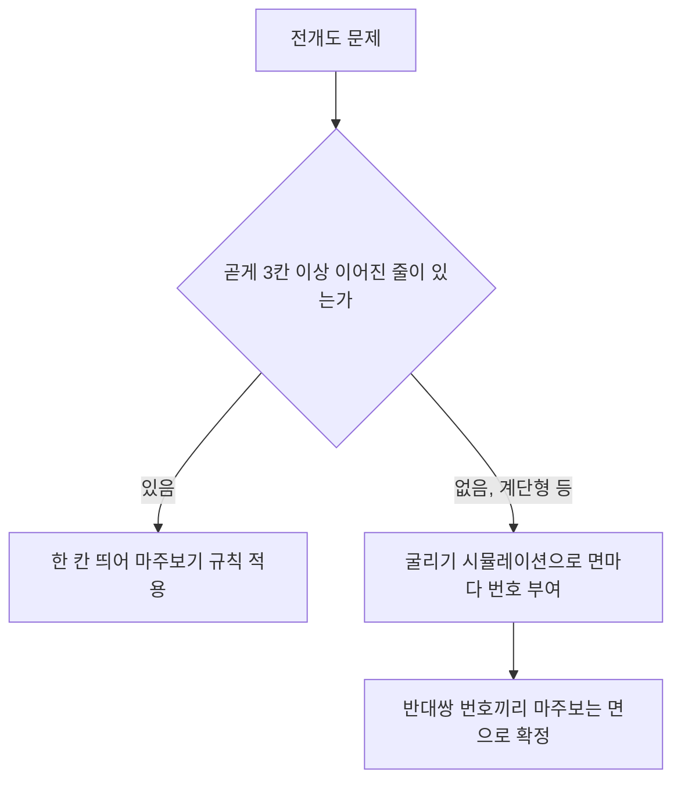

<Callout type="info">
  **이번 문서의 목표:** 정육면체 전개도에서 마주보는 면을 두 가지 방법으로 찾아낼 수 있고, 접었을 때 서로 다른 두 면의 모서리가 새로 맞닿는 관계와 무늬·화살표의 방향 변화를 정확히 판단할 수 있게 된다.
</Callout>

## 왜 평면 그림에서 입체를 상상해야 하는가

04편에서 입체도형의 면·모서리·꼭짓점이라는 용어와 "접는다"는 개념 자체를 익혔습니다. 전개도 문제는 그 개념을 실전에 옮겨, **평평하게 펼쳐진 6개의 정사각형 그림만 보고 그것을 접었을 때의 입체 모양을 머릿속으로 재구성**하는 능력을 시험합니다.

이 유형이 어려운 이유는 종이는 평면인데 우리가 답해야 하는 것은 3차원 공간의 관계이기 때문입니다. 전개도 위에서 멀리 떨어진 두 칸이 실제로 접으면 딱 붙는 이웃이 되기도 하고, 반대로 가까이 붙어 있던 두 칸이 접으면 서로 정반대편(마주보는 면)이 되기도 합니다.

> **쉽게 말하면:** 전개도는 상자를 뜯어서 평평하게 펼쳐 놓은 종이입니다. 이 문서는 그 종이를 다시 접었을 때 "어느 면이 어느 면과 마주보는가", "어느 모서리가 어느 모서리와 만나는가"를 그림 없이도 알아내는 방법을 다룹니다.

## 정의부터 정리합니다

**정육면체**(正六面體)는 정사각형 6개로 둘러싸인 입체도형으로, 6개의 면, 12개의 모서리, 8개의 꼭짓점을 가집니다(04편). **전개도**(展開圖)는 이 정육면체의 겉면을 한 번도 자르지 않고 모서리를 따라 펼쳐 평면 위에 나열한 그림입니다. **마주보는 면**은 정육면체를 완성했을 때 서로 반대쪽에 위치해 절대 만나지 않는 한 쌍의 면을 뜻합니다. 정육면체는 6개 면이 있으므로 마주보는 면은 항상 정확히 3쌍입니다.

## 규칙1 — 한 칸 띄어 마주보기(곧은 줄에서만 통하는 지름길)

전개도 안에서 정사각형들이 **가로 또는 세로로 곧게 3칸 이상 이어져 있을 때**, 그 줄 안에서 **사이에 정확히 한 칸을 두고 떨어진 두 면은 마주보는 면**입니다.

### 예시로 확인해 봅시다 — 십자형 전개도

```
   [A]
[B][C][D][E]
   [F]
```

**세로줄**을 봅니다. A-C-F가 세로로 곧게 이어져 있습니다. A와 F 사이에 C 하나가 있으므로 **A와 F는 마주보는 면**입니다.

**가로줄**을 봅니다. B-C-D-E 네 칸이 가로로 곧게 이어져 있습니다. B와 D 사이에 C 하나가 있으므로 **B와 D는 마주보는 면**입니다. 또한 C와 E 사이에 D 하나가 있으므로 **C와 E도 마주보는 면**입니다.

이렇게 세 쌍(A-F, B-D, C-E)이 모두 나와 여섯 면이 정확히 둘로 나뉘어 짝지어졌습니다. 이 결과는 뒤에서 다룰 굴리기 방법으로도 똑같이 확인됩니다.

**규칙의 한계:** 이 지름길은 **곧게 3칸 이상 이어진 줄에서만** 성립합니다. 줄이 중간에 꺾이거나(계단형), 한 줄에 2칸씩만 이어져 있으면 이 규칙만으로는 답을 낼 수 없습니다.

## 규칙2 — 어떤 모양의 전개도에도 통하는 방법: 굴리기 시뮬레이션

곧은 줄이 없는 전개도에는 실제 주사위를 굴리듯 면을 하나씩 넘겨 가며 확인하는 방법을 씁니다. 원리는 간단합니다. **정육면체를 종이 위에 놓고, 전개도의 연결 순서를 따라 옆으로 넘어뜨리면서 굴리면, 그 정육면체가 최종적으로 만드는 모양이 곧 전개도를 접었을 때의 모양과 같습니다.**

### 굴리는 규칙

정육면체의 여섯 면을 위·아래·동·서·남·북(전개도를 지도처럼 놓았을 때 오른쪽이 동, 아래쪽이 남입니다) 여섯 자리로 생각합니다. 어느 방향으로 굴리든 **위-아래, 동-서, 남-북은 항상 서로 마주보는 자리**라는 사실이 굴리는 내내 유지됩니다.

- **동쪽으로 굴리면:** 아래면은 원래 동쪽 면이 되고, 위면은 원래 서쪽 면이 됩니다. 동쪽 면은 원래 위면이, 서쪽 면은 원래 아래면이 됩니다. 남쪽·북쪽 면은 그대로입니다.
- **서쪽으로 굴리면:** 아래면은 원래 서쪽 면, 위면은 원래 동쪽 면이 됩니다. 동쪽 면은 원래 아래면이, 서쪽 면은 원래 위면이 됩니다. 남쪽·북쪽 면은 그대로입니다.
- **북쪽으로 굴리면:** 아래면은 원래 북쪽 면, 위면은 원래 남쪽 면이 됩니다. 북쪽 면은 원래 위면이, 남쪽 면은 원래 아래면이 됩니다. 동쪽·서쪽 면은 그대로입니다.
- **남쪽으로 굴리면:** 아래면은 원래 남쪽 면, 위면은 원래 북쪽 면이 됩니다. 남쪽 면은 원래 위면이, 북쪽 면은 원래 아래면이 됩니다. 동쪽·서쪽 면은 그대로입니다.



### 예시로 계산해 봅시다 — 계단형 전개도

```
[A][B]
   [C][D]
      [E][F]
```

한 줄에 곧게 3칸 이상 이어진 곳이 없으므로 규칙1을 쓸 수 없습니다. 대신 실제 주사위처럼 **마주보는 면의 눈의 합이 7**이 되도록(1-6, 2-5, 3-4) 번호를 붙이고 굴려 봅시다. A에서 시작해 아래=6, 위=1, 북=2, 남=5, 동=3, 서=4로 정합니다.

<Steps>

1. **A에서 B로(동쪽으로 한 칸):** 아래=원래 동(3), 위=원래 서(4), 동=원래 위(1), 서=원래 아래(6), 남·북 그대로(2, 5). → **B의 번호는 3**입니다.
2. **B에서 C로(같은 열에서 한 행 아래이므로 남쪽으로 한 칸):** 아래=원래 남(5), 위=원래 북(2), 북=원래 아래(3), 남=원래 위(4), 동·서 그대로(1, 6). → **C의 번호는 5**입니다.
3. **C에서 D로(동쪽으로 한 칸):** 아래=원래 동(1), 위=원래 서(6), 동=원래 위(2), 서=원래 아래(5), 남·북 그대로(3, 4). → **D의 번호는 1**입니다.
4. **D에서 E로(남쪽으로 한 칸):** 아래=원래 남(4), 위=원래 북(3), 북=원래 아래(1), 남=원래 위(6), 동·서 그대로(2, 5). → **E의 번호는 4**입니다.
5. **E에서 F로(동쪽으로 한 칸):** 아래=원래 동(2), 위=원래 서(5), 동=원래 위(3), 서=원래 아래(4), 남·북 그대로(1, 6). → **F의 번호는 2**입니다.

</Steps>

정리하면 A=6, B=3, C=5, D=1, E=4, F=2입니다. 여섯 개 번호가 1부터 6까지 하나씩 빠짐없이 나왔으므로 계산에 모순이 없습니다. 반대쌍(1-6, 2-5, 3-4)에 맞춰 짝을 지으면 **A(6)와 D(1)**, **C(5)와 F(2)**, **B(3)와 E(4)가** 각각 마주보는 면입니다.

**해석:** 곧은 줄이 없는 전개도라도 굴리기 방법으로는 항상 답을 낼 수 있습니다. 다만 시험장에서는 시간이 걸리므로, 먼저 규칙1(한 칸 띄어 마주보기)로 곧은 줄부터 빠르게 처리하고, 그래도 안 풀리는 나머지 면에만 굴리기를 적용하는 것이 효율적입니다.

## 접었을 때 새로 맞닿는 모서리

전개도에서 원래 붙어 있던 두 칸(가령 위 십자형 전개도의 C와 D)은 접어도 그 변 그대로 서로의 경계가 됩니다. 문제는 **전개도에서는 멀리 떨어져 있었지만 접으면 새로 맞닿는 모서리**입니다.

십자형 전개도(C를 앞면으로 놓고 접기)를 예로 들면, C가 앞면, D가 오른쪽 옆면, E가 뒷면, B가 왼쪽 옆면, A가 윗면, F가 아랫면이 됩니다. B-C-D-E 네 면이 옆면을 한 바퀴 둘러싸는 띠를 이루기 때문에, **가장 왼쪽 면(B)과 가장 오른쪽 면(E)이 띠의 이음매에서 새로 만나 맞닿는 모서리를 이룹니다.** 전개도 위에서는 B와 E가 두 칸이나 떨어져 있어 전혀 상관없어 보이지만, 실제로 접으면 바로 옆에서 만나는 것입니다.

> **쉽게 말하면:** 가로로 나란히 이어진 면들을 접으면 종이 띠를 원통처럼 둥글게 마는 것과 같아서, 띠의 양쪽 끝이 서로 만나 새 이음매를 만듭니다.

## 무늬·화살표가 있는 전개도

화살표나 무늬가 그려진 면은 방향까지 맞혀야 해서 체감 난이도가 높지만, 지켜야 할 원칙은 하나뿐입니다.

> **면은 접힐 때 통째로 기울어질 뿐, 그 면 안에서 회전하지 않습니다.** 따라서 화살표가 그 면의 어느 변을 향하는지는 전개도에 그려진 모습 그대로 유지됩니다. 달라지는 것은 그 변이 접힌 뒤 **어느 면과 맞닿는가**뿐입니다.

앞의 예시를 그대로 이어가 봅시다. E(뒷면)에 그려진 화살표가 E의 오른쪽 변을 향하고 있다고 합시다. E의 오른쪽 변은 전개도에서 아무 면과도 붙어 있지 않은 자유변인데, 앞서 확인했듯 이 자유변은 접으면 B(왼쪽 옆면)의 왼쪽 자유변과 새로 맞닿습니다. 따라서 접은 뒤 이 화살표는 **B와 맞닿는 모서리 쪽**을 가리키게 됩니다.

**풀이 순서:** 화살표가 그 면의 어느 변을 향하는지 전개도에서 그대로 읽고, 그 변이 최종적으로 어느 면과 맞닿는지(원래 붙어 있던 변인지, 아니면 띠가 감기며 새로 만나는 자유변인지)를 규칙1·규칙2로 확인한 뒤, 두 정보를 합쳐 최종 방향을 판단합니다.

## 자주 틀리는 점

- **곧게 이어지지 않은 줄에 한 칸 띄어 마주보기 규칙을 억지로 적용합니다.** 계단형·지그재그형처럼 3칸 이상 곧게 이어진 줄이 없는 전개도에는 이 규칙이 아예 적용되지 않습니다. 반드시 곧은 줄인지부터 확인해야 합니다.
- **전개도에서 가까운 두 면을 무조건 이웃하는 면으로 착각합니다.** 대각선으로 붙어 있어 보이는 두 칸은 실제로 접으면 꼭짓점에서만 만나거나 아예 만나지 않을 수 있습니다. 이웃 여부는 반드시 접는 순서를 따라 확인해야 합니다.
- **전개도에서 멀리 떨어진 두 면은 접어도 안 만난다고 단정합니다.** 앞서 본 B와 E처럼, 옆면들이 두르는 띠의 양 끝은 전개도에서 가장 멀리 있어도 실제로는 바로 이웃한 모서리가 됩니다.
- **화살표가 면과 함께 회전한다고 착각합니다.** 화살표는 그 면 안에서는 그려진 그대로 고정되어 있고, 변하는 것은 그 화살표가 가리키는 변이 최종적으로 어떤 면과 맞닿느냐입니다.
- **마주보는 면끼리 서로 이웃한다고 착각합니다.** 정의상 마주보는 두 면은 정육면체에서 서로 반대쪽에 있으므로 어떤 모서리에서도 만나지 않습니다.

## 핵심 정리

- 정육면체는 면이 6개이므로 마주보는 면은 항상 3쌍이다.
- 곧게 3칸 이상 이어진 줄에서는 **한 칸 띄어 마주보기** 규칙으로 빠르게 마주보는 면을 찾는다.
- 곧은 줄이 없는 계단형 전개도에는 **굴리기 시뮬레이션**(마주보는 면의 합이 7이 되도록 번호를 매기고 연결 순서대로 굴림)을 쓴다. 두 방법은 같은 전개도에 대해 항상 같은 결과를 준다.
- 옆면들이 두르는 띠의 양쪽 끝처럼, 전개도에서 멀리 떨어진 두 면이 접으면 새로 맞닿는 경우가 있다.
- 화살표·무늬는 면 안에서는 그려진 그대로 유지되며, 그 변이 최종적으로 어느 면과 맞닿는지만 확인하면 된다.

## 마무리 복습

<Quiz
  questionNumber={1}
  question="위에 A, 가운데 줄에 B C D E, 아래에 F가 놓인 십자형 전개도에서 세로줄 A-C-F에 한 칸 띄어 마주보기 규칙을 적용할 때 마주보는 면은?"
  options={['A와 C', 'A와 F', 'C와 F', 'B와 D']}
  correctAnswer={2}
  explanation="세로줄 A-C-F에서 A와 F 사이에 C 하나가 있으므로 한 칸 띄어 마주보기 규칙에 따라 A와 F가 마주보는 면이다."
  optionExplanations={['A와 C는 바로 이웃한 면이지 마주보는 면이 아니다.', 'A와 F 사이에 C 하나가 있으므로 마주보는 면이 맞다.', 'C와 F도 바로 이웃한 면이지 마주보는 면이 아니다.', 'B와 D는 가로줄에서 찾는 짝이며 세로줄과는 무관하다.']}
/>

<Quiz
  questionNumber={2}
  question="같은 십자형 전개도에서 가로줄 B-C-D-E 네 칸에 한 칸 띄어 마주보기 규칙을 적용할 때, 옳게 짝지은 것은?"
  options={['B와 D, C와 E', 'B와 C, D와 E', 'B와 E, C와 D', 'B와 D, B와 E']}
  correctAnswer={1}
  explanation="B와 D 사이에는 C 하나가, C와 E 사이에는 D 하나가 있으므로 두 규칙을 각각 적용하면 B-D와 C-E가 마주보는 면 쌍이 된다."
  optionExplanations={['B와 D 사이에 C, C와 E 사이에 D가 있으므로 두 쌍 모두 규칙에 맞다.', 'B와 C, D와 E는 사이에 낀 칸이 없는 바로 이웃한 면이다.', 'B와 E는 사이에 두 칸이 있어 한 칸 띄어 마주보기 규칙에 맞지 않는다.', '한 면이 두 개의 서로 다른 면과 동시에 마주볼 수는 없다.']}
/>

<Quiz
  questionNumber={3}
  question="어느 방향으로도 3칸 이상 곧게 이어지지 않은 계단형 전개도에서 마주보는 면을 확실히 찾는 가장 신뢰할 수 있는 방법은?"
  options={['한 칸 띄어 마주보기 규칙을 그대로 적용한다', '전개도의 첫 번째 칸과 마지막 칸을 무조건 마주보는 면으로 추정한다', '마주보는 면의 합이 7이 되도록 번호를 매기고 연결 순서대로 굴려 확인한다', '두 면의 그림이 비슷하게 생겼는지 눈대중으로 비교한다']}
  correctAnswer={3}
  explanation="곧게 이어진 줄이 없으면 한 칸 띄어 마주보기 규칙 자체가 적용되지 않는다. 이런 경우에는 굴리기 시뮬레이션으로 각 면에 번호를 매겨 반대쌍 번호를 확인하는 방법이 모양과 관계없이 항상 정확하다."
  optionExplanations={['곧은 줄이 없으므로 이 규칙은 애초에 적용 대상이 아니다.', '전개도의 배치 순서와 실제 마주보는 관계는 직접적인 규칙이 없다.', '연결 순서대로 굴리며 번호를 매기면 어떤 모양의 전개도에도 정확히 적용된다.', '무늬나 모양의 유사성은 마주보는 면 여부와 아무 관련이 없다.']}
/>

<Quiz
  questionNumber={4}
  question="정육면체를 굴리는 규칙에 대한 설명으로 옳은 것은?"
  options={['동쪽으로 굴리면 위면은 원래 동쪽 면이 된다', '동쪽으로 굴리면 아래면은 원래 동쪽 면이 된다', '북쪽으로 굴리면 동쪽 면과 서쪽 면이 서로 바뀐다', '남쪽으로 굴리면 위면과 아래면은 그대로 유지된다']}
  correctAnswer={2}
  explanation="동쪽으로 굴리면 동쪽에 있던 면이 바닥에 닿아 새 아래면이 되고, 원래 서쪽 면이 위로 올라와 새 위면이 된다."
  optionExplanations={['동쪽으로 굴리면 위면은 원래 서쪽 면이 된다.', '동쪽 면이 바닥으로 굴러 내려가 새 아래면이 되므로 옳다.', '북쪽으로 굴릴 때는 동쪽·서쪽 면이 그대로 유지되고 위·아래·남·북이 바뀐다.', '남쪽으로 굴리면 위면과 아래면이 각각 북쪽 면과 남쪽 면으로 바뀐다.']}
/>

<Quiz
  questionNumber={5}
  question="위에 A, 가운데 줄에 B C D E, 아래에 F가 놓인 십자형 전개도를 C가 앞면이 되도록 접으면 D는 오른쪽 옆면, E는 뒷면, B는 왼쪽 옆면이 된다. 전개도에서는 멀리 떨어져 있지만 실제로 접으면 새로 맞닿는 모서리 관계로 옳은 것은?"
  options={['A와 F가 서로 맞닿는다', 'B의 왼쪽 변과 E의 오른쪽 변이 새로 맞닿는다', 'B와 C가 새로 맞닿는다', 'C와 E가 서로 맞닿는다']}
  correctAnswer={2}
  explanation="B와 E는 옆면을 두르는 띠의 양쪽 끝이므로 띠가 둥글게 말리면서 B의 왼쪽 자유변과 E의 오른쪽 자유변이 새로 맞닿는 모서리가 된다."
  optionExplanations={['A와 F는 마주보는 면이므로 정의상 어떤 모서리에서도 맞닿지 않는다.', '띠의 양 끝인 B와 E가 새로 만나 맞닿는 모서리를 이루므로 옳다.', 'B와 C는 전개도에서 원래부터 붙어 있던 사이라 새로 맞닿는 관계가 아니다.', 'C와 E는 마주보는 면이므로 맞닿지 않는다.']}
/>

<Quiz
  questionNumber={6}
  question="전개도에 그려진 화살표의 방향 변화에 대한 설명으로 가장 적절한 것은?"
  options={['접는 과정에서 면 자체가 회전하므로 화살표가 향하는 변도 함께 바뀐다', '접어도 화살표가 그 면 안에서 가리키는 변은 전개도에 그려진 그대로 유지되며, 달라지는 것은 그 변이 어떤 면과 맞닿는가이다', '화살표는 항상 접는 방향과 반대쪽을 가리키게 된다', '화살표가 그려진 면은 접었을 때 항상 아랫면이 된다']}
  correctAnswer={2}
  explanation="면은 접힐 때 통째로 기울어질 뿐 그 면 안에서 회전하지 않으므로, 화살표가 향하는 변은 전개도에 그려진 그대로 유지된다. 달라지는 것은 그 변이 최종적으로 어느 면과 맞닿는지뿐이다."
  optionExplanations={['면 자체는 회전하지 않고 통째로 기울어질 뿐이므로 화살표가 향하는 변은 바뀌지 않는다.', '면 안에서 화살표 방향은 유지되고 맞닿는 면만 달라지므로 옳다.', '화살표의 방향은 접는 방향과 무관하게 전개도에 그려진 그대로 정해진다.', '화살표가 그려진 면의 최종 위치는 전개도의 연결 구조에 따라 달라진다.']}
/>

## 참고 자료

- [링커리어 - 인적성 검사 공부법 GSAT·SKCT·HMAT, 2026 최신 시험 구성 비교](https://community.linkareer.com/employment_data/6482010)
- [나무위키 - 적성검사](https://namu.wiki/w/%EC%A0%81%EC%84%B1%EA%B2%80%EC%82%AC)
