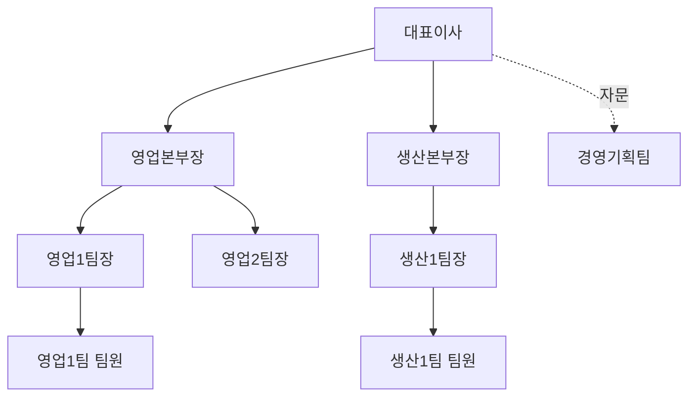

<Callout type="info">
  **이번 문서의 목표:** 조직도에서 부서 간 관계와 결재 라인을 정확히 읽고, SWOT 분석으로 전략 방향을 도출하며, 국제감각·업무이해 유형에서 자주 나오는 직급·문서 상식을 판정할 수 있게 된다.
</Callout>

## 왜 필요한가

22편에서는 개별 업무 상황에서 무엇을 우선해야 하는지 판단하는 기준을 배웠습니다. 이번에는 그 판단이 일어나는 **무대**, 곧 조직 자체를 이해하는 편입니다. 조직이해 유형은 "이 조직도에서 어느 부서에 물어봐야 하는가", "이 문서는 누가 결재해야 하는가", "이 상황에서는 어떤 경영 전략이 적절한가"처럼, 회사라는 구조 안에서 정보를 읽어 내는 능력을 확인합니다.

> **쉽게 말하면:** 조직이해는 "회사가 어떻게 짜여 있고, 누가 무엇을 결정하며, 그 결정을 어떤 논리로 내리는가"를 읽어 내는 능력입니다.

## 조직도와 계층 구조 읽는 법

### 왜 필요한가

조직도 문제는 그림 하나를 주고 "특정 부서는 어느 상위 조직에 속하는가", "이 두 부서는 서로 어떤 관계인가"를 묻습니다. 조직도의 선이 실선인지 점선인지, 박스가 세로로 이어지는지 가로로 나란한지에 따라 관계의 의미가 달라지므로, 기호를 읽는 규칙을 먼저 알아야 합니다.

### 정의: 라인 조직과 스태프 조직

조직 구성원을 잇는 선은 크게 두 종류의 관계를 나타냅니다.

- **라인**(line, 직계) **조직**: 지시와 보고가 오가는 수직 관계입니다. 팀장이 팀원에게 업무를 지시하고 팀원이 결과를 보고하는 관계로, 조직도에서 보통 실선으로 표시됩니다
- **스태프**(staff, 참모) **조직**: 라인 조직을 옆에서 지원·자문하는 관계입니다. 인사팀이나 법무팀처럼 다른 부서에 직접 지시할 권한은 없지만 전문 지식으로 조언하는 역할이며, 조직도에서 점선으로 표시되는 경우가 많습니다

**해석:** 위 조직도에서 대표이사부터 팀원까지 실선으로 이어진 경로는 지시와 보고가 오가는 **라인**입니다. 반면 경영기획팀은 점선으로 연결되어, 대표이사에게 자문은 하지만 영업본부장이나 생산본부장에게 직접 지시를 내리는 위치가 아닙니다. **영업1팀 팀원이 급한 결재를 받아야 할 때 거쳐야 하는 경로**를 묻는다면 답은 영업1팀장 → 영업본부장 → 대표이사 순으로, 실선을 따라 올라가는 경로입니다.

### 조직 구조의 세 가지 유형

| 유형 | 특징 | 장점 | 단점 |
|------|------|------|------|
| 기능별 조직 | 영업·생산·인사처럼 업무 기능별로 부서를 나눔 | 전문성이 깊어짐 | 부서 간 협업이 느려짐 |
| 사업부제 조직 | 제품이나 지역별로 독립된 사업부를 둠 | 시장 변화에 빠르게 대응 | 기능이 사업부마다 중복됨 |
| 매트릭스 조직 | 기능 조직과 프로젝트 조직을 동시에 운영 | 자원을 유연하게 활용 | 한 사람이 두 명의 상사에게 보고해 혼란이 생기기 쉬움 |

**자주 틀리는 점:** 매트릭스 조직에서는 "보고 라인이 하나뿐이어야 한다"는 상식이 깨집니다. 기능 부서장과 프로젝트 책임자 모두에게 동시에 보고하는 구조가 정상이라는 점을 놓치면 관련 문제를 틀리기 쉽습니다.

### 결재 라인 읽는 법 — 전결과 대결

문서를 작성해 승인을 받는 과정을 **결재**라 하며, 여기에도 정해진 규칙이 있습니다.

| 용어 | 의미 |
|------|------|
| 기안 | 실무자가 안건을 문서로 작성해 결재를 올리는 것 |
| 전결 | 원래 결재권자가 자신의 권한 일부를 하위 직급자에게 미리 위임해, 그 하위 직급자가 최종 결재자로서 서명하는 것 |
| 대결 | 결재권자가 휴가나 출장 등으로 부재중일 때, 그 대리인이 임시로 대신 결재하는 것 |
| 후결 | 대결로 처리된 문서를 결재권자가 복귀한 뒤 확인차 다시 서명하는 것 |

**계산·적용 예시.** 사내 규정상 100만 원 이하 지출은 팀장 전결, 100만 원 초과는 본부장 결재라고 정해져 있다고 합시다. 팀원이 80만 원짜리 물품 구매를 기안했다면, 이 문서는 본부장까지 갈 필요 없이 **팀장의 전결로 처리가 끝납니다.** 만약 120만 원짜리 구매라면 본부장까지 결재선이 올라가야 합니다.

**해석:** "전결"은 결재권을 아예 넘겨준 것이므로 그 하위 직급자의 서명이 곧 최종 승인이고, 원래 결재권자에게 다시 물어볼 필요가 없습니다. 반면 "대결"은 결재권자가 잠시 없을 때뿐인 임시 조치이므로, 문서 종류에 따라 결재권자가 돌아오면 사후 보고나 후결이 필요할 수 있습니다.

## 경영 전략 기초 개념

### 왜 필요한가

조직이해 유형에는 "이 회사가 처한 상황에서 어떤 전략이 적절한가"를 묻는 사례형 문제가 나옵니다. 이때 가장 많이 쓰이는 분석 틀이 SWOT입니다.

> **쉽게 말하면:** **SWOT**은 회사를 둘러싼 상황을 내부(강점·약점)와 외부(기회·위협) 두 축으로 나눠 표로 정리하고, 그 조합에서 전략을 뽑아내는 도구입니다.

### 정의: SWOT의 네 요소

**SWOT**은 강점(Strength), 약점(Weakness), 기회(Opportunity), 위협(Threat)의 앞글자를 딴 이름입니다.

| 구분 | 내부 요인 | 외부 요인 |
|------|-----------|-----------|
| 긍정적 | 강점(S) — 경쟁사보다 뛰어난 점 | 기회(O) — 회사에 유리하게 바뀌는 환경 |
| 부정적 | 약점(W) — 경쟁사보다 부족한 점 | 위협(T) — 회사에 불리하게 바뀌는 환경 |

**예시.** 한 식품 회사가 "국내 최고 수준의 냉동 기술 보유(강점)", "해외 유통망 부족(약점)", "건강식 수요 증가(기회)", "원자재 가격 상승(위협)"이라는 상황에 있다고 합시다.

### 계산·적용 — 네 요소를 조합해 전략 뽑기

SWOT 분석의 진짜 목적은 네 요소를 나열하는 데서 끝나지 않고, 요소를 **짝지어** 구체적인 전략으로 연결하는 것입니다.

| 조합 | 전략 방향 | 이 회사의 예 |
|------|-----------|--------------|
| 강점 + 기회(SO) | 강점으로 기회를 최대한 살린다 | 뛰어난 냉동 기술로 건강식 수요 증가에 맞춘 신제품을 낸다 |
| 약점 + 기회(WO) | 약점을 보완해 기회를 놓치지 않는다 | 해외 유통 파트너와 제휴해 부족한 유통망을 메운다 |
| 강점 + 위협(ST) | 강점으로 위협을 방어한다 | 뛰어난 기술력으로 원가 상승분을 효율화로 상쇄한다 |
| 약점 + 위협(WT) | 약점과 위협이 겹치는 최악의 상황을 피한다 | 유통망이 약한 해외 시장 진출은 원자재 가격이 안정될 때까지 미룬다 |

**해석:** 문제에서 "이 상황에 가장 적절한 전략은?"이라고 물을 때는, 제시된 상황이 강점·약점·기회·위협 중 어느 두 가지의 조합인지 먼저 분류한 다음 표의 방향에 맞는 보기를 고르면 됩니다. **자주 틀리는 점**은 강점을 활용하는 전략(SO, ST)과 약점을 보완하는 전략(WO, WT)을 서로 뒤바꿔 놓은 보기를 정답으로 착각하는 것입니다.

### 의사결정의 기본 절차

경영 의사결정도 정해진 순서를 따를 때 오류가 줄어듭니다.

<Steps>

1. **목표를 설정한다** — 무엇을 이루고자 하는지 먼저 명확히 한다
2. **대안을 탐색한다** — 목표를 이룰 수 있는 여러 방법을 가능한 한 많이 나열한다
3. **대안을 평가한다** — 각 대안의 비용·효과·위험을 비교한다
4. **최선의 대안을 선택하고 실행한다**
5. **실행 결과를 평가하고 다음 결정에 반영한다**

</Steps>

**자주 틀리는 점:** 대안을 하나만 떠올린 상태에서 바로 실행으로 넘어가는 흐름이 제시되면, 이는 "대안 탐색과 평가를 건너뛴 성급한 의사결정"이라는 함정으로 자주 출제됩니다.

## 국제감각·업무이해 상식

### 직급 체계 읽는 법

한국 기업의 일반적인 직급 체계는 다음과 같은 순서를 가집니다(회사마다 명칭과 순서는 조금씩 다를 수 있습니다).

| 순서(낮음 → 높음) | 사원 | 대리 | 과장 | 차장 | 부장 | 이사 | 상무 | 전무 | 부사장 | 사장 |
|---|---|---|---|---|---|---|---|---|---|---|
| 구분 | 실무자 | 실무자 | 실무자·초급 관리자 | 중간 관리자 | 중간 관리자 | 임원 | 임원 | 임원 | 임원 | 최고경영진 |

**해석:** "사원부터 부장까지"는 실무를 직접 수행하며 팀을 관리하는 직급이고, "이사부터"는 회사 전체의 경영 방향을 결정하는 임원급입니다. 조직도 문제에서 "이 직급들을 낮은 순서부터 나열하시오" 같은 유형은 이 순서를 그대로 외워 두면 바로 풀립니다.

### 자주 쓰는 결재 문서의 종류

| 문서 | 용도 |
|------|------|
| 기안서 | 새로운 업무나 정책을 제안하고 결재를 요청하는 문서 |
| 품의서 | 예산 집행이나 구매처럼 비용이 드는 안건의 승인을 요청하는 문서 |
| 지출결의서 | 실제로 비용을 지출하기 전에 그 내역을 확정하고 승인받는 문서 |
| 보고서 | 이미 진행했거나 진행 중인 업무의 경과와 결과를 알리는 문서 |

**자주 틀리는 점:** 품의서와 지출결의서를 같은 것으로 혼동하기 쉬운데, 품의서는 "이 비용을 써도 되는지" 사전에 승인을 구하는 문서이고 지출결의서는 승인된 예산 안에서 "실제로 얼마를 언제 지출할지" 확정하는 문서로 순서상 품의서가 먼저입니다.

### 국제 업무 기초 예절

해외 파트너와 일할 때 자주 언급되는 기본 원칙 몇 가지는 다음과 같습니다.

- **명함 교환**: 상대방보다 먼저 건네는 것이 예의이며, 받은 명함은 그 자리에서 바로 주머니에 넣지 않고 잠시 살펴본 뒤 정중히 보관합니다
- **호칭**: 문화권에 따라 이름을 바로 부르는 것이 자연스러운 곳도 있고, 반드시 직함을 붙여야 하는 곳도 있으므로 상대의 문화를 먼저 확인합니다
- **회신 속도**: 시차가 있는 상대와 일할 때는 상대방의 근무 시간을 고려해 요청 사항과 마감 기한을 명확히 적어 두면 불필요한 왕복을 줄일 수 있습니다

## 핵심 정리

- 조직도의 **실선**은 지시·보고가 오가는 라인 조직, **점선**은 자문 역할의 스태프 조직을 나타낸다.
- 조직 구조는 기능별(전문성)·사업부제(시장 대응)·매트릭스(두 명의 상사에게 동시 보고) 세 유형으로 나뉜다.
- **전결**은 결재권을 미리 위임받아 그 자체로 최종 승인이 되고, **대결**은 결재권자 부재중의 임시 대리 결재다.
- SWOT은 강점·약점(내부)과 기회·위협(외부)을 조합해 SO·WO·ST·WT 네 방향의 전략을 도출하는 도구다.
- 의사결정은 목표 설정 → 대안 탐색 → 대안 평가 → 선택·실행 → 평가 순서를 따라야 성급한 결정을 피할 수 있다.
- 품의서(사전 승인)와 지출결의서(실제 지출 확정)는 순서와 목적이 다른 별개의 문서다.

## 마무리 복습

<Quiz
  questionNumber={1}
  question="조직도에서 실선으로 연결된 관계와 점선으로 연결된 관계에 대한 설명으로 옳은 것은?"
  options={['실선은 자문 관계, 점선은 지시-보고 관계를 나타낸다', '실선은 지시-보고가 오가는 라인 조직, 점선은 자문 역할의 스태프 조직을 나타낸다', '실선과 점선은 같은 의미로 편의상 다르게 그린 것이다', '점선으로 연결된 부서는 조직도에서 가장 상위 부서다']}
  correctAnswer={2}
  explanation="일반적으로 실선은 지시와 보고가 오가는 라인 조직 관계를, 점선은 직접 지시 권한 없이 자문·지원하는 스태프 조직 관계를 나타낸다."
  optionExplanations={['실선과 점선이 나타내는 관계가 서로 바뀐 설명이다.', '실선은 라인, 점선은 스태프라는 구분이 정확하다.', '두 선은 서로 다른 종류의 권한 관계를 나타내므로 같은 의미가 아니다.', '점선 연결은 위계상 위치가 아니라 관계의 성격을 나타낼 뿐이다.']}
/>

<Quiz
  questionNumber={2}
  question="매트릭스 조직의 특징으로 가장 적절한 것은?"
  options={['한 사람이 반드시 한 명의 상사에게만 보고한다', '제품이나 지역별로 완전히 독립된 사업부를 운영한다', '기능 조직과 프로젝트 조직을 동시에 운영해 한 사람이 두 명의 상사에게 보고할 수 있다', '전문성이 가장 깊어지는 대신 시장 변화에 가장 느리게 대응한다']}
  correctAnswer={3}
  explanation="매트릭스 조직은 기능 부서장과 프로젝트 책임자 모두에게 동시에 보고하는 이중 보고 구조가 특징이다."
  optionExplanations={['이중 보고가 매트릭스 조직의 핵심 특징이므로 한 명에게만 보고한다는 설명은 틀렸다.', '독립된 사업부 운영은 사업부제 조직에 대한 설명이다.', '기능과 프로젝트를 함께 운영해 이중 보고가 생긴다는 설명이 매트릭스 조직의 특징과 일치한다.', '전문성 심화와 느린 대응은 기능별 조직에 대한 설명이다.']}
/>

<Quiz
  questionNumber={3}
  question="사내 규정상 100만 원 이하 지출은 팀장 전결이다. 팀원이 80만 원짜리 구매를 기안했을 때 결재 처리로 옳은 것은?"
  options={['본부장까지 결재를 받아야 한다', '팀장의 전결로 결재가 끝난다', '대표이사의 최종 서명이 필요하다', '금액과 무관하게 항상 본부장 결재가 필요하다']}
  correctAnswer={2}
  explanation="80만 원은 100만 원 이하이므로 팀장에게 위임된 전결 권한 안에서 처리되며 팀장의 서명이 곧 최종 승인이다."
  optionExplanations={['전결 기준 금액 이하이므로 본부장까지 갈 필요가 없다.', '전결은 결재권을 위임받아 그 자체로 최종 승인이 되므로 옳은 설명이다.', '전결 규정이 있는 상황에서 매번 대표이사까지 갈 필요는 없다.', '규정에 금액 기준으로 전결 권한이 정해져 있으므로 항상 본부장까지 가는 것은 아니다.']}
/>

<Quiz
  questionNumber={4}
  question="국내 최고 수준의 냉동 기술을 보유했지만(강점) 해외 유통망이 부족한(약점) 식품 회사가 건강식 수요 증가라는 기회를 맞았을 때, 부족한 유통망을 보완해 기회를 놓치지 않으려는 전략은 SWOT의 어느 조합에 해당하는가?"
  options={['SO(강점-기회)', 'WO(약점-기회)', 'ST(강점-위협)', 'WT(약점-위협)']}
  correctAnswer={2}
  explanation="약점을 보완해 기회를 살리는 전략은 약점과 기회를 조합한 WO 전략에 해당한다."
  optionExplanations={['SO는 강점으로 기회를 살리는 전략이며 약점 보완이 핵심인 이 상황과는 초점이 다르다.', '약점(유통망 부족)을 보완해 기회(수요 증가)를 놓치지 않으려는 것이므로 WO 전략이 정확하다.', 'ST는 강점으로 위협을 방어하는 전략이며 이 상황에는 위협 요소가 등장하지 않는다.', 'WT는 약점과 위협이 겹치는 상황을 피하는 전략이며 이 상황은 기회를 다루고 있다.']}
/>

<Quiz
  questionNumber={5}
  question="의사결정 절차 중 대안을 하나만 떠올린 상태에서 곧바로 실행으로 넘어가는 흐름에 대한 평가로 가장 적절한 것은?"
  options={['목표 설정 단계를 생략한 것이다', '대안 탐색과 평가 단계를 건너뛴 성급한 의사결정이다', '가장 이상적인 의사결정 절차다', '실행 결과 평가 단계를 생략한 것이다']}
  correctAnswer={2}
  explanation="여러 대안을 탐색하고 비교 평가하는 단계를 거치지 않고 하나의 대안으로 바로 실행에 들어가는 것은 대안 탐색과 평가를 건너뛴 성급한 의사결정에 해당한다."
  optionExplanations={['목표가 있었기에 대안을 떠올릴 수 있었으므로 목표 설정 자체가 생략된 것은 아니다.', '여러 대안을 비교하지 않고 하나로 바로 넘어간 것이 문제의 핵심이다.', '대안 탐색과 평가를 건너뛰는 것은 오류가 발생하기 쉬운 방식이다.', '아직 실행 이전 단계이므로 결과 평가 단계와는 관련이 없다.']}
/>

<Quiz
  questionNumber={6}
  question="품의서와 지출결의서의 차이에 대한 설명으로 가장 적절한 것은?"
  options={['품의서는 비용 지출 전 승인을 구하는 문서이고, 지출결의서는 승인된 예산 안에서 실제 지출 내역을 확정하는 문서다', '두 문서는 이름만 다를 뿐 완전히 같은 용도로 쓰인다', '지출결의서를 먼저 작성한 다음 품의서를 작성한다', '품의서는 결과 보고용 문서이고 지출결의서는 사전 승인용 문서다']}
  correctAnswer={1}
  explanation="품의서는 비용이 드는 안건에 대해 사전 승인을 구하는 문서이고, 지출결의서는 그 승인된 범위 안에서 실제 지출 내역을 확정하는 문서로 순서상 품의서가 먼저다."
  optionExplanations={['사전 승인과 지출 확정이라는 서로 다른 목적과 순서를 정확히 설명했다.', '두 문서는 목적과 작성 시점이 다른 별개의 문서다.', '승인을 먼저 구해야 하므로 품의서가 지출결의서보다 앞선다.', '품의서는 사전 승인용, 지출결의서는 지출 확정용으로 설명이 서로 바뀌었다.']}
/>

## 참고 자료

- [NCS 국가직무능력표준 – 직업기초능력 (공식)](https://www.ncs.go.kr/th03/TH0302List.do?dirSeq=121)
- [NCS 직업기초능력가이드북 – 조직이해능력 (공식)](https://www.ncs.go.kr/common/file/viewFile2.do?mgmtNo=47)
- [NCS 직업기초능력 필기평가 예시 문항집 (2021, 공식)](https://ncs.go.kr/blind/rh13/bbs_lib_view.do?libDstinCd=48&libSeq=20220114102003035)
