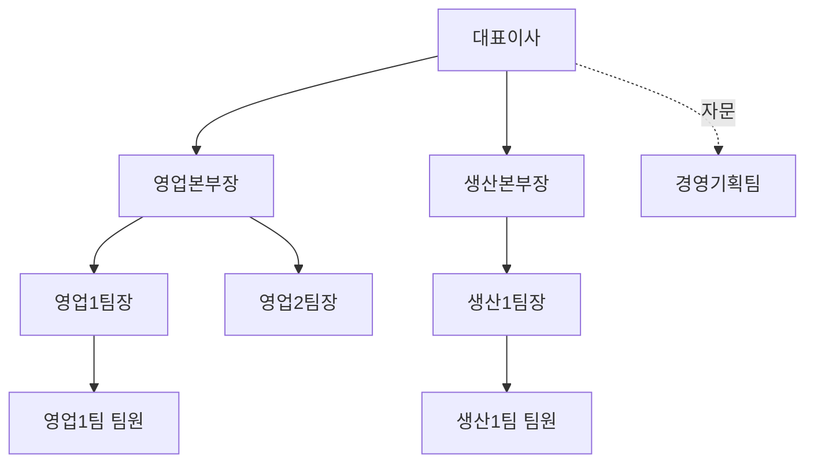

## 조직도와 계층 구조 읽는 법

### 정의: 라인 조직과 스태프 조직

조직 구성원을 잇는 선은 크게 두 종류의 관계를 나타냅니다.

- **라인**(line, 직계) **조직**: 지시와 보고가 오가는 수직 관계입니다. 팀장이 팀원에게 업무를 지시하고 팀원이 결과를 보고하는 관계로, 조직도에서 보통 실선으로 표시됩니다
- **스태프**(staff, 참모) **조직**: 라인 조직을 옆에서 지원·자문하는 관계입니다. 인사팀이나 법무팀처럼 다른 부서에 직접 지시할 권한은 없지만 전문 지식으로 조언하는 역할이며, 조직도에서 점선으로 표시되는 경우가 많습니다

```mermaid
graph TD
  A[대표이사] --> B[영업본부장]
  A --> C[생산본부장]
  A -.자문.-> D[경영기획팀]
  B --> E[영업1팀장]
  B --> F[영업2팀장]
  C --> G[생산1팀장]
  E --> H[영업1팀 팀원]
  G --> I[생산1팀 팀원]
```

**해석:** 위 조직도에서 대표이사부터 팀원까지 실선으로 이어진 경로는 지시와 보고가 오가는 **라인**입니다. **영업1팀 팀원이 급한 결재를 받아야 할 때 거쳐야 하는 경로**를 묻는다면 답은 영업1팀장 → 영업본부장 → 대표이사 순으로, 실선을 따라 올라가는 경로입니다.

### 조직 구조의 세 가지 유형

| 유형 | 특징 | 장점 | 단점 |
|------|------|------|------|
| 기능별 조직 | 영업·생산·인사처럼 업무 기능별로 부서를 나눔 | 전문성이 깊어짐 | 부서 간 협업이 느려짐 |
| 사업부제 조직 | 제품이나 지역별로 독립된 사업부를 둠 | 시장 변화에 빠르게 대응 | 기능이 사업부마다 중복됨 |
| 매트릭스 조직 | 기능 조직과 프로젝트 조직을 동시에 운영 | 자원을 유연하게 활용 | 한 사람이 두 명의 상사에게 보고해 혼란이 생기기 쉬움 |

**자주 틀리는 점:** 매트릭스 조직에서는 "보고 라인이 하나뿐이어야 한다"는 상식이 깨집니다. 기능 부서장과 프로젝트 책임자 모두에게 동시에 보고하는 구조가 정상이라는 점을 놓치면 관련 문제를 틀리기 쉽습니다.

### 결재 라인 읽는 법 — 전결과 대결

문서를 작성해 승인을 받는 과정을 **결재**라 하며, 여기에도 정해진 규칙이 있습니다.

| 용어 | 의미 |
|------|------|
| 기안 | 실무자가 안건을 문서로 작성해 결재를 올리는 것 |
| 전결 | 원래 결재권자가 자신의 권한 일부를 하위 직급자에게 미리 위임해, 그 하위 직급자가 최종 결재자로서 서명하는 것 |
| 대결 | 결재권자가 휴가나 출장 등으로 부재중일 때, 그 대리인이 임시로 대신 결재하는 것 |
| 후결 | 대결로 처리된 문서를 결재권자가 복귀한 뒤 확인차 다시 서명하는 것 |

**계산·적용 예시.** 사내 규정상 100만 원 이하 지출은 팀장 전결, 100만 원 초과는 본부장 결재라고 정해져 있다고 합시다. 팀원이 80만 원짜리 물품 구매를 기안했다면, 이 문서는 본부장까지 갈 필요 없이 **팀장의 전결로 처리가 끝납니다.** 만약 120만 원짜리 구매라면 본부장까지 결재선이 올라가야 합니다.

**해석:** "전결"은 결재권을 아예 넘겨준 것이므로 그 하위 직급자의 서명이 곧 최종 승인이고, 원래 결재권자에게 다시 물어볼 필요가 없습니다. 반면 "대결"은 결재권자가 잠시 없을 때뿐인 임시 조치이므로, 문서 종류에 따라 결재권자가 돌아오면 사후 보고나 후결이 필요할 수 있습니다.

## 경영 전략 기초 개념

### 정의: SWOT의 네 요소

**SWOT**은 강점(Strength), 약점(Weakness), 기회(Opportunity), 위협(Threat)의 앞글자를 딴 이름입니다.

| 구분 | 내부 요인 | 외부 요인 |
|------|-----------|-----------|
| 긍정적 | 강점(S) — 경쟁사보다 뛰어난 점 | 기회(O) — 회사에 유리하게 바뀌는 환경 |
| 부정적 | 약점(W) — 경쟁사보다 부족한 점 | 위협(T) — 회사에 불리하게 바뀌는 환경 |

**예시.** 한 식품 회사가 "국내 최고 수준의 냉동 기술 보유(강점)", "해외 유통망 부족(약점)", "건강식 수요 증가(기회)", "원자재 가격 상승(위협)"이라는 상황에 있다고 합시다.

### 계산·적용 — 네 요소를 조합해 전략 뽑기

SWOT 분석의 진짜 목적은 네 요소를 나열하는 데서 끝나지 않고, 요소를 **짝지어** 구체적인 전략으로 연결하는 것입니다.

| 조합 | 전략 방향 | 이 회사의 예 |
|------|-----------|--------------|
| 강점 + 기회(SO) | 강점으로 기회를 최대한 살린다 | 뛰어난 냉동 기술로 건강식 수요 증가에 맞춘 신제품을 낸다 |
| 약점 + 기회(WO) | 약점을 보완해 기회를 놓치지 않는다 | 해외 유통 파트너와 제휴해 부족한 유통망을 메운다 |
| 강점 + 위협(ST) | 강점으로 위협을 방어한다 | 뛰어난 기술력으로 원가 상승분을 효율화로 상쇄한다 |
| 약점 + 위협(WT) | 약점과 위협이 겹치는 최악의 상황을 피한다 | 유통망이 약한 해외 시장 진출은 원자재 가격이 안정될 때까지 미룬다 |

**해석:** 문제에서 "이 상황에 가장 적절한 전략은?"이라고 물을 때는, 제시된 상황이 강점·약점·기회·위협 중 어느 두 가지의 조합인지 먼저 분류한 다음 표의 방향에 맞는 보기를 고르면 됩니다. **자주 틀리는 점**은 강점을 활용하는 전략(SO, ST)과 약점을 보완하는 전략(WO, WT)을 서로 뒤바꿔 놓은 보기를 정답으로 착각하는 것입니다.

### 의사결정의 기본 절차

경영 의사결정도 정해진 순서를 따를 때 오류가 줄어듭니다.

**자주 틀리는 점:** 대안을 하나만 떠올린 상태에서 바로 실행으로 넘어가는 흐름이 제시되면, 이는 "대안 탐색과 평가를 건너뛴 성급한 의사결정"이라는 함정으로 자주 출제됩니다.

## 국제감각·업무이해 상식

### 직급 체계 읽는 법

한국 기업의 일반적인 직급 체계는 다음과 같은 순서를 가집니다(회사마다 명칭과 순서는 조금씩 다를 수 있습니다).

| 순서(낮음 → 높음) | 사원 | 대리 | 과장 | 차장 | 부장 | 이사 | 상무 | 전무 | 부사장 | 사장 |
|---|---|---|---|---|---|---|---|---|---|---|
| 구분 | 실무자 | 실무자 | 실무자·초급 관리자 | 중간 관리자 | 중간 관리자 | 임원 | 임원 | 임원 | 임원 | 최고경영진 |

**해석:** "사원부터 부장까지"는 실무를 직접 수행하며 팀을 관리하는 직급이고, "이사부터"는 회사 전체의 경영 방향을 결정하는 임원급입니다. 조직도 문제에서 "이 직급들을 낮은 순서부터 나열하시오" 같은 유형은 이 순서를 그대로 외워 두면 바로 풀립니다.

### 자주 쓰는 결재 문서의 종류

| 문서 | 용도 |
|------|------|
| 기안서 | 새로운 업무나 정책을 제안하고 결재를 요청하는 문서 |
| 품의서 | 예산 집행이나 구매처럼 비용이 드는 안건의 승인을 요청하는 문서 |
| 지출결의서 | 실제로 비용을 지출하기 전에 그 내역을 확정하고 승인받는 문서 |
| 보고서 | 이미 진행했거나 진행 중인 업무의 경과와 결과를 알리는 문서 |

**자주 틀리는 점:** 품의서와 지출결의서를 같은 것으로 혼동하기 쉬운데, 품의서는 "이 비용을 써도 되는지" 사전에 승인을 구하는 문서이고 지출결의서는 승인된 예산 안에서 "실제로 얼마를 언제 지출할지" 확정하는 문서로 순서상 품의서가 먼저입니다.

### 국제 업무 기초 예절

해외 파트너와 일할 때 자주 언급되는 기본 원칙 몇 가지는 다음과 같습니다.

- **명함 교환**: 상대방보다 먼저 건네는 것이 예의이며, 받은 명함은 그 자리에서 바로 주머니에 넣지 않고 잠시 살펴본 뒤 정중히 보관합니다
- **호칭**: 문화권에 따라 이름을 바로 부르는 것이 자연스러운 곳도 있고, 반드시 직함을 붙여야 하는 곳도 있으므로 상대의 문화를 먼저 확인합니다
- **회신 속도**: 시차가 있는 상대와 일할 때는 상대방의 근무 시간을 고려해 요청 사항과 마감 기한을 명확히 적어 두면 불필요한 왕복을 줄일 수 있습니다

## 핵심 정리

- 조직도의 **실선**은 지시·보고가 오가는 라인 조직, **점선**은 자문 역할의 스태프 조직을 나타낸다.
- 조직 구조는 기능별(전문성)·사업부제(시장 대응)·매트릭스(두 명의 상사에게 동시 보고) 세 유형으로 나뉜다.
- **전결**은 결재권을 미리 위임받아 그 자체로 최종 승인이 되고, **대결**은 결재권자 부재중의 임시 대리 결재다.
- SWOT은 강점·약점(내부)과 기회·위협(외부)을 조합해 SO·WO·ST·WT 네 방향의 전략을 도출하는 도구다.
- 의사결정은 목표 설정 → 대안 탐색 → 대안 평가 → 선택·실행 → 평가 순서를 따라야 성급한 결정을 피할 수 있다.
- 품의서(사전 승인)와 지출결의서(실제 지출 확정)는 순서와 목적이 다른 별개의 문서다.

## 마무리 복습

<Quiz
  questionNumber={1}
  question={"조직도에서 실선으로 연결된 관계와 점선으로 연결된 관계에 대한 설명으로 옳은 것은?"}
  options={["실선은 자문 관계, 점선은 지시-보고 관계를 나타낸다","실선은 지시-보고가 오가는 라인 조직, 점선은 자문 역할의 스태프 조직을 나타낸다","실선과 점선은 같은 의미로 편의상 다르게 그린 것이다","점선으로 연결된 부서는 조직도에서 가장 상위 부서다"]}
  correctAnswer={2}
  explanation={"일반적으로 실선은 지시와 보고가 오가는 라인 조직 관계를, 점선은 직접 지시 권한 없이 자문·지원하는 스태프 조직 관계를 나타낸다."}
/>

<Quiz
  questionNumber={2}
  question={"매트릭스 조직의 특징으로 가장 적절한 것은?"}
  options={["한 사람이 반드시 한 명의 상사에게만 보고한다","제품이나 지역별로 완전히 독립된 사업부를 운영한다","기능 조직과 프로젝트 조직을 동시에 운영해 한 사람이 두 명의 상사에게 보고할 수 있다","전문성이 가장 깊어지는 대신 시장 변화에 가장 느리게 대응한다"]}
  correctAnswer={3}
  explanation={"매트릭스 조직은 기능 부서장과 프로젝트 책임자 모두에게 동시에 보고하는 이중 보고 구조가 특징이다."}
/>

<Quiz
  questionNumber={3}
  question={"사내 규정상 100만 원 이하 지출은 팀장 전결이다. 팀원이 80만 원짜리 구매를 기안했을 때 결재 처리로 옳은 것은?"}
  options={["본부장까지 결재를 받아야 한다","팀장의 전결로 결재가 끝난다","대표이사의 최종 서명이 필요하다","금액과 무관하게 항상 본부장 결재가 필요하다"]}
  correctAnswer={2}
  explanation={"80만 원은 100만 원 이하이므로 팀장에게 위임된 전결 권한 안에서 처리되며 팀장의 서명이 곧 최종 승인이다."}
/>

## 참고 자료

- [NCS 국가직무능력표준 – 직업기초능력 (공식)](https://www.ncs.go.kr/th03/TH0302List.do?dirSeq=121)
- [NCS 직업기초능력가이드북 – 조직이해능력 (공식)](https://www.ncs.go.kr/common/file/viewFile2.do?mgmtNo=47)
- [NCS 직업기초능력 필기평가 예시 문항집 (2021, 공식)](https://ncs.go.kr/blind/rh13/bbs_lib_view.do?libDstinCd=48&libSeq=20220114102003035)
