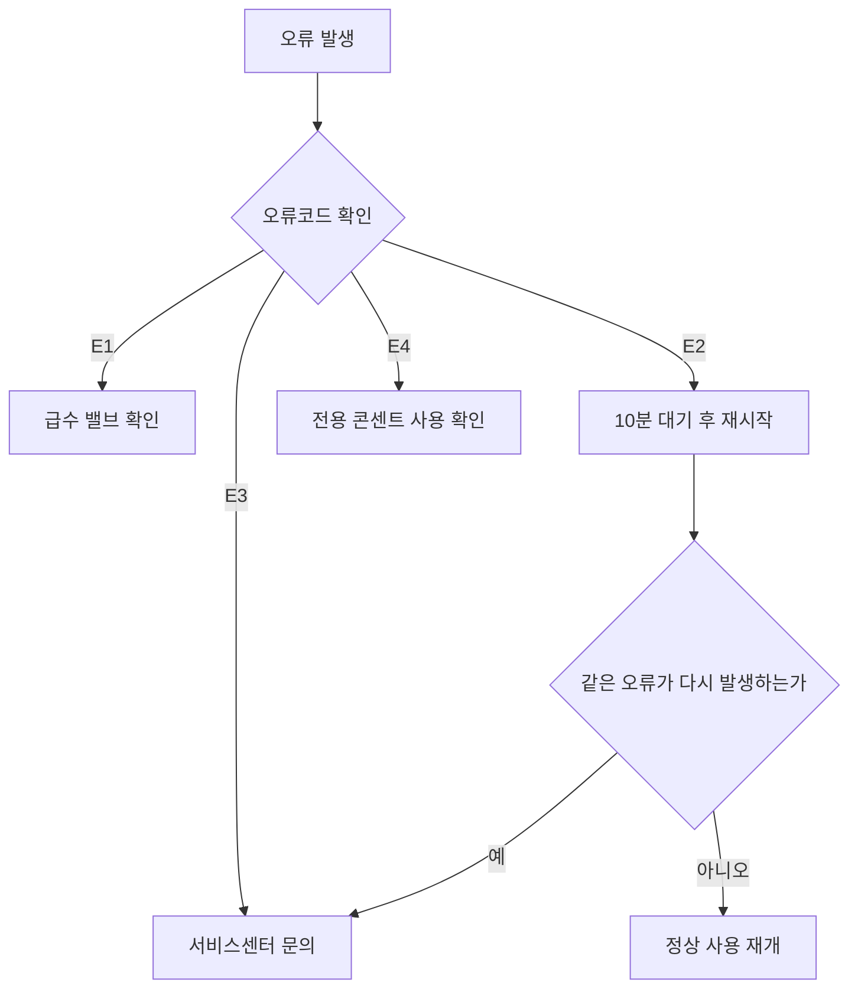

<Callout type="info">
  **이번 문서의 목표:** 엑셀 함수와 조건표를 조건 그대로 손으로 계산하고, 자릿수 규칙이 있는 코드를 정확히 해독하며, 매뉴얼의 조건과 예외를 순서대로 적용해 정답을 찾을 수 있게 된다.
</Callout>

## 왜 이런 유형이 나오는가

실무에서 사무직 근로자는 매일 세 가지 자료를 다룹니다. 조건에 따라 자동으로 계산해 주는 **표 계산 프로그램**(엑셀 등), 물건마다 붙어 있는 **규칙화된 코드**, 그리고 기기나 절차를 설명하는 **매뉴얼**입니다. NCS 직업기초능력에서는 이 세 가지를 각각 정보능력과 기술능력으로 나누어 평가합니다. 세 유형 모두 배경지식이 아니라 **주어진 규칙을 얼마나 정확히, 빠짐없이 따라가는가**를 묻는다는 공통점이 있습니다.

> **쉽게 말하면:** 몰라서 틀리는 문제가 아니라, 규칙을 하나라도 빼먹거나 순서를 건너뛰어서 틀리는 문제입니다.

## 1. 정보능력 I — 엑셀 함수 읽기

### 함수는 조건을 기호로 옮긴 것

**정보능력**(information literacy)은 자료를 정보로 가공하는 도구를 얼마나 정확히 다루는지 평가하는 능력입니다. 그중 가장 자주 나오는 형태가 엑셀 함수를 문장으로 풀어 설명하거나, 반대로 상황을 함수식으로 옮기는 문제입니다.

> **쉽게 말하면:** 엑셀 함수는 "만약 ~라면 ~하라"는 조건문을 괄호 안에 순서대로 적어 둔 것뿐입니다.

01편에서 명제 기호 `∧`(그리고), `∨`(또는), `¬`(아니다)를 다뤘습니다. 자주 나오는 함수들은 이 기호의 실무 버전입니다.

| 함수 | 문법 | 의미 |
|---|---|---|
| IF | `IF(조건, 참값, 거짓값)` | 조건이 참이면 참값, 거짓이면 거짓값을 돌려준다 |
| AND | `AND(조건1, 조건2, ...)` | 모든 조건이 동시에 참이어야 참을 돌려준다(∧와 같음) |
| OR | `OR(조건1, 조건2, ...)` | 조건 중 하나라도 참이면 참을 돌려준다(∨와 같음) |
| VLOOKUP | `VLOOKUP(찾을값, 범위, 열번호, 일치방식)` | 표의 첫 열에서 찾을값을 검색해 지정한 열번호의 값을 가져온다 |
| COUNTIF | `COUNTIF(범위, 조건)` | 범위 안에서 조건을 만족하는 셀의 개수를 센다 |
| SUMIF | `SUMIF(범위, 조건, 합계범위)` | 조건을 만족하는 행을 찾아 합계범위 값을 모두 더한다 |

### 손으로 계산해 보기

한 회사가 다음 규칙으로 근태 인센티브 대상자를 가립니다.

`IF(AND(근무일수가 20일 이상, 지각횟수가 2회 이하), "인센티브 대상", "제외")`

직원별 자료가 다음과 같다고 합시다.

| 직원 | 근무일수 | 지각횟수 |
|---|---|---|
| 갑 | 22 | 1 |
| 을 | 21 | 3 |
| 병 | 19 | 0 |

**계산 순서.** 안쪽 괄호(AND)부터 먼저 판정하고, 그 결과를 바깥쪽 IF에 넣습니다.

- 갑: 근무일수 22는 20 이상이고, 지각 1회는 2회 이하입니다. 두 조건이 모두 참이므로 AND의 결과는 참입니다. IF의 참값인 "인센티브 대상"이 나옵니다
- 을: 근무일수 21은 20 이상이라 참이지만, 지각 3회는 2회 이하가 아니므로 거짓입니다. AND는 조건이 **모두** 참이어야 하므로 하나라도 거짓이면 전체가 거짓입니다. 결과는 "제외"입니다
- 병: 근무일수 19는 20 이상이 아니므로 이미 거짓입니다. 지각 0회는 조건을 만족하지만 AND는 이것과 무관하게 거짓이 됩니다. 결과는 "제외"입니다

**해석:** AND는 "모두 참이어야" 통과하는 좁은 문이고, OR는 "하나만 참이어도" 통과하는 넓은 문입니다. 문제에서 "그리고", "동시에"라는 표현이 있으면 AND, "또는", "~거나"라는 표현이 있으면 OR로 옮겨야 합니다.

**자주 틀리는 점:**

- 괄호의 **안쪽부터** 계산해야 하는데 바깥쪽 IF의 조건란을 통째로 하나의 조건처럼 대충 읽어 버리는 실수가 가장 많습니다
- AND와 OR의 역할을 서로 바꿔 생각하는 실수입니다. "모두"는 AND, "하나라도"는 OR로 정확히 짝지어야 합니다
- VLOOKUP은 찾는 값이 있는 열이 **범위의 첫 번째 열**이어야 검색이 됩니다. 찾을 값이 표의 중간 열에 있으면 그 함수만으로는 검색할 수 없습니다

## 2. 정보능력 II — 논리 조건표 읽기

### 조건표란 무엇인가

**조건표**(decision table)는 여러 조건의 조합마다 결과를 미리 정리해 둔 표입니다. 17편에서 다룬 조건추리의 "확정된 조건부터 채워나가는" 원리를 실무 자료에 그대로 적용한 것이 조건표 읽기입니다.

다음은 한 대여점의 할인율 정책입니다.

| 회원 등급 | 대여일수 조건 | 할인율 |
|---|---|---|
| 일반 | 3일 미만 | 0퍼센트 |
| 일반 | 3일 이상 | 5퍼센트 |
| 우수 | 3일 미만 | 10퍼센트 |
| 우수 | 3일 이상 | 15퍼센트 |

**적용 예시.** 우수회원이 4일을 대여하면 어느 줄에 해당할까요. 먼저 등급을 기준으로 후보를 우수회원 두 줄로 좁힙니다. 그다음 대여일수 4일은 3일 이상이므로, 두 줄 중 아래 줄에 해당해 할인율은 15퍼센트입니다.

**해석:** 조건표를 읽을 때는 조건을 **한 번에 하나씩** 적용해 후보 줄을 좁혀 나가야 합니다. 여러 조건을 한꺼번에 눈으로 훑으면 엉뚱한 줄과 착각하기 쉽습니다.

**자주 틀리는 점:** "3일 이상"과 "3일 초과"를 혼동해 3일 정확히 대여한 경우를 잘못된 줄에 넣는 실수, 그리고 조건표에 없는 조합(예: 등급이 두 표에 모두 없는 경우)을 억지로 끼워 맞추는 실수가 대표적입니다. 조건표 문제는 표에 있는 조합만 정답 후보이며, 표에 없는 조합이 보기로 나오면 "판단 불가" 또는 "해당 없음"이 정답인 경우가 많습니다.

## 3. 코드 해독 — 자릿수마다 규칙이 있는 문자열

### 코드는 압축된 정보다

**코드**(code)는 여러 정보를 정해진 자릿수와 순서로 압축해 하나의 문자열로 표시한 것입니다. 제품코드, 사원번호, 학번, 자동차 번호판이 모두 이 방식입니다.

> **쉽게 말하면:** 코드 해독은 암호를 푸는 것이 아니라, 주어진 "자릿수 설명서"를 보고 문자열을 구간별로 잘라 읽는 작업입니다.

다음은 한 가전회사의 제품코드 구조입니다.

| 자리 | 의미 | 규칙 |
|---|---|---|
| 1–2자리 | 생산연도 | 두 자리 숫자, 20을 앞에 붙여 연도로 읽음 |
| 3자리 | 생산공장 | A는 서울공장, B는 부산공장, C는 해외공장 |
| 4–5자리 | 제품군 | 01은 냉장고, 02는 세탁기, 03은 에어컨 |
| 6–8자리 | 일련번호 | 세 자리 숫자, 그 제품군의 생산 순서 |

**해독 예시.** 코드 `24B02015`를 자리별로 자르면 다음과 같습니다.

- 1–2자리 `24` → 2024년 생산
- 3자리 `B` → 부산공장
- 4–5자리 `02` → 세탁기
- 6–8자리 `015` → 그 세탁기 제품군의 15번째 생산품

**해석:** 이 코드 하나로 "2024년에 부산공장에서 생산된 15번째 세탁기"라는 문장 전체가 압축되어 있습니다. 코드 해독 문제는 결국 이 압축을 거꾸로 푸는 작업입니다.

**자주 틀리는 점:** 자릿수를 하나씩 밀려 세는 실수가 압도적으로 많습니다. "4–5자리"처럼 구간이 두 자리 이상이면 반드시 문자열의 위치를 손가락이나 펜으로 하나씩 짚어 가며 잘라야 합니다. 눈으로만 어림잡아 자르면 인접한 구간의 숫자가 섞여 다른 값으로 읽힙니다.

### 바코드 체크섬 — 규칙으로 오류를 잡아내는 자리

일부 코드에는 **체크섬**(check digit)이라는, 앞자리들이 맞게 입력되었는지 검증하는 자리가 마지막에 붙습니다. 국제상품코드(EAN-13)가 대표적입니다.

**계산 규칙:** 체크섬 앞의 12자리 숫자를 왼쪽부터 1번, 2번, ... 12번으로 번호를 매깁니다.

<Steps>

1. **홀수 번째 자리**(1, 3, 5, 7, 9, 11번)의 숫자를 모두 더합니다
2. **짝수 번째 자리**(2, 4, 6, 8, 10, 12번)의 숫자를 모두 더한 뒤 3을 곱합니다
3. 두 값을 더합니다
4. 이 합을 10으로 나눈 나머지를 구하고, 나머지가 0이 아니면 10에서 그 나머지를 뺀 값이 체크섬입니다

</Steps>

**손계산.** 12자리가 `1 2 3 4 5 6 7 8 9 0 1 2`라고 합시다.

$$
\text{홀수 자리 합} = 1+3+5+7+9+1 = 26
$$

$$
\text{짝수 자리 합} \times 3 = (2+4+6+8+0+2) \times 3 = 22 \times 3 = 66
$$

$$
\text{전체 합} = 26 + 66 = 92
$$

92를 10으로 나눈 나머지는 2이므로, 체크섬은 10에서 2를 뺀 8입니다. 따라서 완성된 바코드는 `1234567890128`입니다.

**해석:** 체크섬은 스캐너가 코드를 잘못 읽었을 때 이를 잡아내는 역할을 합니다. 계산한 체크섬이 실제로 인쇄된 마지막 자리와 다르면, 그 코드는 어딘가 잘못 입력되었거나 훼손된 것입니다.

**자주 틀리는 점:** 홀수·짝수 번째 자리를 반대로 적용하는 실수, 그리고 나머지가 0인 경우 체크섬도 0이 되는데 이를 "10에서 0을 빼서 10"이라고 잘못 계산하는 실수가 자주 나옵니다. 나머지가 정확히 0이면 체크섬은 0입니다.

## 4. 매뉴얼 적용 — 조건과 예외를 순서대로 따라가기

### 매뉴얼 문제의 정체

**매뉴얼**(manual)은 특정 상황에서 해야 할 행동을 미리 정리해 둔 절차 문서입니다. 기술능력 문제는 매뉴얼 표를 보고 주어진 상황에 맞는 조치를 고르게 합니다.

다음은 한 정수기의 오류코드 표입니다.

| 오류코드 | 증상 | 원인 | 조치 |
|---|---|---|---|
| E1 | 급수 안 됨 | 수도 밸브 잠김 | 밸브를 열고 재시작한다 |
| E2 | 온수 안 나옴 | 히터 과열로 자동 차단 | 10분 대기 후 재시작하고, 반복되면 서비스센터에 문의한다 |
| E3 | 냉수 안 나옴 | 냉각 장치 이상 | 서비스센터에 문의한다 |
| E4 | 전원이 반복해서 꺼짐 | 콘센트 전압 불안정 | 전용 콘센트 사용을 확인한다 |

이 표를 실제 사용 순서로 그리면 다음과 같습니다.

**적용 예시.** "정수기 전원이 켜졌다 꺼지기를 반복한다. 온수·냉수는 둘 다 문제없이 나온다"는 상황이 주어졌다고 합시다. 증상 열에서 "전원이 반복해서 꺼짐"과 일치하는 줄은 E4뿐입니다. 온수·냉수가 정상이라는 조건은 E2·E3를 제외하는 데 쓰인 확인용 정보입니다. 정답은 전용 콘센트 사용을 확인하는 조치입니다.

**해석:** 매뉴얼 문제에서 상황 설명에 등장하는 문장은 하나도 버릴 정보가 없습니다. 어떤 문장은 정답 조건을 좁히는 데 쓰이고, 어떤 문장은 다른 후보를 제외하는 데 쓰입니다.

**자주 틀리는 점:**

- 증상이 비슷해 보이는 두 줄(예: E2 온수 문제와 E3 냉수 문제)을 헷갈려 원인·조치를 바꿔 적용하는 실수입니다
- "**반복되면**"처럼 조건부로 붙은 예외 조항을 놓치는 실수입니다. E2는 첫 조치와 재발 시 조치가 다른데, 상황이 "이미 두 번째 발생"이라고 명시되어 있으면 처음 조치가 아니라 예외 조치가 정답입니다
- 매뉴얼의 조치 순서를 건너뛰어, 대기·재시작 같은 선행 조치 없이 바로 서비스센터 문의를 고르는 실수입니다

## 핵심 정리

- 엑셀 함수는 조건문을 괄호로 표현한 것이며, **AND는 모두 참이어야, OR는 하나만 참이어도** 성립한다.
- 조건표는 조건을 한 번에 하나씩 적용해 후보 줄을 좁혀 나가며 읽는다. 표에 없는 조합은 판단 불가로 처리한다.
- 코드 해독은 자릿수 구간을 정확히 짚어 자르는 것이 핵심이며, 손가락으로 짚어 가며 확인하면 밀림 실수를 줄일 수 있다.
- 바코드 체크섬은 홀수 자리 합과 짝수 자리 합의 3배를 더한 뒤, 그 합을 10의 배수로 만드는 값이다.
- 매뉴얼 문제는 상황 설명의 모든 문장이 조건 좁히기 또는 후보 제외에 쓰이며, "반복되면"과 같은 예외 조항을 놓치지 않아야 한다.

## 마무리 복습

<Quiz
  questionNumber={1}
  question="근무일수가 20 이상이고 지각횟수가 2 이하이면 인센티브 대상, 그렇지 않으면 제외로 판정하는 함수식에서 근무일수 21, 지각횟수 3인 직원의 판정 결과는 무엇인가"
  options={['인센티브 대상', '제외', '오류', '판단 불가']}
  correctAnswer={2}
  explanation="AND는 두 조건이 모두 참이어야 참이 된다. 근무일수 21은 20 이상 조건을 만족하지만 지각횟수 3은 2 이하 조건을 만족하지 못하므로 AND 전체는 거짓이 되어 IF는 거짓값인 제외를 반환한다."
  optionExplanations={['한 조건만 만족했을 뿐 AND 조건 전체를 만족한 것은 아니므로 옳지 않다.', 'AND의 조건 중 하나가 거짓이면 전체가 거짓이 되어 제외로 판정되므로 옳다.', '함수식 자체에는 오류가 없으며 정상적으로 값을 계산할 수 있으므로 옳지 않다.', '함수식과 자료가 모두 주어져 있으므로 판정이 가능하며 판단 불가가 아니다.']}
/>

<Quiz
  questionNumber={2}
  question="표의 첫 번째 열에서 찾을 값을 검색해 지정한 열번호의 값을 가져오는 엑셀 함수는 무엇인가"
  options={['COUNTIF', 'SUMIF', 'VLOOKUP', 'IF']}
  correctAnswer={3}
  explanation="VLOOKUP은 지정한 범위의 첫 번째 열에서 찾을 값을 검색하고, 그 행에서 지정한 열번호에 있는 값을 가져오는 함수다."
  optionExplanations={['COUNTIF는 조건을 만족하는 셀의 개수를 세는 함수이며 값을 가져오지 않는다.', 'SUMIF는 조건을 만족하는 행의 값을 합산하는 함수이며 검색해서 가져오는 함수가 아니다.', '정답이다. VLOOKUP은 첫 열에서 값을 검색해 지정한 열의 값을 반환하는 함수다.', 'IF는 조건의 참, 거짓에 따라 다른 값을 반환할 뿐 표를 검색하지 않는다.']}
/>

<Quiz
  questionNumber={3}
  question="할인율 조건표에서 등급이 일반이고 대여일수가 정확히 3일인 회원에게 적용되는 할인율은 얼마인가"
  options={['0퍼센트', '5퍼센트', '10퍼센트', '15퍼센트']}
  correctAnswer={2}
  explanation="조건표에서 일반 등급의 대여일수 조건은 3일 미만과 3일 이상 두 줄로 나뉜다. 정확히 3일은 3일 미만에 속하지 않고 3일 이상에 속하므로 할인율은 5퍼센트다."
  optionExplanations={['0퍼센트는 3일 미만 구간에 해당하는데 3일은 미만이 아니라 이상 구간에 들어간다.', '정답이다. 3일은 3일 이상 조건을 만족하므로 일반 등급의 5퍼센트 구간에 해당한다.', '10퍼센트와 15퍼센트는 우수 등급의 할인율이며 이 문제는 일반 등급을 다룬다.', '15퍼센트는 우수 등급이면서 3일 이상인 경우의 할인율이므로 이 상황과 맞지 않는다.']}
/>

<Quiz
  questionNumber={4}
  question="제품코드 구조가 1에서 2자리는 생산연도, 3자리는 생산공장, 4에서 5자리는 제품군, 6에서 8자리는 일련번호일 때, 코드 24C03007이 나타내는 내용으로 옳은 것은 무엇인가"
  options={['2024년 서울공장에서 생산된 3번째 냉장고', '2024년 해외공장에서 생산된 7번째 에어컨', '2003년 해외공장에서 생산된 24번째 세탁기', '2024년 부산공장에서 생산된 7번째 세탁기']}
  correctAnswer={2}
  explanation="1에서 2자리 24는 2024년, 3자리 C는 해외공장, 4에서 5자리 03은 에어컨, 6에서 8자리 007은 일련번호 7번을 뜻한다. 이를 모두 합치면 2024년 해외공장에서 생산된 7번째 에어컨이다."
  optionExplanations={['3자리 C는 서울공장이 아니라 해외공장을 뜻하고 제품군 03도 냉장고가 아니라 에어컨이다.', '정답이다. 24는 2024년, C는 해외공장, 03은 에어컨, 007은 일련번호 7번으로 정확히 대응한다.', '앞 두 자리를 연도가 아니라 다른 값으로 잘못 읽고 공장코드와 제품군도 바꾸어 해석한 값이다.', 'C는 부산공장이 아니라 해외공장이고 03은 세탁기가 아니라 에어컨이다.']}
/>

<Quiz
  questionNumber={5}
  question="EAN-13 체크섬 계산에서 앞 12자리 중 홀수 번째 자리 합이 30, 짝수 번째 자리 합이 20일 때 체크섬은 얼마인가"
  options={['0', '5', '10', '90']}
  correctAnswer={1}
  explanation="짝수 자리 합에 3을 곱한 값은 60이고 홀수 자리 합 30을 더하면 전체 합은 90이다. 90을 10으로 나눈 나머지는 0이므로 체크섬도 0이 된다."
  optionExplanations={['정답이다. 전체 합 90은 이미 10의 배수이므로 나머지가 0이고 체크섬도 0이다.', '나머지가 0이 아닐 때 10에서 나머지를 빼는 규칙을 나머지가 0인 경우에도 그대로 적용해 잘못 계산한 값이다.', '전체 합 90을 10으로 나눈 나머지를 잘못 10이라고 계산한 값이며, 나머지는 10을 넘을 수 없다.', '체크섬 계산 과정을 거치지 않고 전체 합 90을 그대로 답으로 쓴 값이다.']}
/>

<Quiz
  questionNumber={6}
  question="정수기가 전원이 켜졌다 꺼지기를 반복하고 온수와 냉수는 모두 정상적으로 나온다는 상황에서, 매뉴얼 표에 따라 취해야 할 조치는 무엇인가"
  options={['수도 밸브를 열고 재시작한다', '10분 대기 후 재시작한다', '서비스센터에 문의한다', '전용 콘센트 사용을 확인한다']}
  correctAnswer={4}
  explanation="증상이 전원이 반복해서 꺼지는 것과 일치하는 오류코드는 E4뿐이며, 온수와 냉수가 정상이라는 조건은 E2와 E3를 제외하는 데 쓰인다. E4의 조치는 전용 콘센트 사용 확인이다."
  optionExplanations={['수도 밸브 확인은 급수가 안 될 때의 조치이며 이 상황의 증상과 일치하지 않는다.', '10분 대기 후 재시작은 온수가 안 나올 때의 조치이며 온수는 정상이라고 명시되어 있다.', '서비스센터 문의는 냉각 장치 이상의 조치이며 냉수는 정상이라고 명시되어 있어 해당하지 않는다.', '정답이다. 전원이 반복해서 꺼지는 증상은 콘센트 전압 불안정을 원인으로 하는 오류코드와 일치하며 그 조치가 정답이다.']}
/>

<Quiz
  questionNumber={7}
  question="정수기 온수가 안 나오는 문제로 매뉴얼에 따라 10분 대기 후 재시작했는데 같은 문제가 다시 발생했다. 다음으로 취해야 할 조치는 무엇인가"
  options={['다시 10분을 대기한 뒤 재시작한다', '급수 밸브를 열고 재시작한다', '서비스센터에 문의한다', '전용 콘센트 사용을 확인한다']}
  correctAnswer={3}
  explanation="오류코드 E2의 조치는 처음에는 10분 대기 후 재시작이지만, 그래도 같은 증상이 반복되면 서비스센터에 문의하도록 예외 조항이 붙어 있다. 이미 한 번 조치했는데도 재발했으므로 다음 단계는 서비스센터 문의다."
  optionExplanations={['같은 조치를 반복하는 것은 매뉴얼에 명시된 재발 시 예외 조치를 무시하는 것이므로 옳지 않다.', '급수 밸브 확인은 급수가 안 될 때의 조치이며 이 상황은 온수 문제이므로 해당하지 않는다.', '정답이다. 첫 조치 후에도 재발하면 서비스센터에 문의하라는 예외 조항이 이 상황에 정확히 적용된다.', '전용 콘센트 확인은 전원이 반복해서 꺼질 때의 조치이며 이 상황과는 다른 오류코드에 해당한다.']}
/>

## 참고 자료

- [NCS 국가직무능력표준 – 직업기초능력 (공식)](https://www.ncs.go.kr/th03/TH0302List.do?dirSeq=121)
- [NCS 직업기초능력 필기평가 예시 문항집 (2021, 공식)](https://ncs.go.kr/blind/rh13/bbs_lib_view.do?libDstinCd=48&libSeq=20220114102003035)
