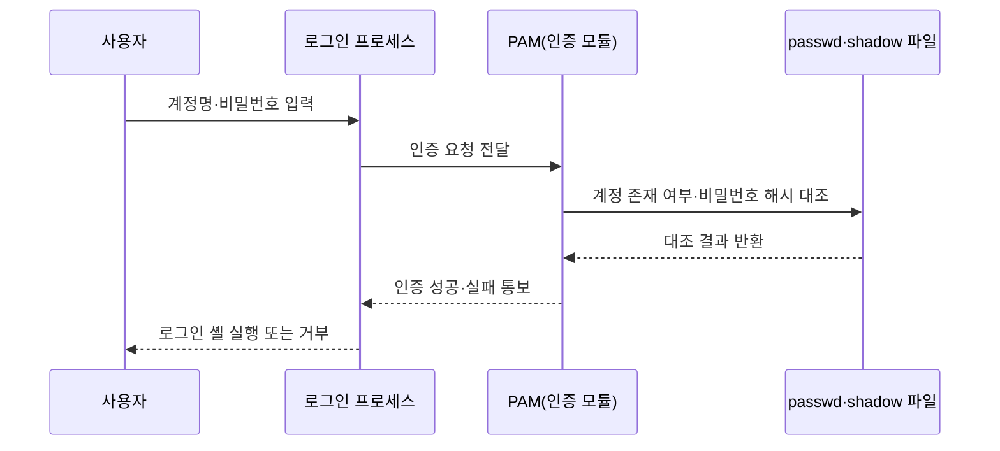

<Callout type="info">
  **이번 문서의 목표:** 리눅스 계정 파일 구조와 useradd·usermod·sudo 계열 명령을 직접 읽고 쓸 수 있고, 윈도우의 net 명령·UAC 단계·로컬 보안 정책을 구분하며, 프로세스·서비스 개념을 정리해 이후 06편(계정·인증 실무 심화)부터 22편(접근통제 모델)까지 이어지는 시험 전체의 기반을 갖춘다.
</Callout>

## 왜 계정관리가 시험 전체의 기반인가

> **쉽게 말하면**: 시스템에서 일어나는 거의 모든 사고는 결국 "누가 어떤 계정으로 무엇을 할 수 있었는가"라는 질문으로 돌아간다.

권한상승 공격(08편)도, 파일시스템 접근통제(07편)도, 데이터베이스 계정 권한(19편)도, 심지어 정보보호관리체계 인증기준(27편)의 여러 항목도 결국 "계정에게 어떤 권한이 얼마나 정확히 부여되어 있는가"라는 같은 질문을 다른 층위에서 반복한다. 이 편은 그 질문에 답하기 위해 실제로 확인해야 할 파일과 명령어를 리눅스·윈도우 양쪽에서 정리한다. 개념 자체(최소 권한 원칙, 계정 분리, 파일 권한 문자열의 rwx·8진수 표기)를 이미 알고 있다면 곧바로 실무 명령으로 넘어가도 되고, 처음이라도 이 편만으로 명령어와 설정 파일을 읽는 데 필요한 최소한의 개념은 함께 짚는다.

## 리눅스 계정: 파일로 존재하는 신원 정보

> **쉽게 말하면**: 리눅스의 계정 정보는 신비로운 어딘가에 있는 것이 아니라, 누구나 열어볼 수 있는 평범한 텍스트 파일 몇 개에 그대로 적혀 있다.

### /etc/passwd: 계정의 기본 정보

리눅스 시스템의 모든 계정 정보는 `/etc/passwd` 파일에 한 줄씩 저장된다. 실제 한 줄을 가져와 필드별로 나눠 보자.

```
alice:x:1001:1001:Alice Kim:/home/alice:/bin/bash
```

콜론(`:`)으로 구분된 일곱 필드는 순서대로 다음을 뜻한다.

| 순서 | 필드 | 값 | 의미 |
|------|------|-----|------|
| 1 | 사용자 이름 | alice | 로그인에 사용하는 계정 이름 |
| 2 | 비밀번호 자리표시자 | x | 실제 암호화된 비밀번호는 여기 없고 shadow 파일에 있다는 표시 |
| 3 | UID | 1001 | 사용자 식별자(User ID), 시스템이 실제로 계정을 구분하는 번호 |
| 4 | GID | 1001 | 이 계정의 기본 그룹 식별자(Group ID) |
| 5 | GECOS | Alice Kim | 실명·연락처 등 참고용 설명(주석) 필드 |
| 6 | 홈 디렉터리 | /home/alice | 로그인 직후 위치하는 개인 작업 디렉터리 |
| 7 | 로그인 셸 | /bin/bash | 로그인할 때 실행되는 명령 해석기 |

두 번째 필드가 `x`인 이유가 중요하다. 예전 유닉스 시스템은 이 자리에 암호화된 비밀번호를 직접 저장했는데, `/etc/passwd`는 누구나 읽을 수 있는 권한(644)으로 설정되어 있어 모든 계정의 비밀번호 해시가 사실상 공개되는 셈이었다. 이 문제를 해결하기 위해 실제 비밀번호 해시는 관리자만 읽을 수 있는 별도 파일로 옮기고, `/etc/passwd`에는 `x`라는 표시만 남기게 되었다.

### /etc/shadow: 실제 비밀번호와 만료 규칙

비밀번호 해시와 만료 규칙은 `/etc/shadow`에 저장되며, 이 파일은 루트(root) 계정만 읽을 수 있다(권한 640 또는 600).

```
alice:$6$rXk92JQs$H3f...:19800:0:90:7:::
```

| 순서 | 필드 | 값 | 의미 |
|------|------|-----|------|
| 1 | 사용자 이름 | alice | passwd 파일과 연결되는 계정 이름 |
| 2 | 암호화된 비밀번호 | `$6$...` | 해시 알고리즘 번호(6은 SHA-512)와 솔트(salt), 해시값 |
| 3 | 마지막 변경일 | 19800 | 1970년 1월 1일부터 센 날짜 수 |
| 4 | 최소 사용 기간 | 0 | 변경 후 최소 며칠간 다시 바꿀 수 없는가 |
| 5 | 최대 사용 기간 | 90 | 며칠 후 비밀번호를 반드시 바꿔야 하는가 |
| 6 | 경고 기간 | 7 | 만료 며칠 전부터 경고를 표시하는가 |
| 7–9 | 비활성·만료·예약 | (비어 있음) | 계정 자체의 비활성화·만료 기한 |

<Callout type="warning">
  두 번째 필드가 `!` 나 `*`로 시작하면 그 계정은 비밀번호 로그인이 아예 잠겨 있다는 뜻이다(서비스 전용 계정에서 흔하다). 시험에서 "이 계정은 로그인할 수 있는가"를 물을 때 이 표시를 놓치면 오답으로 이어진다.
</Callout>

### /etc/group: 그룹 구성원 명단

```
developers:x:1002:alice,bob
```

그룹 이름, 비밀번호 자리표시자(그룹 비밀번호는 실무에서 거의 쓰지 않는다), GID, 그리고 이 그룹에 속한 사용자 이름 목록 순서다. 이 목록은 "보조 그룹(supplementary group)"으로 소속된 계정만 나열하며, `/etc/passwd`의 네 번째 필드에 적힌 "기본 그룹"은 여기 나열되지 않아도 이미 그 그룹의 일원이다.

### 계정·그룹 관리 명령

| 명령 | 예시 | 동작 |
|------|------|------|
| `useradd` | `useradd -m -s /bin/bash -G developers alice` | 홈 디렉터리 생성(-m), 로그인 셸 지정(-s), 보조 그룹 지정(-G)과 함께 계정 생성 |
| `passwd` | `passwd alice` | alice 계정의 비밀번호 설정·변경 |
| `usermod` | `usermod -aG sudo alice` | 기존 그룹 유지하며(-a) sudo 그룹에 추가(-G) |
| `userdel` | `userdel -r alice` | 계정과 홈 디렉터리까지 함께 삭제(-r) |
| `id` | `id alice` | alice의 UID·GID·소속 그룹 전체 출력 |
| `groups` | `groups alice` | alice가 속한 그룹 이름만 출력 |

`usermod -aG` 에서 `-a`(append)를 빠뜨리면 어떤 문제가 생기는지가 실무에서 자주 나오는 함정이다. `-a` 없이 `-G developers`만 실행하면, 기존에 속해 있던 다른 보조 그룹에서 전부 빠지고 developers 그룹 하나에만 속하게 된다. 권한을 추가하려다 오히려 기존 권한을 잃는 실수다.

## sudo: 관리자 권한을 임시로 빌리는 방법

> **쉽게 말하면**: su가 아예 다른 사람이 되는 것이라면, sudo는 내 계정으로 로그인한 채 특정 명령 하나만 잠깐 관리자 자격으로 실행하는 것이다.

**su**(substitute user)는 `su -`처럼 실행하면 완전히 다른 계정(기본값은 root)으로 전환되어 그 계정의 환경 전체를 물려받는다. 반면 **sudo**(superuser do)는 현재 계정을 유지한 채 `/etc/sudoers` 파일에 정의된 규칙 안에서만 특정 명령을 관리자 권한으로 실행하도록 허용한다. 이 차이는 03편(계정 분리 원칙)의 실제 구현이다 — sudo를 쓰면 "누가 언제 어떤 관리 명령을 실행했는가"가 로그(`/var/log/auth.log` 또는 `/var/log/secure`)에 그대로 남지만, root로 완전히 전환해 버리면 그 이후 행동의 책임 추적성이 흐려진다.

`/etc/sudoers`는 반드시 `visudo` 명령으로만 편집한다(문법 오류가 있으면 저장 전에 걸러내 시스템 전체가 sudo를 못 쓰게 되는 사고를 막는다). 기본 문법은 다음과 같다.

```
사용자 호스트=(권한을_빌릴_대상) 명령
```

실제 규칙 예시 두 줄을 읽어 보자.

```
alice ALL=(ALL) ALL
%developers ALL=(ALL) NOPASSWD: /usr/bin/systemctl restart nginx
```

- 첫 줄: alice는 어떤 호스트에서든(`ALL`), 어떤 사용자로도 전환해서(`(ALL)`), 어떤 명령이든(`ALL`) sudo로 실행할 수 있다. 다만 기본 설정에서는 실행할 때마다 alice 본인의 비밀번호를 묻는다.
- 둘째 줄: `%`로 시작하면 개별 계정이 아니라 그룹을 뜻한다. developers 그룹 전체가, 딱 한 가지 명령(`systemctl restart nginx`)만, 비밀번호 확인 없이(`NOPASSWD`) 실행할 수 있다.

둘째 줄이 최소 권한 원칙을 훨씬 잘 지킨 설정이다. 배포 자동화 계정처럼 특정 작업만 반복하는 계정에는 `ALL=(ALL) ALL` 같은 전권을 주지 않고, 실제로 필요한 명령 하나로 좁혀 지정하는 것이 실무 표준이다.

| 확인 명령 | 동작 |
|-----------|------|
| `sudo -l` | 현재 계정이 sudo로 실행할 수 있는 명령 목록 확인 |
| `sudo -u www-data 명령` | 특정 계정(root가 아닌 다른 계정) 권한으로 명령 실행 |
| `sudo !!` | 방금 실패한 명령을 sudo를 붙여 다시 실행 |

<Callout type="warning">
  `/etc/sudoers`에 `NOPASSWD: ALL`을 그룹 전체에 부여하는 설정은 실무 취약점 점검(10편)에서 흔히 지적되는 항목이다. 비밀번호 확인 없이 모든 명령을 허용하면, 그 그룹 계정 중 하나만 탈취되어도 사실상 root 권한이 그대로 넘어간다.
</Callout>

## 윈도우 계정과 UAC

> **쉽게 말하면**: 윈도우도 관리자 계정으로 로그인해도 평소에는 일반 권한으로 돌아가다가, 시스템을 바꾸는 순간에만 확인 창을 띄운다.

### 로컬 계정·그룹 명령

리눅스의 useradd·usermod에 대응하는 윈도우 명령은 다음과 같다(관리자 권한 명령 프롬프트 또는 PowerShell에서 실행).

| 목적 | 명령 프롬프트(cmd) | PowerShell |
|------|----------------------|------------|
| 계정 생성 | `net user alice P@ssw0rd123 /add` | `New-LocalUser -Name alice -Password (Read-Host -AsSecureString)` |
| 그룹에 추가 | `net localgroup administrators alice /add` | `Add-LocalGroupMember -Group Administrators -Member alice` |
| 계정 목록 확인 | `net user` | `Get-LocalUser` |
| 내 권한 확인 | `whoami /priv` | `whoami /priv` |
| 내 소속 그룹 확인 | `whoami /groups` | `whoami /groups` |

`whoami /priv`를 실행하면 `SeBackupPrivilege`(백업 권한), `SeDebugPrivilege`(디버그 권한)처럼 계정에 부여된 개별 특권(privilege) 목록이 나온다. 리눅스가 UID·그룹으로 권한을 판단하는 것과 달리, 윈도우는 계정마다 이런 세분화된 특권을 따로 부여·회수할 수 있다는 점이 구조적 차이다.

### UAC(사용자 계정 컨트롤)의 동작 원리

**UAC**(User Account Control)는 관리자 그룹에 속한 계정으로 로그인해도, 평소에는 관리 권한이 빠진 "표준 사용자 액세스 토큰"으로 동작하게 하고, 시스템을 변경하는 작업을 실행할 때만 별도의 승인을 요구하는 구조다. 이 구조를 04편의 최소 권한 원칙으로 다시 읽으면, "관리자 계정도 평소에는 일반 권한만 쓰고 필요한 순간에만 관리자 권한으로 전환한다"는 계정 분리 원칙을 운영체제가 자동으로 강제하는 것과 같다.

UAC 알림 수준은 네 단계로 조절할 수 있다(제어판의 사용자 계정 컨트롤 설정 또는 `UserAccountControlSettings.exe`).

| 단계 | 동작 | 보안 수준 |
|------|------|-----------|
| 항상 알림 | 앱 설치·시스템 설정 변경 등 모든 관리 작업마다 승인 요구 | 가장 안전, 알림 빈도 높음 |
| 앱이 시스템을 변경할 때만 알림(기본값) | 앱이 스스로 관리자 권한을 요청할 때만 알림, 화면을 어둡게(보안 데스크톱) 표시 | 기본 권장 |
| 위와 같지만 보안 데스크톱 없이 알림 | 알림은 뜨지만 화면 전환 없이 표시 | 기본값보다 약함 |
| 알리지 않음 | 관리자 계정은 승인 없이 항상 전권으로 동작 | 사실상 UAC 비활성화, 권장하지 않음 |

승인 창이 뜰 때 배경이 어두워지는 것은 **보안 데스크톱**(secure desktop) 전환 때문이다. 이 상태에서는 일반 프로세스가 화면을 그리거나 클릭을 가로챌 수 없어, 악성코드가 가짜 승인 창을 띄워도 실제 클릭이 전달되지 않는다.

### 로컬 보안 정책과 그룹 정책

`secpol.msc`(로컬 보안 정책)와 `gpedit.msc`(로컬 그룹 정책 편집기)는 계정 잠금 정책(몇 번 틀리면 잠글지), 비밀번호 정책(최소 길이·복잡성), 감사 정책(어떤 이벤트를 로그로 남길지) 같은 규칙을 GUI로 설정하는 도구다. 이 편에서는 "이런 도구로 계정 관련 정책을 중앙에서 설정한다"는 존재만 확인하고, 실제 정책 항목별 설정값과 도메인 환경의 그룹 정책 개체(GPO, Group Policy Object) 배포는 06편(서버·클라이언트 운영체제 계정·인증 실무)에서 심화한다.

## 프로세스와 서비스: 계정이 실행되는 그릇

> **쉽게 말하면**: 프로세스는 지금 실행 중인 프로그램 한 벌이고, 서비스(데몬)는 로그인한 사람이 없어도 백그라운드에서 계속 돌아가는 프로세스다.

**프로세스**(process)는 실행 중인 프로그램의 인스턴스이며, 반드시 어떤 계정의 권한으로 실행되는지가 정해져 있다. 각 프로세스는 고유한 **PID**(Process ID)를 가지고, 자신을 실행시킨 **부모 프로세스**의 PID(PPID)도 함께 기록한다. 이 소유자 정보가 그 프로세스가 어떤 파일에 접근할 수 있는지를 결정한다.

리눅스에서 로그인 없이 백그라운드로 계속 실행되는 프로세스를 **데몬**(daemon)이라 부르고, 현대 리눅스 배포판 대부분은 `systemd`가 이 데몬들을 관리한다. 윈도우의 대응 개념은 **서비스**(service)이며 `services.msc`나 `sc` 명령으로 관리한다.

| 목적 | 리눅스 | 윈도우 |
|------|--------|--------|
| 실행 중인 프로세스 목록 | `ps aux` 또는 `ps -ef` | `tasklist` 또는 `Get-Process` |
| 실시간 자원 사용량 확인 | `top` | 작업 관리자 또는 `Get-Counter` |
| 백그라운드 서비스 상태 확인 | `systemctl status nginx` | `sc query wuauserv` 또는 `Get-Service` |
| 서비스 시작·중지 | `systemctl start nginx` / `systemctl stop nginx` | `net start wuauserv` / `net stop wuauserv` |
| 부팅 시 자동 시작 설정 | `systemctl enable nginx` | 서비스 속성의 시작 유형을 자동으로 설정 |

로그인 인증이 실제로 어느 단계에서 이 파일들을 확인하는지 흐름으로 정리하면 다음과 같다.



**PAM**(Pluggable Authentication Modules, 탈부착형 인증 모듈)은 이 인증 단계를 여러 모듈로 나눠 유연하게 구성할 수 있게 하는 리눅스의 인증 프레임워크다. 실제 설정 파일 문법과 모듈 조합은 06편에서 심화한다. 이 편에서는 "로그인 시도가 곧바로 셸 실행으로 이어지는 것이 아니라, 반드시 이 인증 단계를 거친다"는 흐름만 기억해 둔다.

## 계정관리가 이후 편의 기반이 되는 지점

| 이 편의 개념 | 다시 등장하는 편 |
|--------------|-------------------|
| /etc/passwd·shadow, sudoers 문법 | 06(계정·인증 실무 심화), 22(접근통제 모델) |
| rwx·소유자 개념(선행 지식) | 07(파일시스템 접근통제와 무결성 점검) |
| 권한상승의 대상이 되는 계정 구조 | 08(시스템 공격기법과 대응) |
| systemctl·서비스 상태 확인 | 09(서버 보안 운영 실무: 로그·백업), 10(취약점 점검) |
| UAC·sudo의 계정 분리 구조 | 21(인증 기술 심화), 26–27(거버넌스·ISMS-P 인증기준) |

<Callout type="warning">
  "계정 관리는 1과목(시스템보안)에서만 나온다"고 생각하지 않는다. 27편의 ISMS-P 인증기준에도 계정 발급·회수·검토 절차가 별도 항목으로 들어 있으며, 그 항목을 이해하려면 이 편에서 다룬 UID·그룹·sudo 구조를 그대로 다시 사용한다.
</Callout>

## 자주 틀리는 점

- **/etc/passwd에 비밀번호가 저장되어 있다고 착각**: 두 번째 필드는 `x` 표시일 뿐이며, 실제 해시는 `/etc/shadow`에 있다.
- **usermod -G 사용 시 -a를 빠뜨림**: `-a` 없이 `-G`만 쓰면 기존 보조 그룹에서 모두 제외되고 지정한 그룹에만 남는다.
- **su와 sudo를 같은 개념으로 혼동**: su는 계정 자체를 전환하고, sudo는 계정을 유지한 채 특정 명령만 관리자 권한으로 실행한다.
- **UAC를 끄면 보안에 문제가 없다고 오해**: "알리지 않음" 단계는 관리자 계정이 항상 전권으로 동작하게 만들어, 관리자 계정이 악성코드에 감염되면 곧바로 시스템 전체가 장악된다.
- **서비스(데몬)를 프로세스와 다른 개념으로 오해**: 서비스도 결국 프로세스의 한 종류이며, 다만 로그인 세션과 무관하게 백그라운드에서 계속 실행된다는 점이 다를 뿐이다.

## 핵심 정리

- 리눅스 계정 정보는 /etc/passwd(기본 정보)·shadow(비밀번호 해시·만료 규칙)·group(그룹 구성원) 세 파일에 나뉘어 저장되며, useradd·usermod·passwd로 관리한다.
- sudo는 /etc/sudoers 규칙에 따라 계정을 유지한 채 특정 명령만 관리자 권한으로 실행하게 해, su로 완전히 전환하는 것보다 책임추적성을 높인다.
- 윈도우는 net 명령·PowerShell로 로컬 계정·그룹을 관리하며, UAC는 관리자 계정도 평소에는 표준 권한으로 동작하게 강제하는 네 단계 알림 체계다.
- 프로세스는 계정 권한으로 실행되는 실행 단위이고, 서비스(데몬)는 로그인 세션과 무관하게 백그라운드에서 계속 실행되는 프로세스다.
- 이 편의 계정·권한 구조는 06·07·08·09·10·21·22·26·27편에서 형태만 바꿔 반복 등장하는 시험 전체의 기반이다.

## 마무리 복습

<Quiz
  questionNumber={1}
  question="리눅스 /etc/passwd 파일의 두 번째 필드가 x로 표시되는 이유로 가장 적절한 것은?"
  options={['그 계정이 비활성화되었기 때문이다', '실제 비밀번호 해시는 /etc/shadow에 별도로 저장되기 때문이다', 'x는 관리자 계정이라는 표시이기 때문이다', '홈 디렉터리가 없다는 표시이기 때문이다']}
  correctAnswer={2}
  explanation="예전에는 passwd 파일에 비밀번호 해시를 직접 저장했지만, 이 파일이 모두가 읽을 수 있는 권한이라 보안 문제가 되어 실제 해시는 shadow 파일로 옮기고 x라는 표시만 남기게 되었다."
  optionExplanations={['계정 비활성화는 shadow 파일의 다른 필드나 별도 표시로 나타난다.', '정답. 실제 해시는 관리자만 읽을 수 있는 shadow 파일에 있다.', 'x는 관리자 여부와 무관하며 모든 계정에 동일하게 표시된다.', '홈 디렉터리 정보는 별도의 여섯 번째 필드에 기록된다.']}
/>

<Quiz
  questionNumber={2}
  question="usermod -aG developers alice 명령에서 -a 옵션을 빠뜨렸을 때 발생하는 문제는?"
  options={['명령이 실행되지 않고 오류만 발생한다', 'alice가 기존에 속해 있던 다른 보조 그룹에서 모두 빠지고 developers 그룹에만 남는다', 'alice 계정 자체가 삭제된다', 'developers 그룹의 다른 구성원이 삭제된다']}
  correctAnswer={2}
  explanation="-a(append) 없이 -G만 쓰면 지정한 그룹 목록으로 보조 그룹 전체를 덮어써서, 기존에 속해 있던 다른 그룹에서 모두 제외된다."
  optionExplanations={['명령 자체는 정상적으로 실행되며 오류가 발생하지 않는다.', '정답. -a가 없으면 지정한 그룹으로 보조 그룹 전체가 덮어써진다.', '계정 삭제는 userdel 명령으로 이루어지며 usermod와는 무관하다.', '다른 구성원의 그룹 소속에는 영향을 주지 않는다.']}
/>

<Quiz
  questionNumber={3}
  question="su와 sudo의 차이로 가장 적절한 것은?"
  options={['su와 sudo는 완전히 같은 기능을 한다', 'su는 계정 자체를 전환하고 sudo는 계정을 유지한 채 특정 명령만 관리자 권한으로 실행한다', 'sudo는 리눅스에서만, su는 윈도우에서만 쓰인다', 'su는 로그를 남기지 않고 sudo만 로그를 남긴다']}
  correctAnswer={2}
  explanation="su는 다른 계정으로 완전히 전환되어 그 계정의 환경을 물려받지만, sudo는 현재 계정을 유지한 채 sudoers 규칙에 정의된 특정 명령만 관리자 권한으로 실행한다."
  optionExplanations={['두 명령은 권한 전환 범위와 방식이 다르다.', '정답. su는 계정 전환, sudo는 특정 명령의 권한 상승이라는 차이가 핵심이다.', '둘 다 리눅스 계열 명령이며 윈도우와는 무관하다.', 'su와 sudo 모두 시스템 로그에 실행 기록을 남길 수 있다.']}
/>

<Quiz
  questionNumber={4}
  question="윈도우 UAC(User Account Control)의 동작 원리로 옳은 것은?"
  options={['관리자 계정은 로그인 즉시 항상 전권으로 동작한다', '관리자 계정도 평소에는 표준 사용자 액세스 토큰으로 동작하다가 시스템 변경 작업 시에만 승인을 요구한다', 'UAC는 표준 사용자 계정에는 적용되지 않는다', 'UAC 알림 수준은 항상 알림 한 단계만 존재한다']}
  correctAnswer={2}
  explanation="UAC는 관리자 그룹 계정도 평소에는 관리 권한이 빠진 표준 사용자 토큰으로 동작하게 하고, 시스템을 변경하는 작업을 실행할 때만 별도의 승인 절차를 거치게 한다."
  optionExplanations={['UAC의 핵심은 관리자 계정도 평소에는 전권으로 동작하지 않는다는 것이다.', '정답. 평소에는 표준 권한, 필요할 때만 승인 절차를 거치는 구조다.', '표준 사용자 계정도 관리 작업을 요청하면 자격 증명 프롬프트가 뜬다.', 'UAC 알림 수준은 항상 알림부터 알리지 않음까지 네 단계로 조절할 수 있다.']}
/>

<Quiz
  questionNumber={5}
  question="다음 중 프로세스와 서비스(데몬)의 관계에 대한 설명으로 옳은 것은?"
  options={['서비스는 프로세스와 완전히 무관한 별개의 개념이다', '서비스도 프로세스의 한 종류이며, 로그인 세션과 무관하게 백그라운드에서 계속 실행된다는 점이 다르다', '서비스는 PID를 갖지 않는다', '리눅스에는 서비스 개념이 존재하지 않는다']}
  correctAnswer={2}
  explanation="서비스(데몬)는 결국 실행 중인 프로그램인 프로세스의 한 종류이며, 다만 특정 사용자의 로그인 세션에 묶이지 않고 백그라운드에서 지속적으로 실행된다는 점이 일반 프로세스와 다르다."
  optionExplanations={['서비스도 결국 실행되는 동안에는 프로세스로 존재한다.', '정답. 서비스는 로그인 세션과 무관하게 계속 실행되는 프로세스다.', '서비스도 실행되는 동안에는 고유한 PID를 부여받는다.', '리눅스도 systemd 등을 통해 데몬(서비스)을 관리한다.']}
/>

## 참고 자료

- [Sudo Project - Sudoers Manual](https://www.sudo.ws/docs/man/sudoers.man/)
- [Microsoft Learn - How User Account Control works](https://learn.microsoft.com/en-us/windows/security/application-security/application-control/user-account-control/how-it-works)
