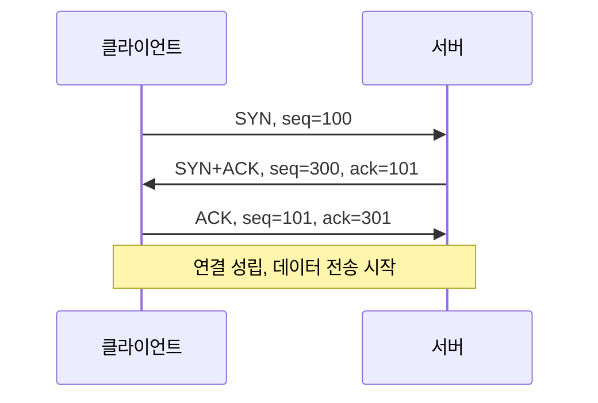

<Callout type="info">
  **이번 문서의 목표:** OSI 7계층과 TCP/IP 4계층의 대응 관계를 정리하고, IPv4 서브넷팅·CIDR·VLSM을 직접 계산하며, TCP·UDP·ICMP 헤더 구조와 3-way handshake, well-known 포트 목록을 실제 명령어 출력과 함께 익혀, 11편(네트워크 장비)부터 20편(포렌식)까지 반복 사용할 네트워크 기초를 완성한다.
</Callout>

## 왜 이 스택을 다시 완전히 정리하는가

> **쉽게 말하면**: 네트워크 보안 공격·솔루션의 이름은 전부 "몇 계층에서, 어떤 필드를 노리는가"로 구분된다.

2과목(네트워크보안)의 스캐닝(12편)·DoS(13편)·방화벽과 IDS/IPS(15편)는 전부 "패킷의 어느 부분을 보거나 조작하는가"로 서로 구분된다. 예를 들어 SYN 플러드 공격(13편)은 TCP 헤더의 플래그 필드를, ARP 스푸핑(12편)은 데이터링크 계층의 주소 매핑을, 방화벽 규칙(15편)은 IP 주소·포트 조합을 대상으로 한다. 이 구분을 정확히 이해하려면 계층 구조와 각 계층의 헤더 필드를 숫자 단위로 알아야 한다. 이 편은 그 기초를 손 계산과 실제 명령어 출력으로 완성한다.

## OSI 7계층과 TCP/IP 4계층

> **쉽게 말하면**: OSI는 이론 교과서의 7단 서랍장이고, TCP/IP는 실제 인터넷이 쓰는 4단 서랍장이다. 같은 짐을 다르게 나눠 담았을 뿐이다.

| OSI 계층 | 이름 | TCP/IP 계층 | 데이터 단위(PDU) | 대표 프로토콜 |
|---|---|---|---|---|
| 7 | 응용 계층 | 응용 계층 | 메시지(message) | HTTP, FTP, DNS, SMTP |
| 6 | 표현 계층 | 응용 계층 | 메시지 | TLS(암호화), 문자 인코딩 |
| 5 | 세션 계층 | 응용 계층 | 메시지 | 세션 유지, 인증 |
| 4 | 전송 계층 | 전송 계층 | 세그먼트(segment, TCP) / 데이터그램(datagram, UDP) | TCP, UDP |
| 3 | 네트워크 계층 | 인터넷 계층 | 패킷(packet) | IP, ICMP |
| 2 | 데이터링크 계층 | 네트워크 접근 계층 | 프레임(frame) | 이더넷, ARP |
| 1 | 물리 계층 | 네트워크 접근 계층 | 비트(bit) | 케이블, 광신호 |

각 계층을 통과할 때마다 이전 계층의 데이터 전체를 그대로 감싸면서 자기 계층의 헤더를 덧붙이는 것을 **캡슐화**(encapsulation)라 하고, 반대로 도착지에서 헤더를 하나씩 벗겨내는 것을 **역캡슐화**(decapsulation)라 한다.


## IPv4 주소 구조와 서브넷팅

### IPv4 주소와 CIDR 표기

> **쉽게 말하면**: IPv4 주소는 32개의 스위치(0 또는 1)를 8개씩 묶어 사람이 읽기 좋게 점으로 나눈 것이다.

**IPv4**(Internet Protocol version 4) 주소는 32비트 숫자를 8비트씩 4묶음(옥텟, octet)으로 나눠 점으로 구분한 10진수로 표기한다(예: `192.168.1.10`). 이 32비트 중 앞부분은 네트워크를 식별하는 **네트워크 비트**, 뒷부분은 그 네트워크 안의 장비를 식별하는 **호스트 비트**로 나뉜다. 이 경계를 표시하는 방법이 **CIDR**(Classless Inter-Domain Routing) 표기법으로, 주소 뒤에 `/24`처럼 네트워크 비트 수를 적는다. `192.168.1.10/24`는 앞 24비트(`192.168.1`)가 네트워크, 나머지 8비트가 호스트라는 뜻이다.

한 네트워크 안에서 사용 가능한 호스트 수는 호스트 비트 수 $n$에 대해 $2^n - 2$개다(전체 조합에서 네트워크 주소와 브로드캐스트 주소 2개를 제외하기 때문이다).

### 서브넷팅 실습: 하나의 네트워크를 4등분하기

> **쉽게 말하면**: 큰 방 하나를 칸막이로 4등분하려면, 호스트 비트 중 몇 개를 칸막이(네트워크 비트)로 빌려오면 된다.

`192.168.1.0/24` 네트워크를 크기가 같은 4개의 서브넷으로 나눠 본다.

<Steps>
1. **필요한 서브넷 수 확인**: 4개가 필요하다.
2. **몇 비트를 빌려야 하는지 계산**: $2^2 = 4$이므로 기존 호스트 비트에서 2비트를 빌리면 정확히 4개의 구역이 나온다.
3. **새 서브넷 마스크 결정**: 기존 `/24`에 2비트를 더해 `/26`이 된다.
4. **서브넷 하나의 크기 계산**: 남은 호스트 비트는 $32 - 26 = 6$비트이므로, 서브넷 하나의 전체 주소 개수는 $2^6 = 64$개(사용 가능한 호스트는 $64 - 2 = 62$개)다.
5. **64칸씩 건너뛰며 4개 서브넷을 나열한다.**
</Steps>

| 서브넷 | 네트워크 주소 | 사용 가능 호스트 범위 | 브로드캐스트 주소 |
|--------|-----------------|--------------------------|---------------------|
| 0 | 192.168.1.0/26 | 192.168.1.1 – 192.168.1.62 | 192.168.1.63 |
| 1 | 192.168.1.64/26 | 192.168.1.65 – 192.168.1.126 | 192.168.1.127 |
| 2 | 192.168.1.128/26 | 192.168.1.129 – 192.168.1.190 | 192.168.1.191 |
| 3 | 192.168.1.192/26 | 192.168.1.193 – 192.168.1.254 | 192.168.1.255 |

### VLSM: 부서마다 필요한 호스트 수가 다를 때

> **쉽게 말하면**: 모두 똑같은 크기로 나누면 주소가 낭비되니, 필요한 만큼만 정확히 잘라 준다.

**VLSM**(Variable Length Subnet Mask, 가변길이 서브넷 마스크)은 한 네트워크 대역 안에서 서브넷마다 서로 다른 크기의 마스크를 적용하는 기법이다. `192.168.1.0/24` 대역을 영업팀(100대)·개발팀(50대)·인사팀(20대)·라우터 간 연결(2대) 넷으로 나눠 본다. **큰 요구부터 먼저 배정**하는 것이 VLSM 계산의 기본 순서다.

<Steps>
1. **영업팀(100대)**: $2^n - 2 \geq 100$을 만족하는 최소 $n$은 7($2^7-2=126$)이므로 마스크는 `/25`(32−7), 블록 크기 128. `192.168.1.0/25`를 배정한다(사용 가능 .1–.126).
2. **개발팀(50대)**: 최소 $n=6$($2^6-2=62$)이므로 `/26`, 블록 크기 64. 앞서 쓴 128칸 다음인 `192.168.1.128/26`을 배정한다(사용 가능 .129–.190).
3. **인사팀(20대)**: 최소 $n=5$($2^5-2=30$)이므로 `/27`, 블록 크기 32. 다음 자리인 `192.168.1.192/27`을 배정한다(사용 가능 .193–.222).
4. **라우터 간 연결(2대)**: 최소 $n=2$($2^2-2=2$)이므로 `/30`, 블록 크기 4. 다음 자리인 `192.168.1.224/30`을 배정한다(사용 가능 .225–.226).
</Steps>

| 구역 | 필요 호스트 | 배정 대역 | 사용 가능 호스트 |
|------|--------------|-------------|---------------------|
| 영업팀 | 100 | 192.168.1.0/25 | .1 – .126 |
| 개발팀 | 50 | 192.168.1.128/26 | .129 – .190 |
| 인사팀 | 20 | 192.168.1.192/27 | .193 – .222 |
| 라우터 연결 | 2 | 192.168.1.224/30 | .225 – .226 |

<Callout type="warning">
  VLSM 계산에서 가장 흔한 실수는 **작은 요구부터 배정하는 것**이다. 작은 서브넷을 먼저 중간에 배치하면 뒤에 남는 공간이 흩어져, 큰 서브넷이 들어갈 연속된 블록을 찾을 수 없게 된다. 항상 요구 호스트 수가 큰 구역부터 순서대로 배정한다.
</Callout>

### IPv6 주소 구조

> **쉽게 말하면**: IPv4가 32비트로 부족해지자, 128비트로 늘리고 16진수·콜론으로 표기 방식도 바꿨다.

**IPv6**(Internet Protocol version 6)은 128비트 주소를 16비트씩 8묶음(헥스텟, hextet)으로 나눠 콜론(`:`)으로 구분한 16진수로 표기한다.

```
2001:0db8:85a3:0000:0000:8a2e:0370:7334
```

표기를 줄이는 두 가지 규칙이 있다.

- 각 묶음의 앞자리 0은 생략할 수 있다: `0db8` → `db8`, `0000` → `0`.
- 연속된 0 묶음은 주소 전체에서 **단 한 번만** `::`로 축약할 수 있다.

위 주소를 줄이면 다음과 같다.

```
2001:db8:85a3::8a2e:370:7334
```

IPv6도 IPv4의 CIDR처럼 `/64`같은 접두사 길이 표기를 쓰며, 실무에서는 보통 앞 64비트를 네트워크 식별에, 뒤 64비트를 호스트 식별에 사용한다.

<Callout type="warning">
  `::`는 한 주소 안에서 두 번 이상 쓸 수 없다. 두 번 쓰면 생략된 0의 개수를 되돌릴 방법이 없어 주소가 모호해지기 때문이다.
</Callout>

## TCP·UDP·ICMP: 전송·제어 계층의 헤더

### TCP 헤더와 플래그

> **쉽게 말하면**: TCP는 "받았다", "순서가 맞다", "끝났다" 같은 확인 절차를 헤더 안의 여러 필드로 주고받는다.

**TCP**(Transmission Control Protocol)는 헤더에 다음 필드를 담아 신뢰성 있는 순서 보장 전송을 구현한다.

| 필드 | 크기 | 의미 |
|------|------|------|
| 출발지 포트(Source Port) | 16비트 | 보내는 쪽 응용 프로그램 식별 |
| 목적지 포트(Destination Port) | 16비트 | 받는 쪽 응용 프로그램 식별 |
| 순서 번호(Sequence Number) | 32비트 | 이 세그먼트의 데이터가 전체 스트림에서 몇 번째 바이트부터 시작하는지 |
| 확인 응답 번호(Acknowledgment Number) | 32비트 | 다음으로 받고 싶은 바이트 번호(상대방이 여기까지 잘 받았다는 확인) |
| 데이터 오프셋(Data Offset) | 4비트 | TCP 헤더 전체 길이(옵션 포함, 32비트 워드 단위) |
| 플래그(Flags) | 6비트(기본) | 연결 제어 신호(아래 표) |
| 윈도우 크기(Window Size) | 16비트 | 상대방이 확인 응답 없이 추가로 받을 수 있는 바이트 수(흐름 제어) |
| 체크섬(Checksum) | 16비트 | 헤더·데이터 전송 오류 검출 |

플래그 6개는 각각 독립된 1비트 신호로, 여러 개가 동시에 1로 설정될 수 있다.

| 플래그 | 의미 |
|--------|------|
| SYN | 연결 시작(순서 번호 동기화) 요청 |
| ACK | 확인 응답 번호가 유효함을 표시(연결 성립 후 거의 모든 세그먼트에 설정) |
| FIN | 정상적으로 연결을 종료하겠다는 신호 |
| RST | 연결을 즉시 강제로 초기화(비정상 종료) |
| PSH | 버퍼링하지 말고 데이터를 즉시 상위 계층에 전달 |
| URG | 긴급 데이터가 포함되어 있음을 표시 |

### 3-way handshake: 연결이 시작되는 세 단계

> **쉽게 말하면**: "시작할게(SYN)" → "알겠고 나도 시작할게(SYN+ACK)" → "확인(ACK)" 세 마디로 연결이 열린다.



- 1단계: 클라이언트가 자신의 초기 순서 번호(**ISN**, Initial Sequence Number) 100과 함께 SYN을 보낸다.
- 2단계: 서버는 자신의 ISN 300을 담은 SYN과, 클라이언트의 순서 번호를 잘 받았다는 뜻으로 `ack=101`(받은 순서 번호 + 1)을 함께 보낸다.
- 3단계: 클라이언트는 서버의 순서 번호를 확인했다는 뜻으로 `ack=301`을 보내며 연결이 성립된다.

연결 종료는 시작보다 한 단계 더 필요한 **4-way termination**으로 이뤄진다. 종료를 원하는 쪽이 FIN을 보내면 상대는 먼저 ACK만 보내 받았음을 알리고(자신이 보낼 데이터가 남아 있을 수 있으므로), 자신도 준비가 끝나면 별도로 FIN을 보내 상대의 마지막 ACK을 받아야 완전히 닫힌다.

<Callout type="warning">
  실제 운영체제는 ISN을 100, 300처럼 고정값이 아니라 매번 무작위로 생성한다. ISN을 예측할 수 있게 만들면 공격자가 정상 연결에 끼어들어 세션을 가로채는 TCP 시퀀스 예측 공격이 가능해지기 때문이다. 12편(스니핑·스푸핑)에서 이와 연결되는 세션 하이재킹을 다시 다룬다.
</Callout>

### UDP: 확인 절차를 생략한 전송

> **쉽게 말하면**: UDP는 확인 응답도, 순서 보장도 없이 그냥 보내기만 한다. 대신 빠르다.

**UDP**(User Datagram Protocol)는 연결 설정 절차(3-way handshake) 없이 곧바로 데이터를 보내며, 헤더도 8바이트로 훨씬 단순하다.

| 필드 | 크기 | 의미 |
|------|------|------|
| 출발지 포트 | 16비트 | 보내는 쪽 응용 프로그램 |
| 목적지 포트 | 16비트 | 받는 쪽 응용 프로그램 |
| 길이(Length) | 16비트 | UDP 헤더+데이터 전체 길이 |
| 체크섬 | 16비트 | 오류 검출(선택적) |

| 비교 항목 | TCP | UDP |
|-----------|-----|-----|
| 연결 설정 | 3-way handshake 필요 | 없음 |
| 순서 보장 | 보장함(순서 번호) | 보장 안 함 |
| 재전송 | 유실 시 재전송 | 유실되어도 재전송 없음 |
| 헤더 크기 | 20바이트 이상 | 8바이트 고정 |
| 대표 활용 | 웹(HTTP), 메일, 파일 전송 | DNS 조회, 실시간 영상·음성(VoIP), DHCP |

### ICMP: 상태를 알려주는 전령

**ICMP**(Internet Control Message Protocol)는 데이터 전달 자체가 아니라 네트워크 상태를 알리는 데 쓰인다. `ping` 명령이 사용하는 프로토콜이 ICMP다.

| Type | 이름 | 의미 |
|------|------|------|
| 8 | Echo Request | "살아 있니?"라고 묻는 요청(ping 발신) |
| 0 | Echo Reply | "살아 있어"라는 응답(ping 수신) |
| 3 | Destination Unreachable | 목적지에 도달할 수 없음 |
| 11 | Time Exceeded | TTL(생존 시간)이 0이 되어 패킷이 폐기됨(traceroute의 원리) |

**traceroute**(윈도우는 tracert)는 TTL(Time To Live, 패킷이 통과할 수 있는 최대 홉 수)을 1부터 하나씩 늘려 가며 패킷을 보내, 각 구간의 라우터가 TTL 초과로 응답하는 ICMP Time Exceeded 메시지를 모아 경로 전체를 그려낸다.

## 포트(Port) 개념과 well-known 포트

> **쉽게 말하면**: IP 주소가 건물 주소라면, 포트 번호는 그 건물 안의 호실 번호다.

포트는 16비트 숫자(0–65535)로, 하나의 IP 주소를 가진 장비 안에서 여러 응용 프로그램이 동시에 통신할 수 있게 구분해 준다. 범위에 따라 세 구간으로 나뉜다.

| 구간 | 범위 | 용도 |
|------|------|------|
| Well-known(잘 알려진 포트) | 0–1023 | 표준 서비스가 고정적으로 사용(관리자 권한 필요) |
| Registered(등록된 포트) | 1024–49151 | 특정 응용 프로그램이 등록해 사용 |
| Dynamic/Private(동적 포트) | 49152–65535 | 클라이언트가 임시로 사용하는 출발지 포트 |

| 포트 | 서비스 |
|------|--------|
| 20, 21 | FTP(데이터, 제어) |
| 22 | SSH |
| 23 | Telnet |
| 25 | SMTP(메일 발송) |
| 53 | DNS |
| 80 | HTTP |
| 110 | POP3 |
| 143 | IMAP |
| 443 | HTTPS |
| 3389 | RDP(윈도우 원격 데스크톱) |

## 실무 명령어로 확인하기

```
$ ip addr show eth0
2: eth0: <BROADCAST,MULTICAST,UP,LOWER_UP> mtu 1500 qdisc noqueue state UP
    inet 192.168.1.10/24 brd 192.168.1.255 scope global eth0
```

`inet 192.168.1.10/24`처럼 CIDR 표기가 실제 명령 출력에도 그대로 쓰인다. 윈도우에서는 `ipconfig`가 같은 정보를 보여준다.

```
$ ping -c 3 8.8.8.8
PING 8.8.8.8 (8.8.8.8) 56(84) bytes of data.
64 bytes from 8.8.8.8: icmp_seq=1 ttl=113 time=11.2 ms
64 bytes from 8.8.8.8: icmp_seq=2 ttl=113 time=10.8 ms
```

`ttl=113`은 상대방이 보낸 패킷이 여기까지 오는 동안 TTL이 얼마나 줄었는지를 보여 주며, 초기 TTL 값을 추정해 상대 운영체제 계열을 짐작하는 단서로도 쓰인다.

```
$ netstat -an | grep LISTEN
tcp        0      0 0.0.0.0:22              0.0.0.0:*               LISTEN
tcp        0      0 0.0.0.0:80              0.0.0.0:*               LISTEN
```

`LISTEN` 상태는 그 포트에서 연결을 기다리고 있는 서비스가 있다는 뜻이다. 리눅스 최신 배포판에서는 같은 정보를 더 빠르게 보여주는 `ss -tunlp` 명령을 주로 쓴다. 이런 열린 포트 목록 확인은 10편(취약점 점검)과 12편(스캐닝 탐지)에서 "불필요하게 열린 포트가 있는가"를 판단하는 첫 단계로 다시 등장한다.

## 자주 틀리는 점

- **CIDR의 `/n`을 호스트 비트 수로 착각**: `/n`은 **네트워크 비트 수**다. 호스트 비트 수는 $32-n$이다.
- **서브넷팅에서 사용 가능 호스트 수 계산 시 −2를 빠뜨림**: 네트워크 주소와 브로드캐스트 주소는 호스트로 쓸 수 없다.
- **VLSM에서 작은 요구부터 배정**: 반드시 요구 호스트 수가 큰 구역부터 먼저 배정해야 남는 공간을 연속으로 확보할 수 있다.
- **IPv6의 `::`를 여러 번 사용**: 한 주소 안에서 `::`는 단 한 번만 쓸 수 있다.
- **SYN과 ACK을 서로 다른 세그먼트에만 나오는 것으로 오해**: SYN+ACK처럼 두 플래그가 하나의 세그먼트에 동시에 설정될 수 있다.
- **UDP를 신뢰성 없는 열등한 프로토콜로만 이해**: UDP는 재전송·순서 보장이 없는 대신 지연이 적어, 실시간성이 중요한 DNS 조회·VoIP에는 오히려 UDP가 적합하다.

## 핵심 정리

- OSI 7계층과 TCP/IP 4계층은 같은 통신 과정을 다르게 나눈 것이며, 계층을 통과할 때마다 헤더가 덧붙는 캡슐화가 일어난다.
- IPv4 서브넷팅은 호스트 비트를 빌려 균등하게 나누고, VLSM은 부서별 요구 호스트 수에 맞춰 큰 것부터 순서대로 서로 다른 크기로 배정한다. 사용 가능 호스트 수는 $2^n-2$다.
- IPv6은 128비트를 16진수 8묶음으로 표기하며, 앞자리 0 생략과 연속 0 묶음의 `::` 축약(한 번만)으로 길이를 줄인다.
- TCP는 순서 번호·확인 응답 번호·플래그(SYN·ACK·FIN·RST·PSH·URG)로 신뢰성을 보장하며 3-way handshake로 연결을 시작하고, UDP는 이런 절차 없이 8바이트 헤더로 빠르게 전송한다.
- 포트는 0–1023(well-known)·1024–49151(registered)·49152–65535(dynamic) 세 구간으로 나뉘며, 실제 열린 포트는 netstat·ss 명령으로 확인한다.

## 마무리 복습

<Quiz
  questionNumber={1}
  question="192.168.1.0/24 네트워크를 정확히 4개의 균등한 서브넷으로 나눌 때, 새로 사용해야 할 서브넷 마스크는?"
  options={['/23', '/25', '/26', '/27']}
  correctAnswer={3}
  explanation="4개 서브넷을 만들려면 2비트를 빌려야 하므로(2의 2제곱=4), 기존 24비트에 2를 더한 26비트, 즉 슬래시 26이 된다."
  optionExplanations={['슬래시 23은 오히려 네트워크를 합치는 방향의 마스크다.', '슬래시 25는 1비트만 빌린 것으로 2개 서브넷만 만들어진다.', '정답. 2비트를 빌려 24에서 26이 되어야 4개 서브넷이 만들어진다.', '슬래시 27은 3비트를 빌린 것으로 8개 서브넷이 만들어진다.']}
/>

<Quiz
  questionNumber={2}
  question="VLSM으로 여러 부서에 서브넷을 배정할 때 지켜야 할 원칙으로 옳은 것은?"
  options={['요구 호스트 수가 작은 부서부터 먼저 배정한다', '요구 호스트 수가 큰 부서부터 먼저 배정한다', '부서 이름의 알파벳 순으로 배정한다', '모든 부서에 동일한 크기의 서브넷을 배정한다']}
  correctAnswer={2}
  explanation="큰 요구부터 먼저 배정해야 연속된 넓은 블록을 확보할 수 있고, 작은 요구를 나중에 남은 공간에 채울 수 있다."
  optionExplanations={['작은 것부터 배정하면 남는 공간이 흩어져 큰 서브넷을 배정할 연속 공간을 찾기 어려워진다.', '정답. 큰 요구부터 순서대로 배정하는 것이 VLSM의 기본 원칙이다.', '부서 이름 순서는 서브넷 배정 원칙과 무관하다.', '모든 부서에 같은 크기를 배정하는 것은 VLSM이 아니라 균등 서브넷팅이다.']}
/>

<Quiz
  questionNumber={3}
  question="TCP 3-way handshake의 두 번째 단계에서 서버가 클라이언트에 보내는 세그먼트에 설정되는 플래그는?"
  options={['SYN만', 'ACK만', 'SYN과 ACK', 'FIN과 ACK']}
  correctAnswer={3}
  explanation="두 번째 단계는 서버가 자신의 초기 순서 번호를 알리는 SYN과, 클라이언트의 순서 번호를 받았다는 ACK을 동시에 보내는 SYN+ACK 세그먼트다."
  optionExplanations={['SYN만으로는 클라이언트의 순서 번호를 확인했다는 응답이 빠진다.', 'ACK만으로는 서버 자신의 초기 순서 번호를 알릴 수 없다.', '정답. 두 플래그가 하나의 세그먼트에 동시에 설정된다.', 'FIN은 연결 종료 단계에서 사용되는 플래그로 연결 시작과는 무관하다.']}
/>

<Quiz
  questionNumber={4}
  question="UDP가 TCP와 다른 점으로 옳은 것은?"
  options={['UDP는 3-way handshake로 연결을 설정한다', 'UDP는 순서 번호와 확인 응답으로 신뢰성을 보장한다', 'UDP는 연결 설정 없이 곧바로 전송하며 헤더가 8바이트로 단순하다', 'UDP는 TCP보다 헤더 크기가 더 크다']}
  correctAnswer={3}
  explanation="UDP는 연결 설정 절차 없이 곧바로 데이터를 전송하며, 헤더도 출발지·목적지 포트, 길이, 체크섬 네 필드로 이루어진 8바이트 고정 크기다."
  optionExplanations={['3-way handshake는 TCP의 특징이며 UDP에는 없다.', '순서 번호·확인 응답을 통한 신뢰성 보장은 TCP의 특징이다.', '정답. UDP는 연결 설정이 없고 헤더가 8바이트로 단순하다.', 'UDP 헤더(8바이트)는 TCP 헤더(20바이트 이상)보다 작다.']}
/>

<Quiz
  questionNumber={5}
  question="traceroute(tracert)가 경로상의 각 라우터를 알아내는 원리로 가장 적절한 것은?"
  options={['각 라우터의 MAC 주소를 직접 조회한다', 'TTL을 1부터 늘려가며 보내 TTL 초과로 응답하는 ICMP Time Exceeded 메시지를 수집한다', 'DNS 서버에 경로 전체를 질의한다', 'TCP 3-way handshake를 각 라우터와 개별적으로 수행한다']}
  correctAnswer={2}
  explanation="traceroute는 TTL을 1씩 늘려가며 패킷을 보내고, 각 구간의 라우터가 TTL이 0이 되어 폐기하며 보내는 ICMP Time Exceeded(Type 11) 메시지를 통해 경로의 라우터를 하나씩 알아낸다."
  optionExplanations={['MAC 주소 조회는 ARP의 역할이며 traceroute의 원리와는 다르다.', '정답. TTL 초과 시 반환되는 ICMP 메시지를 이용하는 것이 핵심 원리다.', 'DNS는 이름을 주소로 변환할 뿐 경로 전체를 알려주지 않는다.', 'traceroute는 ICMP 또는 UDP를 사용하며 TCP 연결 설정 절차를 거치지 않는다.']}
/>

<Quiz
  questionNumber={6}
  question="well-known 포트 범위와 그 안에 속하는 서비스의 연결로 옳은 것은?"
  options={['1024–49151 범위이며 SSH가 포함된다', '0–1023 범위이며 22번(SSH), 80번(HTTP)이 포함된다', '49152–65535 범위이며 클라이언트가 임의로 사용하는 포트다', '0–1023 범위이며 클라이언트의 임시 출발지 포트로 쓰인다']}
  correctAnswer={2}
  explanation="well-known 포트는 0부터 1023까지이며, SSH(22)와 HTTP(80)처럼 표준 서비스가 고정적으로 사용하는 포트가 여기 포함된다."
  optionExplanations={['1024–49151은 registered 포트 범위이며 well-known 포트 범위가 아니다.', '정답. 0–1023이 well-known 포트 범위이며 SSH·HTTP가 대표적이다.', '49152–65535는 dynamic(private) 포트 범위에 대한 설명으로 이 자체는 맞지만 well-known 포트 범위가 아니다.', 'well-known 포트는 표준 서비스가 고정적으로 사용하는 포트이지 클라이언트의 임시 포트가 아니다.']}
/>

## 참고 자료

- [RFC 791 - Internet Protocol](https://www.rfc-editor.org/rfc/rfc791)
- [RFC 9293 - Transmission Control Protocol(TCP)](https://www.rfc-editor.org/rfc/rfc9293)
- [IANA - Service Names and Transport Protocol Port Numbers](https://www.iana.org/assignments/service-names-port-numbers/service-names-port-numbers.xhtml)
