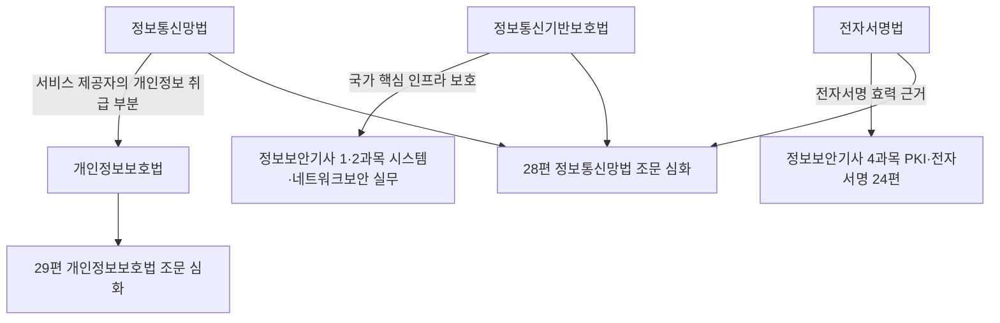
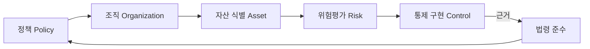

<Callout type="info">
  **이번 문서의 목표:** 정보보호 관련 4개 법(정보통신망법·개인정보보호법·정보통신기반보호법·전자서명법)이 각각 무엇을 규율하고 누가 관할하는지 지도로 그리고, 정책-조직-자산-위험이라는 거버넌스 골격이 이 과목 어디에서 심화되는지 파악해, 26~30편 법령·관리체계 편을 조문 하나하나가 아니라 구조 전체로 읽을 수 있게 된다.
</Callout>

## 왜 조문부터 외우면 안 되는가

정보보안기사 필기 5과목 정보보안관리 및 법규는 조문 번호와 처벌 규정이 촘촘하게 나오는 과목입니다. 그런데 조문을 낱개로 외우기 시작하면 정보통신망법 제45조와 개인정보보호법 제29조가 왜 둘 다 "안전조치"를 말하는지, 왜 어떤 사고는 개인정보보호위원회에 신고하고 어떤 사고는 다른 기관에 신고하는지 뒤섞여 버립니다. 실제로는 법마다 **누구를 규율하고 무엇을 지키게 하는지**가 처음부터 다르게 설계되어 있고, 이 차이를 먼저 지도로 그려 두면 이후 28·29편에서 조문을 하나씩 볼 때 "이 조문이 이 법 전체에서 어느 위치인가"를 놓치지 않습니다.

> **쉽게 말하면:** 이 편은 법 조문을 외우는 편이 아니라, 4개 법을 나란히 놓고 "이 법은 누구를, 왜 규제하는가"라는 지도를 그리는 편입니다.

## 정보보호 관련 4법 개관

정보보안기사 5과목에서 반복해서 등장하는 법은 크게 4개입니다. 소관부처와 핵심 규율대상을 표로 먼저 정리합니다.

| 법령 | 소관부처 | 핵심 규율대상 | 이 과목에서 심화되는 편 |
|------|----------|----------------|---------------------------|
| 정보통신망 이용촉진 및 정보보호 등에 관한 법률(정보통신망법) | 과학기술정보통신부·방송통신위원회 | 정보통신서비스 제공자의 정보보호조치 의무, 침해사고 대응 | 28 |
| 개인정보 보호법 | 개인정보보호위원회 | 공공·민간을 가리지 않는 모든 개인정보처리자의 개인정보 처리 전 단계 | 29 |
| 정보통신기반보호법 | 국가정보원·과학기술정보통신부 | 국가·사회적으로 중요한 주요정보통신기반시설의 보호 | 28 |
| 전자서명법 | 과학기술정보통신부 | 전자서명의 법적 효력과 인정사업자 제도 | 28 |

이 그림에서 눈여겨볼 점은 정보통신망법과 개인정보보호법이 **완전히 분리된 영역이 아니라 겹치는 부분이 있다**는 것입니다. 정보통신서비스 제공자가 이용자의 개인정보를 다루는 순간, 정보통신망법의 정보보호조치 의무와 개인정보보호법의 안전조치 의무가 동시에 걸립니다. 사고 하나가 두 법을 동시에 위반하는 경우가 실무에서 드물지 않은 이유가 여기에 있습니다.

## 법 하나씩: 핵심만 먼저 짚기

각 법의 조문 단위 세부 내용은 28·29편에서 다룹니다. 이 편에서는 "이 법이 왜 존재하고 무엇을 지키라는 법인가"만 짚습니다.

### 정보통신망법: 서비스 제공자의 의무

**정보통신망법**은 인터넷 홈페이지 운영자, 통신사업자 같은 **정보통신서비스 제공자**를 규율 대상으로 합니다. 핵심은 두 가지입니다. 첫째, 서비스 제공자는 해킹·바이러스 등 침해사고를 예방하기 위한 기술적·관리적 보호조치를 갖춰야 합니다(정보보호조치 의무). 둘째, 실제로 침해사고가 발생하면 정해진 기관에 신고해야 합니다(침해사고 신고 의무). 이 두 의무를 지키지 않은 상태에서 사고가 나면, 사고 자체의 피해와는 별개로 법 위반에 대한 제재가 추가됩니다.

### 개인정보보호법: 처리 전 단계를 규율

**개인정보보호법**은 정보통신서비스 제공자만이 아니라 공공기관·기업·단체를 가리지 않고 개인정보를 **수집·이용·제공·파기하는 모든 처리자**(개인정보처리자)를 규율합니다. 2023년 3월 14일 공포되어 같은 해 9월 15일 시행된 전부개정에서 실무에 영향이 큰 변화가 있었습니다.

- 그동안 온라인 사업자(정보통신서비스 제공자)와 오프라인 사업자에게 서로 다른 규정을 적용하던 **이원화 체계를 폐지**하고 하나의 법으로 통합했습니다.
- 드론·자율주행차처럼 움직이면서 촬영하는 장치를 규율하기 위한 **이동형 영상정보처리기기** 조항을 신설했습니다.
- 위반 시 부과하는 **과징금 상한을 전체 매출액의 100분의 3(3퍼센트)까지**로 정하되, 위반행위와 관련 없는 매출액은 산정에서 제외하도록 명확히 했습니다.

<Callout type="warning">
  과징금이 "전체 매출액의 3퍼센트"라고 해서 회사 매출 전부에 3퍼센트를 곱하는 것이 원칙이라는 뜻은 아닙니다. 법 조문은 위반행위와 **관련 없는 매출액은 제외**하도록 정하고 있어, 실제 산정에서는 위반과 관련된 사업 부문의 매출을 기준으로 계산합니다. 다만 상한선 자체가 매출액 연동으로 커졌다는 점, 그리고 최근에는 이 상한을 더 높이는 방향의 추가 개정 논의도 이어지고 있다는 점은 최신 동향으로 기억해 둘 필요가 있습니다.
</Callout>

### 정보통신기반보호법: 국가 핵심 인프라의 보호

**정보통신기반보호법**은 앞의 두 법과 달리 특정 개인정보나 특정 서비스가 아니라, 전력·금융·통신·교통처럼 마비되면 사회 전체가 흔들리는 **주요정보통신기반시설**을 보호 대상으로 삼습니다. 관계 중앙행정기관의 장이 소관 분야의 시설을 주요정보통신기반시설로 지정하고, 지정된 시설은 정기적인 취약점 분석·평가를 받아야 합니다. 이 법은 "누구의 개인정보를 지켰는가"가 아니라 "국가 기능이 마비되지 않았는가"를 기준으로 작동한다는 점에서 앞의 두 법과 성격이 다릅니다.

### 전자서명법: 전자서명의 법적 효력

**전자서명법**은 2020년 개정으로 공인인증서 제도가 폐지되면서, 특정 방식의 인증서만 우대하지 않고 다양한 전자서명 수단이 **동등한 법적 효력**을 가질 수 있도록 재정비되었습니다. 지금은 정부가 일정 요건을 충족한 사업자를 **전자서명인증사업자로 인정**하는 제도로 운영되며, 그 기술적 원리(공개키 기반, 전자서명 검증 절차)는 4과목 24편에서 PKI와 함께 심화됩니다.

## 실무 사례로 보는 법 위반의 결과: 대규모 통신사 개인정보 유출

법 조문이 실제로 어떻게 적용되는지는 사례로 보는 것이 가장 빠릅니다. 2024년, 국내 대형 이동통신사가 해킹으로 유심(USIM) 관련 정보가 유출된 사고가 대표적입니다.

<Steps>

1. **사고 개요** — 조사 결과 이용자 약 2324만여 명의 휴대전화번호, 가입자식별번호(IMSI), 유심 인증키 등 25종에 이르는 정보가 유출된 것으로 확인되었습니다.
2. **제재 결정** — 개인정보보호위원회는 해당 통신사에 대해 보안 조치 미흡 등을 이유로 과징금 약 1348억원과 과태료를 부과했습니다. 이는 개인정보보호위원회 출범 이후 가장 큰 규모의 과징금이었습니다.
3. **적용 근거** — 이 사건에서 부과된 과징금 규모는 2023년 전부개정으로 새로 도입된 "전체 매출액 3퍼센트 이하" 상한 규정이 실제로 적용된 대표 사례로 꼽힙니다.
4. **행정소송 진행** — 해당 통신사는 처분에 불복해 과징금 취소를 구하는 행정소송을 제기했으며, 사고 이후 투입한 보상·정보보호 투자 규모와 실질적 금융피해 발생 여부를 다투고 있습니다.

</Steps>

이 사례에서 배울 점은 세 가지입니다.

- **정보통신망법과 개인정보보호법이 동시에 걸릴 수 있다.** 통신서비스 제공자로서의 정보보호조치 의무(정보통신망법)와 개인정보처리자로서의 안전조치 의무(개인정보보호법)가 한 사고에서 함께 문제됩니다.
- **보안 조치 미흡 자체가 처벌 사유**입니다. 유출된 정보가 실제로 금융 피해에 악용되었는지 여부와 별개로, 사전에 갖춰야 할 기술적·관리적 보호조치를 갖추지 않았다는 사실만으로 제재 대상이 됩니다.
- **과징금 액수 산정이 법 개정과 직결된다.** 같은 규모의 사고라도 2023년 개정 이전 기준이었다면 과징금 상한 자체가 달랐을 것입니다. 법령의 최신 개정 내용을 모르면 시험에서도, 실무에서도 위험 수준을 잘못 판단하게 됩니다.

## 정보보호 거버넌스 골격: 정책-조직-자산-위험

법이 "무엇을 지켜야 하는가"의 최소 기준을 정한다면, 거버넌스는 조직이 **스스로** 그 기준을 넘어서는 수준까지 정보보호를 운영하는 틀입니다. 정책·조직·문서화·PDCA 순환의 세부 구조 자체는 독학사 3단계 정보보호 12편에서 이미 정리했으므로 이 편에서는 그 골격이 이 과목의 어느 편으로 이어지는지만 짚습니다.

| 거버넌스 요소 | 이 편에서의 위치 | 심화되는 본론 편 |
|---------------|-------------------|--------------------|
| 정책·조직·PDCA 순환 | 독학사 3단계 정보보호 12편에서 기본 구조 학습 완료 | 27편(대책 구현·ISMS-P 인증 실무) |
| 자산 식별·위험평가 | 이 편에서는 "위험평가 결과가 법적 의무와 연결된다"는 것만 인지 | 26편(위험평가 방법론·계산 문제) |
| 통제 구현의 법적 근거 | 4법이 요구하는 최소 기준 | 28편(정보통신망법·기반보호법·전자서명법), 29편(개인정보보호법) |
| 윤리·최신 동향 | 법이 다루지 못하는 신종 행위·국제 규범 비교 | 30편(사이버 윤리·최신 법 개정 동향) |

## 자주 틀리는 점

- **정보통신망법과 개인정보보호법을 같은 법으로 착각**: 두 법은 소관부처(방송통신위원회·과학기술정보통신부 vs 개인정보보호위원회)와 규율대상(정보통신서비스 제공자 vs 모든 개인정보처리자)이 다른 별개의 법입니다.
- **정보통신기반보호법을 개인정보 보호법으로 오해**: 이 법의 보호 대상은 특정인의 개인정보가 아니라 국가·사회 기능을 지탱하는 시설입니다.
- **전자서명법을 "공인인증서 의무 사용법"으로 오해**: 2020년 개정으로 특정 방식을 강제하지 않고, 다양한 전자서명 수단의 법적 효력을 동등하게 인정하는 방향으로 바뀌었습니다.
- **과징금 3퍼센트를 회사 전체 매출액에 그대로 곱하는 것으로 오해**: 위반행위와 관련 없는 매출액은 산정에서 제외되며, 3퍼센트는 상한선입니다.

## 핵심 정리

- 정보통신망법(서비스 제공자 규율)·개인정보보호법(모든 개인정보처리자 규율)·정보통신기반보호법(국가 핵심시설 보호)·전자서명법(전자서명 효력)은 규율대상과 소관부처가 각각 다르다.
- 2023년 개인정보보호법 전부개정은 온·오프라인 이원화 폐지, 이동형 영상정보처리기기 조항 신설, 과징금 상한 전체 매출액 3퍼센트 이하 도입이 핵심이다.
- 대형 통신사 유심정보 유출 사고는 개정법의 매출액 연동 과징금 규정이 실제로 적용된 대표 사례이며, 보안 조치 미흡 자체가 제재 사유가 될 수 있음을 보여준다.
- 거버넌스는 정책-조직-자산-위험-통제의 순환 구조이며, 이 과목에서는 26편(위험평가)·27편(대책 구현·ISMS-P)·28편·29편(법령 심화)·30편(윤리·최신 동향)으로 이어진다.

## 마무리 복습

<Quiz
  questionNumber={1}
  question="정보통신망법이 규율하는 대상으로 가장 적절한 것은?"
  options={['모든 개인정보처리자', '정보통신서비스 제공자', '주요정보통신기반시설 소유기관만', '전자서명인증사업자만']}
  correctAnswer={2}
  explanation="정보통신망법은 인터넷 홈페이지 운영자, 통신사업자 등 정보통신서비스 제공자의 정보보호조치·침해사고 신고 의무를 규율한다."
  optionExplanations={['모든 개인정보처리자를 규율하는 법은 개인정보보호법이다.', '정답. 정보통신망법의 핵심 규율대상은 정보통신서비스 제공자다.', '주요정보통신기반시설 보호는 정보통신기반보호법의 영역이다.', '전자서명인증사업자 인정 제도는 전자서명법의 영역이다.']}
/>

<Quiz
  questionNumber={2}
  question="개인정보보호법 2023년 전부개정의 내용으로 옳지 않은 것은?"
  options={['온라인·오프라인 사업자 이원화 체계를 폐지했다', '이동형 영상정보처리기기 조항을 신설했다', '과징금 상한을 전체 매출액의 100분의 3 이하로 정했다', '위반과 무관한 매출액도 과징금 산정에 그대로 포함하도록 했다']}
  correctAnswer={4}
  explanation="개정 규정은 과징금 산정 시 위반행위와 관련 없는 매출액을 제외하도록 명확히 했다. 나머지 세 항목은 실제 개정 내용이다."
  optionExplanations={['실제 개정 내용이다.', '실제 개정 내용이다.', '실제 개정 내용이다.', '정답. 관련 없는 매출액은 오히려 산정에서 제외하도록 정했다.']}
/>

<Quiz
  questionNumber={3}
  question="정보통신기반보호법의 보호 대상을 가장 정확히 설명한 것은?"
  options={['개인의 민감정보', '전자서명 검증 절차', '전력·통신·금융 등 주요정보통신기반시설', '기업 내부의 영업비밀 문서']}
  correctAnswer={3}
  explanation="정보통신기반보호법은 마비되면 국가·사회 전체에 영향을 주는 주요정보통신기반시설의 지정과 취약점 분석·평가를 규정한다."
  optionExplanations={['개인 민감정보 보호는 개인정보보호법의 영역이다.', '전자서명 검증 절차는 전자서명법·PKI 영역이다.', '정답. 국가 핵심 인프라 보호가 이 법의 목적이다.', '영업비밀은 별도의 법(부정경쟁방지법 등)에서 다루는 영역이다.']}
/>

<Quiz
  questionNumber={4}
  question="대형 통신사 유심정보 유출 사고에서 부과된 대규모 과징금과 관련된 설명으로 옳은 것은?"
  options={['유출된 정보가 실제 금융피해로 이어졌음이 확인되어야만 과징금을 부과할 수 있다', '보안 조치 미흡 자체만으로는 제재 사유가 되지 않는다', '이 사건은 정보통신망법과 개인정보보호법이 동시에 문제될 수 있음을 보여준다', '이 사고는 정보통신기반보호법 위반으로만 다뤄졌다']}
  correctAnswer={3}
  explanation="통신서비스 제공자의 정보보호조치 의무(정보통신망법)와 개인정보처리자의 안전조치 의무(개인정보보호법)가 한 사고에서 동시에 문제될 수 있다는 것을 보여주는 사례다."
  optionExplanations={['금융피해 발생 여부와 무관하게 보안 조치 미흡 자체가 제재 사유가 될 수 있다.', '보안 조치 미흡 자체가 제재 사유가 될 수 있다는 것이 이 사건의 핵심 시사점이다.', '정답. 두 법이 동시에 걸릴 수 있다는 점이 이 사례의 핵심이다.', '이 사고는 개인정보 유출 사고로 다뤄졌으며 정보통신기반보호법 사안이 아니다.']}
/>

<Quiz
  questionNumber={5}
  question="전자서명법의 최근 흐름에 대한 설명으로 가장 적절한 것은?"
  options={['특정 인증기관의 공인인증서만 법적 효력을 인정한다', '다양한 전자서명 수단이 동등한 법적 효력을 가질 수 있도록 정비되었다', '전자서명은 정보통신기반보호법에서 규율한다', '전자서명인증사업자 인정 제도는 폐지되었다']}
  correctAnswer={2}
  explanation="2020년 개정으로 공인인증서 우대 제도가 폐지되고, 요건을 충족하면 다양한 전자서명 수단이 동등한 법적 효력을 인정받을 수 있게 되었다."
  optionExplanations={['공인인증서 우대 제도는 폐지되었다.', '정답. 특정 방식을 강제하지 않고 동등한 효력을 인정하는 방향으로 개정되었다.', '전자서명은 전자서명법의 영역이며 정보통신기반보호법과는 다르다.', '전자서명인증사업자 인정 제도는 현재도 운영되고 있다.']}
/>

<Quiz
  questionNumber={6}
  question="정보보호 거버넌스의 정책-조직-자산-위험-통제 순환 구조에 대한 설명으로 옳지 않은 것은?"
  options={['위험평가 결과는 법적 의무 이행 여부와 무관하게 별개로 관리된다', '통제 구현의 최소 기준은 관련 법령에서 나온다', '정책·조직 구조는 문서화와 PDCA 순환으로 운영된다', '위험평가 방법론과 계산 문제는 26편에서 심화된다']}
  correctAnswer={1}
  explanation="위험평가 결과는 통제 구현으로 이어지고, 통제 구현의 최소 기준 상당 부분은 법령에서 나오므로 위험평가와 법적 의무는 서로 무관하지 않고 연결되어 있다."
  optionExplanations={['정답. 위험평가와 법적 의무는 통제 구현이라는 단계에서 서로 연결된다.', '옳은 설명이다. 4법이 요구하는 사항이 통제의 최소 기준이 된다.', '옳은 설명이다. 정책·조직·PDCA는 독학사 3단계 정보보호 12편에서 다룬 구조다.', '옳은 설명이다. 위험도 계산 문제는 26편에서 다룬다.']}
/>

## 참고 자료

- [개인정보 보호법 - 국가법령정보센터](https://www.law.go.kr/%EB%B2%95%EB%A0%B9/%EA%B0%9C%EC%9D%B8%EC%A0%95%EB%B3%B4%EB%B3%B4%ED%98%B8%EB%B2%95)
- [정보통신망 이용촉진 및 정보보호 등에 관한 법률 - 국가법령정보센터](https://www.law.go.kr/LSW/lsInfoP.do?lsId=000030&ancYnChk=0)
- [개인정보보호법 전면 개정 - 과징금 매출액 3% 명시, 바이라인네트워크](https://byline.network/2023/03/7-162/)
- [해킹사태 SK텔레콤, 1348억 역대 최대 과징금 어떻게 나왔나 - 뉴스1](https://www.news1.kr/politics/pm-bai-comm/5893636)
