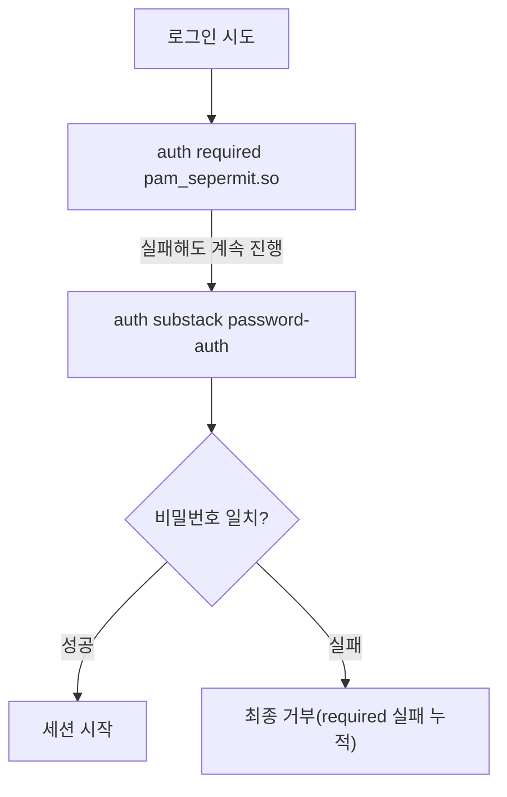

<Callout type="info">
  **이번 문서의 목표:** 리눅스 PAM 인증 스택과 sudoers 문법을 실제 설정 파일 예시로 읽고 쓸 수 있고, 윈도우 로컬 보안 정책·그룹 정책의 우선순위를 이벤트 로그와 함께 설명할 수 있으며, 다중요소 인증(MFA)의 원리와 그것이 왜 완전한 방어책이 아닌지, 모바일·IoT 단말 인증의 최신 쟁점까지 실무 감각으로 파악한다.
</Callout>

## 왜 계정·인증을 실무 설정값까지 파고드는가

계정을 UID로 식별하고, 최소 권한 원칙에 따라 필요한 권한만 부여하고, 계정을 분리해 단일 실패점을 줄인다는 원칙 자체는 독학사 3단계 정보보호 03편에서 이미 정리했습니다. 정보보안기사 필기 1과목 시스템보안은 이 원칙이 **실제로 어떤 설정 파일, 어떤 명령어, 어떤 로그로 구현되는지**를 묻습니다. "sudoers 파일에서 NOPASSWD 옵션이 무엇을 뜻하는가", "윈도우 이벤트 로그 4625번이 무엇을 기록하는가"처럼 원칙이 아니라 구현을 묻는 문제가 나온다는 뜻입니다. 이 편은 그 구현 수준까지 내려갑니다.

> **쉽게 말하면:** 이 편은 "왜 최소 권한이 중요한가"를 다시 설명하지 않고, "최소 권한을 실제로 어떤 파일에 어떻게 적어 넣는가"를 다룹니다.

## 리눅스 인증 스택: PAM의 구조

### 왜 인증 로직을 하나로 모아야 하는가

리눅스 시스템에는 SSH 접속, 콘솔 로그인, `su` 명령으로 다른 사용자 전환, `sudo` 명령으로 권한 상승 등 로그인이 일어나는 경로가 여러 개 있습니다. 이 경로마다 인증 로직(비밀번호 확인, 계정 잠금, 접속 시간 제한)을 따로 구현하면 코드가 중복되고, 한 곳만 고치고 다른 곳을 빠뜨리는 실수가 생깁니다.

> **쉽게 말하면:** 로그인 방법은 여러 가지지만, "이 사람이 맞는지 확인하는 규칙"은 한곳에서 관리하고 싶다는 문제를 해결하는 장치가 PAM입니다.

**PAM**(Pluggable Authentication Modules, 끼워 넣을 수 있는 인증 모듈)은 응용 프로그램이 인증 로직을 직접 구현하지 않고, 공통 인터페이스를 통해 필요한 인증 모듈을 그때그때 불러 쓰게 하는 리눅스 표준 인증 프레임워크입니다.

### PAM 설정 파일 읽는 법

PAM 설정은 `/etc/pam.d/` 디렉터리 아래, 서비스 이름과 같은 파일에 들어 있습니다. `sshd` 서비스의 설정 일부를 예로 봅니다.

```
# /etc/pam.d/sshd (일부 발췌)
auth       required     pam_sepermit.so
auth       substack     password-auth
auth       include      postlogin
account    required     pam_nologin.so
account    include      password-auth
password   include      password-auth
session    required     pam_selinux.so close
session    required     pam_loginuid.so
session    include      postlogin
```

각 줄은 왼쪽부터 **관리 그룹**, **컨트롤 플래그**, **모듈 이름** 순서로 읽습니다.

| 관리 그룹 | 역할 |
|-----------|------|
| auth | 사용자가 맞는지 자격을 확인(비밀번호·지문 등) |
| account | 계정 자체가 유효한지 확인(만료 여부, 접속 허용 시간대) |
| password | 비밀번호 변경 시 규칙(복잡도 등) 적용 |
| session | 로그인 성공 뒤부터 로그아웃까지 세션 설정(환경변수, 로그 기록) |

컨트롤 플래그는 그 줄의 성공·실패가 전체 인증 결과에 어떤 영향을 주는지를 정합니다.

| 플래그 | 실패 시 동작 |
|--------|--------------|
| required | 실패해도 같은 그룹의 나머지 모듈을 마저 실행한 뒤, 최종적으로 인증을 거부한다 |
| requisite | 실패하면 그 즉시 나머지 모듈을 건너뛰고 바로 인증을 거부한다 |
| sufficient | 성공하면 그것만으로 즉시 인증을 통과시킨다(단, 앞선 required가 실패했다면 통과되지 않는다) |
| optional | 다른 모듈의 성공·실패 결과가 없을 때만 이 모듈의 결과를 참고한다 |



<Callout type="warning">
  required와 requisite를 헷갈리기 쉽습니다. **required는 실패해도 그 스택의 다른 모듈을 마저 실행**하고 나서 전체를 거부하지만, **requisite는 실패한 순간 즉시 중단하고 거부**합니다. 순서를 잘못 배치하면 뒤에 있는 모듈이 실행되지 않아 의도한 로그 기록이나 잠금 처리가 빠질 수 있습니다.
</Callout>

### 실무 적용: 로그인 실패 잠금 설정

무차별 대입 공격(Brute-force Attack)을 막으려면 로그인 실패가 일정 횟수 누적되면 계정을 일시 잠그는 설정이 필요합니다. 최신 배포판에서는 `pam_faillock` 모듈을 씁니다.

```
# /etc/pam.d/system-auth (일부 발췌)
auth        required      pam_faillock.so preauth silent deny=5 unlock_time=600
auth        [success=1 default=bad]  pam_unix.so
auth        [default=die] pam_faillock.so authfail deny=5 unlock_time=600
```

- `deny=5`: 로그인 실패가 5회 누적되면 잠근다.
- `unlock_time=600`: 잠근 뒤 600초(10분)가 지나면 자동으로 잠금이 풀린다.

실패 잠금 상태는 다음 명령으로 직접 확인할 수 있습니다.

```
faillock --user jkim
```

## sudoers 파일 문법과 최소권한 설정

### 왜 반드시 visudo로 열어야 하는가

`/etc/sudoers` 파일은 어떤 사용자가 어떤 명령을 관리자 권한으로 실행할 수 있는지 정의합니다. 이 파일은 절대 일반 편집기로 직접 열지 않고, 전용 명령인 `visudo`로 엽니다.

```
visudo
```

`visudo`는 저장 시 문법 검사를 수행해, 오타 하나로 sudoers 파일이 깨져 시스템 전체에서 sudo가 작동하지 않게 되는 사고를 막아 줍니다. 문법이 깨진 상태로 저장되면 관리자 권한을 되찾기 위해 복구 모드로 부팅해야 하는 상황까지 갈 수 있습니다.

### sudoers 문법과 최소 권한 설정 예시

```
# /etc/sudoers (일부 발췌)
%wheel        ALL=(ALL)       ALL
deploy        ALL=(root)      NOPASSWD: /usr/bin/systemctl restart nginx
backup_svc    ALL=(root)      NOPASSWD: /usr/local/bin/run_backup.sh
```

- 첫 줄: `wheel` 그룹에 속한 모든 계정이 모든 호스트(`ALL`)에서 `root` 권한(`(ALL)`)으로 모든 명령(`ALL`)을 실행할 수 있다는 뜻입니다.
- 둘째 줄: `deploy` 계정은 `root` 권한으로 딱 한 가지 명령, nginx 서비스 재시작만 비밀번호 확인 없이(`NOPASSWD`) 실행할 수 있습니다.
- 셋째 줄: `backup_svc` 계정은 지정된 백업 스크립트 하나만 실행할 수 있습니다.

**계산·적용 관점에서 봐야 할 점**은 둘째·셋째 줄이 최소 권한 원칙을 sudoers 문법으로 구현한 예라는 것입니다. `deploy` 계정이 `ALL=(ALL) ALL`을 받았다면 사실상 관리자 계정과 동일한 권한을 갖게 되어, 그 계정 하나가 탈취당하면 시스템 전체가 위험해집니다. 반대로 명령을 하나로 좁혀 두면 같은 계정이 탈취되어도 피해 범위가 그 명령으로 한정됩니다.

<Callout type="warning">
  `NOPASSWD` 옵션은 편의를 위해 자주 쓰이지만, 남용하면 그 계정이 탈취되었을 때 추가 인증 없이 곧바로 관리자 권한 명령을 실행할 수 있게 되므로 위험이 커집니다. 자동화 스크립트처럼 사람이 개입할 수 없는 상황에만 최소 범위로 적용하는 것이 원칙입니다.
</Callout>

### sudo 실행 로그 확인

sudo로 실행된 모든 명령은 시스템 로그에 남습니다. 배포판에 따라 `/var/log/secure`(레드햇 계열) 또는 `/var/log/auth.log`(데비안 계열)에서 확인합니다.

```
Oct  3 09:12:41 web01 sudo:  deploy : TTY=pts/0 ; PWD=/home/deploy ; USER=root ; COMMAND=/usr/bin/systemctl restart nginx
```

이 한 줄만으로 **누가**(`deploy`), **언제**(9시 12분 41초), **어디서**(`pts/0` 터미널), **무엇을**(nginx 재시작) 관리자 권한으로 실행했는지 전부 추적됩니다. 09편에서 다룰 로그 분석·상관분석의 가장 기본 단위가 바로 이런 인증·권한 로그입니다.

## 윈도우 로컬 보안 정책·그룹 정책 심화

### 정책의 종류와 우선순위

윈도우는 리눅스처럼 텍스트 설정 파일을 직접 고치는 대신, **로컬 보안 정책**(`secpol.msc`)과 **그룹 정책**(Group Policy, `gpedit.msc` 또는 도메인 환경의 GPO)이라는 정책 편집 도구로 보안 설정을 관리합니다. 여러 계층의 정책이 동시에 적용될 수 있어 우선순위를 알아야 합니다.


정책은 로컬 → 사이트 → 도메인 → OU 순서로 적용되며, **가장 마지막에 적용되는 OU 수준의 정책이 최종적으로 우선**합니다. 그래서 로컬 컴퓨터에서 아무리 강력한 정책을 걸어 두어도, 그 컴퓨터가 속한 도메인·OU에 다른 정책이 있으면 최종적으로는 도메인 쪽 정책이 적용됩니다.

### 주요 계정 정책 항목

| 정책 경로 | 항목 | 실무 설정 예시 |
|-----------|------|-----------------|
| 계정 정책 → 암호 정책 | 최소 암호 길이 | 8자 이상 |
| 계정 정책 → 암호 정책 | 암호는 복잡성을 만족해야 함 | 사용(대소문자·숫자·특수문자 조합 요구) |
| 계정 정책 → 계정 잠금 정책 | 계정 잠금 임계값 | 5회 실패 시 잠금 |
| 계정 정책 → 계정 잠금 정책 | 계정 잠금 기간 | 15분 |
| 로컬 정책 → 사용자 권한 할당 | 네트워크를 통한 이 컴퓨터 액세스 거부 | 손님(Guest) 계정 명시적 거부 |

정책을 적용한 뒤 즉시 반영하려면 다음 명령을 씁니다.

```
gpupdate /force
```

특정 컴퓨터나 사용자에게 실제로 어떤 정책이 최종 적용되었는지 확인하려면 다음 명령으로 결과 보고서를 생성합니다.

```
gpresult /r
```

### 이벤트 로그로 계정 활동 추적

윈도우는 계정 관련 활동을 이벤트 뷰어의 보안 로그에 이벤트 ID로 남깁니다. 필기 시험에서도 이벤트 ID와 그 의미를 매칭하는 문제가 나옵니다.

| 이벤트 ID | 의미 |
|-----------|------|
| 4624 | 계정 로그온 성공 |
| 4625 | 계정 로그온 실패 |
| 4720 | 사용자 계정 생성 |
| 4726 | 사용자 계정 삭제 |
| 4732 | 로컬 그룹에 멤버 추가 |
| 4740 | 사용자 계정이 잠김 |

<Callout type="warning">
  4624와 4625는 마지막 숫자 하나만 다른데 뜻이 완전히 반대(성공/실패)입니다. 짧은 시간 안에 같은 계정에서 4625가 여러 번 반복된 뒤 4624가 나타난다면, 무차별 대입 공격이 성공했을 가능성을 의심해야 하는 전형적인 로그 패턴입니다.
</Callout>

## 다중요소 인증(MFA)과 그 한계

### 왜 비밀번호만으로는 부족한가

비밀번호는 사용자가 **아는 것**(지식 기반) 한 가지에만 의존합니다. 피싱으로 비밀번호를 알아내거나, 다른 사이트에서 유출된 아이디·비밀번호 조합을 그대로 대입해 보는 크리덴셜 스터핑(Credential Stuffing) 공격 앞에서는 비밀번호 하나만으로는 취약합니다. **다중요소 인증**(Multi-Factor Authentication, MFA)은 지식(비밀번호)·소유(스마트폰·보안키)·생체(지문·얼굴)라는 서로 다른 성격의 요인을 두 가지 이상 조합해, 하나가 뚫려도 나머지가 방어선이 되게 하는 방식입니다.

### TOTP의 계산 원리

가장 널리 쓰이는 MFA 방식 중 하나는 **시간 기반 일회용 비밀번호**(Time-based One-Time Password, TOTP)입니다. 스마트폰 인증 앱에 6자리 숫자가 30초마다 바뀌는 방식을 떠올리면 됩니다.

$$
T = \left\lfloor \frac{\text{현재 유닉스 시각} - T_0}{X} \right\rfloor
$$

- $T_0$: 기준 시각(보통 0, 즉 1970년 1월 1일)
- $X$: 시간 구간 길이(보통 30초)
- $T$: 이 시간 구간의 일련번호(정수)

이렇게 구한 정수 $T$와, 최초 등록 시 서버와 인증 앱이 함께 공유한 비밀 키 $K$를 해시 기반 알고리즘(HOTP)에 넣어 6자리 숫자를 만듭니다. 서버와 인증 앱이 같은 $K$와 같은 30초 구간의 $T$를 갖고 있으면 같은 숫자가 나오므로, 두 값을 대조하는 것만으로 인증이 성립합니다.

**해석**: 이 구조에서 공격자가 TOTP를 뚫으려면 비밀 키 $K$ 자체를 훔치거나, 30초라는 짧은 유효 시간 안에 사용자가 방금 입력한 숫자를 실시간으로 가로채야 합니다.

### MFA도 완전한 방어책은 아니다: 실시간 중계 피싱

MFA가 있으니 안전하다고 단정하면 안 됩니다. **AiTM**(Adversary-in-the-Middle, 중간자 적대자) 피싱은 가짜 로그인 페이지를 사용자와 실제 서비스 사이에 끼워 넣어, 사용자가 입력하는 비밀번호와 방금 발급받은 TOTP·세션 쿠키까지 실시간으로 그대로 중계·탈취합니다. 사용자는 정상적으로 로그인에 성공한 것처럼 보이지만, 뒤에서 공격자도 같은 세션을 함께 획득하게 됩니다.

<Callout type="warning">
  **자주 틀리는 점:** "MFA를 적용했으니 피싱에는 안전하다"는 문장은 필기 시험의 함정 보기로 자주 나옵니다. TOTP·SMS 기반 MFA는 실시간 중계형 피싱(AiTM) 앞에서 우회될 수 있으며, 이런 유형에 더 강한 방어책은 사용자 개입 없이 도메인을 암호학적으로 검증하는 FIDO2/WebAuthn 기반 보안키입니다.
</Callout>

## 최신 모바일·IoT 단말 인증 이슈

스마트폰의 지문·얼굴 인증은 **TEE**(Trusted Execution Environment, 신뢰 실행 환경)라는 격리된 하드웨어 영역 안에서 생체 정보와 매칭이 이루어지고, 매칭 결과(성공/실패)만 운영체제로 전달됩니다. 생체정보 원본 자체는 TEE 밖으로 나가지 않는 구조입니다.

반면 IoT(사물인터넷) 기기는 정반대의 문제를 안고 있습니다. 다수의 가정용 공유기·CCTV·셋톱박스가 제조사가 심어 둔 **기본 계정·기본 비밀번호**(예: admin/admin)를 사용자가 바꾸지 않은 채로 인터넷에 노출되어 있습니다. 공격자는 이런 기본 계정 목록만으로 대량의 기기를 자동 스캔해 장악할 수 있으며, 이렇게 장악된 기기들이 대규모 디도스(DDoS) 공격에 동원되는 봇넷의 재료가 됩니다. 이 흐름은 13편(DoS·DDoS 공격 심화)에서 다시 이어집니다.

## 자주 틀리는 점

- **PAM의 required와 requisite를 같은 것으로 오해**: required는 실패해도 스택을 끝까지 진행하고, requisite는 실패 즉시 중단한다.
- **sudoers의 NOPASSWD를 안전한 편의 기능으로만 생각**: 계정 탈취 시 추가 인증 없이 바로 권한이 넘어가므로 범위를 최소화해야 한다.
- **로컬 보안 정책이 항상 우선한다고 오해**: 도메인 환경에서는 가장 나중에 적용되는 OU 수준 GPO가 최종 우선한다.
- **MFA를 적용하면 피싱에 안전하다고 오해**: 실시간 중계형 피싱(AiTM)은 TOTP까지 가로챌 수 있다.
- **이벤트 ID 4624와 4625를 혼동**: 4624는 로그온 성공, 4625는 로그온 실패다.

## 핵심 정리

- PAM은 auth·account·password·session 네 관리 그룹과 required·requisite·sufficient·optional 컨트롤 플래그로 인증 로직을 조합하며, pam_faillock으로 로그인 실패 잠금을 구현한다.
- sudoers는 visudo로만 편집하며, 계정별로 실행 가능한 명령을 좁게 지정하는 것이 최소 권한 원칙의 실무 구현이다. 실행 로그는 /var/log/secure 또는 /var/log/auth.log에 남는다.
- 윈도우 그룹 정책은 로컬 → 사이트 → 도메인 → OU 순으로 적용되며 가장 나중에 적용된 정책이 우선하고, 이벤트 ID(4624·4625·4720 등)로 계정 활동을 추적한다.
- MFA는 지식·소유·생체 요인을 조합해 단일 요인의 약점을 보완하지만, 실시간 중계형 피싱(AiTM) 앞에서는 TOTP·SMS 기반 방식도 우회될 수 있다.
- IoT 기기의 기본 계정·비밀번호 미변경은 대규모 봇넷의 주요 원인이 된다.

## 마무리 복습

<Quiz
  questionNumber={1}
  question="PAM 설정에서 컨트롤 플래그 required와 requisite의 차이로 옳은 것은?"
  options={['둘 다 실패 즉시 인증을 중단한다', 'required는 실패해도 스택을 끝까지 진행하고, requisite는 실패 즉시 중단한다', 'requisite는 성공하면 즉시 인증을 통과시킨다', '둘 다 실패해도 인증 결과에 영향을 주지 않는다']}
  correctAnswer={2}
  explanation="required는 실패해도 같은 그룹의 나머지 모듈을 마저 실행한 뒤 최종적으로 거부하고, requisite는 실패한 즉시 나머지 모듈을 건너뛰고 바로 거부한다."
  optionExplanations={['required는 실패해도 스택을 계속 진행한다.', '정답. 두 플래그의 핵심 차이는 실패 시 스택을 계속 진행하는지 여부다.', '성공 시 즉시 통과시키는 것은 sufficient의 특징이다.', '둘 다 실패는 최종적으로 인증 거부에 반영된다.']}
/>

<Quiz
  questionNumber={2}
  question="sudoers 파일에서 아래 설정에 대한 해석으로 옳은 것은? 설정: deploy ALL=(root) NOPASSWD: 특정 서비스 재시작 명령"
  options={['deploy 계정은 비밀번호 없이 모든 명령을 root 권한으로 실행할 수 있다', 'deploy 계정은 지정된 서비스 재시작 명령 하나만 비밀번호 없이 root 권한으로 실행할 수 있다', 'deploy 계정은 root 계정 자체로 로그인할 수 있게 된다', '이 설정은 wheel 그룹 전체에 적용된다']}
  correctAnswer={2}
  explanation="이 줄은 deploy 계정이 지정된 명령 하나에 한해 비밀번호 확인 없이 root 권한으로 실행할 수 있도록 범위를 좁혀 최소 권한 원칙을 구현한 예다."
  optionExplanations={['모든 명령이 아니라 지정된 명령 하나로 범위가 한정되어 있다.', '정답. 범위가 지정된 명령 하나로 한정된 것이 이 설정의 핵심이다.', 'sudo 설정은 root 로그인을 허용하는 것이 아니라 특정 명령의 실행 권한만 부여한다.', 'wheel 그룹이 아니라 deploy라는 개별 계정에 적용된 설정이다.']}
/>

<Quiz
  questionNumber={3}
  question="윈도우 도메인 환경에서 그룹 정책이 최종 적용되는 우선순위로 옳은 것은?"
  options={['로컬이 항상 가장 우선한다', '도메인이 항상 가장 우선한다', '로컬, 사이트, 도메인, OU 순으로 적용되며 가장 나중에 적용된 OU 정책이 우선한다', 'OU가 항상 무시되고 사이트 정책만 적용된다']}
  correctAnswer={3}
  explanation="그룹 정책은 로컬, 사이트, 도메인, OU 순서로 차례로 적용되며 가장 마지막에 적용되는 OU 수준의 정책이 최종적으로 우선한다."
  optionExplanations={['로컬 정책은 가장 먼저 적용되며 이후 정책에 덮어써질 수 있다.', '도메인 정책도 그 다음 OU 정책에 덮어써질 수 있다.', '정답. 마지막에 적용되는 OU 정책이 최종 우선한다.', 'OU 정책은 오히려 가장 나중에 적용되어 우선하는 정책이다.']}
/>

<Quiz
  questionNumber={4}
  question="윈도우 보안 이벤트 로그에서 이벤트 ID 4625가 의미하는 것은?"
  options={['계정 로그온 성공', '계정 로그온 실패', '사용자 계정 생성', '로컬 그룹에 멤버 추가']}
  correctAnswer={2}
  explanation="4625는 계정 로그온 실패를 기록하는 이벤트 ID이며, 4624(로그온 성공)와 짝을 이룬다."
  optionExplanations={['로그온 성공은 4624다.', '정답. 4625는 로그온 실패를 기록한다.', '계정 생성은 4720이다.', '그룹에 멤버 추가는 4732다.']}
/>

<Quiz
  questionNumber={5}
  question="다중요소 인증(MFA)에 대한 설명으로 옳지 않은 것은?"
  options={['지식·소유·생체 요인 중 두 가지 이상을 조합한다', 'TOTP는 공유된 비밀 키와 현재 시간 구간을 이용해 계산된다', 'MFA를 적용하면 어떤 형태의 피싱 공격에도 안전하다', '실시간 중계형 피싱은 TOTP 값과 세션 쿠키까지 가로챌 수 있다']}
  correctAnswer={3}
  explanation="MFA는 단일 요인 인증보다 안전성을 높이지만, 실시간 중계형 피싱(AiTM)처럼 사용자가 입력한 값을 그대로 가로채는 공격 앞에서는 완전한 방어책이 되지 못한다."
  optionExplanations={['MFA의 기본 정의에 해당하는 옳은 설명이다.', 'TOTP 계산 원리에 대한 옳은 설명이다.', '정답. MFA도 실시간 중계형 피싱 앞에서는 우회될 수 있다.', 'AiTM 피싱의 실제 위협에 대한 옳은 설명이다.']}
/>

<Quiz
  questionNumber={6}
  question="IoT 기기의 대표적인 인증 관련 취약점으로 가장 적절한 것은?"
  options={['TEE 신뢰 실행 환경 안에서만 생체정보를 처리한다', '제조사가 심어 둔 기본 계정과 비밀번호를 사용자가 바꾸지 않고 인터넷에 노출한다', '모든 IoT 기기는 출고 시 다중요소 인증이 기본 설정되어 있다', 'IoT 기기는 네트워크에 연결되지 않아 계정 탈취 위험이 없다']}
  correctAnswer={2}
  explanation="다수의 IoT 기기가 기본 계정·비밀번호를 그대로 둔 채 인터넷에 노출되어 있으며, 공격자는 이를 자동 스캔해 장악한 뒤 대규모 봇넷 구성에 악용한다."
  optionExplanations={['TEE는 스마트폰 생체인증에서 쓰이는 안전한 구조이며 IoT 취약점이 아니다.', '정답. 기본 계정·비밀번호 미변경이 IoT의 대표적 취약점이다.', 'IoT 기기 상당수는 기본 설정에 다중요소 인증이 적용되어 있지 않다.', 'IoT 기기는 대부분 네트워크에 연결되어야 기능하므로 이 설명은 사실과 반대다.']}
/>

## 참고 자료

- [한국방송통신전파진흥원(cq.or.kr) - 정보보안기사 자격정보](https://www.cq.or.kr/qh_quagm01_020.do)
- [itwiki - 정보보안기사 필기 출제기준](https://itwiki.kr/w/정보보안기사_필기_출제기준)
- [공공데이터포털 - 국가기술자격검정 정보보안 종목 출제기준](https://www.data.go.kr/data/15140079/fileData.do)
