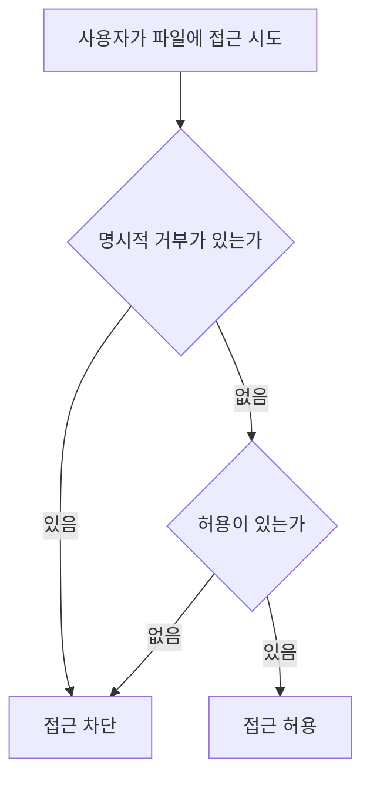
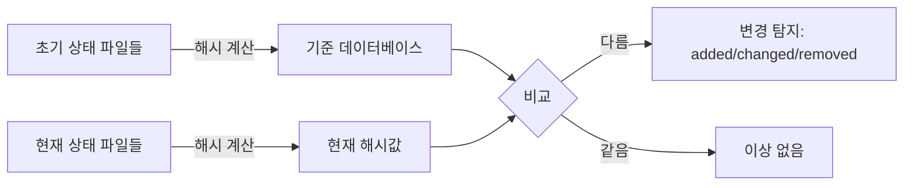

<Callout type="info">
  **이번 문서의 목표:** 리눅스 표준 권한(rwx)만으로는 표현할 수 없는 세밀한 접근통제를 ACL·SetUID·SetGID·Sticky Bit로 구현하는 법, 윈도우 NTFS 권한과 상속·거부 우선순위, 파일이 실제로 변조되었는지 탐지하는 AIDE 기반 무결성 점검, 내부자 유출을 막는 DLP 정책까지 실무 명령어 수준으로 파악한다.
</Callout>

## 왜 rwx만으로는 부족한가

독학사 3단계 정보보호 03편에서 리눅스 권한 문자열(예: `-rwxr-xr--`)을 소유자·그룹·기타 세 그룹으로 읽고 8진수로 변환하는 법을 이미 다뤘습니다. 그런데 실무에서는 이 세 그룹만으로 표현할 수 없는 상황이 자주 생깁니다. 예를 들어 파일 소유자도 아니고 그 파일이 속한 그룹 구성원도 아닌 **특정 사용자 한 명에게만** 읽기 권한을 추가로 주고 싶다면, 소유자·그룹·기타라는 세 칸짜리 구조로는 표현할 방법이 없습니다. 이 편은 이 한계를 넘어서는 확장 접근통제부터 시작합니다.

## 리눅스 확장 접근제어: ACL

### 정의와 필요성

**ACL**(Access Control List, 접근제어 목록)은 소유자·그룹·기타라는 표준 3단 구조를 넘어, 특정 사용자나 특정 그룹 각각에 대해 개별적으로 권한을 지정할 수 있게 해 주는 확장 권한 체계입니다.

> **쉽게 말하면:** rwx가 "이 방에는 주인, 룸메이트, 나머지 사람" 세 종류로만 손님을 구분한다면, ACL은 "저 사람만 특별히 들여보내라"는 개별 초대장을 추가로 붙이는 것과 같습니다.

### 실무 명령어: setfacl과 getfacl

`report.txt` 파일의 소유자는 `hong`이고 그룹은 `dev`인데, 그 그룹에 속하지 않은 `jkim`이라는 사용자에게만 읽기·쓰기 권한을 추가로 주고 싶다고 합시다.

```
setfacl -m u:jkim:rw- report.txt
```

설정된 ACL은 다음 명령으로 확인합니다.

```
getfacl report.txt
```

```
# file: report.txt
# owner: hong
# group: dev
user::rw-
user:jkim:rw-
group::r--
mask::rw-
other::r--
```

`ls -l`로 이 파일을 보면 권한 문자열 맨 끝에 더하기 기호(`+`)가 붙어 `-rw-rw-r--+`처럼 표시됩니다. 이 `+`는 "표준 rwx 외에 ACL이 추가로 설정되어 있다"는 신호입니다.

### mask가 실제 권한을 제한하는 방식

ACL에는 `mask`라는 항목이 있습니다. `mask`는 소유자를 제외한 그룹·특정 사용자·특정 그룹에 적용되는 **최대 허용치**로 작동합니다. 예를 들어 `jkim`에게 `rw-`를 부여했더라도 `mask`가 `r--`로 설정되어 있다면, 실제로 적용되는 유효 권한은 `mask`와의 교집합인 `r--`로 줄어듭니다.

**계산 예시**: `user:jkim:rw-`이지만 `mask::r--`라면, 유효 권한은 다음과 같이 계산됩니다.

$$
\text{유효 권한} = \text{설정 권한} \cap \text{mask}
$$

- 설정 권한 $rw$-와 mask $r$--의 교집합은 $r$--이므로, `jkim`은 실제로는 읽기만 가능합니다.

<Callout type="warning">
  ACL을 설정한 뒤 예상한 권한이 적용되지 않는다면, 개별 사용자·그룹 항목이 아니라 **mask 값부터 확인**해야 합니다. `setfacl -m m::rwx 파일명`으로 mask를 넓혀 주지 않으면 아무리 개별 권한을 넓게 줘도 mask에 걸려 제한됩니다.
</Callout>

## SetUID·SetGID·Sticky Bit

### 왜 필요한가: 일반 사용자가 비밀번호를 바꾸는 딜레마

리눅스에서 사용자 비밀번호 정보는 `/etc/shadow` 파일에 저장되며, 이 파일은 `root`만 쓸 수 있도록 매우 엄격하게 제한되어 있습니다. 그런데 일반 사용자도 `passwd` 명령으로 자기 비밀번호를 바꿀 수 있어야 합니다. 일반 사용자 권한으로 실행된 `passwd` 프로세스가 어떻게 `root`만 쓸 수 있는 파일을 수정할 수 있을까요?

> **쉽게 말하면:** 평소에는 잠겨 있는 문을, 정해진 열쇠(프로그램)를 통해서만 잠깐 열리게 해 주는 장치가 SetUID입니다.

**SetUID**(Set User ID, 설정된 사용자 ID)는 실행 파일에 이 비트를 설정해 두면, 그 파일을 **누가 실행하든 파일 소유자의 권한으로** 실행되게 하는 특수 권한입니다. `passwd` 명령어 파일의 소유자가 `root`이고 SetUID가 설정되어 있으므로, 일반 사용자가 실행해도 그 순간만큼은 `root` 권한으로 동작해 `/etc/shadow`를 수정할 수 있습니다.

```
ls -l /usr/bin/passwd
```

```
-rwsr-xr-x. 1 root root 33544 3월  1  2024 /usr/bin/passwd
```

소유자 권한 자리(`rws`)에서 실행 권한(`x`) 자리에 `s`가 나타난 것이 SetUID가 설정되어 있다는 표시입니다.

| 특수 권한 | 8진수 값 | 대상 | 표시 문자 |
|-----------|----------|------|-----------|
| SetUID | 4000 | 실행 파일 소유자 | 소유자 실행 자리의 s(소문자) |
| SetGID | 2000 | 실행 파일 그룹, 또는 디렉터리 | 그룹 실행 자리의 s(소문자) |
| Sticky Bit | 1000 | 주로 디렉터리 | 기타 실행 자리의 t(소문자) |

SetUID 권한을 부여하려면 8진수 앞자리에 4를 추가합니다.

```
chmod 4755 특정프로그램
```

**SetGID**는 디렉터리에 설정하면 그 디렉터리 안에 새로 만들어지는 파일이 만든 사람의 기본 그룹이 아니라, **디렉터리 자체의 그룹을 자동으로 물려받게** 합니다. 여러 사람이 함께 쓰는 공유 작업 디렉터리에서 그룹 권한을 일관되게 유지할 때 씁니다.

**Sticky Bit**는 대표적으로 `/tmp` 디렉터리에 설정되어 있습니다.

```
drwxrwxrwt. 10 root root 4096 10월  3 09:00 /tmp
```

`/tmp`는 모든 사용자가 쓰기 가능(`rwxrwxrwx`)한 공용 디렉터리인데, Sticky Bit(`t`)가 없다면 다른 사용자가 만든 파일을 아무나 지울 수 있게 됩니다. Sticky Bit가 설정되면 **디렉터리 안의 파일을 지울 수 있는 사람은 그 파일의 소유자와 root로 제한**됩니다.

### 실행 권한 없이 s·t만 있는 경우: 대문자 S·T

소유자 실행 권한(`x`)이 애초에 없는 상태에서 SetUID만 설정하면, 소문자 `s` 대신 대문자 `S`로 표시됩니다.

$$
\text{실행 권한(x) 있음} + \text{SetUID} \Rightarrow s
$$

$$
\text{실행 권한(x) 없음} + \text{SetUID} \Rightarrow S
$$

**해석**: 대문자 `S` 또는 `T`는 "실행할 수도 없는 파일에 SetUID·Sticky 비트만 켜져 있는" 상태로, 대부분 설정 실수이거나 점검이 필요한 신호입니다.

### 보안 위협: SetUID 루트 바이너리를 이용한 권한 상승

SetUID가 `root` 소유 실행 파일에 걸려 있는데 그 프로그램 자체에 취약점이 있다면, 일반 사용자가 이 프로그램을 통해 잠깐이라도 `root` 권한을 얻어 악용할 수 있습니다. 그래서 시스템 점검에서는 SetUID가 걸린 파일 목록을 정기적으로 확인합니다.

```
find / -perm -4000 -type f 2>/dev/null
```

이 명령은 시스템 전체에서 SetUID 비트가 설정된 일반 파일을 찾아 목록으로 보여 줍니다. 점검자는 이 목록에 있는 파일이 정말 SetUID가 필요한 프로그램인지, 혹시 불필요하게 설정되어 있거나 알려진 취약점이 있는 버전은 아닌지 대조합니다. 이 점검은 08편에서 다룰 권한 상승 공격 방어의 실무적 출발점입니다.

## 윈도우 NTFS 권한과 상속

### 표준 권한과 허용·거부의 우선순위

윈도우 NTFS 파일 시스템은 rwx 대신 더 세분화된 표준 권한을 제공합니다.

| NTFS 표준 권한 | 의미 |
|------------------|------|
| 읽기 | 파일 내용·속성 조회 |
| 쓰기 | 파일에 데이터 추가·속성 변경 |
| 읽기 및 실행 | 읽기에 더해 프로그램으로 실행 |
| 수정 | 읽기·쓰기·실행에 더해 삭제까지 가능 |
| 모든 권한 | 소유권 변경을 포함한 전체 제어 |
| 특수 권한 | 위 항목을 더 세분화한 개별 권한 조합 |

권한은 **허용**(Allow)과 **거부**(Deny) 두 방향으로 각각 부여할 수 있는데, 같은 대상에 대해 허용과 거부가 동시에 설정되어 있다면 **거부가 항상 우선**합니다.



### 상속(Inheritance)

NTFS 권한은 기본적으로 상위 폴더에서 하위 폴더·파일로 **상속**됩니다. 특정 하위 폴더만 별도 권한 체계로 관리하고 싶다면 상속을 끊어야 합니다.

```
icacls C:\data\confidential /inheritance:r
```

이 명령은 `confidential` 폴더가 상위 폴더의 권한을 더 이상 물려받지 않도록 상속을 제거합니다. 이후 새로운 권한을 명시적으로 부여합니다.

```
icacls C:\data\confidential /grant jkim:(R,W)
```

### 공유 권한과 NTFS 권한이 겹칠 때: 더 제한적인 쪽이 적용

네트워크로 공유된 폴더는 **공유(Share) 권한**과 **NTFS 권한**이 동시에 적용됩니다. 두 권한이 서로 다르게 설정되어 있다면, 최종적으로 적용되는 유효 권한은 **둘 중 더 제한적인 쪽**입니다.

**계산 예시**: 공유 권한에서는 `모든 권한`을 부여했지만 NTFS 권한에서는 `읽기`만 부여했다면, 네트워크를 통해 접근하는 사용자의 최종 유효 권한은 두 권한의 교집합인 `읽기`입니다.

<Callout type="warning">
  실무에서 흔한 실수는 공유 권한만 넓게 열어 두고 NTFS 권한 설정을 잊는 것입니다. 공유 권한을 아무리 넓게 열어도 NTFS 권한이 더 좁으면 결국 좁은 쪽이 적용되므로, 두 권한을 함께 점검해야 합니다.
</Callout>

## 파일 무결성 점검: AIDE

### 왜 접근통제만으로는 부족한가

ACL과 SetUID·NTFS 권한이 아무리 잘 설정되어 있어도, 관리자 권한을 탈취한 공격자가 시스템 파일이나 설정 파일을 몰래 바꿔 놓았을 가능성은 별개의 문제입니다. 접근통제가 "누가 접근할 수 있는가"를 정하는 사전 통제라면, **파일 무결성 점검**(File Integrity Monitoring, FIM)은 "실제로 무엇이 바뀌었는가"를 사후에 탐지하는 통제입니다.

**AIDE**(Advanced Intrusion Detection Environment)는 대표적인 오픈소스 파일 무결성 점검 도구입니다. 동작 원리는 단순합니다. 먼저 시스템이 정상 상태일 때 감시 대상 파일들의 해시값(체크섬)을 계산해 기준 데이터베이스로 저장해 두고, 이후 주기적으로 같은 파일들의 해시값을 다시 계산해 기준 데이터베이스와 비교합니다.



### 실무 절차

```
# /etc/aide.conf (일부 발췌)
/etc/passwd  p+i+n+u+g+s+m+c+md5+sha256
/etc/shadow  p+i+n+u+g+s+m+c+md5+sha256
/bin         p+i+n+u+g+s+m+c+sha256
```

설정 파일에는 감시할 경로와, 그 경로에서 어떤 속성(권한, 소유자, 크기, 해시값 등)을 비교할지 지정합니다. 최초 기준 데이터베이스는 다음 명령으로 생성합니다.

```
aide --init
```

이후 정기적으로(보통 cron으로 자동화) 다음 명령을 실행해 변경 여부를 확인합니다.

```
aide --check
```

```
AIDE found differences between database and filesystem!!
Summary:
  Total number of entries:  48213
  Added entries:            1
  Removed entries:          0
  Changed entries:          2

Changed entries:
f  ...  ... : /bin/ls
f  ...  ... : /etc/passwd
```

이 출력은 `/bin/ls`와 `/etc/passwd`가 기준 시점 이후 변경되었음을 보여 줍니다. `/bin/ls`처럼 평소 바뀔 이유가 없는 시스템 명령어 파일이 변경되었다면, 정상적인 패치 작업 때문인지 악성코드에 의한 트로이목마화(정상 명령어를 위장한 악성 바이너리로 교체)인지 즉시 확인해야 합니다.

<Callout type="warning">
  **자주 틀리는 점:** FIM은 침입 자체를 막는 장치가 아니라 **이미 벌어진 변조를 탐지**하는 사후 통제입니다. 또한 최초 기준 데이터베이스를 만드는 시점에 시스템이 이미 오염되어 있었다면, 오염된 상태 자체가 정상 기준으로 저장되어 이후 비교가 무의미해집니다. 그래서 기준 데이터베이스는 시스템을 처음 구축한 직후, 깨끗한 상태에서 만들어야 합니다.
</Callout>

## 정보 유출 방지: DLP

### 왜 접근권한이 있어도 유출이 일어나는가

ACL·NTFS 권한이 아무리 정교해도, **정상적으로 접근 권한을 부여받은 내부자**가 그 데이터를 USB나 이메일로 외부에 빼돌리는 것은 막지 못합니다. 접근통제는 "이 파일을 열어도 되는가"를 판단하지, "연 뒤에 그 내용을 어디로 보내는가"까지는 통제하지 않기 때문입니다.

**DLP**(Data Loss Prevention, 정보 유출 방지)는 파일이나 통신 내용의 **콘텐츠 자체를 분석**해, 미리 정의한 민감정보 패턴(주민등록번호, 카드번호, 사내 기밀 문서 표시 등)이 포함된 데이터가 외부로 나가려 할 때 탐지·차단하는 기술입니다.

| DLP 유형 | 적용 지점 | 예시 |
|-----------|-----------|------|
| 네트워크 DLP | 이메일·웹 업로드 등 네트워크 경계 | 첨부파일에서 정규식 패턴 탐지 후 발송 차단 |
| 엔드포인트 DLP | 개인 PC | USB 포트 차단, 화면 캡처·인쇄 차단 |
| 클라우드 DLP | 클라우드 저장소·협업 도구 | 외부 공유 링크 생성 시 콘텐츠 검사 |

주민등록번호처럼 형식이 정해진 정보는 정규식 패턴으로 탐지합니다.

```
정규식 예시: \d{6}-[1-4]\d{6}
```

이 패턴은 생년월일 6자리, 하이픈, 성별을 나타내는 1에서 4 사이의 숫자, 나머지 6자리로 구성된 주민등록번호 형식을 찾아냅니다. 이 외에도 특정 문서에 워터마크나 고유 지문(핑거프린팅)을 심어 두고, 유출된 문서에서 그 흔적을 역추적하는 방식도 함께 쓰입니다.

<Callout type="warning">
  **자주 틀리는 점:** DLP를 방화벽과 같은 개념으로 오해하기 쉽습니다. 방화벽은 IP·포트 같은 **네트워크 경계 정보**를 기준으로 통제하지만, DLP는 그 안에 실려 있는 **콘텐츠 자체의 의미**를 분석해 통제한다는 점에서 다른 계층의 통제입니다.
</Callout>

## 자주 틀리는 점

- **ACL의 mask를 무시하고 개별 권한만 확인**: 개별 사용자·그룹에 넓은 권한을 줘도 mask가 좁으면 유효 권한은 mask와의 교집합으로 줄어든다.
- **SetUID·SetGID·Sticky Bit의 8진수 값(4000·2000·1000)을 헷갈림**: SetUID는 4000, SetGID는 2000, Sticky Bit는 1000이다.
- **대문자 S·T를 소문자 s·t와 같은 의미로 착각**: 대문자는 실행 권한 없이 특수 비트만 설정된, 대개 설정 오류를 뜻하는 상태다.
- **NTFS의 허용·거부 우선순위를 반대로 암기**: 같은 대상에 허용과 거부가 함께 있으면 거부가 항상 우선한다.
- **FIM(AIDE)을 침입 차단 도구로 오해**: FIM은 사후 탐지 도구이며, 기준 데이터베이스는 반드시 오염되지 않은 초기 상태에서 만들어야 한다.
- **DLP를 방화벽과 같은 계층으로 오해**: DLP는 콘텐츠 기반 탐지이고 방화벽은 네트워크 경계 기반 통제다.

## 핵심 정리

- ACL은 소유자·그룹·기타 3단 구조를 넘어 개별 사용자·그룹에 권한을 지정하며, mask가 실제 적용되는 유효 권한의 상한을 결정한다.
- SetUID(4000)는 실행 파일을 소유자 권한으로 동작하게 하고, SetGID(2000)는 디렉터리의 그룹 상속에, Sticky Bit(1000)는 공용 디렉터리에서 삭제 권한을 소유자로 제한하는 데 쓰인다. find로 SetUID 파일을 주기적으로 점검하는 것이 권한 상승 공격 예방의 출발점이다.
- 윈도우 NTFS는 허용·거부 중 거부가 항상 우선하고, 공유 권한과 NTFS 권한이 겹치면 더 제한적인 쪽이 최종 적용된다.
- AIDE 같은 파일 무결성 점검 도구는 초기 해시값 데이터베이스와 현재 상태를 비교해 변조를 사후 탐지하며, 기준 데이터베이스는 오염되지 않은 상태에서 만들어야 의미가 있다.
- DLP는 콘텐츠 자체를 분석해 정상적으로 접근 권한이 있는 내부자의 유출까지 막는, 접근통제와는 다른 계층의 통제다.

## 마무리 복습

<Quiz
  questionNumber={1}
  question="리눅스 ACL에서 특정 사용자에게 rw 권한을 부여했지만 mask가 읽기 전용으로 설정되어 있을 때 실제 적용되는 유효 권한은?"
  options={['rw', '읽기 전용', '아무 권한도 없음', 'mask는 유효 권한에 영향을 주지 않는다']}
  correctAnswer={2}
  explanation="ACL의 mask는 소유자를 제외한 모든 항목에 적용되는 최대 허용치로 작동하며, 유효 권한은 설정 권한과 mask의 교집합이다. 설정 권한 rw와 mask 읽기 전용의 교집합은 읽기 전용이다."
  optionExplanations={['mask가 쓰기 권한을 제한하므로 rw 그대로 적용되지 않는다.', '정답. 설정 권한과 mask의 교집합이 실제 유효 권한이 된다.', 'mask가 읽기는 허용하므로 아무 권한도 없는 것은 아니다.', 'mask는 실제 적용 권한을 제한하는 핵심 항목이다.']}
/>

<Quiz
  questionNumber={2}
  question="SetUID·SetGID·Sticky Bit의 8진수 값 조합으로 옳은 것은?"
  options={['SetUID 1000, SetGID 2000, Sticky Bit 4000', 'SetUID 4000, SetGID 2000, Sticky Bit 1000', 'SetUID 2000, SetGID 4000, Sticky Bit 1000', 'SetUID 1000, SetGID 4000, Sticky Bit 2000']}
  correctAnswer={2}
  explanation="특수 권한의 8진수 값은 SetUID 4000, SetGID 2000, Sticky Bit 1000이며, 이 값을 chmod 명령의 8진수 앞자리에 더해 설정한다."
  optionExplanations={['값의 조합이 실제와 다르다.', '정답. SetUID 4000, SetGID 2000, Sticky Bit 1000이 올바른 조합이다.', 'SetUID와 SetGID의 값이 서로 바뀌었다.', 'SetUID와 Sticky Bit의 값이 서로 바뀌었다.']}
/>

<Quiz
  questionNumber={3}
  question="find 명령으로 시스템 전체에서 SetUID가 설정된 파일을 점검하는 이유로 가장 적절한 것은?"
  options={['디스크 용량을 절약하기 위해서다', 'SetUID 루트 바이너리의 취약점이 권한 상승 공격에 악용될 수 있기 때문이다', 'SetUID 파일은 항상 삭제해야 하기 때문이다', 'SetUID는 네트워크 트래픽과 관련이 있기 때문이다']}
  correctAnswer={2}
  explanation="SetUID가 설정된 root 소유 파일에 취약점이 있으면 일반 사용자가 이를 통해 잠시 root 권한을 얻어 악용할 수 있으므로, 정기적으로 목록을 확인해 불필요하거나 위험한 설정을 찾아내야 한다."
  optionExplanations={['디스크 용량과는 관련이 없는 점검이다.', '정답. 권한 상승 공격의 통로가 될 수 있어 점검이 필요하다.', '필요한 SetUID 파일도 있으므로 무조건 삭제 대상은 아니다.', 'SetUID는 파일 실행 권한 문제이며 네트워크 트래픽과는 직접 관련이 없다.']}
/>

<Quiz
  questionNumber={4}
  question="윈도우 NTFS 권한에서 같은 사용자에게 허용과 거부가 동시에 설정되어 있을 때 최종 결과로 옳은 것은?"
  options={['허용이 항상 우선한다', '거부가 항상 우선한다', '나중에 설정된 쪽이 우선한다', '두 설정이 상쇄되어 기본 권한이 적용된다']}
  correctAnswer={2}
  explanation="NTFS 권한은 같은 대상에 허용과 거부가 함께 설정되어 있으면 거부가 항상 우선 적용되도록 설계되어 있다."
  optionExplanations={['허용이 아니라 거부가 우선한다.', '정답. 거부가 항상 허용보다 우선 적용된다.', '설정 순서가 아니라 거부 여부가 우선순위를 결정한다.', '상쇄되지 않고 명확하게 거부가 우선 적용된다.']}
/>

<Quiz
  questionNumber={5}
  question="파일 무결성 점검 도구 AIDE에 대한 설명으로 옳지 않은 것은?"
  options={['초기 상태의 해시값을 기준 데이터베이스로 저장한다', '이후 파일의 현재 해시값을 계산해 기준 데이터베이스와 비교한다', '침입 자체를 사전에 차단하는 방화벽 기능을 수행한다', '기준 데이터베이스는 오염되지 않은 초기 상태에서 생성해야 의미가 있다']}
  correctAnswer={3}
  explanation="AIDE는 변조 여부를 사후에 탐지하는 파일 무결성 점검 도구이며, 침입을 사전에 차단하는 방화벽 기능은 수행하지 않는다."
  optionExplanations={['AIDE의 기본 동작 원리에 대한 옳은 설명이다.', 'AIDE의 기본 동작 원리에 대한 옳은 설명이다.', '정답. AIDE는 사후 탐지 도구이지 사전 차단 도구가 아니다.', '오염된 상태에서 만든 기준 데이터베이스는 이후 비교가 무의미해진다는 옳은 설명이다.']}
/>

<Quiz
  questionNumber={6}
  question="DLP(정보 유출 방지)에 대한 설명으로 가장 적절한 것은?"
  options={['IP와 포트 정보를 기준으로 네트워크 경계를 통제하는 기술이다', '콘텐츠 내용을 분석해 민감정보 패턴이 외부로 나가는 것을 탐지·차단하는 기술이다', '접근 권한이 없는 사용자의 파일 열람만 차단하는 기술이다', '방화벽과 완전히 동일한 계층에서 작동하는 기술이다']}
  correctAnswer={2}
  explanation="DLP는 파일·통신 내용의 콘텐츠 자체를 분석해 정상적으로 접근 권한이 있는 사용자가 민감정보를 외부로 유출하려는 시도까지 탐지·차단한다는 점에서 접근통제·방화벽과는 다른 계층의 통제다."
  optionExplanations={['IP·포트 기준 통제는 방화벽의 역할이다.', '정답. 콘텐츠 기반 탐지가 DLP의 핵심 동작 방식이다.', '접근권한 자체가 있는 내부자의 유출까지 막는 것이 DLP의 목적이다.', 'DLP는 콘텐츠 기반, 방화벽은 네트워크 경계 기반으로 서로 다른 계층에서 작동한다.']}
/>

## 참고 자료

- [한국방송통신전파진흥원(cq.or.kr) - 정보보안기사 자격정보](https://www.cq.or.kr/qh_quagm01_020.do)
- [itwiki - 정보보안기사 필기 출제기준](https://itwiki.kr/w/정보보안기사_필기_출제기준)
- [공공데이터포털 - 국가기술자격검정 정보보안 종목 출제기준](https://www.data.go.kr/data/15140079/fileData.do)
