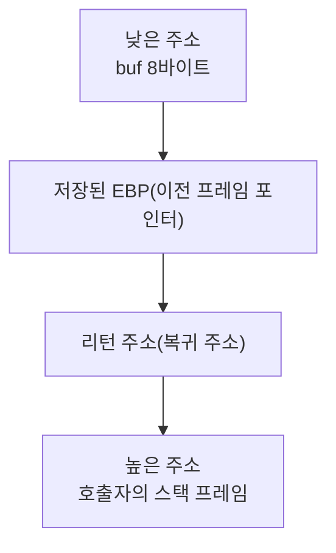
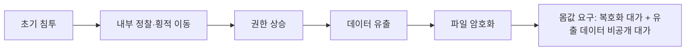

<Callout type="info">
  **이번 문서의 목표:** 버퍼 오버플로우가 스택 메모리를 어떻게 망가뜨리는지 구조로 이해하고, 수직·수평 권한 상승의 차이와 리눅스·윈도우에서의 실제 사례를 구분하며, 루트킷·백도어를 탐지하는 실무 명령어, 최신 랜섬웨어·공급망 공격의 실제 사례, 사고 발생 시 표준 대응 절차까지 설명할 수 있게 된다.
</Callout>

## 왜 공격 원리를 구조로 이해해야 하는가

정보보안기사 1과목 시스템보안의 공격기법 문항은 "이 공격의 이름은 무엇인가"만 묻지 않고, "왜 이 공격이 가능한가"를 구조로 물을 때가 많습니다. 예를 들어 버퍼 오버플로우 문제는 스택 메모리의 물리적 배치를 모르면 보기 네 개가 다 그럴듯해 보입니다. 이 편은 이름이 아니라 **메모리 구조·프로세스 권한 구조**를 먼저 그리고, 그 위에서 공격과 방어를 설명합니다.

## 버퍼 오버플로우

### 왜 가능한가: 경계검사 없는 메모리 복사

C언어처럼 메모리를 직접 다루는 언어에는 `strcpy`처럼 목적지 버퍼의 크기를 검사하지 않고 그대로 복사하는 함수가 있습니다. 다음 코드를 봅니다.

```c
#include <stdio.h>
#include <string.h>

void copy_input(char *input) {
    char buf[8];
    strcpy(buf, input);
    printf("입력값: %s\n", buf);
}

int main(int argc, char *argv[]) {
    copy_input(argv[1]);
    return 0;
}
```

`buf`는 8바이트짜리 공간인데, `strcpy`는 `input`의 길이가 얼마든 그대로 복사합니다. 만약 `argv[1]`이 8바이트보다 긴 문자열이라면, 넘치는 부분이 `buf` 바로 다음에 있는 메모리 영역을 덮어씁니다.

### 스택 메모리 구조

함수가 호출되면 지역 변수, 저장된 이전 프레임 포인터, 그리고 **함수가 끝난 뒤 돌아갈 주소**(리턴 주소)가 스택이라는 메모리 영역에 순서대로 쌓입니다.



**해석**: `buf`에 8바이트를 초과하는 데이터를 채워 넣으면, 그 다음에 있는 저장된 프레임 포인터를 지나 **리턴 주소**까지 덮어쓸 수 있습니다. 공격자가 이 리턴 주소를 자신이 심어 둔 악성 코드의 주소로 정확히 바꿔치기하면, 함수가 끝나는 순간 프로그램은 원래 돌아가야 할 곳이 아니라 공격자가 지정한 코드로 실행 흐름이 넘어갑니다.

<Callout type="warning">
  버퍼 오버플로우를 "버퍼가 넘쳐서 프로그램이 죽는 문제" 정도로만 이해하면 안 됩니다. 프로그램이 죽는 것은 이 취약점의 가장 약한 결과이고, 진짜 위험은 **리턴 주소 조작을 통해 임의 코드를 실행**시킬 수 있다는 점입니다.
</Callout>

### 방어 기법

| 방어 기법 | 원리 |
|-----------|------|
| 스택 카나리(Stack Canary) | 버퍼와 리턴 주소 사이에 무작위 값을 심어 두고, 함수 종료 직전 이 값이 그대로인지 검사한다. 값이 바뀌었다면 오버플로우가 있었다는 뜻이므로 즉시 프로그램을 중단시킨다 |
| ASLR(Address Space Layout Randomization, 주소 공간 배치 난수화) | 스택·힙·라이브러리의 메모리 주소를 실행할 때마다 무작위로 바꿔, 공격자가 심어 둔 코드의 정확한 주소를 예측하기 어렵게 만든다 |
| DEP/NX bit(Data Execution Prevention, 데이터 실행 방지) | 데이터 영역(스택 등)에는 실행 권한을 아예 주지 않아, 그 영역에 악성 코드를 심어도 실행 자체가 되지 않게 한다 |
| 컴파일러 보호 옵션 | 컴파일 시점에 스택 카나리 등을 자동으로 삽입하는 옵션(예: 지에스시시(GCC) 계열의 스택 프로텍터 옵션)을 기본 적용한다 |

<Callout type="warning">
  **자주 틀리는 점:** ASLR을 적용하면 버퍼 오버플로우가 완전히 막힌다고 오해하기 쉽습니다. 그러나 공격자가 별도의 정보 누출 취약점으로 실제 메모리 주소를 알아내거나, 이미 프로그램에 있는 코드 조각들을 연결해 새로운 동작을 만드는 리턴 지향 프로그래밍(Return-Oriented Programming, ROP) 기법을 쓰면 ASLR만으로는 우회될 수 있습니다. 방어 기법은 서로 겹겹이 쌓아야 하는 것이지, 하나로 완결되지 않습니다.
</Callout>

## 권한 상승 공격

### 수직적 권한 상승과 수평적 권한 상승

**권한 상승**(Privilege Escalation)은 원래 부여받은 것보다 높은 권한을 부당하게 획득하는 행위이며, 방향에 따라 둘로 나뉩니다.

- **수직적 권한 상승**(Vertical Privilege Escalation): 일반 사용자 권한에서 관리자(root, Administrator) 권한으로 올라가는 것. "더 높은 층"으로 올라가는 방향입니다.
- **수평적 권한 상승**(Horizontal Privilege Escalation): 같은 등급의 다른 사용자 계정 권한을 훔치는 것. 예를 들어 일반 사용자 A가 다른 일반 사용자 B의 세션이나 데이터에 접근하는 경우입니다. "같은 층의 옆방"으로 이동하는 방향입니다.

### 리눅스에서의 권한 상승 경로

07편에서 다룬 SetUID 루트 바이너리의 취약점이 대표적인 수직적 권한 상승 통로입니다. 실제 점검에서는 다음처럼 현재 계정이 sudo로 실행 가능한 명령을 먼저 확인합니다.

```
sudo -l
```

```
사용자 jkim은 다음 명령을 root로 실행할 수 있습니다:
    (root) NOPASSWD: /usr/bin/find
```

이 결과가 위험한 이유는, `find` 명령 자체가 옵션을 통해 임의의 명령을 실행시키는 기능(`-exec` 옵션)을 갖고 있기 때문입니다. 관리자가 "find 정도는 안전하다"고 여겨 무심코 sudo 권한을 준 명령이, 사실은 그 명령을 통해 root 셸을 얻는 우회로가 되는 경우가 실무에서 드물지 않습니다. 이처럼 sudo로 허용된 특정 명령을 이용해 더 높은 권한의 셸을 얻어내는 기법들을 정리해 둔 참고 목록(예: GTFOBins)을 점검 담당자가 함께 대조하는 것이 실무 절차입니다.

또한 커널 자체의 취약점을 이용한 권한 상승 사례도 있습니다. 대표적으로 리눅스 커널의 메모리 쓰기 방식에서 발견된 **Dirty COW**(CVE-2016-5195) 취약점은, 읽기 전용으로 매핑된 메모리 영역에도 경쟁 조건(Race Condition)을 이용해 쓰기를 성공시킬 수 있어, 일반 사용자가 root 권한 파일을 변조하는 데까지 이어질 수 있었습니다.

### 윈도우에서의 권한 상승 경로

윈도우에서는 **토큰 가장**(Token Impersonation)이 대표적입니다. 윈도우의 각 프로세스는 자신의 권한을 나타내는 접근 토큰을 갖는데, 특정 서비스 계정의 토큰을 탈취해 그 토큰으로 위장하면 해당 서비스 계정의 권한을 그대로 행사할 수 있습니다. 또한 **UAC**(User Account Control, 사용자 계정 컨트롤) 우회 기법은 관리자 권한 상승 확인창을 사용자 몰래 자동으로 통과시키거나, UAC 검사를 받지 않는 특정 실행 파일을 악용해 관리자 권한 프로세스를 몰래 띄우는 방식으로 동작합니다.

## 루트킷과 백도어

### 정의의 차이

**루트킷**(Rootkit)과 **백도어**(Backdoor)는 함께 언급되는 일이 많지만 개념이 다릅니다.

- **백도어**는 정상 인증 절차를 우회해 시스템에 접근할 수 있는 **통로 자체**입니다.
- **루트킷**은 자신과 자신이 만든 백도어, 프로세스, 파일, 네트워크 연결의 **존재를 시스템에서 숨기는 기술 모음**입니다.

> **쉽게 말하면:** 백도어가 몰래 만든 뒷문이라면, 루트킷은 그 뒷문과 자신이 드나든 흔적 전체를 안 보이게 지우는 기술입니다.

루트킷은 동작하는 위치에 따라 나뉩니다.

| 구분 | 동작 위치 | 은폐 대상 | 탐지 난이도 |
|------|-----------|-----------|--------------|
| 사용자 레벨 루트킷 | 응용 프로그램 계층 | `ls`, `ps`, `netstat` 같은 명령어 자체를 변조 | 상대적으로 낮음 |
| 커널 레벨 루트킷 | 운영체제 커널 내부 | 시스템 호출 결과 자체를 조작해 모든 도구를 속임 | 매우 높음 |

### 탐지 실무: chkrootkit·rkhunter

리눅스에서 루트킷 감염 여부를 점검하는 대표 도구는 `chkrootkit`과 `rkhunter`(Rootkit Hunter)입니다.

```
rkhunter --check
```

```
[ 경고 ] /usr/bin/ls 파일의 크기가 예상과 다릅니다.
[ 경고 ] 은닉된 프로세스가 발견되었습니다: PID 8842
```

### 은닉 프로세스를 직접 대조하는 원리

사용자 레벨 루트킷은 `ps`나 `netstat` 같은 명령어 자체를 변조해 특정 프로세스나 포트를 안 보이게 숨깁니다. 이때 유용한 점검 방식은, 명령어 출력 결과와 커널이 직접 관리하는 `/proc` 디렉터리 정보를 서로 대조하는 것입니다.

```
netstat -tulnp
```

이 결과에 나타나지 않는 포트가 있는데도 실제로는 그 포트가 열려 있다고 의심된다면, 프로세스 번호(PID)별로 `/proc` 디렉터리를 직접 열어 실행 파일 경로를 확인해 대조합니다.

```
ls -l /proc/8842/exe
```

정상 도구의 출력과 `/proc`의 원시 정보가 서로 다르게 나온다면, 그 차이 자체가 루트킷이 명령어 결과를 조작하고 있다는 강력한 정황 증거가 됩니다.

## 최신 랜섬웨어 사례와 흐름

### 국내 랜섬웨어 통계와 이중공갈

한국인터넷진흥원(KISA)의 사이버 위협 동향 집계에 따르면, 2024년 국내 랜섬웨어 감염 신고 건수는 총 195건으로 전년 대비 약 24퍼센트 감소했습니다. 다만 감염 건수가 줄었다고 해서 위협 자체가 약해진 것은 아니며, 최근 랜섬웨어 공격은 단순히 파일을 암호화하는 데서 그치지 않고 **이중공갈**(Double Extortion) 방식으로 진화했습니다.



**이중공갈**은 파일을 암호화하기 전에 먼저 데이터를 빼돌린 뒤, "복호화 키를 원하면 몸값을 내라"는 협박에 더해 "유출한 데이터를 공개하지 않으려면 추가로 몸값을 내라"는 협박까지 함께 거는 방식입니다. 백업으로 파일을 복구할 수 있는 조직이라도, 유출된 데이터가 공개될 위험 자체는 백업으로 해결되지 않으므로 이 방식은 피해자의 협상 여지를 크게 줄입니다.

### 국제 공조 대응 사례: LockBit과 오퍼레이션 크로노스

**LockBit**은 2023~2024년 기준 전 세계 랜섬웨어 피해 사례의 상당 부분을 차지한 것으로 집계될 만큼 활발했던 랜섬웨어 그룹입니다. 2024년 2월, 영국 국가범죄청(NCA)과 미국 연방수사국(FBI)을 중심으로 유로폴(Europol) 등 여러 국가 수사기관이 함께 참여한 **오퍼레이션 크로노스**(Operation Cronos)를 통해 LockBit의 서버 인프라 다수가 압수되고, 다수의 암호화폐 계좌가 동결되었습니다. 이 작전으로 확보한 복호화 키를 이용해 다수의 피해자가 몸값을 내지 않고도 파일을 복구할 수 있었습니다.

이 사례는 랜섬웨어 대응이 개별 조직의 기술적 방어만이 아니라 **국제 공조 수사**로도 이루어진다는 점, 그리고 하나의 그룹이 무너져도 다른 변종·후속 그룹이 그 자리를 채우는 흐름이 반복된다는 점을 함께 보여 줍니다.

## 공급망 공격 사례

### 왜 공급망이 노려지는가

**공급망 공격**(Supply Chain Attack)은 목표 조직을 직접 공격하는 대신, 그 조직이 신뢰하고 사용하는 **소프트웨어 공급업체나 업데이트 경로**를 먼저 장악해 한 번에 다수의 하위 고객사까지 감염시키는 방식입니다. 목표 하나하나를 직접 뚫는 것보다, 다수가 신뢰하는 공급 경로 하나를 장악하는 쪽이 공격자 입장에서 훨씬 효율적입니다.

### 대표 사례

- **솔라윈즈(SolarWinds) 사고(2020년)**: 네트워크 관리 소프트웨어인 오리온(Orion)의 정식 업데이트 서버 자체가 공격자에게 장악되어, 정상 서명이 붙은 업데이트 파일 안에 악성코드가 심긴 채로 배포되었습니다. 이 소프트웨어를 쓰던 다수의 정부기관·기업이 연쇄적으로 피해를 입었습니다.
- **무브잇(MOVEit Transfer) 사고(2023년)**: 파일 전송 소프트웨어인 무브잇 트랜스퍼에서 발견된 SQL 인젝션 제로데이 취약점(CVE-2023-34362)을 클롭(Cl0p) 랜섬웨어 그룹이 악용해, 이 소프트웨어를 사용하던 수많은 기업의 데이터베이스에서 대량의 데이터를 탈취했습니다. 미국 사이버보안 및 인프라보안청(CISA)이 FBI와 공동으로 이 취약점에 대한 경보를 발표할 만큼 파급력이 컸습니다.
- **오픈소스 패키지 공급망 오염**: NPM(Node Package Manager)처럼 널리 쓰이는 오픈소스 패키지 저장소에 악성코드를 심은 패키지를 등록해 두고, 이를 그대로 가져다 쓰는 개발 조직의 서버까지 연쇄적으로 감염시키는 사례도 반복적으로 보고되고 있습니다.

**해석**: 세 사례의 공통점은 피해 조직이 스스로 잘못된 코드를 작성한 것이 아니라, **신뢰하고 사용한 외부 소프트웨어·업데이트·패키지 자체가 이미 오염되어 있었다**는 것입니다. 이 때문에 방어의 초점도 "우리 코드만 안전한가"에서 "우리가 가져다 쓰는 모든 구성요소(공급망)가 안전한가"로 넓어지고 있습니다. 이 흐름에서 등장한 대응 개념이 **SBOM**(Software Bill of Materials, 소프트웨어 구성명세서)으로, 소프트웨어 안에 어떤 오픈소스 구성요소가 어떤 버전으로 포함되어 있는지 명세서로 관리해, 새로운 취약점이 공개되었을 때 우리 시스템에 그 구성요소가 포함되어 있는지 즉시 확인할 수 있게 합니다.

## 사고 대응 절차: 탐지·분석·격리·제거·복구

시스템이 이미 공격을 받은 뒤에는 정해진 절차대로 신속하게 움직여야 피해가 커지지 않습니다. 미국 국립표준기술연구소(NIST)의 사고 대응 지침(SP 800-61)에 기반한 흐름을 실무 관점으로 정리합니다.

<Steps>

1. **탐지(Detection)** — 로그·경보·이상 징후를 통해 사고 발생을 인지한다. 09편에서 다룰 SIEM 상관분석이 이 단계의 핵심 도구다.
2. **분석(Analysis)** — 침해 범위와 원인을 파악한다. 이 단계에서는 하드디스크를 끄기 전에 메모리(RAM)처럼 **휘발성이 높은 증거부터 먼저 수집**해야 한다. 전원을 차단하면 메모리에 남아 있던 악성코드 흔적·네트워크 연결 정보가 모두 사라지기 때문이다(20편 디지털 포렌식과 연결).
3. **격리(Containment)** — 피해 확산을 막는다. 물리적으로 네트워크 케이블을 뽑는 방법과, 논리적으로 VLAN·방화벽 정책을 바꿔 통신만 차단하는 방법이 있다. 물리적 격리는 확실하지만 서비스가 완전히 중단되고, 논리적 격리는 서비스 영향은 줄이지만 격리 정책 자체에 허점이 있으면 공격자가 빠져나갈 수 있다.
4. **제거(Eradication)** — 악성코드·백도어·루트킷을 완전히 제거한다. 단순 파일 삭제로 끝내지 않고, 침투 경로가 된 취약점 자체를 패치한다.
5. **복구(Recovery)** — 정상 상태로 서비스를 복원하고, 재발 여부를 모니터링하며 서서히 정상 운영으로 전환한다.
6. **사후관리(Lessons Learned)** — 사고 원인과 대응 과정을 문서화하고, 재발 방지를 위한 절차·정책 개선에 반영한다.

</Steps>

### 패치 관리와 N-day 공격

취약점이 공개적으로 알려진 뒤 실제 공격에 악용되기까지 걸리는 시간은 갈수록 짧아지고 있습니다. 공개된 지 얼마 안 된 취약점을 이용한 공격을 **N-day 공격**이라 부르는데(공개 전 취약점을 이용하는 제로데이 공격과 구분됩니다), 패치를 늦게 적용할수록 이 짧아진 시간 창 안에 공격당할 위험이 커집니다. 그래서 모든 패치를 동시에 적용할 여력이 없는 조직에서는 취약점의 심각도 점수(CVSS, Common Vulnerability Scoring System)와 실제 악용 여부를 기준으로 패치 우선순위를 정하는 것이 실무 원칙입니다.

## 자주 틀리는 점

- **버퍼 오버플로우를 프로그램 다운으로만 이해**: 진짜 위험은 리턴 주소 조작을 통한 임의 코드 실행이다.
- **ASLR만 있으면 버퍼 오버플로우가 완전히 막힌다고 오해**: 정보 누출 취약점이나 ROP 기법과 결합되면 우회될 수 있다.
- **수직적 권한 상승과 수평적 권한 상승을 혼동**: 수직은 더 높은 등급으로, 수평은 같은 등급의 다른 계정으로 이동하는 것이다.
- **루트킷과 백도어를 같은 것으로 오해**: 백도어는 접근 통로 자체, 루트킷은 그 통로와 흔적을 숨기는 기술이다.
- **이중공갈을 단순 암호화 협박과 같은 것으로 오해**: 이중공갈은 복호화 대가와 데이터 비공개 대가를 별도로 요구한다.
- **공급망 공격을 자사 코드 취약점 문제로만 이해**: 공급망 공격은 신뢰하는 외부 소프트웨어·업데이트 경로 자체가 오염되는 문제다.
- **사고 대응에서 전원을 즉시 차단하는 것이 최선이라고 오해**: 휘발성 증거(메모리)를 먼저 수집한 뒤 격리·전원 조치를 해야 한다.

## 핵심 정리

- 버퍼 오버플로우는 스택의 리턴 주소까지 덮어써 임의 코드 실행으로 이어질 수 있으며, 스택 카나리·ASLR·DEP/NX bit를 겹겹이 적용해 방어한다.
- 권한 상승은 수직적(등급 상승)과 수평적(동급 계정 탈취)으로 나뉘며, 리눅스는 SetUID·sudo 설정·커널 취약점을, 윈도우는 토큰 가장·UAC 우회를 통로로 이용한다.
- 루트킷은 백도어와 자신의 흔적을 숨기는 기술이며, 사용자 레벨 루트킷은 rkhunter 점검이나 /proc 정보와의 대조로 탐지할 수 있다.
- 최신 랜섬웨어는 이중공갈 방식으로 진화했고, LockBit 사례처럼 국제 공조 수사로 대응하기도 하지만 후속 그룹이 계속 등장한다.
- 공급망 공격(솔라윈즈, 무브잇)은 신뢰하는 외부 소프트웨어·업데이트 경로 자체가 오염되는 문제이며, SBOM으로 구성요소를 추적해 대응한다.
- 사고 대응은 탐지→분석→격리→제거→복구→사후관리 순으로 진행하며, 휘발성 증거를 먼저 수집하는 것이 원칙이다.

## 마무리 복습

<Quiz
  questionNumber={1}
  question="버퍼 오버플로우 공격이 위험한 근본적인 이유로 가장 적절한 것은?"
  options={['프로그램이 종료되어 서비스가 잠시 중단되기 때문이다', '리턴 주소를 조작해 공격자가 원하는 임의 코드를 실행시킬 수 있기 때문이다', '메모리 사용량이 늘어나 시스템이 느려지기 때문이다', '로그 파일 용량이 커지기 때문이다']}
  correctAnswer={2}
  explanation="버퍼 오버플로우의 근본적인 위험은 스택에 저장된 리턴 주소까지 덮어써서, 함수 종료 시 공격자가 지정한 코드로 실행 흐름을 넘길 수 있다는 점이다."
  optionExplanations={['프로그램 종료는 이 취약점의 가장 약한 결과에 불과하다.', '정답. 임의 코드 실행 가능성이 이 공격의 근본적 위험이다.', '메모리 사용량 증가는 이 공격의 핵심 위험이 아니다.', '로그 용량과는 직접적인 관련이 없다.']}
/>

<Quiz
  questionNumber={2}
  question="ASLR(주소 공간 배치 난수화)에 대한 설명으로 옳지 않은 것은?"
  options={['메모리 주소를 실행할 때마다 무작위로 바꾼다', '공격자가 심어 둔 코드의 정확한 주소를 예측하기 어렵게 만든다', '정보 누출 취약점이나 리턴 지향 프로그래밍과 결합되면 우회될 수 있다', 'ASLR을 적용하면 버퍼 오버플로우 공격이 원천적으로 불가능해진다']}
  correctAnswer={4}
  explanation="ASLR은 방어 기법 중 하나일 뿐 완전한 방어책이 아니며, 정보 누출 취약점이나 ROP 기법과 결합되면 우회될 수 있으므로 다른 방어 기법과 함께 적용해야 한다."
  optionExplanations={['ASLR의 기본 동작 방식에 대한 옳은 설명이다.', 'ASLR의 목적에 대한 옳은 설명이다.', 'ASLR의 한계에 대한 옳은 설명이다.', '정답. ASLR만으로는 완전한 방어가 되지 않는다.']}
/>

<Quiz
  questionNumber={3}
  question="수직적 권한 상승과 수평적 권한 상승의 차이를 가장 정확히 설명한 것은?"
  options={['수직적은 같은 등급의 다른 계정 탈취, 수평적은 더 높은 등급으로 이동', '수직적은 더 높은 등급으로 이동, 수평적은 같은 등급의 다른 계정 탈취', '두 용어는 같은 의미로 혼용된다', '수직적 권한 상승은 윈도우에서만, 수평적 권한 상승은 리눅스에서만 발생한다']}
  correctAnswer={2}
  explanation="수직적 권한 상승은 일반 사용자에서 관리자 권한으로 등급을 올리는 것이고, 수평적 권한 상승은 같은 등급의 다른 사용자 계정 권한을 탈취하는 것이다."
  optionExplanations={['방향 설명이 서로 바뀌었다.', '정답. 수직은 등급 상승, 수평은 동급 계정 탈취다.', '두 개념은 방향이 다른 별개의 개념이다.', '운영체제와 무관하게 두 유형 모두 리눅스·윈도우에서 발생할 수 있다.']}
/>

<Quiz
  questionNumber={4}
  question="루트킷(Rootkit)과 백도어(Backdoor)의 관계에 대한 설명으로 가장 적절한 것은?"
  options={['둘은 완전히 같은 개념이며 구분할 필요가 없다', '백도어는 접근 통로 자체이고, 루트킷은 그 통로와 흔적을 숨기는 기술이다', '루트킷은 접근 통로 자체이고, 백도어는 그것을 숨기는 기술이다', '백도어는 커널에서만, 루트킷은 응용 프로그램에서만 동작한다']}
  correctAnswer={2}
  explanation="백도어는 정상 인증을 우회하는 접근 통로 자체를 가리키고, 루트킷은 그 백도어와 관련 프로세스·파일·연결의 존재를 시스템에서 숨기는 기술 모음을 가리킨다."
  optionExplanations={['두 개념은 역할이 다른 별개의 개념이다.', '정답. 백도어는 통로, 루트킷은 은폐 기술이라는 역할 구분이 핵심이다.', '역할 설명이 서로 바뀌었다.', '루트킷은 사용자 레벨과 커널 레벨 모두에서 존재할 수 있다.']}
/>

<Quiz
  questionNumber={5}
  question="최신 랜섬웨어의 이중공갈(Double Extortion) 방식에 대한 설명으로 옳은 것은?"
  options={['파일을 암호화만 하고 데이터를 빼돌리지는 않는다', '데이터를 미리 유출한 뒤 복호화 대가와 데이터 비공개 대가를 별도로 요구한다', '백업만 잘 되어 있으면 이중공갈의 피해를 완전히 예방할 수 있다', '이중공갈은 반드시 두 개의 서로 다른 랜섬웨어 그룹이 함께 공격하는 것을 의미한다']}
  correctAnswer={2}
  explanation="이중공갈은 파일을 암호화하기 전에 먼저 데이터를 유출해 두고, 복호화 대가와 유출 데이터를 공개하지 않는 대가를 각각 요구하는 방식이다."
  optionExplanations={['이중공갈은 암호화 이전에 데이터 유출이 선행되는 것이 특징이다.', '정답. 복호화 대가와 비공개 대가를 이중으로 요구하는 것이 핵심이다.', '백업으로는 암호화 피해는 복구되지만 데이터 유출·공개 위험은 해결되지 않는다.', '이중공갈은 협박의 이중 구조를 뜻하며 공격 주체의 수와는 무관하다.']}
/>

<Quiz
  questionNumber={6}
  question="공급망 공격(Supply Chain Attack)의 특징으로 가장 적절한 것은?"
  options={['목표 조직의 자체 코드에 있는 논리적 결함만을 노린다', '목표 조직이 신뢰하는 소프트웨어 공급업체나 업데이트 경로를 장악해 다수의 하위 고객사까지 감염시킨다', '항상 목표 조직의 물리적 서버실에 직접 침입해야만 가능하다', '오픈소스 소프트웨어에는 적용될 수 없는 공격 방식이다']}
  correctAnswer={2}
  explanation="공급망 공격은 목표를 직접 공격하는 대신 그 목표가 신뢰하는 소프트웨어 공급 경로 자체를 장악해, 정상 업데이트로 위장된 악성코드로 다수의 하위 고객사를 한 번에 감염시키는 방식이다."
  optionExplanations={['공급망 공격은 자체 코드가 아니라 외부 공급 경로의 오염이 핵심이다.', '정답. 신뢰하는 공급 경로 장악을 통한 다수 하위 고객사 동시 감염이 핵심 특징이다.', '물리적 침입 없이 네트워크를 통한 업데이트 서버 장악만으로도 가능하다.', '오픈소스 패키지 저장소 오염 역시 대표적인 공급망 공격 유형이다.']}
/>

<Quiz
  questionNumber={7}
  question="사고 대응 절차에서 시스템 전원을 차단하기 전에 반드시 먼저 수행해야 하는 조치로 가장 적절한 것은?"
  options={['모든 로그 파일을 즉시 삭제한다', '메모리처럼 휘발성이 높은 증거부터 먼저 수집한다', '피해 시스템을 즉시 인터넷에 공개해 상황을 알린다', '패치 적용 없이 곧바로 서비스를 재개한다']}
  correctAnswer={2}
  explanation="전원을 차단하면 메모리에 남아 있던 악성코드 흔적이나 네트워크 연결 정보가 모두 사라지므로, 격리·전원 차단 이전에 휘발성이 높은 증거부터 수집하는 것이 사고 대응의 원칙이다."
  optionExplanations={['로그는 사고 원인 분석에 필요한 핵심 증거이므로 삭제해서는 안 된다.', '정답. 휘발성 증거 우선 수집이 사고 대응의 기본 원칙이다.', '피해 시스템을 즉시 공개하는 것은 오히려 추가 피해나 정보 왜곡으로 이어질 수 있다.', '취약점 패치 없이 서비스를 재개하면 동일한 공격이 반복될 수 있다.']}
/>

## 참고 자료

- [KISA 보호나라&KrCERT/CC - 사이버 위협 동향 보고서](https://www.krcert.or.kr/)
- [The NCA announces the disruption of LockBit with Operation Cronos - National Crime Agency](https://www.nationalcrimeagency.gov.uk/the-nca-announces-the-disruption-of-lockbit-with-operation-cronos)
- [StopRansomware: CL0P Ransomware Gang Exploits CVE-2023-34362 MOVEit Vulnerability - CISA](https://www.cisa.gov/news-events/cybersecurity-advisories/aa23-158a)
- [한국방송통신전파진흥원(cq.or.kr) - 정보보안기사 자격정보](https://www.cq.or.kr/qh_quagm01_020.do)
