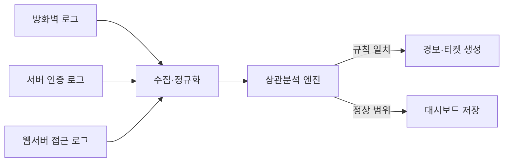

<Callout type="info">
  **이번 문서의 목표:** 리눅스와 윈도우의 로그 체계를 실제 명령어로 조회·설정하고, SIEM의 이벤트 상관분석 원리를 이해하며, 전체·증분·차등 백업의 복구 소요를 손으로 계산하고, 서버 하드닝 체크리스트를 근거를 들어 적용할 수 있게 된다.
</Callout>

## 왜 로그와 백업이 시험의 한 축인가

06편에서 계정·인증, 07편에서 파일시스템 접근통제, 08편에서 시스템 공격기법과 대응 절차(패치·격리·탐지)를 다뤘습니다. 그런데 "탐지"는 결국 **무슨 일이 언제 일어났는지 기록이 남아 있어야** 가능합니다. 기록이 없으면 침해사고가 나도 원인도, 침입 경로도, 얼마나 퍼졌는지도 알 수 없습니다.

또한 아무리 하드닝을 잘해도 랜섬웨어처럼 데이터 자체를 암호화해 인질로 잡는 공격 앞에서는 **되돌릴 수 있는 사본**이 있어야 서비스를 살릴 수 있습니다. 그래서 정보보안기사 시스템보안 과목은 로그·백업·운영 최적화를 "서버 보안의 마지막 방어선"으로 다룹니다.

> **쉽게 말하면:** 로그는 **블랙박스**, 백업은 **보험**입니다. 사고가 난 다음에야 그 가치를 알게 됩니다.

## 1. 리눅스 로깅 체계 — syslog와 journald

### syslog: 오래된, 그러나 여전히 표준인 체계

**시스로그**(syslog)는 유닉스 계열 시스템의 전통적인 로그 전송 프로토콜이자 그 구현체(rsyslog, syslog-ng 등)를 함께 부르는 이름입니다. 모든 로그 메시지는 두 가지 기준으로 분류됩니다.

- **퍼실리티**(facility): 메시지를 만든 주체. `kern`(커널), `auth`(인증), `authpriv`(민감한 인증), `daemon`(데몬), `mail`, `cron`, `local0`~`local7`(사용자 정의) 등
- **심각도**(severity): 메시지의 위급 정도. 숫자가 작을수록 심각합니다. `0 emerg`(시스템 사용 불가) → `1 alert` → `2 crit` → `3 err` → `4 warning` → `5 notice` → `6 info` → `7 debug`

이 두 값을 조합해 "어떤 메시지를 어느 파일로 보낼지" 규칙을 정의하는 곳이 `/etc/rsyslog.conf`(또는 `/etc/rsyslog.d/*.conf`)입니다.

```bash
# /etc/rsyslog.d/50-default.conf 발췌
auth,authpriv.*                /var/log/auth.log
*.*;auth,authpriv.none         -/var/log/syslog
kern.*                         -/var/log/kern.log
mail.*                         -/var/log/mail.log
```

**읽는 법:** 첫 줄은 "퍼실리티가 `auth` 또는 `authpriv`이고 심각도가 전부(`*`)인 메시지는 `/var/log/auth.log`로 보낸다"는 뜻입니다. 세미콜론(`;`)은 조건을 이어 붙이고, `none`은 해당 퍼실리티는 제외한다는 의미입니다. 로그인 시도, `sudo` 사용, SSH 접속 같은 인증 관련 사건은 전부 `auth.log`에 쌓이므로, 침해사고가 의심되면 이 파일을 가장 먼저 봅니다.

```bash
# 최근 SSH 인증 실패만 뽑아보기
grep "Failed password" /var/log/auth.log | tail -20
```

### journald: systemd 시대의 바이너리 로그

최신 배포판(우분투 18.04 이상, RHEL 7 이상 등)은 systemd의 **저널드**(journald)가 로그를 이진(binary) 형식으로 저장합니다. 텍스트 파일이 아니므로 `cat`으로 열리지 않고, 전용 명령인 `journalctl`로 조회합니다.

```bash
# sshd 서비스의 최근 1시간 로그
journalctl -u sshd.service --since "1 hour ago"

# 부팅 이후 오류(error) 이상만
journalctl -p err -b

# 실시간 추적 (tail -f와 같은 역할)
journalctl -f

# 특정 기간 지정
journalctl --since "2026-09-19 09:00" --until "2026-09-19 18:00"
```

기본 설정에서는 저널이 `/run/log/journal`(휘발성, 재부팅 시 소실)에 저장됩니다. 재부팅 후에도 로그를 남기려면 `/etc/systemd/journald.conf`에서 `Storage=persistent`로 바꾸고 `/var/log/journal` 디렉터리를 만들어 줘야 합니다. **시험 함정:** journald를 쓰는 시스템이라도 rsyslog를 함께 설치해 두면 journald가 rsyslog로 로그를 전달(forward)해, 기존 텍스트 로그 분석 도구와 호환성을 유지할 수 있습니다. 두 체계는 대체 관계가 아니라 **공존 관계**로 출제됩니다.

## 2. 윈도우 이벤트 로그

윈도우는 리눅스의 여러 로그 파일 대신 **이벤트 로그**(Event Log)라는 단일 하부구조에 사건을 기록합니다. 기본 3대 로그는 다음과 같습니다.

| 로그 종류 | 기록 내용 |
|-----------|-----------|
| 응용 프로그램(Application) | 설치된 프로그램이 남기는 오류·경고·정보 |
| 보안(Security) | 로그온·로그오프, 권한 사용, 계정 관리 등 감사 이벤트 |
| 시스템(System) | 드라이버, 서비스 시작·중지 등 운영체제 구성요소 이벤트 |

**보안 로그**가 정보보안기사에서 가장 중요합니다. 단, 보안 로그는 기본값으로는 **아무것도 기록하지 않는** 항목이 많습니다. `로컬 보안 정책`(secpol.msc) → `로컬 정책` → `감사 정책`에서 무엇을 감사할지 켜야 로그가 쌓입니다.

```powershell
# 현재 감사 정책 확인
auditpol /get /category:*

# 로그온 이벤트 감사를 성공·실패 모두 기록하도록 설정
auditpol /set /subcategory:"로그온" /success:enable /failure:enable
```

자주 나오는 **이벤트 ID**(Event ID)는 다음과 같습니다.

| Event ID | 의미 |
|----------|------|
| 4624 | 계정 로그온 성공 |
| 4625 | 계정 로그온 실패 |
| 4634 | 계정 로그오프 |
| 4720 | 사용자 계정 생성 |
| 4732 | 로컬 그룹에 구성원 추가 |
| 4688 | 새 프로세스 생성 |
| 1102 | 보안 로그 삭제(감사 로그 지우기 시도, 공격자가 흔적을 지울 때 발생) |

```powershell
# 최근 보안 로그 5건을 텍스트로 조회
wevtutil qe Security /c:5 /rd:true /f:text

# PowerShell로 로그온 실패(4625)만 필터링
Get-WinEvent -FilterHashtable @{LogName='Security'; Id=4625} -MaxEvents 10
```

**해석 예시:** 특정 계정에서 짧은 시간에 4625(로그온 실패)가 수십 건 쌓이고 곧이어 4624(로그온 성공)가 발생했다면, 전형적인 **무차별 대입 공격**(brute-force attack)의 성공 패턴입니다. 그리고 그 직후 1102(로그 삭제)가 보이면 공격자가 흔적 인멸을 시도한 정황입니다.

## 3. 로그분석과 이벤트 상관분석 — SIEM 개념

서버 한 대의 로그만 봐서는 큰 그림이 보이지 않습니다. 방화벽 로그에는 특정 IP의 반복 접속이, 웹서버 로그에는 이상한 URL 요청이, 인증 로그에는 실패한 로그인이 **따로따로** 찍힙니다. 사람이 이 세 로그를 동시에 눈으로 대조하는 것은 현실적으로 불가능합니다.

**SIEM**(Security Information and Event Management, 보안 정보 및 이벤트 관리)은 여러 장비·서버·애플리케이션의 로그를 한곳에 모아 **정규화**(같은 의미의 필드를 통일된 형식으로 맞춤)하고, 규칙 또는 통계 기반으로 사건들을 자동으로 엮어내는 시스템입니다. 이렇게 서로 다른 로그를 시간·계정·IP 같은 공통 축으로 엮어 의미 있는 패턴을 찾아내는 과정을 **이벤트 상관분석**(event correlation)이라고 부릅니다.



**상관분석 규칙의 예:** "동일한 출발지 IP에서 5분 이내 서로 다른 계정으로 로그인 실패가 20회 이상 발생하면 경보"라는 규칙은 방화벽 로그의 IP와 인증 로그의 로그인 실패 이벤트를 **시간창**(time window) 안에서 엮어야 판단할 수 있습니다. 이런 판단은 로그 한 종류만으로는 불가능하고, 여러 소스를 상관분석해야 드러납니다.

대표적인 오픈소스 구성이 **ELK 스택**(Elasticsearch·Logstash·Kibana, 최근에는 수집기로 Filebeat를 함께 씀)과 **Wazuh**(호스트 기반 로그·무결성 통합 관리)이며, 상용 제품으로는 Splunk가 널리 쓰입니다. 시험에서는 특정 제품명보다 "SIEM은 수집–정규화–상관분석–경보의 흐름을 가진다"는 구조 자체가 출제 포인트입니다.

## 4. 백업 전략 — 전체·증분·차등

### 세 방식의 정의

| 방식 | 매번 백업하는 대상 | 백업 소요 | 복구 소요 |
|------|---------------------|-----------|-----------|
| 전체(full) 백업 | 전체 데이터 | 가장 오래 걸림 | 가장 빠름(파일 1개만 복원) |
| 증분(incremental) 백업 | 직전 백업(전체 또는 증분) 이후 **변경분만** | 가장 짧음 | 가장 느림(순서대로 여러 개 복원) |
| 차등(differential) 백업 | 마지막 **전체** 백업 이후 누적된 변경분 | 갈수록 길어짐 | 중간(전체 1개 + 차등 1개) |

### 손으로 계산해 봅시다

월요일에 전체 백업을 하고, 화·수·목·금요일은 매일 데이터가 조금씩 바뀐다고 합시다. 목요일 밤에 장애가 나서 **수요일 시점**으로 복구해야 한다면 각 방식은 몇 개의 백업 파일이 필요할까요.

- **증분 방식**: 월(전체) → 화(증분) → 수(증분). 복구하려면 **월·화·수 3개**를 순서대로 이어 붙여야 합니다. 화요일 증분 파일이 하나라도 손상되면 수요일 복구가 통째로 실패합니다.
- **차등 방식**: 월(전체) → 화(차등, 월요일 이후 누적) → 수(차등, 월요일 이후 누적). 수요일 차등 파일 하나는 이미 화·수 변경분을 다 포함하고 있으므로, 복구하려면 **월·수 2개**만 있으면 됩니다.

**해석:** 증분은 백업 시간과 저장공간이 가장 적게 들지만 복구 사슬이 길어 **어느 한 조각이라도 손상되면 전체가 무너지는** 위험이 있습니다. 차등은 날짜가 지날수록 백업 용량이 커지지만 복구는 최대 2개 파일로 끝나 **더 안정적**입니다. 시험에서는 "복구 시 필요한 백업 개수"를 직접 세어보게 하는 문제가 나오므로, 이 손계산 과정 자체를 기억해야 합니다.

### RPO·RTO와 3-2-1 규칙

- **RPO**(Recovery Point Objective, 복구시점목표): 장애 발생 시 "어느 시점까지의 데이터 손실을 감수할 수 있는가". 백업 주기가 RPO를 결정합니다. 하루 한 번 백업하면 RPO는 최대 24시간입니다.
- **RTO**(Recovery Time Objective, 복구시간목표): 장애 발생 후 "서비스를 다시 정상화하기까지 허용되는 시간".
- **3-2-1 백업 규칙**: 데이터 사본을 **3벌** 유지하고, 그중 **2종류의 서로 다른 저장매체**(예: 디스크와 테이프)에 나눠 두며, **1벌은 물리적으로 떨어진 곳**(오프사이트, 또는 클라우드)에 보관합니다. 화재나 랜섬웨어가 원본과 백업을 동시에 덮치는 상황을 막기 위한 원칙입니다.

### 복구 절차

<Steps>

1. **사고 인지 및 격리** — 감염·장애 시스템을 네트워크에서 분리해 피해 확산을 막습니다(08편 대응 절차와 동일한 원칙)
2. **백업 무결성 확인** — 복구에 쓸 백업 파일 자체가 손상되거나 감염되지 않았는지 해시값 대조 등으로 검증합니다
3. **복구 환경 준비** — 격리된(원본 네트워크와 분리된) 환경에 복구 대상 시스템을 준비합니다
4. **데이터 복원** — 전체 백업부터 증분/차등 순서대로 적용합니다
5. **검증** — 서비스가 정상 동작하는지, 악성코드 잔존 흔적이 없는지 확인합니다
6. **재가동 및 모니터링** — 운영 환경에 재투입하고 이후 로그를 집중 모니터링합니다

</Steps>

## 5. 시스템 하드닝·최적화 체크리스트

**하드닝**(hardening)은 시스템의 공격 표면(attack surface, 공격자가 이용할 수 있는 접점의 총합)을 줄이는 작업입니다. 대표적인 점검 항목은 다음과 같습니다.

| 점검 항목 | 이유 |
|-----------|------|
| 불필요한 서비스·포트 비활성화 | 쓰지 않는 서비스는 취약점이 발견돼도 방치되기 쉬움 |
| 최신 보안 패치 적용 | 알려진 취약점(known vulnerability)을 원천 차단 |
| 기본 계정·기본 비밀번호 변경 | 제조사 기본값은 공격자에게 이미 알려져 있음 |
| 배너·버전 정보 노출 최소화 | 서비스 배너로 정확한 버전을 알면 그 버전의 알려진 취약점을 바로 공격 가능 |
| 방화벽 규칙 최소권한화 | 화이트리스트 방식으로 필요한 트래픽만 허용 |
| 계정 잠금 정책·비밀번호 정책 | 무차별 대입 공격 완화 |
| CIS 벤치마크 등 표준 점검 항목 적용 | 업계 표준 하드닝 가이드를 기준으로 일관성 있게 점검 |

**최적화**는 하드닝과 목적이 다릅니다. 하드닝이 "공격 표면을 줄이는" 보안 활동이라면, 최적화는 불필요한 프로세스·서비스를 정리해 **자원 사용을 효율화**하는 운영 활동입니다. 다만 실무에서는 불필요한 서비스를 끄는 행위가 두 목적을 동시에 만족시키는 경우가 많아, 시험에서도 하드닝 체크리스트 안에 최적화 항목이 섞여 출제됩니다.

## 핵심 정리

- 리눅스는 **syslog**(퍼실리티·심각도 기반, `/var/log/*.log`)와 **journald**(`journalctl` 조회)가 공존하며, journald가 rsyslog로 로그를 전달하는 구조가 흔하다.
- 윈도우 보안 로그는 기본적으로 비활성 항목이 많아 **감사 정책**을 켜야 하며, 4624(성공)·4625(실패)·1102(로그 삭제) 같은 이벤트 ID 조합으로 공격 패턴을 판단한다.
- **SIEM**은 여러 로그를 수집·정규화한 뒤 시간창 안에서 **상관분석**해 하나의 로그만으로는 안 보이는 공격 패턴을 찾아낸다.
- **전체 백업**은 복구가 빠르지만 백업이 오래 걸리고, **증분 백업**은 백업이 빠르지만 복구 사슬이 길어 위험하며, **차등 백업**은 그 중간으로 복구에 최대 2개 파일만 필요하다.
- **RPO**는 감수 가능한 데이터 손실 시점, **RTO**는 서비스 정상화까지 허용 시간이며, **3-2-1 규칙**은 3벌·2매체·1오프사이트로 요약된다.
- 하드닝은 공격 표면을 줄이는 활동, 최적화는 자원 효율화 활동으로 목적이 다르지만 실무에서는 함께 이뤄진다.

## 마무리 복습

<Quiz
  questionNumber={1}
  question="월요일에 전체 백업을 하고 화, 수, 목요일에 매일 증분 백업을 했다. 목요일 밤 장애로 목요일 시점까지 복구하려면 필요한 백업 파일 개수는?"
  options={['1개', '2개', '4개', '5개']}
  correctAnswer={3}
  explanation="증분 백업은 직전 백업 이후 변경분만 담으므로 복구하려면 월요일 전체 백업부터 화, 수, 목요일 증분을 순서대로 모두 적용해야 한다. 따라서 4개가 필요하다."
  optionExplanations={['전체 백업 1개만으로는 화 이후 변경분이 반영되지 않는다.', '차등 백업이라면 전체와 목요일 차등 2개로 충분하지만 이 문제는 증분 방식이다.', '월 전체와 화, 수, 목 증분을 모두 이어 붙여야 하므로 4개가 맞다.', '월요일 하루를 두 번 세는 등 중복이 포함된 개수다.']}
/>

<Quiz
  questionNumber={2}
  question="윈도우 보안 이벤트 로그에서 짧은 시간에 특정 계정의 Event ID 4625가 다수 발생한 직후 4624가 발생했다면 가장 의심할 수 있는 정황은?"
  options={['정상적인 비밀번호 변경 절차', '무차별 대입 공격의 성공 패턴', '디스크 용량 부족 경고', '방화벽 규칙 변경 완료']}
  correctAnswer={2}
  explanation="4625는 로그온 실패, 4624는 로그온 성공을 뜻한다. 실패가 반복되다 곧바로 성공으로 이어지는 패턴은 여러 비밀번호를 시도하다 맞춘 무차별 대입 공격의 전형적인 흔적이다."
  optionExplanations={['비밀번호 변경은 별도의 계정 관리 이벤트로 기록되며 이 패턴과 다르다.', '실패 반복 후 성공은 대입 공격의 대표적 징후다.', '디스크 용량은 시스템 로그의 별도 이벤트로 기록된다.', '방화벽 규칙 변경은 보안 로그의 다른 이벤트 ID로 남는다.']}
/>

<Quiz
  questionNumber={3}
  question="SIEM의 이벤트 상관분석에 대한 설명으로 가장 적절한 것은?"
  options={['한 서버의 로그 파일 하나만 정밀하게 저장하는 기능이다', '여러 소스의 로그를 정규화한 뒤 시간창 등 공통 기준으로 엮어 패턴을 찾는 기능이다', '로그를 암호화해 저장 공간을 절약하는 기능이다', '백업 데이터를 자동으로 압축하는 기능이다']}
  correctAnswer={2}
  explanation="상관분석은 방화벽, 인증 서버, 웹서버 등 서로 다른 소스의 로그를 정규화한 뒤 시간, 계정, IP 같은 공통 축으로 엮어 하나의 로그만으로는 보이지 않는 공격 패턴을 찾아내는 SIEM의 핵심 기능이다."
  optionExplanations={['단일 로그 저장은 상관분석의 정의가 아니다.', '여러 소스를 공통 기준으로 엮어 패턴을 찾는 것이 정확한 정의다.', '암호화 저장은 상관분석과 관련 없는 별도 기능이다.', '백업 압축은 SIEM의 핵심 기능이 아니다.']}
/>

<Quiz
  questionNumber={4}
  question="리눅스 로깅 체계에 대한 설명으로 옳지 않은 것은?"
  options={['syslog는 퍼실리티와 심각도 조합으로 메시지를 분류한다', 'journald는 로그를 이진 형식으로 저장하며 journalctl로 조회한다', 'journald를 쓰는 시스템에서는 rsyslog를 절대 함께 설치할 수 없다', '인증 관련 로그는 대개 authpriv 퍼실리티로 별도 파일에 기록된다']}
  correctAnswer={3}
  explanation="journald와 rsyslog는 대체 관계가 아니라 공존 관계다. journald가 수집한 로그를 rsyslog로 전달해 기존 텍스트 로그 분석 도구와 호환성을 유지하는 구성이 흔하다."
  optionExplanations={['퍼실리티와 심각도 조합 분류는 syslog의 정확한 특징이다.', 'journald의 이진 저장과 journalctl 조회는 정확한 설명이다.', '두 체계는 함께 쓰이는 경우가 많으므로 이 서술이 옳지 않다.', 'authpriv은 민감한 인증 정보를 다루는 퍼실리티로 실제로 이렇게 쓰인다.']}
/>

<Quiz
  questionNumber={5}
  question="RPO와 RTO에 대한 설명으로 가장 적절한 것은?"
  options={['RPO는 복구까지 걸리는 시간, RTO는 감수 가능한 데이터 손실 시점이다', 'RPO는 감수 가능한 데이터 손실 시점, RTO는 서비스 정상화까지 걸리는 시간이다', 'RPO와 RTO는 모두 백업 매체의 종류를 의미한다', 'RPO와 RTO는 3-2-1 규칙의 구성요소다']}
  correctAnswer={2}
  explanation="RPO(Recovery Point Objective)는 장애 시 감수할 수 있는 데이터 손실 시점, RTO(Recovery Time Objective)는 장애 후 서비스를 정상화하기까지 허용되는 시간이다."
  optionExplanations={['두 용어의 정의가 서로 뒤바뀌었다.', 'RPO는 데이터 손실 시점, RTO는 복구 시간으로 정확히 짝지어졌다.', '백업 매체 종류는 3-2-1 규칙의 2에 해당하는 별개 개념이다.', '3-2-1 규칙은 사본 수·매체 종류·오프사이트 여부로 구성되며 RPO, RTO와는 다른 개념이다.']}
/>

<Quiz
  questionNumber={6}
  question="3-2-1 백업 규칙에 대한 설명으로 옳지 않은 것은?"
  options={['데이터 사본을 총 3벌 유지한다', '서로 다른 2종류의 저장매체에 나눠 보관한다', '3벌 모두 같은 서버실에 두어 접근 속도를 높인다', '최소 1벌은 물리적으로 떨어진 곳에 보관한다']}
  correctAnswer={3}
  explanation="3-2-1 규칙의 핵심은 화재나 랜섬웨어처럼 한 장소나 한 네트워크를 동시에 덮치는 사고로부터 백업을 보호하는 것이므로, 최소 1벌은 원본과 물리적으로 떨어진 오프사이트에 두어야 한다."
  optionExplanations={['3벌 유지는 규칙의 정확한 내용이다.', '2종류의 매체 분산도 규칙에 포함된 정확한 내용이다.', '모두 같은 장소에 두면 동시 피해 위험을 막지 못해 규칙의 취지에 어긋난다.', '오프사이트 보관은 규칙의 1에 해당하는 정확한 내용이다.']}
/>

<Quiz
  questionNumber={7}
  question="서버 하드닝 체크리스트 항목으로 가장 거리가 먼 것은?"
  options={['사용하지 않는 서비스와 포트를 비활성화한다', '서비스 배너에 정확한 소프트웨어 버전을 노출해 사용자 편의를 높인다', '기본 계정과 기본 비밀번호를 변경한다', '방화벽 규칙을 화이트리스트 방식의 최소권한으로 구성한다']}
  correctAnswer={2}
  explanation="서비스 배너에 정확한 버전을 노출하면 공격자가 그 버전의 알려진 취약점을 바로 조회해 공격할 수 있으므로, 하드닝에서는 배너 정보 노출을 최소화하는 것이 원칙이다."
  optionExplanations={['불필요한 서비스 비활성화는 공격 표면을 줄이는 정확한 하드닝 항목이다.', '버전 노출은 공격자에게 정보를 제공하므로 하드닝 원칙에 어긋난다.', '기본 계정 변경은 대표적인 하드닝 항목이다.', '최소권한 방화벽 규칙도 정확한 하드닝 항목이다.']}
/>

## 참고 자료

- [한국방송통신전파진흥원(cq.or.kr) - 정보보안기사 자격정보](https://www.cq.or.kr/qh_quagm01_020.do)
- [itwiki - 정보보안기사 필기 출제기준](https://itwiki.kr/w/정보보안기사_필기_출제기준)
- [KISA 보호나라&KrCERT/CC - 사이버 위협 동향 보고서](https://www.krcert.or.kr/)
