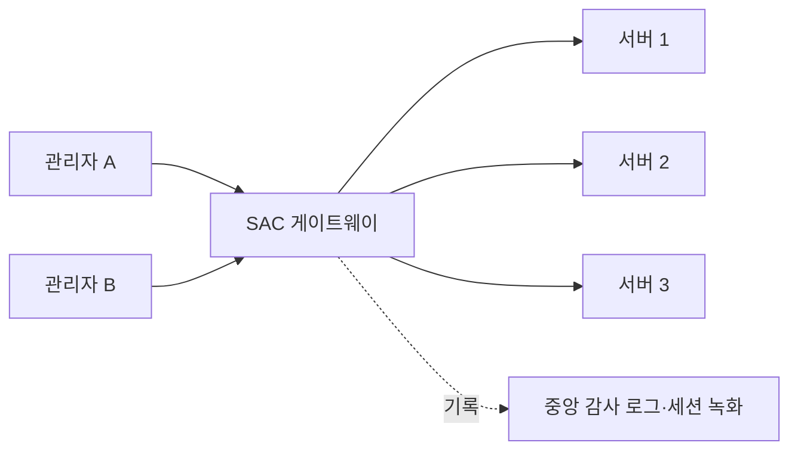

<Callout type="info">
  **이번 문서의 목표:** 서버 접근통제 시스템(SAC)이 왜 필요한지 설명하고, 취약점 점검 도구의 스캔 절차를 CVE·CVSS 개념과 함께 이해하며, 무결성 점검 도구를 실제로 설치·운영하고, 정기 점검 체크리스트를 스스로 구성할 수 있게 된다.
</Callout>

## 왜 별도의 보안 소프트웨어가 필요한가

09편에서 로그와 백업으로 "사고가 난 뒤" 대응하는 방법을 다뤘습니다. 하지만 이상적으로는 사고가 나기 **전에** 취약점을 찾아 막고, 사고가 나는 순간 즉시 알아채야 합니다. 운영체제 기본 기능만으로는 이 두 가지가 충분하지 않습니다.

- 리눅스의 `sudo`, 윈도우의 그룹 정책만으로는 **관리자 여러 명의 서버 접속 자체를 통합 통제**하기 어렵습니다
- `ps`, `netstat` 같은 기본 명령으로는 **수백 대 서버의 알려진 취약점을 체계적으로 스캔**할 수 없습니다
- 파일이 몰래 바뀌었는지는 사람이 매번 손으로 대조할 수 없습니다

그래서 이 세 가지 공백을 메우는 전용 소프트웨어 범주가 시험 출제기준의 "서버 보안 S/W 설치 및 운영" 항목입니다.

> **쉽게 말하면:** 운영체제가 기본으로 주는 자물쇠 말고, **누가 언제 어떻게 문을 열었는지 기록하고, 문에 뚫린 구멍을 미리 찾아주는 전용 장비**를 들이는 단계입니다.

## 1. 서버 접근통제 시스템 — SAC

**서버 접근통제 시스템**(SAC, Server Access Control)은 여러 서버에 대한 관리자 접속을 하나의 지점으로 모아 통제하는 솔루션입니다. 흔히 **PAM**(Privileged Access Management, 권한 있는 접근 관리)이라는 더 넓은 범주 안에 포함됩니다.

### 왜 필요한가

관리자 100명이 서버 50대에 각자 SSH로 직접 접속한다고 합시다. 각 서버의 `/etc/passwd`와 `sudoers`를 관리자가 바뀔 때마다 50번씩 손으로 고쳐야 하고, "누가 3주 전에 이 서버에서 무슨 명령을 쳤는지"를 알아내려면 50대의 `auth.log`를 일일이 뒤져야 합니다. SAC는 이 문제를 다음 구조로 해결합니다.



### 핵심 기능

| 기능 | 내용 |
|------|------|
| 계정 통합관리 | 개별 서버 계정 대신 SAC 하나에서 인증하고, SAC가 각 서버로 대리 접속 |
| 명령어 필터링 | `rm -rf /`처럼 위험한 명령을 실행 전에 차단하거나 승인 절차를 강제 |
| 세션 녹화 | 관리자가 서버에서 입력한 명령과 화면 출력을 그대로 기록해 사후 감사에 사용 |
| 권한 최소화·직무분리 | 관리자별로 접속 가능한 서버·명령 범위를 세밀하게 제한 |

**시험 포인트:** SAC는 접근통제를 "개별 서버 단위"에서 "중앙 집중 단위"로 옮기는 것이 핵심입니다. 22편에서 다룰 **최소권한 원칙**과 **직무분리**가 SAC를 통해 실제로 강제되는 대표적인 사례로 함께 출제됩니다.

## 2. 취약점 점검 도구 — OpenVAS·Nessus 계열

### CVE와 CVSS

취약점을 다루려면 먼저 취약점을 부르는 방법이 통일돼 있어야 합니다.

- **CVE**(Common Vulnerabilities and Exposures, 공통 취약점 및 노출): 전 세계에서 발견된 개별 취약점에 부여하는 고유 식별번호입니다. 예를 들어 `CVE-2021-44228`은 Log4Shell로 알려진 Log4j 취약점을 가리킵니다.
- **CVSS**(Common Vulnerability Scoring System, 공통 취약점 등급 시스템): 각 취약점의 심각도를 0.0부터 10.0까지 점수로 매기는 표준입니다. 공격 벡터(네트워크로 가능한지), 공격 복잡도, 필요 권한, 사용자 상호작용 여부 등을 조합해 계산합니다.

| CVSS 점수 구간 | 등급 |
|----------------|------|
| 0.1–3.9 | 낮음(Low) |
| 4.0–6.9 | 중간(Medium) |
| 7.0–8.9 | 높음(High) |
| 9.0–10.0 | 심각(Critical) |

### 스캔 절차

**OpenVAS**(오픈소스, 현재는 Greenbone Vulnerability Management의 일부)와 상용 제품 **Nessus**는 사용법이 크게 다르지 않습니다. 공통 절차는 다음과 같습니다.

<Steps>

1. **대상(target) 등록** — 점검할 서버의 IP 또는 IP 대역을 등록합니다
2. **스캔 정책 선택** — 전체 포트를 훑는 전체 스캔, 웹 취약점 위주의 스캔 등 목적에 맞는 정책을 고릅니다
3. **인증 정보(선택) 입력** — 서버 관리자 계정 정보를 넣으면 시스템 내부에 로그인해 패치 여부까지 점검하는 **인증 스캔**(credentialed scan)이 가능해집니다. 없으면 외부에서 포트·배너만 보는 **비인증 스캔**에 그칩니다
4. **스캔 실행** — 등록된 CVE 데이터베이스와 대조하며 서비스 버전, 설정값, 알려진 취약점을 점검합니다
5. **결과 리포트 확인** — CVSS 점수 순으로 정렬된 취약점 목록과 조치 방안(패치 버전, 설정 변경법)이 제공됩니다
6. **재점검** — 조치 후 동일 대상을 다시 스캔해 취약점이 해소됐는지 확인합니다

</Steps>

```bash
# CLI 기반 대안 예: nmap의 취약점 스크립트를 활용한 간이 점검
nmap -sV --script vuln 192.168.10.20
```

**인증 스캔과 비인증 스캔의 차이가 시험 포인트입니다.** 비인증 스캔은 외부 공격자의 시야와 비슷해 "밖에서 무엇이 보이는가"를 알려주지만, 패치 누락처럼 내부에 로그인해야만 알 수 있는 정보는 못 잡습니다. 인증 스캔은 실제 관리자 시야로 더 정확하지만, 계정 정보를 스캐너에 등록해야 하므로 그 자체가 관리 대상이 됩니다.

## 3. 무결성·로깅 도구 설치와 운영

### 파일 무결성 점검 도구 — AIDE 실습

07편에서 파일 무결성 점검 도구(Tripwire·AIDE)의 원리를 다뤘습니다. 여기서는 실제 설치·운영 절차를 봅니다. **AIDE**(Advanced Intrusion Detection Environment)는 지정한 경로의 파일 해시값·권한·소유자 등을 데이터베이스로 만들어 두고, 이후 실제 상태와 비교해 변경을 탐지합니다.

```bash
# 설치 (데비안 계열)
sudo apt install aide

# /etc/aide/aide.conf 에서 감시 대상 경로 지정 예시
# /etc/aide/aide.conf 발췌
/bin    NORMAL
/sbin   NORMAL
/etc    NORMAL

# 최초 기준 데이터베이스 생성
sudo aideinit

# 이후 정기 점검 (cron 등록해 매일 새벽 실행)
sudo aide --check
```

`aide --check`를 실행하면 기준 데이터베이스와 현재 상태를 비교해 추가(added)·삭제(removed)·변경(changed)된 파일 목록을 출력합니다. **핵심 함정:** 기준 데이터베이스 자체가 공격자에게 변조되면 무결성 점검이 무의미해지므로, 기준 데이터베이스는 반드시 **읽기 전용 매체나 외부 저장소**에 별도 보관해야 합니다.

### 호스트 기반 통합 로깅·탐지 도구

**OSSEC**과 그 후속 오픈소스인 **Wazuh**는 파일 무결성 점검, 로그 분석, 루트킷 탐지, 실시간 경보를 하나로 묶은 **HIDS**(Host-based Intrusion Detection System, 호스트 기반 침입탐지시스템)입니다. 09편의 SIEM이 여러 서버의 로그를 중앙에서 상관분석하는 도구라면, HIDS 에이전트는 **각 서버에 상주하며** 그 서버 자체의 파일 변경·프로세스·로그를 감시하고 결과를 중앙 서버로 올려보내는 역할을 합니다. 즉 HIDS는 SIEM의 데이터 소스 중 하나로 자주 함께 구성됩니다.

## 4. 정기 점검 체크리스트

취약점 점검과 무결성 점검은 한 번 하고 끝나는 일이 아니라 **주기적으로 반복**해야 의미가 있습니다. 실무에서 흔히 쓰는 점검 주기는 다음과 같습니다.

| 점검 항목 | 권장 주기 | 이유 |
|-----------|-----------|------|
| 취약점 스캔(OpenVAS·Nessus) | 월 1회 이상, 주요 시스템은 주 1회 | 새 CVE가 매일 등록되므로 주기적 재점검 필요 |
| 파일 무결성 점검(AIDE) | 일 1회(자동화) | 변조는 발견이 늦을수록 피해가 커짐 |
| 계정·권한 점검 | 분기 1회 | 퇴사자 계정, 불필요한 관리자 권한 잔존 방지 |
| 패치·업데이트 적용 | 월 1회 정기 + 긴급 패치는 즉시 | 알려진 취약점의 악용 시차를 최소화 |
| 로그 보관 주기 점검 | 연 1회 | 법령·내부 규정상 로그 보관 기간 준수 확인 |
| 보안 솔루션 정책 재검토 | 반기 1회 | 조직 구조·서비스 변화에 맞춰 규칙 최신화 |

**시험 함정:** "취약점 스캔을 한 번만 하면 충분하다"거나 "무결성 점검 도구를 설치하면 별도 점검 주기가 필요 없다"는 서술은 모두 오답입니다. 도구는 **자동화 수단**일 뿐, 점검 자체는 정책으로 주기를 못박아 반복해야 합니다.

## 핵심 정리

- **SAC**는 여러 서버에 대한 관리자 접속을 중앙 게이트웨이로 모아 계정 통합관리·명령어 필터링·세션 녹화를 제공해, 접근통제를 서버 단위에서 중앙 집중 단위로 옮긴다.
- **CVE**는 취약점의 고유 식별번호, **CVSS**는 0.0에서 10.0까지의 심각도 점수 체계다.
- 취약점 점검은 **대상 등록 → 정책 선택 → (인증 정보 입력) → 스캔 → 리포트 → 재점검** 순서로 진행되며, **인증 스캔**이 **비인증 스캔**보다 내부 패치 누락까지 정확히 잡아낸다.
- **AIDE** 같은 무결성 점검 도구는 최초 기준 데이터베이스를 만들고 이후 `--check`로 비교하며, 기준 데이터베이스 자체를 외부에 안전하게 보관해야 한다.
- **HIDS**(OSSEC·Wazuh)는 서버에 상주하며 파일·로그·프로세스를 감시하는 도구로, 중앙 SIEM의 데이터 소스로 자주 함께 구성된다.
- 취약점 스캔·무결성 점검·계정 점검은 모두 **주기적으로 반복**해야 하며, 도구 도입이 점검 주기의 필요성을 없애지 않는다.

## 마무리 복습

<Quiz
  questionNumber={1}
  question="서버 접근통제 시스템(SAC)에 대한 설명으로 가장 적절한 것은?"
  options={['각 서버의 로컬 계정 파일을 개별적으로 관리하는 방식이다', '여러 서버에 대한 관리자 접속을 중앙 게이트웨이로 모아 통합 통제하는 시스템이다', '방화벽 규칙만 중앙에서 배포하는 시스템이다', '취약점 스캔 결과만 저장하는 데이터베이스다']}
  correctAnswer={2}
  explanation="SAC는 관리자 접속을 중앙 게이트웨이로 모아 계정 통합관리, 명령어 필터링, 세션 녹화를 제공하는 시스템으로, 접근통제를 개별 서버 단위에서 중앙 집중 단위로 옮기는 것이 핵심이다."
  optionExplanations={['개별 서버 계정 관리는 SAC가 해결하려는 문제 상황이지 SAC 자체의 정의가 아니다.', '중앙 게이트웨이를 통한 통합 접근통제가 SAC의 정확한 정의다.', '방화벽 규칙 배포는 별도의 네트워크 관리 기능이다.', '취약점 스캔 결과 저장은 취약점 점검 도구의 역할이다.']}
/>

<Quiz
  questionNumber={2}
  question="CVE와 CVSS에 대한 설명으로 옳지 않은 것은?"
  options={['CVE는 개별 취약점에 부여하는 고유 식별번호다', 'CVSS는 취약점의 심각도를 0.0에서 10.0 사이 점수로 나타낸다', 'CVSS 점수가 9.0 이상이면 심각(Critical) 등급으로 분류된다', 'CVE 번호가 없는 취약점은 CVSS 점수를 매길 수 없다']}
  correctAnswer={4}
  explanation="CVE 번호 부여와 CVSS 점수 산정은 별개의 절차이며, 조직 내부에서 자체 발견한 취약점처럼 CVE 번호가 없더라도 공격 벡터, 복잡도 등을 기준으로 CVSS 점수를 독자적으로 산정할 수 있다."
  optionExplanations={['CVE의 정의를 정확히 설명했다.', 'CVSS 점수 범위 설명이 정확하다.', 'CVSS 등급 구간 설명이 정확하다.', 'CVE 번호와 무관하게 CVSS 점수 산정이 가능하므로 이 서술이 옳지 않다.']}
/>

<Quiz
  questionNumber={3}
  question="취약점 점검에서 인증 스캔과 비인증 스캔의 차이로 가장 적절한 것은?"
  options={['인증 스캔은 외부 공격자의 시야만 확인할 수 있다', '비인증 스캔은 시스템 내부의 패치 누락까지 정확히 확인할 수 있다', '인증 스캔은 관리자 계정 정보를 등록해 내부에 로그인함으로써 패치 누락까지 확인할 수 있다', '두 방식은 결과에 차이가 없어 아무 방식이나 선택해도 무방하다']}
  correctAnswer={3}
  explanation="인증 스캔은 관리자 계정 정보를 스캐너에 등록해 시스템 내부에 로그인한 뒤 점검하므로, 외부에서 포트와 배너만 보는 비인증 스캔으로는 알 수 없는 패치 누락까지 정확히 확인할 수 있다."
  optionExplanations={['외부 공격자 시야는 비인증 스캔에 해당한다.', '패치 누락 확인은 인증 스캔의 장점이다.', '인증 스캔의 정의와 장점을 정확히 설명했다.', '두 방식은 확인 가능한 범위가 다르므로 목적에 맞게 선택해야 한다.']}
/>

<Quiz
  questionNumber={4}
  question="AIDE 같은 파일 무결성 점검 도구를 안전하게 운영하기 위한 조치로 가장 적절한 것은?"
  options={['기준 데이터베이스를 점검 대상 서버의 일반 폴더에 함께 저장한다', '기준 데이터베이스를 외부 저장소나 읽기 전용 매체에 별도 보관한다', '점검 결과가 없을 때만 기준 데이터베이스를 갱신한다', '기준 데이터베이스 생성 후에는 다시 점검할 필요가 없다']}
  correctAnswer={2}
  explanation="기준 데이터베이스 자체가 공격자에게 변조되면 무결성 점검이 무의미해지므로, 기준 데이터베이스는 점검 대상 서버와 분리된 외부 저장소나 읽기 전용 매체에 안전하게 보관해야 한다."
  optionExplanations={['일반 폴더에 두면 공격자가 함께 변조할 수 있어 위험하다.', '외부 안전 보관이 정확한 조치다.', '갱신 조건에 대한 설명이 아니라 보관 위치가 핵심 문제다.', '무결성 점검은 지속적으로 반복해야 하는 활동이다.']}
/>

<Quiz
  questionNumber={5}
  question="HIDS(호스트 기반 침입탐지시스템)에 대한 설명으로 가장 적절한 것은?"
  options={['네트워크 트래픽만 감시하고 개별 서버 내부는 감시하지 않는다', '서버에 상주하며 파일 변경, 프로세스, 로그를 감시하고 결과를 중앙 서버로 전달한다', '취약점 스캔 결과를 CVSS 점수로 자동 변환하는 도구다', '백업 데이터를 압축·암호화하는 도구다']}
  correctAnswer={2}
  explanation="OSSEC, Wazuh 같은 HIDS는 각 서버에 에이전트 형태로 상주하며 파일 무결성, 프로세스, 로그를 감시하고 그 결과를 중앙 서버로 올려보내, SIEM의 데이터 소스로 함께 구성되는 경우가 많다."
  optionExplanations={['네트워크 트래픽 감시는 네트워크 기반 IDS(NIDS)의 역할이며 HIDS는 호스트 내부를 감시한다.', 'HIDS의 정확한 역할과 구조를 설명했다.', 'CVSS 점수 변환은 취약점 점검 도구의 기능이 아니다.', '백업 압축·암호화는 백업 소프트웨어의 기능이다.']}
/>

<Quiz
  questionNumber={6}
  question="서버 보안 소프트웨어의 정기 점검 체계에 대한 설명으로 옳지 않은 것은?"
  options={['새 CVE가 계속 등록되므로 취약점 스캔은 주기적으로 반복해야 한다', '무결성 점검 도구를 설치하면 이후에는 점검 주기를 따로 정하지 않아도 된다', '계정·권한 점검은 퇴사자 계정이나 불필요한 관리자 권한을 찾기 위해 주기적으로 수행한다', '긴급 보안 패치는 정기 주기를 기다리지 않고 즉시 적용하는 것이 원칙이다']}
  correctAnswer={2}
  explanation="무결성 점검 도구는 자동화된 점검 수단일 뿐이며, 점검 자체는 조직의 보안 정책으로 정한 주기에 따라 지속적으로 반복해야 새로운 변조를 놓치지 않는다."
  optionExplanations={['새 CVE 등록에 대응하려면 반복 점검이 필요하다는 정확한 설명이다.', '도구 설치가 주기적 점검의 필요성을 없애지 않으므로 이 서술이 옳지 않다.', '계정·권한 점검의 목적을 정확히 설명했다.', '긴급 패치의 즉시 적용 원칙을 정확히 설명했다.']}
/>

## 참고 자료

- [itwiki - 정보보안기사 필기 출제기준](https://itwiki.kr/w/정보보안기사_필기_출제기준)
- [공공데이터포털 - 한국방송통신전파진흥원_국가기술자격검정 정보보안 종목 출제기준](https://www.data.go.kr/data/15140079/fileData.do)
- [KISA 보호나라&KrCERT/CC - 사이버 위협 동향 보고서](https://www.krcert.or.kr/)
