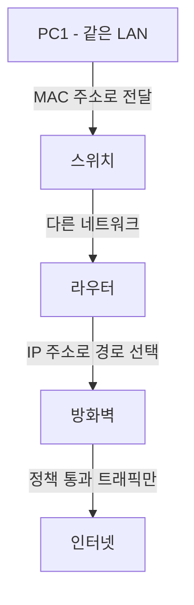
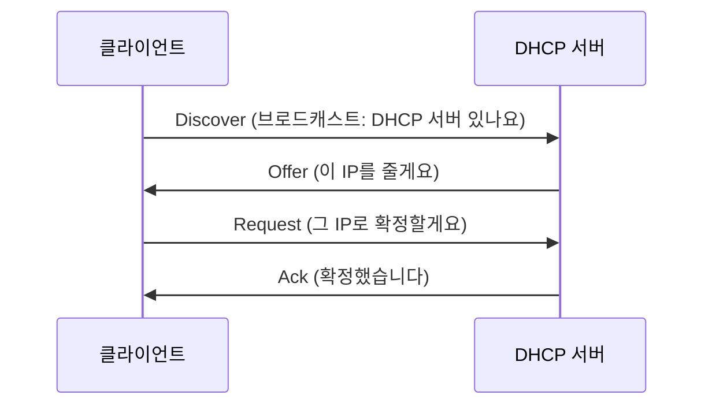

<Callout type="info">
  **이번 문서의 목표:** 스위치·라우터·방화벽이 OSI 계층 중 어디에서 어떤 기준으로 동작하는지 구분하고, NAT·DHCP·VLAN의 동작 절차를 설명하며, 네트워크 진단 명령어의 실제 출력을 읽어 문제 구간을 짚어낼 수 있게 된다.
</Callout>

## 왜 장비 원리부터 다시 짚는가

03편에서 OSI 7계층과 TCP/IP 4계층, IP 주소·서브넷팅, TCP 3-way handshake를 다뤘습니다. 이번 편은 그 지식을 바탕으로 **실제로 네트워크를 구성하는 장비**가 각 계층에서 무슨 기준으로 트래픽을 처리하는지를 봅니다. 12편의 스캐닝·스니핑·스푸핑, 13편의 DoS/DDoS, 15편의 방화벽·IDS/IPS는 모두 "장비가 어떤 기준으로 판단하는가"를 정확히 알아야 왜 공격이 통하고 왜 방어가 되는지 이해할 수 있습니다.

> **쉽게 말하면:** 스위치는 **같은 건물 안 우편함 번호**(MAC 주소)로, 라우터는 **도시 간 도로 표지판**(IP 주소)으로, 방화벽은 **검문소의 통행증 규칙**으로 트래픽을 처리한다고 생각하면 세 장비의 역할이 갈립니다.

## 1. 스위치·라우터·방화벽 — 계층별 동작 차이

| 장비 | 주로 동작하는 계층 | 판단 기준 | 핵심 역할 |
|------|---------------------|-----------|-----------|
| 스위치(switch) | 2계층(데이터링크) | 목적지 MAC 주소 | 같은 네트워크(같은 LAN) 안에서 프레임을 정확한 포트로만 전달 |
| 라우터(router) | 3계층(네트워크) | 목적지 IP 주소, 라우팅 테이블 | 서로 다른 네트워크(다른 대역) 사이를 연결하고 최적 경로 선택 |
| 방화벽(firewall) | 3–7계층(제품에 따라 다름) | IP·포트·프로토콜, 심하면 애플리케이션 내용까지 | 정책에 정의된 트래픽만 통과시키고 나머지는 차단 |

**스위치의 학습 동작:** 스위치는 각 포트로 들어오는 프레임의 출발지 MAC 주소를 **MAC 주소 테이블**(CAM 테이블)에 기록해, 어느 포트 뒤에 어느 MAC 주소가 있는지 학습합니다. 목적지 MAC이 테이블에 없으면 모든 포트로 뿌리는 **플러딩**(flooding)을 하고, 있으면 해당 포트로만 **정확히** 전달합니다. 이 학습 동작 자체가 12편에서 다룰 ARP 스푸핑·스니핑 공격의 배경 지식이 됩니다.

**라우터의 경로 선택:** 라우터는 패킷의 목적지 IP를 보고 **라우팅 테이블**을 조회해 다음 홉(next hop)을 결정합니다. 직접 연결된 네트워크가 아니면 정적 경로(관리자가 직접 등록)나 동적 라우팅 프로토콜(OSPF, BGP 등)로 학습한 경로를 씁니다.

**방화벽의 세대 구분:** 초기 방화벽은 IP·포트·프로토콜만 보는 **패킷 필터링**(stateless) 방식이었고, 이후 연결의 상태(요청–응답 짝)를 추적하는 **상태 기반**(stateful) 방식으로 발전했으며, 최근의 **차세대 방화벽**(NGFW)은 애플리케이션 내용까지 들여다봅니다. 자세한 방화벽 세대별 비교는 15편에서 다룹니다.



## 2. NAT — 주소 변환

**NAT**(Network Address Translation, 네트워크 주소 변환)는 사설 IP 주소를 공인 IP 주소로 바꿔 여러 내부 기기가 하나(또는 소수)의 공인 IP를 공유해 인터넷에 접속하게 하는 기술입니다. 03편에서 다룬 사설 대역(`10.0.0.0/8`, `172.16.0.0/12`, `192.168.0.0/16`)이 NAT의 전제입니다.

| 방식 | 동작 | 특징 |
|------|------|------|
| 정적 NAT(Static NAT) | 사설 IP 하나와 공인 IP 하나를 1대1로 고정 매핑 | 외부에서 특정 내부 서버로 접근 가능(서버 공개용) |
| 동적 NAT(Dynamic NAT) | 공인 IP 여러 개를 풀(pool)로 두고 필요할 때 하나씩 배정 | 공인 IP가 부족하면 연결 실패 가능 |
| PAT(Port Address Translation, NAPT) | 공인 IP 하나를 포트 번호로 구분해 다수 내부 기기가 동시 공유 | 가정용 공유기에서 가장 흔히 쓰는 방식 |

**PAT 동작 예시:** 내부의 `192.168.0.10:5000`과 `192.168.0.11:5001`이 동시에 외부로 나가면, 공유기는 이를 `공인IP:40001`, `공인IP:40002`처럼 서로 다른 포트로 바꿔 내보냅니다. 응답이 돌아오면 포트 번호를 보고 어느 내부 기기로 되돌려줄지 판단합니다. 이 매핑 정보를 담은 표를 **NAT 테이블**이라고 부릅니다.

## 3. DHCP — 주소 자동 할당

**DHCP**(Dynamic Host Configuration Protocol, 동적 호스트 구성 프로토콜)는 기기가 네트워크에 붙을 때마다 IP 주소·서브넷 마스크·기본 게이트웨이·DNS 서버 주소를 자동으로 나눠주는 프로토콜입니다. 손으로 매번 설정하지 않아도 되게 해줍니다.

동작 절차는 앞글자를 따 **DORA**라고 부릅니다.



**Discover(발견)**: 클라이언트가 네트워크 전체(브로드캐스트)에 DHCP 서버를 찾는 요청을 보냅니다.
**Offer(제안)**: DHCP 서버가 사용 가능한 IP 주소를 제안합니다.
**Request(요청)**: 클라이언트가 제안받은 IP를 쓰겠다고 요청합니다(여러 서버가 응답했을 수 있으므로 확정 의사표시).
**Ack(확인)**: 서버가 할당을 확정하고 임대 기간(lease time)을 알려줍니다.

**보안 관점의 함정:** 공격자가 가짜 DHCP 서버를 네트워크에 올려 클라이언트에게 조작된 기본 게이트웨이나 DNS 서버 주소를 나눠주면, 모든 트래픽이 공격자를 거치게 만들 수 있습니다(**DHCP 스푸핑**). 이를 막는 스위치 기능이 **DHCP 스누핑**(DHCP snooping)으로, 신뢰할 수 있는 포트에서 오는 DHCP 응답만 허용합니다.

## 4. VLAN — 논리적 네트워크 분리

**VLAN**(Virtual LAN, 가상 랜)은 물리적으로는 같은 스위치에 연결돼 있어도 **논리적으로 서로 다른 네트워크**로 분리하는 기술입니다. 예를 들어 한 스위치에 인사팀과 개발팀 PC가 함께 꽂혀 있어도, VLAN 10(인사팀)과 VLAN 20(개발팀)으로 나누면 두 그룹은 서로 브로드캐스트 트래픽조차 주고받지 않습니다.

- **액세스 포트**(access port): 하나의 VLAN에만 속하며, 일반 PC가 연결되는 포트
- **트렁크 포트**(trunk port): 여러 VLAN의 트래픽을 동시에 실어 나르며, 스위치와 스위치를 연결할 때 사용
- **802.1Q 태깅**: 트렁크 포트를 지나는 프레임에 VLAN 번호를 표시하는 태그를 붙여, 반대편 스위치가 어느 VLAN 소속인지 구분하게 하는 표준

**보안 효과:** VLAN으로 네트워크를 나누면 한 VLAN에서 스니핑을 하더라도 다른 VLAN의 트래픽은 애초에 보이지 않아, 공격 확산 범위를 줄이는 **네트워크 분할**(segmentation) 효과가 있습니다. 다만 트렁크 포트 설정 오류나 VLAN 홉핑(hopping) 공격으로 이 경계가 뚫릴 수 있어, 관리자 포트의 기본 VLAN을 그대로 두지 않는 것이 하드닝 항목으로 다뤄집니다.

## 5. 유·무선 네트워크 공유 서비스

유선 공유는 앞서 본 스위치·NAT·DHCP 조합으로 이뤄지고, 무선랜(Wi-Fi)은 여기에 전파 보안이 추가됩니다.

| 무선 보안 방식 | 특징 |
|----------------|------|
| WEP | 초기 표준, 암호화 키가 쉽게 깨져 현재는 사용 금지 수준 |
| WPA | WEP의 취약점을 보완, TKIP 사용 |
| WPA2 | AES 기반 CCMP 암호화, 현재까지 가장 널리 쓰임 |
| WPA3 | 개인 사용자도 강력한 키 교환(SAE)을 적용, 공용 와이파이 환경에서도 도청 저항성 강화 |

**SSID**(Service Set Identifier)는 무선랜의 이름입니다. SSID를 숨기는 것(브로드캐스트 끄기)은 보안 강화처럼 보이지만, 접속을 시도하는 기기의 요청 프레임을 가로채면 SSID를 쉽게 알아낼 수 있어 **실질적인 보안 효과는 크지 않은 기법**으로 시험에 자주 출제됩니다. 진짜 보안은 WPA2/WPA3 같은 암호화 방식과 강력한 사전공유키(PSK)에서 나옵니다.

## 6. 네트워크 진단 도구

### ping — 도달 가능성 확인

```bash
ping -c 4 8.8.8.8
```

```
64 bytes from 8.8.8.8: icmp_seq=1 ttl=117 time=12.4 ms
64 bytes from 8.8.8.8: icmp_seq=2 ttl=117 time=11.9 ms
```

**ping**은 ICMP Echo Request를 보내고 Echo Reply를 받아 상대가 살아 있는지, 응답 지연(latency)이 얼마인지 확인합니다. 응답이 없으면 대상이 꺼져 있거나, 중간 방화벽이 ICMP를 차단하고 있거나, 경로 자체가 끊긴 것인데 ping만으로는 이 셋을 구분할 수 없습니다.

### traceroute/tracert — 경로 추적

```bash
# 리눅스/맥
traceroute 8.8.8.8

# 윈도우
tracert 8.8.8.8
```

```
 1  192.168.0.1        1.2 ms
 2  10.10.5.1          8.7 ms
 3  * * *
 4  8.8.8.8           12.1 ms
```

**traceroute**는 TTL(Time To Live) 값을 1부터 하나씩 늘려가며 패킷을 보내, 각 구간의 라우터가 TTL 만료 메시지를 보내오는 것을 이용해 경유 경로를 한 홉씩 그려냅니다. 3번째 홉처럼 `* * *`로만 나오면 해당 구간이 응답을 주지 않는(차단하거나 정책상 무응답인) 구간이라는 뜻이며, 반드시 장애를 의미하지는 않습니다.

### nslookup/dig — 이름 해석 확인

```bash
nslookup example.com
```

```
서버:    8.8.8.8
Address: 8.8.8.8#53

Non-authoritative answer:
Name:    example.com
Address: 93.184.216.34
```

**nslookup**과 더 상세한 정보를 주는 **dig**는 도메인 이름이 어떤 DNS 서버를 거쳐 어떤 IP로 풀리는지 확인합니다. "웹사이트는 안 열리는데 ping은 되는" 상황에서 DNS 문제인지 웹서버 문제인지 가르는 첫 번째 도구입니다.

```bash
# 특정 레코드 타입 지정
nslookup -type=MX example.com
dig example.com A +short
```

**세 도구의 역할 구분이 시험 포인트입니다.** ping은 "살아 있는가", traceroute는 "어느 경로로 가는가", nslookup은 "이름이 올바른 주소로 풀리는가"를 각각 확인하며, 장애 상황에서 이 순서대로 좁혀가며 원인을 찾는 것이 실무 진단의 기본 절차입니다.

## 핵심 정리

- **스위치**는 2계층 MAC 주소, **라우터**는 3계층 IP 주소와 라우팅 테이블, **방화벽**은 정책에 따라 3계층부터 애플리케이션 계층까지 판단 기준으로 삼는다.
- **NAT**는 정적(1대1), 동적(풀 배정), **PAT**(포트로 다수 공유)로 나뉘며 가정용 공유기는 대부분 PAT를 쓴다.
- **DHCP**는 Discover–Offer–Request–Ack(DORA) 순서로 IP를 자동 할당하며, 가짜 DHCP 서버에 의한 DHCP 스푸핑은 DHCP 스누핑으로 방어한다.
- **VLAN**은 물리적으로 같은 스위치라도 논리적으로 네트워크를 분리해 브로드캐스트 도메인을 나누고 스니핑 확산을 줄이며, 트렁크 포트에는 802.1Q 태그가 붙는다.
- 무선 보안은 **WEP → WPA → WPA2 → WPA3** 순으로 발전했고, SSID 숨김은 실질적 보안 효과가 크지 않다.
- **ping**(도달 확인), **traceroute/tracert**(경로 추적), **nslookup/dig**(이름 해석 확인)는 장애 진단 시 이 순서로 문제 구간을 좁혀 나간다.

## 마무리 복습

<Quiz
  questionNumber={1}
  question="스위치와 라우터의 동작 기준 차이로 가장 적절한 것은?"
  options={['스위치는 IP 주소, 라우터는 MAC 주소를 기준으로 전달한다', '스위치는 MAC 주소, 라우터는 IP 주소를 기준으로 전달한다', '두 장비 모두 애플리케이션 데이터 내용을 기준으로 전달한다', '두 장비 모두 포트 번호만을 기준으로 전달한다']}
  correctAnswer={2}
  explanation="스위치는 2계층에서 목적지 MAC 주소를 보고 같은 네트워크 안에서 프레임을 전달하고, 라우터는 3계층에서 목적지 IP 주소와 라우팅 테이블을 보고 서로 다른 네트워크 사이의 경로를 결정한다."
  optionExplanations={['스위치와 라우터의 기준이 서로 뒤바뀐 설명이다.', '스위치는 MAC, 라우터는 IP 기준이라는 정확한 설명이다.', '애플리케이션 내용까지 보는 것은 차세대 방화벽 등 일부 장비의 기능이다.', '포트 번호는 4계층 정보로 별도 장비나 NAT에서 활용된다.']}
/>

<Quiz
  questionNumber={2}
  question="가정용 공유기 한 대의 공인 IP 주소 하나로 내부 PC 여러 대가 동시에 인터넷에 접속할 수 있게 하는 NAT 방식은?"
  options={['정적 NAT', '동적 NAT', 'PAT(포트 주소 변환)', 'DHCP 릴레이']}
  correctAnswer={3}
  explanation="PAT는 공인 IP 하나를 포트 번호로 구분해 다수의 내부 기기가 동시에 공유하도록 하는 방식으로, 가정용 공유기에서 가장 흔히 쓰인다."
  optionExplanations={['정적 NAT는 1대1 고정 매핑으로 다수 공유에는 적합하지 않다.', '동적 NAT는 공인 IP 풀에서 하나씩 배정하는 방식으로 다수 동시 공유의 핵심은 아니다.', '포트 번호로 다수를 구분해 공유하는 PAT가 정확한 답이다.', 'DHCP 릴레이는 IP 할당 요청을 다른 네트워크로 전달하는 기능으로 NAT와 무관하다.']}
/>

<Quiz
  questionNumber={3}
  question="DHCP의 IP 주소 할당 절차(DORA)의 올바른 순서는?"
  options={['Offer → Discover → Ack → Request', 'Discover → Offer → Request → Ack', 'Request → Discover → Offer → Ack', 'Discover → Request → Offer → Ack']}
  correctAnswer={2}
  explanation="클라이언트가 서버를 찾는 Discover, 서버가 IP를 제안하는 Offer, 클라이언트가 그 IP를 쓰겠다고 확정 의사를 밝히는 Request, 서버가 최종 확정하는 Ack 순서로 진행된다."
  optionExplanations={['클라이언트가 먼저 요청해야 하므로 순서가 맞지 않다.', 'Discover-Offer-Request-Ack의 정확한 순서다.', 'Discover가 가장 먼저 와야 한다.', 'Request 전에 Offer가 와야 클라이언트가 확정 의사를 밝힐 수 있다.']}
/>

<Quiz
  questionNumber={4}
  question="VLAN에 대한 설명으로 옳지 않은 것은?"
  options={['물리적으로 같은 스위치에 연결돼 있어도 논리적으로 네트워크를 분리할 수 있다', '액세스 포트는 하나의 VLAN에만 속한다', '트렁크 포트는 여러 VLAN의 트래픽을 802.1Q 태그로 구분해 동시에 실어 나른다', 'VLAN으로 네트워크를 분리하면 물리적 배선을 반드시 다시 해야 한다']}
  correctAnswer={4}
  explanation="VLAN의 핵심 장점은 물리적 배선을 바꾸지 않고도 스위치 설정만으로 논리적인 네트워크 분리를 이룰 수 있다는 점이다. 물리적 재배선이 필수라면 VLAN을 쓰는 의미가 크게 줄어든다."
  optionExplanations={['논리적 분리가 VLAN의 정확한 정의다.', '액세스 포트의 정확한 특징이다.', '트렁크 포트와 802.1Q 태그의 정확한 설명이다.', '물리적 재배선 없이 논리적으로 분리하는 것이 VLAN의 핵심 장점이므로 이 서술이 옳지 않다.']}
/>

<Quiz
  questionNumber={5}
  question="네트워크 장애 진단에서 traceroute(tracert)의 역할로 가장 적절한 것은?"
  options={['도메인 이름이 올바른 IP로 풀리는지 확인한다', '목적지까지 경유하는 경로를 홉 단위로 확인한다', '무선랜의 신호 세기를 측정한다', '서버의 열린 포트 목록을 스캔한다']}
  correctAnswer={2}
  explanation="traceroute는 TTL 값을 하나씩 늘려가며 각 구간 라우터의 응답을 이용해 목적지까지 경유하는 경로를 홉 단위로 그려내는 도구다."
  optionExplanations={['도메인 이름 확인은 nslookup, dig의 역할이다.', '경로를 홉 단위로 추적하는 것이 traceroute의 정확한 역할이다.', '무선 신호 세기 측정은 별도의 무선랜 진단 도구가 담당한다.', '포트 스캔은 nmap 같은 별도 도구의 역할이다.']}
/>

<Quiz
  questionNumber={6}
  question="무선랜 보안 방식의 발전 순서와 SSID 숨김에 대한 설명으로 가장 적절한 것은?"
  options={['WEP는 WPA2보다 나중에 등장한 더 강력한 표준이다', 'SSID를 숨기면 도청과 무관하게 완전한 보안이 보장된다', '보안 방식은 WEP에서 WPA, WPA2를 거쳐 WPA3로 발전했으며 SSID 숨김은 실질적 보안 효과가 크지 않다', 'WPA3는 이전 방식보다 암호화 강도가 약해 사용이 권장되지 않는다']}
  correctAnswer={3}
  explanation="무선랜 보안은 WEP에서 WPA, WPA2를 거쳐 WPA3로 발전해 왔으며, SSID를 숨기더라도 접속 요청 프레임을 가로채면 이름을 알아낼 수 있어 실질적인 보안 효과는 크지 않다."
  optionExplanations={['WEP가 가장 먼저 등장한 초기 표준이며 WPA2보다 이후에 나온 것이 아니다.', 'SSID 숨김은 요청 프레임 가로채기로 무력화될 수 있어 완전한 보안 수단이 아니다.', '발전 순서와 SSID 숨김의 한계를 정확히 설명했다.', 'WPA3는 이전 방식보다 강화된 키 교환 방식을 사용하는 최신 표준이다.']}
/>

## 참고 자료

- [itwiki - 정보보안기사 필기 출제기준](https://itwiki.kr/w/정보보안기사_필기_출제기준)
- [한국방송통신전파진흥원(cq.or.kr) - 정보보안기사 자격정보](https://www.cq.or.kr/qh_quagm01_020.do)
