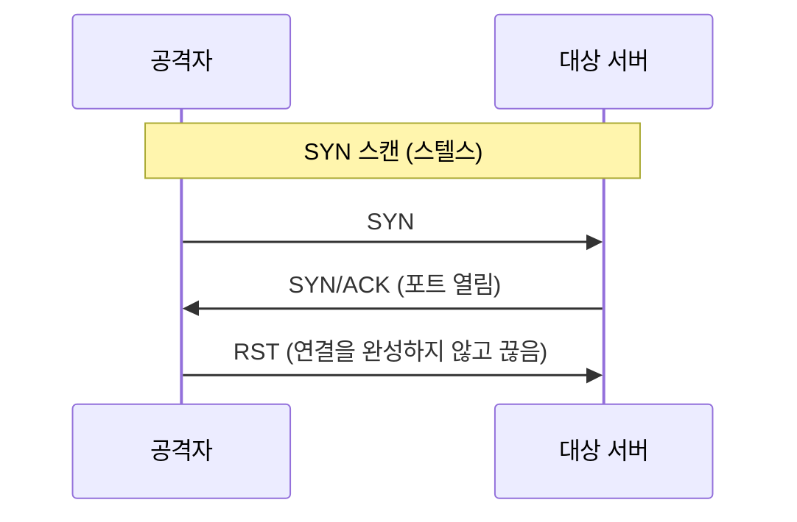
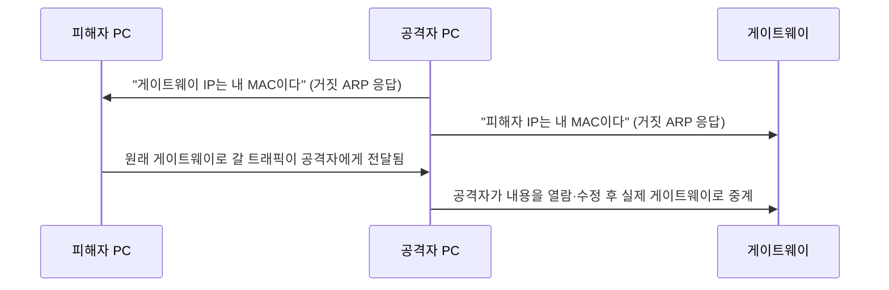
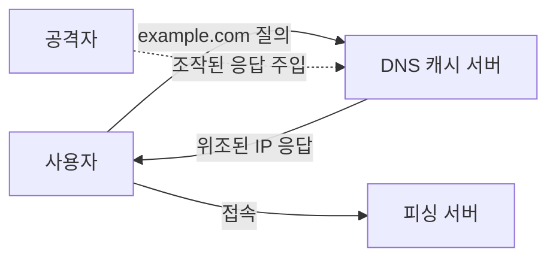

<Callout type="info">
  **이번 문서의 목표:** TCP SYN 스캔이 커넥트 스캔보다 은밀한 이유를 3-way handshake 단계로 설명하고, 스위칭 환경에서 스니핑이 어떻게 가능해지는지 ARP 스푸핑 원리로 이해하며, IP·DNS 스푸핑의 차이와 SSH·RDP 원격접속 공격의 탐지·대응 방법을 실제 명령어로 다룰 수 있게 된다.
</Callout>

## 왜 공격기법을 알아야 방어할 수 있는가

11편에서 스위치·라우터·방화벽이 각각 어떤 계층·기준으로 트래픽을 처리하는지 봤습니다. 이번 편의 모든 공격은 사실 그 동작 방식을 **역이용**하는 것입니다. 스위치가 MAC 주소를 자동으로 학습한다는 사실을 역이용하면 ARP 스푸핑이 되고, 3-way handshake의 마지막 단계를 일부러 생략하면 스텔스 스캔이 됩니다. 원리를 먼저 이해해야 왜 특정 방어 기법(15편의 IDS/IPS, DHCP 스누핑 등)이 그 공격을 막을 수 있는지 논리적으로 연결됩니다.

> **쉽게 말하면:** 이번 편은 "문이 어떻게 열리는지 아는 사람만 몰래 열 수 있고, 그 원리를 아는 사람만 제대로 잠글 수 있다"는 이야기입니다.

## 1. 포트·호스트 스캐닝

### 왜 스캐닝이 공격의 첫 단계인가

공격자는 목표를 정하기 전에 "어떤 호스트가 살아 있고, 어떤 포트가 열려 있으며, 어떤 서비스가 어떤 버전으로 떠 있는지"를 먼저 파악해야 합니다. 이 정찰 단계를 **스캐닝**(scanning)이라고 부르며, 대표 도구가 **nmap**(Network Mapper)입니다.

### TCP 커넥트 스캔 vs SYN 스캔

03편에서 다룬 TCP 3-way handshake(SYN → SYN/ACK → ACK)를 기억해야 두 스캔 방식의 차이가 이해됩니다.

```bash
# 완전한 연결을 맺는 커넥트 스캔 (관리자 권한 불필요)
nmap -sT 192.168.10.20

# SYN만 보내고 완료하지 않는 SYN 스캔 (관리자 권한 필요)
nmap -sS 192.168.10.20
```



**커넥트 스캔**(`-sT`)은 3-way handshake를 끝까지 완료합니다. 즉 애플리케이션 계층까지 정상적인 연결이 성립되므로 대상 서버의 로그에 완전한 접속 기록이 남습니다. **SYN 스캔**(`-sS`, 흔히 "하프 오픈" 또는 스텔스 스캔이라 부름)은 SYN을 보내 SYN/ACK를 받으면 포트가 열려 있다고 판단하고, 즉시 ACK 대신 RST(연결 초기화)를 보내 연결을 완성하지 않습니다. 완전한 연결이 성립되지 않으므로 애플리케이션 로그에는 흔적이 남지 않아 **더 은밀합니다.** 다만 원시 소켓을 다뤄야 해서 운영체제의 관리자·루트 권한이 필요합니다.

### 응답으로 포트 상태 판정하기

| 보낸 패킷 | 받은 응답 | 판정 |
|-----------|-----------|------|
| SYN | SYN/ACK | 열림(open) |
| SYN | RST | 닫힘(closed) |
| SYN | 응답 없음(타임아웃) | 필터링됨(filtered, 방화벽이 차단 중일 가능성) |

### 그 밖의 스캔 유형

```bash
# UDP 스캔 (UDP는 연결 개념이 없어 응답이 느리고 판정이 모호함)
nmap -sU 192.168.10.20

# 서비스 버전 확인
nmap -sV 192.168.10.20

# FIN·NULL·Xmas 스캔: 방화벽 로그를 우회하려는 목적의 비정상 플래그 조합
nmap -sF 192.168.10.20
```

**FIN·NULL·Xmas 스캔**은 정상적인 handshake 순서를 아예 따르지 않고 비정상적인 플래그 조합(FIN만, 플래그 없음, 모든 플래그)을 보내 상태 저장형(stateful) 방화벽이나 오래된 침입탐지시스템을 혼란시키려는 기법입니다. 시험에서는 "SYN 스캔이 커넥트 스캔보다 은밀한 이유"와 "UDP 스캔의 판정이 왜 모호한가"가 자주 출제됩니다.

## 2. 스니핑과 스위칭 환경 공격

### 스니핑의 원리

**스니핑**(sniffing)은 네트워크를 지나는 패킷을 가로채 내용을 들여다보는 행위입니다. 예전의 허브(hub) 환경에서는 한 포트로 들어온 신호를 **모든 포트로 그대로 뿌렸기 때문에**, 랜카드를 **프로미스큐어스 모드**(promiscuous mode, 자신에게 향하지 않은 프레임도 모두 수신하는 모드)로 설정하기만 하면 같은 네트워크의 모든 트래픽을 볼 수 있었습니다.

하지만 지금은 대부분 **스위치** 환경입니다. 11편에서 본 대로 스위치는 MAC 주소 테이블을 보고 **정확한 포트로만** 프레임을 전달하므로, 단순히 랜카드를 프로미스큐어스 모드로 바꾸는 것만으로는 다른 기기의 트래픽이 보이지 않습니다. 그래서 스위칭 환경에서 스니핑을 하려면 별도의 능동적인 속임수가 필요합니다. 그 대표가 **ARP 스푸핑**입니다.

### ARP 스푸핑

**ARP**(Address Resolution Protocol, 주소 결정 프로토콜)는 같은 네트워크 안에서 IP 주소에 대응하는 MAC 주소를 찾는 프로토콜입니다. 문제는 ARP에 **인증 절차가 없다**는 점입니다. 누구든 "이 IP는 내 MAC 주소다"라는 응답을 네트워크에 뿌리면, 다른 기기들은 이를 그대로 믿고 자신의 ARP 캐시(테이블)를 갱신합니다.



**공격자는 피해자에게는 "내가 게이트웨이다"라고 속이고, 게이트웨이에게는 "내가 피해자다"라고 속입니다.** 그 결과 피해자와 게이트웨이 사이의 모든 트래픽이 공격자를 거쳐 지나가게 되며, 공격자는 이를 그대로 중계하면서 내용을 훔쳐보거나 조작할 수 있습니다. 이 위치를 이용한 공격을 통칭 **중간자 공격**(MITM, Man-In-The-Middle)이라고 부릅니다.

```bash
# 리눅스 실습 환경에서 흔히 쓰이는 도구 예시 (사전 승인된 모의훈련 환경에서만 사용)
arpspoof -i eth0 -t 192.168.0.10 192.168.0.1
```

**탐지·대응:** 정상 상태의 ARP 캐시를 정적으로 등록(`arp -s`)해 자동 갱신을 막거나, 스위치의 **DAI**(Dynamic ARP Inspection) 기능으로 신뢰할 수 없는 포트의 ARP 응답을 검증해 차단합니다. `arp -a` 명령으로 게이트웨이의 MAC 주소가 평소와 다르게 바뀌었는지 주기적으로 확인하는 것도 기초적인 탐지 방법입니다.

## 3. IP 스푸핑과 DNS 스푸핑

### IP 스푸핑

**IP 스푸핑**(IP spoofing)은 패킷의 출발지 IP 주소 필드를 실제와 다른 값으로 위조해 보내는 기법입니다. 인증이 IP 주소만으로 이뤄지는 낡은 시스템(예: `.rhosts` 기반 신뢰 관계)을 속이거나, 13편에서 다룰 반사·증폭 DDoS 공격에서 피해자의 IP로 위조한 요청을 제3의 서버에 보내는 데 사용됩니다.

### DNS 스푸핑과 캐시 포이즈닝

**DNS 스푸핑**(DNS spoofing)은 도메인 이름 질의에 대해 거짓 IP 주소로 응답해 사용자를 가짜 사이트로 유도하는 공격입니다. 그중 **DNS 캐시 포이즈닝**(cache poisoning)은 DNS 서버 자체의 캐시에 조작된 응답을 주입해, 그 DNS 서버를 이용하는 **모든** 사용자가 같은 잘못된 주소로 연결되게 만드는 더 파급력이 큰 형태입니다.



**해결책:** **DNSSEC**(DNS Security Extensions)은 DNS 응답에 전자서명을 붙여, 응답이 정당한 권한 있는 서버에서 온 것인지 검증할 수 있게 합니다. 18편에서 메일·DNS 서비스 보안을 다룰 때 DNSSEC을 더 깊이 봅니다. 이번 편에서는 "ARP 스푸핑은 같은 네트워크 안에서 MAC 주소를, DNS 스푸핑은 이름 해석 응답을 속인다"는 **속이는 대상의 차이**를 구분하는 것이 핵심입니다.

## 4. 원격접속 공격과 탐지 — SSH·RDP

### SSH 무차별 대입 공격

**SSH**(Secure Shell)는 암호화된 원격 접속 프로토콜이지만, 프로토콜 자체가 안전해도 **비밀번호가 약하면** 소용이 없습니다. 공격자는 자동화 도구로 흔한 계정명·비밀번호 조합을 반복 시도하는 **무차별 대입 공격**(brute-force attack)을 시도합니다.

```bash
# 공격자 관점의 도구 예시(모의훈련 환경 전용): hydra로 SSH 비밀번호 대입
hydra -l root -P wordlist.txt ssh://192.168.10.20
```

**탐지·대응:**

```bash
# 인증 로그에서 실패한 SSH 로그인 패턴 확인 (09편에서 다룬 auth.log)
grep "Failed password" /var/log/auth.log | awk '{print $(NF-3)}' | sort | uniq -c | sort -nr

# fail2ban으로 반복 실패 IP를 자동 차단
sudo fail2ban-client status sshd
```

**fail2ban**은 로그를 실시간으로 감시하다가 짧은 시간 안에 로그인 실패가 임계치를 넘은 출발지 IP를 방화벽 규칙에 자동으로 추가해 일정 시간 차단하는 도구입니다. 그 밖에 비밀번호 인증 대신 **공개키 인증**으로 전환하거나, 기본 포트(22번)를 바꾸는 것(근본 대책은 아니지만 자동화된 광범위 스캔의 노출을 줄이는 보조 수단), 계정 잠금 정책을 함께 적용합니다.

### RDP 공격과 최신 사례

**RDP**(Remote Desktop Protocol)는 윈도우 원격 데스크톱 접속에 쓰이는 프로토콜입니다. RDP도 SSH와 마찬가지로 무차별 대입 공격의 표적이 되며, 특히 **BlueKeep**(CVE-2019-0708)처럼 인증 없이도 원격 코드 실행이 가능한 취약점이 발견된 사례가 있어, 08편에서 다룬 "알려진 취약점에 대한 신속한 패치"의 대표 사례로 자주 인용됩니다. KISA 위협 동향 보고서에서도 랜섬웨어 공격 조직이 초기 침투 경로로 노출된 RDP 서비스를 반복적으로 악용한다고 지적합니다.

| 대응 방안 | 내용 |
|-----------|------|
| 네트워크 노출 최소화 | RDP를 인터넷에 직접 노출하지 않고 VPN(14편) 뒤에 배치 |
| MFA(다중요소 인증) 적용 | 비밀번호가 뚫려도 2차 인증으로 차단 |
| 최신 패치 유지 | BlueKeep류의 알려진 원격 코드 실행 취약점 차단 |
| 계정 잠금·로그 모니터링 | 반복 실패 계정을 탐지해 차단 |
| NLA(Network Level Authentication) 활성화 | 전체 세션이 열리기 전에 인증을 먼저 요구해 공격 표면 축소 |

## 핵심 정리

- **SYN 스캔**은 handshake를 완료하지 않아 로그에 흔적이 덜 남는 스텔스 기법이고, **커넥트 스캔**은 완전한 연결이 성립해 흔적이 남으며, **UDP 스캔**은 연결 개념이 없어 판정이 모호하다.
- 허브 환경에서는 **프로미스큐어스 모드**만으로 스니핑이 가능했지만, 스위치 환경에서는 MAC 주소 테이블 때문에 그대로는 불가능해 **ARP 스푸핑** 같은 능동적 속임수가 필요하다.
- ARP 스푸핑은 인증 절차가 없는 ARP의 허점을 이용해 피해자와 게이트웨이 양쪽을 속여 **중간자 공격**(MITM) 위치를 확보한다.
- **IP 스푸핑**은 출발지 IP 위조, **DNS 스푸핑·캐시 포이즈닝**은 이름 해석 응답 위조로, 속이는 대상이 다르다. DNSSEC이 DNS 스푸핑의 근본 대응책이다.
- **SSH·RDP** 원격접속은 프로토콜 자체가 안전해도 약한 비밀번호로 무차별 대입 공격에 노출되며, fail2ban·공개키 인증·MFA·최신 패치·네트워크 노출 최소화로 대응한다.
- **BlueKeep**(CVE-2019-0708)처럼 인증 없이 원격 코드 실행이 가능한 취약점은 패치의 시급성을 보여주는 대표 사례로 출제된다.

## 마무리 복습

<Quiz
  questionNumber={1}
  question="TCP SYN 스캔이 TCP 커넥트 스캔보다 더 은밀하다고 평가받는 이유로 가장 적절한 것은?"
  options={['SYN 스캔은 UDP 프로토콜을 사용하기 때문이다', 'SYN 스캔은 3-way handshake를 완료하지 않아 애플리케이션 로그에 흔적이 덜 남기 때문이다', 'SYN 스캔은 관리자 권한 없이도 실행할 수 있기 때문이다', 'SYN 스캔은 방화벽을 아예 통과하지 않기 때문이다']}
  correctAnswer={2}
  explanation="SYN 스캔은 SYN을 보내 SYN/ACK를 확인한 뒤 ACK 대신 RST를 보내 연결을 완성하지 않으므로, 완전한 연결이 성립되는 커넥트 스캔과 달리 애플리케이션 계층 로그에 접속 기록이 남지 않아 더 은밀하다."
  optionExplanations={['SYN 스캔은 TCP 기반이며 UDP를 사용하지 않는다.', 'handshake 미완료로 로그 흔적이 줄어드는 것이 정확한 이유다.', 'SYN 스캔은 원시 소켓을 다루므로 오히려 관리자 권한이 필요하다.', '방화벽 통과 여부는 스캔 은밀성과 별개의 문제다.']}
/>

<Quiz
  questionNumber={2}
  question="스위칭 환경에서 스니핑이 허브 환경보다 어려운 이유로 가장 적절한 것은?"
  options={['스위치는 모든 포트로 프레임을 복사해 전달하기 때문이다', '스위치는 MAC 주소 테이블을 보고 정확한 포트로만 프레임을 전달하기 때문이다', '스위치는 암호화되지 않은 프레임을 아예 처리하지 않기 때문이다', '스위치는 IP 주소가 없는 기기의 통신을 차단하기 때문이다']}
  correctAnswer={2}
  explanation="스위치는 MAC 주소 테이블을 학습해 목적지가 명확한 프레임을 해당 포트로만 정확히 전달하므로, 허브처럼 모든 포트로 뿌려지지 않아 랜카드를 프로미스큐어스 모드로 바꾸는 것만으로는 다른 기기의 트래픽을 볼 수 없다."
  optionExplanations={['모든 포트로 복사해 뿌리는 것은 허브의 동작 방식이다.', 'MAC 주소 테이블 기반의 정확한 전달이 정확한 이유다.', '스위치는 암호화 여부와 무관하게 프레임을 전달한다.', 'IP 주소 유무로 통신을 차단하는 것은 스위치의 기본 동작이 아니다.']}
/>

<Quiz
  questionNumber={3}
  question="ARP 스푸핑 공격의 동작 원리로 가장 적절한 것은?"
  options={['DNS 서버의 캐시에 조작된 도메인-IP 매핑을 주입한다', 'ARP에 인증 절차가 없다는 점을 이용해 거짓 IP-MAC 매핑 응답을 뿌려 중간자 위치를 확보한다', 'TCP 3-way handshake의 SYN 패킷을 위조해 서버 자원을 고갈시킨다', '무선랜의 SSID를 숨겨 접속을 유도한다']}
  correctAnswer={2}
  explanation="ARP는 요청 없이도 응답을 보내면 그대로 믿는 인증 부재 구조를 가지고 있어, 공격자가 피해자와 게이트웨이 양쪽에 거짓 IP-MAC 매핑을 보내면 트래픽이 공격자를 거쳐 흐르는 중간자 공격 위치를 확보할 수 있다."
  optionExplanations={['DNS 캐시 조작은 DNS 캐시 포이즈닝에 대한 설명이다.', 'ARP의 인증 부재를 이용한 거짓 매핑 주입이 정확한 원리다.', 'SYN 패킷 위조로 자원을 고갈시키는 것은 DoS 공격에 해당하는 설명이다.', 'SSID 숨김은 무선랜 보안과 관련된 별개의 주제다.']}
/>

<Quiz
  questionNumber={4}
  question="DNS 캐시 포이즈닝에 대한 설명으로 가장 적절한 것은?"
  options={['특정 사용자 한 명의 hosts 파일만 변조하는 공격이다', 'DNS 서버 자체의 캐시에 조작된 응답을 주입해 그 서버를 이용하는 다수 사용자를 잘못된 주소로 유도하는 공격이다', 'TCP 연결의 출발지 포트 번호만 위조하는 공격이다', '스위치의 MAC 주소 테이블을 가득 채워 플러딩을 유발하는 공격이다']}
  correctAnswer={2}
  explanation="DNS 캐시 포이즈닝은 개별 사용자가 아니라 DNS 서버의 캐시 자체를 조작해, 그 서버를 이용하는 모든 사용자가 같은 잘못된 IP로 연결되게 만들어 피해 범위가 훨씬 크다."
  optionExplanations={['개별 hosts 파일 변조는 국지적인 별개의 공격 형태다.', 'DNS 서버 캐시 조작으로 다수 사용자에게 영향을 주는 것이 정확한 정의다.', '포트 번호 위조는 DNS 스푸핑의 핵심 메커니즘이 아니다.', 'MAC 테이블 플러딩은 스위치 대상의 별개 공격 기법이다.']}
/>

<Quiz
  questionNumber={5}
  question="fail2ban 같은 도구가 SSH 무차별 대입 공격에 대응하는 방식으로 가장 적절한 것은?"
  options={['SSH 프로토콜 자체의 암호화 알고리즘을 강제로 변경한다', '로그를 감시해 짧은 시간 내 로그인 실패가 임계치를 넘은 IP를 방화벽 규칙으로 자동 차단한다', 'DNS 캐시를 주기적으로 초기화한다', 'ARP 캐시를 정적으로 고정한다']}
  correctAnswer={2}
  explanation="fail2ban은 인증 로그를 실시간으로 감시하다가 짧은 시간 안에 로그인 실패 횟수가 임계치를 넘은 출발지 IP를 방화벽 규칙에 자동으로 추가해 일정 시간 차단하는 방식으로 무차별 대입 공격을 완화한다."
  optionExplanations={['암호화 알고리즘 변경은 fail2ban의 기능이 아니다.', '로그 기반 자동 차단이 fail2ban의 정확한 동작 방식이다.', 'DNS 캐시 초기화는 fail2ban과 관련 없는 별개의 조치다.', 'ARP 캐시 고정은 ARP 스푸핑 대응책이지 SSH 대입 공격 대응책이 아니다.']}
/>

<Quiz
  questionNumber={6}
  question="RDP(원격 데스크톱 프로토콜) 노출 서버에 대한 보안 대책으로 가장 거리가 먼 것은?"
  options={['RDP를 인터넷에 직접 노출하지 않고 VPN 뒤에 배치한다', 'NLA(Network Level Authentication)를 비활성화해 접속 절차를 단순화한다', '알려진 원격 코드 실행 취약점에 대한 최신 패치를 유지한다', '다중요소 인증(MFA)을 적용해 비밀번호 유출에 대비한다']}
  correctAnswer={2}
  explanation="NLA는 전체 세션이 열리기 전에 인증을 먼저 요구해 공격 표면을 줄이는 보안 기능이므로, 이를 비활성화하는 것은 오히려 보안을 약화시키는 조치다."
  optionExplanations={['VPN 뒤 배치는 네트워크 노출을 줄이는 정확한 대책이다.', 'NLA 비활성화는 보안을 약화시키므로 대책이 아니라 위험을 키우는 조치다.', 'BlueKeep 같은 취약점 대응을 위한 정확한 대책이다.', 'MFA 적용은 비밀번호 유출 시 추가 방어선이 되는 정확한 대책이다.']}
/>

<Quiz
  questionNumber={7}
  question="nmap의 UDP 스캔(-sU)이 TCP SYN 스캔보다 결과 판정이 모호한 이유로 가장 적절한 것은?"
  options={['UDP는 3-way handshake 같은 연결 확인 절차가 없어 응답 유무만으로 열림·필터링을 명확히 구분하기 어렵기 때문이다', 'UDP 패킷은 암호화되어 있어 내용을 볼 수 없기 때문이다', 'UDP는 포트 개념 자체가 없기 때문이다', 'UDP 스캔은 항상 관리자 권한 없이도 실행되기 때문이다']}
  correctAnswer={1}
  explanation="UDP는 연결이라는 개념 자체가 없어 TCP처럼 SYN/ACK, RST 같은 명확한 응답 체계로 포트 상태를 판정할 수 없다. 응답이 없으면 열림인지 필터링인지 구분이 어려워 판정이 모호해진다."
  optionExplanations={['연결 확인 절차 부재가 판정 모호성의 정확한 이유다.', 'UDP 패킷 자체의 암호화 여부는 스캔 판정 모호성과 관련 없다.', 'UDP도 포트 번호 개념을 가지고 있다.', '권한 요구 여부는 판정 모호성의 이유가 아니다.']}
/>

## 참고 자료

- [itwiki - 정보보안기사 필기 출제기준](https://itwiki.kr/w/정보보안기사_필기_출제기준)
- [한국방송통신전파진흥원(cq.or.kr) - 정보보안기사 자격정보](https://www.cq.or.kr/qh_quagm01_020.do)
- [KISA 보호나라&KrCERT/CC - 사이버 위협 동향 보고서](https://www.krcert.or.kr/)
