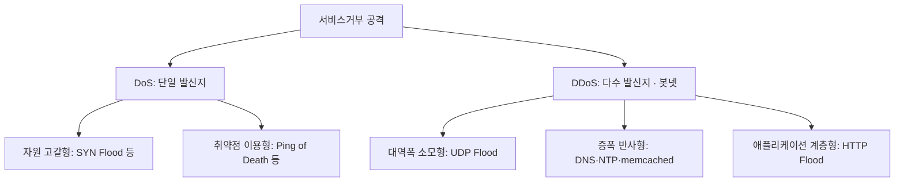
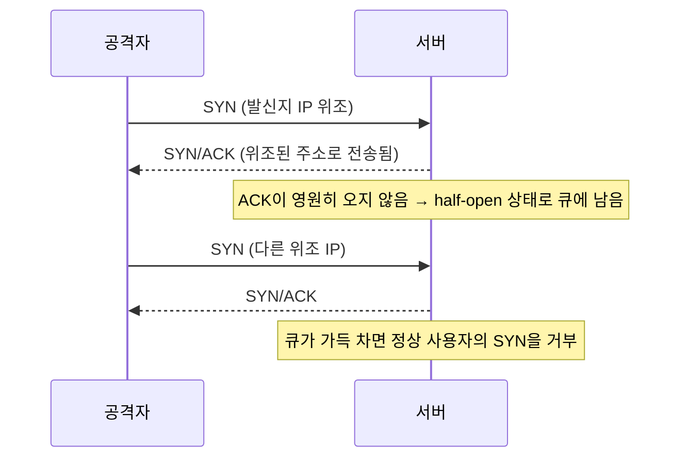
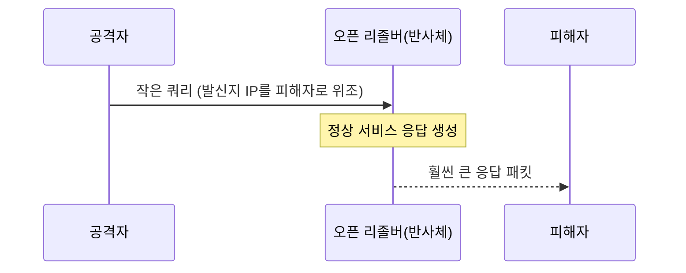
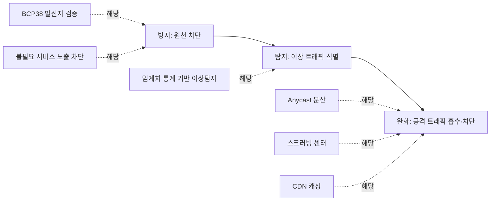

<Callout type="info">
  **이번 문서의 목표:** SYN Flood 같은 고전 DoS(Denial of Service, 서비스거부) 공격과 증폭(amplification) 기반 DDoS(Distributed DoS, 분산 서비스거부) 공격을 패킷 구조 수준에서 구분하고, 증폭 계수·필요 봇넷 규모를 직접 계산하며, 실제 대응에 쓰는 완화(mitigation) 기법을 명령어·설정 수준까지 설명할 수 있게 된다.
</Callout>

## 왜 이 공격이 시험에서 비중이 큰가

11편에서는 포트·호스트 스캐닝과 스니핑·스푸핑을, 12편에서는 원격접속 공격을 다뤘습니다. 이 공격들은 대부분 **정보를 훔치거나 침투 발판을 마련**하는 것이 목적입니다. 반면 이번 편의 DoS·DDoS는 목적이 다릅니다. 데이터를 훔치지 않고, 오히려 **정상 사용자가 서비스를 못 쓰게 만드는 것** 자체가 목적입니다.

정보보안기사 네트워크보안 과목에서 DoS·DDoS는 매회 반드시 나오는 주제입니다. 이유는 두 가지입니다. 첫째, 공격 기법 하나하나가 TCP/IP 프로토콜(3편에서 다룬 3-way handshake, UDP의 비연결성)의 **설계상 허점**을 그대로 이용하기 때문에 프로토콜 이해도를 함께 검증할 수 있습니다. 둘째, 실제로 매년 기록을 경신하는 대형 침해사고가 발생해 최신 동향 문제의 단골 소재가 됩니다.

> **쉽게 말하면:** 스캐닝·스니핑이 "몰래 들여다보기"라면, DoS·DDoS는 "정문을 가짜 손님들로 가득 채워 진짜 손님이 못 들어오게 막기"입니다.

## 1. DoS와 DDoS의 구분

**DoS**(Denial of Service, 서비스거부 공격)는 공격자 한 명(또는 소수)이 대상 시스템의 자원(CPU, 메모리, 네트워크 대역폭, 연결 테이블)을 고갈시켜 정상 요청을 처리하지 못하게 만드는 공격입니다. **DDoS**(Distributed DoS, 분산 서비스거부 공격)는 다수의 좀비 PC(봇넷)를 동원해 동시에 공격 트래픽을 쏘는 것으로, 원리는 DoS와 같지만 규모와 발신지 분산 때문에 차단이 훨씬 어렵습니다.



## 2. 고전 DoS 기법 — TCP/IP 설계 허점을 노린다

### SYN Flood — 3-way handshake의 절반만 채운다

**왜 가능한가.** 3편에서 본 TCP 3-way handshake는 `SYN → SYN/ACK → ACK` 세 단계입니다. 서버는 `SYN`을 받으면 클라이언트에게 `SYN/ACK`을 보내고, 자신의 **연결 대기 큐**(backlog queue)에 이 연결을 "반쯤 열린(half-open)" 상태로 등록한 뒤 마지막 `ACK`을 기다립니다. 문제는 이 큐의 크기가 유한하다는 점입니다.

> **쉽게 말하면:** 문 앞에서 "들어갈게요"라고만 외치고 실제로는 들어오지 않는 손님을 계속 세워 두면, 진짜 손님이 설 자리가 없어지는 것과 같습니다.

**공격 절차:**



공격자는 존재하지 않거나 응답하지 않는 발신지 IP 주소로 **위조**(spoofing)한 `SYN` 패킷을 초당 수천 개씩 보냅니다. 서버는 `SYN/ACK`을 보내지만 그 주소로는 `ACK`이 돌아오지 않으므로, half-open 연결이 백로그 큐에 계속 쌓입니다. 큐가 가득 차면 서버는 새로운 정상 연결 요청(`SYN`)까지 거부하거나 응답을 지연시킵니다.

**tcpdump로 본 SYN Flood 패턴** (실무에서 이런 로그를 보면 공격을 의심합니다):

```
14:22:01.001 IP 203.0.113.7.51422 > 10.0.0.5.443: Flags [S], seq 100
14:22:01.001 IP 198.51.100.9.33210 > 10.0.0.5.443: Flags [S], seq 200
14:22:01.001 IP 192.0.2.44.60112 > 10.0.0.5.443: Flags [S], seq 300
14:22:01.002 IP 203.0.113.201.11004 > 10.0.0.5.443: Flags [S], seq 400
```

**의심 근거:** 짧은 시간 안에 서로 다른(대개 위조된) 발신지 IP에서 `SYN` 플래그만 있는 패킷이 동일한 목적지 포트로 폭주하고, 뒤이은 `ACK`이 관측되지 않습니다.

**대응 — SYN 쿠키(SYN cookie):** 리눅스 서버는 half-open 연결 정보를 큐에 저장하는 대신, 클라이언트가 보낸 정보를 해시로 압축해 `SYN/ACK`의 시퀀스 번호 자체에 담아 보냅니다. 진짜 클라이언트가 `ACK`으로 응답하면 그 시퀀스 번호를 검증해 연결을 즉석에서 복원하므로, **연결 상태를 메모리에 미리 저장할 필요가 없어** 큐 고갈 공격이 무력화됩니다.

```bash
# 리눅스에서 SYN 쿠키 활성화 여부 확인 및 설정
sysctl net.ipv4.tcp_syncookies
net.ipv4.tcp_syncookies = 1

# 백로그 큐 크기 확대 (임시 완화)
sysctl -w net.ipv4.tcp_max_syn_backlog=4096
```

### UDP Flood

UDP(User Datagram Protocol)는 3-way handshake 같은 연결 설정 절차가 없는 비연결형 프로토콜입니다. 공격자는 대상의 임의 포트로 UDP 패킷을 대량 전송하고, 대상 시스템은 해당 포트에 열린 서비스가 없으면 매번 **ICMP Destination Unreachable** 오류 패킷을 회신합니다. 이 처리 자체가 CPU와 대역폭을 소모시켜 서비스 장애를 일으킵니다.

### ICMP Flood와 스머프(Smurf) 공격

**ICMP Flood**는 `ping`(ICMP Echo Request)을 대량으로 보내 응답 처리 부하를 유발합니다. **스머프 공격**은 여기에 IP 스푸핑과 브로드캐스트를 결합한 고전 기법입니다. 공격자가 발신지 주소를 피해자 IP로 위조한 ICMP Echo Request를 네트워크의 **브로드캐스트 주소**로 보내면, 그 네트워크 안의 모든 호스트가 동시에 피해자에게 응답을 보냅니다. 요청 하나로 응답 수백 개를 만들어내는 초기 형태의 증폭 공격이라 할 수 있습니다. 오늘날 대부분의 라우터는 기본 설정으로 IP 브로드캐스트 릴레이(directed broadcast)를 차단하므로 스머프 자체는 드물지만, **"증폭"이라는 아이디어의 원형**으로 시험에 자주 인용됩니다.

### 기타 취약점 이용형 공격

| 공격 | 원리 | 현재 상태 |
|------|------|-----------|
| Ping of Death | IP 규격상 최대 65,535바이트를 넘는 조각화된 ICMP 패킷을 재조립시켜 버퍼 오버플로우 유발 | 대부분 패치 완료, 개념 문제로만 출제 |
| Teardrop | IP 조각화(fragmentation) 오프셋 값을 조작해 재조립 시 커널을 충돌시킴 | 대부분 패치 완료 |
| Land 공격 | 발신지·목적지 IP와 포트를 피해자 자신으로 동일하게 위조해 무한 루프 유발 | 대부분 패치 완료 |
| 슬로우로리스(Slowloris) | HTTP 요청 헤더를 일부러 아주 느리게, 끝내지 않고 계속 전송해 서버의 동시 연결 슬롯을 점유 | 현재도 유효, Apache류 구버전에서 특히 취약 |

**슬로우로리스가 여전히 위험한 이유:** 대역폭을 거의 쓰지 않고도(초당 수백 바이트) 소수의 연결만으로 서버를 마비시킬 수 있어, 대역폭 기반 탐지 시스템을 우회하기 쉽습니다.

## 3. 증폭 기반 DDoS — 반사와 증폭의 결합

### 왜 필요한가

봇넷 규모가 크지 않아도, 아니면 발신 대역폭이 제한적이어도 대상에게 훨씬 큰 트래픽을 퍼부을 방법이 있다면 공격자에게는 훨씬 효율적입니다. **반사**(reflection)와 **증폭**(amplification)을 결합한 공격이 바로 이것을 가능하게 합니다.

> **쉽게 말하면:** 공격자가 직접 큰 소리를 지르는 대신, 남의 확성기(공개 서버)에 짧게 속삭이면서 발신인을 피해자로 위조해 두면, 확성기가 피해자에게 엄청나게 큰 소리로 대신 외쳐 주는 셈입니다.

### 동작 원리



공격자는 발신지 IP 주소를 피해자의 것으로 위조한 요청을 인터넷에 공개된 서버(오픈 DNS 리졸버, NTP 서버, memcached 서버 등)에 보냅니다. 이 서버는 요청이 위조됐는지 검증하지 않고, 정상적인 응답을 **요청에 적힌 발신지 주소**, 즉 피해자에게 보냅니다. 이때 응답 크기가 요청 크기보다 훨씬 크면, 공격자가 소모한 대역폭보다 훨씬 큰 트래픽이 피해자에게 도달합니다.

### 증폭 계수 계산

**정의:** 증폭 계수(amplification factor)는 다음과 같이 계산합니다.

$$
A = \frac{\text{응답 패킷 크기}}{\text{요청 패킷 크기}}
$$

- $A$: 증폭 계수 (몇 배로 커지는가)
- 단위는 바이트(byte) 기준

**손계산 예시.** 공격자가 오픈 DNS 리졸버에 60바이트짜리 DNS 쿼리를 보냈더니 3,000바이트짜리 응답이 돌아왔다고 합시다.

$$
A = \frac{3000}{60} = 50
$$

**해석:** 공격자가 자기 대역폭 1을 쓰면 피해자는 50을 얻어맞습니다. 즉 공격자의 실제 발신 능력보다 50배 큰 공격 트래픽을 만든 것입니다.

**프로토콜별 대표 증폭 계수 비교:**

| 프로토콜 | 악용 조건 | 대략적 증폭 계수 |
|----------|-----------|------------------|
| DNS | 오픈 리졸버, ANY 쿼리 | 약 28–54배 |
| NTP | monlist 명령 지원하는 구버전 NTP 서버 | 약 556배 |
| SSDP(UPnP) | 인터넷에 노출된 IoT 기기 | 약 30배 |
| CLDAP | 인터넷에 노출된 LDAP 서비스 | 약 56–70배 |
| memcached | 인증 없이 UDP로 노출된 캐시 서버 | 약 10,000–51,000배 |

**memcached 증폭이 압도적으로 큰 이유:** memcached는 원래 인터넷에 노출하도록 설계된 서비스가 아니라 내부망에서 대용량 데이터를 캐싱하는 용도입니다. 요청 한 번에 최대 1메가바이트에 가까운 값을 저장·조회할 수 있어, 아주 작은 요청으로 매우 큰 응답을 유도할 수 있습니다.

### 봇넷 규모와 필요 트래픽 계산 — 계산 문제 대비

**문제 상황:** 공격자가 봇 10,000대를 확보했고, 봇 1대가 낼 수 있는 실제 발신 대역폭이 1Mbps(초당 메가비트)이며, DNS 증폭 계수를 50배로 가정합니다. 목적지에 도달하는 총 공격 트래픽은 얼마입니까?

**1단계 — 봇넷 전체의 원본 발신 대역폭**

$$
10000 \times 1\text{Mbps} = 10000\text{Mbps} = 10\text{Gbps}
$$

**2단계 — 증폭 적용**

$$
10\text{Gbps} \times 50 = 500\text{Gbps}
$$

**해석:** 봇 1만 대만으로도 500Gbps(초당 기가비트)라는, 웬만한 중소 인터넷서비스제공자(ISP)의 전체 회선 용량을 넘어서는 트래픽을 만들 수 있습니다. 이것이 증폭 공격이 위험한 이유입니다 — 봇넷 규모를 늘리지 않고도 반사체(reflector)와 증폭 계수만으로 피해 규모를 기하급수적으로 키울 수 있습니다.

**자주 틀리는 점:** 증폭 계수를 요청·응답 **횟수**의 비율로 착각하는 경우가 많습니다. 증폭 계수는 어디까지나 **패킷 크기**(바이트)의 비율입니다.

## 4. 봇넷과 최근 대규모 DDoS 사고 사례

**봇넷**(botnet)은 악성코드에 감염되어 공격자(봇마스터, botmaster)의 명령제어(Command and Control, C2) 서버 지시에 따라 동시에 움직이는 좀비 PC·IoT 기기의 집합입니다. 최근 대규모 DDoS는 대부분 전통적인 PC보다 **보안이 허술한 IoT 기기**(CCTV, 공유기, DVR 등)를 감염시킨 봇넷에서 나옵니다.

| 사고 | 시기 | 특징 |
|------|------|------|
| 미라이(Mirai) 봇넷 – Dyn DNS 공격 | 2016년 | 기본 비밀번호를 쓰는 IoT 기기 수십만 대를 감염시켜 DNS 서비스 업체 Dyn을 공격, 트위터·넷플릭스·레딧 등 대형 서비스가 동시에 접속 장애를 겪음. 소스코드가 공개되어 이후 변종이 계속 등장 |
| GitHub 멤캐시드(memcached) 반사 공격 | 2018년 | 인증 없이 노출된 memcached 서버를 반사체로 이용, 단일 사고 기준 최대 규모(1.3테라비트/초 이상)의 트래픽을 기록. 이후 클라우드 사업자들이 memcached UDP 기본 노출을 긴급 차단 |
| AWS Shield가 완화한 CLDAP 반사 공격 | 2020년 | 커넥션리스 LDAP 프로토콜을 악용한 반사 공격으로, 2.3테라비트/초 이상의 트래픽이 관측됨. 클라우드 사업자의 자동 스크러빙 인프라로 서비스 중단 없이 완화 |
| HTTP/2 Rapid Reset 취약점(CVE-2023-44487) 기반 공격 | 2023년 | HTTP/2 프로토콜의 스트림 재설정(RST_STREAM) 처리 방식을 악용해, 상대적으로 적은 봇 수로도 초당 요청 수(RPS) 기준 역대 최대급 애플리케이션 계층 DDoS를 만들어냄. 대형 클라우드·CDN 사업자가 동시에 패치 공개 |

**최신 동향 — 애플리케이션 계층(L7) DDoS의 증가:** 과거에는 네트워크·전송 계층(L3/L4)에서 대역폭 자체를 고갈시키는 공격이 주류였지만, 최근에는 HTTP 요청 자체를 대량 발생시켜 웹 서버·애플리케이션 자원(DB 커넥션, 스레드 풀)을 고갈시키는 L7 DDoS 비중이 커지고 있습니다. L7 공격은 트래픽량 자체는 적을 수 있어 단순 대역폭 기반 탐지로는 잡히지 않고, 정상 요청과 패턴이 비슷해 구분이 더 어렵습니다.

## 5. 탐지·완화 전략



### 예방 — 애초에 반사체·위조를 막는다

- **BCP38(발신지 주소 검증, ingress filtering):** ISP가 자기 네트워크에서 나가는 패킷의 발신지 IP가 실제로 그 네트워크 대역에 속하는지 검사해, 위조된 발신지 주소를 가진 패킷이 인터넷으로 나가지 못하게 막습니다. 모든 ISP가 이를 적용하면 IP 스푸핑 기반 반사 공격 자체가 원천적으로 어려워집니다.
- **불필요한 UDP 서비스 인터넷 노출 차단:** DNS 리졸버는 재귀 질의(recursive query)를 내부 사용자에게만 허용하고, memcached·NTP 등은 방화벽에서 외부 UDP 접근을 차단합니다.

### 탐지 — 정상과 다른 패턴을 잡는다

- **임계치 기반:** 초당 SYN 패킷 수, 초당 요청 수(RPS)가 평소 대비 급격히 증가하면 경보를 발생시킵니다.
- **통계·행위 기반:** 정상 사용자 트래픽의 프로토콜 분포, 지리적 분포, User-Agent 패턴과 비교해 이상치를 탐지합니다. 15편에서 다룰 IDS/IPS·NAC와 함께 운영됩니다.

### 완화 — 이미 벌어진 공격을 흡수한다

- **트래픽 제한(rate limiting):** 리눅스 `iptables`로 초당 신규 연결 수를 제한할 수 있습니다.

```bash
# 신규 SYN 연결을 초당 20개, 버스트 40개로 제한
iptables -A INPUT -p tcp --syn -m limit --limit 20/second --limit-burst 40 -j ACCEPT
iptables -A INPUT -p tcp --syn -j DROP
```

- **nginx 계층에서 요청 속도 제한** (L7 DDoS·슬로우로리스류에 유효):

```nginx
# nginx.conf
limit_req_zone $binary_remote_addr zone=perip:10m rate=10r/s;

server {
  location /api/ {
    limit_req zone=perip burst=20 nodelay;
  }
}
```

- **Anycast:** 동일한 IP 주소를 여러 지역의 서버에 동시에 할당해, 라우팅상 가장 가까운 곳으로 트래픽을 자동 분산시키는 기법입니다. 대규모 DDoS 트래픽도 여러 거점(Point of Presence, PoP)에 나뉘어 도달하므로 개별 거점이 감당할 수 있는 수준으로 부하가 줄어듭니다. CDN(Content Delivery Network) 사업자와 DNS 루트 서버 대부분이 이 방식으로 방어력을 확보합니다.
- **스크러빙 센터(scrubbing center):** 공격 트래픽을 일단 전용 정제 시설로 우회시켜, 정상 트래픽과 공격 트래픽을 구분한 뒤 정상 트래픽만 원래 목적지로 돌려보내는 서비스입니다. 대형 클라우드 사업자의 DDoS 방어 서비스가 이 구조로 동작합니다.
- **BGP 블랙홀 라우팅(RTBH, Remotely Triggered Black Hole):** 공격을 특정 IP 하나로 집중당하고 있을 때, 그 IP로 향하는 트래픽 전체를 라우팅상 "구멍(null0)"으로 버리도록 ISP에 요청하는 최후 수단입니다. 대상 서비스는 죽지만, 최소한 같은 네트워크의 다른 서비스는 살릴 수 있습니다.

## 핵심 정리

- **DoS**는 단일 발신지, **DDoS**는 봇넷을 이용한 다수 발신지 공격이며 목적은 자원 고갈을 통한 서비스 중단이다.
- **SYN Flood**는 3-way handshake의 절반(half-open)만 채워 백로그 큐를 고갈시키며, **SYN 쿠키**로 연결 상태 저장 없이 방어한다.
- **증폭 공격**은 발신지 IP를 피해자로 위조한 뒤 오픈 서비스(DNS·NTP·memcached 등)의 큰 응답을 피해자에게 반사시키며, 증폭 계수 $A = 응답크기 / 요청크기$로 계산한다. memcached는 최대 수만 배까지 증폭될 수 있어 특히 위험하다.
- 미라이 봇넷의 2016년 Dyn 공격, 2018년 GitHub memcached 공격, 2020년 CLDAP 공격, 2023년 HTTP/2 Rapid Reset 취약점 공격은 각각 봇넷·반사·프로토콜 취약점을 이용한 대표 사례다.
- 방어는 **예방**(BCP38 발신지 검증, 불필요 서비스 차단) → **탐지**(임계치·통계 기반) → **완화**(rate limiting, Anycast, 스크러빙 센터, BGP 블랙홀)의 단계로 이루어진다.
- 최근에는 대역폭 소모형(L3/L4)보다 **애플리케이션 계층(L7) 요청 폭주형** 공격 비중이 커지는 추세다.

## 마무리 복습

<Quiz
  questionNumber={1}
  question="SYN Flood 공격이 서버를 마비시키는 직접적인 원리로 가장 적절한 것은?"
  options={['서버의 디스크 용량을 가득 채운다', '위조된 발신지로 보낸 SYN에 대한 ACK이 오지 않아 half-open 연결이 백로그 큐를 가득 채운다', '서버의 관리자 계정 비밀번호를 무작위로 대입한다', '서버가 사용하는 암호화 키를 유출시킨다']}
  correctAnswer={2}
  explanation="SYN Flood는 발신지 IP를 위조한 SYN 패킷을 대량으로 보내 서버가 SYN/ACK을 응답하게 하고, 위조된 주소에서는 ACK이 돌아오지 않으므로 half-open 연결이 백로그 큐에 계속 쌓여 정상 연결을 처리할 자리가 없어지게 만든다."
  optionExplanations={['디스크 용량과는 무관하며 연결 큐 고갈이 핵심이다.', '3-way handshake의 미완료 상태가 큐를 채우는 것이 핵심 원리다.', '비밀번호 대입은 무차별 대입 공격이며 SYN Flood와 무관하다.', '키 유출은 암호 공격의 영역이며 SYN Flood와 무관하다.']}
/>

<Quiz
  questionNumber={2}
  question="공격자가 오픈 DNS 리졸버에 60바이트 쿼리를 보내 3,000바이트 응답을 유도했다. 이때 증폭 계수는 얼마인가?"
  options={['0.02배', '50배', '3000배', '60배']}
  correctAnswer={2}
  explanation="증폭 계수는 응답 패킷 크기를 요청 패킷 크기로 나눈 값이다. 3000을 60으로 나누면 50이 되므로 증폭 계수는 50배다."
  optionExplanations={['요청을 응답으로 나눈 역수로, 정의를 반대로 계산한 값이다.', '3000÷60=50이므로 정답이다.', '응답 패킷 크기 자체이며 계수가 아니다.', '요청 패킷 크기 자체이며 계수가 아니다.']}
/>

<Quiz
  questionNumber={3}
  question="봇 5000대가 각각 2Mbps의 실제 발신 대역폭을 낼 수 있고 증폭 계수가 40배인 반사 공격을 수행할 때, 피해자에게 도달하는 총 트래픽은 얼마인가?"
  options={['10Gbps', '250Gbps', '400Gbps', '10Mbps']}
  correctAnswer={3}
  explanation="봇넷의 원본 발신 대역폭은 5000×2Mbps=10000Mbps=10Gbps이며, 여기에 증폭 계수 40배를 곱하면 10Gbps×40=400Gbps가 된다."
  optionExplanations={['증폭 계수를 곱하기 전 원본 대역폭 값이다.', '10Gbps에 40이 아닌 25를 곱한 값으로 계산 오류다.', '10Gbps×40=400Gbps이므로 정답이다.', '단위 환산을 하지 않은 값이다.']}
/>

<Quiz
  questionNumber={4}
  question="증폭 기반 DDoS 공격이 성립하기 위한 조건으로 옳지 않은 것은?"
  options={['공격자가 발신지 IP 주소를 피해자의 주소로 위조할 수 있어야 한다', '반사체로 이용되는 서버가 요청 발신지를 검증하지 않고 응답해야 한다', '응답 패킷의 크기가 요청 패킷보다 커야 증폭 효과가 있다', '공격자와 피해자가 반드시 같은 내부 네트워크에 있어야 한다']}
  correctAnswer={4}
  explanation="증폭 공격은 인터넷에 공개된 반사체 서버를 이용하는 것이 일반적이며 공격자와 피해자가 같은 내부 네트워크에 있을 필요는 없다. 발신지 위조, 검증 부재, 응답 크기 확대는 모두 필수 조건이다."
  optionExplanations={['발신지 위조는 반사 공격의 핵심 전제 조건이다.', '검증 부재가 없으면 반사체가 위조 요청을 걸러낸다.', '증폭 효과의 정의 그 자체다.', '내부 네트워크 제약은 없으며 이 조건이 잘못된 서술이다.']}
/>

<Quiz
  questionNumber={5}
  question="2016년 Dyn DNS 서비스를 대상으로 한 대규모 DDoS 공격에서 활용된 봇넷으로 옳은 것은?"
  options={['제우스(Zeus)', '미라이(Mirai)', '스턱스넷(Stuxnet)', '워너크라이(WannaCry)']}
  correctAnswer={2}
  explanation="2016년 Dyn 공격은 기본 비밀번호를 사용하는 IoT 기기들을 감염시킨 미라이 봇넷에 의해 수행되었으며, 이로 인해 트위터·넷플릭스 등 다수 서비스가 접속 장애를 겪었다."
  optionExplanations={['제우스는 금융 정보 탈취를 목적으로 한 뱅킹 악성코드다.', 'IoT 기기를 감염시킨 미라이 봇넷이 이 공격의 주체다.', '스턱스넷은 산업제어시스템을 겨냥한 표적형 악성코드다.', '워너크라이는 랜섬웨어로 SMB 취약점을 이용한 전파가 특징이다.']}
/>

<Quiz
  questionNumber={6}
  question="애플리케이션 계층(L7) DDoS 공격인 슬로우로리스(Slowloris)의 특징으로 가장 적절한 것은?"
  options={['대역폭을 매우 많이 소모해 네트워크 회선 자체를 포화시킨다', 'HTTP 요청을 매우 느리게 끝내지 않고 유지해 서버의 동시 연결 슬롯을 점유한다', 'DNS 서버의 캐시를 조작해 사용자를 가짜 사이트로 유도한다', '무작위 비밀번호 대입으로 계정을 탈취한다']}
  correctAnswer={2}
  explanation="슬로우로리스는 HTTP 요청 헤더 전송을 일부러 완료하지 않고 느리게 유지하는 방식으로 서버의 제한된 동시 연결 슬롯을 소수의 연결만으로 모두 점유해, 적은 대역폭으로도 서비스를 마비시킨다."
  optionExplanations={['대역폭 소모가 크지 않다는 점이 오히려 이 공격의 특징이다.', '연결 슬롯 점유가 핵심 메커니즘이므로 옳은 설명이다.', 'DNS 캐시 조작은 DNS 스푸핑·캐시 포이즈닝의 영역이다.', '계정 탈취는 무차별 대입 공격의 영역이며 DoS와 목적이 다르다.']}
/>

<Quiz
  questionNumber={7}
  question="BCP38(발신지 주소 검증)을 모든 ISP가 적용했을 때 가장 직접적으로 어려워지는 공격은?"
  options={['SQL 인젝션', 'IP 스푸핑 기반 반사·증폭 DDoS', '피싱 메일을 통한 자격증명 탈취', '무선랜 암호 크래킹']}
  correctAnswer={2}
  explanation="BCP38은 자기 네트워크에서 나가는 패킷의 발신지 주소가 실제 소속 대역과 일치하는지 검증해 위조된 발신지 주소를 가진 패킷의 전송을 차단한다. 반사·증폭 DDoS는 발신지 위조가 필수 전제이므로 이 검증이 확산되면 성립이 어려워진다."
  optionExplanations={['SQL 인젝션은 애플리케이션 입력값 검증의 문제이며 발신지 주소와 무관하다.', '발신지 위조가 필수인 반사·증폭 공격을 원천적으로 어렵게 만든다.', '피싱은 사회공학 기법이며 네트워크 계층 발신지 검증과 무관하다.', '무선랜 암호 크래킹은 인증·암호화 프로토콜의 문제다.']}
/>

## 참고 자료

- [KISA 보호나라 - 사이버 위협 동향](https://www.krcert.or.kr/)
- [itwiki - 정보보안기사 필기 출제기준](https://itwiki.kr/w/정보보안기사_필기_출제기준)
- [Cloudflare Learning - What is a DDoS attack](https://www.cloudflare.com/learning/ddos/what-is-a-ddos-attack/)
- [Cloudflare Learning - Memcached DDoS attack](https://www.cloudflare.com/learning/ddos/memcached-ddos-attack/)
