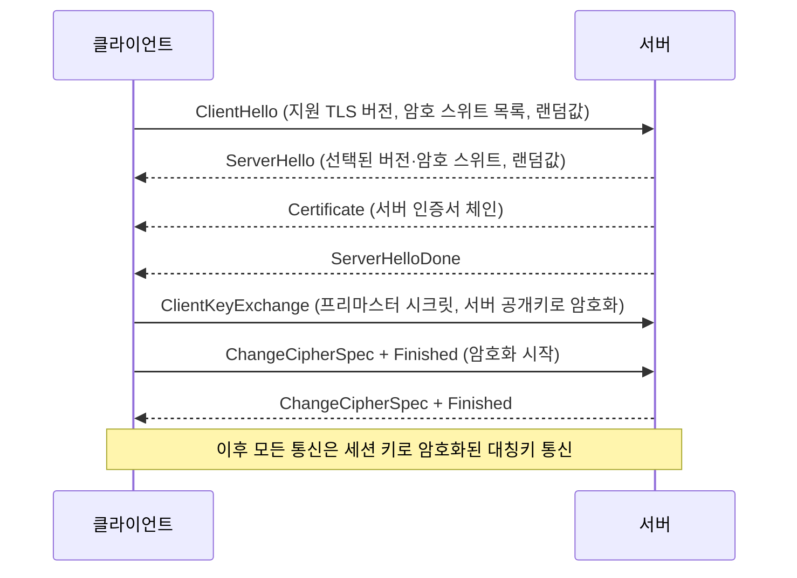
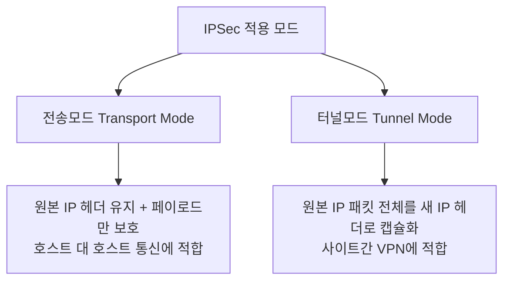
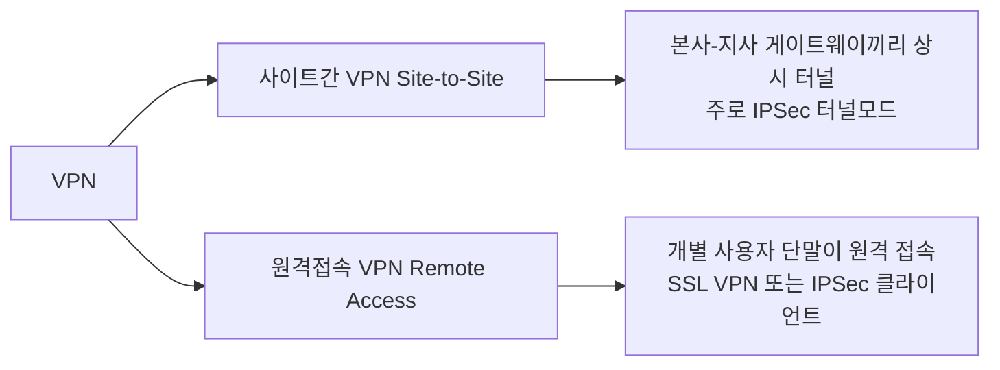

<Callout type="info">
  **이번 문서의 목표:** TLS(Transport Layer Security) 핸드셰이크 절차와 인증서 검증 과정을 단계별로 설명하고, IPSec(IP Security)의 AH·ESP와 전송모드·터널모드를 구분하며, 사이트간·원격접속 VPN(Virtual Private Network) 구성 방식과 구버전 프로토콜의 실제 취약점 사례를 이해할 수 있게 된다.
</Callout>

## 왜 암호화된 프로토콜이 필요한가

11·12편에서 본 스니핑(패킷 도청)과 스푸핑 공격은 네트워크 위를 오가는 패킷이 **평문**(plaintext)이라는 전제 위에서 성립합니다. 스위칭 환경에서 ARP 스푸핑으로 트래픽을 가로채도, 그 안의 내용이 암호화되어 있다면 공격자는 의미 없는 바이트 뭉치만 얻습니다. **SSL/TLS**와 **IPSec**은 바로 이 "가로채도 못 읽게" 만드는 역할을 하는 대표적인 보안 프로토콜입니다.

> **쉽게 말하면:** 도청 자체를 막을 수 없다면, 도청해도 알아들을 수 없는 언어로 대화하자는 것입니다.

둘의 차이는 **적용 계층**입니다. TLS는 응용 계층 바로 아래(전송 계층 위)에서 특정 애플리케이션(웹 브라우저·메일 클라이언트 등)의 통신을 암호화하고, IPSec은 네트워크 계층(IP 계층)에서 동작해 그 위에 올라가는 모든 트래픽을 애플리케이션과 무관하게 암호화합니다. 이 차이 때문에 TLS는 웹 서비스에, IPSec은 네트워크 전체를 묶는 VPN에 주로 쓰입니다.

## 1. TLS 핸드셰이크 — 안전한 채널을 여는 절차

### 핵심 아이디어

TLS는 두 가지 암호 방식을 이어 붙여 씁니다. **비대칭키(공개키) 암호**로 안전하게 "세션 키(session key)"라는 임시 대칭키를 교환한 뒤, 실제 데이터 통신은 훨씬 빠른 **대칭키 암호**로 처리합니다. 공개키 암호가 느린 대신 키를 안전하게 나눠 가질 수 있고, 대칭키 암호는 빠른 대신 키를 미리 공유해야 한다는 두 방식의 단점을 서로 보완한 설계입니다.

### TLS 1.2 핸드셰이크 절차



**단계별 의미:**

1. **ClientHello:** 클라이언트가 지원하는 TLS 버전, 암호 스위트(cipher suite) 목록, 무작위값(랜덤 논스)을 보냅니다.
2. **ServerHello:** 서버가 그중 하나의 버전·암호 스위트를 확정하고 자신의 무작위값을 보냅니다.
3. **Certificate:** 서버가 자신의 신원을 증명하는 **인증서 체인**을 전달합니다(아래 절에서 검증 방법을 다룹니다).
4. **ClientKeyExchange:** 클라이언트가 프리마스터 시크릿(pre-master secret)이라는 난수를 생성해 서버의 **공개키**로 암호화해 보냅니다. 서버만 가진 **개인키**로 이를 복호화할 수 있으므로, 이 값을 아는 것은 클라이언트와 서버뿐입니다.
5. 양쪽은 각자 보관한 두 개의 랜덤값과 프리마스터 시크릿을 같은 알고리즘에 넣어 **동일한 세션 키**를 독립적으로 계산합니다.
6. **Finished** 메시지를 세션 키로 암호화해 교환함으로써 "지금부터 암호 통신 시작"을 확인합니다.

### 암호 스위트 읽는 법

실무에서 `openssl s_client`로 접속하면 협상된 암호 스위트가 다음과 같이 출력됩니다.

```bash
$ openssl s_client -connect example.com:443 -tls1_2
...
New, TLSv1.2, Cipher is ECDHE-RSA-AES256-GCM-SHA384
Server public key is 2048 bit
```

`ECDHE-RSA-AES256-GCM-SHA384`는 네 부분으로 읽습니다.

| 구성요소 | 의미 |
|----------|------|
| ECDHE | 키 교환 방식: 타원곡선 디피-헬만 키 교환(임시, Ephemeral) |
| RSA | 인증(서버 신원 증명) 방식: 인증서의 RSA 서명 |
| AES256-GCM | 실제 데이터 암호화 방식: AES 256비트 키, GCM 운용모드 |
| SHA384 | 무결성 검증에 쓰는 해시함수 |

**ECDHE의 'E'가 중요한 이유 — 순방향 비밀성(forward secrecy):** 매 세션마다 임시(ephemeral) 키 쌍을 새로 생성해 키 교환에 쓰고 세션이 끝나면 버립니다. 그러면 나중에 서버의 개인키가 유출되더라도, 과거에 암호화되어 저장해 둔 트래픽을 그 개인키로 복호화할 수 없습니다. 임시 키가 이미 폐기되어 세션 키를 다시 계산할 수 없기 때문입니다.

### 디피-헬만 키 교환 — 작은 숫자로 직접 계산

4편에서 다룬 이산로그(discrete logarithm)의 어려움을 이용하는 키 교환 방식입니다. 소수 $p$와 원시근 $g$를 공개로 정하고, 각자 비밀값을 골라 공개값을 교환합니다.

**예시.** $p = 23$, $g = 5$ (둘 다 공개), 클라이언트의 비밀값 $a = 6$, 서버의 비밀값 $b = 15$라고 합시다.

**1단계 — 각자 공개값 계산**

$$
A = g^{a} \bmod p = 5^{6} \bmod 23 = 15625 \bmod 23 = 8
$$

$$
B = g^{b} \bmod p = 5^{15} \bmod 23 = 2
$$

**2단계 — 상대의 공개값에 자신의 비밀값을 다시 지수승**

$$
\text{클라이언트가 계산: } B^{a} \bmod p = 2^{6} \bmod 23 = 64 \bmod 23 = 18
$$

$$
\text{서버가 계산: } A^{b} \bmod p = 8^{15} \bmod 23 = 18
$$

**해석:** 두 사람이 각자 다른 식으로 계산했는데도 결과가 18로 같습니다. 이 값이 바로 공유 비밀(shared secret)이 되어 세션 키를 만드는 재료가 됩니다. 도청자는 공개된 $p, g, A, B$만 볼 수 있을 뿐, $a$나 $b$를 몰라 이산로그 문제를 풀지 않는 한 18을 계산할 수 없습니다.

**자주 틀리는 점:** 디피-헬만 교환은 그 자체로는 상대방이 진짜인지 **인증**하지 않습니다. 중간자(man-in-the-middle)가 양쪽 모두와 각각 키를 교환해 도청할 수 있는데, 이를 막는 것이 바로 인증서(디지털 서명)의 역할입니다. 그래서 TLS는 키 교환(ECDHE)과 인증(RSA·인증서)을 항상 함께 씁니다.

### TLS 1.3의 개선점

| 항목 | TLS 1.2 | TLS 1.3 |
|------|---------|---------|
| 핸드셰이크 왕복 | 2-RTT(왕복) | 1-RTT, 재접속 시 0-RTT 가능 |
| 키 교환 방식 | RSA 키 교환 허용(순방향 비밀성 없음) | ECDHE만 허용, 항상 순방향 비밀성 보장 |
| 구식 알고리즘 | RC4, CBC 모드 SHA1 등 허용 | 안전성이 낮은 알고리즘 전면 제거 |
| 핸드셰이크 암호화 범위 | Certificate가 평문으로 노출 | ServerHello 이후 대부분 암호화, 도청자가 볼 수 있는 정보 최소화 |

### 인증서 검증 절차

브라우저가 서버 인증서를 받으면 다음을 확인합니다.

<Steps>

1. **체인 검증:** 서버 인증서(leaf)가 중간 인증기관(intermediate CA)의 서명으로, 중간 CA는 다시 최상위 신뢰 루트 인증기관(root CA)의 서명으로 이어지는지 확인합니다. 브라우저·운영체제에는 신뢰하는 root CA 목록이 내장되어 있습니다.
2. **유효기간 확인:** 인증서의 시작일·만료일이 현재 시각을 포함하는지 확인합니다.
3. **도메인 이름 일치 확인:** 인증서의 Subject 또는 SAN(Subject Alternative Name) 필드가 접속하려는 도메인과 일치하는지 확인합니다.
4. **폐지 여부 확인:** CRL(인증서폐지목록) 또는 OCSP(온라인 인증서 상태 프로토콜)로 해당 인증서가 발급 이후 폐지되지 않았는지 확인합니다(24편에서 CA·CRL·OCSP 구조를 자세히 다룹니다).

</Steps>

실무에서는 다음처럼 인증서 내용을 직접 확인할 수 있습니다.

```bash
$ openssl x509 -in server.crt -noout -text | grep -A2 "Validity\|Subject:"
        Validity
            Not Before: Jan  1 00:00:00 2026 GMT
            Not After : Dec 31 23:59:59 2026 GMT
        Subject: CN = www.example.com
```

**자주 틀리는 점:** 인증서가 "믿을 수 있는 CA가 발급"했다는 사실과 그 사이트가 "안전하다"는 것은 다릅니다. TLS는 통신 구간의 기밀성·무결성과 서버 신원만 보장할 뿐, 그 사이트가 피싱 사이트가 아니라거나 콘텐츠가 안전하다는 것은 보장하지 않습니다.

## 2. IPSec — 네트워크 계층의 암호화

### AH와 ESP

**IPSec**(IP Security)은 IP 패킷 단위로 암호화·인증을 적용하는 프로토콜 모음입니다. 핵심 프로토콜 두 가지가 있습니다.

| 프로토콜 | 제공 기능 | IP 프로토콜 번호 |
|----------|-----------|-------------------|
| AH(Authentication Header, 인증 헤더) | 무결성, 발신지 인증(암호화는 하지 않음) | 51 |
| ESP(Encapsulating Security Payload, 캡슐화 보안 페이로드) | 기밀성(암호화) + 선택적으로 무결성·인증까지 | 50 |

**왜 두 가지로 나뉘어 있는가:** AH는 IP 헤더의 일부까지 포함해 무결성을 검증하므로 변조 탐지 범위가 넓지만, 암호화 기능이 없어 도청 자체는 막지 못합니다. 실무에서는 기밀성이 필수인 경우가 대부분이라 **ESP 단독** 또는 ESP에 인증 옵션을 추가한 조합이 압도적으로 많이 쓰이고, AH 단독 사용은 드뭅니다.

### 전송모드와 터널모드



- **전송모드(transport mode):** 원본 IP 헤더는 그대로 두고 IP 페이로드(상위 계층 데이터)만 암호화·인증합니다. 발신지·목적지가 명확히 두 호스트인 경우에 씁니다.
- **터널모드(tunnel mode):** 원본 IP 패킷 전체(헤더 포함)를 암호화한 뒤, 그 전체를 새로운 IP 헤더로 한 번 더 감쌉니다. 원래 발신지·목적지 정보까지 숨겨지므로, 두 네트워크 사이의 게이트웨이(라우터·방화벽)가 서로를 대신해 터널을 만드는 **사이트간 VPN**에 표준으로 쓰입니다.

**자주 틀리는 점:** "터널모드는 항상 ESP만 쓴다"고 착각하기 쉬운데, AH도 터널모드로 쓸 수 있습니다. 모드(전송/터널)와 프로토콜(AH/ESP)은 서로 독립적인 선택지입니다. 다만 실무 조합 빈도는 **ESP + 터널모드**가 압도적입니다.

### IKE — 키를 먼저 안전하게 협상한다

IPSec이 실제 데이터를 암호화하려면 그 전에 양쪽이 같은 키를 가져야 합니다. 이 키 협상을 담당하는 것이 **IKE**(Internet Key Exchange)입니다.

- **1단계(Phase 1):** 디피-헬만 키 교환으로 양쪽이 안전하게 통신할 수 있는 관리용 채널(ISAKMP SA)을 만듭니다.
- **2단계(Phase 2):** 1단계에서 만든 안전한 채널 위에서, 실제 데이터를 보호할 IPSec SA(Security Association, 보안연계)를 협상합니다. 이 SA에는 사용할 암호 알고리즘, 키, 유효기간(수명) 등이 담깁니다.

## 3. VPN 구성 방식



### 사이트간 VPN (Site-to-Site VPN)

본사와 지사처럼 **네트워크 대 네트워크**를 상시로 연결할 때 씁니다. 양쪽 경계의 라우터나 방화벽이 게이트웨이 역할을 하며, 내부 사용자는 VPN이 존재하는지 의식하지 않고도 마치 하나의 사설망처럼 서로 통신합니다. 오픈소스 구현체 strongSwan을 예로 들면 설정은 대략 다음과 같습니다.

```
# /etc/ipsec.conf (strongSwan 예시)
conn site-to-site
    left=203.0.113.1
    leftsubnet=10.1.0.0/16
    right=198.51.100.1
    rightsubnet=10.2.0.0/16
    ike=aes256-sha2_256-modp2048!
    esp=aes256-sha2_256!
    keyexchange=ikev2
    auto=start
```

- `leftsubnet`/`rightsubnet`: 터널로 묶을 두 사이트의 내부 대역
- `ike`/`esp`: 1단계·2단계에서 쓸 암호·해시·디피-헬만 그룹 조합

### 원격접속 VPN (Remote Access VPN)

재택근무자나 출장자처럼 **개별 단말이 사내망에 접속**할 때 씁니다. 크게 두 방식이 있습니다.

| 방식 | 특징 |
|------|------|
| IPSec 클라이언트 VPN | 전용 클라이언트 설치 필요, 네트워크 계층 전체를 터널링, 속도가 빠르지만 방화벽·NAT 환경에서 포트 이슈가 있을 수 있음 |
| SSL VPN | 웹 브라우저나 경량 클라이언트로 접속, TLS(443번 포트)를 그대로 쓰므로 방화벽 통과가 쉬움, 애플리케이션 단위 접근 제어가 세밀함(제로 트러스트 아키텍처와 궁합이 좋음, 15편) |

**자주 틀리는 점:** "VPN을 쓰면 완전히 안전하다"고 오해하는 경우가 많습니다. VPN은 **전송 구간의 기밀성**만 보장할 뿐, 접속한 단말 자체가 악성코드에 감염되어 있거나 계정 정보가 탈취된 경우의 위협은 막지 못합니다. 그래서 최근에는 VPN 단독보다 다중요소 인증(MFA)과 제로 트러스트 원칙을 함께 적용하는 추세입니다.

## 4. 프로토콜 취약점 — 왜 구버전을 계속 폐기하는가

### SSL/TLS 구버전의 실제 취약점 사례

| 취약점 | 대상 | 원리 요약 | 대응 |
|--------|------|-----------|------|
| POODLE | SSL 3.0 | CBC 패딩 검증 오라클을 악용해 평문을 바이트 단위로 복원 | SSL 3.0 완전 비활성화 |
| BEAST | TLS 1.0 | CBC 모드 초기화벡터 예측 가능성 악용 | TLS 1.1 이상 전환 |
| FREAK | 구버전 TLS | 수출용 약한 RSA(512비트)로 강제 다운그레이드 후 크랙 | 약한 암호 스위트 제거 |
| Logjam | 구버전 TLS | 약한 디피-헬만 그룹으로 다운그레이드 후 이산로그 계산 | 2048비트 이상 그룹 강제 |
| 하트블리드 | OpenSSL 구현 결함 | Heartbeat 길이 검증 누락으로 메모리 유출 | 긴급 패치·인증서 재발급 |

**공통 패턴 — 다운그레이드 공격(downgrade attack):** POODLE·FREAK·Logjam은 모두 "서버는 최신 버전도 지원하지만 구버전과의 호환성 때문에 옛 버전도 함께 열어 둔다"는 점을 노립니다. 공격자가 중간자 위치에서 핸드셰이크 초반 메시지를 조작해 양쪽이 실제로는 지원 가능한 안전한 버전이 있음에도 **일부러 취약한 구버전으로 협상하도록** 유도합니다.

**대응 — TLS_FALLBACK_SCSV와 최소 버전 강제:** 클라이언트가 다운그레이드 재시도를 하고 있다는 신호(SCSV)를 함께 보내면, 서버는 실제로 더 높은 버전을 지원하면서도 낮은 버전 요청이 왔다는 것을 감지해 연결을 거부합니다. 근본적으로는 서버 설정에서 TLS 1.2 미만을 아예 비활성화하는 것이 가장 확실한 대응입니다.

```bash
# nginx에서 TLS 1.2 이상만 허용하는 설정 예시
ssl_protocols TLSv1.2 TLSv1.3;
ssl_ciphers ECDHE-RSA-AES256-GCM-SHA384:ECDHE-RSA-AES128-GCM-SHA256;
```

**최신 동향:** 주요 브라우저·클라우드 사업자는 이미 TLS 1.0·1.1 지원을 공식 종료했고, 정부·금융권 보안 가이드라인도 TLS 1.2 이상(가급적 1.3)을 최소 기준으로 요구합니다. 정보보안기사에서는 "왜 구버전을 막아야 하는가"를 다운그레이드 공격의 원리로 설명할 수 있는지를 주로 묻습니다.

## 핵심 정리

- TLS는 **비대칭키로 세션 키를 교환**하고 **대칭키로 실제 데이터를 암호화**하는 하이브리드 구조이며, ECDHE 키 교환은 세션마다 임시 키를 써서 **순방향 비밀성**을 보장한다.
- 인증서 검증은 **체인·유효기간·도메인 일치·폐지 여부(CRL/OCSP)** 네 가지를 확인하는 절차다.
- IPSec의 **AH**는 무결성·인증만, **ESP**는 기밀성(+선택적 인증)을 제공하며, **전송모드**는 페이로드만, **터널모드**는 IP 패킷 전체를 감싼다. IKE가 실제 데이터 암호화 전에 안전하게 키를 협상한다.
- **사이트간 VPN**은 네트워크 대 네트워크를, **원격접속 VPN**은 개별 단말의 접속을 담당하며, SSL VPN은 443포트를 활용해 방화벽 통과가 쉽다.
- POODLE·BEAST·FREAK·Logjam은 모두 구버전 프로토콜이나 약한 암호로의 **다운그레이드**를 악용하며, 근본 대응은 TLS 1.2 미만 비활성화다. 하트블리드는 프로토콜이 아닌 OpenSSL 구현체 결함이라는 점을 구분해야 한다.

## 마무리 복습

<Quiz
  questionNumber={1}
  question="TLS 핸드셰이크에서 클라이언트가 프리마스터 시크릿을 서버의 공개키로 암호화해 전송하는 이유로 가장 적절한 것은?"
  options={['암호화하지 않으면 전송 속도가 느려지기 때문이다', '서버의 개인키를 가진 서버만 이를 복호화할 수 있어 도청자가 값을 알 수 없기 때문이다', '서버 인증서의 유효기간을 확인하기 위해서다', 'HTTP 요청 헤더를 압축하기 위해서다']}
  correctAnswer={2}
  explanation="프리마스터 시크릿을 서버 공개키로 암호화하면 그에 대응하는 개인키를 가진 서버만 복호화할 수 있으므로, 도청자가 패킷을 가로채도 세션 키 계산에 필요한 값을 알아낼 수 없다."
  optionExplanations={['속도 문제가 아니라 기밀성 확보가 목적이다.', '개인키를 가진 서버만 복호화 가능하다는 점이 핵심 이유다.', '유효기간 확인은 인증서 검증 단계의 역할이다.', '헤더 압축과는 무관한 절차다.']}
/>

<Quiz
  questionNumber={2}
  question="암호 스위트 ECDHE-RSA-AES256-GCM-SHA384에서 순방향 비밀성(forward secrecy)을 제공하는 요소는 무엇인가?"
  options={['RSA', 'AES256-GCM', 'ECDHE', 'SHA384']}
  correctAnswer={3}
  explanation="ECDHE는 매 세션마다 임시 키 쌍을 새로 생성하는 타원곡선 디피-헬만 키 교환 방식으로, 세션 종료 후 임시 키를 폐기하므로 나중에 서버 개인키가 유출되어도 과거 세션을 복호화할 수 없는 순방향 비밀성을 제공한다."
  optionExplanations={['RSA는 서버 신원을 증명하는 인증 역할을 한다.', 'AES256-GCM은 실제 데이터 암호화를 담당하는 대칭키 알고리즘이다.', '임시 키 교환 방식이 순방향 비밀성의 핵심 요소다.', 'SHA384는 무결성 검증용 해시함수다.']}
/>

<Quiz
  questionNumber={3}
  question="p=23, g=5인 디피-헬만 키 교환에서 클라이언트의 비밀값이 6, 서버의 비밀값이 15일 때, 클라이언트의 공개값 A=g^a mod p의 값은?"
  options={['2', '6', '8', '15']}
  correctAnswer={3}
  explanation="A=5^6 mod 23을 계산하면 5^6=15625이며 15625를 23으로 나눈 나머지는 8이다."
  optionExplanations={['이 값은 서버의 공개값 B에 해당한다.', '이 값은 클라이언트의 비밀값 a 그 자체다.', '5^6 mod 23=8이므로 정답이다.', '이 값은 서버의 비밀값 b 그 자체다.']}
/>

<Quiz
  questionNumber={4}
  question="IPSec의 AH(인증 헤더)와 ESP(캡슐화 보안 페이로드)를 비교한 설명으로 옳은 것은?"
  options={['AH는 기밀성과 무결성을 모두 제공하지만 ESP는 무결성만 제공한다', 'ESP는 기밀성을 제공할 수 있지만 AH는 암호화 기능이 없다', 'AH와 ESP는 반드시 함께 사용해야만 유효하다', 'ESP는 전송모드에서만, AH는 터널모드에서만 사용할 수 있다']}
  correctAnswer={2}
  explanation="ESP는 데이터 암호화를 통해 기밀성을 제공하고 선택적으로 인증까지 지원하는 반면, AH는 무결성과 발신지 인증만 제공하며 암호화 기능이 없다."
  optionExplanations={['AH에는 암호화 기능이 없으므로 기밀성을 제공하지 못한다.', 'ESP가 기밀성을, AH는 암호화 없이 무결성만 제공한다는 설명이 정확하다.', 'AH나 ESP는 각각 단독으로도 사용 가능하다.', '두 프로토콜 모두 전송모드와 터널모드에 적용할 수 있어 모드와 프로토콜은 독립적이다.']}
/>

<Quiz
  questionNumber={5}
  question="본사와 지사의 네트워크 전체를 상시로 연결해 마치 하나의 사설망처럼 통신하게 하려 할 때 가장 적합한 구성은?"
  options={['원격접속 VPN', '사이트간 VPN', 'SSL 단독 웹 접속', 'DNS 캐싱 서버 이중화']}
  correctAnswer={2}
  explanation="사이트간 VPN은 두 네트워크의 경계 게이트웨이 사이에 상시 터널을 구성해, 각 네트워크 내부 사용자가 VPN의 존재를 의식하지 않고도 서로 통신하게 한다. 이는 본사-지사처럼 네트워크 대 네트워크 연결에 적합하다."
  optionExplanations={['원격접속 VPN은 개별 단말이 사내망에 접속하는 용도로, 네트워크 전체 상시 연결과는 목적이 다르다.', '게이트웨이 간 상시 터널을 구성하는 사이트간 VPN이 이 상황에 정확히 부합한다.', '웹 접속만으로는 네트워크 전체를 연결할 수 없다.', 'DNS 이중화는 네트워크 연결과 무관한 가용성 조치다.']}
/>

<Quiz
  questionNumber={6}
  question="POODLE·FREAK·Logjam 세 취약점의 공통된 공격 패턴으로 가장 적절한 것은?"
  options={['서버의 물리적 위치를 탐지하는 공격이다', '중간자가 핸드셰이크를 조작해 더 약한 프로토콜·암호로 강제 협상시키는 다운그레이드 공격이다', '사용자의 키보드 입력을 기록하는 공격이다', '서버의 디스크 파일을 암호화해 금전을 요구하는 공격이다']}
  correctAnswer={2}
  explanation="세 취약점 모두 서버가 호환성을 위해 구버전 프로토콜이나 약한 암호를 함께 지원한다는 점을 악용해, 중간자가 핸드셰이크 초반 메시지를 조작함으로써 실제로는 더 안전한 옵션이 있음에도 취약한 옵션으로 협상하도록 유도하는 다운그레이드 공격이다."
  optionExplanations={['물리적 위치 탐지와는 무관한 프로토콜 협상 공격이다.', '다운그레이드 유도를 통한 취약한 협상이 세 취약점의 공통점이다.', '키로거는 별도의 악성코드 범주이며 이 취약점들과 무관하다.', '랜섬웨어에 대한 설명이며 프로토콜 취약점과 무관하다.']}
/>

<Quiz
  questionNumber={7}
  question="하트블리드(Heartbleed) 취약점에 대한 설명으로 가장 적절한 것은?"
  options={['TLS 프로토콜 자체의 설계 결함으로 모든 구현체에 영향을 준다', '특정 OpenSSL 버전의 Heartbeat 확장 구현에서 길이 검증이 누락되어 메모리 내용이 유출되는 구현체 결함이다', '디피-헬만 키 교환의 소수 그룹이 너무 작아 발생하는 취약점이다', 'CBC 운용모드의 패딩 검증 방식 자체의 문제다']}
  correctAnswer={2}
  explanation="하트블리드는 TLS 프로토콜 설계의 문제가 아니라 특정 버전의 OpenSSL이 Heartbeat 확장을 처리할 때 요청 길이를 제대로 검증하지 않아 메모리의 다른 영역 내용까지 응답에 포함시켜 유출시킨 구현체 차원의 결함이다."
  optionExplanations={['프로토콜 자체가 아니라 특정 구현체(OpenSSL)의 결함이라는 점이 핵심이다.', 'Heartbeat 확장의 길이 검증 누락이 정확한 원인이다.', '이는 Logjam에 대한 설명이다.', '이는 POODLE에 대한 설명이다.']}
/>

## 참고 자료

- [itwiki - 정보보안기사 필기 출제기준](https://itwiki.kr/w/정보보안기사_필기_출제기준)
- [Cloudflare Learning - What happens in a TLS handshake](https://www.cloudflare.com/learning/ssl/what-happens-in-a-tls-handshake/)
- [Cloudflare Learning - What is IPsec](https://www.cloudflare.com/learning/network-layer/what-is-ipsec/)
- [KISA 보호나라 - 사이버 위협 동향](https://www.krcert.or.kr/)
