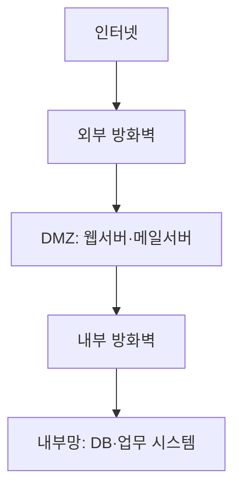
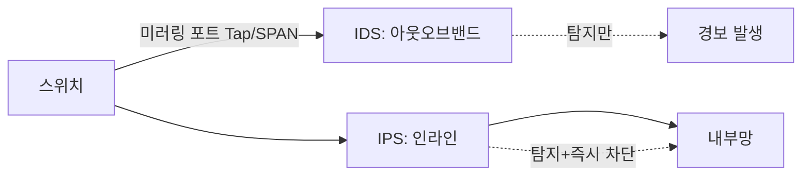
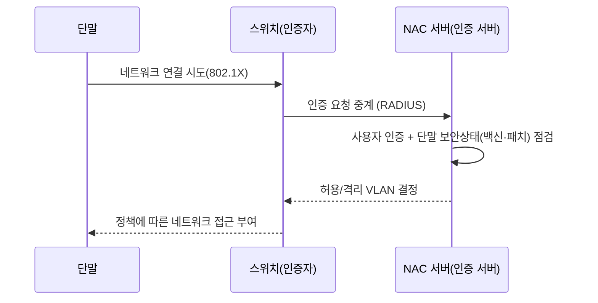
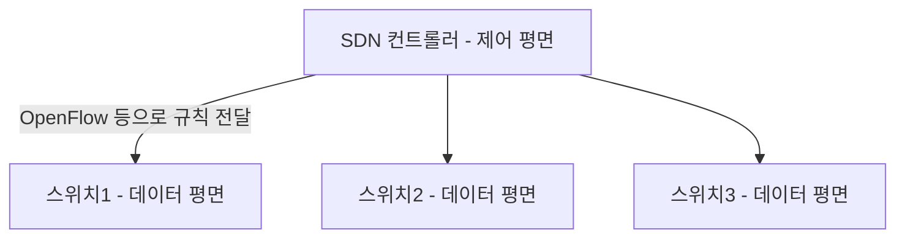
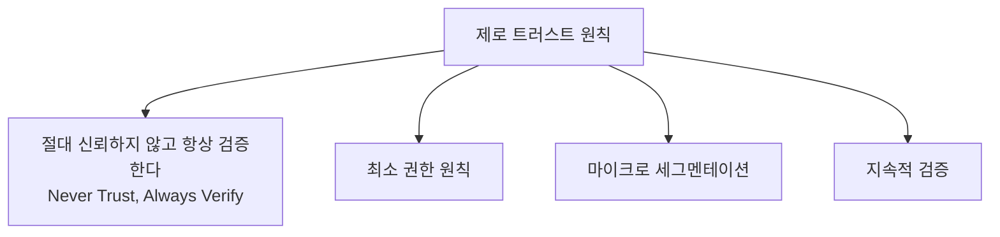

<Callout type="info">
  **이번 문서의 목표:** 방화벽·IDS(Intrusion Detection System)·IPS(Intrusion Prevention System)·NAC(Network Access Control)를 탐지 방식과 네트워크상 배치 위치 기준으로 구분하고, UTM·차세대 방화벽(NGFW)의 차이, SDN/NFV·5G 환경의 새로운 위협, 제로 트러스트(Zero Trust) 아키텍처의 설계 원칙까지 설명할 수 있게 된다.
</Callout>

## 왜 필요한가 — 공격을 알았으니 이제 막을 차례

12편에서 스캐닝·스니핑·스푸핑을, 13편에서 DoS·DDoS를, 14편에서 이를 암호화로 방어하는 TLS·IPSec을 다뤘습니다. 하지만 암호화는 "도청해도 못 읽게" 만들 뿐, 애초에 **악의적인 트래픽이 내 네트워크에 들어오는 것 자체를 걸러내는 장치**는 아닙니다. 이번 편에서 다루는 방화벽·IDS/IPS·NAC은 바로 이 역할, 즉 네트워크 경계와 내부에서 "누구를 들여보내고 무엇을 차단할지" 결정하는 솔루션입니다.

> **쉽게 말하면:** 14편의 암호화가 "대화 내용을 비밀로 하기"라면, 이번 편은 "애초에 수상한 사람을 문 앞에서 막기"입니다.

## 1. 방화벽 — 정책 기반 차단의 기본기

### 방화벽의 세 세대


| 세대 | 방식 | 판단 기준 | 한계 |
|------|------|-----------|------|
| 패킷 필터링(packet filtering) | 각 패킷의 헤더(발신지·목적지 IP, 포트, 프로토콜)만 보고 규칙과 대조 | 빠르고 가벼움 | 세션의 흐름(문맥)을 모름 — 정상 응답 패킷과 위조 패킷을 구분 못함 |
| 상태 기반 검사(stateful inspection) | 연결 상태 테이블을 유지해, "내가 먼저 요청한 연결의 응답인가"를 함께 확인 | 세션 문맥을 반영해 정확도 향상 | 애플리케이션 계층 내용(페이로드)은 못 봄 |
| 애플리케이션 방화벽(application/proxy firewall) | 클라이언트와 서버 사이에 프록시로 개입해 애플리케이션 계층 내용까지 검사 | 특정 프로토콜(HTTP 등)의 명령어·내용 수준까지 통제 가능 | 처리 부하가 크고 프로토콜별 별도 구현 필요 |

**상태 기반 검사가 왜 중요한가 — 13편과 연결:** SYN Flood 방어에서 상태 테이블은 "half-open 연결이 비정상적으로 많다"를 판단하는 근거가 됩니다. 단순 패킷 필터링은 각 SYN 패킷을 개별적으로만 보므로 이런 비정상 누적을 알 수 없습니다.

**iptables로 보는 상태 기반 규칙 예시:**

```bash
# 이미 연결된 세션의 응답 트래픽은 허용 (상태 추적)
iptables -A INPUT -m state --state ESTABLISHED,RELATED -j ACCEPT
# 내부에서 시작한 새 연결만 허용, 외부발 신규 연결은 차단
iptables -A INPUT -p tcp --syn -m state --state NEW -j DROP
```

### 방화벽 배치 위치와 DMZ



**DMZ**(DeMilitarized Zone, 비무장지대)는 외부에 공개해야 하는 서버(웹·메일·DNS)를 내부망과 분리해 배치하는 구간입니다. 외부 방화벽은 인터넷에서 DMZ로의 접근을 제한적으로 허용하고, 내부 방화벽은 DMZ에서 내부망으로의 접근을 훨씬 엄격하게 제한합니다. **왜 이렇게 이중으로 나누는가:** 웹서버 하나가 침해당하더라도(16편에서 다룰 웹 취약점), 공격자가 그 서버를 발판 삼아 곧바로 내부 DB까지 침투하지 못하도록 하는 것이 목적입니다.

## 2. IDS·IPS — 탐지와 차단의 차이

### 탐지 방식

| 방식 | 원리 | 장점 | 단점 |
|------|------|------|------|
| 시그니처 기반(signature-based, 오용탐지) | 알려진 공격 패턴(시그니처)과 트래픽을 대조 | 오탐(false positive)이 적음, 알려진 공격에 정확 | 새로운 공격(제로데이)은 탐지 못함 |
| 이상행위 기반(anomaly-based) | 정상 트래픽의 기준선(baseline)을 학습하고 벗어나는 패턴을 탐지 | 알려지지 않은 새 공격도 탐지 가능 | 오탐이 상대적으로 많음, 기준선 학습이 필요 |

**Snort 시그니처 규칙 예시** (시그니처 기반 IDS의 대표 오픈소스 도구):

```
alert tcp any any -> $HOME_NET 22 (msg:"SSH 무차별 대입 의심"; flags:S; threshold:type threshold, track by_src, count 5, seconds 60; sid:1000001;)
```

**규칙 해석:** 60초 안에 같은 발신지에서 목적지 22번 포트(SSH)로 `SYN` 패킷이 5회 이상 오면 경보를 발생시킵니다. 12편에서 다룬 SSH 무차별 대입(brute force) 공격의 초기 징후를 잡는 규칙입니다.

### IDS와 IPS의 배치 차이



- **IDS**(침입 탐지 시스템)는 네트워크 트래픽을 스위치의 미러링(SPAN/TAP) 포트로 복사해 **아웃오브밴드**(out-of-band)로 분석합니다. 실제 트래픽 경로에 있지 않으므로 IDS 장애가 통신을 막지 않지만, 탐지만 할 뿐 즉시 차단은 못하고 경보만 발생시킵니다.
- **IPS**(침입 방지 시스템)는 트래픽 경로 **인라인**(inline)에 직접 위치해, 공격으로 판단되는 패킷을 그 자리에서 즉시 차단합니다. 실시간 차단이 가능한 대신, IPS 자체에 장애가 생기면 전체 통신이 끊기거나(fail-close) 검사 없이 통과시키는(fail-open) 정책을 미리 정해 둬야 합니다.

**자주 틀리는 점:** "IDS와 IPS는 탐지 알고리즘이 다르다"고 착각하기 쉽지만, 실제로는 **같은 탐지 엔진**(시그니처·이상행위 기반)을 쓸 수 있고 차이는 **배치 위치와 대응**(차단 여부)에 있습니다.

## 3. NAC — 접속 자체를 통제한다

**NAC**(Network Access Control, 네트워크 접근통제)은 IDS/IPS보다 한 단계 앞서, **네트워크에 연결을 허용할지 자체를 결정**하는 솔루션입니다. 사내망 스위치 포트에 노트북을 꽂는 순간부터 통제가 시작됩니다.



**802.1X 기반 인증:** 유·무선 네트워크 접속 시점에 사용자 인증(아이디·인증서)을 요구하는 표준입니다. 인증되지 않은 단말은 아예 네트워크 대역에 IP조차 할당받지 못하거나, 격리된(quarantine) VLAN으로만 연결됩니다.

**포스처 체크(posture check):** 단순히 "누가 접속하는가"뿐 아니라 "그 단말이 안전한 상태인가"(백신 최신 여부, OS 패치 여부, 디스크 암호화 여부)까지 검사해 접근 수준을 다르게 부여합니다.

**NAC과 방화벽·IDS/IPS의 역할 차이:** 방화벽·IDS/IPS는 이미 네트워크에 들어온 트래픽을 검사하지만, NAC은 **애초에 네트워크에 들어올 자격이 있는지**를 접속 시점에 판단합니다. 세 솔루션은 서로 대체 관계가 아니라 **단계적으로 함께 배치**됩니다.

## 4. UTM과 차세대 방화벽(NGFW)

### UTM (Unified Threat Management, 통합 위협 관리)

방화벽·IDS/IPS·안티바이러스·VPN·콘텐츠 필터링 등 여러 보안 기능을 **하나의 장비**에 통합한 솔루션입니다. 중소 규모 조직에서 여러 장비를 따로 도입·운영하는 비용과 복잡도를 줄이는 것이 목적입니다.

### NGFW (Next-Generation Firewall, 차세대 방화벽)

전통적 방화벽이 IP·포트 단위로만 판단했다면, NGFW는 **애플리케이션 단위**로 트래픽을 식별하고 통제합니다.

| 기능 | 설명 |
|------|------|
| DPI(Deep Packet Inspection, 심층 패킷 검사) | 페이로드 내용까지 분석해 포트 번호를 속여도(예: HTTP를 8080이 아닌 443으로 위장) 실제 애플리케이션을 식별 |
| 애플리케이션 인식 | "443번 포트 전체 차단"이 아니라 "같은 443포트라도 특정 SNS 앱만 차단" 같은 세밀한 정책 적용 |
| 통합 위협 인텔리전스 연동 | 알려진 악성 IP·도메인 목록을 실시간으로 갱신받아 반영 |
| SSL 복호화(SSL inspection) | 암호화된 트래픽 내부를 검사하기 위해 방화벽이 중간자 역할로 일시 복호화 후 재암호화 |

**UTM과 NGFW의 관계:** 개념적으로 겹치는 부분이 많아 시험에서는 "UTM은 다기능 통합에, NGFW는 애플리케이션 계층 가시성·제어에 방점이 있다" 정도로 구분하면 충분합니다. 실제 제품들은 이미 두 개념의 기능을 상당 부분 함께 제공합니다.

## 5. SDN/NFV 보안과 5G/6G 신규 위협

### SDN — 제어와 전달을 분리한다

**SDN**(Software Defined Networking, 소프트웨어 정의 네트워킹)은 전통적으로 개별 라우터·스위치 안에 함께 있던 **제어 평면**(control plane)과 **데이터 평면**(data plane)을 분리해, 제어 로직을 중앙의 **SDN 컨트롤러** 소프트웨어로 모으는 구조입니다.



**보안 관점의 새로운 위협:** 제어 로직이 한 곳(컨트롤러)에 집중되므로, **컨트롤러 자체가 단일 장애점이자 최우선 공격 목표**가 됩니다. 컨트롤러가 장악되면 그 아래 모든 스위치의 트래픽 흐름을 공격자가 임의로 바꿀 수 있습니다. 또한 컨트롤러와 스위치 사이의 통신 프로토콜(OpenFlow 등) 자체를 스푸핑·변조하는 공격도 새로운 위협 유형입니다.

### NFV — 네트워크 기능을 가상화한다

**NFV**(Network Functions Virtualization, 네트워크 기능 가상화)는 방화벽·로드밸런서·라우터 같은 전용 하드웨어 장비의 기능을 **가상머신·컨테이너 위의 소프트웨어**(VNF, Virtualized Network Function)로 구현하는 방식입니다.

**보안 관점의 새로운 위협:** 기존에는 물리적으로 분리된 전용 장비였던 것이 이제 **하이퍼바이저 위의 가상 인스턴스**가 되므로, 하이퍼바이저(호스트) 자체가 침해당하면 그 위에서 동작하는 모든 가상 네트워크 기능이 한꺼번에 위협받는 구조적 위험이 생깁니다. 20편에서 다룰 컨테이너·쿠버네티스 보안과 문제의식이 이어집니다.

### 5G/6G 환경의 신규 위협

| 위협 요소 | 내용 |
|-----------|------|
| 네트워크 슬라이싱(network slicing) 보안 | 하나의 물리 인프라를 논리적으로 여러 개(슬라이스)로 나눠 서로 다른 서비스(자율주행·일반통신 등)에 할당하는데, 슬라이스 간 격리가 완벽하지 않으면 한 슬라이스의 침해가 다른 슬라이스로 번질 위험 |
| 초연결 IoT 공격면 확대 | 5G가 지원하는 대규모 기기 연결(massive IoT) 자체가 13편에서 본 미라이류 봇넷의 잠재적 공격면을 기하급수적으로 늘림 |
| 엣지 컴퓨팅(edge computing) 보안 | 연산이 중앙 데이터센터가 아닌 기지국 인근의 엣지 노드로 분산되면서, 물리적으로 접근하기 쉬운 다수의 엣지 노드 각각이 새로운 침투 지점이 됨 |
| SDN/NFV 기반 코어망 | 5G 코어망 자체가 SDN/NFV로 구현되어, 위에서 설명한 컨트롤러·하이퍼바이저 집중형 위험이 이동통신 인프라 전체로 확장됨 |

## 6. 제로 트러스트(Zero Trust) 네트워크 아키텍처

### 기존 경계 기반 보안의 한계

전통적인 보안 모델은 "내부망은 신뢰하고 외부는 의심한다"는 **경계 기반(perimeter-based)** 사고에 기반합니다. 방화벽으로 경계를 세우고, 그 안에만 들어오면 비교적 자유롭게 이동할 수 있게 하는 구조입니다. 문제는 VPN 계정 탈취나 내부자 위협처럼 **경계 안쪽에서 시작되는 공격**에는 이 모델이 무력하다는 점입니다. 한번 내부망에 들어온 공격자는 상대적으로 느슨한 통제 속에서 옆으로 이동(lateral movement)하며 피해를 확산시킬 수 있습니다.

> **쉽게 말하면:** 기존 방식이 "성문만 지키면 성 안은 안전하다"라면, 제로 트러스트는 "성 안에 들어와도 방마다 다시 신분증을 확인한다"입니다.

### 제로 트러스트의 핵심 원칙



- **절대 신뢰하지 않고 항상 검증한다:** 네트워크 위치(사내망인지 외부인지)와 무관하게, 모든 접근 요청을 매번 인증·인가한다.
- **최소 권한 원칙(least privilege):** 사용자·서비스에 업무 수행에 꼭 필요한 최소한의 권한만 부여한다(22편에서 자세히 다룹니다).
- **마이크로 세그멘테이션(micro-segmentation):** 네트워크를 큰 단위(DMZ, 내부망)로만 나누는 게 아니라, 애플리케이션·워크로드 단위로 잘게 나눠 서로 간의 통신도 명시적으로 허용된 것만 통과시킨다. 공격자가 한 구획에 침투해도 다른 구획으로의 확산을 차단한다.
- **지속적 검증(continuous verification):** 로그인 시점 한 번만 인증하는 게 아니라, 세션 도중에도 사용자 행위·단말 상태·위치 등을 지속적으로 재평가해 이상 징후가 있으면 즉시 접근을 재차단한다.

### 제로 트러스트와 이 편의 다른 솔루션의 관계

제로 트러스트는 특정 제품이 아니라 **아키텍처 철학**입니다. 실제 구현에는 이 편에서 다룬 NAC(접속 시점 검증), SSL VPN(14편, 애플리케이션 단위 접근), NGFW(애플리케이션 계층 가시성), 그리고 다중요소 인증(21편)이 조합됩니다. 미국 국립표준기술연구소(NIST)의 SP 800-207 문서가 제로 트러스트 아키텍처의 표준 참고 모델로 널리 인용됩니다.

**자주 틀리는 점:** "제로 트러스트를 도입하면 방화벽이 필요 없다"는 것은 오해입니다. 제로 트러스트는 경계 방어를 **대체**하는 것이 아니라, 경계 안쪽에서도 동일한 수준의 검증을 추가로 요구해 **심층 방어**(defense in depth)를 강화하는 접근입니다.

## 핵심 정리

- 방화벽은 **패킷 필터링 → 상태 기반 검사 → 애플리케이션 방화벽** 순으로 발전했으며, DMZ는 외부 공개 서버와 내부망을 분리해 침해 확산을 막는 구간이다.
- IDS·IPS는 **시그니처 기반**(알려진 패턴)과 **이상행위 기반**(기준선 이탈) 탐지 방식을 쓸 수 있으며, 핵심 차이는 탐지 알고리즘이 아니라 **IDS는 아웃오브밴드 탐지, IPS는 인라인 즉시 차단**이라는 배치·대응 방식이다.
- NAC은 802.1X와 포스처 체크로 **접속 자체를 허용할지**를 판단하며, 방화벽·IDS/IPS와 단계적으로 함께 배치된다.
- UTM은 여러 보안 기능의 **통합**에, NGFW는 DPI 기반 **애플리케이션 계층 가시성·제어**에 초점이 있다.
- SDN은 제어·데이터 평면을 분리해 컨트롤러가 단일 장애점이 되고, NFV는 하이퍼바이저 침해가 다수 가상 네트워크 기능에 영향을 주며, 5G/6G는 네트워크 슬라이싱·초연결 IoT·엣지 컴퓨팅이라는 새로운 공격면을 만든다.
- 제로 트러스트는 "절대 신뢰하지 않고 항상 검증한다"는 원칙 아래 **최소 권한·마이크로 세그멘테이션·지속적 검증**을 결합한 아키텍처로, 경계 방어를 대체하는 것이 아니라 보완한다.

## 마무리 복습

<Quiz
  questionNumber={1}
  question="상태 기반 검사(stateful inspection) 방화벽이 패킷 필터링 방화벽보다 정확한 이유로 가장 적절한 것은?"
  options={['암호화된 트래픽까지 모두 복호화해서 검사하기 때문이다', '연결 상태 테이블을 유지해 패킷이 기존 세션의 정상 응답인지 문맥을 확인하기 때문이다', '모든 트래픽을 무조건 차단하기 때문이다', '패킷의 페이로드 내용을 애플리케이션 수준까지 분석하기 때문이다']}
  correctAnswer={2}
  explanation="상태 기반 검사는 연결 상태 테이블을 유지해 들어오는 패킷이 자신이 먼저 시작한 연결에 대한 정상 응답인지 문맥을 확인함으로써, 헤더 정보만 보는 패킷 필터링보다 정확하게 판단한다."
  optionExplanations={['SSL 복호화 검사는 NGFW의 별도 기능이며 상태 기반 검사의 핵심은 아니다.', '연결 상태 테이블을 통한 문맥 확인이 정확도 향상의 핵심 이유다.', '모든 트래픽 차단은 방화벽의 기본 동작 목적과 맞지 않는다.', '페이로드 내용 분석은 애플리케이션 방화벽의 특징이다.']}
/>

<Quiz
  questionNumber={2}
  question="IDS와 IPS의 가장 근본적인 차이로 가장 적절한 것은?"
  options={['IDS는 시그니처 기반, IPS는 이상행위 기반 탐지만 사용한다', 'IDS는 아웃오브밴드로 탐지만 하고, IPS는 인라인에 위치해 즉시 차단까지 수행한다', 'IDS는 방화벽의 하위 기능이고 IPS는 완전히 별개의 장비다', 'IPS는 무선 네트워크에서만 동작한다']}
  correctAnswer={2}
  explanation="IDS와 IPS는 같은 탐지 엔진을 쓸 수 있으며, 핵심 차이는 IDS가 미러링 포트를 통해 아웃오브밴드로 트래픽을 분석해 경보만 발생시키는 반면 IPS는 트래픽 경로에 직접 위치해 공격으로 판단된 패킷을 즉시 차단한다는 배치와 대응 방식의 차이다."
  optionExplanations={['탐지 방식은 두 시스템 모두 시그니처·이상행위 기반을 혼용할 수 있다.', '아웃오브밴드 탐지와 인라인 즉시 차단이라는 배치·대응의 차이가 핵심이다.', '방화벽과의 계층 관계에 대한 설명이 아니라 배치 위치의 차이가 핵심이다.', '유무선 여부와는 무관한 개념이다.']}
/>

<Quiz
  questionNumber={3}
  question="NAC(네트워크 접근통제)의 역할로 가장 적절한 것은?"
  options={['이미 네트워크에 진입한 트래픽의 페이로드 내용을 분석해 공격을 차단한다', '네트워크 접속 시점에 사용자 인증과 단말의 보안 상태를 확인해 접근 허용 여부를 결정한다', '외부에서 내부로 들어오는 트래픽의 포트 번호만 확인해 차단 여부를 결정한다', '암호화된 세션 키를 생성해 통신 내용을 보호한다']}
  correctAnswer={2}
  explanation="NAC은 802.1X 등을 통해 네트워크에 연결하려는 시점에 사용자 인증과 단말의 보안 상태(백신, 패치 여부 등)를 점검해 접근을 허용할지, 격리할지를 결정하는 접속 시점 통제 솔루션이다."
  optionExplanations={['이는 IDS/IPS의 역할에 해당한다.', '접속 시점의 인증과 단말 상태 점검이 NAC의 정확한 역할이다.', '포트 기반 차단은 전통적 방화벽의 기본 동작이다.', '세션 키 생성은 TLS 같은 암호 프로토콜의 역할이다.']}
/>

<Quiz
  questionNumber={4}
  question="차세대 방화벽(NGFW)이 전통적 방화벽과 구별되는 특징으로 가장 적절한 것은?"
  options={['IP 주소와 포트 번호만으로 트래픽을 판단한다', '심층 패킷 검사(DPI)로 페이로드를 분석해 애플리케이션 단위로 트래픽을 식별·통제한다', '연결 상태를 전혀 추적하지 않는다', '물리적으로 네트워크 케이블을 절단하는 방식으로 차단한다']}
  correctAnswer={2}
  explanation="NGFW는 심층 패킷 검사를 통해 포트 번호를 속이더라도 실제 애플리케이션을 식별할 수 있으며, 같은 포트를 쓰는 트래픽이라도 특정 애플리케이션 단위로 세밀하게 정책을 적용할 수 있다."
  optionExplanations={['이는 1세대 패킷 필터링 방화벽의 특징이다.', 'DPI 기반 애플리케이션 식별이 NGFW의 핵심 차별점이다.', 'NGFW는 상태 기반 검사 기능도 포함한다.', '물리적 차단은 방화벽의 동작 방식이 아니다.']}
/>

<Quiz
  questionNumber={5}
  question="SDN(소프트웨어 정의 네트워킹) 환경에서 보안상 가장 우려되는 지점은?"
  options={['각 스위치에 개별적으로 저장된 방화벽 규칙', '제어 평면과 데이터 평면이 분리되면서 집중된 SDN 컨트롤러', '스위치 하드웨어의 전력 소비량', '데이터 평면 스위치의 케이블 길이']}
  correctAnswer={2}
  explanation="SDN은 제어 로직을 중앙의 컨트롤러로 집중시키므로, 컨트롤러가 장악되면 그 아래 모든 스위치의 트래픽 흐름을 공격자가 임의로 조작할 수 있는 단일 장애점이자 최우선 공격 목표가 된다."
  optionExplanations={['SDN에서는 규칙이 개별 스위치가 아닌 중앙 컨트롤러에서 관리된다.', '중앙집중된 컨트롤러가 SDN의 핵심 보안 우려 지점이다.', '전력 소비는 보안과 직접적인 관련이 없다.', '케이블 길이는 보안 위협 요소가 아니다.']}
/>

<Quiz
  questionNumber={6}
  question="제로 트러스트 아키텍처의 원칙으로 옳지 않은 것은?"
  options={['네트워크 위치와 무관하게 모든 접근 요청을 매번 검증한다', '한번 내부망에 접속하면 이후에는 별도 재검증 없이 자유롭게 이동을 허용한다', '업무 수행에 필요한 최소한의 권한만 부여한다', '워크로드 단위로 네트워크를 세분화해 침해 확산을 제한한다']}
  correctAnswer={2}
  explanation="제로 트러스트는 지속적 검증을 원칙으로 하므로 한번 접속했다고 이후 재검증 없이 자유로운 이동을 허용하지 않는다. 오히려 세션 도중에도 지속적으로 재평가해 이상 징후가 있으면 접근을 재차단하는 것이 핵심 원칙이다."
  optionExplanations={['절대 신뢰하지 않고 항상 검증한다는 제로 트러스트의 핵심 원칙이다.', '지속적 검증 없는 자유로운 이동 허용은 제로 트러스트 원칙에 어긋난다.', '최소 권한 원칙은 제로 트러스트의 핵심 요소다.', '마이크로 세그멘테이션은 제로 트러스트의 핵심 요소다.']}
/>

<Quiz
  questionNumber={7}
  question="5G 네트워크의 네트워크 슬라이싱(network slicing)과 관련된 보안 이슈로 가장 적절한 것은?"
  options={['슬라이스 간 격리가 불완전하면 한 슬라이스의 침해가 다른 슬라이스로 확산될 수 있다', '슬라이싱은 물리적으로 완전히 분리된 별도의 케이블을 사용하므로 보안 이슈가 존재하지 않는다', '슬라이싱은 암호화 알고리즘의 일종이다', '슬라이싱은 DNS 캐시를 조작하는 기법이다']}
  correctAnswer={1}
  explanation="네트워크 슬라이싱은 하나의 물리 인프라를 논리적으로 여러 슬라이스로 나누는 것이므로, 슬라이스 간 논리적 격리가 완벽하지 않으면 한 슬라이스에서 발생한 침해가 다른 슬라이스로 번질 위험이 있다."
  optionExplanations={['물리적으로 분리되지 않은 논리적 분할이므로 격리 실패 시 보안 이슈가 발생할 수 있다.', '슬라이싱은 물리 인프라를 논리적으로 나누는 것이지 별도 케이블을 쓰는 것이 아니다.', '암호화 알고리즘이 아니라 네트워크 자원 분할 기술이다.', 'DNS 조작과는 무관한 개념이다.']}
/>

## 참고 자료

- [itwiki - 정보보안기사 필기 출제기준](https://itwiki.kr/w/정보보안기사_필기_출제기준)
- [KISA 보호나라 - 사이버 위협 동향](https://www.krcert.or.kr/)
- [NIST Special Publication 800-207 - Zero Trust Architecture](https://csrc.nist.gov/pubs/sp/800/207/final)
- [Cloudflare Learning - What is Zero Trust](https://www.cloudflare.com/learning/security/glossary/what-is-zero-trust/)
