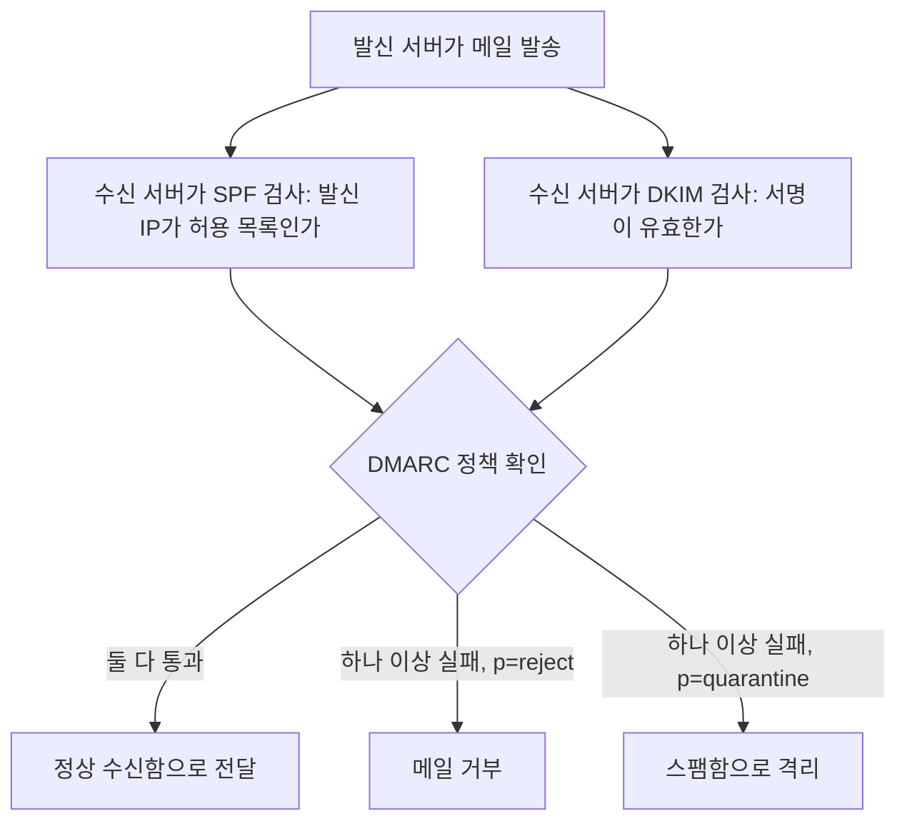
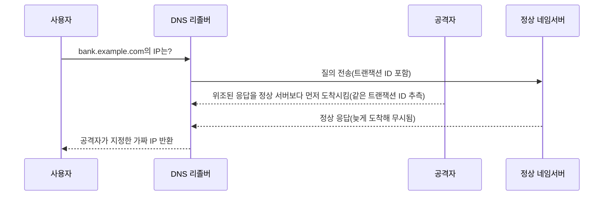
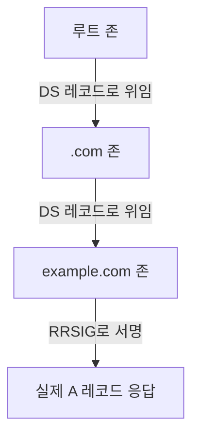

<Callout type="info">
  **이번 문서의 목표:** FTP가 왜 평문 전송으로 취약한지 설명하고 SFTP·FTPS로 대체하는 기준을 세우며, SPF·DKIM·DMARC 레코드를 직접 읽고 DNS 캐시 포이즈닝을 DNSSEC이 어떻게 막는지 설명할 수 있게 된다.
</Callout>

## FTP의 구조와 평문 전송 문제

### 왜 FTP가 문제인가

**파일 전송 프로토콜**(FTP, File Transfer Protocol)은 1970년대에 설계된 오래된 프로토콜입니다. 11편에서 다룬 well-known 포트 중 21번(제어 채널)과 20번(데이터 채널, 액티브 모드 기준)을 사용합니다. 문제는 설계 당시 암호화라는 개념 자체가 지금처럼 당연하지 않았다는 점입니다. 아이디, 비밀번호, 파일 내용이 모두 **암호화되지 않은 평문**(plaintext)으로 네트워크를 오갑니다.

> **쉽게 말하면:** FTP로 로그인하는 것은 우편엽서에 비밀번호를 적어 보내는 것과 같습니다. 중간에서 엽서를 슬쩍 보는 사람이 있으면 그대로 다 보입니다.

### 패킷으로 직접 확인하기

12편에서 다룬 스니핑(sniffing) 도구인 와이어샤크(Wireshark)로 FTP 로그인 구간을 캡처하면 다음과 같은 평문이 그대로 보입니다.

```text
USER admin
331 Password required for admin.
PASS Summer2024!
230 User admin logged in.
```

`USER`와 `PASS` 명령 뒤에 아이디와 비밀번호가 암호화 없이 그대로 적혀 있습니다. 같은 네트워크 구간(예: 공용 와이파이, 스위치 허브)에 있는 공격자가 이 패킷을 가로채면 로그인 정보를 그대로 얻습니다. 액티브 모드(active mode)에서는 서버가 클라이언트의 임의 포트로 역접속해 데이터 채널을 열기 때문에 방화벽 정책이 복잡해지고, 패시브 모드(passive mode)에서는 클라이언트가 서버가 알려 준 임의 포트로 접속해 방화벽 설정이 상대적으로 단순하다는 차이도 시험에 자주 나옵니다.

### 대안: SFTP와 FTPS

| 구분 | SFTP(SSH File Transfer Protocol) | FTPS(FTP over SSL/TLS) |
|------|------------------------------------|--------------------------|
| 기반 프로토콜 | SSH(Secure Shell) 위에서 동작 | 기존 FTP에 TLS(Transport Layer Security) 계층을 추가 |
| 포트 | 22 (SSH 포트 하나로 제어·데이터 모두 처리) | 990(암묵적 방식) 또는 21(명시적 방식, `AUTH TLS` 명령으로 전환) |
| 암호화 범위 | 인증·명령·데이터 전부 암호화 | 인증·명령·데이터 전부 암호화(단, 명시적 방식은 초기 협상 일부가 평문일 수 있음) |
| 방화벽 친화성 | 포트 하나만 열면 되어 상대적으로 단순 | 액티브·패시브 모드 문제가 FTP와 유사하게 남음 |
| 표준화 주체 | IETF(인터넷 엔지니어링 태스크포스)의 SSH 확장 | FTP 명령어에 보안 계층을 확장한 방식 |

**함정 문제:** SFTP를 "SSL 기반 FTP"로 잘못 외우는 경우가 많습니다. 이름이 비슷해 보이지만 SFTP는 **SSH** 기반이고 FTPS가 **SSL/TLS** 기반입니다. SSH 서버(포트 22)가 이미 열려 있는 환경이라면 별도 포트 없이 SFTP를 바로 활용할 수 있다는 점도 실무에서 SFTP를 선호하는 이유입니다.

## 메일 보안 — 발신자를 어떻게 믿을 것인가

### 메일 프로토콜과 헤더 구조

메일 시스템은 발신 서버 간 전달에 **SMTP**(Simple Mail Transfer Protocol, 포트 25 또는 제출용 587), 수신자가 메일을 가져올 때 **POP3**(포트 110, 다운로드 후 서버에서 삭제하는 방식)나 **IMAP**(포트 143, 서버에 메일을 두고 여러 기기에서 동기화하는 방식)을 씁니다.

SMTP의 근본 문제는 설계 당시 **발신자 확인 절차가 없다**는 점입니다. 이메일의 발신자(From) 주소는 우편봉투에 보내는 사람 이름을 손으로 적는 것과 비슷해서, 받는 서버 입장에서는 그 이름이 진짜인지 검증할 방법이 원래는 없었습니다. 이 허점을 이용한 것이 **피싱**(phishing, 신뢰할 만한 발신자로 속여 정보를 탈취)과 **스피어피싱**(spear phishing, 특정 인물·조직을 표적으로 정교하게 설계한 피싱), 그리고 임원이나 거래처를 사칭해 송금을 유도하는 **비즈니스 이메일 침해**(BEC, Business Email Compromise)입니다.

> **쉽게 말하면:** 발신자 인증이 없던 시절의 이메일은 "누구나 남의 이름으로 편지를 쓸 수 있는 우체국"과 같았습니다. SPF·DKIM·DMARC는 이 우체국에 신분증 검사를 도입한 것입니다.

### SPF — 이 IP가 보낼 자격이 있는가

**SPF**(Sender Policy Framework, 발신자 정책 프레임워크)는 도메인 소유자가 "우리 도메인 이름으로 메일을 보낼 자격이 있는 서버는 이 목록뿐이다"를 DNS에 TXT 레코드로 공표하는 방식입니다.

```text
example.com.  TXT  "v=spf1 ip4:203.0.113.10 include:_spf.google.com -all"
```

- `v=spf1`: SPF 버전 1이라는 표시
- `ip4:203.0.113.10`: 이 IPv4 주소가 발송을 허용된 서버
- `include:_spf.google.com`: 구글 워크스페이스 같은 위탁 발송 서비스도 허용 목록에 포함
- `-all`: 위 목록에 없는 나머지 모든 서버는 발송 실패로 처리(하드 실패, hard fail)

수신 서버는 메일이 도착하면 봉투 발신자(Envelope From) 주소의 도메인에 대해 이 TXT 레코드를 조회하고, 실제로 메일을 보낸 서버의 IP가 목록에 있는지 대조합니다. 없으면 SPF 검증에 실패합니다.

**SPF의 한계:** 메일이 전달(forwarding)될 때 원래 IP가 아니라 중계 서버의 IP로 보이게 되어 정상 메일인데도 검증에 실패하는 경우가 있습니다. 또한 사용자가 화면에서 보는 표시 발신자(Header From)가 아니라 봉투 발신자만 검사하므로, 표시 발신자를 위조하는 공격까지는 막지 못합니다.

### DKIM — 메일 내용이 위조되지 않았는가

**DKIM**(DomainKeys Identified Mail)은 메일 내용에 발신 서버의 **전자서명**(24편에서 다룰 공개키 기반 서명 원리와 동일한 구조)을 붙이는 방식입니다. 발신 서버가 개인키로 메일 헤더 일부와 본문의 해시값에 서명하고, 그 공개키를 DNS TXT 레코드로 공개해 둡니다.

```text
selector1._domainkey.example.com.  TXT  "v=DKIM1; k=rsa; p=MIGfMA0GCSq..."
```

메일 헤더에는 다음과 같은 서명값이 붙어서 전달됩니다.

```text
DKIM-Signature: v=1; a=rsa-sha256; d=example.com; s=selector1;
  h=from:to:subject:date; bh=2jUSOH9NhtVGCQWNr9BrIAPreKQjO6Sn7XIkfJVOzv8=;
  b=AuUoFEfDxTDkHlLXSZEpZj79LICEps6eda7W3deTVFOk4yAUoqOB4nujc7YopdG5dWLSdNg6xNAZpOPr+kHxt1IF0d/hRBIvNvKSABzeu+Uf1WwNlqvpKrsRfhzBIWWyKX9Cgd...
```

수신 서버는 `d=example.com`(서명한 도메인)과 `s=selector1`(키를 찾을 서브도메인 표시)을 이용해 위 TXT 레코드의 공개키를 조회하고, 서명값을 검증합니다. 검증에 성공하면 "이 메일은 정말 example.com이 서명했고, 서명 이후 내용이 바뀌지 않았다"는 두 가지가 동시에 증명됩니다.

**SPF와의 차이:** SPF는 "어느 서버가 보냈는가"(경로)를 확인하고, DKIM은 "내용이 변조되지 않았는가"(무결성)를 확인합니다. 서로 다른 것을 검증하므로 둘 다 설정하는 것이 원칙입니다.

### DMARC — SPF·DKIM 결과를 어떻게 처리할지 정하는 정책

**DMARC**(Domain-based Message Authentication, Reporting and Conformance)는 SPF와 DKIM 검증이 실패했을 때 수신 서버가 그 메일을 **어떻게 처리할지**를 발신 도메인이 직접 지정하는 정책입니다.

```text
_dmarc.example.com.  TXT  "v=DMARC1; p=reject; rua=mailto:report@example.com; pct=100"
```

- `p=reject`: SPF와 DKIM 검증에 실패한 메일을 아예 거부
- `p=quarantine`: 검증 실패 메일을 스팸함으로 격리
- `p=none`: 아무 조치 없이 통과시키되 결과만 수집(도입 초기 관찰 단계에서 사용)
- `rua=mailto:...`: 집계 보고서를 받을 주소
- `pct=100`: 이 정책을 전체 메일의 100퍼센트에 적용

세 기술의 관계를 흐름으로 보면 이렇습니다.



**정보보안기사 시험에서 자주 나오는 정리:** SPF는 IP 기반 경로 인증, DKIM은 서명 기반 무결성 인증, DMARC는 앞의 두 결과를 종합해 처리 정책을 정하고 보고서까지 받는 상위 프레임워크입니다. 셋 중 하나만 적용하면 우회 여지가 남고, 세 가지를 함께 적용해야 표시 발신자 위조까지 실질적으로 방어됩니다.

## DNS 보안 — 이름 해석 자체를 속이는 공격

### 캐시 포이즈닝의 원리

03편에서 DNS(Domain Name System)가 도메인 이름을 IP 주소로 바꿔 준다는 기본 개념을 다뤘습니다. 이 과정에서 매번 최상위 서버부터 다시 조회하면 느리므로, **DNS 리졸버**(resolver, 조회를 대행하는 서버)는 한 번 받은 응답을 일정 시간(TTL, Time To Live) 동안 **캐시**에 저장해 재사용합니다.

**DNS 캐시 포이즈닝**(DNS cache poisoning)은 이 캐시에 조작된 응답을 몰래 주입해, 정상 도메인을 조회했는데 공격자가 지정한 가짜 IP를 돌려받게 만드는 공격입니다.

> **쉽게 말하면:** 캐시 포이즈닝은 동네 우체국(리졸버)의 주소록에 몰래 가짜 주소를 끼워 넣는 것입니다. 그 뒤로는 누가 그 이름으로 편지를 보내 달라고 해도 우체국이 가짜 주소로 보내 줍니다.

**동작 절차:**



핵심은 **정상 응답보다 위조된 응답을 먼저 도착시키는 경쟁**입니다. 공격자는 리졸버가 보낸 질의의 트랜잭션 ID(질문과 응답을 짝짓는 식별 번호)와 출발 포트 번호를 추측해서 위조 응답을 대량으로 쏟아붓습니다. 옛날 DNS 소프트웨어는 트랜잭션 ID의 범위가 좁고 출발 포트도 고정적이어서 추측이 쉬웠습니다. 이 취약점이 널리 알려진 이후로는 트랜잭션 ID를 무작위화하고 출발 포트도 매번 무작위로 바꾸는 방식(소스 포트 랜덤화)으로 완화하지만, 근본적인 해결책은 아래의 DNSSEC입니다.

**DNS 스푸핑과의 관계:** 12편에서 다룬 DNS 스푸핑(spoofing)은 넓은 의미로 "가짜 DNS 응답으로 속인다"는 개념 전체를 가리키고, 캐시 포이즈닝은 그중에서도 **리졸버의 캐시에 가짜 정보를 지속적으로 남겨서** 이후의 모든 사용자가 영향을 받게 만드는 구체적인 기법입니다. ARP 스푸핑이 로컬 네트워크 안에서 특정 통신 하나를 가로채는 것과 달리, 캐시 포이즈닝은 그 리졸버를 사용하는 **모든 사용자**에게 피해가 퍼진다는 점에서 파급력이 훨씬 큽니다.

### DNSSEC — 응답에 서명을 붙이다

**DNSSEC**(DNS Security Extensions, DNS 보안 확장)은 DNS 응답에 전자서명을 붙여, 리졸버가 그 응답이 진짜 네임서버에서 나왔고 중간에 변조되지 않았는지 검증할 수 있게 하는 확장 표준입니다.

| 레코드 | 역할 |
|--------|------|
| RRSIG(Resource Record Signature) | 특정 레코드 집합에 대한 전자서명 값 |
| DNSKEY | 서명을 검증할 공개키 |
| DS(Delegation Signer) | 하위 도메인의 DNSKEY가 진짜임을 상위 도메인이 보증하는 해시값 |
| NSEC / NSEC3 | 존재하지 않는 도메인에 대해 "없다"는 사실도 위조 없이 증명 |

**체인 오브 트러스트**(chain of trust)의 흐름은 다음과 같습니다.



루트 존이 `.com` 존의 공개키를 보증하는 DS 레코드를 갖고, `.com` 존은 다시 `example.com` 존의 공개키를 보증하는 방식으로 신뢰가 사슬처럼 이어집니다. 리졸버는 이 사슬을 루트부터 따라 내려가며 각 단계의 서명을 검증하기 때문에, 공격자가 중간에 위조 응답을 끼워 넣어도 서명이 맞지 않아 거부됩니다.

**자주 틀리는 점:** DNSSEC은 응답의 **위조 여부**를 검증하는 것이지, 통신 구간을 **암호화**하는 기술이 아닙니다. 질의와 응답 내용 자체는 여전히 평문으로 오가며, 제3자가 "누가 어떤 도메인을 조회했는지" 엿보는 것은 DNSSEC만으로는 막지 못합니다. 이 프라이버시 문제를 다루는 것은 DNS 자체를 TLS로 감싸는 별도 방식(DoT, DoH)의 영역입니다.

## 최신 사례로 보는 위협 동향

KISA 보호나라·KrCERT/CC의 사이버 위협 동향 자료에 따르면, 최근 몇 년간 국내에서도 정상 기업을 사칭한 피싱 메일에 실제 청구서나 계약서 형식의 문서를 첨부해 첨부파일 실행을 유도하는 사례, 그리고 SPF·DKIM 설정이 안 된 중소기업 도메인을 사칭한 스피어피싱으로 거래 대금을 가로채는 비즈니스 이메일 침해(BEC) 사례가 꾸준히 보고되고 있습니다. 이런 사고 이후 대응 조치의 첫 번째로 항상 등장하는 것이 "발신 도메인에 SPF·DKIM·DMARC를 제대로 설정했는가" 점검이라는 점에서, 이 세 가지 설정이 더 이상 선택이 아니라 기본값이 되어야 한다는 흐름을 보여 줍니다.

## 핵심 정리

- FTP는 아이디·비밀번호·파일 내용을 모두 평문으로 전송하는 오래된 프로토콜이며, SSH 기반인 **SFTP**(포트 22)나 TLS 기반인 **FTPS**(포트 990 또는 21)로 대체해야 한다.
- SMTP는 원래 발신자 확인 절차가 없어 피싱·스피어피싱·비즈니스 이메일 침해(BEC)에 취약하며, 이를 보완하는 것이 SPF·DKIM·DMARC 3종이다.
- **SPF**는 허용된 발신 IP를 TXT 레코드로 공표해 경로를 검증하고, **DKIM**은 전자서명으로 내용 변조 여부를 검증하며, **DMARC**는 두 결과를 종합해 실패 시 처리 정책(격리·거부)과 보고서 수집을 정한다.
- **DNS 캐시 포이즈닝**은 리졸버의 캐시에 위조된 응답을 먼저 주입해, 그 리졸버를 쓰는 모든 사용자를 가짜 IP로 유도하는 공격이다.
- **DNSSEC**은 RRSIG·DNSKEY·DS 레코드로 이어지는 체인 오브 트러스트를 통해 DNS 응답의 위조 여부를 검증하지만, 통신 구간을 암호화하지는 않는다.

## 마무리 복습

<Quiz
  questionNumber={1}
  question="FTP의 보안 문제와 대안에 대한 설명으로 옳은 것은?"
  options={['FTP는 기본적으로 아이디와 비밀번호를 암호화해서 전송한다', 'SFTP는 SSL/TLS를 기반으로 하고 FTPS는 SSH를 기반으로 한다', 'FTP는 인증 정보와 파일 내용을 평문으로 전송하므로 SFTP나 FTPS로 대체해야 한다', 'FTPS는 암호화를 지원하지 않는 단순 파일 전송 방식이다']}
  correctAnswer={3}
  explanation="FTP는 설계 당시 암호화 개념이 없어 USER, PASS 명령과 파일 데이터가 모두 평문으로 전송된다. 이를 보완하기 위해 SSH 기반의 SFTP나 TLS 기반의 FTPS로 대체하는 것이 실무 대응이다."
  optionExplanations={['FTP는 평문 전송이 근본 문제이며 기본적으로 암호화하지 않는다.', 'SFTP가 SSH 기반이고 FTPS가 SSL/TLS 기반이므로 설명이 반대다.', '평문 전송 문제와 그 대안을 정확히 설명했다.', 'FTPS는 TLS 계층을 추가해 암호화를 지원하는 방식이다.']}
/>

<Quiz
  questionNumber={2}
  question="다음 SPF 레코드에서 -all이 의미하는 바로 가장 적절한 것은? v=spf1 ip4:203.0.113.10 include:_spf.google.com -all"
  options={['목록에 없는 서버가 보낸 메일도 조건 없이 통과시킨다', '목록에 있는 IP만 허용하고 나머지는 발송 실패로 처리한다', 'DKIM 서명을 자동으로 생성한다', 'DMARC 정책을 대신 정의한다']}
  correctAnswer={2}
  explanation="-all은 하드 실패(hard fail)를 의미하며, ip4와 include로 명시된 서버 외의 나머지 모든 발신 서버는 SPF 검증에 실패하도록 처리한다."
  optionExplanations={['하드 실패 지시자이므로 오히려 통과시키지 않는다.', 'ip4와 include 목록 외 나머지를 실패 처리한다는 뜻으로 정확한 설명이다.', 'SPF는 발신 IP를 검증할 뿐 서명 생성과는 무관하다.', 'DMARC는 별도의 TXT 레코드로 정의되며 SPF 레코드와는 다른 항목이다.']}
/>

<Quiz
  questionNumber={3}
  question="SPF와 DKIM의 역할 차이를 가장 정확하게 설명한 것은?"
  options={['SPF는 메일 내용의 변조 여부를 확인하고 DKIM은 발신 IP를 확인한다', 'SPF는 발신 서버의 IP 경로를 확인하고 DKIM은 전자서명으로 내용 변조 여부를 확인한다', 'SPF와 DKIM은 동일한 정보를 서로 다른 형식으로 중복 검증한다', 'DKIM은 DMARC 정책 실패 시 대신 메일을 거부하는 기능이다']}
  correctAnswer={2}
  explanation="SPF는 허용된 발신 IP 목록과 실제 발신 서버 IP를 대조해 경로를 검증하고, DKIM은 개인키로 생성한 전자서명을 공개키로 검증해 메일 내용이 서명 이후 변조되지 않았음을 확인한다. 두 검증 대상이 서로 다르다."
  optionExplanations={['SPF와 DKIM의 역할이 서로 뒤바뀐 설명이다.', '경로 검증과 무결성 검증이라는 서로 다른 목적을 정확히 구분했다.', '검증 대상 자체가 IP와 서명으로 서로 다르므로 중복이 아니다.', '메일 거부 정책을 실행하는 것은 DMARC의 역할이다.']}
/>

<Quiz
  questionNumber={4}
  question="DMARC 정책 p=reject의 동작으로 가장 적절한 것은?"
  options={['SPF와 DKIM 검증에 실패한 메일을 스팸함으로 격리한다', 'SPF와 DKIM 검증에 실패한 메일을 수신 서버가 거부한다', '모든 메일을 검증 없이 수신함으로 전달한다', '발신 서버의 IP 주소를 자동으로 차단 목록에 추가한다']}
  correctAnswer={2}
  explanation="p=reject는 SPF와 DKIM 검증에 실패한 메일을 수신 서버가 아예 거부하도록 지시하는 가장 강한 DMARC 정책이다. 격리만 하는 것은 p=quarantine이다."
  optionExplanations={['격리 처리는 p=quarantine 정책의 동작이다.', '검증 실패 메일을 거부한다는 것이 reject 정책의 정확한 의미다.', 'p=none 정책이 관찰만 하고 통과시키는 방식에 가깝다.', 'DMARC는 메일 처리 정책을 정할 뿐 IP 차단 목록을 직접 관리하지 않는다.']}
/>

<Quiz
  questionNumber={5}
  question="DNS 캐시 포이즈닝 공격의 성립 조건으로 가장 적절한 것은?"
  options={['공격자가 대상 리졸버의 관리자 비밀번호를 알아야 한다', '위조된 응답이 정상 네임서버의 응답보다 먼저 리졸버에 도착하고 트랜잭션 ID 등이 일치해야 한다', 'TTL 값이 0으로 설정되어 있어야만 가능하다', '피해자가 악성 파일을 직접 실행해야 한다']}
  correctAnswer={2}
  explanation="캐시 포이즈닝은 관리자 권한 탈취가 아니라, 정상 응답보다 먼저 도착하는 위조 응답이 트랜잭션 ID와 출발 포트 등 검증 조건을 맞추면 리졸버 캐시에 그대로 저장되는 경쟁 구조로 성립한다."
  optionExplanations={['관리자 권한 탈취는 이 공격의 필요조건이 아니다.', '응답 도착 순서와 식별값 일치가 캐시 포이즈닝 성립의 핵심 조건이다.', 'TTL은 캐시 유지 시간과 관련될 뿐 공격 성립의 필수 조건은 아니다.', '이 공격은 네트워크 프로토콜 수준에서 이루어지며 피해자의 파일 실행이 필요하지 않다.']}
/>

<Quiz
  questionNumber={6}
  question="DNSSEC에 대한 설명으로 옳은 것은?"
  options={['DNS 질의와 응답 내용을 암호화해 도청을 방지한다', 'RRSIG·DNSKEY·DS 레코드를 이용해 응답의 위조 여부를 검증하지만 통신 내용 자체는 암호화하지 않는다', 'DNSSEC을 적용하면 DNS 캐시가 완전히 사라져 조회 속도가 항상 빨라진다', 'DNSSEC은 SPF·DKIM을 대체하는 메일 인증 기술이다']}
  correctAnswer={2}
  explanation="DNSSEC은 RRSIG로 서명하고 DNSKEY·DS 레코드로 이어지는 체인 오브 트러스트를 통해 응답이 진짜 네임서버에서 왔고 변조되지 않았는지 검증하는 기술이지, 통신 구간 자체를 암호화하는 기술은 아니다."
  optionExplanations={['암호화는 DoT·DoH 같은 별도 기술의 영역이며 DNSSEC의 목적이 아니다.', '위조 여부 검증과 암호화 미지원을 정확히 구분한 설명이다.', 'DNSSEC은 캐시 자체를 없애는 기술이 아니다.', 'DNSSEC은 DNS 응답 검증 기술이며 메일 인증과는 별개 영역이다.']}
/>

## 참고 자료

- [itwiki - 정보보안기사 필기 출제기준](https://itwiki.kr/w/정보보안기사_필기_출제기준)
- [공공데이터포털 - 한국방송통신전파진흥원_국가기술자격검정 정보보안 종목 출제기준](https://www.data.go.kr/data/15140079/fileData.do)
- [KISA 보호나라&KrCERT/CC - 사이버 위협 동향 보고서](https://www.krcert.or.kr/)
