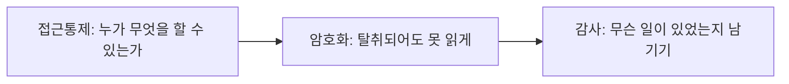
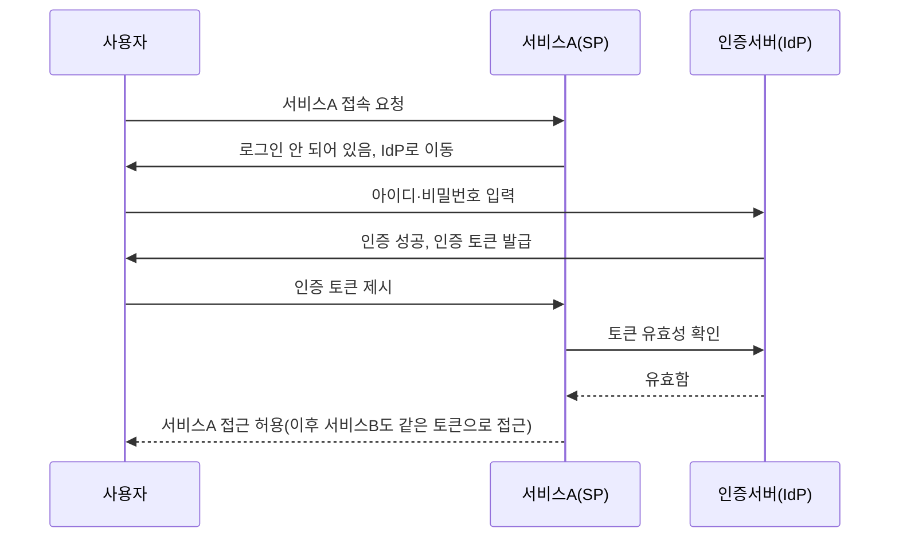
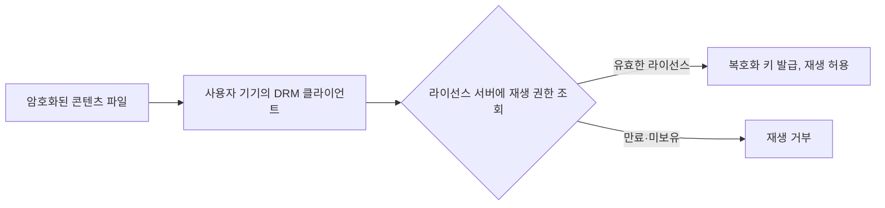

<Callout type="info">
  **이번 문서의 목표:** 데이터베이스 접근통제·암호화·감사가 왜 3중으로 필요한지 설명하고, 전자상거래 결제 인증기술(공동인증서·간편결제)과 SSO·DRM의 동작 원리를 실무 설정과 흐름도로 설명할 수 있게 된다.
</Callout>

## 데이터베이스가 최종 목표가 되는 이유

### 왜 DB 보안을 별도로 다루는가

16·17편에서 SQL 인젝션과 시큐어코딩을 다뤘습니다. 그런데 공격자가 SQL 인젝션에 성공하는 최종 목적은 웹 애플리케이션 자체가 아니라, 그 뒤에 있는 **데이터베이스**(DB)입니다. 회원 개인정보·결제 정보·기업 기밀이 결국 DB 테이블 안에 저장되어 있기 때문입니다. 07편에서 다룬 파일시스템 접근통제가 "서버 안의 파일"을 지키는 것이라면, DB 보안은 "그 서버 안에서도 가장 가치 있는 자산"을 지키는 마지막 관문입니다.

> **쉽게 말하면:** 웹 애플리케이션이 건물의 출입문이라면 DB는 금고입니다. 문을 아무리 잘 잠가도 금고 자체에 이중 잠금이 없으면, 문이 뚫렸을 때 전부를 잃습니다.

DB 보안은 한 가지 기술로 끝나지 않고 **접근통제 → 암호화 → 감사**의 3단 방어로 구성됩니다.



### DB 접근통제 — 최소권한과 계정 분리

**최소권한 원칙**(least privilege)은 22편에서 접근통제 모델로 더 깊이 다루지만, DB 실무에서는 다음과 같은 형태로 구체화됩니다.

- 애플리케이션 서버가 쓰는 DB 계정에는 **꼭 필요한 테이블에 대한 SELECT·INSERT·UPDATE 권한만** 부여하고, `DROP TABLE`·`GRANT` 같은 관리자 권한은 별도 계정으로 분리합니다.
- 개발자·운영자의 직접 접속 계정과 애플리케이션 접속 계정을 분리해, 사람이 실수로 운영 DB를 잘못 건드리는 사고와 애플리케이션 취약점으로 인한 사고의 책임 소재를 구분합니다.
- **뷰**(view)나 **저장 프로시저**(stored procedure)를 통해서만 특정 데이터에 접근하게 하면, 원본 테이블 구조를 직접 노출하지 않고 필요한 컬럼만 골라 보여 줄 수 있습니다.

```sql
-- 애플리케이션 계정에는 특정 테이블의 특정 권한만 부여
GRANT SELECT, INSERT, UPDATE ON orders TO 'app_user'@'10.0.1.%';
-- 관리자 작업은 별도 계정에서만 허용
GRANT ALL PRIVILEGES ON shop_db.* TO 'dba_admin'@'10.0.0.5' IDENTIFIED BY '강력한암호';
```

### 투명한 데이터 암호화 (TDE)

**투명한 데이터 암호화**(TDE, Transparent Data Encryption)는 데이터베이스 파일이 디스크에 저장될 때 자동으로 암호화하고, 정상적으로 로그인한 세션에서 데이터를 조회할 때는 데이터베이스 엔진이 자동으로 복호화해서 보여 주는 방식입니다. "투명하다"는 것은 애플리케이션 코드를 한 줄도 고치지 않아도 암호화가 적용된다는 뜻입니다.

> **쉽게 말하면:** TDE는 금고 안의 서류 자체를 암호 처리해 두는 것입니다. 금고 문을 정상적으로 열면(정당한 접속이면) 서류가 자동으로 해독되어 보이지만, 금고를 통째로 뜯어 가서 서류만 빼내면(디스크나 백업 파일을 훔치면) 암호화된 상태 그대로라 읽을 수 없습니다.

| 구분 | TDE (저장 계층 암호화) | 컬럼 단위 암호화 |
|------|--------------------------|--------------------|
| 암호화 범위 | 데이터 파일·백업 파일 전체 | 지정한 특정 컬럼(주민등록번호·계좌번호 등)만 |
| 적용 난이도 | 설정만으로 적용, 코드 수정 불필요 | 암호화·복호화 함수를 코드에 추가해야 함 |
| 방어 대상 | 디스크 도난, 백업 파일 유출 | DB 관리자 권한을 가진 내부자의 열람까지 포함 |
| 성능 영향 | 상대적으로 적음 | 컬럼이 많을수록 연산 비용 증가 |

**함정 문제:** TDE를 적용하면 내부 관리자가 SQL로 조회해도 암호화된 값이 나온다고 착각하기 쉽습니다. 실제로는 정상 로그인 세션에서는 엔진이 자동 복호화하므로 관리자는 평문을 그대로 봅니다. TDE가 막는 것은 **디스크·백업 파일을 통째로 탈취당하는 상황**이지, **정상 권한을 가진 사람의 조회**가 아닙니다. 내부자의 열람 자체를 제한하려면 컬럼 단위 암호화와 접근통제를 함께 적용해야 합니다.

### DB 방화벽과 감사

**DB 방화벽**(DAF, Database Activity Firewall, 실무에서는 DB 접근제어 솔루션이라고도 부릅니다)은 애플리케이션과 DB 사이, 또는 관리자 접속 구간에 배치되어 SQL 구문을 실시간으로 검사합니다. 정상 애플리케이션이 절대 실행하지 않을 패턴(`OR 1=1`, 대량 `SELECT *` 등)을 탐지해 차단하거나 경고합니다. 09편에서 다룬 SIEM(보안정보이벤트관리) 개념이 DB 로그에도 그대로 적용되어, DB 방화벽이 남긴 이벤트를 SIEM으로 모아 상관분석합니다.

**감사 로그**(audit log)는 "누가 언제 어떤 SQL을 실행했는가"를 남기는 기록입니다.

```text
2026-03-14 09:12:03 | user=dba_admin | client_ip=10.0.0.5 | db=shop_db
  query=SELECT name, phone FROM customers WHERE id=88231
2026-03-14 09:12:47 | user=dba_admin | client_ip=10.0.0.5 | db=shop_db
  query=SELECT name, phone FROM customers  -- WHERE 절 없는 전체 조회
```

두 번째 줄처럼 `WHERE` 조건 없이 고객 테이블 전체를 조회하는 행위는 정상 업무로 보기 어렵습니다. 감사 로그가 없으면 이런 이상 행위를 사후에 전혀 추적할 수 없고, 있어도 사람이나 규칙 기반 시스템이 주기적으로 검토하지 않으면 무용지물입니다. **개인정보보호법**(29편에서 조문 단위로 다룹니다)이 개인정보처리시스템에 접속 기록의 보관·점검을 의무화하는 근거도 이 감사 로그입니다.

## 전자상거래 결제 인증기술

### 결제 프로토콜의 변천

전자상거래(e-commerce) 결제 보안은 "카드번호가 오가는 구간을 어떻게 지킬 것인가"의 역사이기도 합니다. 초기에는 **SET**(Secure Electronic Transaction)이라는 표준이 제안되어 카드 정보를 상점이 아예 보지 못하게 설계했지만, 구현이 복잡해 널리 쓰이지 못했습니다. 이후 카드사·은행이 자체적으로 결제창을 띄워 카드 소유자를 추가 인증하는 방식인 **3D 시큐어**(3D Secure, 국내 ISP 결제창의 원형)가 자리 잡았습니다.

**PG사**(Payment Gateway, 결제대행업체)는 쇼핑몰과 카드사·은행 사이에서 결제 요청을 중계하고 승인을 처리하는 역할을 합니다. 쇼핑몰이 카드번호를 직접 저장·처리하지 않고 PG사의 결제창으로 위임하는 구조가 표준이며, 이는 카드번호 유출 사고가 발생했을 때 책임 범위를 좁히고 **PCI DSS**(Payment Card Industry Data Security Standard, 카드 업계 데이터 보안 표준) 적용 부담을 쇼핑몰이 직접 지지 않게 하는 실무적 이유가 큽니다.

### 공동인증서와 전자서명

국내에서는 오랫동안 **공인인증서**(2020년 「전자서명법」 개정 이후 법적 지위가 사라지고 민간 인증서와 동등해지면서 현재는 **공동인증서**로 불립니다)가 온라인 뱅킹·전자상거래 결제 인증에 널리 쓰였습니다. 원리는 24편에서 다룰 **공개키 기반 구조**(PKI)와 동일합니다. 사용자가 개인키로 거래 내용에 전자서명을 하고, 은행·쇼핑몰은 인증기관(CA)이 발급한 인증서로 그 서명을 검증해 "본인이 직접, 변조 없이 승인했다"는 사실을 확인합니다.

법 개정 이후에는 공동인증서 외에도 금융결제원의 뱅크사인, 각 통신사·카드사가 제공하는 민간 인증서(예: 특정 앱 기반 인증)가 법적으로 동등하게 인정되면서 인증수단이 다변화되었습니다. 이 흐름은 30편에서 다룰 최신 법 개정 동향과도 이어집니다.

### 간편결제와 토큰화, 이상거래탐지

**간편결제**는 카드번호를 매번 입력하지 않고 앱에 미리 등록해 둔 결제수단으로 비밀번호나 생체인증(지문·얼굴)만으로 결제를 완료하는 방식입니다. 여기서 핵심 보안 기술이 **토큰화**(tokenization)입니다.

> **쉽게 말하면:** 토큰화는 진짜 카드번호를 금고에 넣어 두고, 그 대신 쓸 수 있는 "가짜 번호표(토큰)"를 발급해 결제할 때는 이 번호표만 돌아다니게 하는 방식입니다.

실제 카드번호(PAN, Primary Account Number) 대신 해당 거래·기기·가맹점에서만 유효한 대체 값(토큰)을 발급해서 사용합니다. 이 토큰이 통신 중 탈취되더라도 실제 카드번호가 아니므로 다른 곳에서 재사용할 수 없고, 유효기간이나 사용 범위를 제한할 수도 있습니다. 21편에서 다룰 생체인증이 간편결제의 본인확인 수단으로 결합되는 것도 같은 흐름입니다.

**이상거래탐지시스템**(FDS, Fraud Detection System)은 결제 시점의 정보(접속 위치, 기기 정보, 평소 결제 패턴과의 차이, 단시간 다건 결제 여부 등)를 실시간으로 분석해 이상 징후가 있으면 추가 인증을 요구하거나 거래를 차단하는 시스템입니다. 예를 들어 평소 서울에서만 결제하던 카드가 5분 사이 서울과 해외에서 동시에 결제 요청이 들어오면, 물리적으로 불가능한 이동이므로 FDS가 이를 이상 패턴으로 탐지해 거래를 보류시킵니다.

## SSO — 한 번의 인증으로 여러 서비스 이용

**SSO**(Single Sign-On, 싱글사인온)는 사용자가 한 번 로그인하면 그 인증 상태를 여러 연계 서비스가 공유해서, 서비스마다 다시 로그인하지 않아도 되게 하는 구조입니다. 사내 그룹웨어에 한 번 로그인하면 메일·전자결재·인사 시스템까지 추가 로그인 없이 이용되는 경험이 대표적입니다.



SSO를 구현하는 표준으로는 XML 기반의 **SAML**(Security Assertion Markup Language, 주로 기업 환경), 권한 위임에 특화된 **OAuth**(주로 "제3자 앱에 내 정보 접근을 허용"하는 상황), 그 위에 인증 계층을 얹은 **OpenID Connect**(OIDC, 로그인 자체를 표준화)가 있습니다. 정보보안기사 필기에서는 이름과 용도를 구분하는 문제가 나옵니다. **SAML은 인증 정보 자체를 표준 형식으로 주고받는 프로토콜**이고, **OAuth는 원래 인증이 아니라 권한 부여(authorization)를 위한 프로토콜**이며, **OIDC는 OAuth 위에 사용자 신원 확인(authentication) 계층을 추가**한 것입니다.

**SSO의 이면:** 편리함의 대가로 위험이 집중됩니다. 인증서버(IdP, Identity Provider) 계정 하나가 뚫리면 연계된 모든 서비스에 동시에 침입할 수 있으므로, SSO를 도입한 조직일수록 IdP 계정에 다중요소 인증(MFA)을 강제하는 것이 필수적입니다.

## DRM — 콘텐츠를 사용 후에도 통제하기

**DRM**(Digital Rights Management, 디지털저작권관리)은 전자책·영상·음원 같은 디지털 콘텐츠를 암호화해서 배포하고, 정당한 사용자가 정해진 조건(기간, 기기 수, 인쇄 가능 여부 등) 안에서만 콘텐츠를 이용할 수 있게 통제하는 기술입니다.

> **쉽게 말하면:** 일반 암호화는 "전달 중에만" 지키지만, DRM은 파일이 사용자 손에 넘어간 뒤에도 "다 쓴 뒤까지" 계속 감시하며 지킵니다.

일반적인 파일 암호화와의 차이가 시험에서 자주 다뤄집니다. 단순 암호화는 복호화 키만 얻으면 그 뒤로는 자유롭게 복제·배포할 수 있지만, DRM은 콘텐츠를 열 때마다 **라이선스 서버**에 사용 권한을 확인하는 절차를 거치도록 설계되어 있어, 배포자가 언제든 권한을 회수하거나 사용 조건을 바꿀 수 있습니다.



전자상거래에서 유료 전자책·강의 콘텐츠를 판매할 때 이 구조를 그대로 사용하며, 03과목의 다른 서비스 보안 기술과 마찬가지로 "콘텐츠 자체를 지키는 것"과 "그 콘텐츠에 접근하는 사용자를 인증하는 것"이 결합되어야 실효성이 있다는 점에서 SSO·간편결제 인증과 같은 맥락에 있습니다.

## 핵심 정리

- DB 보안은 **접근통제**(최소권한, 계정 분리, 뷰·프로시저 경유) → **암호화**(TDE, 컬럼 암호화) → **감사**(SQL 실행 로그) 3단 방어로 구성된다.
- **TDE**는 디스크·백업 파일 탈취를 막는 저장 계층 암호화이며, 정상 로그인 세션에서는 자동 복호화되므로 내부자의 정당한 조회 자체를 막지는 못한다. 내부자 열람 제한에는 컬럼 암호화가 추가로 필요하다.
- **DB 방화벽**은 SQL 구문을 실시간으로 검사해 이상 패턴을 탐지·차단하고, **감사 로그**는 사후 추적의 근거가 된다.
- 전자상거래 결제는 PG사가 카드정보 처리를 위임받아 중계하며, 국내에서는 공인인증서가 법적 지위를 잃고 **공동인증서**로 전환된 뒤 다양한 민간 인증수단과 동등하게 쓰인다.
- **간편결제**는 실제 카드번호 대신 대체 값을 쓰는 **토큰화**와 이상 패턴을 실시간 탐지하는 **FDS**로 안전성을 확보한다.
- **SSO**는 한 번의 인증으로 여러 서비스를 이용하게 하는 구조이며, SAML(인증 정보 프로토콜)·OAuth(권한 부여)·OIDC(OAuth 위의 인증 계층)를 용도로 구분해야 한다.
- **DRM**은 콘텐츠가 사용자 손에 넘어간 뒤에도 라이선스 서버를 통해 사용 조건을 계속 통제하는 기술로, 일반 암호화보다 통제 범위가 넓다.

## 마무리 복습

<Quiz
  questionNumber={1}
  question="투명한 데이터 암호화(TDE)에 대한 설명으로 옳은 것은?"
  options={['정상적으로 로그인한 세션에서 조회해도 값이 암호화된 상태로 표시된다', '디스크나 백업 파일이 통째로 유출되어도 암호화되어 있어 읽을 수 없게 한다', '애플리케이션 코드에 복호화 함수를 직접 작성해야 동작한다', '내부 관리자의 정당한 조회 권한 자체를 원천적으로 차단하는 기술이다']}
  correctAnswer={2}
  explanation="TDE는 데이터 파일이 디스크에 저장될 때 암호화하고 정상 세션에서는 엔진이 자동 복호화하는 방식이므로, 디스크·백업 파일 자체가 탈취되어도 암호화된 상태로 남아 읽을 수 없게 한다."
  optionExplanations={['정상 세션에서는 자동 복호화되어 평문으로 표시된다.', '저장 계층 암호화의 핵심 목적을 정확히 설명했다.', '투명하다는 것은 코드 수정 없이 적용된다는 뜻이다.', '정상 권한을 가진 조회 자체는 막지 못하며 이는 컬럼 암호화의 영역이다.']}
/>

<Quiz
  questionNumber={2}
  question="DB 접근통제 실무 원칙으로 가장 적절하지 않은 것은?"
  options={['애플리케이션 계정에는 필요한 테이블의 필요한 권한만 부여한다', '개발자·운영자의 직접 접속 계정과 애플리케이션 접속 계정을 동일하게 통합한다', '뷰나 저장 프로시저를 통해서만 특정 데이터에 접근하게 한다', '관리자 권한이 필요한 작업은 별도 계정으로 분리한다']}
  correctAnswer={2}
  explanation="사람이 쓰는 직접 접속 계정과 애플리케이션이 쓰는 접속 계정을 통합하면 책임 소재 구분이 불가능해지고 최소권한 원칙에도 위배된다. 계정은 용도별로 분리하는 것이 원칙이다."
  optionExplanations={['최소권한 원칙에 부합하는 올바른 실무다.', '계정 통합은 책임 소재 구분을 어렵게 하는 잘못된 원칙이다.', '원본 테이블을 직접 노출하지 않는 올바른 접근 방식이다.', '관리자 권한 분리는 사고 확산을 막는 올바른 원칙이다.']}
/>

<Quiz
  questionNumber={3}
  question="간편결제에서 사용하는 토큰화(tokenization)에 대한 설명으로 가장 적절한 것은?"
  options={['카드번호를 해시 함수로 변환해 원문 복원이 불가능하게 만드는 기술이다', '실제 카드번호 대신 특정 거래·기기·가맹점에서만 유효한 대체 값을 발급해 사용하는 기술이다', '카드번호를 대칭키로 암호화해 결제창에 전달하는 기술이다', '카드사가 발급한 인증서로 결제 요청에 전자서명하는 기술이다']}
  correctAnswer={2}
  explanation="토큰화는 실제 카드번호(PAN) 대신 해당 거래나 기기, 가맹점 범위에서만 쓸 수 있는 대체 값을 발급해, 그 토큰이 유출되어도 실제 카드번호로 재사용할 수 없게 만드는 방식이다."
  optionExplanations={['해시는 일방향 변환이며 결제 승인에는 원래 카드정보 확인이 필요하므로 토큰화의 정의와 다르다.', '대체 값 발급이라는 토큰화의 핵심 개념을 정확히 설명했다.', '단순 암호화는 복호화하면 원래 카드번호가 그대로 복원되므로 토큰화와는 다른 접근이다.', '전자서명은 거래 무결성 확인 방식이며 토큰화의 정의와는 다르다.']}
/>

<Quiz
  questionNumber={4}
  question="SSO 구현 표준인 SAML, OAuth, OpenID Connect(OIDC)의 관계에 대한 설명으로 옳은 것은?"
  options={['OAuth는 원래 사용자 인증이 아니라 권한 부여를 위해 설계된 프로토콜이다', 'SAML은 권한 위임만을 위한 프로토콜이며 인증 정보는 다루지 않는다', 'OIDC는 SAML을 대체하기 위해 OAuth 이전에 먼저 만들어졌다', 'SSO 환경에서는 인증서버(IdP) 계정의 보안 수준이 상대적으로 덜 중요하다']}
  correctAnswer={1}
  explanation="OAuth는 제3자 애플리케이션에 자원 접근 권한을 위임하기 위해 설계된 프로토콜이며, 이후 그 위에 사용자 신원 확인 계층을 추가한 것이 OpenID Connect다. SAML은 인증 정보 자체를 표준 형식으로 주고받는 프로토콜이다."
  optionExplanations={['OAuth의 원래 목적을 정확히 설명한 내용이다.', 'SAML은 인증 정보(assertion)를 표준 형식으로 전달하는 프로토콜이므로 설명이 틀렸다.', 'OIDC는 OAuth 이후에 그 위에 얹는 형태로 만들어졌으므로 순서가 반대다.', 'SSO는 하나의 계정으로 여러 서비스에 접근하므로 IdP 계정 보안이 오히려 가장 중요해진다.']}
/>

<Quiz
  questionNumber={5}
  question="DRM(디지털저작권관리)과 일반 파일 암호화의 가장 큰 차이로 적절한 것은?"
  options={['DRM은 암호화 알고리즘을 사용하지 않는다', 'DRM은 파일이 사용자에게 전달된 이후에도 라이선스 서버를 통해 지속적으로 사용 조건을 통제할 수 있다', '일반 암호화는 복호화 키를 절대 배포하지 않는다', 'DRM은 전자상거래 결제 정보 보호에만 사용된다']}
  correctAnswer={2}
  explanation="일반 암호화는 복호화 키를 얻으면 그 이후 자유롭게 사용할 수 있지만, DRM은 콘텐츠를 열 때마다 라이선스 서버에 사용 권한을 확인하도록 설계되어 배포자가 사용 조건을 계속 통제할 수 있다."
  optionExplanations={['DRM도 콘텐츠 보호를 위해 암호화 기술을 사용한다.', '지속적인 사용 조건 통제라는 DRM의 핵심 특징을 정확히 설명했다.', '복호화 키가 있어야 콘텐츠를 사용할 수 있으므로 어떤 형태로든 키는 전달된다.', 'DRM은 전자책·영상·음원 등 다양한 디지털 콘텐츠 보호에 폭넓게 사용된다.']}
/>

<Quiz
  questionNumber={6}
  question="DB 감사 로그에서 다음과 같은 기록이 발견되었다. 이 상황에 대한 해석으로 가장 적절한 것은? user=dba_admin이 WHERE 조건 없이 고객 테이블 전체를 조회했다."
  options={['정상적인 일상 업무이므로 별도 조치가 필요 없다', 'WHERE 조건이 없다는 것은 SQL 문법 오류이므로 쿼리가 실행되지 않는다', '대량 개인정보 유출 시도일 가능성이 있으므로 이상행위로 점검해야 한다', 'TDE가 적용되어 있다면 이러한 조회 자체가 원천적으로 불가능하다']}
  correctAnswer={3}
  explanation="조건절 없이 고객 테이블 전체를 조회하는 것은 정상 업무 패턴과 거리가 멀고 대량 개인정보 유출 시도의 전형적인 징후이므로, 감사 로그와 DB 방화벽 탐지를 통해 이상행위로 점검해야 한다."
  optionExplanations={['전체 테이블 조회는 정상 업무로 보기 어려운 이상 패턴이다.', 'WHERE 절 생략은 문법 오류가 아니라 전체 행을 대상으로 하는 정상 문법이다.', '이상행위로 의심해 점검해야 한다는 것이 감사 로그의 존재 목적과 일치한다.', 'TDE는 저장 계층 암호화이며 정상 로그인 세션의 조회 자체를 막지는 않는다.']}
/>

## 참고 자료

- [itwiki - 정보보안기사 필기 출제기준](https://itwiki.kr/w/정보보안기사_필기_출제기준)
- [공공데이터포털 - 한국방송통신전파진흥원_국가기술자격검정 정보보안 종목 출제기준](https://www.data.go.kr/data/15140079/fileData.do)
- [국가법령정보센터 - 개인정보 보호법](https://www.law.go.kr/%EB%B2%95%EB%A0%B9/%EA%B0%9C%EC%9D%B8%EC%A0%95%EB%B3%B4%EB%B3%B4%ED%98%B8%EB%B2%95)
