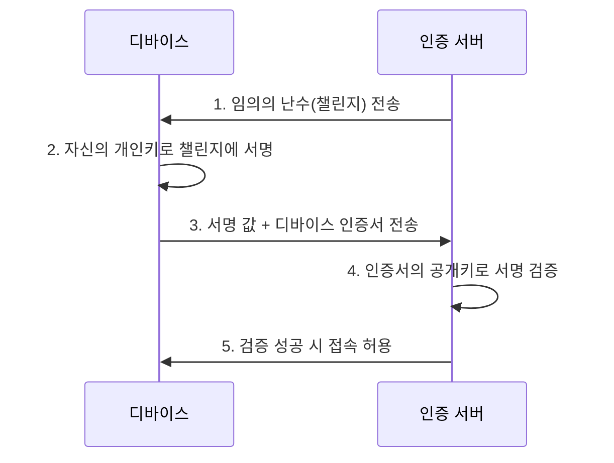

<Callout type="info">
  **이번 문서의 목표:** 인증을 지식·소유·생체 세 뿌리로 나눠 다중요소인증(MFA)을 올바르게 판별하고, 메시지인증코드(MAC)와 재전송 공격 방지 원리, 인증서 기반 디바이스 인증의 흐름, 생체인증의 오탐률·거부율 계산까지 손으로 따라갈 수 있게 된다.
</Callout>

## 인증이 접근통제의 첫 관문인 이유

01편에서 정보보안의 세 축인 기밀성·무결성·가용성(CIA)을 정리했습니다. 이 세 가지를 실제로 지키려면 시스템이 지금 요청을 보낸 상대가 누구인지부터 확실히 알아야 합니다. 상대가 누구인지도 모른 채 접근을 허락하면 기밀성도 무결성도 지킬 수 없기 때문입니다.

접근통제는 보통 세 단계로 이뤄집니다.

- **식별**(Identification): "저는 아이디 kim123입니다"처럼 신원을 주장하는 단계
- **인증**(Authentication): 그 주장이 사실인지 증거로 확인하는 단계 — 이 편의 주제
- **인가**(Authorization): 인증된 사람에게 무엇을 허용할지 결정하는 단계 — 22편에서 DAC·MAC·RBAC 모델로 심화

> **쉽게 말하면:** 식별은 "저 누구예요"라는 자기소개, 인증은 신분증 검사, 인가는 검사를 통과한 사람에게 출입증을 몇 층까지 찍어 주는지 정하는 일입니다.

이 편은 인증만 떼어내 사람(사용자)·메시지·기기(디바이스)·생체라는 네 가지 대상을 각각 어떻게 확인하는지 다룹니다.

## 1. 사용자 인증의 세 가지 뿌리

사용자 인증 수단은 전통적으로 세 범주로 나뉩니다.

| 범주 | 영문 표현 | 정의 | 예시 |
|------|-----------|------|------|
| 지식 기반 | Something You Know | 본인만 알고 있는 정보 | 패스워드, PIN, 패턴 잠금 |
| 소유 기반 | Something You Have | 본인만 가지고 있는 물건 | OTP 토큰, 스마트카드, 인증서가 담긴 휴대폰 |
| 생체 기반 | Something You Are | 본인 신체의 고유한 특징 | 지문, 홍채, 정맥, 얼굴 |

최근에는 걸음걸이·타이핑 리듬처럼 행동 패턴을 보는 **행위 기반**(Something You Do) 인증도 보조 수단으로 쓰이지만, 시험에서 핵심으로 묻는 것은 위 세 범주입니다.

> **쉽게 말하면:** 아는 것, 가진 것, 몸에 있는 것 — 이 세 가지 중 무엇으로 "나"를 증명하느냐의 문제입니다.

### 계산: 인증정보 공간(경우의 수)이 안전성을 결정한다

**왜 필요한가:** 지식 기반 인증의 안전성은 결국 공격자가 가능한 모든 값을 얼마나 빨리 다 시도해 볼 수 있느냐에 달려 있습니다. 그 전체 경우의 수를 **키 공간**(key space)이라 부릅니다.

**작은 예시부터.** 4자리 숫자 PIN을 생각해 봅시다. 각 자리는 0부터 9까지 10가지가 가능하고, 자리가 4개이므로 경우의 수는 다음과 같이 곱해 갑니다.

$$
10 \times 10 = 100
$$

$$
100 \times 10 = 1{,}000
$$

$$
1{,}000 \times 10 = 10{,}000
$$

**해석:** 4자리 PIN은 전체 경우의 수가 만 가지뿐입니다. 자동화된 공격 프로그램은 초당 수백 번씩 시도할 수 있으므로, 시도 횟수를 제한하는 잠금 정책이 없으면 순식간에 뚫립니다.

**이번에는 영대문자·영소문자·숫자를 섞은 8자리 패스워드**를 계산해 봅시다. 사용 가능한 문자는 26 + 26 + 10 = 62개이고, 자리마다 독립적으로 62가지가 가능하므로 전체 경우의 수는 $62^8$입니다. 지수가 커서 한 번에 곱하지 않고 제곱을 거듭하는 방식(**반복제곱**)으로 계산합니다.

$$
62^2 = 3{,}844
$$

$$
62^4 = 3{,}844^2 = 14{,}776{,}336
$$

$$
62^8 = 14{,}776{,}336^2 = 218{,}340{,}105{,}584{,}896
$$

- $62^2$: 62를 두 번 곱한 값
- $62^4$: $62^2$을 다시 제곱한 값 ($62^2 \times 62^2$)
- $62^8$: $62^4$을 다시 제곱한 값 — 지수 2, 4, 8로 두 배씩 늘려 가는 이 방식은 23편의 RSA 계산에서도 그대로 재사용합니다

**해석:** 8자리 영숫자 패스워드의 경우의 수는 약 2.18×10^14, 즉 약 218조 가지입니다. 그런데 클라우드 GPU를 동원해 초당 10억(10^9)번씩 시도하는 공격을 가정하면 소요 시간은 다음과 같습니다.

$$
\frac{218{,}340{,}105{,}584{,}896}{1{,}000{,}000{,}000} \approx 218{,}340
$$

약 218,340초, 시간으로 환산하면 약 60.6시간, 즉 사흘이 채 걸리지 않습니다. **패스워드 하나만으로는 충분히 안전하지 않다는 것**이 바로 다음에 다룰 다중요소인증이 필요한 이유입니다.

### 다중요소인증(MFA)과 자주 나오는 함정

**다중요소인증**(Multi-Factor Authentication, MFA)은 서로 **다른 범주**에서 최소 두 가지 이상의 인증 수단을 요구하는 방식입니다.

- 카드(소유) + PIN(지식) → 서로 다른 두 범주이므로 2FA(2요소 인증)로 인정됩니다
- 지문(생체) + OTP(소유) → 역시 2FA입니다
- 비밀번호(지식) + 보안질문(지식) → **둘 다 지식 기반이므로 2단계로 입력하더라도 다중요소인증이 아닙니다**

세 범주 중 두 가지를 고르는 조합의 수는 다음과 같이 계산합니다.

$$
{}_3C_2 = \frac{3!}{2! \times 1!} = 3
$$

- $3!$: 3부터 1까지 곱한 값(6)
- $2!$: 2부터 1까지 곱한 값(2)
- 분모의 $1!$: 남은 1개를 고르는 경우의 수(1)

가능한 조합은 지식+소유, 지식+생체, 소유+생체 세 가지뿐입니다. **여기서 시험이 노리는 함정은 "인증 수단을 몇 번 입력했는가"가 아니라 "서로 다른 범주를 몇 개 썼는가**"입니다. 같은 범주를 두 번 물어보는 것은 아무리 절차가 늘어도 다중요소가 아닙니다.

## 2. 메시지 인증코드(MAC)와 재전송 공격 방지

### 왜 필요한가

네트워크로 메시지를 주고받을 때 두 가지를 확인해야 합니다. 전송 중에 값이 바뀌지 않았는지(**무결성**), 그리고 정말 주장하는 사람이 보냈는지(**출처 인증**)입니다. 이 둘을 동시에 확인해 주는 도구가 **메시지 인증코드**(Message Authentication Code, MAC)입니다.

> **쉽게 말하면:** 메시지 뒤에 "이 값은 비밀키를 가진 사람만 만들 수 있는 짧은 도장"을 찍어 보내는 것입니다.

실무에서는 해시함수를 이용한 **HMAC**(Hash-based MAC) 구조를 가장 많이 쓰는데, 해시함수 자체의 원리와 충돌저항성은 24편에서 깊게 다룹니다. 여기서는 MAC이 왜 안전한지 그 핵심 성질을 아주 단순화한 모듈러 연산 모델로 확인해 보겠습니다.

### 계산: 단순화한 MAC 모델로 원리 확인

**전제:** 실제 HMAC은 해시함수의 압축 함수를 여러 라운드 거치는 복잡한 구조라 손으로 계산할 수 없습니다. 아래 예시는 "비밀키가 있어야만 값을 재현할 수 있다"는 MAC의 핵심 성질 하나만 보여 주기 위해 곱셈과 나머지 연산으로 극단순화한 모델이며, 실제 표준 알고리즘이 아닙니다.

발신자와 수신자가 미리 공유한 비밀키 $k=5$, 공개된 소수 $p=17$이 있고, 전송할 메시지의 숫자값이 $m=12$라고 합시다. MAC 값을 다음과 같이 정의합니다.

$$
\text{MAC} = (m \times k) \bmod p
$$

$$
\text{MAC} = (12 \times 5) \bmod 17 = 60 \bmod 17
$$

$60 \div 17 = 3$ 나머지 $9$이므로($17 \times 3 = 51$, $60 - 51 = 9$),

$$
\text{MAC} = 9
$$

발신자는 메시지 $m=12$와 함께 MAC 값 9를 전송합니다. **수신자도 같은 비밀키 5를 가지고 있으므로** 받은 메시지 12로 똑같이 $(12 \times 5) \bmod 17$을 계산해 9가 나오면 무결성과 출처가 모두 확인된 것입니다.

**공격자가 메시지를 20으로 변조했다고 가정해 봅시다.** 공격자는 비밀키를 모르므로 MAC 값을 다시 계산하지 못하고 원래의 9를 그대로 붙여 보낼 수밖에 없습니다. 수신자가 변조된 메시지 20으로 검증을 수행하면,

$$
(20 \times 5) \bmod 17 = 100 \bmod 17
$$

$100 \div 17 = 5$ 나머지 $15$이므로($17 \times 5 = 85$, $100 - 85 = 15$),

$$
15 \neq 9
$$

값이 일치하지 않아 변조가 즉시 드러납니다. 이 계산이 보여 주는 핵심은 **비밀키를 모르면 유효한 MAC 값을 새로 만들 수 없다**는 것이며, 이 성질은 4과목 암호학의 대칭키 개념(23편)과 해시함수(24편)가 결합될 때도 동일하게 유지됩니다.

### 재전송 공격과 방지 기법

MAC은 메시지의 변조는 잡아내지만, 정상적인 MAC이 붙은 메시지 전체를 그대로 복사해서 나중에 다시 보내는 **재전송 공격**(Replay Attack)은 막지 못합니다. 예를 들어 "홍길동에게 10만원을 송금하라"는 정상 메시지와 MAC을 도청자가 그대로 캡처해 두었다가 100번 재전송하면, MAC 검증은 매번 통과합니다.

| 방지 기법 | 원리 | 약점 |
|-----------|------|------|
| 논스(nonce) | 매 요청마다 한 번만 쓰는 난수를 포함시켜, 같은 논스가 다시 오면 거부 | 사용한 논스 목록을 서버가 계속 관리해야 함 |
| 타임스탬프 | 메시지에 전송 시각을 넣고 허용 오차(예: 5분)를 벗어나면 거부 | 서버·클라이언트 시각 동기화(NTP)가 필요 |
| 순서번호(sequence number) | 메시지마다 증가하는 번호를 붙여, 이전 번호가 오면 거부 | 메시지 순서가 뒤바뀌는 정상 상황과 구분이 어려울 수 있음 |

**자주 틀리는 점:** MAC과 **암호화**(Encryption)를 혼동하는 경우가 많습니다. MAC은 메시지가 변조되지 않았는지, 정말 그 사람이 보냈는지만 확인할 뿐 메시지 내용을 숨기지 않습니다. 내용을 숨기는 **기밀성**은 23편에서 다루는 암호화의 역할이며, 실무에서는 암호화와 MAC을 함께 적용(암호화 후 MAC, Encrypt-then-MAC)해 기밀성과 무결성을 동시에 확보합니다.

## 3. 디바이스 인증: 인증서 기반 챌린지-응답

### 왜 필요한가

회사 노트북·스마트폰·IoT 센서처럼 **사람이 아니라 기기 자체**가 신뢰할 수 있는 상대인지 확인해야 하는 경우가 있습니다. 도난당한 노트북이나 복제된 IoT 기기가 사내망에 접속하는 것을 막으려면 사용자 인증과는 별도로 **디바이스 인증**이 필요합니다.

가장 널리 쓰이는 방식은 각 기기에 고유한 **디지털 인증서**(공개키와 소유자 정보를 묶어 인증기관이 서명한 문서)를 발급해 두고, 접속 시점에 그 인증서에 대응하는 개인키를 실제로 가지고 있는지 확인하는 **챌린지-응답**(Challenge-Response) 절차를 거치는 것입니다. 인증서 자체의 구조와 발급 기관은 24편에서, TLS 상호인증에서의 활용은 14편에서 각각 다룹니다.

**핵심 아이디어:** 서버는 매번 새로운 난수를 보내기 때문에 공격자가 과거에 캡처한 서명 값을 재사용할 수 없습니다(재전송 공격 방지). 그리고 개인키는 디바이스 안전 저장소(TPM, 보안 요소 칩 등)를 벗어나지 않으므로, 인증서를 복사당해도 개인키가 없으면 챌린지에 유효하게 서명할 수 없습니다. 서명 값을 실제로 만들고 검증하는 계산은 24편에서 RSA 전자서명으로 직접 손으로 풀어 봅니다.

## 4. 생체인증과 오탐률·거부율

### 왜 완벽하지 않은가

지문이나 홍채는 도난당할 걱정이 없어 보이지만, 매번 스캔한 값이 등록된 값과 **디지털 신호 수준에서 완전히 똑같지는 않습니다.** 손가락의 습기, 조명, 각도에 따라 값이 조금씩 달라지기 때문에 생체인증은 "완전히 일치"가 아니라 "충분히 비슷한가"를 판단하는 **유사도 임계값** 방식으로 동작합니다. 이 임계값을 어디에 두느냐에 따라 두 종류의 오류가 발생합니다.

- **오인식률**(False Acceptance Rate, FAR): 등록되지 않은 타인을 본인으로 잘못 승인하는 비율
- **본인거부율**(False Rejection Rate, FRR): 등록된 본인을 타인으로 잘못 거부하는 비율
- **교차오류율**(Equal Error Rate, EER): FAR과 FRR이 같아지는 지점의 오류율로, 이 값이 낮을수록 그 생체인증 시스템의 전반적인 정확도가 우수합니다

> **쉽게 말하면:** FAR은 "가짜를 진짜로 속아 넘어간 비율", FRR은 "진짜인데 의심받아 쫓겨난 비율"입니다.

### 계산: FAR과 FRR 구하기

어떤 지문 인식 시스템을 시험한다고 합시다. 등록된 본인이 1,000번 인증을 시도했는데 15번 거부당했고, 등록되지 않은 침입자가 1,000번 시도했는데 4번 승인됐습니다.

$$
\text{FRR} = \frac{15}{1{,}000} = 0.015
$$

$$
\text{FAR} = \frac{4}{1{,}000} = 0.004
$$

퍼센트로 바꾸면 본인거부율은 1.5퍼센트(1.5%), 오인식률은 0.4퍼센트(0.4%)입니다.

**해석과 트레이드오프:** 유사도 임계값을 더 엄격하게(더 정확히 일치해야 통과하도록) 조정하면 침입자가 통과할 확률인 FAR은 낮아지지만, 그만큼 본인도 조금만 각도가 달라져도 거부당하는 FRR은 올라갑니다. 반대로 임계값을 느슨하게 하면 FRR은 낮아지지만 FAR이 올라갑니다. 두 오류율은 서로 트레이드오프 관계이며, 은행 앱처럼 보안이 중요한 서비스는 FAR을 낮추는 쪽(더 엄격)을, 사내 출입문처럼 편의성이 중요한 곳은 FRR을 낮추는 쪽(더 느슨)을 우선하는 식으로 정책을 정합니다.

| 생체 특성 | 상대적 정확도 | 사용자 편의성 | 주요 약점 |
|-----------|---------------|---------------|-----------|
| 지문 | 높음 | 높음 | 상처·습기에 인식률 저하 |
| 홍채 | 매우 높음 | 중간 | 특수 장비 필요, 촬영 저항감 |
| 정맥 | 매우 높음 | 중간 | 장비 비용이 높음 |
| 얼굴 | 중간 | 매우 높음 | 조명·마스크·사진 위조에 취약 |

**자주 틀리는 점:** "임계값을 엄격하게 하면 FAR과 FRR이 함께 낮아진다"는 서술은 틀렸습니다. 한쪽을 낮추면 다른 쪽이 올라가는 **트레이드오프**이며, 둘 다 동시에 낮추려면 임계값 조정이 아니라 센서·알고리즘 자체의 성능(EER)을 개선해야 합니다.

## 핵심 정리

- 접근통제는 **식별 → 인증 → 인가** 순서로 진행되며, 이 편은 그중 인증만 다룬다.
- 사용자 인증은 지식·소유·생체 세 범주로 나뉘고, **다중요소인증은 서로 다른 범주를 최소 2개 조합**해야 성립한다. 같은 범주를 여러 번 물으면 다중요소가 아니다.
- **MAC**(메시지인증코드)은 비밀키가 있어야만 재현 가능한 값으로 무결성과 출처를 확인하지만, 기밀성은 보장하지 않으며 재전송 공격은 논스·타임스탬프·순서번호로 별도 방지해야 한다.
- 디바이스 인증은 인증서와 챌린지-응답 구조로, 개인키를 실제로 보유했는지 매번 새로운 난수에 대한 서명으로 확인한다.
- 생체인증은 **FAR**(오인식률)**과 FRR**(본인거부율)의 트레이드오프로 정확도를 관리하며, 이 둘이 같아지는 지점이 EER이다.

## 마무리 복습

<Quiz
  questionNumber={1}
  question="다중요소인증(MFA)의 성립 조건으로 가장 적절한 것은?"
  options={['인증 수단을 입력하는 횟수가 2회 이상이면 성립한다', '서로 다른 인증 범주(지식·소유·생체)를 최소 2개 이상 조합해야 성립한다', '비밀번호와 보안질문을 함께 요구하면 성립한다', '생체인증만 단독으로 사용하면 성립한다']}
  correctAnswer={2}
  explanation="다중요소인증은 인증 수단의 개수가 아니라 서로 다른 범주(지식·소유·생체)를 몇 개 조합했는지로 판별한다. 비밀번호와 보안질문은 둘 다 지식 기반이므로 입력을 두 번 해도 다중요소가 아니다."
  optionExplanations={['입력 횟수가 아니라 범주의 다양성이 기준이다.', '지식·소유·생체 중 서로 다른 두 범주를 조합해야 한다는 정의와 정확히 일치한다.', '둘 다 지식 기반이므로 다중요소인증으로 인정되지 않는다.', '생체인증 하나만으로는 단일요소인증이다.']}
/>

<Quiz
  questionNumber={2}
  question="영대문자·영소문자·숫자를 조합한 8자리 패스워드의 전체 경우의 수를 구하는 식으로 옳은 것은?"
  options={['26의 8제곱', '36의 8제곱', '62의 8제곱', '62 곱하기 8']}
  correctAnswer={3}
  explanation="사용 가능한 문자는 영대문자 26개, 영소문자 26개, 숫자 10개를 더한 62개이며, 8자리 각 자리가 독립적으로 62가지 값을 가질 수 있으므로 62를 8번 곱한 값이 전체 경우의 수다."
  optionExplanations={['영문자만 고려하고 숫자를 뺀 값이다.', '숫자 10개를 대문자만 있는 것처럼 26에 더 얹어 계산한 값으로 근거가 없다.', '62개 문자를 8자리에 독립적으로 배치하는 경우의 수와 정확히 일치한다.', '거듭제곱이 아니라 곱셈으로 계산해 자릿수 효과를 반영하지 못했다.']}
/>

<Quiz
  questionNumber={3}
  question="메시지 인증코드(MAC)에 대한 설명으로 가장 적절한 것은?"
  options={['MAC은 메시지의 내용을 제3자가 읽지 못하도록 숨기는 기능을 한다', 'MAC은 비밀키를 모르면 재현할 수 없는 값으로 무결성과 출처를 확인하지만 기밀성은 보장하지 않는다', 'MAC 값이 일치하면 재전송 공격도 자동으로 방지된다', 'MAC은 공개키만으로 검증할 수 있어 키 분배가 필요 없다']}
  correctAnswer={2}
  explanation="MAC은 공유된 비밀키가 있어야만 만들 수 있는 값이므로 무결성과 출처 인증을 제공하지만, 메시지 내용 자체를 숨기지 않으므로 기밀성과는 별개다."
  optionExplanations={['내용을 숨기는 것은 암호화의 역할이며 MAC의 목적이 아니다.', 'MAC의 핵심 성질을 정확히 설명했다.', '동일한 정상 메시지와 MAC을 그대로 재전송하면 검증을 통과하므로 별도의 논스·타임스탬프 대책이 필요하다.', 'MAC은 발신자와 수신자가 같은 비밀키를 공유해야 하는 대칭키 기반 기법이다.']}
/>

<Quiz
  questionNumber={4}
  question="재전송 공격(Replay Attack)을 방지하는 기법으로 가장 거리가 먼 것은?"
  options={['매 요청마다 한 번만 사용하는 난수(논스)를 포함한다', '메시지에 전송 시각을 넣고 허용 오차를 벗어나면 거부한다', '메시지마다 증가하는 순서번호를 붙여 이전 번호를 거부한다', '메시지 인증코드의 비밀키 길이를 늘린다']}
  correctAnswer={4}
  explanation="비밀키 길이를 늘리는 것은 무차별대입 공격에 대한 저항성을 높일 뿐, 정상적으로 발급된 메시지와 MAC을 그대로 재전송하는 공격을 막지 못한다. 재전송 방지에는 논스·타임스탬프·순서번호처럼 매번 달라지는 값이 필요하다."
  optionExplanations={['같은 논스가 재사용되면 거부하므로 재전송 방지에 유효하다.', '허용 오차를 벗어난 오래된 메시지를 걸러내므로 유효하다.', '이전 번호의 메시지를 거부하므로 유효하다.', '키 길이는 재전송 공격과 무관한 무차별대입 저항성의 문제다.']}
/>

<Quiz
  questionNumber={5}
  question="디바이스 인증서 기반 챌린지-응답 절차에서 서버가 매번 새로운 난수(챌린지)를 보내는 이유로 가장 적절한 것은?"
  options={['디바이스의 처리 속도를 측정하기 위해서다', '과거에 캡처된 서명 값을 재사용하는 재전송 공격을 막기 위해서다', '인증서의 유효기간을 자동으로 연장하기 위해서다', '디바이스의 개인키를 서버로 전송받기 위해서다']}
  correctAnswer={2}
  explanation="챌린지가 매번 새로운 난수이므로 공격자가 과거에 가로챈 서명 값을 그대로 재전송해도 이번 챌린지에 대한 유효한 서명이 아니어서 검증에 실패한다."
  optionExplanations={['처리 속도 측정은 챌린지-응답의 목적이 아니다.', '재전송 공격 방지가 매번 새 난수를 쓰는 핵심 이유다.', '유효기간 연장과 챌린지는 관련이 없다.', '개인키는 디바이스 밖으로 절대 나가지 않으며 서명 값만 전송된다.']}
/>

<Quiz
  questionNumber={6}
  question="지문 인식 시스템에서 본인 1,000회 시도 중 15회가 거부되고, 침입자 1,000회 시도 중 4회가 승인됐다. FRR과 FAR을 바르게 짝지은 것은?"
  options={['FRR 0.4퍼센트, FAR 1.5퍼센트', 'FRR 1.5퍼센트, FAR 0.4퍼센트', 'FRR 15퍼센트, FAR 4퍼센트', 'FRR과 FAR 모두 1.9퍼센트']}
  correctAnswer={2}
  explanation="FRR은 본인이 거부당한 비율이므로 15를 1,000으로 나눈 1.5퍼센트이고, FAR은 침입자가 승인된 비율이므로 4를 1,000으로 나눈 0.4퍼센트다."
  optionExplanations={['두 값의 정의가 서로 뒤바뀌었다.', '거부(FRR)와 오인식(FAR)의 정의에 정확히 맞는 값이다.', '분모를 1,000이 아닌 100으로 잘못 계산한 값이다.', '두 값을 단순히 더한 것으로 정의와 무관하다.']}
/>

<Quiz
  questionNumber={7}
  question="생체인증의 임계값(threshold) 조정에 대한 설명으로 옳은 것은?"
  options={['임계값을 엄격하게 하면 FAR과 FRR이 동시에 낮아진다', '임계값을 엄격하게 하면 FAR은 낮아지지만 FRR은 올라간다', '임계값을 느슨하게 하면 FAR과 FRR이 동시에 낮아진다', '임계값 조정은 FAR에만 영향을 주고 FRR과는 무관하다']}
  correctAnswer={2}
  explanation="임계값을 엄격하게 하면 더 정확히 일치해야 통과되므로 침입자가 통과할 확률(FAR)은 낮아지지만, 본인도 조건을 충족하지 못해 거부되는 비율(FRR)은 올라간다. 두 오류율은 서로 트레이드오프 관계다."
  optionExplanations={['두 오류율이 동시에 낮아지는 것이 아니라 트레이드오프 관계다.', 'FAR과 FRR의 트레이드오프 방향을 정확히 설명했다.', '느슨하게 하면 오히려 FAR이 올라가고 FRR이 낮아진다.', '임계값은 FAR과 FRR 모두에 반대 방향으로 영향을 준다.']}
/>

## 참고 자료

- [한국방송통신전파진흥원 - 정보보안기사 자격정보](https://www.cq.or.kr/qh_quagm01_020.do)
- [itwiki - 정보보안기사 필기 출제기준](https://itwiki.kr/w/정보보안기사_필기_출제기준)
- [NIST SP 800-63B - Digital Identity Guidelines: Authentication and Lifecycle Management](https://pages.nist.gov/800-63-3/sp800-63b.html)
