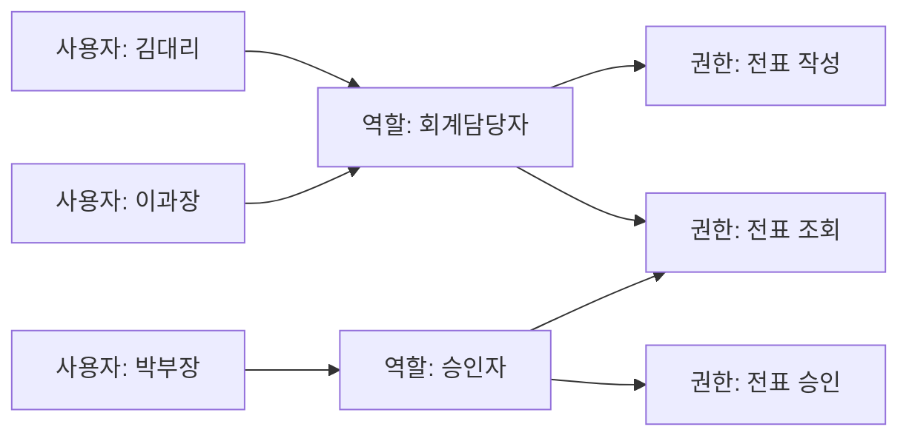

<Callout type="info">
  **이번 문서의 목표:** 접근통제 3요소를 구분하고, DAC·MAC·RBAC 모델을 관리 항목 개수 계산으로 상황에 맞게 판별하며, ACL과 Capability의 방향 차이, 최소권한·직무분리 원칙을 실제 사례에 적용할 수 있게 된다.
</Callout>

## 접근통제 3요소: 식별·인증·인가

21편에서 인증을 다루며 접근통제가 **식별 → 인증 → 인가** 세 단계로 진행된다고 정리했습니다. 이 편은 마지막 단계인 **인가**(Authorization), 즉 "인증된 사람에게 무엇을 허용할지"를 결정하는 정책과 모델을 다룹니다.

- **식별**: "저는 kim123입니다"라는 신원 주장
- **인증**: 그 주장이 사실인지 확인(21편)
- **인가**: 확인된 신원에게 어떤 자원에 어떤 작업(읽기·쓰기·실행·삭제)을 허용할지 결정 — 이 편의 주제

> **쉽게 말하면:** 인증이 "출입증 검사"라면, 인가는 그 출입증으로 **어느 문**까지 열 수 있는지 정하는 규칙입니다.

인가 규칙을 누가, 어떤 기준으로 정하느냐에 따라 접근통제는 크게 DAC·MAC·RBAC 세 모델로 나뉩니다.

## 1. DAC(임의적 접근통제)

**DAC**(Discretionary Access Control, 임의적 접근통제)는 자원의 **소유자**가 자신의 판단(discretion, 재량)에 따라 다른 사용자의 접근 권한을 자유롭게 부여하거나 회수하는 방식입니다.

02·07편에서 다룬 리눅스 파일 권한이 대표적인 DAC 사례입니다. 파일을 만든 사용자가 소유자가 되고, 소유자는 `chmod` 명령으로 다른 사용자·그룹에게 읽기·쓰기·실행 권한을 임의로 내주거나 뺏을 수 있습니다.

### 계산: 리눅스 권한 비트의 전체 조합 수

**왜 필요한가:** DAC의 유연성이 어느 정도의 경우의 수를 만들어 내는지 직접 확인해 보면, 왜 이 방식이 세밀하게 설정할 수 있는 동시에 관리하기 번거로운지 감이 잡힙니다.

리눅스 파일 권한은 소유자(owner)·그룹(group)·기타(other) 세 대상 각각에 읽기(r)·쓰기(w)·실행(x) 3비트를 부여합니다. 각 대상의 3비트는 켜짐/꺼짐 2가지씩이므로 한 대상이 가질 수 있는 조합은 다음과 같습니다.

$$
2^3 = 8
$$

3비트로 표현되는 8가지 값이 8진수 0부터 7까지에 대응합니다(예: `rwx`는 7, `r--`는 4). 세 대상(소유자·그룹·기타)이 각각 독립적으로 8가지를 가질 수 있으므로 파일 하나에 설정 가능한 전체 권한 조합은 다음과 같이 곱해 갑니다.

$$
8 \times 8 = 64
$$

$$
64 \times 8 = 512
$$

**해석:** 리눅스 파일 하나에는 이론적으로 512가지의 서로 다른 권한 조합을 설정할 수 있습니다. 이 유연함이 DAC의 장점이지만, 동시에 소유자 각자가 서로 다른 기준으로 권한을 설정하면 조직 전체의 권한 상태를 한눈에 파악하기 어려워진다는 단점으로 이어집니다.

**DAC의 치명적 약점:** 소유자가 실수하거나 속아서 권한을 잘못 내주면 그대로 뚫립니다. 예를 들어 소유자가 자신도 모르게 트로이목마 프로그램을 실행하면, 그 프로그램은 소유자와 **동일한 권한**으로 동작하며 소유자의 파일 접근 권한을 마음대로 변경할 수 있습니다. 이런 구조적 약점을 보완하기 위해 나온 것이 다음의 MAC입니다.

## 2. MAC(강제적 접근통제)

**MAC**(Mandatory Access Control, 강제적 접근통제)은 자원 소유자가 아니라 **시스템(보안 관리자)이 정한 보안 등급**에 따라 접근 여부가 강제로 결정되는 방식입니다. 일반 사용자는 이 등급을 임의로 바꿀 수 없습니다.

> **쉽게 말하면:** DAC가 "내 물건이니 내가 알아서 빌려준다"라면, MAC은 "국가가 정한 보안 등급표대로만 움직인다"입니다.

MAC은 주체(subject)와 객체(object) 모두에 보안 등급(security label)을 매기고, 그 등급을 비교해 접근을 허용하거나 거부합니다. 대표적인 두 모델은 다음과 같습니다.

- **벨-라파둘라 모델**(Bell-LaPadula, 기밀성 중심): 자신보다 등급이 높은 객체는 읽을 수 없고("No Read Up"), 자신보다 등급이 낮은 객체에는 쓸 수 없습니다("No Write Down"). 높은 등급의 비밀 정보가 낮은 등급으로 새어 나가는 것을 막는 데 초점을 둡니다.
- **비바 모델**(Biba, 무결성 중심): 반대로 자신보다 등급이 낮은 객체는 읽을 수 없고("No Read Down"), 자신보다 등급이 높은 객체에는 쓸 수 없습니다("No Write Up"). 신뢰도가 낮은 정보가 신뢰도 높은 데이터를 오염시키는 것을 막는 데 초점을 둡니다.

### 적용 예시: 등급표로 접근 여부 판정하기

문서에 대외비(1등급)·사내한정(2등급)·기밀(3등급)·1급비밀(4등급) 네 단계 보안등급이 있고, 벨-라파둘라 모델(No Read Up)을 적용한다고 합시다.

| 주체(사용자) 등급 | 객체(문서) 등급 | 읽기 허용 여부 |
|-------------------|------------------|----------------|
| 2등급(사내한정) | 1등급(대외비) | 허용(자신보다 낮거나 같은 등급) |
| 2등급(사내한정) | 3등급(기밀) | 거부(자신보다 높은 등급을 읽으려 함) |
| 4등급(1급비밀) | 2등급(사내한정) | 허용 |
| 3등급(기밀) | 3등급(기밀) | 허용(같은 등급) |

**해석:** MAC에서는 문서 소유자가 누구든 상관없이 오직 등급 비교만으로 결정됩니다. 리눅스에서 이런 강제적 접근통제를 구현한 사례가 **SELinux**이며, 프로세스마다 보안 컨텍스트를 부여해 관리자가 정한 정책을 소유자 판단과 무관하게 강제 적용합니다.

## 3. RBAC(역할기반 접근통제)

**RBAC**(Role-Based Access Control, 역할기반 접근통제)은 사용자에게 직접 권한을 주지 않고, **역할**(role)이라는 중간 단계를 두어 사용자에게는 역할을, 역할에는 권한을 부여하는 방식입니다.

### 계산: 직접 매핑 대 역할 매핑의 관리 항목 수 비교

**왜 필요한가:** RBAC이 실무에서 널리 쓰이는 이유는 이론이 아니라 **관리해야 할 항목의 수**가 극적으로 줄어들기 때문입니다. 사용자 100명, 세부 권한 20개인 조직을 예로 들어 보겠습니다.

**사용자에게 권한을 직접 매핑하는 경우**, 최악의 상황(모든 사용자가 서로 다른 권한 조합을 가질 수 있다고 가정)에는 사용자–권한 쌍을 최대 다음과 같이 관리해야 합니다.

$$
100 \times 20 = 2{,}000
$$

**역할 5개를 도입해 사용자–역할, 역할–권한 두 단계로 나누면** 관리 항목은 다음 두 부분으로 줄어듭니다.

$$
100 \times 1 = 100 \quad (\text{사용자당 역할 1개 배정})
$$

$$
5 \times 20 = 100 \quad (\text{역할 5개 각각에 최대 20개 권한 배정})
$$

두 항목을 더하면,

$$
100 + 100 = 200
$$

**해석:** 직접 매핑 최대 2,000건이 역할을 거치면 200건으로 줄어듭니다. 신입사원이 들어오면 권한 20개를 하나씩 부여하는 대신 역할 하나만 배정하면 되고, 퇴사자는 역할 배정만 해제하면 모든 권한이 한 번에 회수됩니다. **사용자 수가 늘어날수록 이 격차는 더 벌어집니다.**

## DAC·MAC·RBAC 한눈에 비교

| 항목 | DAC | MAC | RBAC |
|------|-----|-----|------|
| 권한 결정 주체 | 자원 소유자 | 시스템(보안 관리자·정책) | 관리자가 정의한 역할 |
| 유연성 | 높음(소유자 재량) | 낮음(등급 규칙 강제) | 중간(역할 재설계로 조정) |
| 변경 용이성 | 소유자가 즉시 변경 | 정책 변경 절차 필요 | 역할–권한 매핑만 수정 |
| 대표 사용 사례 | 개인용 파일시스템 | 군사·정부 기밀 시스템 | 기업 업무 시스템, 클라우드 IAM |
| 약점 | 소유자 실수·기만에 취약 | 유연성 부족, 도입 비용 큼 | 초기 역할 설계가 잘못되면 비효율 |

## 4. 접근통제 기법: ACL과 Capability

DAC·MAC·RBAC이 "누구에게 권한을 어떻게 배정할지"에 대한 **모델**이라면, ACL과 Capability는 그 권한 정보를 실제로 **어디에 저장하느냐**에 대한 **구현 기법**입니다.

- **ACL**(Access Control List, 접근통제목록): **객체 기준**으로 저장합니다. 파일 하나마다 "이 파일에 누가 접근할 수 있는가"를 목록으로 붙여 둡니다. 리눅스의 `getfacl`·`setfacl` 명령으로 다루는 확장 ACL, 11·15편에서 다루는 방화벽 규칙이 대표적인 예입니다.
- **Capability**(권한 티켓): **주체 기준**으로 저장합니다. 사용자나 프로세스 하나마다 "내가 무엇에 접근할 수 있는가"를 증명하는 티켓(토큰)을 들고 다닙니다. 25편에서 다루는 Kerberos 티켓, OAuth 접근 토큰이 이 방식에 해당합니다.

| 구분 | ACL | Capability |
|------|-----|------------|
| 저장 기준 | 객체(자원)마다 | 주체(사용자·프로세스)마다 |
| "이 파일에 누가 접근 가능한가"에 답하기 | 쉬움(목록을 보면 됨) | 어려움(모든 주체의 티켓을 뒤져야 함) |
| "이 사용자가 무엇에 접근 가능한가"에 답하기 | 어려움(모든 객체를 뒤져야 함) | 쉬움(티켓을 보면 됨) |
| 권한 회수 | 목록에서 항목 삭제로 즉시 반영 | 이미 발급된 티켓이 만료되기 전까지 유효할 수 있어 즉시 회수가 더 까다로움 |

**상황별 효율 예시:** 객체(파일·서버) 10개, 주체(직원) 20명인 환경에서 "이 서버에 누가 접속 가능한가"를 자주 확인해야 하는 조직은 객체 10개 기준의 ACL 10개 목록을 관리하는 편이 직관적입니다. 반대로 "이 직원이 전체적으로 무엇에 접근 가능한가"를 한눈에 봐야 하는 조직(예: 퇴사 처리 시 모든 권한 회수)은 주체 20명 기준의 Capability(티켓) 관리가 더 효율적입니다.

**자주 틀리는 점:** ACL과 Capability의 저장 기준 방향을 반대로 외우는 오답이 자주 나옵니다. **ACL은 객체가 "누구를 들일지" 적어 둔 명부, Capability는 주체가 "어디에 들어갈 수 있는지" 들고 다니는 열쇠 꾸러미**로 구분하면 헷갈리지 않습니다.

## 5. 최소권한과 직무분리 원칙의 실제 적용

DAC·MAC·RBAC 중 어떤 모델을 쓰든, 실무에서는 다음 두 원칙을 함께 적용해야 안전합니다.

### 최소권한 원칙(Principle of Least Privilege)

사용자나 프로세스에게 **업무 수행에 꼭 필요한 최소한의 권한만** 부여하는 원칙입니다.

**적용 사례:** 웹 애플리케이션이 데이터베이스에 접속할 때, 관리자(DBA) 계정이 아니라 해당 애플리케이션이 실제로 필요한 테이블의 읽기·쓰기 권한만 가진 전용 계정을 쓰게 합니다. 만약 애플리케이션에 SQL 인젝션 취약점(16편)이 있어 공격자가 이 계정 권한을 탈취해도, 전체 데이터베이스가 아니라 애플리케이션이 원래 접근하던 범위로 피해가 제한됩니다.

**함정:** 최소권한은 "일단 넉넉히 권한을 주고 나중에 필요하면 회수한다"의 정반대입니다. 실무에서 편의상 관리자 권한을 기본값으로 주는 관행이 바로 이 원칙을 정면으로 위반하는 사례입니다.

### 직무분리 원칙(Separation of Duties, SoD)

하나의 중요한 업무를 **한 사람이 처음부터 끝까지 혼자 처리하지 못하도록** 단계를 나눠 서로 다른 사람에게 배정하는 원칙입니다.

**적용 사례:**

- 은행 이체 업무에서 이체를 **신청하는 사람**과 **승인하는 사람**을 분리하면, 내부자 한 명이 단독으로 부정 이체를 완결할 수 없습니다.
- 서버 운영에서 코드를 **작성하는 개발자**와 운영 서버에 **배포하는 담당자**를 분리하면, 개발자가 검증 절차 없이 임의로 운영 데이터베이스를 수정하는 사고를 막을 수 있습니다.

**최소권한과의 관계:** 최소권한이 "한 사람에게 얼마나 많은 권한을 줄 것인가"의 문제라면, 직무분리는 "그 권한을 여러 사람에게 어떻게 나눠 서로 견제하게 할 것인가"의 문제입니다. 두 원칙은 함께 적용될 때 내부자에 의한 단독 부정행위를 가장 효과적으로 억제합니다.

## 자주 틀리는 점 모음

- **MAC 용어 혼동:** 이 편의 MAC(Mandatory Access Control, 강제적 접근통제)은 21편의 MAC(Message Authentication Code, 메시지인증코드)과 **완전히 다른 개념**입니다. 같은 약어가 서로 다른 두 시험 범위에 등장하므로 문맥으로 반드시 구분해야 합니다.
- RBAC을 "사용자에게 권한을 직접 부여하는 방식"이라고 서술하면 틀린 설명입니다. RBAC의 핵심은 **역할이라는 중간 단계**를 거치는 것입니다.
- ACL은 객체 중심, Capability는 주체 중심이라는 저장 기준의 방향을 바꿔 서술하는 함정에 주의합니다.

## 핵심 정리

- 접근통제는 식별·인증·**인가** 순서로 진행되며, 인가 정책을 누가 정하느냐에 따라 DAC·MAC·RBAC로 나뉜다.
- **DAC**는 소유자 재량, **MAC**은 시스템이 강제하는 보안 등급, **RBAC**은 역할이라는 중간 단계를 거치는 방식이다.
- RBAC은 사용자·권한을 직접 매핑할 때보다 관리 항목 수를 크게 줄여 준다(예: 2,000건 → 200건).
- **ACL**은 객체 기준, **Capability**는 주체 기준으로 권한 정보를 저장하는 구현 기법이다.
- **최소권한**(필요한 만큼만 부여)과 **직무분리**(한 사람이 업무를 독점하지 못하게 분산)는 어떤 모델을 쓰든 함께 적용해야 하는 실무 원칙이다.

## 마무리 복습

<Quiz
  questionNumber={1}
  question="접근통제의 세 단계를 순서대로 바르게 나열한 것은?"
  options={['인가 → 인증 → 식별', '식별 → 인가 → 인증', '식별 → 인증 → 인가', '인증 → 식별 → 인가']}
  correctAnswer={3}
  explanation="접근통제는 신원을 주장하는 식별, 그 주장이 사실인지 확인하는 인증, 확인된 신원에게 권한을 결정하는 인가 순서로 진행된다."
  optionExplanations={['순서가 완전히 반대로 나열됐다.', '인증과 인가의 순서가 바뀌었다.', '식별-인증-인가 순서와 정확히 일치한다.', '식별이 가장 먼저 이뤄져야 하는데 인증이 앞에 왔다.']}
/>

<Quiz
  questionNumber={2}
  question="DAC(임의적 접근통제)의 특징으로 가장 적절한 것은?"
  options={['시스템이 정한 보안 등급에 따라 접근이 강제로 결정된다', '자원의 소유자가 재량에 따라 접근 권한을 부여하거나 회수한다', '사용자는 역할을 거쳐서만 권한을 얻을 수 있다', '모든 접근 결정은 중앙 관리자만 내릴 수 있다']}
  correctAnswer={2}
  explanation="DAC는 Discretionary Access Control의 약자로, 자원 소유자의 재량(discretion)에 따라 다른 사용자에게 권한을 자유롭게 부여하거나 회수하는 방식이다."
  optionExplanations={['이는 DAC가 아니라 MAC(강제적 접근통제)에 대한 설명이다.', 'DAC의 정의와 정확히 일치한다.', '역할을 거치는 것은 RBAC의 특징이다.', 'DAC는 중앙 관리자가 아니라 개별 소유자가 결정한다.']}
/>

<Quiz
  questionNumber={3}
  question="벨-라파둘라(Bell-LaPadula) 모델의 접근 규칙으로 옳은 것은?"
  options={['자신보다 등급이 높은 객체를 읽을 수 없고, 낮은 객체에는 쓸 수 없다', '자신보다 등급이 낮은 객체를 읽을 수 없고, 높은 객체에는 쓸 수 없다', '등급과 무관하게 소유자의 재량으로 접근이 결정된다', '역할에 부여된 권한에 따라서만 접근이 결정된다']}
  correctAnswer={1}
  explanation="벨-라파둘라 모델은 기밀성 보호를 목적으로 하며, 자신보다 높은 등급의 정보는 읽을 수 없고(No Read Up) 자신보다 낮은 등급으로는 정보를 내려쓸 수 없다(No Write Down)는 규칙을 따른다."
  optionExplanations={['벨-라파둘라 모델의 No Read Up, No Write Down 규칙과 정확히 일치한다.', '이는 무결성을 보호하는 비바 모델의 규칙이다.', '소유자 재량은 DAC의 특징이며 MAC 모델과는 다르다.', '역할 기반 권한 부여는 RBAC의 특징이다.']}
/>

<Quiz
  questionNumber={4}
  question="사용자 100명, 세부 권한 20개인 조직에서 역할 5개를 도입해 RBAC으로 전환할 때, 관리해야 할 매핑 항목 수(사용자-역할 매핑과 역할-권한 매핑의 합)로 옳은 것은?"
  options={['100개', '120개', '200개', '2,000개']}
  correctAnswer={3}
  explanation="사용자-역할 매핑은 사용자 100명이 각각 역할 1개를 가지므로 100건이고, 역할-권한 매핑은 역할 5개가 각각 권한 20개를 가질 수 있으므로 5x20=100건이다. 두 값을 더하면 200건이다."
  optionExplanations={['사용자-역할 매핑만 계산하고 역할-권한 매핑을 빠뜨린 값이다.', '두 매핑을 단순히 더하지 않고 다른 방식으로 계산한 값으로 근거가 없다.', '100+100=200이라는 계산과 정확히 일치한다.', '이는 역할을 거치지 않고 직접 매핑했을 때의 최대 항목 수다.']}
/>

<Quiz
  questionNumber={5}
  question="ACL(접근통제목록)과 Capability(권한 티켓)의 차이에 대한 설명으로 옳은 것은?"
  options={['ACL은 주체 기준, Capability는 객체 기준으로 저장한다', 'ACL은 객체 기준, Capability는 주체 기준으로 저장한다', '둘 다 객체 기준으로 저장하며 차이가 없다', 'Capability는 반드시 대칭키 암호화가 필요하다']}
  correctAnswer={2}
  explanation="ACL은 객체(자원)마다 접근 가능한 주체 목록을 붙여 두는 방식이고, Capability는 주체(사용자·프로세스)마다 접근 가능한 객체를 증명하는 티켓을 들고 다니는 방식이다."
  optionExplanations={['ACL과 Capability의 기준이 서로 뒤바뀌었다.', 'ACL은 객체 기준, Capability는 주체 기준이라는 정의와 정확히 일치한다.', '두 기법은 저장 기준이 서로 다른 별개의 구현 방식이다.', '암호화 여부는 Capability의 정의에 포함되지 않는다.']}
/>

<Quiz
  questionNumber={6}
  question="이 과목의 21편과 22편에 모두 등장하는 약어 MAC에 대한 설명으로 옳은 것은?"
  options={['21편과 22편의 MAC은 같은 개념을 서로 다른 각도에서 설명한 것이다', '21편의 MAC은 메시지인증코드, 22편의 MAC은 강제적 접근통제로 서로 다른 개념이다', '두 MAC 모두 대칭키 암호화 알고리즘의 한 종류다', '두 MAC 모두 자원 소유자의 재량으로 결정된다']}
  correctAnswer={2}
  explanation="같은 약어 MAC이 21편에서는 Message Authentication Code(메시지인증코드), 22편에서는 Mandatory Access Control(강제적 접근통제)로 전혀 다른 개념을 가리키므로 문맥으로 구분해야 한다."
  optionExplanations={['이름만 같을 뿐 다루는 영역이 완전히 다른 별개의 개념이다.', '두 MAC이 서로 다른 개념이라는 사실을 정확히 짚었다.', '메시지인증코드는 암호화가 아니라 무결성·출처 확인 기법이고, 강제적 접근통제는 암호 알고리즘이 아니다.', '강제적 접근통제는 소유자가 아니라 시스템이 강제로 결정하는 방식이다.']}
/>

<Quiz
  questionNumber={7}
  question="은행에서 이체 신청자와 승인자를 서로 다른 직원으로 분리해 운영하는 것은 어떤 원칙을 적용한 사례인가?"
  options={['최소권한 원칙', '직무분리 원칙', '강제적 접근통제', '역할기반 접근통제의 계층 구조']}
  correctAnswer={2}
  explanation="한 사람이 이체 업무의 신청과 승인을 모두 처리하지 못하도록 단계를 나눠 서로 다른 사람에게 배정하는 것은 직무분리(Separation of Duties) 원칙의 전형적인 적용 사례다."
  optionExplanations={['최소권한은 한 사람에게 부여하는 권한의 양을 제한하는 원칙이며, 업무를 여러 사람에게 나누는 것과는 별개다.', '업무 단계를 나눠 여러 사람에게 배정해 내부자 단독 부정을 막는 직무분리의 정의와 일치한다.', '보안 등급에 따른 강제 접근 결정과는 다른 조직적 통제 방식이다.', '역할의 계층 구조 자체를 설명하는 것이 아니라 업무 절차를 나누는 원칙이다.']}
/>

## 참고 자료

- [한국방송통신전파진흥원 - 정보보안기사 자격정보](https://www.cq.or.kr/qh_quagm01_020.do)
- [itwiki - 정보보안기사 필기 출제기준](https://itwiki.kr/w/정보보안기사_필기_출제기준)
- [공공데이터포털 - 한국방송통신전파진흥원_국가기술자격검정 정보보안 종목 출제기준](https://www.data.go.kr/data/15140079/fileData.do)
