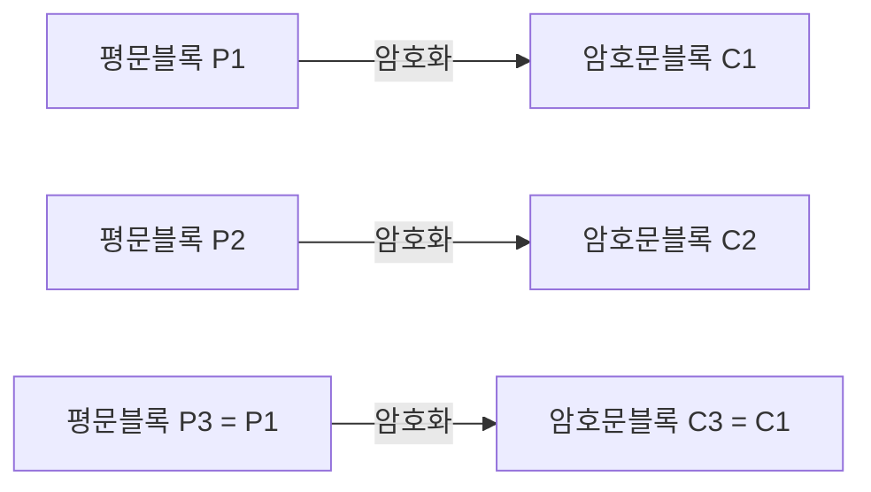

<Callout type="info">
  **이번 문서의 목표:** 대칭키 대 공개키의 키 개수 차이를 계산으로 비교하고, ECB·CBC·CTR 운용모드의 동작을 비트 단위로 직접 따라가며, RSA 키 생성부터 암복호화까지, 디피-헬먼 키교환까지 손으로 계산해 알고리즘별 안전성을 판단할 수 있게 된다.
</Callout>

## 왜 암호 알고리즘을 두 갈래로 나누는가

04편에서 모듈러 연산과 소인수분해·이산로그 문제의 직관을 정리했습니다. 이 편은 그 수학을 실제 암호 알고리즘에 어떻게 적용하는지 다룹니다. 암호 알고리즘은 크게 두 갈래로 나뉩니다.

- **대칭키 암호**(Symmetric-key Cryptography): 암호화와 복호화에 **같은 키**를 씁니다. 연산이 단순해 속도가 빠르지만, 통신 상대마다 안전하게 키를 나눠 가져야 하는 **키 분배 문제**가 있습니다.
- **공개키 암호**(Public-key Cryptography, 비대칭키 암호): 공개키와 개인키를 한 쌍으로 만들어, 공개키는 누구나 알아도 되고 개인키만 비밀로 지킵니다. 키 분배 문제가 훨씬 가볍지만, 수학적 연산이 무거워 대칭키보다 훨씬 느립니다.

> **쉽게 말하면:** 대칭키는 "같은 열쇠 두 개를 만들어 나눠 갖는 것", 공개키는 "누구나 잠글 수 있지만 나만 열 수 있는 자물쇠를 나눠 주는 것"입니다.

### 계산: 대칭키 대 공개키의 키 개수 비교

**왜 필요한가:** 두 방식의 근본적인 차이는 사용자 수가 늘어날 때 관리해야 할 키의 개수가 어떻게 커지는지에서 가장 뚜렷하게 드러납니다.

**대칭키 방식**에서는 통신하려는 모든 사람 쌍마다 서로 다른 키가 하나씩 필요합니다. $n$명이 서로 1:1로 통신하려면 필요한 키 개수는 $n$명 중 2명을 고르는 조합의 수와 같습니다.

$$
\text{키 개수} = \frac{n(n-1)}{2}
$$

- $n$: 전체 사용자 수
- $n-1$: 나 자신을 제외한 상대방 수
- 분모의 $2$: (나, 상대)와 (상대, 나)를 같은 쌍으로 한 번만 세기 위한 나눗셈

$n=100$인 조직을 예로 계산해 봅시다.

$$
\frac{100 \times 99}{2} = \frac{9{,}900}{2} = 4{,}950
$$

100명이 대칭키로 1:1 통신하려면 무려 4,950개의 키가 필요합니다.

**공개키 방식**에서는 사용자마다 자신의 키 쌍(공개키+개인키) 하나씩만 있으면 됩니다. 같은 100명이라면,

$$
100 \times 2 = 200
$$

**해석:** 사용자가 늘어날수록 격차는 더 벌어집니다. $n=1{,}000$이면 대칭키는 $\frac{1{,}000 \times 999}{2} = 499{,}500$개가 필요한 반면, 공개키는 여전히 $1{,}000 \times 2 = 2{,}000$개면 충분합니다. 대칭키는 사용자 수의 **제곱에 비례**해 폭발적으로 늘어나지만, 공개키는 사용자 수에 **비례**해서만 늘어납니다. 이런 이유로 실무에서는 공개키로 대칭키(세션키)를 안전하게 전달한 뒤, 실제 대용량 데이터는 빠른 대칭키로 암호화하는 **하이브리드 방식**을 씁니다(14편의 TLS 핸드셰이크가 바로 이 구조입니다).

## 대칭키 알고리즘: DES·3DES·AES

| 알고리즘 | 블록 크기 | 키 길이 | 내부 구조 | 라운드 수 | 현재 권장 여부 |
|----------|-----------|---------|-----------|-----------|----------------|
| DES | 64비트 | 56비트(전체 64비트 중 8비트는 오류검출용 패리티 비트) | 파이스텔(Feistel) 구조 | 16 | 사용 금지(키 공간이 좁아 전수조사에 취약) |
| 3DES | 64비트 | 최대 168비트(56비트 키 3개) | DES를 암호화-복호화-암호화(EDE) 순으로 3회 반복 | 48(16×3) | 신규 도입 비권장(중간자 공격으로 실질 안전성은 약 112비트 수준) |
| AES | 128비트 | 128 / 192 / 256비트 선택 | SPN(치환-순열 네트워크) 구조 | 10 / 12 / 14 | 현재 표준으로 권장 |

**DES**(Data Encryption Standard)는 1970년대에 표준으로 채택됐지만, 유효 키 길이가 56비트뿐이라 $2^{56}$가지 경우의 수를 전수조사하는 것이 1990년대 후반부터 전용 하드웨어로 현실적인 시간 안에 가능해지면서 더 이상 안전하지 않다고 판정됐습니다.

**3DES**(Triple DES)는 DES를 세 번 반복해 키 길이 문제를 보완하려 했지만, **중간자 만남 공격**(Meet-in-the-Middle Attack)이라는 기법 때문에 실질적인 안전성은 168비트가 아니라 약 112비트 수준으로 평가되며, 처리 속도도 느려 신규 시스템에는 권장되지 않습니다.

**AES**(Advanced Encryption Standard)는 2001년 DES를 대체할 표준으로 선정된 알고리즘입니다. 블록 크기는 128비트로 고정되어 있고, 키 길이는 128·192·256비트 중에서 선택하며 키가 길수록 라운드 수도 늘어납니다. 내부적으로 바이트를 치환하는 단계와 위치를 섞는 단계를 번갈아 반복하는 **SPN**(Substitution-Permutation Network, 치환-순열 네트워크) 구조를 씁니다.

## 블록 암호 운용모드: ECB·CBC·CTR

### 왜 필요한가

DES나 AES 같은 블록 암호는 정해진 크기(예: AES는 128비트)의 블록 하나만 처리할 수 있습니다. 그런데 실제로 암호화할 데이터는 대부분 이 크기보다 훨씬 깁니다. **운용모드**(Mode of Operation)는 여러 개의 블록을 어떤 규칙으로 이어 암호화할지를 정하는 방법입니다.

### ECB(전자코드북 모드)

**ECB**(Electronic Codebook, 전자코드북)는 각 블록을 **완전히 독립적으로** 암호화합니다.

**치명적 약점:** 블록들이 서로 독립적이므로, **같은 내용의 평문 블록은 항상 같은 암호문 블록**으로 변환됩니다. 위 그림처럼 세 번째 블록의 평문이 첫 번째 블록과 같으면 암호문도 그대로 같아집니다. 실제로 배경이 단색인 이미지 파일을 ECB로 암호화하면, 반복되는 픽셀 블록이 반복되는 암호문 블록으로 그대로 남아 원본 이미지의 윤곽이 암호문에서도 비쳐 보이는 유명한 사례가 있습니다. **ECB는 이 성질 때문에 실무에서 그대로 써서는 안 되는 모드**로 취급됩니다.

### CBC(암호블록 연쇄 모드)

**CBC**(Cipher Block Chaining, 암호블록 연쇄)는 이전 블록의 **암호문**을 다음 블록의 **평문**과 먼저 XOR(배타적 논리합)한 뒤 암호화합니다. 맨 처음 블록에는 이전 암호문이 없으므로 무작위로 생성한 **초기화 벡터**(Initialization Vector, IV)를 대신 사용합니다.

$$
C_i = E_K(P_i \oplus C_{i-1}), \quad C_0 = IV
$$

- $E_K$: 키 $K$를 이용한 암호화 함수
- $P_i$: $i$번째 평문 블록
- $C_i$: $i$번째 암호문 블록
- $\oplus$: 비트 단위 XOR 연산

**손계산으로 확인해 봅시다.** 실제 AES 내부는 여러 단계의 치환·순열을 거치는 복잡한 연산이라 손으로 계산할 수 없으므로, 여기서는 CBC의 "이전 암호문이 다음 블록에 섞여 들어간다"는 **연쇄 구조**만 보여 주기 위해 암호화 함수를 극도로 단순화해 $E_K(x) = x \oplus K$(그냥 키와 XOR 한 번)로 가정합니다. 4비트 블록, 키 $K=0011$, 초기화 벡터 $IV=1010$, 평문 $P_1=1100$, $P_2=1001$이라고 합시다.

**1블록 암호화.** 먼저 $P_1$과 $IV$를 XOR합니다.

$$
P_1 \oplus IV = 1100 \oplus 1010 = 0110
$$

그 결과를 키와 XOR해 암호문을 얻습니다.

$$
C_1 = 0110 \oplus 0011 = 0101
$$

**2블록 암호화.** $P_2$를 앞서 나온 암호문 $C_1$과 XOR합니다.

$$
P_2 \oplus C_1 = 1001 \oplus 0101 = 1100
$$

$$
C_2 = 1100 \oplus 0011 = 1111
$$

**복호화로 검산해 봅시다.** 복호화는 같은 과정을 거꾸로 밟습니다.

$$
C_1 \oplus K = 0101 \oplus 0011 = 0110
$$

$$
0110 \oplus IV = 0110 \oplus 1010 = 1100 = P_1
$$

원래 평문 $P_1=1100$이 그대로 복원됩니다. 두 번째 블록도 확인해 보면,

$$
C_2 \oplus K = 1111 \oplus 0011 = 1100
$$

$$
1100 \oplus C_1 = 1100 \oplus 0101 = 1001 = P_2
$$

$P_2=1001$도 정확히 복원됩니다.

**해석:** 이 단순화된 모델만으로도 CBC의 핵심 성질이 그대로 드러납니다. 두 번째 블록을 암호화할 때 **첫 번째 블록의 암호문 $C_1$이 섞여 들어가므로**, 설령 $P_1$과 $P_2$가 같은 값이라도 $C_1$이 다르면 $C_2$도 달라집니다. 그리고 $IV$가 매번 다르면 완전히 같은 평문을 암호화해도 전혀 다른 암호문이 나옵니다. **IV는 비밀로 지킬 필요는 없지만(암호문과 함께 전송해도 됩니다), 예측 불가능한 값이어야 합니다.** 예측 가능한 IV를 재사용하면 ECB와 비슷하게 초기 블록의 패턴이 노출될 수 있습니다.

**CBC의 구조적 특징:** 각 블록의 암호화가 이전 블록의 결과에 의존하므로 **암호화는 순서대로만 할 수 있어 병렬화가 불가능**합니다. 반대로 복호화는 모든 암호문 블록이 이미 갖춰져 있으므로 병렬로 처리할 수 있습니다.

### CTR(카운터 모드)

**CTR**(Counter, 카운터) 모드는 평문을 직접 암호화하지 않고, **일회용 값(nonce)과 순차적으로 증가하는 카운터를 암호화해 만든 키스트림**을 평문과 XOR합니다.

$$
C_i = P_i \oplus E_K(\text{Nonce} \Vert \text{Counter}_i)
$$

**같은 단순화 모델**($E_K(x) = x \oplus K$)로 계산해 보겠습니다. 카운터를 0, 1, 2, ...로 두고 $K=0011$을 그대로 사용합니다.

$$
\text{Counter}_0 = 0000, \quad \text{키스트림}_0 = 0000 \oplus 0011 = 0011
$$

$$
C_1 = P_1 \oplus \text{키스트림}_0 = 1100 \oplus 0011 = 1111
$$

$$
\text{Counter}_1 = 0001, \quad \text{키스트림}_1 = 0001 \oplus 0011 = 0010
$$

$$
C_2 = P_2 \oplus \text{키스트림}_1 = 1001 \oplus 0010 = 1011
$$

복호화도 같은 키스트림을 만들어 암호문과 XOR하면 그대로 평문이 나옵니다.

$$
C_1 \oplus \text{키스트림}_0 = 1111 \oplus 0011 = 1100 = P_1
$$

**해석:** CTR 모드는 각 블록의 키스트림이 **카운터 값에만 의존**하고 다른 블록의 암호문과는 무관하므로, 암호화도 복호화도 모든 블록을 동시에 병렬 처리할 수 있습니다. 그리고 미리 카운터 값에 대한 키스트림을 계산해 둘 수 있어(사전 계산 가능) 속도가 중요한 환경에 유리합니다. 다만 **같은 (키, 카운터) 조합을 두 번 쓰면 두 키스트림이 같아져 두 평문을 XOR한 값이 그대로 노출**되므로, 카운터·논스 값의 재사용을 절대 허용해서는 안 됩니다.

### 세 모드 한눈에 비교

| 모드 | 동일 평문 블록 → 동일 암호문 | 암호화 병렬화 | 복호화 병렬화 | 에러 전파 |
|------|-------------------------------|----------------|----------------|-----------|
| ECB | 그렇다(치명적 약점) | 가능 | 가능 | 해당 블록에만 국한 |
| CBC | 아니다(IV·이전 블록 덕분) | 불가능 | 가능 | 해당 블록과 다음 블록에 영향 |
| CTR | 아니다(카운터 덕분) | 가능 | 가능 | 해당 블록에만 국한 |

**자주 틀리는 점:** "ECB가 가장 단순하니까 기본값으로 써도 된다"는 생각이 대표적인 함정입니다. 단순함과 안전성은 다른 문제이며, ECB는 시험에서도 실무에서도 "쓰면 안 되는 모드"로 다뤄집니다.

## 공개키 암호: RSA 계산

### 원리

**RSA**는 두 큰 소수를 곱하는 것은 쉽지만, 그 곱을 다시 원래의 두 소수로 분해하는 **소인수분해**는 수가 커질수록 극도로 어려워진다는 사실에 기반합니다. 04편에서 다룬 소수·오일러 파이 함수($\varphi$, 파이)를 그대로 사용합니다.

### 계산: 작은 소수로 RSA 키 생성부터 암복호화까지

**1단계 — 서로 다른 두 소수를 고른다.** 실제로는 수백 자리 소수를 쓰지만, 손계산을 위해 $p=7$, $q=11$을 고릅니다.

**2단계 — 두 소수를 곱해 $n$을 만든다.**

$$
n = p \times q = 7 \times 11 = 77
$$

**3단계 — 오일러 파이 함수 값을 구한다.** $\varphi(n)$은 $n$과 서로소인 1부터 $n$까지의 정수 개수이며, $p$, $q$가 소수일 때는 다음 공식으로 바로 구합니다.

$$
\varphi(n) = (p-1)(q-1) = 6 \times 10 = 60
$$

**4단계 — 공개 지수 $e$를 고른다.** $1 < e < 60$이면서 $\varphi(n)=60$과 **서로소**(최대공약수가 1)인 값을 고릅니다. $e=13$을 골라 유클리드 호제법으로 확인해 보면,

$$
60 = 4 \times 13 + 8, \quad 13 = 1 \times 8 + 5, \quad 8 = 1 \times 5 + 3
$$

$$
5 = 1 \times 3 + 2, \quad 3 = 1 \times 2 + 1, \quad 2 = 2 \times 1 + 0
$$

나머지가 0이 될 때까지 나눈 결과 마지막 나머지가 1이므로 $\gcd(13, 60)=1$, 즉 13과 60은 서로소입니다. **공개키는 $(e=13, n=77)$**이 됩니다.

**5단계 — 개인 지수 $d$를 구한다.** $e \times d \equiv 1 \pmod{60}$을 만족하는 $d$를 찾습니다. $d=37$을 대입하면,

$$
13 \times 37 = 481 = 8 \times 60 + 1
$$

나머지가 1이므로 조건을 만족합니다. **개인키는 $(d=37, n=77)$**이 됩니다.

**6단계 — 평문을 암호화한다.** 평문을 숫자 $m=5$라고 하면 암호문은 $c = m^e \bmod n$입니다. 지수 13이 크므로 **반복제곱**(지수를 2배씩 늘려 가며 계산)으로 구합니다.

$$
5^2 = 25
$$

$$
5^4 = 25^2 = 625 \equiv 9 \pmod{77} \quad (625 = 8 \times 77 + 9)
$$

$$
5^8 = 9^2 = 81 \equiv 4 \pmod{77} \quad (81 = 1 \times 77 + 4)
$$

지수 13을 2의 거듭제곱의 합으로 나타내면 $13 = 8+4+1$이므로,

$$
5^{13} = 5^8 \times 5^4 \times 5^1 \equiv 4 \times 9 \times 5 = 180 \equiv 26 \pmod{77}
$$

$180 = 2 \times 77 + 26$이므로 **암호문은 $c=26$**입니다.

**7단계 — 암호문을 복호화한다.** 개인키로 $m = c^d \bmod n = 26^{37} \bmod 77$을 계산합니다. 같은 반복제곱 방식을 씁니다.

$$
26^2 = 676 \equiv 60 \pmod{77}, \quad 26^4 = 60^2 = 3{,}600 \equiv 58 \pmod{77}
$$

$$
26^8 = 58^2 = 3{,}364 \equiv 53 \pmod{77}, \quad 26^{16} = 53^2 = 2{,}809 \equiv 37 \pmod{77}
$$

$$
26^{32} = 37^2 = 1{,}369 \equiv 60 \pmod{77}
$$

지수 37을 2의 거듭제곱의 합으로 나타내면 $37 = 32+4+1$이므로,

$$
26^{37} = 26^{32} \times 26^4 \times 26^1 \equiv 60 \times 58 \times 26 \pmod{77}
$$

$$
60 \times 58 = 3{,}480 \equiv 15 \pmod{77}, \quad 15 \times 26 = 390 \equiv 5 \pmod{77}
$$

**복호화 결과 $m=5$로, 처음 암호화하기 전의 평문과 정확히 일치합니다.**

**실무에서의 최적화:** 개인키 보유자는 $p$, $q$를 알고 있으므로 **중국인의 나머지 정리**(Chinese Remainder Theorem, CRT)를 이용해 $n$을 직접 쓰는 것보다 훨씬 빠르게 같은 결과를 얻을 수 있습니다. 원리 이해에는 위의 직접 계산 방식으로 충분하며, CRT는 실무 구현 최적화 기법으로만 알아 둡니다.

### 실무에서 쓰는 $e$ 값

시험에서는 작은 $e$ 값으로 계산 문제를 내지만, 실제 RSA 구현에서는 $e=65537$($=2^{16}+1$)을 관행적으로 사용합니다. 이 값은 이진수로 표현했을 때 1인 비트가 2개뿐이어서 반복제곱 연산 횟수가 적어 계산이 빠르고, $e=3$처럼 지나치게 작은 값을 쓸 때 발생할 수 있는 특정 공격(같은 평문을 여러 수신자의 서로 다른 공개키로 암호화했을 때 성립하는 공격 등)을 피할 수 있어 널리 채택됐습니다.

**RSA의 안전성**은 $n$을 소인수분해해서 $p$, $q$를 알아내는 것이 얼마나 어려운지에 달려 있습니다. 그래서 RSA의 안전성은 흔히 $n$의 비트 수로 표현하며, 현재는 최소 2048비트 이상을 권장합니다.

## 이산로그 기반 암호: 디피-헬먼 키교환

### 원리

**디피-헬먼**(Diffie-Hellman, DH) 키교환은 공개된 소수 $p$와 **원시근**(generator) $g$를 이용해, 두 사람이 도청 위험이 있는 통신로로 값을 주고받으면서도 도청자는 알아낼 수 없는 **공유 비밀키**를 만드는 방법입니다. 안전성은 04편에서 다룬 **이산로그 문제**(공개된 값에서 지수를 역산하기 어려운 문제)에 기반합니다.

### 계산: 공유키가 실제로 일치하는지 확인하기

$p=23$, $g=5$가 공개돼 있다고 합시다. 앨리스는 비밀 지수 $a=6$을, 밥은 비밀 지수 $b=15$를 각자 고른 뒤 아무에게도 알리지 않습니다.

**앨리스의 공개값.**

$$
A = g^a \bmod p = 5^6 \bmod 23
$$

$$
5^2 = 25 \equiv 2 \pmod{23}, \quad 5^4 = 2^2 = 4
$$

$$
5^6 = 5^4 \times 5^2 \equiv 4 \times 2 = 8 \pmod{23}
$$

앨리스는 $A=8$을 공개 채널로 전송합니다.

**밥의 공개값.**

$$
B = g^b \bmod p = 5^{15} \bmod 23
$$

$15=8+4+2+1$이고 $5^1=5$, $5^2=2$, $5^4=4$, $5^8=4^2=16$이므로,

$$
5^{15} = 5^8 \times 5^4 \times 5^2 \times 5^1 \equiv 16 \times 4 \times 2 \times 5 \pmod{23}
$$

$$
16 \times 4 = 64 \equiv 18, \quad 18 \times 2 = 36 \equiv 13, \quad 13 \times 5 = 65 \equiv 19 \pmod{23}
$$

밥은 $B=19$를 공개 채널로 전송합니다.

**공유키 계산.** 앨리스는 밥의 공개값 $B$를 받아 자신의 비밀 지수로 거듭제곱하고, 밥은 앨리스의 공개값 $A$를 받아 자신의 비밀 지수로 거듭제곱합니다.

앨리스: $B^a \bmod p = 19^6 \bmod 23$

$$
19^2 = 361 \equiv 16 \pmod{23}, \quad 19^4 = 16^2 = 256 \equiv 3 \pmod{23}
$$

$$
19^6 = 19^4 \times 19^2 \equiv 3 \times 16 = 48 \equiv 2 \pmod{23}
$$

밥: $A^b \bmod p = 8^{15} \bmod 23$

$$
8^2 = 64 \equiv 18 \pmod{23}, \quad 8^4 = 18^2 = 324 \equiv 2 \pmod{23}, \quad 8^8 = 2^2 = 4
$$

$$
8^{15} = 8^8 \times 8^4 \times 8^2 \times 8^1 \equiv 4 \times 2 \times 18 \times 8 \pmod{23}
$$

$$
4 \times 2 = 8, \quad 8 \times 18 = 144 \equiv 6, \quad 6 \times 8 = 48 \equiv 2 \pmod{23}
$$

**두 사람이 각자 독립적으로 계산했는데도 공유키가 2로 정확히 일치합니다.**

**해석:** 도청자는 통신로에서 $p=23$, $g=5$, $A=8$, $B=19$를 모두 볼 수 있지만, 비밀 지수 $a$나 $b$를 알아내려면 이산로그 문제를 풀어야 합니다. 여기서는 $p$가 23으로 작아 실제로는 순식간에 무차별대입으로 뚫리지만, 실무에서는 $p$가 수백 자리 숫자라 계산이 사실상 불가능합니다. 이 예시는 교육 목적으로 작은 수를 쓴 것일 뿐, 원리는 실제 디피-헬먼과 동일합니다.

**자주 틀리는 점:** 디피-헬먼은 **키를 안전하게 "교환"하는 프로토콜**이지, 메시지 자체를 암호화하거나 상대가 진짜인지 인증하는 기능은 없습니다. 중간자가 앨리스와 밥 사이에 끼어들어 각각과 따로 키를 교환하는 **중간자 공격**(Man-in-the-Middle Attack)에 취약하며, 실무에서는 14편에서 다루는 인증서 기반 인증으로 이 약점을 보완합니다.

## 타원곡선 암호(ECC)의 원리

**타원곡선 암호**(Elliptic Curve Cryptography, ECC)는 타원곡선 위의 점들 사이에 정의된 **점 덧셈** 연산을 이용합니다. 어떤 점을 몇 번 더했는지(스칼라 곱)를 알면 결과 점을 쉽게 계산할 수 있지만, 반대로 결과 점만 보고 몇 번 더했는지 역산하는 **타원곡선 이산로그 문제**(ECDLP)는 매우 어렵습니다. 이 학습 방향에서는 수학적 유도(타원곡선 위 군 연산의 증명)까지는 다루지 않고, 필기시험에 필요한 개념과 실무적 의미까지만 짚습니다.

ECC의 실무적 가치는 **같은 안전성을 훨씬 짧은 키 길이로 달성**한다는 데 있습니다.

## 알고리즘별 키 길이·안전성 한눈에 비교

| 대칭키 기준 안전성 | 대칭키 알고리즘 | RSA 권장 키 길이 | ECC 권장 키 길이 |
|---------------------|------------------|-------------------|-------------------|
| 112비트 | 3DES(사실상 최소 수준) | 2048비트 | 224비트 |
| 128비트 | AES-128 | 3072비트 | 256비트 |
| 192비트 | AES-192 | 7680비트 | 384비트 |
| 256비트 | AES-256 | 15360비트 | 521비트 |

**해석:** 같은 128비트 수준의 안전성을 얻으려면 RSA는 3072비트나 되는 큰 수를 다뤄야 하지만, ECC는 256비트만으로 충분합니다. 이 때문에 계산 자원과 배터리가 제한적인 모바일 기기·IoT 센서에서는 ECC가 선호됩니다.

## 자주 틀리는 점

- 대칭키 개수 공식을 $n(n-1)/2$가 아니라 $n^2$으로 잘못 계산하는 실수가 잦습니다. 자기 자신과의 쌍, 그리고 중복으로 세는 쌍을 빼야 한다는 점을 기억해야 합니다.
- "ECB가 가장 단순한 모드이므로 실무 기본값이다"라는 서술은 틀렸습니다. ECB는 동일 평문 블록이 동일 암호문으로 드러나는 구조적 결함 때문에 실무에서 배제됩니다.
- 디피-헬먼을 "암호화 알고리즘"이라 부르는 것은 틀린 표현입니다. 메시지를 암호화하는 것이 아니라 **키를 교환**하는 프로토콜입니다.
- RSA에서 공개 지수 $e$를 $\varphi(n)$과 서로소가 아닌 값으로 고르면 개인 지수 $d$가 존재하지 않는다는 점을 놓치는 실수가 있습니다.

## 핵심 정리

- 대칭키는 사용자 수 $n$에 대해 $n(n-1)/2$개의 키가, 공개키는 $2n$개의 키가 필요해 사용자가 늘수록 격차가 커진다.
- **AES**는 128비트 고정 블록에 128/192/256비트 키를 쓰는 SPN 구조로 현재 표준이며, **DES·3DES**는 키 공간·연산 속도 문제로 신규 도입에 권장되지 않는다.
- **ECB**는 동일 평문 블록이 동일 암호문으로 노출돼 사용 금지, **CBC**는 이전 암호문을 다음 평문과 XOR해 연쇄시키지만 암호화 병렬화가 불가능, **CTR**은 카운터 기반 키스트림으로 암복호화 모두 병렬화가 가능하다.
- **RSA**는 $n=pq$, $\varphi(n)=(p-1)(q-1)$, $ed \equiv 1 \pmod{\varphi(n)}$ 관계로 키를 만들고, 암호화·복호화 모두 모듈러 거듭제곱으로 계산한다.
- **디피-헬먼**은 이산로그 문제에 기반해 두 사람이 공유키를 만들지만, 암호화·인증 기능은 없어 중간자 공격에 취약하다.
- **ECC**는 타원곡선 이산로그 문제에 기반해 RSA보다 훨씬 짧은 키 길이로 같은 안전성을 제공한다.

## 마무리 복습

<Quiz
  questionNumber={1}
  question="사용자 1,000명이 대칭키로 1:1 통신을 하려 할 때 필요한 키의 개수로 옳은 것은?"
  options={['1,000개', '2,000개', '499,500개', '1,000,000개']}
  correctAnswer={3}
  explanation="대칭키 방식은 사용자 쌍마다 키가 하나씩 필요하므로 n(n-1)/2 공식을 적용한다. 1,000x999를 2로 나누면 499,500이다."
  optionExplanations={['공개키 방식에서 사용자 수와 같은 값이며 대칭키 계산이 아니다.', '공개키 방식에서 사용자당 공개키+개인키 2개를 곱한 값이다.', 'n(n-1)/2 공식을 정확히 적용한 값이다.', 'n의 제곱을 그대로 쓴 값으로 자기 자신과 중복 쌍을 빼지 않았다.']}
/>

<Quiz
  questionNumber={2}
  question="AES에 대한 설명으로 옳은 것은?"
  options={['블록 크기가 가변적이며 파이스텔 구조를 사용한다', '블록 크기는 128비트로 고정되며 SPN 구조를 사용한다', '키 길이는 56비트로 고정된다', '3번 반복 암호화하는 구조를 갖는다']}
  correctAnswer={2}
  explanation="AES는 블록 크기 128비트로 고정되어 있고 치환-순열 네트워크(SPN) 구조를 사용하며, 키 길이는 128·192·256비트 중에서 선택한다."
  optionExplanations={['블록 크기는 고정되어 있고 파이스텔 구조는 DES의 특징이다.', 'AES의 블록 크기와 내부 구조를 정확히 설명했다.', '56비트는 DES의 키 길이이며 AES는 최소 128비트다.', '3번 반복 암호화는 3DES의 구조다.']}
/>

<Quiz
  questionNumber={3}
  question="ECB 운용모드의 가장 치명적인 약점으로 옳은 것은?"
  options={['암호화 속도가 다른 모드보다 느리다', '동일한 평문 블록이 항상 동일한 암호문 블록으로 변환돼 패턴이 노출된다', '복호화를 병렬로 처리할 수 없다', '카운터 값이 재사용되면 평문이 그대로 노출된다']}
  correctAnswer={2}
  explanation="ECB는 각 블록을 독립적으로 암호화하므로 같은 평문 블록은 항상 같은 암호문 블록이 되어, 반복되는 패턴이 암호문에도 그대로 드러난다."
  optionExplanations={['ECB는 오히려 병렬화가 가능해 속도 면에서는 불리하지 않다.', 'ECB의 구조적 결함을 정확히 설명했다.', 'ECB는 각 블록이 독립적이라 복호화도 병렬 처리가 가능하다.', '카운터 재사용 취약점은 CTR 모드의 특징이다.']}
/>

<Quiz
  questionNumber={4}
  question="CBC 운용모드에서 초기화 벡터(IV)에 대한 설명으로 옳은 것은?"
  options={['IV는 반드시 비밀로 유지해야 하며 노출되면 전체 암호문이 무의미해진다', 'IV는 비밀일 필요는 없지만 예측 불가능한 값이어야 한다', 'IV는 두 번째 블록부터만 사용된다', 'IV 값이 같아도 안전성에는 영향이 없다']}
  correctAnswer={2}
  explanation="IV는 암호문과 함께 전송해도 되므로 비밀로 지킬 필요는 없지만, 예측 가능한 값을 반복 사용하면 초기 블록의 패턴이 노출될 수 있어 예측 불가능해야 한다."
  optionExplanations={['IV는 비밀일 필요가 없으며 암호문과 함께 공개적으로 전송된다.', 'IV의 성질을 정확히 설명했다.', 'IV는 첫 번째 블록의 암호화에 바로 사용된다.', '예측 가능한 IV를 재사용하면 패턴이 노출될 수 있어 안전성에 영향을 준다.']}
/>

<Quiz
  questionNumber={5}
  question="p=7, q=11인 RSA에서 오일러 파이 함수 값과 이를 이용한 공개키 조건으로 옳은 것은?"
  options={['φ(n)=17이며 공개키 e는 17과 서로소여야 한다', 'φ(n)=60이며 공개키 e는 60과 서로소여야 한다', 'φ(n)=77이며 공개키 e는 77과 서로소여야 한다', 'φ(n)=66이며 공개키 e는 66과 서로소여야 한다']}
  correctAnswer={2}
  explanation="φ(n)=(p-1)(q-1)=6x10=60이며, 공개 지수 e는 1보다 크고 φ(n)보다 작으면서 φ(n)과 최대공약수가 1인 값(서로소)이어야 한다."
  optionExplanations={['p와 q를 더한 값이며 오일러 파이 함수 공식과 다르다.', '(p-1)(q-1)=6x10=60을 정확히 계산한 값이다.', 'n=pq=77과 φ(n)을 혼동한 값이다.', 'p와 q를 그대로 곱한 값에서 1씩 뺀 값을 더한 것으로 공식과 다르다.']}
/>

<Quiz
  questionNumber={6}
  question="p=7, q=11, n=77, e=13, d=37인 RSA에서 평문 m=5를 암호화한 결과 c로 옳은 것은?"
  options={['c=5', 'c=13', 'c=26', 'c=37']}
  correctAnswer={3}
  explanation="c=5의13제곱 mod 77을 반복제곱으로 계산하면 5^2=25, 5^4=9, 5^8=4이며 13=8+4+1이므로 5^13=4x9x5=180이고 180 mod 77=26이다."
  optionExplanations={['평문 값을 그대로 쓴 것으로 암호화 연산이 반영되지 않았다.', '공개 지수 e의 값을 그대로 쓴 것으로 암호화 결과가 아니다.', '반복제곱 계산 결과와 정확히 일치한다.', '개인 지수 d의 값을 그대로 쓴 것으로 암호화 결과가 아니다.']}
/>

<Quiz
  questionNumber={7}
  question="디피-헬먼(Diffie-Hellman) 키교환에 대한 설명으로 옳은 것은?"
  options={['메시지를 직접 암호화하는 대칭키 알고리즘이다', '상대방의 신원을 인증하는 기능을 기본으로 제공한다', '이산로그 문제에 기반해 공유 비밀키를 만들지만 암호화나 인증 기능은 없다', '타원곡선 위의 점 연산을 이용하는 알고리즘이다']}
  correctAnswer={3}
  explanation="디피-헬먼은 공개된 소수와 원시근을 이용해 이산로그 문제의 어려움에 기반한 공유 비밀키를 만드는 키교환 프로토콜일 뿐, 메시지 암호화나 상대방 인증 기능은 제공하지 않아 중간자 공격에 취약하다."
  optionExplanations={['디피-헬먼은 암호화 알고리즘이 아니라 키교환 프로토콜이다.', '인증 기능이 없어 중간자 공격에 취약한 것이 디피-헬먼의 대표적 약점이다.', '이산로그 문제에 기반한다는 설명과 인증 기능이 없다는 설명이 정확하다.', '타원곡선 점 연산을 이용하는 것은 ECC이며 디피-헬먼의 고전적 형태는 이산로그 문제에 기반한다.']}
/>

## 참고 자료

- [itwiki - 정보보안기사 필기 출제기준](https://itwiki.kr/w/정보보안기사_필기_출제기준)
- [공공데이터포털 - 한국방송통신전파진흥원_국가기술자격검정 정보보안 종목 출제기준](https://www.data.go.kr/data/15140079/fileData.do)
- [NIST SP 800-57 Part 1 - Recommendation for Key Management](https://csrc.nist.gov/pubs/sp/800/57/pt1/r5/final)
