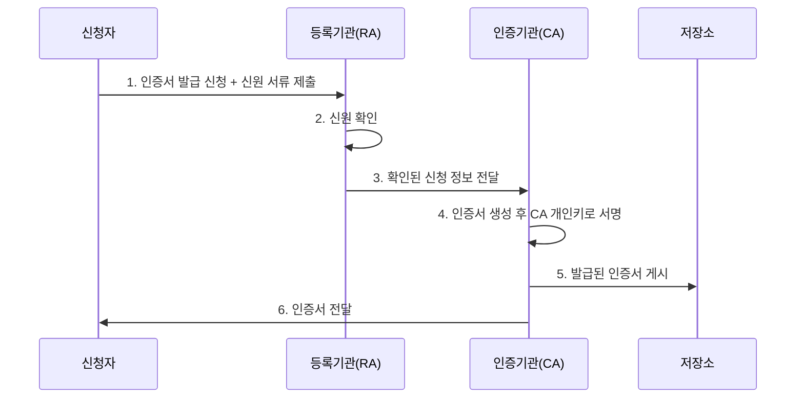

<Callout type="info">
  **이번 문서의 목표:** 해시함수의 충돌저항성을 생일공격 계산으로 이해하고, 23편의 RSA 키를 그대로 이용해 전자서명 생성·검증을 손으로 계산하며, PKI를 구성하는 CA·RA의 역할과 CRL·OCSP로 인증서 폐지를 확인하는 절차를 설명할 수 있게 된다.
</Callout>

## 해시함수: 데이터의 지문을 만드는 함수

### 왜 필요한가

파일을 다운로드했을 때 전송 중 손상되지 않았는지, 비밀번호를 저장할 때 원문을 그대로 두지 않고도 나중에 맞는지 확인하려면 어떻게 해야 할까요. **해시함수**(Hash Function)는 임의 길이의 입력을 받아 **고정된 길이**의 짧은 값(다이제스트, digest)을 출력하는 함수로, 이런 문제들을 해결하는 재료가 됩니다.

> **쉽게 말하면:** 아무리 긴 문서라도 한 번 넣으면 항상 같은 길이의 "지문"이 나오는 기계입니다. 원본이 한 글자만 달라져도 지문은 완전히 달라집니다.

### 해시함수가 갖춰야 할 성질

- **일방향성**(One-way property): 다이제스트를 보고 원래 입력을 역산하기 어렵습니다.
- **충돌저항성**(Collision Resistance): 같은 다이제스트를 만드는 서로 다른 두 입력을 찾기 어렵습니다. 이 절에서 계산으로 확인합니다.
- **눈사태 효과**(Avalanche Effect): 입력을 한 비트만 바꿔도 출력이 완전히 딴판으로 바뀝니다.

### SHA 계열 비교

| 알고리즘 | 출력 길이 | 현재 상태 |
|----------|-----------|-----------|
| SHA-1 | 160비트 | 충돌 사례가 실제로 발견되어 폐기 권고 |
| SHA-2(SHA-256) | 256비트 | 현재 널리 쓰이는 표준 |
| SHA-2(SHA-512) | 512비트 | 더 높은 안전성이 필요한 경우 사용 |
| SHA-3 | 224/256/384/512비트 선택 | SHA-2와 내부 구조가 전혀 다른 대체 표준(Keccak 기반) |

**SHA-1**은 2005년경부터 이론적 취약점이 제기됐고, 2017년 실제로 서로 다른 두 파일에서 동일한 SHA-1 다이제스트가 발견되는 충돌 사례가 공개되면서 신규 시스템에서 사용이 금지됐습니다. **SHA-2**가 현재 실무 표준이며, 내부 구조 자체를 SHA-2와 다르게 설계한 **SHA-3**가 만일의 구조적 취약점에 대비한 대체재로 표준화돼 있습니다.

## 계산: 충돌저항성과 생일공격

### 생일 역설의 직관

**왜 필요한가:** 해시 다이제스트가 몇 비트여야 충분히 안전한지 정하려면, 공격자가 충돌을 찾는 데 평균적으로 몇 번의 시도가 필요한지부터 알아야 합니다.

**생일 역설**(Birthday Paradox)은 "한 방에 사람이 23명만 모여도 그중 두 명의 생일이 같을 확률이 50퍼센트를 넘는다"는 확률론적 결과입니다. 직관과 다르게 이 확률이 빨리 커지는 이유는, "특정 한 사람과 생일이 같은 사람"을 찾는 것이 아니라 **아무 두 사람 사이의 일치**를 찾는 것이라 비교해야 할 쌍의 수가 사람 수의 제곱에 가깝게 늘어나기 때문입니다.

해시 충돌을 찾는 문제도 똑같은 구조입니다. 다이제스트가 특정한 값 하나와 같은 입력을 찾는 **원상 공격**(Preimage Attack)은 출력 공간 전체($2^n$, $n$은 다이제스트 비트 수)를 뒤져야 하지만, 아무 두 입력이나 서로 같은 다이제스트를 내면 되는 **충돌 공격**(생일공격)은 그보다 훨씬 적은 시도로 성공합니다.

### 작은 숫자로 직접 계산하기

**왜 작은 숫자로 확인하는가:** 실제 해시(160비트, 256비트)는 손으로 계산하기엔 너무 크므로, 출력이 8비트(256가지 값)뿐인 아주 작은 가상의 해시함수로 두 공격의 난이도 차이를 직접 비교해 봅니다.

전체 출력 공간의 크기는 다음과 같습니다.

$$
N = 2^8 = 256
$$

**원상 공격**은 평균적으로 전체 공간의 절반을 뒤져야 목표 다이제스트와 같은 값을 찾습니다.

$$
\text{원상 공격 평균 시도 횟수} \approx \frac{N}{2} = \frac{256}{2} = 128
$$

**생일공격(충돌 공격**)은 잘 알려진 근사식 $1.25\sqrt{N}$번의 시도만으로 50퍼센트 확률로 충돌을 찾을 수 있습니다.

$$
\sqrt{N} = \sqrt{256} = 16
$$

$$
1.25 \times 16 = 20
$$

**해석:** 같은 8비트 해시라도 원상 공격은 평균 128번이 필요한 반면, 생일공격은 약 20번이면 충분합니다. 시도 횟수가 열 배 가까이 줄어드는 셈입니다. 일반화하면 $n$비트 해시의 충돌저항성은 원상 저항성의 절반인 $2^{n/2}$번의 시도 수준으로 떨어집니다. 그래서 **SHA-1의 160비트는 충돌저항성 기준으로 $2^{80}$번**에 해당하는데, 이 숫자는 오늘날 대규모 병렬 연산 자원으로는 실제로 도달 가능한 수준이 되어 SHA-1이 폐기된 것입니다. 반면 **SHA-256은 충돌저항성 기준으로 $2^{128}$번**이 필요해 현재 계산 능력으로는 사실상 불가능한 수준을 유지하고 있습니다.

**자주 틀리는 점:** 해시의 안전성을 이야기할 때 원상 공격 난이도($2^n$)와 충돌 공격 난이도($2^{n/2}$)를 같은 것으로 착각하는 경우가 많습니다. **다이제스트 길이가 같아도 두 공격의 실제 난이도는 다르며, 시험에서는 주로 충돌저항성 기준(생일공격 기준)으로 안전성을 판단**합니다.

## 전자서명: 공개키를 반대 방향으로 사용하기

### 원리

**전자서명**(Digital Signature)은 공개키 암호를 **반대 방향**으로 사용합니다. 23편의 암호화에서는 상대방의 **공개키**로 잠그고 상대방의 **개인키**로 여는 방식으로 기밀성을 얻었습니다. 서명에서는 반대로 서명자가 자신의 **개인키**로 값을 만들고, 누구나 서명자의 **공개키**로 그 값을 검증합니다.

> **쉽게 말하면:** 암호화가 "상대방만 열 수 있게 잠그는 것"이라면, 서명은 "나만 만들 수 있지만 누구나 확인할 수 있는 도장을 찍는 것"입니다.

실제 문서 전체를 개인키 연산에 직접 넣으면 문서가 길어질수록 계산이 무거워지므로, 실무에서는 문서의 **해시값**에만 서명하는 **해시-후-서명**(Hash-and-Sign) 방식을 씁니다. 문서가 조금이라도 바뀌면 해시값이 완전히 달라지므로(앞서 본 눈사태 효과), 해시값에 대한 서명은 곧 원본 문서 전체에 대한 서명과 같은 효력을 가집니다.

### 계산: 23편의 RSA 키로 서명 생성·검증하기

23편에서 만든 RSA 키를 그대로 재사용합니다. $n=77$, 공개키 $(e=13, n=77)$, 개인키 $(d=37, n=77)$입니다. 문서 해시값을 단순화해 $h=5$(23편의 평문 $m$과 같은 숫자)라고 합시다.

**서명 생성.** 서명자는 자신의 **개인키**로 해시값을 거듭제곱합니다.

$$
s = h^d \bmod n = 5^{37} \bmod 77
$$

23편에서 구한 $5^4 \equiv 9$, $5^8 \equiv 4 \pmod{77}$을 그대로 재사용하고, 새로 필요한 값을 이어서 계산합니다.

$$
5^{16} = 4^2 = 16, \quad 5^{32} = 16^2 = 256 \equiv 25 \pmod{77}
$$

지수 $37 = 32+4+1$이므로,

$$
s = 5^{32} \times 5^4 \times 5^1 \equiv 25 \times 9 \times 5 = 1{,}125 \pmod{77}
$$

$25 \times 9 = 225 \equiv 71 \pmod{77}$이고, $71 \times 5 = 355 \equiv 47 \pmod{77}$이므로

$$
s = 47
$$

서명자는 원본 문서와 함께 서명 값 $s=47$을 전송합니다.

**서명 검증.** 검증자는 서명자의 **공개키**로 서명 값을 거듭제곱해, 그 결과가 자신이 직접 계산한 문서 해시값 $h$와 같은지 확인합니다.

$$
s^e \bmod n = 47^{13} \bmod 77
$$

$$
47^2 = 2{,}209 \equiv 53 \pmod{77}, \quad 47^4 = 53^2 = 2{,}809 \equiv 37 \pmod{77}
$$

$$
47^8 = 37^2 = 1{,}369 \equiv 60 \pmod{77}
$$

지수 $13 = 8+4+1$이므로,

$$
47^{13} = 47^8 \times 47^4 \times 47^1 \equiv 60 \times 37 \times 47 \pmod{77}
$$

$60 \times 37 = 2{,}220 \equiv 64 \pmod{77}$이고, $64 \times 47 = 3{,}008 \equiv 5 \pmod{77}$이므로

$$
47^{13} \bmod 77 = 5
$$

**검증 결과가 원래 해시값 $h=5$와 정확히 일치합니다. 서명이 유효하다는 뜻입니다.**

**해석:** 이 계산이 보여 주는 핵심은 **개인키가 없으면 애초에 $s=47$이라는 값을 만들 수 없었다는 것**입니다. 누구나 공개키로 검증은 할 수 있지만, 유효한 서명 값을 새로 만들 수 있는 사람은 개인키를 가진 서명자뿐입니다. 이 성질 덕분에 전자서명은 문서가 변조되지 않았음을 보장하는 **무결성**, 정말 그 서명자가 서명했음을 보장하는 **인증**, 그리고 서명자가 나중에 "내가 서명한 적 없다"고 발뺌할 수 없게 하는 **부인방지**(Non-repudiation)까지 세 가지를 동시에 제공합니다.

| 구분 | 목적 | 잠그는 키 | 여는 키 |
|------|------|-----------|---------|
| 암호화 | 기밀성 | 상대방의 공개키 | 상대방의 개인키 |
| 전자서명 | 인증·무결성·부인방지 | 서명자 자신의 개인키 | 서명자의 공개키(누구나) |

**자주 틀리는 점:** 암호화와 서명에서 개인키·공개키를 쓰는 방향을 헷갈리는 함정이 자주 나옵니다. **암호화는 "상대방 공개키로 잠그고 상대방 개인키로 연다", 서명은 "내 개인키로 만들고 내 공개키로 검증받는다**"로 방향을 명확히 구분해야 합니다.

## 인증서 구조와 PKI 구성요소

### 공개키만으로는 부족한 이유

공개키 자체에는 "이 공개키가 정말 그 사람 것"이라는 보장이 없습니다. 중간자가 자신의 공개키를 앨리스의 것이라 속여 전달하면, 앨리스에게 보낸다고 믿은 메시지가 실제로는 중간자에게 넘어갑니다. **인증서**(Certificate)는 이 문제를 풀기 위해, 신뢰할 수 있는 제3자가 "이 공개키는 이 사람(또는 이 서버) 것이 맞다"고 자신의 개인키로 서명해 보증하는 문서입니다.

가장 널리 쓰이는 형식이 **X.509 인증서**이며, 주요 필드는 다음과 같습니다.

| 필드 | 내용 |
|------|------|
| 소유자(Subject) | 인증서 소유자의 이름·조직·도메인 등 |
| 공개키 | 소유자의 공개키 값 |
| 발급자(Issuer) | 이 인증서에 서명한 인증기관의 이름 |
| 유효기간 | 시작일과 만료일 |
| 발급자 전자서명 | 위 필드 전체에 대한 인증기관의 서명 값 |

### PKI 구성요소: CA와 RA

**PKI**(Public Key Infrastructure, 공개키 기반구조)는 인증서를 발급·관리·폐지하는 전체 체계입니다.

- **CA**(Certificate Authority, 인증기관): 인증서를 실제로 발급하고 자신의 개인키로 서명하는 최종 신뢰점입니다.
- **RA**(Registration Authority, 등록기관): 인증서를 신청한 사람이나 조직의 신원을 확인하는 역할을 대행해 CA의 부담을 분산합니다. **RA는 신원만 확인할 뿐, 인증서에 서명하는 권한은 없습니다.**
- **저장소**(Repository): 발급된 인증서와 폐지 목록을 게시해 누구나 조회할 수 있게 합니다.

**자주 틀리는 점:** RA가 인증서에 직접 서명한다고 착각하는 경우가 있습니다. 서명 권한은 오직 **CA**에만 있으며, RA는 신원 확인이라는 행정 절차만 대행합니다.

## 인증서 폐지 확인: CRL과 OCSP

### 왜 필요한가

인증서에는 유효기간이 있지만, 개인키가 유출되거나 직원이 퇴사하는 등 유효기간이 남아 있어도 **당장 무효화해야 하는 상황**이 생깁니다. 이럴 때 CA는 해당 인증서를 폐지 처리하고, 검증자가 "이 인증서가 아직 유효한가"를 확인할 방법을 제공해야 합니다.

- **CRL**(Certificate Revocation List, 인증서 폐지 목록): CA가 폐지된 인증서들의 일련번호를 모아 주기적으로(예: 하루에 한 번) 발행하는 목록입니다. 검증자는 이 목록을 내려받아 확인하려는 인증서의 일련번호가 들어 있는지 찾아봅니다.
- **OCSP**(Online Certificate Status Protocol): 검증자가 특정 인증서 하나의 상태를 CA(또는 위임받은 OCSP 응답기)에 실시간으로 질의하고 즉시 응답받는 프로토콜입니다.

| 구분 | 실시간성 | 서버 부하 | 프라이버시 |
|------|----------|-----------|------------|
| CRL | 발행 주기 사이의 공백 존재 | 목록이 커지면 다운로드 부담이 큼 | 목록을 한 번 받으면 오프라인으로도 확인 가능 |
| OCSP | 즉시 반영 | 매 검증마다 서버에 질의해야 해 부하가 큼 | 어떤 사이트를 검증했는지 CA가 알 수 있어 프라이버시 이슈가 있음 |

**OCSP 스테이플링**(OCSP Stapling)은 이 단점을 보완하는 최적화로, 웹서버가 자신의 인증서에 대한 OCSP 응답을 미리 받아 두었다가 14편에서 다루는 TLS 핸드셰이크에 직접 첨부해 전달합니다. 클라이언트가 매번 CA에 별도로 질의할 필요가 없어져 속도와 프라이버시 문제를 동시에 완화합니다.

**자주 틀리는 점:** CRL을 실시간 확인 수단으로 착각하는 경우가 많습니다. CRL은 **주기 발행 방식**이라 방금 폐지된 인증서가 다음 목록 발행 전까지는 여전히 유효한 것처럼 보일 수 있습니다. 실시간성이 중요한 환경에서는 OCSP를 사용합니다.

## 핵심 정리

- 해시함수는 일방향성·**충돌저항성**·눈사태 효과를 갖춰야 하며, SHA-1은 충돌 사례가 실제로 발견돼 폐기되고 SHA-2/SHA-3가 현재 표준이다.
- 충돌을 찾는 **생일공격**은 원상 공격($2^n$)의 제곱근 수준인 $2^{n/2}$번의 시도로 성공하므로, 해시 길이는 충돌저항성 기준으로 안전성을 따져야 한다.
- 전자서명은 서명자가 **개인키**로 만들고 누구나 **공개키**로 검증하는, 암호화와 정반대 방향의 연산이며 인증·무결성·부인방지를 제공한다.
- 실무에서는 문서 전체가 아니라 **해시값에 서명**하는 해시-후-서명 방식을 쓴다.
- **PKI**는 서명 권한을 가진 **CA**와 신원 확인만 대행하는 **RA**로 구성되며, 인증서 폐지는 주기 발행되는 **CRL** 또는 실시간 질의가 가능한 **OCSP**로 확인한다.

## 마무리 복습

<Quiz
  questionNumber={1}
  question="해시함수가 갖춰야 할 성질에 대한 설명으로 옳지 않은 것은?"
  options={['다이제스트로부터 원래 입력을 역산하기 어려운 일방향성을 가져야 한다', '같은 다이제스트를 만드는 서로 다른 두 입력을 찾기 어려운 충돌저항성을 가져야 한다', '입력을 한 비트만 바꿔도 출력이 완전히 달라지는 눈사태 효과를 가져야 한다', '같은 입력이라도 실행할 때마다 다른 다이제스트를 출력해야 한다']}
  correctAnswer={4}
  explanation="해시함수는 같은 입력에 대해서는 항상 동일한 다이제스트를 출력해야 검증이 가능하다. 매번 다른 값을 출력하면 무결성 검증이나 서명 검증 자체가 불가능해진다."
  optionExplanations={['일방향성은 해시함수의 필수 성질이다.', '충돌저항성은 해시함수의 필수 성질이다.', '눈사태 효과는 해시함수의 필수 성질이다.', '같은 입력에는 항상 같은 출력이 나와야 하므로 이 설명은 옳지 않다.']}
/>

<Quiz
  questionNumber={2}
  question="다이제스트가 8비트(256가지 값)인 가상의 해시함수에서, 생일공격으로 충돌을 찾는 데 필요한 평균 시도 횟수에 가장 가까운 것은?"
  options={['약 4번', '약 20번', '약 128번', '약 256번']}
  correctAnswer={2}
  explanation="생일공격 근사식 1.25×루트N을 적용하면 N=256일 때 루트256=16이고 1.25x16=20으로, 약 20번의 시도로 50퍼센트 확률의 충돌을 찾을 수 있다."
  optionExplanations={['근사식 계산 결과보다 지나치게 작은 값이다.', '1.25×루트256=20이라는 계산과 일치한다.', '이는 생일공격이 아니라 원상 공격의 평균 시도 횟수(N/2)에 해당한다.', '이는 전체 출력 공간의 크기로, 원상 공격의 최대 시도 횟수에 해당한다.']}
/>

<Quiz
  questionNumber={3}
  question="SHA-1(160비트)이 신규 시스템에서 폐기 권고된 이유로 가장 적절한 것은?"
  options={['출력 길이가 SHA-256보다 짧아 원상 공격 저항성이 부족해서다', '충돌저항성 기준 안전성이 현재 계산 능력으로 도달 가능한 수준이 되어 실제 충돌 사례가 발견됐기 때문이다', 'SHA-1은 원래부터 일방향성을 갖추지 못해서다', 'SHA-1은 가변 길이 출력을 내어 검증이 불가능해서다']}
  correctAnswer={2}
  explanation="SHA-1의 충돌저항성은 2의80제곱 수준인데, 이는 현재의 대규모 병렬 연산 자원으로 실제 도달 가능한 수준이 되어 2017년 실제 충돌 사례가 공개됐고, 이후 신규 시스템에서 사용이 금지됐다."
  optionExplanations={['출력 길이 자체보다 충돌저항성 기준의 실제 공격 가능성이 폐기의 직접적 이유다.', 'SHA-1 폐기의 실제 배경을 정확히 설명했다.', 'SHA-1도 설계 당시에는 일방향성을 갖춘 해시함수로 설계됐다.', 'SHA-1은 항상 160비트의 고정 길이 출력을 낸다.']}
/>

<Quiz
  questionNumber={4}
  question="전자서명과 암호화의 키 사용 방향에 대한 설명으로 옳은 것은?"
  options={['암호화는 상대방 개인키로 잠그고 상대방 공개키로 열며, 서명은 내 공개키로 만들고 내 개인키로 검증받는다', '암호화는 상대방 공개키로 잠그고 상대방 개인키로 열며, 서명은 내 개인키로 만들고 내 공개키로 검증받는다', '암호화와 서명 모두 발신자의 개인키만 사용한다', '암호화와 서명 모두 수신자의 공개키만 사용한다']}
  correctAnswer={2}
  explanation="암호화는 기밀성을 위해 상대방(수신자)의 공개키로 잠그고 상대방의 개인키로 열며, 서명은 인증과 부인방지를 위해 서명자 자신의 개인키로 만들고 누구나 서명자의 공개키로 검증한다."
  optionExplanations={['암호화와 서명 모두 키의 방향이 반대로 서술됐다.', '암호화와 서명의 키 사용 방향을 정확히 설명했다.', '암호화는 개인키가 아니라 상대방 공개키로 잠근다.', '서명 생성에는 서명자의 개인키가 사용된다.']}
/>

<Quiz
  questionNumber={5}
  question="n=77, 공개키 e=13, 개인키 d=37인 RSA에서 문서 해시값 h=5에 대한 전자서명 값 s로 옳은 것은?"
  options={['s=5', 's=26', 's=37', 's=47']}
  correctAnswer={4}
  explanation="서명 생성은 개인키로 h를 거듭제곱하는 연산이다. 5의37제곱 mod 77을 반복제곱으로 계산하면 5^4=9, 5^8=4, 5^16=16, 5^32=25이며 37=32+4+1이므로 5^37=25x9x5=1125이고 이를 77로 나눈 나머지는 47이다."
  optionExplanations={['원래 해시값을 그대로 쓴 것으로 서명 연산이 반영되지 않았다.', '이는 23편에서 같은 값을 공개키로 암호화한 결과이며 서명 값이 아니다.', '개인 지수 d의 값을 그대로 쓴 것으로 서명 결과가 아니다.', '반복제곱 계산 결과와 정확히 일치한다.']}
/>

<Quiz
  questionNumber={6}
  question="PKI를 구성하는 CA와 RA의 역할에 대한 설명으로 옳은 것은?"
  options={['RA가 인증서에 서명하고 CA는 신원만 확인한다', 'CA가 인증서에 서명하고 RA는 신원 확인을 대행한다', 'CA와 RA는 완전히 같은 역할을 수행한다', 'RA는 CRL을 발행하고 CA는 OCSP 응답만 담당한다']}
  correctAnswer={2}
  explanation="CA(인증기관)는 인증서를 생성하고 자신의 개인키로 서명하는 최종 신뢰점이며, RA(등록기관)는 신청자의 신원을 확인하는 역할만 대행해 CA의 부담을 분산한다."
  optionExplanations={['서명 권한은 CA에만 있으며 RA는 서명하지 않는다.', 'CA와 RA의 역할 구분을 정확히 설명했다.', '서명 권한 여부에서 두 기관의 역할은 명확히 다르다.', 'CRL 발행은 CA의 역할이며 RA와는 관련이 없다.']}
/>

<Quiz
  questionNumber={7}
  question="CRL과 OCSP를 비교한 설명으로 옳은 것은?"
  options={['CRL은 실시간으로 상태를 반영하고 OCSP는 주기적으로만 갱신된다', 'CRL은 발행 주기 사이에 공백이 있고, OCSP는 실시간 질의로 즉시 반영되지만 매 검증마다 서버 부하가 발생한다', '두 방식 모두 인증서 상태 확인 기능을 제공하지 않는다', 'OCSP는 CA의 개인키 없이도 인증서를 발급할 수 있게 해 준다']}
  correctAnswer={2}
  explanation="CRL은 CA가 주기적으로 발행하는 폐지 목록이라 발행 주기 사이의 공백이 존재하고, OCSP는 검증 시점마다 실시간으로 질의·응답하므로 최신 상태를 즉시 반영하지만 매번 서버에 부하를 준다."
  optionExplanations={['CRL과 OCSP의 실시간성 설명이 서로 뒤바뀌었다.', 'CRL과 OCSP의 특징과 트레이드오프를 정확히 설명했다.', '두 방식 모두 인증서 폐지 상태를 확인하기 위한 목적으로 존재한다.', 'OCSP는 인증서 상태 확인 프로토콜이며 인증서 발급 자체와는 관련이 없다.']}
/>

## 참고 자료

- [itwiki - 정보보안기사 필기 출제기준](https://itwiki.kr/w/정보보안기사_필기_출제기준)
- [공공데이터포털 - 한국방송통신전파진흥원_국가기술자격검정 정보보안 종목 출제기준](https://www.data.go.kr/data/15140079/fileData.do)
- [RFC 6960 - X.509 Internet Public Key Infrastructure Online Certificate Status Protocol (OCSP)](https://www.rfc-editor.org/rfc/rfc6960)
