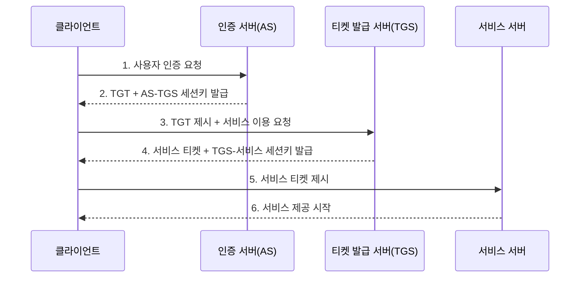

<Callout type="info">
  **이번 문서의 목표:** 대칭키만으로 여러 사람이 통신할 때 키가 왜 폭발적으로 늘어나는지 직접 계산으로 확인하고, 그 문제를 해결하는 키 분배 프로토콜(Kerberos)의 동작 순서를 설명하며, 키의 생성부터 폐기까지 전체 생명주기와 양자내성암호 등 최신 암호기술 동향까지 말할 수 있게 된다.
</Callout>

## 왜 키를 나눠 주는 방법이 따로 필요한가

23편에서 대칭키 암호(DES·AES)와 공개키 암호(RSA)를 다뤘습니다. 대칭키는 속도가 빠르지만 치명적인 약점이 하나 있습니다. **통신하려는 두 사람이 미리 같은 키를 안전하게 나눠 가지고 있어야** 한다는 점입니다. 문제는 사람 수가 늘어나면 이 키의 개수가 통제 불가능한 속도로 늘어난다는 것입니다.

**손으로 직접 세어 봅시다.** 조직 구성원이 $n$ 명이고, 서로 다른 모든 쌍이 각자 다른 대칭키를 하나씩 갖는다고 합시다. 필요한 키의 개수는 조합 공식으로 구합니다.

$$
\text{키 개수} = \frac{n(n-1)}{2}
$$

- $n$: 구성원 수
- 분자의 $n(n-1)$: 한 사람이 나머지 $n-1$ 명과 각각 키를 맺는 경우의 수를 전체 인원에 곱한 값
- 분모의 2: A와 B의 키, B와 A의 키를 같은 키로 한 번만 세기 위해 나누는 값

구성원이 10명이라고 대입해 보겠습니다.

$$
\frac{10 \times 9}{2} = \frac{90}{2} = 45
$$

**해석:** 겨우 10명인데 벌써 45개의 키가 필요합니다. 100명이면 $\frac{100 \times 99}{2} = 4950$개입니다. 사람이 늘어나는 속도보다 키가 늘어나는 속도가 훨씬 빠릅니다(제곱에 비례). 새 직원이 한 명 들어오면 기존 인원 전체와 새 키를 만들어야 하고, 퇴사자가 생기면 그 사람과 맺은 모든 키를 폐기해야 합니다. 이 방식은 조직 규모가 커지면 운영이 불가능해집니다.

> **쉽게 말하면:** 모든 사람과 각자 다른 열쇠를 따로 맞추는 대신, **믿을 수 있는 열쇠 관리인 한 명**을 두고 그 사람하고만 열쇠를 맞추면 훨씬 간단해집니다. 그 열쇠 관리인 역할을 하는 것이 키 분배 프로토콜입니다.

## 키 분배 프로토콜의 정의와 두 갈래

**키 분배 프로토콜**(key distribution protocol)이란 통신 당사자들이 안전하게 공유할 세션키(session key, 그 통신에서만 한시적으로 쓰는 대칭키)를 합의하는 절차입니다. 크게 두 갈래로 나뉩니다.

- **대칭키 기반 방식**: 신뢰할 수 있는 제3의 서버(KDC, Key Distribution Center, 키 분배 센터)가 각 구성원과 미리 나눠 가진 개별 키를 이용해 세션키를 안전하게 전달합니다. 대표 사례가 **Kerberos**(커버로스)입니다.
- **공개키 기반 방식**: 공개키로 상대방만 풀 수 있게 세션키를 암호화해서 보냅니다. 14편에서 다룬 TLS 핸드셰이크의 키 교환 단계가 바로 이 방식의 실제 사례이며, Diffie-Hellman(디피-헬만) 키 교환은 23편에서 다룬 이산로그 기반 알고리즘을 그대로 활용합니다.

앞의 계산으로 돌아가면, KDC 방식은 각 구성원이 KDC 한 곳하고만 개별 키를 나눠 가지면 됩니다. 구성원이 $n$ 명이면 필요한 키는 $n$ 개뿐입니다. 10명 조직이라면 45개가 아니라 **10개**로 줄어듭니다. 새 직원이 들어와도 KDC와 키 하나만 새로 만들면 되고, 퇴사자는 KDC에서 키 하나만 지우면 됩니다.

## Kerberos의 동작 순서 — 표를 사서 영화를 보는 구조

Kerberos는 대칭키 기반 키 분배의 대표 프로토콜이며, 그 이름은 그리스 신화 속 저승 문을 지키는 삼두견에서 따왔습니다. 구조를 이해하는 가장 쉬운 비유는 **놀이공원 자유이용권**입니다.

> **쉽게 말하면:** 입구에서 신분증을 확인받고 자유이용권(입장권 묶음)을 받은 다음, 놀이기구를 탈 때마다 그 자유이용권을 보여 주고 개별 탑승권을 받아 타는 구조입니다. 신분증을 매번 다시 보여 줄 필요가 없습니다.

핵심 구성요소는 다음과 같습니다.

- **AS**(Authentication Server, 인증 서버): 사용자의 신원을 최초로 확인하는 서버
- **TGS**(Ticket Granting Server, 티켓 발급 서버): 서비스별 이용권(서비스 티켓)을 발급하는 서버
- **TGT**(Ticket Granting Ticket): AS가 발급하는, "이 사람은 신원 확인이 끝났다"는 자유이용권 성격의 티켓
- **세션키**(session key): 매 단계에서 새로 생성되어 그 구간의 통신만 암호화하는 임시 대칭키

**단계별로 무슨 일이 일어나는지 풀어 보겠습니다.**

1. 클라이언트가 AS에 로그인 정보를 보내 신원 확인을 요청합니다.
2. AS는 신원을 확인하면 **TGT**와, 이후 TGS와 통신할 때 쓸 세션키를 함께 내려줍니다. 이때 클라이언트의 비밀번호 자체는 네트워크로 전송되지 않고, 클라이언트 쪽 비밀번호에서 유도한 키로 응답을 복호화할 수 있는지만 확인합니다.
3. 클라이언트가 특정 서비스(예: 파일 서버)를 쓰고 싶을 때, 비밀번호를 다시 입력하지 않고 **TGT를 제시**하며 TGS에 서비스 티켓을 요청합니다.
4. TGS는 TGT가 유효하면 그 서비스 전용 **서비스 티켓**과 새 세션키를 발급합니다.
5. 클라이언트는 이 서비스 티켓을 서비스 서버에 제시합니다.
6. 서비스 서버는 티켓을 검증하고 서비스를 시작합니다.

**여기서 시험에 자주 나오는 함정 두 가지가 있습니다.**

- **비밀번호는 딱 한 번, 최초 로그인 때만 쓰입니다.** 이후 단계는 전부 티켓과 세션키로만 진행되므로, 비밀번호가 네트워크에 반복 노출되는 위험이 줄어듭니다.
- **모든 티켓에는 유효기간(timestamp)이 들어 있습니다.** 이는 공격자가 예전에 가로챈 티켓을 나중에 다시 사용하는 **재전송 공격**(replay attack)을 막기 위한 장치이며, 그래서 Kerberos를 쓰는 시스템은 참여하는 모든 서버의 시각이 정확히 동기화되어 있어야 합니다. 서버 시각이 크게 어긋나면 정상 요청도 거부됩니다.

## 키 관리 생명주기

키는 한 번 만들고 끝이 아닙니다. 사람의 생애주기처럼 태어나서(생성) 활동하다가(배포·사용) 언젠가는 세상을 떠나는(폐기) 흐름이 있고, 각 단계마다 지켜야 할 보안 원칙이 다릅니다.

| 단계 | 내용 | 핵심 원칙 |
|------|------|-----------|
| 생성 | 키 값을 만들어 냄 | 예측 불가능한 난수 발생기 사용, 알고리즘에 맞는 충분한 키 길이 확보 |
| 배포 | 사용 당사자에게 안전하게 전달 | 이 편에서 다룬 키 분배 프로토콜 또는 24편의 PKI 인증서 방식 사용 |
| 저장 | 사용 전까지 안전하게 보관 | 하드웨어 보안 모듈(HSM) 같은 전용 장비에 보관, 평문 상태로 파일에 남기지 않음 |
| 사용 | 실제 암호화·복호화·서명에 활용 | 용도 분리(암호화용 키와 서명용 키를 섞어 쓰지 않음) |
| 갱신 | 주기적으로 새 키로 교체(rotation) | 유출 시 피해 범위를 한 주기로 제한 |
| 폐기 | 더 이상 쓰지 않는 키를 완전히 삭제 | 복구 불가능하게 덮어쓰기(zeroization), 폐기 이력 기록 |

**갱신이 왜 필요한지 생각해 봅시다.** 같은 키를 영구히 쓰면, 그 키가 언젠가 한 번이라도 유출되었을 때 과거에 그 키로 암호화한 모든 데이터와 앞으로 암호화할 모든 데이터가 한꺼번에 위험해집니다. 주기적으로 키를 바꾸면 유출의 피해가 그 키를 쓰던 기간에만 국한됩니다. 24편에서 다룬 인증서 폐지 목록(CRL)·OCSP도 결국 이 생명주기의 "폐기" 단계를 공개키 인증서에 적용한 절차입니다.

## 최신 암호기술 동향

### 양자컴퓨터가 던지는 위협

23편에서 다룬 RSA는 큰 수의 소인수분해가, Diffie-Hellman과 ECC(타원곡선암호)는 이산로그 문제가 계산적으로 매우 어렵다는 사실에 안전성을 의존합니다. 그런데 **쇼어 알고리즘**(Shor's algorithm)이라는 양자컴퓨터 알고리즘은 이 두 문제를 충분히 큰 양자컴퓨터에서 **다항 시간**(현실적인 시간) 안에 풀 수 있다는 것이 이론적으로 증명되어 있습니다.

> **쉽게 말하면:** 지금의 공개키 암호는 "이 자물쇠를 여는 데 슈퍼컴퓨터로도 수백 년이 걸린다"는 가정 위에 서 있는데, 양자컴퓨터가 실용화되면 그 가정 자체가 깨질 수 있다는 뜻입니다.

아직 그 정도 규모의 양자컴퓨터는 실현되지 않았지만, 지금 암호화해 저장한 데이터를 나중에 양자컴퓨터로 복호화하는 "지금 수집하고 나중에 복호화하는" 공격 시나리오 때문에 표준화 작업이 이미 진행 중입니다.

### 양자내성암호(PQC)

**양자내성암호**(PQC, Post-Quantum Cryptography)는 양자컴퓨터로도 풀기 어려운 수학 문제(주로 격자 기반 문제)에 안전성의 기반을 둔 새로운 암호 알고리즘 계열입니다. 미국 NIST(국립표준기술연구소)는 2024년에 세 가지 표준을 확정했습니다.

| 표준명 | 옛 이름 | 용도 |
|--------|---------|------|
| ML-KEM(FIPS 203) | CRYSTALS-Kyber | 키 교환(이 편에서 다룬 키 분배의 공개키 기반 방식을 대체) |
| ML-DSA(FIPS 204) | CRYSTALS-Dilithium | 전자서명(24편의 전자서명을 대체) |
| SLH-DSA(FIPS 205) | SPHINCS+ | 전자서명(해시 기반의 대안 알고리즘) |

**시험에서 중요한 지점은 계산이 아니라 개념입니다.** 양자내성암호는 대칭키 암호(AES)를 대체하는 것이 아니라, 양자컴퓨터에 취약한 **공개키 암호(RSA·ECC 기반의 키 교환·전자서명)를 대체**하기 위한 것입니다. 대칭키 암호는 키 길이를 늘리는 것만으로도 상당 부분 대응이 가능하다고 알려져 있습니다.

### 동형암호

**동형암호**(homomorphic encryption)는 데이터를 **암호화된 상태 그대로 연산**할 수 있게 해 주는 암호 기술입니다. 일반적인 암호화는 계산하려면 반드시 복호화를 거쳐야 하지만, 동형암호는 암호문끼리 더하거나 곱한 결과를 복호화하면 평문끼리 더하거나 곱한 결과와 정확히 같습니다.

> **쉽게 말하면:** 봉투를 뜯지 않은 채로 그 안의 숫자를 계산할 수 있는 특수한 봉투입니다.

- **부분동형암호**(PHE): 덧셈이나 곱셈 중 한 가지 연산만 암호문 상태로 지원
- **완전동형암호**(FHE, Fully Homomorphic Encryption): 덧셈과 곱셈을 모두 암호문 상태로 지원해, 원리적으로 어떤 연산도 수행 가능

**활용 동기**는 클라우드에 민감한 데이터를 맡기고 연산은 클라우드 서버가 수행하되, 그 서버조차 원본 데이터를 볼 수 없게 하려는 것입니다. 다만 완전동형암호는 아직 연산 속도가 평문 연산보다 훨씬 느려서, 일부 특수한 활용 사례(의료·금융 데이터의 위탁 분석)부터 점진적으로 도입되고 있습니다.

## 자주 틀리는 점

- **Kerberos를 공개키 기반으로 착각합니다.** Kerberos는 처음부터 끝까지 **대칭키**만 사용하는 프로토콜입니다. 공개키를 쓰는 키 교환은 Diffie-Hellman이나 TLS 쪽입니다.
- **KDC가 세션키를 계속 저장·관리한다고 착각합니다.** KDC는 세션키를 발급하는 순간에만 관여하고, 발급 이후의 통신에는 개입하지 않습니다.
- **양자내성암호가 이미 기존 암호를 전면 대체했다고 착각합니다.** 2024년에 표준이 확정되었을 뿐이며, 실제 시스템 전환(마이그레이션)은 이제 막 시작되는 단계입니다.
- **동형암호를 단순 암호화와 혼동합니다.** 일반 암호화는 "저장·전송 중 보호"가 목적이고, 동형암호는 "암호화된 채로 연산"이 목적이라는 점이 핵심 차이입니다.

## 핵심 정리

- 대칭키만으로 $n$ 명이 통신하려면 $\frac{n(n-1)}{2}$개의 키가 필요해 인원이 늘수록 급격히 부담이 커지며, KDC를 두면 $n$개로 줄어든다.
- **Kerberos**는 AS가 TGT를, TGS가 서비스 티켓을 발급하는 이중 티켓 구조이며, 비밀번호는 최초 인증에만 쓰이고 이후는 티켓과 세션키로 통신한다. 재전송 공격 방지를 위해 시각 동기화가 필수다.
- 키는 **생성-배포-저장-사용-갱신-폐기**의 생명주기를 가지며, 주기적 갱신은 유출 피해 범위를 제한하기 위한 조치다.
- **양자내성암호**(PQC)는 RSA·ECC 같은 공개키 암호를 양자컴퓨터 위협으로부터 대체하기 위한 것이며, NIST가 ML-KEM·ML-DSA·SLH-DSA를 표준으로 확정했다.
- **동형암호**는 암호문 상태 그대로 연산할 수 있게 하며, 덧셈·곱셈 모두 지원하면 완전동형암호(FHE)라 부른다.

## 마무리 복습

<Quiz
  questionNumber={1}
  question="조직 구성원 8명이 서로 다른 대칭키를 하나씩 맺어 통신하려 할 때 필요한 키의 개수는?"
  options={['8개', '16개', '28개', '56개']}
  correctAnswer={3}
  explanation="n(n-1)/2에 8을 대입하면 8×7/2=28이다. 서로 다른 두 사람의 조합 수를 구하는 공식이며, 사람 수가 늘어날수록 키 개수는 그보다 훨씬 빠르게 늘어난다."
  optionExplanations={['구성원 수 자체이며 필요한 키 개수가 아니다.', '8×7을 2로 나누지 않은 중간값이다.', '8×7/2=28이 정확한 계산 결과다.', '8×7×2를 계산한 값으로 공식과 다른 연산이다.']}
/>

<Quiz
  questionNumber={2}
  question="Kerberos 프로토콜에 대한 설명으로 옳은 것은?"
  options={['공개키 암호 알고리즘만으로 동작하는 프로토콜이다', 'AS가 TGT를 발급하고 TGS가 서비스 티켓을 발급하는 이중 구조다', '사용자는 서비스를 이용할 때마다 비밀번호를 다시 입력해야 한다', '참여 서버 간 시각이 달라도 재전송 공격 방지에는 영향이 없다']}
  correctAnswer={2}
  explanation="Kerberos는 AS(인증 서버)가 최초 인증 후 TGT를 발급하고, 클라이언트가 그 TGT를 TGS(티켓 발급 서버)에 제시해 서비스별 티켓을 받는 이중 티켓 구조다."
  optionExplanations={['Kerberos는 대칭키 기반 프로토콜이다.', 'AS-TGT, TGS-서비스 티켓의 이중 구조가 Kerberos의 핵심이다.', '비밀번호는 최초 인증 한 번만 쓰이고 이후는 티켓으로 진행된다.', '티켓에 시각 정보가 있어 시각 동기화가 어긋나면 재전송 공격 방지 기능이 무력화된다.']}
/>

<Quiz
  questionNumber={3}
  question="키 관리 생명주기에서 사용이 끝난 키를 복구 불가능하게 덮어써 없애는 단계는?"
  options={['생성', '배포', '갱신', '폐기']}
  correctAnswer={4}
  explanation="폐기 단계는 더 이상 쓰지 않는 키를 복구할 수 없도록 완전히 삭제(zeroization)하는 단계다. 생성은 키를 만드는 단계, 배포는 전달하는 단계, 갱신은 주기적으로 새 키로 교체하는 단계다."
  optionExplanations={['키를 만들어 내는 단계다.', '만들어진 키를 안전하게 전달하는 단계다.', '기존 키를 새 키로 바꾸는 단계이지 삭제 자체가 목적은 아니다.', '복구 불가능한 삭제가 이 단계의 핵심이다.']}
/>

<Quiz
  questionNumber={4}
  question="양자내성암호(PQC)에 대한 설명으로 가장 적절한 것은?"
  options={['AES 같은 대칭키 암호를 완전히 대체하기 위해 표준화되었다', '쇼어 알고리즘이 위협하는 소인수분해·이산로그 기반 공개키 암호를 대체하기 위한 것이다', '이미 모든 상용 시스템에서 기존 암호를 전면 대체했다', '격자 기반 문제가 아니라 소인수분해 문제의 안전성에 의존한다']}
  correctAnswer={2}
  explanation="PQC는 쇼어 알고리즘으로 무력화될 수 있는 RSA·ECC 등 공개키 암호의 대체를 목표로 하며, NIST는 격자 기반 문제에 안전성을 둔 ML-KEM·ML-DSA 등을 표준으로 확정했다."
  optionExplanations={['대칭키 암호는 키 길이 확대로 상당 부분 대응 가능하다고 알려져 있어 PQC의 주 대상이 아니다.', '소인수분해·이산로그를 다항 시간에 풀 수 있는 쇼어 알고리즘의 위협에 대응하기 위한 것이다.', '2024년 표준이 확정된 초기 단계이며 실제 전환은 이제 시작 단계다.', 'PQC는 주로 격자 기반 문제 등 양자컴퓨터로도 풀기 어려운 문제에 의존한다.']}
/>

<Quiz
  questionNumber={5}
  question="동형암호(homomorphic encryption)에 대한 설명으로 옳은 것은?"
  options={['암호문을 복호화한 뒤에만 연산이 가능하게 하는 기술이다', '암호화된 상태 그대로 연산해도 복호화 결과가 평문 연산 결과와 같게 만드는 기술이다', '덧셈과 곱셈을 모두 지원하면 부분동형암호라 부른다', '주로 전송 중 데이터 보호만을 목적으로 한다']}
  correctAnswer={2}
  explanation="동형암호는 암호문 상태에서 연산한 결과를 복호화하면 평문 상태에서 같은 연산을 한 결과와 동일하게 만드는 기술이며, 클라우드 위탁 연산에서 원본 데이터를 노출하지 않기 위해 활용된다."
  optionExplanations={['그렇다면 일반 암호화와 다를 것이 없다. 동형암호의 목적은 복호화 없이 연산하는 것이다.', '암호화된 채로 연산해도 복호화 결과가 평문 연산 결과와 일치하는 것이 핵심이다.', '덧셈과 곱셈을 모두 지원하는 것은 완전동형암호(FHE)다.', '전송 중 보호는 일반 암호화의 목적이며, 동형암호의 목적은 연산 중 보호다.']}
/>

<Quiz
  questionNumber={6}
  question="구성원이 n명일 때 KDC(키 분배 센터)를 두는 방식과 두지 않는 방식의 필요 키 개수를 옳게 짝지은 것은?"
  options={['KDC 있음: n(n-1)/2, KDC 없음: n', 'KDC 있음: n, KDC 없음: n(n-1)/2', 'KDC 있음: n, KDC 없음: n', 'KDC 있음: n(n-1)/2, KDC 없음: n(n-1)/2']}
  correctAnswer={2}
  explanation="KDC를 두면 각 구성원이 KDC와만 개별 키를 나눠 가지면 되므로 n개면 충분하다. KDC 없이 모든 쌍이 직접 키를 나눠 가지면 n(n-1)/2개가 필요하다."
  optionExplanations={['두 방식의 결과가 서로 뒤바뀌었다.', 'KDC를 두면 n개, 두지 않으면 n(n-1)/2개가 필요하다는 관계와 일치한다.', 'KDC가 없을 때 키 개수가 줄어든다는 것은 성립하지 않는다.', 'KDC를 두는 목적 자체가 키 개수를 줄이는 것이므로 두 값이 같을 수 없다.']}
/>

## 참고 자료

- [NIST - Post-Quantum Cryptography](https://csrc.nist.gov/projects/post-quantum-cryptography)
- [한국방송통신전파진흥원 - 정보보안기사 자격정보](https://www.cq.or.kr/qh_quagm01_020.do)
