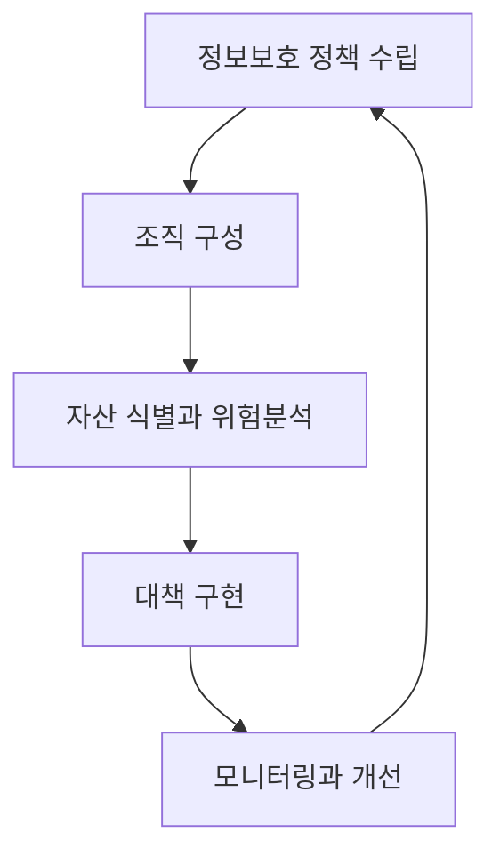

<Callout type="info">
  **이번 문서의 목표:** 조직이 정보보호 활동의 우선순위를 어떤 절차로 정하는지 설명하고, 자산가치×위협×취약점 위험도 계산과 SLE·ALE 계산을 직접 손으로 풀 수 있으며, 계산 결과에 따라 회피·전가·감소·수용 중 어떤 위험처리 전략을 골라야 하는지 판단할 수 있게 된다.
</Callout>

## 왜 위험을 계산까지 해야 하는가

01편에서 정보보호는 자산·위협·취약점·위험이 서로 얽힌 개념이라고 정리했습니다. 문제는 조직의 예산과 인력이 유한하다는 점입니다. 세상의 모든 위협에 100퍼센트 대응하는 것은 불가능하고, 그럴 필요도 없습니다. 만원짜리 자산을 지키려고 천만원짜리 보안 장비를 사는 것은 비합리적입니다.

**위험평가**(risk assessment)는 "어떤 자산이 얼마나 위험한가"를 숫자나 등급으로 표현해, 한정된 자원을 가장 위험한 곳부터 순서대로 투입할 수 있게 해 주는 절차입니다.

> **쉽게 말하면:** 집에 있는 물건 전부에 도둑 방지 자물쇠를 채울 수는 없으니, 값비싼 물건이 있고 도둑이 자주 드는 창문부터 먼저 잠그는 것과 같은 우선순위 매기기입니다.

## 정보보호 거버넌스 체계 수립 절차

**정보보호 거버넌스**(information security governance)는 경영진의 책임 아래 정보보호 정책·조직·자원배분을 결정하는 상위 관리 체계입니다. 정보보호가 전산팀만의 일이 아니라 경영진이 직접 책임지는 경영 활동이라는 관점이 핵심입니다.

이 흐름은 **PDCA 사이클**(Plan-Do-Check-Act, 계획-실행-점검-개선)의 정보보호 버전입니다. 정책 수립(Plan)에서 시작해 조직을 구성하고 위험을 분석한 결과로 대책을 구현(Do)하며, 그 대책이 잘 작동하는지 모니터링(Check)한 뒤 부족한 부분을 개선(Act)해 다시 정책에 반영합니다. 이 순환이 한 번으로 끝나지 않고 계속 돌아간다는 점이 중요합니다. 위협과 취약점은 계속 새로 생기기 때문입니다. 대책을 실제로 구현·운영하는 절차와 ISMS-P 인증제도는 27편에서 다룹니다.

## 자산 식별과 평가

### 자산이란 무엇인가

**자산**(asset)은 조직이 보호해야 할 가치 있는 모든 것을 뜻합니다. 서버·PC 같은 하드웨어, 응용프로그램 같은 소프트웨어, 고객정보 같은 데이터, 담당 인력의 노하우, 서비스 가동 자체, 그리고 회사의 평판 같은 무형자산까지 포함합니다.

### 자산가치를 매기는 두 방식

| 방식 | 내용 | 장점 | 단점 |
|------|------|------|------|
| 정성적 평가 | 상·중·하 또는 1–5등급처럼 상대적 등급으로 표현 | 빠르고 직관적, 비전문가도 참여 가능 | 평가자 주관이 개입되기 쉬움 |
| 정량적 평가 | 자산의 가치를 화폐 단위(원)로 환산 | 손실 규모를 금액으로 명확히 제시, 대책 투자 대비 효과 비교가 쉬움 | 화폐 환산이 어려운 자산(평판, 인명)이 존재 |

두 방식은 배타적이지 않습니다. 실무에서는 대부분 정성적 등급으로 전체 자산을 훑어 우선순위를 좁힌 뒤, 상위 자산에 한해 정량적 분석을 정밀하게 수행합니다.

## 위험분석 방법론

### 정성적 분석

**정성적 위험분석**은 숫자 대신 등급이나 순위로 위험을 표현합니다. 대표 기법으로는 전문가 집단의 의견을 반복 수렴해 합의에 이르는 **델파이 기법**, 가상의 위협 시나리오를 만들어 영향을 추정하는 **시나리오법**, 자산·위협을 상대적으로 줄 세우는 **순위결정법**이 있습니다. 빠르고 비용이 적게 드는 대신, "이 위험이 저 위험보다 크다"는 상대적 판단만 가능하고 얼마나 큰 손실인지 금액으로 답하기 어렵습니다.

### 자산가치 곱하기 위협 곱하기 취약점 — 손으로 계산하는 위험도

시험에 자주 나오는 단순화된 정성적 계산 모델은 다음과 같습니다.

$$
\text{위험도} = \text{자산가치} \times \text{위협 발생 가능성} \times \text{취약점 정도}
$$

- 자산가치: 그 자산이 손상되었을 때 조직에 미치는 영향의 크기(보통 1~5점)
- 위협 발생 가능성: 그 위협이 실제로 일어날 가능성(보통 1~5점)
- 취약점 정도: 그 위협에 대해 자산이 얼마나 취약한지, 즉 방어가 얼마나 허술한지(보통 1~5점)

**손계산으로 두 자산을 비교해 봅시다.**

자산 A(고객 데이터베이스): 자산가치 5점, 위협 발생 가능성 4점, 취약점 정도 3점

$$
\text{위험도}_A = 5 \times 4 \times 3 = 60
$$

자산 B(사내 게시판 서버): 자산가치 3점, 위협 발생 가능성 5점, 취약점 정도 5점

$$
\text{위험도}_B = 3 \times 5 \times 5 = 75
$$

**해석:** 자산가치만 보면 고객 데이터베이스(5점)가 사내 게시판(3점)보다 훨씬 중요해 보입니다. 그런데 위험도를 계산하면 사내 게시판(75)이 고객 데이터베이스(60)보다 오히려 더 위험하다는 결론이 나옵니다. 이유는 사내 게시판이 패치가 안 되어 취약점이 크고(5점), 공격이 자주 시도되기 때문(위협 발생 가능성 5점)입니다. **이것이 위험도 계산의 존재 이유입니다.** 자산가치 하나만 보고 우선순위를 정하면 실제로 뚫리기 쉬운 자산을 놓치게 됩니다.

### 정량적 분석 — SLE와 ALE

**정량적 위험분석**은 손실을 실제 화폐 금액으로 계산합니다. 핵심 용어 세 가지를 순서대로 알아야 합니다.

- **노출계수**(EF, Exposure Factor): 위협이 발생했을 때 자산가치 중 실제로 손실되는 비율(0에서 1 사이)
- **단일예상손실**(SLE, Single Loss Expectancy): 위협이 **한 번** 발생했을 때 예상되는 손실 금액
- **연간발생률**(ARO, Annualized Rate of Occurrence): 그 위협이 **1년에 몇 번** 발생할 것으로 예상되는지를 나타내는 횟수(1보다 클 수도 있음)
- **연간예상손실**(ALE, Annualized Loss Expectancy): 1년 동안 그 위협으로 예상되는 총 손실 금액

공식은 두 단계로 나뉩니다.

$$
SLE = AV \times EF
$$

- $AV$(Asset Value): 자산가치, 원화로 환산한 금액
- $EF$: 노출계수

$$
ALE = SLE \times ARO
$$

**손계산 예시.** 어느 회사의 전자상거래 서버 자산가치가 1억원이고, 랜섬웨어 공격 한 번이 발생하면 자산가치의 40퍼센트에 해당하는 피해(복구비용·매출손실 포함)가 발생한다고 가정합시다. 이 회사는 유사 업종 통계를 근거로 이런 공격이 1년에 평균 0.5회(2년에 한 번꼴) 발생할 것으로 예상합니다.

**1단계 — 단일예상손실(SLE) 계산**

$$
SLE = 100{,}000{,}000 \times 0.4 = 40{,}000{,}000
$$

**2단계 — 연간예상손실(ALE) 계산**

$$
ALE = 40{,}000{,}000 \times 0.5 = 20{,}000{,}000
$$

**해석:** 이 위협 하나로 인해 이 회사가 1년 평균 2천만원의 손실을 예상해야 한다는 뜻입니다. 이 숫자가 바로 "이 위협에 대응하는 보안 대책에 연간 얼마까지 투자하는 것이 합리적인가"의 기준선이 됩니다.

### ALE로 대책의 타당성을 판단하기

대책을 도입하면 노출계수나 연간발생률이 줄어들어 ALE가 낮아집니다. 방금 계산에 이어, 이 회사가 연간 500만원짜리 백업·탐지 솔루션을 도입해 노출계수가 40퍼센트에서 10퍼센트로 줄어든다고 가정해 봅시다.

**대책 도입 후 ALE**

$$
SLE_{\text{대책후}} = 100{,}000{,}000 \times 0.1 = 10{,}000{,}000
$$

$$
ALE_{\text{대책후}} = 10{,}000{,}000 \times 0.5 = 5{,}000{,}000
$$

**대책으로 줄어든 손실**은 대책 전 ALE(2천만원)에서 대책 후 ALE(5백만원)를 뺀 1천5백만원입니다. 이 금액에서 대책의 연간 비용(5백만원)을 다시 빼면 **순이익 1천만원**이 남습니다. 이 순이익이 양수이면 대책 도입이 비용 대비 타당하다고 판단합니다. 이런 비교를 **비용대비효과분석**(CBA, Cost-Benefit Analysis)이라 부릅니다.

### 정성적 분석과 정량적 분석 비교

| 구분 | 정성적 분석 | 정량적 분석 |
|------|-------------|--------------|
| 표현 방식 | 등급, 순위 | 화폐 금액 |
| 속도와 비용 | 빠르고 저렴 | 자료 수집·계산에 시간과 비용 소요 |
| 결과 활용 | 우선순위 결정 | 투자 타당성(예산 승인) 근거 제시 |
| 약점 | 주관 개입, 절대적 손실 규모를 알 수 없음 | 정확한 발생확률·손실액 추정이 어려움 |

### OCTAVE 방법론

**OCTAVE**(Operationally Critical Threat, Asset, and Vulnerability Evaluation)는 미국 카네기멜론대학교 SEI(소프트웨어공학연구소)가 개발한 자산 기반 위험분석 방법론입니다. 외부 컨설턴트가 아니라 **조직 내부 인력이 직접 참여**해 워크숍 형태로 진행한다는 점이 특징입니다.

<Steps>

1. **자산 기반 위협 프로파일 구축** — 조직 구성원이 스스로 중요 자산을 식별하고 그 자산에 대한 위협을 정리
2. **인프라 취약점 식별** — 정보 인프라를 조사해 기술적 취약점을 찾음
3. **보안 전략과 계획 수립** — 앞의 두 단계 결과를 바탕으로 위험을 평가하고 완화 전략을 수립

</Steps>

조직 규모가 작아 자원이 제한적인 곳을 위한 간소화 버전인 OCTAVE-S, 소규모 조직을 위해 절차를 더 단순화한 OCTAVE Allegro 같은 변형도 있습니다.

## 위험처리 전략

위험도를 계산했다면 이제 그 위험을 어떻게 다룰지 결정해야 합니다. 네 가지 전략 중 하나 또는 조합을 선택합니다.

| 전략 | 내용 | 예시 |
|------|------|------|
| 회피(Avoidance) | 위험을 발생시키는 활동 자체를 하지 않음 | 위험이 큰 신규 서비스 출시를 보류 |
| 전가(Transfer) | 위험을 제3자에게 넘김 | 사이버보험 가입, 외부 클라우드 사업자에게 인프라 위탁 |
| 감소(Mitigation) | 통제를 적용해 발생 가능성이나 피해 규모를 낮춤 | 방화벽·백업 도입으로 노출계수·연간발생률을 낮춤(앞의 계산 예시) |
| 수용(Acceptance) | 대책 비용이 손실보다 크면 위험을 그대로 받아들임 | ALE가 매우 작은 위험을 별도 조치 없이 감수 |

**어떤 전략을 고를지 판단하는 기준은 결국 비용 대비 효과입니다.** 대책 비용이 ALE 감소분보다 크면 그 대책은 도입할 가치가 없고, 남은 위험은 조직이 정한 **위험 허용 수준**(risk appetite) 안에서 수용합니다. 어떤 전략을 택하든 위험을 완전히 0으로 만들 수는 없으며, 대책을 아무리 잘 갖춰도 남는 위험을 **잔여위험**(residual risk)이라 부릅니다.

## 자주 틀리는 점

- **SLE와 ALE의 순서를 헷갈립니다.** SLE는 "한 번" 발생했을 때의 손실이고, ALE는 그것을 "1년" 단위로 환산한 값입니다. $ALE = SLE \times ARO$ 순서를 반대로 곱하는 실수가 잦습니다.
- **ARO를 0과 1 사이의 확률로만 생각합니다.** ARO는 확률이 아니라 "1년에 몇 번"이라는 발생 횟수이므로, 1년에 여러 번 발생하는 위협이면 1보다 큰 값(예: 3)도 정상입니다.
- **자산가치가 크면 위험도도 무조건 크다고 판단합니다.** 앞의 계산 예시처럼 취약점과 위협 발생 가능성이 낮으면 자산가치가 커도 위험도는 낮게 나올 수 있습니다.
- **위험 감소를 위험 제거와 혼동합니다.** 어떤 대책을 도입해도 잔여위험은 항상 남으며, 이 잔여위험을 받아들이는 것도 위험처리의 정식 전략(수용)입니다.

## 핵심 정리

- 정보보호 거버넌스는 정책수립-조직구성-위험분석-대책구현-모니터링/개선의 **PDCA 순환**으로 운영된다.
- 자산 평가는 등급 중심의 **정성적 평가**와 금액 중심의 **정량적 평가**로 나뉘며 실무에서는 함께 쓰인다.
- 단순 정성적 위험도는 $\text{자산가치} \times \text{위협} \times \text{취약점}$으로 계산하며, 자산가치가 낮아도 위협·취약점이 크면 위험도가 더 높게 나올 수 있다.
- 정량적 분석은 $SLE = AV \times EF$, $ALE = SLE \times ARO$ 두 단계로 계산하며, 대책 전후 ALE 차이에서 대책 비용을 뺀 값으로 투자 타당성을 판단한다.
- **OCTAVE**는 조직 내부 인력이 직접 참여하는 자산 기반 위험분석 방법론이다.
- 위험처리 전략은 **회피·전가·감소·수용** 네 가지이며, 어떤 전략을 택해도 잔여위험은 남는다.

## 마무리 복습

<Quiz
  questionNumber={1}
  question="자산가치가 8점, 위협 발생 가능성이 3점, 취약점 정도가 2점인 자산의 정성적 위험도는?"
  options={['13', '24', '48', '8']}
  correctAnswer={2}
  explanation="위험도는 자산가치×위협×취약점이므로 8×3×2=48이다. 덧셈이 아니라 곱셈으로 계산해야 하는 공식이다."
  optionExplanations={['세 값을 곱하지 않고 더한 값이다.', '자산가치와 위협만 곱하고 취약점을 빠뜨린 값이다.', '8×3×2=48이 올바른 계산 결과다.', '자산가치 값 자체이며 위험도 계산 결과가 아니다.']}
/>

<Quiz
  questionNumber={2}
  question="자산가치 5000만원, 노출계수 0.2인 자산에 대한 단일예상손실(SLE)은?"
  options={['250만원', '1000만원', '5000만원', '5020만원']}
  correctAnswer={2}
  explanation="SLE=AV×EF이므로 5000만원×0.2=1000만원이다."
  optionExplanations={['자산가치를 노출계수로 나눈 값으로 공식과 다르다.', 'AV×EF=5000만원×0.2=1000만원이 올바른 값이다.', '노출계수를 곱하지 않은 자산가치 원값이다.', '자산가치와 노출계수를 더한 값으로 공식과 무관하다.']}
/>

<Quiz
  questionNumber={3}
  question="단일예상손실(SLE)이 800만원이고 해당 위협의 연간발생률(ARO)이 3일 때, 연간예상손실(ALE)은?"
  options={['800만원', '1600만원', '2400만원', '266만원']}
  correctAnswer={3}
  explanation="ALE=SLE×ARO이므로 800만원×3=2400만원이다. ARO는 확률이 아니라 연간 발생 횟수이므로 1보다 큰 값을 그대로 곱한다."
  optionExplanations={['ARO를 곱하지 않은 SLE 원값이다.', 'SLE×2로 계산한 값으로 ARO 값을 잘못 대입했다.', 'SLE×3=2400만원이 올바른 계산이다.', 'SLE를 ARO로 나눈 값으로 공식과 반대 연산이다.']}
/>

<Quiz
  questionNumber={4}
  question="대책 도입 전 ALE가 3000만원, 도입 후 ALE가 800만원이고 대책의 연간 비용이 1500만원일 때, 이 대책에 대한 판단으로 옳은 것은?"
  options={['손실 감소분 2200만원에서 비용 1500만원을 빼면 700만원 이익이므로 도입 타당', '손실 감소분이 비용보다 작으므로 도입 부적절', 'ALE 감소는 대책 타당성 판단과 무관', '대책 비용이 도입 후 ALE보다 크므로 무조건 부적절']}
  correctAnswer={1}
  explanation="손실 감소분은 3000만원-800만원=2200만원이며, 여기서 대책 연간 비용 1500만원을 빼면 700만원의 순이익이 남아 비용대비효과가 있는 대책이다."
  optionExplanations={['2200만원-1500만원=700만원 이익이므로 정확한 판단이다.', '감소분 2200만원이 비용 1500만원보다 크므로 이 설명은 틀렸다.', '비용대비효과분석의 핵심 근거가 바로 ALE 감소분이다.', '비교 대상은 도입 후 ALE가 아니라 ALE 감소분과 비용이다.']}
/>

<Quiz
  questionNumber={5}
  question="위험처리 전략 중 사이버보험에 가입해 사고 발생 시 손실을 보험사가 일부 부담하게 하는 것은 어떤 전략에 해당하는가?"
  options={['회피', '전가', '감소', '수용']}
  correctAnswer={2}
  explanation="보험 가입은 위험 자체를 없애는 것이 아니라 손실 부담을 제3자(보험사)에게 넘기는 것이므로 전가에 해당한다."
  optionExplanations={['활동 자체를 하지 않는 것이 회피이며 보험 가입과는 다르다.', '제3자에게 손실 부담을 넘기는 것이 전가이며 보험이 대표 사례다.', '통제를 적용해 발생 가능성·피해를 낮추는 것이 감소이며 보험과는 다르다.', '위험을 그대로 받아들이는 것이 수용이며 보험 가입과는 반대다.']}
/>

<Quiz
  questionNumber={6}
  question="OCTAVE 위험분석 방법론에 대한 설명으로 옳은 것은?"
  options={['외부 컨설턴트가 전권을 갖고 진행하는 방법론이다', '조직 내부 인력이 직접 참여해 워크숍 형태로 진행하는 자산 기반 방법론이다', '정량적 화폐 손실 계산만을 목적으로 한다', '자산 식별 단계를 생략하고 취약점 점검부터 시작한다']}
  correctAnswer={2}
  explanation="OCTAVE는 카네기멜론대학교 SEI가 개발한 방법론으로, 외부 전문가가 아니라 조직 내부 인력이 직접 참여해 자산 기반 위협 프로파일을 만드는 데서 시작한다."
  optionExplanations={['OCTAVE는 내부 인력 주도 워크숍 방식이다.', '내부 인력이 참여하는 자산 기반 방법론이라는 설명이 정확하다.', 'OCTAVE는 정성적 성격이 강한 자산 기반 방법론이다.', '자산 기반 위협 프로파일 구축이 가장 먼저 진행되는 단계다.']}
/>

## 참고 자료

- [KISA - 정보보호 및 개인정보보호 관리체계(ISMS-P) 안내](https://www.kisa.or.kr/1050602)
- [Carnegie Mellon SEI - Introducing OCTAVE Allegro](https://www.sei.cmu.edu/library/file_redirect/2007_005_001_14885.pdf/)
