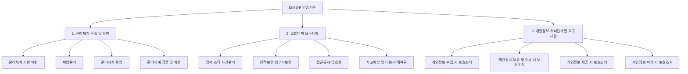

<Callout type="info">
  **이번 문서의 목표:** 위험평가 결과를 실제 통제로 옮기는 절차를 관리적·기술적·물리적 세 갈래로 구분해 설명하고, 국내 법정 인증제도인 ISMS-P의 인증기준 구조와 심사 절차를 말할 수 있게 된다.
</Callout>

## 왜 대책을 구현하는 데도 절차가 필요한가

26편에서 자산가치×위협×취약점 위험도와 ALE(연간예상손실)를 계산해 어떤 자산이 얼마나 위험한지 순서를 매겼습니다. 그런데 "이 자산이 위험하다"는 것을 안다고 저절로 안전해지지는 않습니다. 실제로 통제를 설계하고, 예산을 배정하고, 담당자를 정하고, 제대로 작동하는지 확인하는 실행 절차가 필요합니다. 그리고 그 실행이 정말 충분한지를 조직 스스로의 주장이 아니라 **외부의 객관적 기준으로 검증**받는 제도가 필요합니다. 국내에서는 이 역할을 ISMS-P 인증제도가 맡습니다.

> **쉽게 말하면:** 위험평가가 "어디를 고쳐야 하는지 진단하는 것"이라면, 대책 구현은 "실제로 고치는 공사"이고, ISMS-P 인증은 "공사가 기준대로 됐는지 제3자가 검사증을 발급하는 것"입니다.

## 정보보호 대책의 세 갈래

정보보호 대책(통제, control)은 성격에 따라 세 가지로 분류합니다. 지금까지 이 과목에서 다룬 개별 기술들이 사실 이 세 갈래 중 어디에 속하는지 정리하면 전체 그림이 보입니다.

| 통제 유형 | 정의 | 예시 |
|-----------|------|------|
| 관리적 통제 | 정책·조직·규정·교육 등 사람과 절차를 통한 통제 | 정보보호 정책 수립, 보안 교육, 인사 규정(퇴사자 계정 회수 절차), 06편의 계정관리 정책 |
| 기술적 통제 | 시스템·소프트웨어로 구현하는 통제 | 07편의 파일 접근통제, 15편의 방화벽·IDS/IPS, 21편의 인증 기술, 23편의 암호화 |
| 물리적 통제 | 시설·설비 차원의 통제 | 서버실 출입통제(카드키·생체인증 게이트), CCTV, 화재감지·소화 설비, 무정전 전원장치(UPS) |

**세 통제는 서로를 대신할 수 없습니다.** 아무리 강력한 암호화(기술적 통제)를 적용해도 서버실 문이 잠겨 있지 않으면(물리적 통제 부재) 하드디스크를 통째로 들고 나가는 공격을 막지 못합니다. 반대로 서버실 출입을 아무리 엄격히 통제해도 직원이 비밀번호를 포스트잇에 적어 붙여 두면(관리적 통제 부재) 소용이 없습니다. **세 가지가 함께 작동해야 방어선이 완성됩니다.**

### 대책 구현 절차

26편의 위험처리 전략(회피·전가·감소·수용) 중 **감소**를 선택한 위험에 대해, 그 위험을 낮출 구체적인 통제항목을 고르고(예: 취약점 점검 결과 특정 서버가 위험하다면 그 서버에 적용할 패치 정책·접근통제 규칙 선정), 실제로 설정을 적용(구현)한 뒤, 일상적으로 운영하면서 로그를 남기고, 주기적으로 점검해 부족한 부분을 개선합니다. 이 사이클이 26편에서 본 정보보호 거버넌스의 PDCA 순환 중 "Do(구현)"와 "Check(점검)"에 해당하는 실무 단계입니다.

## ISMS-P 인증제도

### 왜 두 인증이 하나로 합쳐졌는가

과거 국내에는 정보보안 관리체계를 인증하는 **ISMS**(정보보호 관리체계 인증)와 개인정보보호 관리체계를 인증하는 **PIMS**(개인정보보호 관리체계 인증)가 별도로 운영되었습니다. 두 인증이 요구하는 항목이 상당 부분 겹치는 데다, 기업 입장에서는 비슷한 심사를 두 번 받아야 하는 부담이 있었습니다. 이런 중복을 없애기 위해 2018년 두 제도를 통합한 것이 지금의 **ISMS-P**(정보보호 및 개인정보보호 관리체계 인증)입니다.

**법적 근거**는 정보통신망법 제47조(정보보호 관리체계의 인증)와 개인정보보호법 제32조의2(개인정보보호 인증)입니다. 두 법 조문이 함께 근거가 되기 때문에, 기업은 정보보호 관리체계만 인증받는 **ISMS 단독 인증**과 개인정보 처리 부분까지 포함하는 **ISMS-P 인증** 중 하나를 선택할 수 있습니다.

### 인증기준 3영역 구조

ISMS-P 인증기준은 크게 세 영역으로 구성됩니다.

| 영역 | 다루는 내용 | 대응하는 이 과목의 편 |
|------|-------------|------------------------|
| 1. 관리체계 수립 및 운영 | 정보보호 정책·조직 구성, 26편의 위험관리 절차, 사후관리 | 05, 26 |
| 2. 보호대책 요구사항 | 접근통제·암호화·물리보안 등 이 편 앞부분에서 다룬 기술적·물리적 통제 전반 | 06–24 |
| 3. 개인정보 처리단계별 요구사항 | 개인정보의 수집부터 파기까지 단계별 보호조치(**ISMS-P 인증에만 해당하며 ISMS 단독 인증에는 없음**) | 29 |

**세부 항목의 정확한 개수는 인증기준 개정 시마다 조정될 수 있으므로, 실제 응시 전에는 KISA(한국인터넷진흥원)가 공고하는 최신 인증기준 문서로 재확인해야 합니다.** 다만 구조 자체, 즉 "관리체계 수립·운영 + 보호대책 요구사항 + (ISMS-P만) 개인정보 처리단계별 요구사항"이라는 3영역 틀은 시험에서 반복적으로 묻는 핵심입니다.

### 인증 심사 절차

<Steps>

1. **인증 신청** — 기업이 한국인터넷진흥원(KISA) 또는 지정된 인증기관에 인증을 신청
2. **심사팀 구성** — 인증기관이 심사원으로 심사팀을 구성
3. **서면심사** — 신청 기업이 제출한 정책·규정·이행 증적 문서를 검토
4. **현장심사** — 심사원이 실제 사업장을 방문해 인터뷰, 시스템 설정 확인, 로그 확인 등으로 문서와 실제 운영이 일치하는지 검증
5. **결함보고서 작성** — 현장심사에서 발견된 미흡 사항을 결함으로 정리
6. **보완조치** — 신청 기업이 결함을 일정 기간 내에 시정하고 증빙을 제출
7. **인증위원회 심의·의결** — 보완조치 결과를 포함한 전체 심사 결과를 인증위원회가 심의해 인증 여부를 최종 결정
8. **인증서 발급** — 인증위원회 의결을 통과하면 인증서가 발급됨

</Steps>

**인증에는 유효기간이 있습니다.** ISMS-P 인증서의 유효기간은 **3년**이며, 그 사이 매년 **사후심사**를 받아 인증 당시의 보호 수준이 계속 유지되고 있는지 확인받습니다. 사후심사에서 중대한 결함이 발견되면 인증이 취소될 수도 있습니다.

### 인증 의무대상

모든 기업이 임의로 인증을 신청하는 것은 아닙니다. 정보통신망법 제47조 제2항은 일정 규모 이상의 정보통신서비스 제공자(정보통신망법상 매출액·이용자 수 등 법령이 정한 기준을 충족하는 사업자, 집적정보통신시설(IDC) 사업자 등)에게 ISMS 인증을 **의무적으로** 받도록 정하고 있습니다. 이 의무대상 기준은 시행령에서 구체적인 매출액·이용자 수를 정하므로, 정확한 수치는 응시 시점의 시행령을 확인해야 합니다.

## 자주 틀리는 점

- **ISMS와 ISMS-P를 완전히 별개의 인증이라고 착각합니다.** ISMS-P는 ISMS의 관리체계·보호대책 요구사항을 그대로 포함하면서 개인정보 처리단계별 요구사항을 추가한 상위 구조이며, 기업은 여전히 개인정보를 처리하지 않는다면 ISMS만 선택할 수 있습니다.
- **인증을 한 번 받으면 영구히 유효하다고 착각합니다.** 유효기간은 3년이며 그 사이 매년 사후심사가 진행됩니다.
- **관리적·기술적·물리적 통제 중 하나만 충실하면 충분하다고 생각합니다.** 세 통제는 상호 보완적이며, 어느 한 축이 무너지면 나머지 두 축이 아무리 튼튼해도 전체 방어선이 뚫릴 수 있습니다.
- **서면심사만 통과하면 인증된다고 착각합니다.** 문서가 아무리 잘 갖춰져 있어도 현장심사에서 실제 운영과 다르다는 것이 확인되면 결함으로 처리됩니다.

## 핵심 정리

- 정보보호 대책은 **관리적·기술적·물리적 통제**로 나뉘며 세 통제가 함께 작동해야 방어선이 완성된다.
- 대책 구현은 정책수립-통제항목 선정-구현-운영-점검/개선의 순서로 진행되며, 26편의 위험처리 전략 중 "감소"를 실행에 옮기는 단계다.
- **ISMS-P**는 2018년 ISMS와 PIMS를 통합한 인증제도로, 법적 근거는 정보통신망법 제47조와 개인정보보호법 제32조의2다.
- 인증기준은 **관리체계 수립 및 운영, 보호대책 요구사항, 개인정보 처리단계별 요구사항**(ISMS-P 전용)의 3영역 구조다.
- 인증 심사는 서면심사와 현장심사를 거쳐 인증위원회 의결로 확정되며, **유효기간 3년에 매년 사후심사**가 이루어진다.
- 일정 규모 이상 사업자는 정보통신망법에 따라 ISMS 인증을 **의무적으로** 받아야 한다.

## 마무리 복습

<Quiz
  questionNumber={1}
  question="정보보호 대책 중 서버실 출입에 카드키와 생체인증 게이트를 설치하는 것은 어떤 통제에 해당하는가?"
  options={['관리적 통제', '기술적 통제', '물리적 통제', '행정적 통제']}
  correctAnswer={3}
  explanation="출입통제 게이트, CCTV, 화재감지 설비 등 시설·설비 차원의 통제는 물리적 통제에 해당한다."
  optionExplanations={['정책·규정·교육 등 사람과 절차 중심의 통제다.', '시스템·소프트웨어로 구현하는 통제다.', '시설·설비를 통한 통제이므로 옳다.', '이 과목에서 사용하는 표준 분류에 포함되지 않는 명칭이다.']}
/>

<Quiz
  questionNumber={2}
  question="관리적·기술적·물리적 통제의 관계에 대한 설명으로 가장 적절한 것은?"
  options={['기술적 통제만 충분히 갖추면 나머지 통제는 생략해도 된다', '세 통제는 상호 보완적이며 어느 하나가 무너지면 전체 방어선이 뚫릴 수 있다', '물리적 통제는 관리적 통제를 완전히 대체할 수 있다', '세 통제 중 시험에서 다루는 것은 기술적 통제뿐이다']}
  correctAnswer={2}
  explanation="암호화가 아무리 강력해도 서버실 출입통제가 없거나, 출입통제가 강력해도 비밀번호 관리가 허술하면 방어선이 뚫릴 수 있으므로 세 통제는 서로를 대신할 수 없는 상호 보완 관계다."
  optionExplanations={['물리적 통제가 없으면 하드디스크를 통째로 탈취하는 공격에 취약해진다.', '어느 한 축이 무너지면 나머지가 튼튼해도 전체가 뚫릴 수 있다는 설명이 정확하다.', '통제 유형은 각자의 영역이 달라 서로 대체할 수 없다.', '이 과목의 5과목 구조 전반에 세 통제가 모두 등장한다.']}
/>

<Quiz
  questionNumber={3}
  question="ISMS-P 인증제도의 법적 근거로 옳게 짝지은 것은?"
  options={['정보통신망법 제47조와 개인정보보호법 제32조의2', '정보통신기반보호법 제8조와 전자서명법 제3조', '개인정보보호법 제15조와 제17조', '정보통신망법 제48조와 제49조']}
  correctAnswer={1}
  explanation="ISMS-P의 법적 근거는 정보통신망법 제47조(정보보호 관리체계의 인증)와 개인정보보호법 제32조의2(개인정보보호 인증)다."
  optionExplanations={['정보통신망법 제47조와 개인정보보호법 제32조의2가 정확한 근거다.', '정보통신기반보호법과 전자서명법은 ISMS-P의 근거 법령이 아니다.', '개인정보 수집·이용 요건을 규정한 조문이며 인증제도의 근거는 아니다.', '정보통신망 침해행위 금지, 비밀 보호를 규정한 조문이며 인증제도의 근거가 아니다.']}
/>

<Quiz
  questionNumber={4}
  question="ISMS-P 인증기준 3영역 중 ISMS 단독 인증에는 없고 ISMS-P 인증에만 포함되는 영역은?"
  options={['관리체계 수립 및 운영', '보호대책 요구사항', '개인정보 처리단계별 요구사항', '위험관리 요구사항']}
  correctAnswer={3}
  explanation="개인정보 처리단계별 요구사항(수집·보유·제공·파기 단계별 보호조치)은 개인정보를 다루는 ISMS-P 인증에만 포함되며, 개인정보를 처리하지 않아 ISMS만 신청한 기업에는 해당하지 않는다."
  optionExplanations={['ISMS와 ISMS-P 모두 공통으로 포함하는 영역이다.', 'ISMS와 ISMS-P 모두 공통으로 포함하는 영역이다.', 'ISMS-P에만 추가되는 영역이라는 설명이 정확하다.', '이 과목이 사용하는 3영역 명칭에 포함되지 않는다.']}
/>

<Quiz
  questionNumber={5}
  question="ISMS-P 인증 심사 절차에 대한 설명으로 옳은 것은?"
  options={['서면심사만 통과하면 현장심사 없이 바로 인증서가 발급된다', '현장심사에서 문서와 실제 운영이 다르면 결함으로 처리될 수 있다', '인증위원회 심의 절차는 생략 가능하다', '결함이 발견되면 보완조치 없이 곧바로 인증이 취소된다']}
  correctAnswer={2}
  explanation="현장심사는 심사원이 실제 사업장을 방문해 문서와 실제 운영이 일치하는지 확인하는 단계이며, 여기서 불일치가 발견되면 결함보고서에 반영된다."
  optionExplanations={['서면심사 이후 현장심사를 거쳐야 하며 생략되지 않는다.', '실제 운영과 문서의 불일치는 결함으로 처리된다는 설명이 정확하다.', '인증위원회의 심의·의결이 최종 인증 여부를 결정하는 필수 절차다.', '결함이 발견되면 우선 보완조치 기간을 거친 뒤 최종 판단이 이루어진다.']}
/>

<Quiz
  questionNumber={6}
  question="ISMS-P 인증서의 유효기간과 사후관리에 대한 설명으로 옳은 것은?"
  options={['유효기간은 1년이며 사후심사는 없다', '유효기간은 3년이며 그 사이 매년 사후심사를 받는다', '유효기간은 영구적이며 별도의 사후심사가 없다', '유효기간은 5년이며 5년마다 전체 재심사를 받는다']}
  correctAnswer={2}
  explanation="ISMS-P 인증서의 유효기간은 3년이며, 유효기간 동안 매년 사후심사를 통해 인증 당시의 보호 수준이 유지되는지 확인받는다."
  optionExplanations={['유효기간은 3년이며 사후심사도 매년 진행된다.', '3년 유효기간과 매년 사후심사라는 설명이 정확하다.', '3년의 유효기간이 있으며 영구 인증이 아니다.', '유효기간은 5년이 아니라 3년이다.']}
/>

## 참고 자료

- [KISA - 정보보호 및 개인정보보호 관리체계(ISMS-P) 안내](https://www.kisa.or.kr/1050602)
- [국가법령정보센터 - 정보통신망 이용촉진 및 정보보호 등에 관한 법률](https://www.law.go.kr/LSW/lsInfoP.do?lsId=000030&ancYnChk=0)
