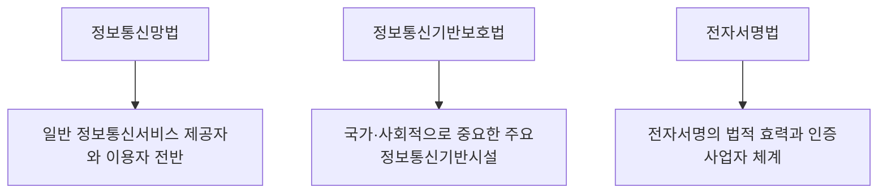

<Callout type="info">
  **이번 문서의 목표:** 정보통신망법·정보통신기반보호법·전자서명법 세 법률이 각각 어떤 대상을 규율하는지 구분하고, 핵심 조문의 번호와 처벌 수위를 표로 짚으며, 이 문서 작성 시점(2026년 9월)의 최신 개정 시점을 근거와 함께 말할 수 있게 된다.
</Callout>

## 왜 조문 번호까지 알아야 하는가

26편·27편에서 위험을 계산하고 통제를 구현하는 방법을 다뤘습니다. 그런데 조직이 아무리 자발적으로 대책을 잘 갖춰도, 법이 강제하는 최소 기준을 어기면 그 자체로 처벌 대상이 됩니다. 05편에서 정보보호 관련 법 체계의 전체 지도를 그렸다면, 이 편은 그중 **정보통신망법·정보통신기반보호법·전자서명법** 세 법률을 조문 단위로 깊게 들어갑니다.

> **쉽게 말하면:** 05편이 "법이라는 지도에서 어느 나라가 어디 있는지" 보여줬다면, 이 편은 그 나라들 중 세 곳에 실제로 들어가 도로 표지판(조문 번호)과 교통 법규(처벌 규정)를 하나하나 읽는 것입니다.

## 세 법률의 규율 대상 구분

이 세 법은 이름이 비슷해 보이지만 규율 대상이 뚜렷이 다릅니다.

- **정보통신망법**(정보통신망 이용촉진 및 정보보호 등에 관한 법률): 인터넷 쇼핑몰·포털·앱 서비스 등 **일반적인 정보통신서비스 제공자**와 그 이용자를 대상으로, 정보보호조치 의무·개인정보 관련 규정 일부·침해행위 금지·벌칙을 규정합니다.
- **정보통신기반보호법**: 전력·금융·통신·교통처럼 마비되면 국가 기능에 심각한 영향을 주는 **주요정보통신기반시설**을 지정하고 보호하는 법입니다. 대상이 일반 기업이 아니라 국가가 지정한 특정 시설이라는 점이 정보통신망법과 가장 큰 차이입니다.
- **전자서명법**: 전자서명이 종이 문서의 서명·도장과 같은 법적 효력을 갖도록 뒷받침하고, 전자서명을 제공하는 사업자(전자서명인증사업자)를 규율합니다.

05편에서 다룬 개인정보보호법은 개인정보 자체의 수집·이용·제공을 규율하는 법으로, 이 세 법과는 또 다른 축이며 29편에서 조문 단위로 심화합니다.

## 최신 개정 시점 확인(2026년 9월 기준)

법은 계속 개정되므로, 이 편은 국가법령정보센터(law.go.kr)를 기준으로 확인한 **작성 시점의 최신 개정 정보**를 명시합니다. 실제 응시 전에는 반드시 국가법령정보센터에서 그 시점의 최신본을 다시 확인해야 합니다.

| 법률 | 최신 개정 법률 번호 | 공포일 | 시행일 | 개정 성격 |
|------|----------------------|--------|--------|-----------|
| 정보통신망법 | 제21445호 | 2026년 3월 10일 | 2026년 9월 11일 | 정보보호최고책임자 지위 격상, 침해사고 조사 관련 위원회 신설, 위반 시 관련 매출액의 일정 비율 이내 과징금 도입을 포함하는 대규모 개정 |
| 정보통신기반보호법 | 제20068호 | 2024년 1월 23일 | 2025년 1월 24일 | 일부개정 |
| 전자서명법 | 제18479호 | 2021년 10월 19일 | 공포 후 1년 경과 시점(일부 조항은 6개월 경과 시점) | 일부개정 |

**정보통신망법의 이번 개정에서 특히 눈여겨볼 부분**은 그동안 팀장·부서장급이 맡는 경우가 많았던 **정보보호최고책임자**(CISO, Chief Information Security Officer)의 지위를 임원급으로 끌어올려 경영진이 직접 책임지게 했다는 점과, 반복적으로 침해사고를 낸 기업에 매출액 기준의 과징금을 물릴 수 있게 했다는 점입니다. 이는 26편에서 다룬 "정보보호는 경영진이 책임지는 거버넌스"라는 원칙을 법으로 강제한 사례로 볼 수 있습니다.

## 정보통신망법 핵심 조문

| 조문 | 핵심 문구 요지 | 처벌 규정 |
|------|----------------|-----------|
| 제45조(정보보호조치 등) | 정보통신서비스 제공자는 정보통신망의 안정성과 이용자 정보의 안전성 확보를 위한 기술적·관리적 보호조치를 취해야 함 | 시정명령 불이행 시 과태료 |
| 제47조(정보보호 관리체계의 인증) | 일정 요건에 해당하는 사업자는 정보보호 관리체계 인증(ISMS)을 받아야 함(27편 참고) | 인증 의무 위반 시 과태료 |
| 제48조(정보통신망 침해행위 등의 금지) | 정당한 접근권한 없이 정보통신망에 침입하거나 이를 이용해 정보를 훼손·침해하는 행위, 악성프로그램을 유포하는 행위를 금지 | 5년 이하 징역 또는 5천만원 이하 벌금 수준(조항별 세분화) |
| 제48조의3(침해사고의 신고 등) | 침해사고가 발생하면 정보통신서비스 제공자는 지체 없이 관계 기관에 신고해야 함 | 신고의무 위반 시 과태료 |
| 제49조(비밀 등의 보호) | 정보통신망으로 처리·보관·전송되는 타인의 비밀을 침해·도용·누설하는 행위를 금지 | 침해 시 징역 또는 벌금(제71조 이하 연계) |
| 제70조(명예훼손) | 정보통신망을 통해 사실 또는 허위사실을 유포해 타인의 명예를 훼손하는 행위 | 사실 적시는 3년 이하 징역 또는 3천만원 이하 벌금, 허위사실 적시는 7년 이하 징역 또는 5천만원 이하 벌금 수준으로 가중 |
| 제71조 이하(벌칙) | 제48조 등 주요 침해행위별로 형량을 차등 규정 | 위반 조항에 따라 수년 이하 징역 또는 수천만원 이하 벌금으로 세분화 |
| 제75조(양벌규정) | 법인의 대표자나 종업원이 업무 관련 위반행위를 하면 행위자와 법인을 함께 처벌 | 행위자 처벌과 별도로 법인에도 벌금형 |

**표의 처벌 수위는 조항별로 세분화되어 있고 개정마다 조정되므로, 정확한 형량은 국가법령정보센터의 해당 조문 원문으로 확인해야 합니다.** 시험에서는 정확한 숫자를 암기하는 것보다, "어떤 행위가 어느 조문에 해당하고 왜 그 행위가 금지되는지"를 구분하는 문제가 더 자주 출제됩니다.

## 정보통신기반보호법 핵심 조문

| 조문 | 핵심 문구 요지 | 처벌 규정 |
|------|----------------|-----------|
| 제2조(정의) | 주요정보통신기반시설이란 국가안전보장·행정·국방·치안·금융·통신 등 업무와 관련된 전자적 제어·관리시스템 등을 뜻함 | 해당 없음(정의 조문) |
| 제8조(주요정보통신기반시설의 지정 등) | 중앙행정기관의 장이 소관 분야의 정보통신기반시설 중 국가적으로 중요한 시설을 주요정보통신기반시설로 지정 | 지정 거부·태만에 대한 행정적 조치 |
| 제9조(취약점의 분석·평가) | 지정된 시설의 관리기관은 정기적으로 취약점을 분석·평가해야 함 | 미이행 시 시정명령 등 행정조치 |
| 제10조(관리대책의 수립·시행) | 취약점 분석·평가 결과를 반영한 보호대책을 수립·시행 | 미이행 시 시정명령 등 행정조치 |
| 제13조(침해사고의 통지) | 주요정보통신기반시설에 침해사고가 발생하면 관계 기관에 즉시 통지 | 통지의무 위반 시 행정조치 |
| 제28조(벌칙) | 주요정보통신기반시설을 공격해 기능을 마비시키는 행위를 처벌 | 국가 기간시설을 대상으로 한다는 특수성 때문에 정보통신망법상 일반 침해행위보다 무거운 징역·벌금형으로 가중 규정 |
| 제30조(양벌규정) | 법인의 종업원 등이 업무 관련 위반행위를 하면 행위자와 법인을 함께 처벌 | 행위자 처벌과 별도로 법인에도 벌금형 |

**정보통신망법과의 결정적 차이**는 보호 대상입니다. 정보통신망법은 일반 서비스 제공자와 이용자 전반을, 정보통신기반보호법은 국가가 개별적으로 지정한 소수의 핵심 기반시설만을 대상으로 합니다. 그래서 이 법의 침해행위 처벌은 국가 기능 마비라는 피해의 심각성 때문에 일반적인 해킹 처벌보다 무겁게 설계되어 있습니다.

## 전자서명법 핵심 조문

| 조문 | 핵심 문구 요지 | 처벌 규정 |
|------|----------------|-----------|
| 제2조(정의) | 전자서명이란 서명자를 확인하고 서명자가 그 전자문서에 서명했음을 나타내는 데 이용하기 위해 전자문서에 첨부되거나 논리적으로 결합된 전자적 형태의 정보를 뜻함 | 해당 없음(정의 조문) |
| 제3조(전자서명의 효력) | 전자서명은 당사자 간 합의에 따른 서명 방식이라도 법령이나 거래관행상 요구되는 서명·기명날인과 동일한 법적 효력을 가짐 | 해당 없음(효력 조문) |
| 제6조(전자서명인증업무의 운영기준) | 전자서명인증사업자가 지켜야 할 운영기준을 정함 | 위반 시 시정명령 등 행정조치 |
| 제19조(전자서명인증사업자의 준수사항) | 이용자 신원 확인, 인증서 관리 등 사업자가 지켜야 할 의무 | 위반 정도에 따라 징역 또는 벌금형 |
| 제24조(벌칙) | 제19조 등 준수사항을 위반한 전자서명인증사업자를 처벌 | 위반 유형에 따라 수년 이하 징역 또는 수천만원 이하 벌금으로 구분 |

**제3조가 왜 중요한지 역사적 맥락으로 이해해 봅시다.** 과거에는 정부가 지정한 "공인인증서"만 법적 효력이 확실하다는 인식이 강했습니다. 그런데 2020년 전자서명법 개정으로 공인인증서와 사설인증서의 법적 구분 자체가 폐지되었습니다. 지금은 은행 앱의 자체 인증서든 민간 인증사업자의 인증서든, 제3조가 요구하는 요건(서명자 확인, 서명 사실 증명)을 충족하면 **동일한 법적 효력**을 갖습니다. 24편에서 다룬 PKI(공개키 기반구조)의 CA(인증기관)·RA(등록기관) 구조는 이 전자서명인증사업자가 실제로 인증서를 발급하는 기술적 뼈대입니다.

## 세 법률의 조문 비교로 보는 정리

| 구분 | 정보통신망법 | 정보통신기반보호법 | 전자서명법 |
|------|--------------|---------------------|------------|
| 규율 대상 | 일반 정보통신서비스 제공자·이용자 | 국가 지정 주요정보통신기반시설 | 전자서명·전자서명인증사업자 |
| 핵심 의무 조문 | 제45조(정보보호조치), 제47조(ISMS 인증) | 제8조(지정), 제9조(취약점 분석), 제10조(관리대책) | 제3조(효력), 제6조(운영기준) |
| 대표 금지행위 조문 | 제48조(침해행위 금지) | 제13조(침해사고 통지의무) | 제19조(사업자 준수사항) |
| 대표 벌칙 조문 | 제70조 이하 | 제28조 | 제24조 |
| 소관 부처 성격 | 과학기술정보통신부 계열 | 국가 기반시설 소관 부처(분야별 중앙행정기관) | 과학기술정보통신부 계열 |

## 자주 틀리는 점

- **공인인증서만 법적 효력이 있고 사설인증서는 효력이 약하다고 착각합니다.** 2020년 개정 이후 공인·사설 구분이 폐지되어, 요건을 충족하는 전자서명은 모두 동일한 법적 효력을 갖습니다(제3조).
- **정보통신망법과 정보통신기반보호법을 혼동합니다.** 전자는 일반 서비스 제공자 전반을, 후자는 국가가 개별 지정한 주요정보통신기반시설만을 대상으로 하는 별개의 법입니다.
- **벌칙 조문의 숫자를 무작정 암기하려 합니다.** 형량은 법 개정마다 조정되므로, 시험에서는 "어떤 행위가 어느 법의 어느 조문 취지에 해당하는가"를 구분하는 문제가 숫자 암기보다 훨씬 자주 나옵니다.
- **ISMS-P 인증(27편)과 정보통신기반보호법의 취약점 분석·평가(제9조)를 같은 절차로 착각합니다.** ISMS-P는 정보통신망법 제47조에 근거한 민간·공공 전반의 인증제도이고, 정보통신기반보호법의 취약점 분석·평가는 국가 지정 시설에 한정된 별도의 법정 의무입니다.

## 핵심 정리

- **정보통신망법**은 일반 정보통신서비스 제공자 전반을, **정보통신기반보호법**은 국가가 지정한 주요정보통신기반시설을, **전자서명법**은 전자서명의 효력과 인증사업자를 각각 규율한다.
- 2026년 9월 기준 정보통신망법의 최신 개정(법률 제21445호, 2026년 3월 10일 공포, 2026년 9월 11일 시행)은 정보보호최고책임자의 임원급 격상과 매출액 기준 과징금 도입을 포함하는 대규모 개정이다.
- 정보통신망법의 핵심 조문은 제45조(정보보호조치), 제47조(ISMS 인증), 제48조(침해행위 금지), 제70조 이하(벌칙)다.
- 정보통신기반보호법의 핵심 조문은 제8조(지정), 제9조(취약점 분석·평가), 제10조(관리대책), 제28조(벌칙)다.
- 전자서명법 제3조는 요건을 충족하는 모든 전자서명에 서명·기명날인과 동일한 법적 효력을 부여하며, 2020년 개정으로 공인·사설 구분이 폐지되었다.
- 조문의 정확한 형량·시행일은 계속 바뀌므로, 학습 시점마다 국가법령정보센터에서 최신본을 재확인해야 한다.

## 마무리 복습

<Quiz
  questionNumber={1}
  question="정보통신망법과 정보통신기반보호법의 규율 대상 차이를 가장 정확히 설명한 것은?"
  options={['두 법 모두 일반 정보통신서비스 제공자만을 대상으로 한다', '정보통신망법은 일반 서비스 제공자 전반을, 정보통신기반보호법은 국가가 지정한 주요정보통신기반시설을 대상으로 한다', '정보통신기반보호법이 정보통신망법보다 규율 범위가 넓다', '두 법 모두 전자서명인증사업자만을 대상으로 한다']}
  correctAnswer={2}
  explanation="정보통신망법은 인터넷 쇼핑몰·포털 등 일반 정보통신서비스 제공자와 이용자를 대상으로 하고, 정보통신기반보호법은 국가가 개별적으로 지정한 전력·금융·통신 등 주요정보통신기반시설만을 대상으로 한다."
  optionExplanations={['정보통신기반보호법은 국가 지정 시설만을 대상으로 하므로 이 설명은 틀렸다.', '두 법의 대상 구분을 정확히 설명하고 있다.', '정보통신기반보호법은 오히려 대상이 좁고 특정된 시설에 한정된다.', '전자서명인증사업자는 전자서명법의 대상이며 이 두 법의 대상이 아니다.']}
/>

<Quiz
  questionNumber={2}
  question="정보통신망법에서 정보통신서비스 제공자의 기술적·관리적 보호조치 의무를 규정한 조문은?"
  options={['제45조', '제48조', '제70조', '제75조']}
  correctAnswer={1}
  explanation="제45조(정보보호조치 등)는 정보통신서비스 제공자가 정보통신망의 안정성과 이용자 정보의 안전성 확보를 위한 기술적·관리적 보호조치를 취하도록 규정한다."
  optionExplanations={['정보보호조치 의무를 규정한 조문이 맞다.', '제48조는 침해행위 자체를 금지하는 조문으로 보호조치 의무 조문과는 다르다.', '제70조는 명예훼손에 관한 벌칙 조문이다.', '제75조는 양벌규정으로 보호조치 의무 조문이 아니다.']}
/>

<Quiz
  questionNumber={3}
  question="전자서명법 제3조(전자서명의 효력)에 대한 설명으로 옳은 것은?"
  options={['정부가 지정한 공인인증서로 생성한 전자서명만 법적 효력을 가진다', '요건을 충족하는 전자서명은 사설인증서로 생성했더라도 서명·기명날인과 동일한 법적 효력을 가진다', '전자서명은 법적 효력이 인정되지 않으며 참고 자료로만 활용된다', '전자서명의 효력은 매 거래마다 별도의 법원 판결로만 인정받을 수 있다']}
  correctAnswer={2}
  explanation="2020년 개정으로 공인인증서와 사설인증서의 법적 구분이 폐지되었으며, 제3조는 요건을 충족하는 전자서명에 서명자 확인과 서명 사실 증명이라는 요건이 충족되면 동일한 법적 효력을 부여한다."
  optionExplanations={['공인·사설 구분은 2020년 개정으로 폐지되어 이 설명은 더 이상 맞지 않는다.', '요건을 충족하면 사업자 구분과 무관하게 동일한 효력을 가진다는 설명이 정확하다.', '전자서명은 법령상 서명·기명날인과 동일한 효력을 인정받는다.', '전자서명법 제3조가 일반적인 법적 효력을 직접 부여하므로 매번 별도 판결이 필요하지 않다.']}
/>

<Quiz
  questionNumber={4}
  question="정보통신기반보호법에서 중앙행정기관의 장이 소관 분야의 시설 중 국가적으로 중요한 시설을 지정하는 절차를 규정한 조문은?"
  options={['제2조', '제8조', '제13조', '제28조']}
  correctAnswer={2}
  explanation="제8조(주요정보통신기반시설의 지정 등)는 중앙행정기관의 장이 소관 분야의 정보통신기반시설 중 국가적으로 중요한 시설을 주요정보통신기반시설로 지정하는 절차를 규정한다."
  optionExplanations={['제2조는 주요정보통신기반시설의 정의를 규정한 조문이다.', '지정 절차를 규정한 조문이 맞다.', '제13조는 침해사고 발생 시 통지의무를 규정한 조문이다.', '제28조는 침해행위에 대한 벌칙을 규정한 조문이다.']}
/>

<Quiz
  questionNumber={5}
  question="정보통신망법의 2026년 개정에 포함된 내용으로 가장 적절한 것은?"
  options={['정보보호최고책임자의 지위를 임원급으로 격상하고 매출액 기준 과징금을 도입했다', '전자서명의 공인·사설 구분을 새로 도입했다', 'ISMS-P 인증제도를 폐지했다', '주요정보통신기반시설 지정 권한을 민간 기업에 이전했다']}
  correctAnswer={1}
  explanation="이 편 작성 시점 기준 정보통신망법의 최신 개정은 정보보호최고책임자를 임원급으로 격상하고 반복적인 침해사고에 대해 매출액 기준 과징금을 부과할 수 있게 한 것이 핵심이다."
  optionExplanations={['정보보호최고책임자 격상과 매출액 기준 과징금 도입이 정확한 설명이다.', '공인·사설 구분은 오히려 2020년 개정으로 폐지된 제도이며 2026년 개정과 무관하다.', 'ISMS-P는 계속 운영 중인 제도이며 폐지되지 않았다.', '주요정보통신기반시설 지정은 정보통신기반보호법에 따라 중앙행정기관의 장이 수행하는 절차다.']}
/>

<Quiz
  questionNumber={6}
  question="법인의 대표자나 종업원이 업무와 관련해 법을 위반했을 때 행위자와 법인을 함께 처벌하는 규정을 일반적으로 무엇이라 부르는가?"
  options={['양벌규정', '가중처벌규정', '면책규정', '재량규정']}
  correctAnswer={1}
  explanation="양벌규정은 위반행위를 한 개인(행위자)뿐 아니라 그가 속한 법인에도 함께 벌금형 등을 부과하도록 하는 규정으로, 정보통신망법 제75조와 정보통신기반보호법 제30조가 이에 해당한다."
  optionExplanations={['행위자와 법인을 함께 처벌하는 규정을 가리키는 정확한 명칭이다.', '형을 가중하는 별도 사유를 규정하는 것으로 양벌규정과는 다른 개념이다.', '책임을 면제하는 규정으로 양벌규정과 반대되는 개념이다.', '재량으로 처분 여부를 정하는 규정을 뜻하며 양벌규정의 정의와는 다르다.']}
/>

## 참고 자료

- [국가법령정보센터 - 정보통신망 이용촉진 및 정보보호 등에 관한 법률](https://www.law.go.kr/LSW/lsInfoP.do?lsId=000030&ancYnChk=0)
- [국가법령정보센터 - 정보통신기반보호법](https://www.law.go.kr/법령/정보통신기반보호법)
- [국가법령정보센터 - 전자서명법](https://www.law.go.kr/법령/전자서명법)
