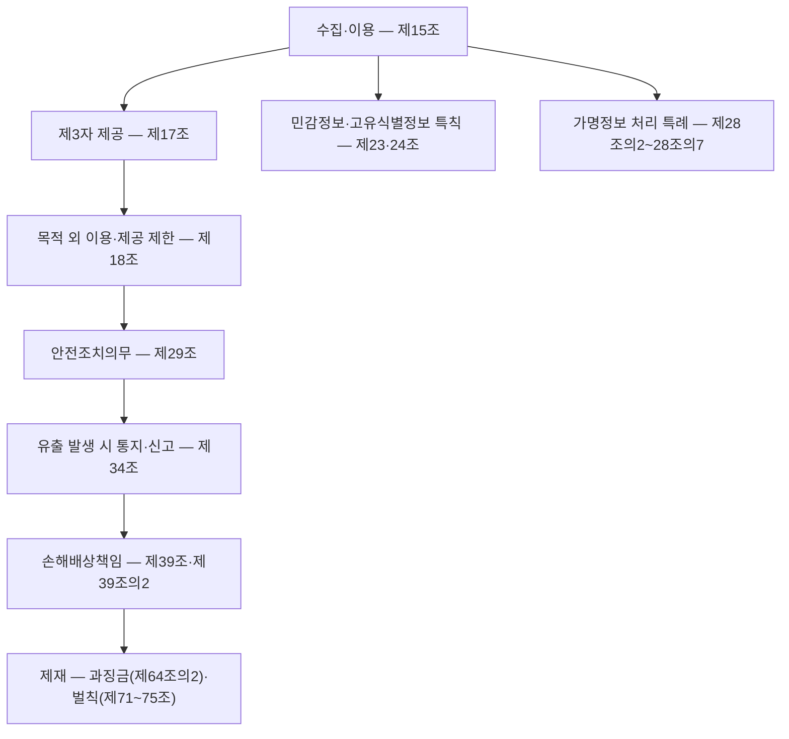
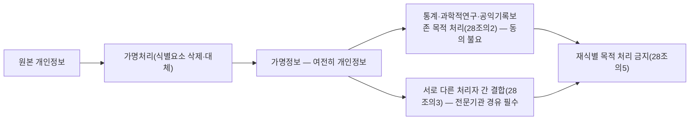

<Callout type="info">
  **이번 문서의 목표:** 이 파일을 다 읽으면 개인정보 처리의 각 단계(수집–이용–제공–파기)에서 어떤 조문이 적용되는지 짚어낼 수 있고, 위반 사례를 보고 그것이 과징금 대상인지 형사 벌칙 대상인지, 몇 조 몇 항 위반인지까지 판단할 수 있게 된다.
</Callout>

## 0. 05·28편에서 가져오는 것 — 딱 이만큼만

05편(정보보호 법령·거버넌스 체계 지도)과 28편(정보통신망법·정보통신기반보호법·전자서명법 심화)에서 다룬 내용 중 이번 편에 필요한 것만 세 줄로 정리합니다. 자세한 내용은 각 편을 참고하세요.

- 대한민국의 정보보호 관련 법은 소관 부처와 보호 대상이 나뉩니다. **개인정보보호법**은 개인정보보호위원회가 소관하며 "살아있는 개인에 관한 정보"를 보호 대상으로 삼고, **정보통신망법**은 과학기술정보통신부·방송통신위원회가 소관하며 정보통신서비스 제공자의 기술적 보호조치·침해사고 대응·불법정보 유통금지를 다룹니다.
- 두 법은 원래 상당 부분 겹쳤지만, 2020년 데이터 3법 개정과 2023년 개인정보보호법 전부개정으로 **개인정보에 관한 규정은 개인정보보호법으로 일원화**되었습니다. 정보통신서비스 제공자의 개인정보 특례(옛 정보통신망법 제4장)도 지금은 개인정보보호법 제6장(제39조의3 이하)으로 옮겨져 있습니다.
- 28편에서는 이 두 법의 **관계와 소관 구조**만 지도로 그렸습니다. 이번 편은 그 지도 위에서 **개인정보보호법 하나를 조문 단위로** 파고듭니다.

## 1. 왜 조문 번호까지 외워야 하는가

> **쉽게 말하면:** 조문 번호는 "어떤 행위가 어떤 처벌로 이어지는가"를 잇는 색인입니다.

정보보안기사 필기 5과목 중 정보보안관리 및 법규 과목은 **법 조문의 문구와 처벌 수위를 직접 묻는 문항**이 매 회차 반복 출제됩니다. 단순히 "개인정보를 함부로 쓰면 안 된다"는 상식 수준이 아니라, "제17조 위반은 과징금 대상인가 벌칙 대상인가", "제39조의2의 법정손해배상 상한은 얼마인가"처럼 **조문 번호와 숫자를 정확히 짚는 문제**가 나옵니다.

실무에서도 마찬가지입니다. 침해사고가 터졌을 때 담당자가 가장 먼저 해야 할 일은 "이 사고가 개인정보보호법 제34조의 유출 통지·신고 의무를 발동시키는 규모인가"를 판단하는 것입니다. 조문 번호를 모르면 대응 시나리오 자체를 세울 수 없습니다. 그래서 이번 편은 처음부터 끝까지 **조문 번호를 기준축**으로 삼아 설명합니다.

## 2. 개인정보 처리의 생애주기와 조문 지도

개인정보(personal information, 개인정보)는 살아있는 개인에 관한 정보로서 성명·주민등록번호·영상 등을 통해 특정 개인을 알아볼 수 있는 정보, 또는 다른 정보와 쉽게 결합해 알아볼 수 있는 정보를 말합니다. 이 개인정보를 실제로 수집하고 처리하는 사업자·기관을 **개인정보처리자**(personal information controller, 개인정보처리자)라 부르고, 그 정보의 주인공, 즉 식별되는 개인을 **정보주체**(data subject, 정보주체)라 부릅니다.

개인정보는 수집되는 순간부터 파기되는 순간까지 하나의 생애주기를 거치고, 각 단계마다 적용되는 조문이 다릅니다.

이번 편은 이 지도를 따라 위에서 아래로 내려가며 각 조문을 봅니다.

## 3. 수집·이용의 적법 근거 — 제15조

> **쉽게 말하면:** 제15조는 "개인정보를 모으고 써도 되는 여섯 가지 정당한 이유"의 목록입니다.

**제15조(개인정보의 수집·이용)** 제1항은 개인정보처리자가 다음 중 하나에 해당할 때만 개인정보를 수집하고, 그 수집 목적의 범위 안에서 이용할 수 있다고 규정합니다.

| 근거 | 핵심 문구 | 실무 예시 |
| --- | --- | --- |
| 정보주체의 동의 | 정보주체의 동의를 받은 경우 | 회원가입 시 체크박스 동의 |
| 법률에 특별한 규정 | 법률에 특별한 규정이 있거나 법령상 의무를 준수하기 위해 불가피한 경우 | 세법상 거래기록 보관 |
| 공공기관의 소관 업무 | 공공기관이 법령 등에서 정하는 소관 업무의 수행을 위하여 불가피한 경우 | 행정기관의 민원 처리 |
| 계약의 체결·이행 | 정보주체와 체결한 계약을 이행하거나 계약 체결 과정에서 요청에 따른 조치를 하기 위해 필요한 경우 | 배송을 위한 주소 수집 |
| 급박한 생명·신체·재산 이익 | 정보주체 또는 제3자의 급박한 생명·신체·재산의 이익을 위해 명백히 필요한 경우 | 의식불명 환자의 응급 연락처 조회 |
| 정당한 이익 | 개인정보처리자의 정당한 이익을 달성하기 위해 필요한 경우로서, 그 이익이 정보주체의 권리보다 명백히 우선하고 합리적으로 관련된 범위에 한하는 경우 | 부정 이용 방지를 위한 접속기록 보관 |

여기서 시험이 가장 자주 노리는 함정은 **"동의만이 유일한 적법 근거"라는 오해**입니다. 실제로는 동의를 포함해 여섯 가지 근거가 병렬로 존재하고, 계약 이행이나 법령상 의무처럼 **동의 없이도 적법하게 처리할 수 있는 경우**가 절반 이상입니다. "모든 개인정보 수집에는 정보주체의 동의가 반드시 필요하다"는 보기가 나오면 틀린 진술입니다.

또한 제15조 제2항은 동의를 받는 방식도 규정합니다. 개인정보처리자는 정보주체에게 **개인정보의 수집·이용 목적, 수집하는 개인정보의 항목, 보유·이용 기간**을 명확히 알리고 동의를 받아야 하며, 정보주체가 동의를 거부할 권리가 있다는 사실과 거부 시 불이익 내용까지 알려야 합니다. "필수 항목 외의 정보에는 동의를 거부할 수 있다"는 사실을 안내하지 않으면 그 자체로 위법입니다.

### 계산 대신 판별 — 사례로 적용해 보기

한 온라인 쇼핑몰이 배송을 위해 구매자의 주소와 연락처를 수집했습니다. 별도의 동의 절차를 거치지 않았는데, 이것이 위법일까요?

**판별 절차**

1. 목적이 무엇인가 — 상품 배송이라는 **계약 이행**을 위한 수집입니다.
2. 제15조 제1항의 근거 중 "계약의 체결·이행을 위해 필요한 경우"에 해당하는지 확인합니다.
3. 배송 주소·연락처는 계약 이행에 **합리적으로 필요한 최소한의 정보**이므로 해당합니다.

**결론 해석:** 이 경우는 별도 동의 없이도 제15조 제1항 제4호(계약 이행)에 근거해 적법하게 수집할 수 있습니다. 다만 수집한 정보를 배송 목적을 넘어 마케팅 문자 발송에 쓴다면 이는 뒤에서 볼 **제18조 목적 외 이용**에 해당해 별도 동의가 새로 필요합니다.

## 4. 제3자 제공과 목적 외 이용 제한 — 제17조·제18조

> **쉽게 말하면:** 제17조는 "남에게 넘겨도 되는 경우"이고, 제18조는 "원래 목적을 벗어나 쓰거나 넘기면 안 된다"는 제동 장치입니다.

**제17조**(개인정보의 제공)는 개인정보처리자가 정보주체의 개인정보를 제3자에게 제공할 수 있는 경우를 규정합니다. 정보주체의 별도 동의를 받은 경우, 그리고 제15조 제1항 제2호·제3호·제5호부터 제7호까지의 근거(법령상 의무, 공공기관 소관 업무, 급박한 이익, 정당한 이익 등)로 수집한 목적 범위 안에서 제공하는 경우가 포함됩니다. 또한 당초 수집 목적과 **합리적으로 관련된 범위** 안에서, 정보주체에게 불이익이 발생하는지와 암호화 등 안전조치를 했는지를 고려해 동의 없이 제공할 수 있는 경우도 별도로 규정되어 있습니다.

**제18조**(개인정보의 목적 외 이용·제공 제한)는 이 범위를 넘어서는 행위를 막는 조문입니다. 개인정보처리자는 제15조 제1항에 따른 범위를 초과해 이용하거나, 제17조 제1항에 따른 범위를 초과해 제3자에게 제공해서는 안 됩니다. 다만 정보주체로부터 별도 동의를 받거나, 다른 법률에 특별한 규정이 있는 경우 등 예외 사유가 있을 때만 목적 외 이용·제공이 허용됩니다.

| 구분 | 제17조(제공) | 제18조(목적 외 제한) |
| --- | --- | --- |
| 규정 방향 | 허용되는 제공의 근거를 나열 | 원래 범위를 벗어나는 이용·제공을 원칙적으로 금지 |
| 핵심 질문 | 이 제공이 애초에 허용되는 근거를 갖췄는가 | 이 이용·제공이 애초 수집 목적을 벗어났는가 |
| 위반 시 성격 | 애초에 근거 없이 제공한 경우 | 근거는 있었지만 범위를 넘어선 경우 |

두 조문을 헷갈리는 대표적인 함정은 **"제공"과 "목적 외 이용"을 같은 것으로 보는 것**입니다. 예를 들어 쇼핑몰이 배송업체에 주소를 넘기는 것은 제17조가 다루는 **제공**의 문제이고, 그 쇼핑몰이 배송 목적으로 받은 주소를 자기 마케팅에 쓰는 것은 제18조가 다루는 **목적 외 이용**의 문제입니다. 대상(자사 내부인가 제3자인가)이 다르면 적용되는 조문도 다릅니다.

## 5. 민감정보·고유식별정보 특칙 — 제23조·제24조

> **쉽게 말하면:** 민감정보와 고유식별정보는 일반 개인정보보다 한 단계 더 엄격한 잠금장치가 걸린 정보입니다.

**민감정보**(sensitive information, 민감정보)는 **제23조**가 규정하는 정보로, 사상·신념, 노동조합·정당의 가입·탈퇴, 정치적 견해, 건강, 성생활 등에 관한 정보와 유전정보, 범죄경력자료 등을 말합니다. 원칙적으로 처리가 금지되며, 정보주체로부터 **다른 개인정보 처리 동의와 별도로** 동의를 받거나 법령이 구체적으로 처리를 요구·허용하는 경우에만 예외적으로 처리할 수 있습니다.

**고유식별정보**(unique identification information, 고유식별정보)는 **제24조**가 규정하는 정보로, 주민등록번호처럼 개인을 다른 정보와 결합하지 않고도 고유하게 식별할 수 있는 번호 체계를 말합니다. 역시 정보주체의 별도 동의나 법령상 구체적 근거 없이는 처리할 수 없습니다. 특히 **주민등록번호**는 **제24조의2**에서 한 단계 더 엄격하게 다뤄, 법률·대통령령 등에서 구체적으로 처리를 요구하거나 허용한 경우, 또는 정보주체나 제3자의 급박한 생명·신체·재산 이익을 위해 필요한 경우 등으로 근거를 더 좁혀 두었습니다.

두 조문 모두 뒤에서 볼 **제29조 안전조치의무**를 별도로 준용하도록 규정해, 유출 시 더 무거운 책임을 지도록 설계되어 있습니다.

**자주 틀리는 점:** "회사가 필요하다고 판단하면 민감정보도 자유롭게 수집할 수 있다"는 진술은 틀립니다. 민감정보·고유식별정보는 **일반 동의만으로는 부족**하고, 처리 근거를 별도로 갖춰야 한다는 점이 시험에서 반복해 출제됩니다.

## 6. 가명정보 처리 특례 — 제28조의2부터 제28조의7까지

> **쉽게 말하면:** 가명정보 특례는 "누구인지 바로는 못 알아보게 가려 놓으면, 동의 없이도 통계·연구에 쓸 수 있게 해 주는 특별 통로"입니다.

**가명정보**(pseudonymized information, 가명정보)는 개인정보의 일부를 삭제하거나 다른 값으로 대체해, **추가 정보 없이는 특정 개인을 알아볼 수 없게** 처리한 정보입니다. 완전히 알아볼 수 없게 만든 **익명정보**(anonymized information, 익명정보)와 다른 점은, 가명정보는 분리 보관된 추가 정보(대응표 등)와 다시 결합하면 재식별이 가능하다는 것입니다. 이 때문에 가명정보는 **여전히 개인정보에 해당**하며 이 법의 적용을 받습니다.

- **제28조의2(가명정보의 처리 등):** 개인정보처리자는 통계 작성, 과학적 연구, 공익적 기록보존 등의 목적이라면 **정보주체의 동의 없이** 가명정보를 처리할 수 있습니다.
- **제28조의3(가명정보의 결합 제한):** 서로 다른 개인정보처리자가 보유한 가명정보끼리 결합하려면, 개인정보보호위원회나 관계 중앙행정기관장이 지정한 **전문기관**을 통해서만 할 수 있습니다. 사업자가 임의로 서로의 가명정보를 맞대어 결합하는 것은 금지됩니다.
- **제28조의4(가명정보에 대한 안전조치의무 등):** 가명정보 처리 목적, 제3자 제공 시 제공받는 자, 처리 기간 등 처리 내용을 기록해 보관해야 하며, 재식별을 막기 위한 안전조치 의무를 별도로 부담합니다.
- **제28조의5(가명정보 처리 시 금지의무 등):** 특정 개인을 알아보기 위한 목적으로 가명정보를 처리하는 행위, 즉 **재식별 시도 자체**를 금지합니다.
- **제28조의6·제28조의7:** 각각 가명정보에 대한 과징금 특례, 그리고 이 특례 규정들이 다른 개인정보와 어떤 범위까지 같이 적용되는지(적용범위)를 정합니다.

**자주 틀리는 점:** "가명정보는 개인정보가 아니므로 아무 제약 없이 자유롭게 쓸 수 있다"는 완전히 틀린 진술입니다. 가명정보도 개인정보이며, 오히려 재식별 위험 때문에 **안전조치와 결합 절차라는 추가 규제**가 붙습니다. 개인정보가 아닌 것은 가명정보가 아니라 **익명정보**입니다.

## 7. 안전조치의무 — 제29조

> **쉽게 말하면:** 제29조는 "정보를 다룬다면 최소한 이 정도는 잠가 둬야 한다"는 기술·관리 체크리스트입니다.

**제29조**(안전조치의무)는 개인정보처리자가 개인정보가 분실·도난·유출·위조·변조 또는 훼손되지 않도록 **내부관리계획 수립, 접근통제, 접속기록의 보관 및 점검, 암호화 등 안전성 확보에 필요한 기술적·관리적·물리적 조치**를 해야 한다고 규정합니다. 이 조문은 세부 기준을 시행령과 고시(개인정보의 안전성 확보조치 기준)로 위임해, 실무에서는 접근권한 관리대장, 비밀번호 작성 규칙, 개인정보처리시스템의 접속기록 최소 1년 이상 보관 같은 구체적 기준으로 구현됩니다.

앞서 본 민감정보(제23조)·고유식별정보(제24조) 조문은 모두 이 제29조를 **준용**하도록 되어 있어, "일반 개인정보보다 더 엄격한 안전조치가 필요하다"는 시험 문구의 근거가 바로 이 준용 관계입니다.

## 8. 유출 시 통지·신고 의무 — 제34조

> **쉽게 말하면:** 사고가 나면 숨기지 말고 정해진 시간 안에 알리라는 조문입니다.

**제34조**(개인정보 유출 등의 통지·신고)는 개인정보처리자가 개인정보의 분실·도난·유출(이하 유출등) 사실을 알게 되었을 때, **지체 없이** 해당 정보주체에게 유출등이 된 개인정보의 항목, 시점과 경위, 피해 최소화 방법, 담당 부서 연락처 등을 알리도록 규정합니다. 실무 기준으로는 인지한 때로부터 **72시간 이내** 통지·신고를 원칙으로 삼습니다. 또한 일정 규모(1천 명분 이상 등 시행령이 정하는 기준) 이상의 개인정보가 유출된 경우에는 개인정보보호위원회 또는 대통령령으로 정하는 전문기관에도 **신고**해야 합니다.

"통지"와 "신고"의 대상이 다르다는 점이 시험 함정입니다. **통지**는 피해를 입은 **정보주체 본인**에게 알리는 것이고, **신고**는 규제 당국인 **개인정보보호위원회**(또는 전문기관)에 알리는 것입니다. 소규모 유출이라도 정보주체 통지는 원칙적으로 필요하지만, 신고는 일정 규모 이상일 때만 의무화됩니다.

## 9. 손해배상책임 — 제39조·제39조의2

> **쉽게 말하면:** 사고가 나면 회사가 "내 잘못이 아니었다"를 스스로 증명해야 하고, 고의·중과실이면 배상액이 몇 배로 뛸 수 있습니다.

**제39조**(손해배상책임)는 정보주체가 개인정보처리자의 이 법 위반 행위로 손해를 입으면 손해배상을 청구할 수 있다고 정하면서, **입증책임을 전환**합니다. 즉 개인정보처리자가 **고의 또는 과실이 없음을 스스로 입증하지 못하면** 책임을 면할 수 없습니다. 일반 민사소송에서는 피해자가 가해자의 과실을 입증해야 하는 것과 반대 방향입니다.

같은 조 제3항은 **징벌적 손해배상**을 규정합니다. 개인정보처리자의 **고의 또는 중대한 과실**로 개인정보가 분실·도난·유출·위조·변조·훼손되어 정보주체에게 손해가 발생한 경우, 법원은 그 손해액의 **5배를 넘지 않는 범위**에서 배상액을 정할 수 있습니다. 이 배수는 2016년 도입 당시 3배였다가, 2023년 개정으로 5배까지 상향되었습니다.

**제39조의2**(법정손해배상의 청구)는 정보주체가 실제 손해액을 구체적으로 입증하기 어려운 경우를 위한 조문입니다. 개인정보처리자의 고의 또는 과실로 개인정보가 유출된 경우, 정보주체는 **300만 원 이하의 범위**에서 법원이 상당한 금액을 손해액으로 정하도록 청구할 수 있습니다. 다만 이 청구를 하려면 사실심 변론이 종결되기 전까지 손해배상 청구를 법정손해배상 청구로 변경해야 하며, 법정손해배상과 징벌적 손해배상은 함께 인정되지 않습니다.

| 구분 | 제39조 제1항·제2항 | 제39조 제3항(징벌적) | 제39조의2(법정손해배상) |
| --- | --- | --- | --- |
| 요건 | 위반행위로 인한 손해 발생 | 고의 또는 중대한 과실 | 고의 또는 과실로 인한 유출 |
| 입증 부담 | 처리자가 무과실을 입증해야 면책 | 피해자의 실손해 입증 필요 | 손해액 입증 없이 상당한 금액 청구 가능 |
| 배상 상한 | 실손해액 | 손해액의 5배 이내 | 300만원 이내 |

## 10. 과징금과 벌칙의 차이 — 제64조의2, 제71조부터 제75조까지

> **쉽게 말하면:** 과징금은 "돈으로 매기는 행정 제재"이고, 벌칙은 "징역·벌금이라는 형사 처벌"입니다. 같은 위반에 두 가지를 동시에 물리지는 않습니다.

**제64조의2**(과징금의 부과)는 개인정보보호위원회가 제15조 제1항, 제17조 제1항, 제18조 제1항·제2항 또는 제19조를 위반해 개인정보를 처리한 개인정보처리자에게 **전체 매출액의 100분의 3(3퍼센트)을 초과하지 않는 범위**에서 과징금을 부과할 수 있다고 정합니다. 매출액이 없거나 산정이 곤란한 경우에는 **20억 원을 초과하지 않는 범위**에서 부과합니다. 과징금은 행위자 개인이 아니라 **법인·사업자**를 대상으로 하는 행정 제재이며, 같은 위반행위에 과징금을 부과했다면 그 행위에 대해서는 별도로 **과태료**를 부과하지 않습니다.

**제71조**(벌칙)는 5년 이하의 징역 또는 5천만 원 이하의 벌금이라는 기본 형량 아래 여러 위반 유형을 열거합니다.

| 위반 행위 | 근거 |
| --- | --- |
| 정보주체 동의 없이 개인정보를 제3자에게 제공한 자, 이를 알면서 제공받은 자 | 제17조 위반 |
| 이용·제공 제한 규정을 위반해 이용·제공한 자, 영리·부정 목적으로 제공받은 자 | 제18조 위반 |
| 법정대리인 동의 없이 14세 미만 아동의 개인정보를 처리한 자 | 아동 개인정보 특칙 위반 |
| 민감정보를 처리한 자 | 제23조 위반 |
| 고유식별정보를 처리한 자 | 제24조 위반 |
| 전문기관을 거치지 않고 가명정보를 결합한 자 | 제28조의3 위반 |
| 재식별 목적으로 가명정보를 처리한 자 | 제28조의5 위반 |
| 업무상 알게 된 개인정보를 누설하거나 권한 없이 이용한 자 | 업무상 비밀누설 |

이보다 형량이 낮은 위반은 **제72조·제73조**(각 3년 이하 징역 또는 3천만원 이하 벌금, 2년 이하 징역 또는 2천만원 이하 벌금 등 단계별로 구성)에, 행정 절차 위반처럼 상대적으로 가벼운 위반은 **제75조 과태료**(최대 수천만 원 수준, 위반 유형별 금액 차등)에 규정되어 있습니다.

**자주 틀리는 점:** 과징금과 과태료를 같은 것으로 혼동하는 경우가 많습니다. **과징금**은 "위반행위로 얻은 경제적 이익을 박탈하고 재발을 억제"하려는 목적의 제재로 매출액 비례 방식이고, **과태료**는 "행정상 의무 위반에 대한 정형적 제재"로 개별 위반 유형마다 정액에 가까운 금액이 정해집니다. 또한 벌칙(징역·벌금)은 **형사처벌**이라 전과기록이 남지만, 과징금·과태료는 **행정처분**이라 전과기록이 남지 않는다는 차이도 함께 기억해야 합니다.

## 11. 최신 개정 시점 — 2025년 개정과 그 의미

이 문서를 작성하는 시점(2026년 9월) 기준으로 개인정보보호법의 최근 개정은 **법률 제20897호**(2025년 4월 1일 일부개정, 2025년 10월 2일 시행)입니다. 정보보안기사 필기는 "최신 출제기준"을 표방하므로, 이 개정 내용은 시험에 새로 반영될 가능성이 높은 부분입니다.

이 개정의 핵심은 두 가지입니다.

1. **국내대리인 지정 의무 확대:** 국내에 주소나 영업소가 없는 개인정보처리자(해외 사업자)가 일정 기준 이상 국내 정보주체의 개인정보를 처리하는 경우, 국내에 대리인을 지정해 개인정보보호위원회·정보주체와의 창구 역할을 맡기도록 강화했습니다. 해외 플랫폼 사업자의 개인정보 유출 사고 시 연락 창구가 없어 대응이 늦어졌던 문제를 겨냥한 조치입니다.
2. **개인정보 전송요구권(마이데이터) 확대:** 정보주체가 자신의 개인정보를 본인이나 지정한 제3자에게 전송하도록 요구할 수 있는 권리(제35조의2 계열 조문)의 적용 범위를 넓혀, 금융 분야에 머물던 마이데이터 개념을 다른 산업 분야로 확산하는 근거를 강화했습니다.

법 개정은 앞으로도 계속됩니다. 시험을 준비할 때는 이 편에서 정리한 조문 구조(수집–제공–특례–안전조치–통지–배상–제재)라는 **틀**을 먼저 익히고, 실제 시험을 앞둔 시점에 국가법령정보센터에서 시행일 기준 최신 조문을 다시 한번 대조하는 습관을 들이는 것이 안전합니다.

## 12. 헷갈리는 짝 정리

| 헷갈리는 짝 | 구분 기준 |
| --- | --- |
| 가명정보 vs 익명정보 | 가명정보는 추가정보와 결합하면 재식별 가능(개인정보에 해당), 익명정보는 결합해도 알아볼 수 없음(개인정보 아님) |
| 제17조 vs 제18조 | 제17조는 제공의 허용 근거, 제18조는 원래 범위를 벗어난 이용·제공에 대한 금지 |
| 통지 vs 신고 | 통지는 피해 정보주체 본인에게, 신고는 개인정보보호위원회·전문기관에 |
| 과징금 vs 과태료 | 과징금은 매출액 비례의 경제적 제재, 과태료는 위반 유형별 정액 행정 제재 |
| 벌칙 vs 과징금·과태료 | 벌칙은 징역·벌금의 형사처벌(전과 발생), 과징금·과태료는 행정처분(전과 미발생) |
| 징벌적 손해배상 vs 법정손해배상 | 징벌적은 고의·중과실 요건에 실손해의 5배 이내, 법정손해배상은 손해액 입증 없이 300만원 이내 |

## 핵심 정리

- 개인정보 처리는 **수집·이용**(제15조) → **제공**(제17조) → **목적 외 이용 제한**(제18조)의 순서로 조문이 걸리며, 동의는 여러 적법 근거 중 하나일 뿐이다.
- **민감정보**(제23조)·**고유식별정보**(제24조)는 별도 동의나 구체적 법령 근거가 있어야 처리할 수 있고, 안전조치의무(제29조)를 준용해 더 엄격하게 관리된다.
- **가명정보**는 여전히 개인정보이며, 통계·과학적 연구·공익적 기록보존 목적이면 동의 없이 처리할 수 있지만(제28조의2), 서로 다른 처리자 간 결합은 전문기관을 거쳐야 하고(제28조의3) 재식별 목적 처리는 금지된다(제28조의5).
- 유출 시 **정보주체에게는 통지, 규제기관에는 신고**(제34조)를 해야 하고, 손해배상은 처리자가 무과실을 입증하지 못하면 책임을 지며 고의·중과실이면 손해액의 **5배 이내** 징벌적 배상까지 가능하다(제39조).
- 제재는 **과징금**(매출액 3퍼센트 이내, 제64조의2)과 **벌칙**(징역·벌금, 제71조 이하)으로 나뉘고, 같은 행위에 과징금과 과태료를 동시에 부과하지 않는다. 최신 개정(2025년 10월 시행)은 국내대리인 지정과 전송요구권 확대에 초점을 둔다.

## 마무리 복습

<Quiz
  questionNumber={1}
  question="개인정보 보호법 제15조가 정하는 개인정보 수집·이용의 적법 근거에 관한 설명으로 옳은 것은?"
  options={['① 정보주체의 동의만이 유일한 적법 근거이므로 동의 없는 수집은 항상 위법하다', '② 계약의 체결·이행에 필요한 경우처럼 동의 없이도 적법하게 수집할 수 있는 근거가 별도로 존재한다', '③ 공공기관이 수집하는 개인정보는 어떤 경우에도 정보주체의 동의를 반드시 받아야 한다', '④ 개인정보처리자의 정당한 이익은 어떤 상황에서도 적법 근거가 될 수 없다']}
  correctAnswer={2}
  explanation="제15조 제1항은 동의 외에도 법령상 의무, 공공기관의 소관 업무, 계약의 체결·이행, 급박한 생명·신체·재산 이익, 정당한 이익 등 여러 근거를 병렬로 규정한다. 계약 이행을 위한 배송 정보 수집처럼 동의 없이도 적법한 수집이 가능하므로 2번이 옳다."
  optionExplanations={['제15조는 동의 외에도 여러 적법 근거를 병렬로 규정하므로 동의만이 유일한 근거라는 서술은 틀렸다.', '계약 체결·이행을 위해 필요한 경우는 동의 없이도 적법하게 수집할 수 있는 근거이므로 옳은 설명이다.', '공공기관도 법령이 정하는 소관 업무 수행을 위해 불가피하면 동의 없이 수집할 수 있으므로 항상 동의가 필요하다는 서술은 틀렸다.', '정당한 이익이 정보주체의 권리보다 명백히 우선하고 합리적으로 관련된 범위라면 적법 근거가 될 수 있으므로 틀린 서술이다.']}
/>

<Quiz
  questionNumber={2}
  question="쇼핑몰이 배송을 위해 수집한 주소 정보를 배송업체에 넘기지 않고, 대신 자사의 신제품 마케팅 문자 발송에 사용했다. 이 행위에 가장 직접적으로 적용되는 조문은?"
  options={['① 제17조(개인정보의 제공)', '② 제18조(개인정보의 목적 외 이용·제공 제한)', '③ 제23조(민감정보의 처리 제한)', '④ 제34조(개인정보 유출 등의 통지·신고)']}
  correctAnswer={2}
  explanation="제3자에게 넘기지 않고 자사 내부에서 원래 수집 목적(배송)을 벗어나 마케팅에 사용했으므로 이는 제공의 문제가 아니라 목적 외 이용의 문제다. 제18조가 이 상황에 직접 적용된다."
  optionExplanations={['제17조는 제3자에게 제공하는 상황을 다루는데 이 사례는 자사 내부에서 쓴 것이므로 제공에 해당하지 않는다.', '원래 수집 목적인 배송을 벗어나 자사 마케팅에 쓴 것은 목적 외 이용에 해당하므로 제18조가 직접 적용된다.', '주소·연락처는 민감정보가 아니므로 제23조가 적용될 상황이 아니다.', '이 사례는 유출 사고가 아니라 목적 외 이용의 문제이므로 통지·신고 조문과는 무관하다.']}
/>

<Quiz
  questionNumber={3}
  question="가명정보에 관한 설명으로 옳지 않은 것은?"
  options={['① 가명정보는 추가 정보와 결합하면 재식별이 가능하므로 여전히 개인정보에 해당한다', '② 통계 작성, 과학적 연구, 공익적 기록보존 목적이면 정보주체의 동의 없이 가명정보를 처리할 수 있다', '③ 서로 다른 개인정보처리자가 보유한 가명정보는 지정된 전문기관을 거치지 않고도 자유롭게 결합할 수 있다', '④ 특정 개인을 알아보기 위한 목적으로 가명정보를 처리하는 행위는 금지된다']}
  correctAnswer={3}
  explanation="제28조의3은 서로 다른 개인정보처리자 간 가명정보 결합을 개인정보보호위원회나 관계 중앙행정기관장이 지정한 전문기관을 통해서만 하도록 제한한다. 자유롭게 결합할 수 있다는 3번이 옳지 않다."
  optionExplanations={['가명정보는 추가 정보와 결합하면 재식별될 수 있어 개인정보에 해당한다는 설명은 옳다.', '제28조의2에 따라 통계·과학적 연구·공익적 기록보존 목적이면 동의 없이 처리할 수 있다는 설명은 옳다.', '제28조의3에 따라 서로 다른 처리자 간 결합은 반드시 지정된 전문기관을 거쳐야 하므로 자유롭게 결합할 수 있다는 설명이 옳지 않다.', '제28조의5는 재식별 목적의 가명정보 처리를 금지하므로 이 설명은 옳다.']}
/>

<Quiz
  questionNumber={4}
  question="개인정보 유출 사고가 발생했을 때 개인정보처리자의 의무에 관한 설명으로 옳은 것은?"
  options={['① 피해 정보주체에게 알리는 절차와 개인정보보호위원회에 알리는 절차는 항상 같은 대상, 같은 요건을 갖는다', '② 일정 규모 이상의 유출이면 정보주체 통지와 별도로 개인정보보호위원회 또는 전문기관에 신고해야 한다', '③ 유출 사실을 인지하더라도 내부 조사가 끝날 때까지는 어떠한 통지·신고 의무도 발생하지 않는다', '④ 유출 통지는 피해액이 확정된 이후에만 이루어지면 충분하다']}
  correctAnswer={2}
  explanation="제34조는 정보주체에 대한 통지와 개인정보보호위원회·전문기관에 대한 신고를 구분하며, 일정 규모 이상의 유출이면 신고 의무가 추가로 발생한다. 2번이 이 구조를 정확히 설명한다."
  optionExplanations={['통지의 대상은 피해 정보주체 본인이고 신고의 대상은 규제기관이므로 대상과 요건이 서로 다르다.', '일정 규모 이상 유출 시 신고 의무가 추가된다는 설명이 제34조의 구조를 정확히 반영한다.', '유출 사실을 알게 되면 지체 없이 통지해야 하므로 내부 조사 완료까지 의무가 미뤄진다는 설명은 틀렸다.', '통지는 피해액 확정을 기다리지 않고 지체 없이 이루어져야 하므로 이 서술은 틀렸다.']}
/>

<Quiz
  questionNumber={5}
  question="개인정보 보호법상 손해배상 제도에 관한 설명으로 옳지 않은 것은?"
  options={['① 정보주체가 손해배상을 청구하면 개인정보처리자는 고의·과실이 없음을 스스로 입증해야 책임을 면할 수 있다', '② 개인정보처리자의 고의 또는 중대한 과실로 개인정보가 유출된 경우 법원은 손해액의 5배를 넘지 않는 범위에서 배상액을 정할 수 있다', '③ 법정손해배상을 청구하면 실제 손해액을 정밀하게 입증해야만 배상을 받을 수 있다', '④ 법정손해배상의 상한은 300만원이다']}
  correctAnswer={3}
  explanation="제39조의2의 법정손해배상은 오히려 실제 손해액을 구체적으로 입증하기 어려운 피해자를 위해 만들어진 제도로, 손해액 입증 없이도 300만원 이하의 범위에서 상당한 금액을 청구할 수 있다. 정밀한 입증이 필요하다는 3번이 옳지 않다."
  optionExplanations={['제39조는 개인정보처리자가 무과실을 입증하지 못하면 책임을 면할 수 없도록 입증책임을 전환하므로 옳은 설명이다.', '고의·중대한 과실 요건이 갖춰지면 손해액의 5배 이내에서 징벌적 손해배상이 가능하다는 설명은 옳다.', '법정손해배상은 실손해액 입증 부담을 덜어주는 제도이므로 정밀한 입증이 필요하다는 설명이 옳지 않다.', '법정손해배상의 상한이 300만원이라는 설명은 옳다.']}
/>

<Quiz
  questionNumber={6}
  question="과징금과 벌칙·과태료의 차이에 관한 설명으로 옳지 않은 것은?"
  options={['① 과징금은 위반행위로 얻은 경제적 이익을 박탈하려는 목적의 행정 제재로, 전체 매출액의 3퍼센트 이내에서 부과될 수 있다', '② 벌칙은 징역이나 벌금에 처하는 형사처벌이므로 전과기록이 남을 수 있다', '③ 개인정보보호위원회는 동일한 위반행위에 대해 과징금과 과태료를 동시에 부과하는 것이 원칙이다', '④ 매출액이 없거나 산정이 곤란한 경우 과징금은 20억원을 초과하지 않는 범위에서 부과될 수 있다']}
  correctAnswer={3}
  explanation="같은 위반행위에 과징금을 부과했다면 그 행위에 대해서는 별도로 과태료를 부과하지 않는 것이 원칙이다. 동시 부과가 원칙이라고 한 3번이 옳지 않다."
  optionExplanations={['과징금이 매출액 3퍼센트 이내에서 부과되는 경제적 제재라는 설명은 옳다.', '벌칙은 형사처벌이라 전과기록이 남을 수 있다는 설명은 옳다.', '동일 위반행위에는 과징금과 과태료를 함께 부과하지 않는 것이 원칙이므로 동시 부과가 원칙이라는 설명이 옳지 않다.', '매출액 산정이 곤란한 경우 20억원 이내에서 과징금을 부과한다는 설명은 옳다.']}
/>

## 참고 자료

- [국가법령정보센터 - 개인정보 보호법](https://www.law.go.kr/%EB%B2%95%EB%A0%B9/%EA%B0%9C%EC%9D%B8%EC%A0%95%EB%B3%B4%EB%B3%B4%ED%98%B8%EB%B2%95)
- [CaseNote - 개인정보 보호법 제71조(벌칙)](https://casenote.kr/%EB%B2%95%EB%A0%B9/%EA%B0%9C%EC%9D%B8%EC%A0%95%EB%B3%B4_%EB%B3%B4%ED%98%B8%EB%B2%95/%EC%A0%9C71%EC%A1%B0)
- [CaseNote - 개인정보 보호법 제39조(손해배상책임)](https://casenote.kr/%EB%B2%95%EB%A0%B9/%EA%B0%9C%EC%9D%B8%EC%A0%95%EB%B3%B4_%EB%B3%B4%ED%98%B8%EB%B2%95/%EC%A0%9C39%EC%A1%B0)
- [CaseNote - 개인정보 보호법 제39조의2(법정손해배상의 청구)](https://casenote.kr/%EB%B2%95%EB%A0%B9/%EA%B0%9C%EC%9D%B8%EC%A0%95%EB%B3%B4_%EB%B3%B4%ED%98%B8%EB%B2%95/%EC%A0%9C39%EC%A1%B0%EC%9D%982)
- [Kim & Chang - 개인정보 보호법 개정안 국회 정무위원회 통과](https://www.kimchang.com/ko/insights/detail.kc?sch_section=4&idx=26311)
