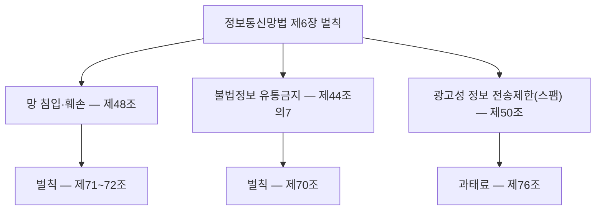

<Callout type="info">
  **이번 문서의 목표:** 이 파일을 다 읽으면 해킹·악성프로그램 유포·사이버 명예훼손·스팸 같은 행위가 각각 어느 법 어느 조문의 어떤 처벌로 이어지는지 구분할 수 있고, 2025~2026년의 주요 법 개정과 국제 규범(GDPR)의 위치를 비교해 말할 수 있게 된다.
</Callout>

## 0. 28·29편에서 가져오는 것 — 딱 이만큼만

28편(정보통신망법·정보통신기반보호법·전자서명법 심화)과 29편(개인정보보호법 조문별 심화)에서 다룬 내용 중 이번 편에 필요한 것만 정리합니다.

- **개인정보보호법**은 개인정보의 수집·이용·제공·유출 대응처럼 "정보의 처리 방식"을 규율하고, **정보통신망법**은 정보통신망 자체에 대한 침입·훼손·불법정보 유통처럼 "행위 자체의 위법성"을 규율합니다. 두 법은 보호 대상이 다르므로 같은 사고라도 적용 조문이 갈립니다.
- 정보통신망법의 개인정보 특례(옛 제4장)는 이미 개인정보보호법으로 옮겨졌으므로, 이번 편이 다루는 정보통신망법 조문은 **개인정보와 무관하게 정보통신망 자체를 대상으로 한 금지행위**(해킹·악성프로그램·불법정보 유통·스팸)에 집중됩니다.

## 1. 왜 사이버 행위를 법으로 다루는가

> **쉽게 말하면:** 사이버 공간의 행위도 현실의 침입·명예훼손·사기와 똑같이 피해를 남기므로, 법은 그 행위가 일어난 장소(정보통신망)를 기준으로 별도의 처벌 규정을 둡니다.

현실에서 남의 집에 무단으로 들어가면 주거침입죄가 성립하듯, 정보통신망(information and communication network, 정보통신망)에 정당한 권한 없이 접속하면 그 자체로 범죄가 됩니다. 문제는 사이버 공간의 행위가 **행위자 특정이 어렵고, 피해가 순식간에 광범위하게 퍼지며, 국경을 넘나든다**는 점입니다. 그래서 형법의 일반 조문만으로는 대응하기 어려운 부분을 **정보통신망법**이라는 특별법으로 보완합니다. 이번 편은 "어떤 행위가 어느 법의 어느 조문에 걸리는가"라는 판별 기준을 세우는 데 집중합니다.

## 2. 정보통신망법 금지행위 체계 지도

정보통신망법의 금지행위는 크게 세 갈래로 나뉩니다. **망 자체를 침입·훼손하는 행위**(해킹·악성프로그램·디도스), **망을 통해 불법적인 내용물을 퍼뜨리는 행위**(명예훼손·음란물·허위조작정보), **망을 이용해 원치 않는 광고를 강제로 보내는 행위**(스팸)입니다.

## 3. 망 침입·훼손 행위 — 제48조

> **쉽게 말하면:** 제48조는 "남의 집(정보통신망)에 허락 없이 들어가거나, 그 집에 병균(악성프로그램)을 퍼뜨리거나, 문 앞에 사람을 몰려들게 해(트래픽 폭주) 못 쓰게 만드는 행위"를 금지합니다.

**제48조(정보통신망 침해행위 등의 금지)** 제1항은 누구든지 **정당한 접근권한 없이 또는 허용된 접근권한을 넘어 정보통신망에 침입해서는 안 된다**고 규정합니다. 이를 위반해 정보통신망에 침입한 자는 **3년 이하의 징역 또는 3천만원 이하의 벌금**에 처합니다. 흔히 "해킹죄"로 불리는 처벌이 바로 이 조문입니다.

같은 조 제2항은 정당한 사유 없이 정보통신시스템·데이터 또는 프로그램 등을 훼손·멸실·변경·위조하거나 그 운용을 방해할 수 있는 **프로그램(바이러스·랜섬웨어 등 악성프로그램)을 전달 또는 유포**하는 행위를 금지합니다. 이 위반은 **7년 이하의 징역 또는 7천만원 이하의 벌금**으로, 단순 침입보다 형량이 무겁습니다. 제3항은 정당한 사유 없이 대량의 신호·데이터를 보내거나 부정한 명령을 처리하게 해 정보통신망에 **장애**(트래픽 폭주, 디도스 공격 등)를 일으키는 행위를 금지합니다.

| 조문 | 금지 행위 | 형량 |
| --- | --- | --- |
| 제48조 제1항 | 정당한 권한 없는 정보통신망 침입 | 3년 이하 징역 또는 3천만원 이하 벌금 |
| 제48조 제2항 | 악성프로그램 전달·유포 | 7년 이하 징역 또는 7천만원 이하 벌금 |
| 제48조 제3항 | 대량 데이터 전송으로 정보통신망 장애 유발(디도스 등) | 정보통신망 장애 관련 벌칙 조문 적용 |

**자주 틀리는 점:** "단순히 로그인 화면까지만 접근했다면 처벌 대상이 아니다"라고 오해하는 경우가 있습니다. 그러나 제48조 제1항은 침입 자체를 금지하므로, 실제 정보를 열람·유출하지 않고 **권한 없이 시스템에 들어간 사실만으로도** 구성요건이 충족됩니다. 12편(스캐닝·스니핑·스푸핑)에서 다룬 공격기법들이 실제로 실행되면 대부분 이 제48조의 대상이 됩니다.

## 4. 사이버 명예훼손과 불법정보 유통금지 — 제44조의7·제70조

> **쉽게 말하면:** 인터넷에 남을 비방할 목적으로 사실이든 거짓이든 퍼뜨리면, 오프라인 명예훼손보다 무겁게 처벌받습니다.

**제44조의7**(불법정보의 유통금지 등)은 누구든지 정보통신망을 통해 일정한 유형의 정보를 유통해서는 안 된다고 규정하는데, 그중 하나가 **사람을 비방할 목적으로 공공연하게 사실이나 거짓의 사실을 드러내어 다른 사람의 명예를 훼손하는 내용의 정보**입니다.

이를 위반한 자에 대한 벌칙은 **제70조**에 규정되어 있습니다.

| 구분 | 요건 | 형량 |
| --- | --- | --- |
| 제70조 제1항 | 비방 목적으로 사실을 드러내어 명예훼손 | 3년 이하 징역이나 금고 또는 2천만원 이하 벌금 |
| 제70조 제2항 | 비방 목적으로 거짓의 사실을 드러내어 명예훼손 | 7년 이하 징역, 10년 이하 자격정지 또는 5천만원 이하 벌금 |

일반 형법 제307조의 명예훼손죄와 비교하면, 정보통신망법 제70조는 **정보통신망이라는 전파성이 큰 매체를 이용했다는 점, 그리고 비방 목적이라는 초과 주관적 요건**을 추가로 요구하는 대신 형량을 형법보다 무겁게 설정한 특별 규정입니다. 특히 사실이 아니라 **거짓의 사실**을 퍼뜨렸을 때 형량이 더 무거워지는 구조는 시험에서 방향을 뒤집어 묻는 함정으로 자주 나옵니다. "정보통신망법상 명예훼손은 진실을 말했을 때 더 무겁게 처벌한다"는 진술이 나오면 틀린 문장입니다. 오히려 **거짓 사실 유포 쪽이 더 무겁습니다.**

## 5. 스팸 규제 — 제50조

> **쉽게 말하면:** 광고를 보내려면 먼저 받는 사람의 동의부터 받아야 하고, 받은 사람이 언제든 쉽게 거부할 수 있어야 합니다.

**제50조**(영리목적의 광고성 정보 전송 제한)는 누구든지 전자적 전송매체를 이용해 영리 목적의 광고성 정보를 보내려면, 수신자의 **명시적인 사전 동의**를 받아야 한다고 규정합니다. 다만 재화·용역 거래관계에서 수집한 연락처로 동일 종류의 정보를 보내는 경우 등 일부 예외가 있습니다. 광고성 정보를 보낼 때는 제목에 "(광고)" 표시를 하고, 전송자의 명칭과 수신 거부 방법을 명확히 밝혀야 하며, 수신자가 수신 거부나 동의 철회를 하면 즉시 처리하고 처리 결과를 알려야 합니다. 이를 위반하면 과태료 대상이 됩니다.

## 6. 형법상 컴퓨터·정보 범죄 조문

정보통신망법 외에도 **형법**에는 컴퓨터·정보 관련 범죄를 다루는 조문이 별도로 있습니다. 정보통신망법이 "정보통신망"이라는 매체에 특화된 특별법이라면, 형법은 매체와 무관하게 성립하는 일반 범죄 유형을 규정합니다.

| 조문 | 죄명 | 핵심 요건 | 형량 |
| --- | --- | --- | --- |
| 형법 제314조 제2항 | 컴퓨터등장애업무방해죄 | 정보처리장치에 허위정보·부정명령을 입력하거나 장애를 일으켜 업무를 방해 | 5년 이하 징역 또는 1천500만원 이하 벌금 |
| 형법 제316조 제2항 | 비밀침해죄(전자기록 관련) | 기술적 수단으로 봉함·비밀장치된 전자기록의 내용을 알아냄 | 3년 이하 징역이나 금고 또는 500만원 이하 벌금 |
| 형법 제347조의2 | 컴퓨터등사용사기죄 | 정보처리장치에 허위정보·부정명령을 입력하거나 권한 없이 정보를 입력·변경해 재산상 이익을 취득 | 10년 이하 징역 또는 2천만원 이하 벌금 |

**자주 틀리는 점:** "해킹으로 인한 피해는 모두 정보통신망법으로만 처벌된다"는 진술은 틀립니다. 해킹 과정에서 시스템 장애를 일으켜 업무를 방해했다면 형법상 컴퓨터등장애업무방해죄가, 금전을 부정 취득했다면 컴퓨터등사용사기죄가 **함께 또는 별도로** 성립할 수 있습니다. 하나의 해킹 사건이 정보통신망법 위반과 형법 위반에 동시에 해당해 **상상적 경합**으로 처리되는 경우가 실무에서 흔합니다.

## 7. 최신 법 개정 동향

> **쉽게 말하면:** 최근 개정은 "기업의 보안 책임을 임원급으로 끌어올리고, AI라는 새 위험을 법 테두리 안으로 들여오는" 방향으로 움직이고 있습니다.

### 정보통신망법 개정 — CISO 격상과 침해사고 대응 강화

2026년 3월 12일 국회 본회의를 통과한 정보통신망법 개정안은 세 가지를 핵심으로 합니다.

1. **CISO(Chief Information Security Officer, 정보보호 최고책임자) 임원급 격상과 정보보호위원회 설치 의무화:** 일정 규모 이상의 정보통신서비스 제공자는 CISO를 임원급으로 지정하고, 인력·예산 배정과 이사회 보고 등의 책무를 명확히 지도록 했습니다.
2. **침해사고조사심의위원회 신설:** 해킹이 의심되는 정황만으로도 정부가 직권으로 조사에 착수할 수 있는 근거를 마련했습니다.
3. **반복 침해사고에 대한 매출액 3퍼센트 이내 과징금과 이행강제금 도입:** 5년 이내 동일 기업에서 고의·중과실에 의한 침해사고가 2회 이상 발생하면 매출액의 3퍼센트 이내에서 과징금을 부과하고, 시정명령을 이행하지 않으면 일 단위로 이행강제금을 부과할 수 있게 했습니다.

개정안은 공포 후 6개월이 지난 시점부터 시행되도록 했고(정보보호 수준 평가 관련 규정은 공포 후 1년), 이 책을 쓰는 시점(2026년 9월)을 기준으로 시행 시점을 전후한 상태입니다. 시험을 준비할 때는 응시 시점의 시행 여부를 국가법령정보센터에서 다시 확인하는 것이 안전합니다.

또한 이와 별도로 온라인 플랫폼의 **허위조작정보** 대응을 강화한 정보통신망법 개정도 시행되어, 일정 규모 이상의 온라인 플랫폼에 허위조작정보 신고·처리 절차 마련을 의무화하고, 법원의 확정판결을 거친 허위정보를 반복적·수익 목적으로 유통한 자에게 손해배상과 과징금을 물릴 수 있게 했습니다.

### AI기본법 — 세계 최초의 포괄적 AI 규율 체계

정식 명칭은 **인공지능 발전과 신뢰 기반 조성 등에 관한 기본법**(약칭 AI기본법)이며, **2026년 1월 22일 시행**되었습니다. 유럽연합의 AI법(AI Act)이 단계적 시행 방식을 취한 것과 달리, 한국은 이 법을 통해 **세계 최초로 AI 전반을 포괄적으로 규율하는 국가**가 되었다는 평가를 받습니다. 이 법은 AI 사업자에게 서비스의 종류와 영향력(고영향 AI 여부, 생성형 AI 여부)에 따라 차등화된 의무를 부과하며, 정부는 기업의 준비 기간을 고려해 시행 초기에는 과태료 부과보다 계도와 안내에 무게를 두는 유예기간을 두었습니다. 정보보안기사 필기의 5과목(정보보안관리 및 법규)에서 다루는 "최신 법 개정 동향" 항목은 이처럼 AI 관련 입법을 새로운 출제 소재로 반영할 가능성이 큽니다.

### 클라우드보안인증제(CSAP) 개편

**클라우드보안인증제**(Cloud Security Assurance Program, CSAP, 클라우드보안인증제)는 공공기관에 클라우드 서비스를 공급하려는 사업자가 받아야 하는 보안 인증 제도로, 그동안 상·중·하 등급 체계로 운영되었습니다. 최근 개편 논의는 **공공 부문의 클라우드 보안 검증을 국가정보원 중심의 단일 검증 체계로 이관**하고, 기존 CSAP는 민간 영역을 대상으로 한 자율 보안 인증으로 전환하는 방향으로 진행되고 있습니다. 기존에 CSAP 하 등급을 받은 해외 대형 클라우드 사업자들이 상·중 등급에서도 망분리 규제 완화를 요구해 온 배경도 이 개편 논의에 영향을 주고 있습니다.

## 8. 국제 정보보호 규범과의 비교 — GDPR

> **쉽게 말하면:** GDPR은 유럽연합의 개인정보보호법이고, 한국은 이미 그와 동등한 수준으로 인정받았지만 세부 규정에는 여전히 차이가 있습니다.

**GDPR**(General Data Protection Regulation, 일반 개인정보보호법)은 2018년 5월부터 시행된 유럽연합의 개인정보보호 규정입니다. 위반 시 과징금은 위반 유형에 따라 **전 세계 매출액의 4퍼센트 또는 2천만 유로 중 더 큰 금액**을 상한으로 합니다. 2021년 한국의 개인정보보호위원회와 유럽연합 집행위원회는 한국의 개인정보 보호 법체계가 GDPR과 동등한 수준임을 확인하는 **적정성 결정**(adequacy decision, 적정성 결정)을 공동 발표했습니다. 이로써 유럽에서 한국으로 개인정보를 이전할 때 별도의 계약 조항 같은 추가 안전장치 없이도 이전이 가능해졌습니다.

| 구분 | 한국 개인정보보호법 | GDPR |
| --- | --- | --- |
| 과징금 상한 | 전체 매출액의 3퍼센트 이내(제64조의2) | 전 세계 매출액의 4퍼센트 또는 2천만 유로 중 큰 금액 |
| 손해배상 | 징벌적 손해배상 최대 5배(제39조), 법정손해배상 300만원 이내(제39조의2) | 별도의 배수 제한 없이 실손해 배상 원칙, 회원국별 집단소송 제도 활용 |
| 역외 적용 | 국내대리인 지정 의무(2025년 개정으로 강화) | 역외 사업자에 대한 EU 대표자 지정 의무 |
| 가명처리 | 가명정보 특례(제28조의2 이하)로 별도 규율 | 가명처리(pseudonymisation)를 안전조치의 한 방법으로 권고 |

**자주 틀리는 점:** "한국의 개인정보보호법이 GDPR보다 전반적으로 느슨하다"는 단정은 틀립니다. 위 표에서 보듯 과징금 상한 비율은 GDPR이 더 높지만, 징벌적 손해배상처럼 **한국 법에만 있고 GDPR에는 없는 제도**도 있어 항목별로 강도가 엇갈립니다. "어느 법이 전반적으로 더 세다"고 일반화하는 보기가 나오면 항목을 하나씩 뜯어보아야 합니다.

## 핵심 정리

- 정보통신망법의 금지행위는 **망 침입·훼손(제48조), 불법정보 유통금지(제44조의7·제70조), 스팸 규제(제50조)** 세 갈래로 나뉘며, 각각 형량과 보호법익이 다르다.
- 제48조는 침입(3년/3천만원)보다 악성프로그램 유포(7년/7천만원)를 더 무겁게 처벌하고, 제70조는 진실보다 **거짓의 사실**을 유포한 명예훼손을 더 무겁게 처벌한다.
- 형법의 컴퓨터등장애업무방해죄(제314조 제2항)·비밀침해죄(제316조)·컴퓨터등사용사기죄(제347조의2)는 정보통신망법과 별도로 또는 함께 적용될 수 있는 일반법 조문이다.
- 최신 동향은 **정보통신망법의 CISO 격상·침해사고조사심의위원회·매출액 3퍼센트 과징금 신설(2026년 3월 국회 통과), AI기본법 시행(2026년 1월), 클라우드보안인증제(CSAP)의 국가정보원 단일 검증체계 개편**으로 요약된다.
- 국제 비교에서 한국은 2021년 EU로부터 GDPR과 동등한 수준의 **적정성 결정**을 받았으며, 과징금 비율은 GDPR이 더 높지만 징벌적 손해배상 같은 제도는 한국 법에만 있다.

## 마무리 복습

<Quiz
  questionNumber={1}
  question="정보통신망법 제48조에 관한 설명으로 옳지 않은 것은?"
  options={['① 정당한 접근권한 없이 정보통신망에 침입한 자는 3년 이하의 징역 또는 3천만원 이하의 벌금에 처한다', '② 악성프로그램을 전달 또는 유포한 자는 단순 침입보다 무거운 7년 이하의 징역 또는 7천만원 이하의 벌금에 처한다', '③ 정당한 사유 없이 대량의 데이터를 보내 정보통신망에 장애를 일으키는 행위도 제48조가 규율하는 금지행위에 포함된다', '④ 시스템에 접근권한 없이 들어갔더라도 실제로 자료를 열람하거나 유출하지 않았다면 제48조 위반이 성립하지 않는다']}
  correctAnswer={4}
  explanation="제48조 제1항은 침입 행위 자체를 금지하므로 실제 자료 열람·유출 여부와 무관하게 권한 없이 들어간 사실만으로 구성요건이 충족된다. 유출이 없으면 성립하지 않는다는 4번이 옳지 않다."
  optionExplanations={['제48조 제1항의 침입죄 형량을 정확히 설명한 옳은 문장이다.', '악성프로그램 유포가 단순 침입보다 무거운 7년 이하 징역이라는 설명은 옳다.', '제48조 제3항의 트래픽 폭주를 통한 장애 유발 금지를 정확히 설명한 옳은 문장이다.', '침입죄는 침입 자체로 성립하므로 자료 열람·유출이 없어도 성립할 수 있다. 성립하지 않는다는 서술이 옳지 않다.']}
/>

<Quiz
  questionNumber={2}
  question="정보통신망법 제70조(벌칙)의 사이버 명예훼손에 관한 설명으로 옳은 것은?"
  options={['① 진실한 사실을 드러낸 명예훼손이 거짓의 사실을 드러낸 명예훼손보다 항상 더 무겁게 처벌된다', '② 비방할 목적으로 거짓의 사실을 드러내어 명예를 훼손하면 진실을 드러낸 경우보다 더 무거운 형량이 적용된다', '③ 비방 목적이 없어도 사실을 드러내기만 하면 제70조가 적용된다', '④ 정보통신망을 이용한 명예훼손은 형법상 일반 명예훼손죄보다 항상 가볍게 처벌된다']}
  correctAnswer={2}
  explanation="제70조 제2항은 비방 목적으로 거짓의 사실을 드러낸 경우를 제1항의 진실한 사실을 드러낸 경우보다 더 무거운 형량으로 규정한다. 2번이 이 방향을 정확히 설명한다."
  optionExplanations={['방향이 반대다. 거짓의 사실을 드러낸 경우가 진실을 드러낸 경우보다 더 무겁게 처벌된다.', '거짓의 사실 유포가 진실 유포보다 무거운 형량을 받는다는 제70조의 구조를 정확히 설명한 옳은 문장이다.', '제70조는 비방할 목적이라는 요건을 요구하므로 목적 없이 사실을 드러낸 것만으로는 적용되지 않는다.', '정보통신망법 제70조는 전파성이 큰 매체를 이용한 점을 고려해 형법상 일반 명예훼손죄보다 오히려 무거운 형량을 규정한다.']}
/>

<Quiz
  questionNumber={3}
  question="한 공격자가 해킹으로 쇼핑몰 서버에 부정한 명령을 입력해 시스템 오류를 일으켜 주문 처리 업무를 마비시켰다. 이 행위에 적용될 수 있는 조문으로 가장 적절한 것은?"
  options={['① 형법 제316조(비밀침해죄)', '② 형법 제314조 제2항(컴퓨터등장애업무방해죄)', '③ 개인정보 보호법 제34조(유출 통지·신고)', '④ 정보통신망법 제50조(영리목적 광고성 정보 전송 제한)']}
  correctAnswer={2}
  explanation="정보처리장치에 부정한 명령을 입력해 장애를 일으켜 업무를 방해했으므로 형법 제314조 제2항의 컴퓨터등장애업무방해죄가 가장 직접적으로 적용된다."
  optionExplanations={['비밀침해죄는 봉함된 문서나 전자기록의 내용을 알아내는 행위를 다루며 업무 마비와는 요건이 다르다.', '부정한 명령 입력으로 업무를 마비시킨 행위는 컴퓨터등장애업무방해죄의 전형적인 요건에 해당한다.', '이 사례는 개인정보 유출이 아니라 업무 마비이므로 유출 통지·신고 조문과는 직접 관련이 없다.', '광고성 정보 전송과 무관한 사례이므로 해당 조문이 적용되지 않는다.']}
/>

<Quiz
  questionNumber={4}
  question="2026년 국회를 통과한 정보통신망법 개정의 핵심 내용으로 옳지 않은 것은?"
  options={['① 일정 규모 이상의 정보통신서비스 제공자는 CISO를 임원급으로 지정해야 한다', '② 해킹이 의심되는 정황만으로도 정부가 직권 조사에 착수할 수 있는 침해사고조사심의위원회를 신설했다', '③ 5년 이내 동일 기업에서 고의·중과실 침해사고가 2회 이상 발생하면 매출액 3퍼센트 이내의 과징금을 부과할 수 있다', '④ 이 개정안은 공포와 동시에 유예기간 없이 즉시 전면 시행된다']}
  correctAnswer={4}
  explanation="개정안은 공포 후 6개월이 지난 시점부터 시행되도록 정했고 정보보호 수준 평가 관련 규정은 공포 후 1년 뒤 시행되므로, 공포와 동시에 즉시 전면 시행된다는 4번이 옳지 않다."
  optionExplanations={['CISO 임원급 지정 의무화는 이번 개정의 핵심 내용 중 하나로 옳은 설명이다.', '침해사고조사심의위원회 신설은 이번 개정의 핵심 내용 중 하나로 옳은 설명이다.', '반복 침해사고에 대한 매출액 3퍼센트 이내 과징금 도입은 이번 개정의 핵심 내용 중 하나로 옳은 설명이다.', '개정안은 공포 후 6개월(정보보호 수준 평가는 1년) 경과 후 시행되도록 유예기간을 두었으므로 즉시 전면 시행된다는 서술은 옳지 않다.']}
/>

<Quiz
  questionNumber={5}
  question="한국 개인정보 보호법과 유럽연합 GDPR을 비교한 설명으로 옳지 않은 것은?"
  options={['① 2021년 한국은 EU로부터 개인정보 보호 법체계가 GDPR과 동등한 수준이라는 적정성 결정을 받았다', '② GDPR의 과징금 상한은 전 세계 매출액의 4퍼센트 또는 2천만 유로 중 더 큰 금액이다', '③ 한국 개인정보 보호법의 과징금 상한 비율은 GDPR보다 높으므로 모든 면에서 한국 법이 더 엄격하다', '④ 한국 개인정보 보호법에는 손해액의 5배 이내까지 인정하는 징벌적 손해배상 제도가 있다']}
  correctAnswer={3}
  explanation="한국의 과징금 상한 비율(매출액 3퍼센트)은 오히려 GDPR(4퍼센트)보다 낮다. 또한 항목별로 강도가 엇갈리므로 모든 면에서 한쪽이 더 엄격하다고 단정할 수 없어 3번이 옳지 않다."
  optionExplanations={['2021년 한-EU 적정성 결정에 관한 옳은 설명이다.', 'GDPR의 과징금 상한 구조를 정확히 설명한 옳은 문장이다.', '한국의 과징금 상한 비율은 3퍼센트로 GDPR의 4퍼센트보다 낮고 항목별로 강도가 다르므로 모든 면에서 더 엄격하다는 단정은 옳지 않다.', '징벌적 손해배상 제도는 한국 개인정보 보호법 제39조 제3항에 규정되어 있으므로 옳은 설명이다.']}
/>

## 참고 자료

- [국가법령정보센터 - 정보통신망 이용촉진 및 정보보호 등에 관한 법률](https://www.law.go.kr/LSW/lsInfoP.do?lsId=000030&ancYnChk=0)
- [CaseNote - 정보통신망법 제48조(정보통신망 침해행위 등의 금지)](https://casenote.kr/%EB%B2%95%EB%A0%B9/%EC%A0%95%EB%B3%B4%ED%86%B5%EC%8B%A0%EB%A7%9D_%EC%9D%B4%EC%9A%A9%EC%B4%89%EC%A7%84_%EB%B0%8F_%EC%A0%95%EB%B3%B4%EB%B3%B4%ED%98%B8_%EB%93%B1%EC%97%90_%EA%B4%80%ED%95%9C_%EB%B2%95%EB%A5%A0/%EC%A0%9C48%EC%A1%B0)
- [CaseNote - 정보통신망법 제70조(벌칙)](https://casenote.kr/%EB%B2%95%EB%A0%B9/%EC%A0%95%EB%B3%B4%ED%86%B5%EC%8B%A0%EB%A7%9D_%EC%9D%B4%EC%9A%A9%EC%B4%89%EC%A7%84_%EB%B0%8F_%EC%A0%95%EB%B3%B4%EB%B3%B4%ED%98%B8_%EB%93%B1%EC%97%90_%EA%B4%80%ED%95%9C_%EB%B2%95%EB%A5%A0/%EC%A0%9C70%EC%A1%B0)
- [법률신문 - 정보통신망법 개정안 국회 본회의 통과](https://www.lawtimes.co.kr/news/articleView.html?idxno=218539)
- [MS TODAY - 2026년 1월 시행 앞둔 AI 기본법, 한국 세계 첫 전면 적용 국가로](https://www.mstoday.co.kr/news/articleView.html?idxno=99963)
- [이데일리 - CSAP 등급제 폐지, 공공 클라우드 보안 국정원 단일 검증체계로 재편](https://tv.edaily.co.kr/News/NewsRead?NewsId=01239846645321328&Kind=257)
- [KISA 보호나라&KrCERT/CC - 사이버 위협 동향 보고서](https://www.krcert.or.kr/)
