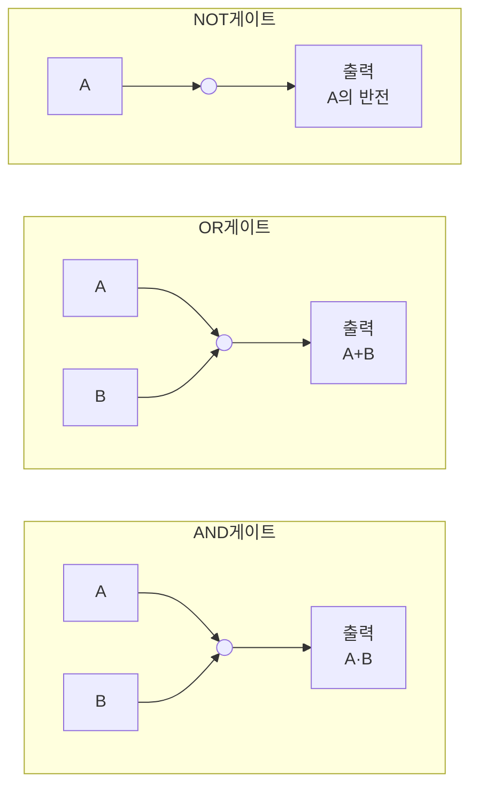

<Callout type="info">
  **이번 문서의 목표:** 이 문서를 다 읽으면 2진수·8진수·16진수를 서로 변환하고, AND·OR·NOT·XOR의 진리표를 채우며, 회로도에 그려진 논리게이트 기호가 어떤 연산인지 읽어낼 수 있다.
</Callout>

## 왜 진법과 논리 연산을 먼저 봐야 하는가

08편에서 다루는 발진회로·필터와 함께, 정보전송일반 과목에는 **디지털 논리회로**(가산기·인코더·디코더·멀티플렉서·플립플롭)를 계산하는 문제가 나옵니다. 이 문제들을 풀려면 회로도의 게이트 기호를 보고 바로 무슨 연산인지 읽어내는 능력과, 입출력값을 2진수·16진수로 오가며 계산하는 능력이 먼저 필요합니다. 이 편은 그 두 가지 최소 도구만 다집니다.

> **쉽게 말하면:** 이 편은 08편의 회로 계산 문제를 풀기 전에 반드시 있어야 하는 "숫자 표기법"과 "참·거짓 연산" 사용법 설명서입니다.

**겹치는 내용 안내:** 진법 변환의 자세한 계산 원리와 오류검출 부호까지 포함한 전체 내용은 독학사 컴퓨터구조 2단계 01편(진법과 컴퓨터 표현 입문), 불대수·드모르간 법칙의 증명 과정은 같은 과목 02편(불대수와 논리게이트 읽는 법)에서 이미 깊게 다룹니다. 이 편에서는 그 내용을 계산에 바로 쓸 수 있는 수준으로만 요약하고, 정보통신기사 회로 문제에 맞춰 게이트 기호 읽기에 집중합니다.

## 1. 2진법·8진법·16진법 — 요약과 변환

> **쉽게 말하면:** 진법은 "몇 개의 숫자로 한 자리를 표현하는가"의 약속일 뿐이고, 어떤 진법이든 자리마다 기수의 거듭제곱을 곱해 더하면 원래 값이 된다.

컴퓨터는 전압이 낮음(0)과 높음(1) 두 상태만 안정적으로 구별하므로 **2진법**(binary)을 기본으로 씁니다. 그런데 2진수는 자리 수가 너무 길어 사람이 읽기 불편하므로, 4자리씩 묶어 읽는 **16진법**(hexadecimal)과 3자리씩 묶어 읽는 **8진법**(octal)을 함께 씁니다.

| 진법 | 기수 | 사용 숫자 | 한 자리가 표현하는 2진수 자리 수 |
|------|------|-----------|--------------------------------|
| 2진법 | 2 | 0, 1 | 1 |
| 8진법 | 8 | 0–7 | 3 |
| 10진법 | 10 | 0–9 | – |
| 16진법 | 16 | 0–9, A–F | 4 |

### 2진수 → 10진수

오른쪽 끝 자리부터 $2^0, 2^1, 2^2, \ldots$ 를 곱해 더합니다.

$$
1011_{2} = 1 \times 2^{3} + 0 \times 2^{2} + 1 \times 2^{1} + 1 \times 2^{0} = 8+0+2+1 = 11
$$

### 10진수 → 2진수

몫이 0이 될 때까지 2로 계속 나누고, 나머지를 **아래에서 위로** 읽습니다. 13을 예로 들면 $13 \div 2 = 6\ \cdots\ 1$, $6 \div 2 = 3\ \cdots\ 0$, $3 \div 2 = 1\ \cdots\ 1$, $1 \div 2 = 0\ \cdots\ 1$ 이므로 나머지를 거꾸로 읽어 $1101_{2}$ 입니다.

### 2진수 ↔ 16진수 — 4자리씩 묶기

2진수와 16진수는 한 16진수 자리가 정확히 2진수 4자리에 대응하므로, 곱셈·나눗셈 없이 **4자리씩 끊어서** 바로 대응시킬 수 있습니다.

$$
1011\ 0110_{2} = B6_{16}
$$

`1011`은 16진수 `B`(10진수 11), `0110`은 16진수 `6`에 대응합니다. 8진수는 같은 방식으로 3자리씩 끊어서 대응시킵니다.

**자주 틀리는 점:** 16진수 A–F는 각각 10–15를 나타내는 한 자리 숫자입니다. `A`를 "에이라는 문자"가 아니라 "10이라는 숫자"로 계산해야 하는데, 이를 잊고 자릿수 계산에서 빠뜨리는 실수가 흔합니다.

## 2. 불(Boole) 대수의 기본 연산자

> **쉽게 말하면:** 불대수는 참(1)과 거짓(0) 두 값만 다루는 논리 계산이고, 그 계산 결과를 하나하나 표로 정리한 것이 진리표다.

**불대수**(Boolean algebra)는 영국 수학자 조지 불(George Boole)이 만든, 참·거짓 두 값만 다루는 논리 체계입니다. **진리표**(truth table)는 입력의 모든 조합에 대한 출력을 나열한 표로, 입력이 $n$개면 $2^{n}$가지 조합이 나옵니다.

<table>
<thead><tr><th>A</th><th>B</th><th>AND (A·B)</th><th>OR (A+B)</th><th>XOR (A⊕B)</th></tr></thead>
<tbody>
<tr><td>0</td><td>0</td><td>0</td><td>0</td><td>0</td></tr>
<tr><td>0</td><td>1</td><td>0</td><td>1</td><td>1</td></tr>
<tr><td>1</td><td>0</td><td>0</td><td>1</td><td>1</td></tr>
<tr><td>1</td><td>1</td><td>1</td><td>1</td><td>0</td></tr>
</tbody>
</table>

- **AND**(논리곱): 두 입력이 **모두** 1일 때만 1. "우산도 챙기고(A) 신발도 신어야(B)" 외출 준비가 끝난다는 비유와 같습니다.
- **OR**(논리합): 둘 중 **하나라도** 1이면 1. "주말이거나(A) 공휴일이면(B)" 쉬는 날이라는 비유와 같습니다.
- **NOT**(논리부정): 입력을 그대로 뒤집습니다(0은 1로, 1은 0으로). 하나의 입력만 받습니다.
- **XOR**(배타적 논리합, exclusive OR): 두 입력이 **서로 다를 때만** 1. "정확히 하나만 참일 때"를 판별하는 연산으로, 통신에서는 오류검출 부호나 스크램블링에 쓰입니다.

**자주 틀리는 점:** OR과 XOR을 혼동하는 경우가 많습니다. 두 입력이 모두 1일 때 OR은 1이지만 XOR은 0입니다(두 입력이 "같으므로" 배타적 조건을 만족하지 못합니다).

## 3. 논리게이트 기호 읽는 법

**논리게이트**(logic gate)는 불대수 연산 하나하나를 전자 회로로 구현한 최소 부품으로, 회로도에서는 연산 종류마다 정해진 모양의 기호로 그려집니다.

실제 회로도에서 **AND 게이트**는 평평한 왼쪽 변에 둥근 오른쪽 끝을 가진 모양(문자 D를 닮은 모양)으로, **OR 게이트**는 왼쪽이 오목하게 들어가고 오른쪽 끝이 뾰족한 방패 모양으로 그려집니다. **NOT 게이트**는 삼각형 끝에 작은 원(버블)이 붙은 모양으로, 이 작은 원이 "신호를 반전시킨다"는 표시입니다. 이 원 기호는 뒤에 나오는 NAND(AND 뒤에 반전 원)·NOR(OR 뒤에 반전 원)에서도 똑같이 "출력을 반전시킨다"는 의미로 재사용되므로, 08편에서 조합논리회로를 읽을 때 이 원 하나의 유무를 놓치지 않는 것이 중요합니다.

## 핵심 정리

- 2진법·8진법·16진법은 모두 "자리값 = 기수의 거듭제곱"이라는 같은 원리를 따르며, 2진수와 16진수는 4자리씩 묶어 바로 대응시킬 수 있다.
- 16진수 A–F는 문자가 아니라 10–15를 나타내는 숫자로 계산해야 한다.
- AND는 모두 1일 때만 1, OR은 하나라도 1이면 1, XOR은 서로 다를 때만 1이며, OR과 XOR은 입력이 모두 1일 때 결과가 갈린다.
- 진리표는 입력 $n$개에 대해 $2^{n}$가지 조합을 나열한 표이며, 논리 연산을 검증하는 가장 확실한 도구다.
- 논리게이트 기호에서 반전을 뜻하는 작은 원(버블)의 유무가 AND/NAND, OR/NOR를 구분하는 핵심 표시다.
- 진법 변환과 불대수의 더 깊은 계산·증명은 독학사 컴퓨터구조 01·02편을 참고한다.

## 마무리 복습

<Quiz
  questionNumber={1}
  question="2진수 1011을 10진수로 옳게 변환한 것은?"
  options={['9', '10', '11', '13']}
  correctAnswer={3}
  explanation="1011은 오른쪽부터 2의0제곱,1제곱,2제곱,3제곱을 곱해 더하면 1+2+0+8=11이다. 각 자리의 자리값을 정확히 곱하는 것이 핵심이다."
  optionExplanations={['자리값 하나를 빠뜨렸을 때 나오는 값이다.', '자리값 계산 중 하나를 잘못 곱했을 때 나오는 값이다.', '1x8+0x4+1x2+1x1=11로 정확히 계산된 값이다.', '자리값을 하나 더 크게 계산했을 때 나오는 값이다.']}
/>

<Quiz
  questionNumber={2}
  question="2진수 10110110을 16진수로 옳게 변환한 것은?"
  options={['B6', '6B', 'A6', 'B7']}
  correctAnswer={1}
  explanation="4자리씩 끊으면 1011과 0110이 되고, 1011은 16진수 B(11), 0110은 16진수 6이므로 B6이다. 4자리 묶음의 순서를 바꾸지 않는 것이 중요하다."
  optionExplanations={['4자리 묶음의 순서를 앞뒤로 바꿔 읽은 오류다.', '1011=B, 0110=6이므로 B6이 정확한 순서다.', '1011을 10(A)으로 잘못 계산한 값이다.', '두 번째 묶음을 6이 아닌 7로 잘못 읽은 값이다.']}
/>

<Quiz
  questionNumber={3}
  question="A=1, B=0일 때 AND, OR, XOR 연산의 결과를 순서대로 옳게 나열한 것은?"
  options={['0, 1, 1', '1, 1, 0', '0, 0, 1', '1, 0, 1']}
  correctAnswer={1}
  explanation="A=1, B=0이면 AND는 둘 다 1이 아니므로 0, OR은 하나라도 1이면 1이므로 1, XOR은 서로 다르므로 1이다. 따라서 0, 1, 1이 정답이다."
  optionExplanations={['AND=0, OR=1, XOR=1이 정확한 순서다.', 'AND 값을 1로 잘못 계산한 오류다.', 'OR과 XOR 값을 서로 바꿔 계산한 오류다.', 'AND와 XOR 값을 서로 바꿔 계산한 오류다.']}
/>

<Quiz
  questionNumber={4}
  question="OR 연산과 XOR 연산의 결과가 서로 달라지는 입력 조합은?"
  options={['A=0, B=0', 'A=0, B=1', 'A=1, B=0', 'A=1, B=1']}
  correctAnswer={4}
  explanation="A=1, B=1일 때 OR은 1이지만 XOR은 두 입력이 같으므로 0이다. 다른 세 조합에서는 두 연산의 결과가 동일하다."
  optionExplanations={['이 조합에서는 OR=0, XOR=0으로 결과가 같다.', '이 조합에서는 OR=1, XOR=1로 결과가 같다.', '이 조합에서는 OR=1, XOR=1로 결과가 같다.', '이 조합에서만 OR=1, XOR=0으로 결과가 갈린다.']}
/>

<Quiz
  questionNumber={5}
  question="회로도에서 NOT 게이트를 다른 게이트와 구분하는 가장 확실한 표시는?"
  options={['입력선이 세 개 이상 있다', '출력 끝에 작은 원(버블)이 붙어 있다', '사각형 모양으로 그려진다', '출력선이 두 개다']}
  correctAnswer={2}
  explanation="NOT 게이트는 삼각형 끝에 작은 원이 붙어 신호를 반전시킨다는 것을 표시한다. 이 원은 NAND, NOR처럼 다른 게이트 뒤에 붙어도 동일하게 반전을 의미한다."
  optionExplanations={['NOT 게이트는 입력이 하나뿐이다.', '삼각형 끝의 작은 원이 반전을 나타내는 정확한 표시다.', 'NOT 게이트는 삼각형 모양이며 사각형이 아니다.', 'NOT 게이트를 포함한 대부분의 게이트는 출력선이 하나다.']}
/>

<Quiz
  questionNumber={6}
  question="16진수 2F를 10진수로 옳게 변환한 것은?"
  options={['29', '31', '47', '2F']}
  correctAnswer={3}
  explanation="16진수 2F는 2x16의1제곱 + F(15)x16의0제곱 = 32+15=47이다. F는 문자가 아니라 15를 나타내는 숫자로 계산해야 한다."
  optionExplanations={['F를 15가 아닌 13 정도로 계산했을 때 나오는 값이다.', 'F를 15가 아닌 다른 값으로 잘못 계산했을 때 나오는 값이다.', '2x16+15=47로 정확히 계산된 값이다.', '변환하지 않고 16진수 표기를 그대로 남긴 값이다.']}
/>

## 참고 자료

- [한국방송통신전파진흥원(KCA) - 출제기준 자료실](https://www.cq.or.kr/qh_cusgm10_001.do)
- [Q-Net(한국산업인력공단) - 국가자격 종목별 상세정보(정보통신기사)](https://www.q-net.or.kr/crf005.do?id=crf00503&jmCd=1192)
