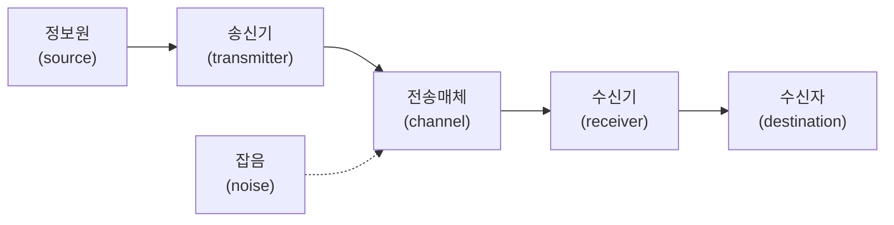

<Callout type="info">
  **이번 문서의 목표:** 이 문서를 다 읽으면 신호·데이터·정보를 구분하고, 통신 시스템을 송신기·전송매체·수신기·잡음이라는 다섯 요소로 그려낼 수 있으며, 대역폭과 전송속도라는 두 숫자가 왜 다른지 계산으로 확인할 수 있다.
</Callout>

## 왜 지금 이 지도부터 그려야 하는가

06편부터 이어지는 "정보전송일반" 본론에서는 원천부호화, 변복조, 다중화, 전송선로처럼 통신의 구체적인 기술들이 쏟아집니다. 그런데 이 기술들은 전부 **같은 무대 위**에서 벌어지는 일입니다. 그 무대가 바로 "신호가 만들어져서, 전송매체를 타고, 잡음을 뚫고, 수신 측에 도착한다"는 통신 시스템의 기본 골격입니다. 이 골격과 그 위에서 쓰이는 최소 어휘(신호·데이터·정보, 아날로그·디지털, 대역폭·전송속도)를 먼저 확실히 잡아 두지 않으면, 뒤에 나오는 각론들이 "무엇을 하기 위한 기술인지" 방향을 잃기 쉽습니다.

05편에서는 이 통신 시스템 중에서도 **여러 기기가 서로 데이터를 주고받는 상황**(패킷·IP 주소·LAN/WAN)만 떼어내 지도를 그렸습니다. 이번 편은 그보다 더 근본적인 자리에서, 신호 하나가 송신 측에서 수신 측까지 어떻게 이동하는지를 다룹니다.

> **쉽게 말하면:** 이 편은 통신이라는 큰 그림을 이루는 등장인물(신호·잡음·송신기·수신기)의 이름표를 붙이는 시간입니다.

## 1. 신호·데이터·정보의 구분

### 왜 필요한가

일상에서는 "정보"와 "데이터"라는 말을 뒤섞어 씁니다. 하지만 통신공학에서는 이 둘, 그리고 "신호"까지 세 가지를 분명히 구분합니다. 이 구분이 흐릿하면 뒤에서 "신호를 부호화한다", "데이터를 변조한다" 같은 문장을 만났을 때 정확히 무엇을 바꾸는 이야기인지 헷갈립니다.

> **쉽게 말하면:** 데이터는 원재료, 정보는 그 재료를 해석해서 얻은 의미, 신호는 그 재료를 실어 나르는 운송 수단입니다.

### 정의

- **데이터**(data): 아직 해석되지 않은 순수한 값이나 사실의 나열입니다. 예를 들어 `23`이라는 숫자 하나는 그 자체로는 데이터일 뿐입니다.
- **정보**(information): 데이터에 맥락(context)이 더해져 의미를 갖게 된 것입니다. `23`이라는 데이터에 "서울의 현재 기온(단위 섭씨)"이라는 맥락이 붙어야 비로소 "오늘 서울은 쌀쌀하다"는 의미를 만드는 정보가 됩니다.
- **신호**(signal): 데이터나 정보를 실제로 전송매체 위에서 옮기기 위해 전압·전류·빛 같은 물리적인 형태로 바꾼 것입니다. 온도 23도라는 정보를 전화선으로 보내려면, 그 정보를 전압의 오르내림 같은 전기 신호로 바꿔야 합니다.

### 작은 예시

### 자주 틀리는 점

"데이터 통신"이라는 말 때문에 데이터와 신호를 같은 것으로 착각하기 쉽습니다. 하지만 **통신망 위를 실제로 흘러가는 것은 신호**이고, 데이터·정보는 그 신호 안에 담긴 내용물입니다. 이후 편에서 "신호 대 잡음비(SNR)"라는 말이 나오면 잡음과 섞이는 대상은 신호(전기적 형태)이지, 정보 그 자체가 아니라는 점을 기억해야 합니다.

## 2. 아날로그 신호와 디지털 신호

### 왜 필요한가

06편의 원천부호화(source coding)는 결국 "아날로그 신호를 디지털 신호로 바꾸는 작업"입니다. 그 작업을 이해하려면 먼저 아날로그와 디지털이 신호의 형태로서 정확히 무엇이 다른지 알아야 합니다.

> **쉽게 말하면:** 아날로그는 경사로처럼 값이 끊김 없이 이어지고, 디지털은 계단처럼 값이 정해진 몇 단계로만 뚝뚝 끊어집니다.

### 정의

**아날로그**(analog) 신호는 시간과 크기 두 축 모두에서 **연속적인**(continuous) 값을 갖는 신호입니다. 온도계의 수은주나 마이크가 받아들이는 목소리 파형이 대표적입니다. **디지털**(digital) 신호는 시간과 크기 모두 **이산적인**(discrete, 띄엄띄엄 떨어진) 값만 가지며, 통신에서는 보통 0과 1 두 값만 갖는 형태로 다룹니다.

| 구분 | 아날로그 신호 | 디지털 신호 |
|------|---------------|-------------|
| 값의 형태 | 연속적(무한히 세밀한 값) | 이산적(정해진 몇 단계만 존재) |
| 잡음에 대한 강도 | 잡음이 섞이면 원래 값과 구분하기 어려움 | 임계값만 넘지 않으면 0·1로 복원 가능해 강함 |
| 대표 예시 | 아날로그 라디오 방송, 수은 온도계 | 컴퓨터 내부 신호, 디지털 방송 |
| 06편과의 연결 | 원천부호화의 입력 | 원천부호화(표본화·양자화·부호화)의 출력 |

### 자주 틀리는 점

"아날로그는 정밀하지 않고 디지털은 항상 정밀하다"라고 단정하면 안 됩니다. 아날로그 신호는 이론적으로 무한히 세밀한 값을 표현할 수 있어 오히려 원본에 가장 가깝습니다. 디지털은 06편에서 배우는 **양자화**(quantization) 과정에서 계단 사이의 값을 반올림하며 오차(양자화 잡음)가 생깁니다. 디지털이 유리한 진짜 이유는 정밀함이 아니라, 잡음에 강하고 오류를 검출·정정하기 쉽다는 점입니다.

## 3. 통신 시스템의 기본 모델

### 왜 필요한가

원천부호화든 변복조든 다중화든, "정보전송일반" 과목의 모든 기술은 결국 신호를 **송신 측에서 수신 측으로 옮기는** 하나의 목적을 위한 부품들입니다. 이 부품들이 전체 그림에서 어느 자리에 들어가는지 알아야 각 기술의 역할이 헷갈리지 않습니다.

> **쉽게 말하면:** 통신은 "말하는 사람 → 확성기 → 공기(그리고 소음) → 귀 → 듣는 사람"과 똑같은 구조를 전기 신호로 반복하는 일입니다.

### 다섯 요소 모델

| 요소 | 정의 | 통신 시스템에서 하는 일 |
|------|------|--------------------------|
| 정보원(source) | 전달하고 싶은 원래 정보를 만들어내는 주체 | 목소리·문서·영상 등 원본 정보를 생성 |
| 송신기(transmitter) | 정보를 전송매체에 알맞은 신호 형태로 바꾸는 장치 | 부호화(06편)·변조(07편) 수행 |
| 전송매체(channel) | 신호가 실제로 이동하는 통로 | 동축케이블·광케이블·공기(무선) 등(09편에서 상세) |
| 잡음(noise) | 전송 과정에서 신호에 원치 않게 섞여드는 방해 요소 | 신호를 왜곡시켜 수신 오류의 원인이 됨(10편에서 SNR·BER로 정량화) |
| 수신기(receiver) | 전송매체를 거쳐 온 신호를 원래 정보 형태로 되돌리는 장치 | 복조·복호화를 수행해 송신기의 반대 과정을 진행 |
| 수신자(destination) | 최종적으로 정보를 받는 주체 | 사람 또는 기기 |

**생활 비유:** 친구에게 전화로 이야기를 전달하는 상황을 떠올려 보면, 나(정보원)의 목소리가 전화기 마이크(송신기)를 거쳐 전화선(전송매체)을 타고 흐르다가, 도중에 잡음(전선 잡음이나 주변 소음)이 섞이고, 상대방 전화기 스피커(수신기)를 거쳐 친구(수신자)의 귀에 도달하는 것과 같은 구조입니다.

### 자주 틀리는 점

전송매체(channel)와 잡음(noise)을 같은 개념으로 착각하는 경우가 있습니다. 전송매체는 신호가 지나가는 **통로 자체**이고, 잡음은 그 통로를 지나는 동안 **원치 않게 끼어드는 방해 요소**입니다. 통로가 있어야 잡음도 끼어들 자리가 생기지만, 통로와 잡음은 서로 다른 존재입니다. 또한 송신기와 수신기를 "장치 전체"로 뭉뚱그리기 쉬운데, 실제로는 각각 부호화·변조(송신기)와 복조·복호화(수신기)라는 서로 반대 방향의 세부 작업으로 나뉘며, 이 세부 작업이 06·07편의 주제입니다.

## 4. 대역폭과 전송속도 감 잡기

### 왜 필요한가

"이 회선의 대역폭은 100MHz다"와 "이 회선의 전송속도는 100Mbps다"는 완전히 다른 문장인데도 실제 학습에서 가장 자주 섞이는 두 표현입니다. 두 값이 어떻게 다른 단위이고 무엇을 재는지 감을 잡아 두어야, 07편의 변조와 10편의 채널용량 계산에서 헷갈리지 않습니다.

> **쉽게 말하면:** 대역폭은 신호가 차지하는 "주파수 도로의 폭"이고, 전송속도는 그 도로 위를 실제로 얼마나 많은 데이터가 지나가는지를 나타내는 "교통량"입니다.

### 대역폭(bandwidth)

**대역폭**(bandwidth, BW)은 신호가 차지하는 주파수 범위의 폭입니다. 신호에 포함된 가장 높은 주파수 성분과 가장 낮은 주파수 성분의 차이로 구합니다.

$$
BW = f_H - f_L
$$

- $BW$: 대역폭(bandwidth, 신호가 차지하는 주파수 범위의 폭, 단위 Hz)
- $f_H$: 신호에 포함된 성분 중 가장 높은 주파수
- $f_L$: 신호에 포함된 성분 중 가장 낮은 주파수

**계산 예시 — 전화 음성 대역.** 유선전화망은 사람 음성 중 300Hz~3400Hz 구간만 잘라 전송하도록 설계되어 있습니다.

**1단계 — 값 정리**

$$
f_H = 3400\ \text{Hz}, \quad f_L = 300\ \text{Hz}
$$

**2단계 — 대역폭 계산**

$$
BW = 3400 - 300 = 3100\ \text{Hz}
$$

**해석:** 전화 회선 하나가 차지하는 주파수 폭은 3100Hz입니다. 06편의 나이퀴스트 표본화(8kHz)나 07편의 변조 대역폭 계산에서 이 3100Hz라는 값이 기준선처럼 반복해 등장합니다.

### 전송속도(bit rate)

**전송속도**(bit rate, 비트율, $R$)는 1초 동안 전송되는 비트의 개수입니다(단위 bps, bit per second). 전송속도와 시간을 곱하면 그 시간 동안 전송된 총 비트 수를 구할 수 있습니다.

$$
\text{총 비트 수} = R \times t
$$

- $\text{총 비트 수}$: 정해진 시간 동안 전송된 비트의 총량(단위 bit)
- $R$: 전송속도(비트율, 단위 bps)
- $t$: 전송 시간(단위 초)

**계산 예시.** 전송속도 2Mbps인 회선으로 4초 동안 데이터를 보냈다면 전송된 총 비트 수는?

**1단계 — 단위 정리**

$$
R = 2\ \text{Mbps} = 2 \times 10^{6}\ \text{bps}
$$

**2단계 — 공식 대입**

$$
\text{총 비트 수} = (2 \times 10^{6}) \times 4 = 8 \times 10^{6}\ \text{bit} = 8\ \text{Mbit}
$$

**해석:** 4초 동안 800만 비트(8메가비트)가 전송됩니다. 대역폭(Hz)은 신호가 차지하는 주파수의 폭을, 전송속도(bps)는 실제로 흐르는 비트의 양을 나타내므로 서로 다른 물리량입니다. 다만 두 값은 완전히 무관하지는 않습니다 — 대역폭이 넓을수록 더 높은 전송속도를 실을 여지가 커진다는 관계는 10편에서 채널용량(섀넌 용량) 공식으로 정확히 계산합니다.

### 자주 틀리는 점

"대역폭이 100Hz 넓어지면 전송속도도 정확히 100bps 늘어난다"처럼 두 값을 같은 단위인 것처럼 1대1로 치환하면 안 됩니다. 대역폭의 단위는 헤르츠(Hz, 주파수)이고 전송속도의 단위는 bps(초당 비트 수)로 물리적 의미 자체가 다릅니다. 대역폭이 전송속도의 상한선에 영향을 준다는 것은 맞지만, 정확한 관계식은 변조 방식(07편)과 잡음 환경(10편)까지 함께 고려해야 구해집니다.

## 핵심 정리

- **데이터**는 해석 전의 원재료, **정보**는 맥락이 더해져 의미를 가진 데이터, **신호**는 이 둘을 실어 나르는 물리적 형태다.
- **아날로그** 신호는 시간·크기 모두 연속적이고, **디지털** 신호는 이산적인 값(주로 0과 1)만 갖는다. 디지털이 유리한 이유는 정밀함이 아니라 잡음에 강하고 오류 검출·정정이 쉽다는 점이다.
- 통신 시스템은 정보원 → 송신기 → 전송매체(잡음 포함) → 수신기 → 수신자의 다섯 요소로 이루어지며, 전송매체와 잡음은 서로 다른 개념이다.
- **대역폭**($BW=f_H-f_L$)은 신호가 차지하는 주파수 범위의 폭(Hz)이고, **전송속도**($R$, bps)는 초당 전송되는 비트 수로 서로 다른 물리량이다.
- 전화 음성 대역(300–3400Hz)의 대역폭은 3100Hz이며, 이 값은 06·10편의 계산에서 다시 등장한다.

## 마무리 복습

<Quiz
  questionNumber={1}
  question="데이터, 정보, 신호의 관계를 가장 정확히 설명한 것은?"
  options={['신호는 데이터에 맥락이 더해져 의미를 가진 것이다', '데이터는 해석되지 않은 원재료이고 정보는 맥락이 더해져 의미를 가진 것이다', '정보와 신호는 항상 같은 것을 가리키는 동의어다', '데이터는 반드시 전기적 형태로만 존재한다']}
  correctAnswer={2}
  explanation="데이터는 해석 전의 값이고, 정보는 그 데이터에 맥락이 더해져 의미를 갖게 된 것이며, 신호는 이 둘을 전송매체 위에서 옮기기 위한 물리적 형태다."
  optionExplanations={['맥락이 더해져 의미를 갖는 것은 신호가 아니라 정보다.', '데이터와 정보의 관계를 정확히 설명했다.', '정보는 의미, 신호는 물리적 운반 형태로 서로 다른 개념이다.', '데이터는 숫자나 문자 형태로도 존재할 수 있으며 반드시 전기 신호일 필요는 없다.']}
/>

<Quiz
  questionNumber={2}
  question="아날로그 신호와 디지털 신호에 대한 설명으로 옳은 것은?"
  options={['아날로그 신호는 시간과 크기 모두 이산적인 값을 갖는다', '디지털 신호가 아날로그 신호보다 항상 원본에 더 가깝다', '디지털 신호가 유리한 핵심 이유는 잡음에 강하고 오류 검출·정정이 쉽다는 점이다', '아날로그 신호는 0과 1 두 값만으로 표현된다']}
  correctAnswer={3}
  explanation="디지털 신호는 양자화 과정에서 오차가 생겨 원본과 완전히 같지 않지만, 잡음에 강하고 오류를 검출·정정하기 쉬워 통신에서 널리 쓰인다."
  optionExplanations={['이산적인 값을 갖는 것은 아날로그가 아니라 디지털 신호다.', '디지털은 양자화 오차 때문에 오히려 원본과 차이가 생길 수 있다.', '잡음 강도와 오류 검출·정정 용이성이 디지털 신호가 널리 쓰이는 핵심 이유다.', '0과 1 두 값만 갖는 것은 아날로그가 아니라 디지털 신호의 특징이다.']}
/>

<Quiz
  questionNumber={3}
  question="통신 시스템의 다섯 요소 모델에서 전송매체와 잡음의 관계를 가장 정확히 설명한 것은?"
  options={['전송매체와 잡음은 완전히 같은 개념이다', '전송매체는 신호가 지나가는 통로이고 잡음은 그 통로에서 원치 않게 섞여드는 방해 요소다', '잡음은 송신기 내부에서만 발생하고 전송매체에서는 발생하지 않는다', '전송매체가 없어도 잡음은 신호에 영향을 줄 수 없다']}
  correctAnswer={2}
  explanation="전송매체는 신호가 이동하는 통로 자체이고, 잡음은 그 통로를 지나는 동안 신호에 원치 않게 섞여드는 방해 요소로 서로 다른 개념이다."
  optionExplanations={['통로 자체와 방해 요소는 서로 다른 개념이므로 같다고 볼 수 없다.', '전송매체와 잡음의 관계를 정확히 설명했다.', '잡음은 전송매체를 지나는 동안에도 발생할 수 있다.', '전송매체가 있어야 잡음이 섞여들 통로가 생기므로 서로 무관하지 않다.']}
/>

<Quiz
  questionNumber={4}
  question="어느 통신 회선이 300Hz에서 3400Hz까지의 주파수 성분을 전송한다면 이 신호의 대역폭은?"
  options={['300 Hz', '3100 Hz', '3400 Hz', '3700 Hz']}
  correctAnswer={2}
  explanation="대역폭은 가장 높은 주파수에서 가장 낮은 주파수를 뺀 값이므로 3400-300=3100Hz가 정답이다."
  optionExplanations={['가장 낮은 주파수 값 하나만 가져온 값이다.', '3400-300=3100으로 정확히 계산된 값이다.', '가장 높은 주파수 값 하나만 가져온 값으로 뺄셈을 하지 않았다.', '두 값을 빼지 않고 더해서 나온 값이다.']}
/>

<Quiz
  questionNumber={5}
  question="전송속도 2Mbps인 회선으로 4초 동안 전송한 총 비트 수는?"
  options={['2 x 10의6제곱 bit', '4 x 10의6제곱 bit', '8 x 10의6제곱 bit', '8 x 10의5제곱 bit']}
  correctAnswer={3}
  explanation="총 비트 수는 전송속도와 시간의 곱이므로 (2x10의6제곱)x4=8x10의6제곱bit이다."
  optionExplanations={['시간(4초)을 곱하지 않은 값이다.', '전송속도(2Mbps)를 곱하지 않고 시간만 반영한 값이다.', '(2x10의6제곱)x4의 정확한 계산 결과다.', '지수 계산을 한 자리 축소해 잘못 계산한 값이다.']}
/>

<Quiz
  questionNumber={6}
  question="대역폭과 전송속도의 관계에 대한 설명으로 가장 적절한 것은?"
  options={['대역폭과 전송속도는 단위가 같아 서로 바꿔 부를 수 있다', '대역폭이 넓어지면 전송속도도 항상 정확히 같은 크기만큼 늘어난다', '대역폭은 주파수 범위의 폭을, 전송속도는 초당 전송되는 비트 수를 나타내며 서로 다른 물리량이다', '전송속도는 잡음과 무관하게 대역폭만으로 완전히 결정된다']}
  correctAnswer={3}
  explanation="대역폭의 단위는 헤르츠(Hz)로 주파수 범위의 폭을 나타내고, 전송속도의 단위는 bps로 초당 전송 비트 수를 나타내는 서로 다른 물리량이다."
  optionExplanations={['대역폭의 단위는 Hz, 전송속도의 단위는 bps로 서로 다르다.', '두 값이 1대1로 같은 크기만큼 늘어나는 것은 아니다.', '두 물리량의 정의를 정확히 구분했다.', '전송속도의 실제 상한선은 대역폭뿐 아니라 잡음 환경까지 함께 고려해 결정된다.']}
/>

## 참고 자료

- [한국방송통신전파진흥원(KCA) - 출제기준 자료실](https://www.cq.or.kr/qh_cusgm10_001.do)
- [Q-Net(한국산업인력공단) - 국가자격 종목별 상세정보(정보통신기사)](https://www.q-net.or.kr/crf005.do?id=crf00503&jmCd=1192)
