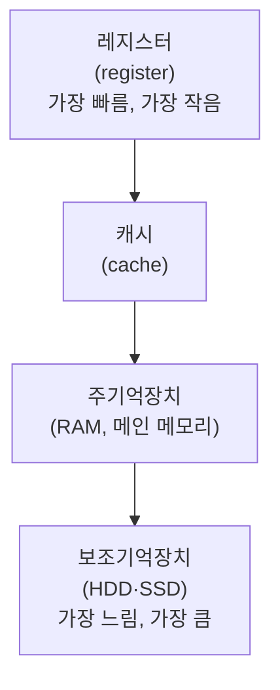
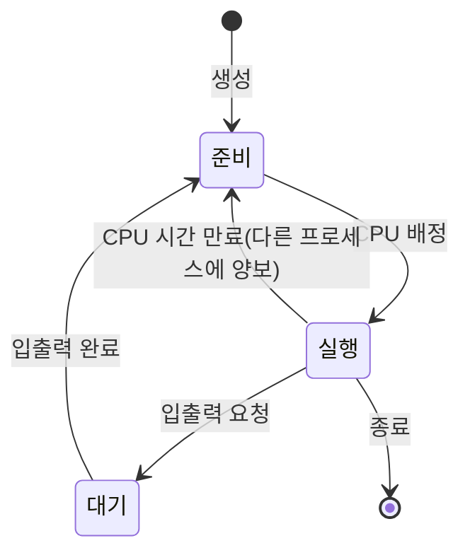

<Callout type="info">
  **이번 문서의 목표:** 이 문서를 다 읽으면 컴퓨터를 이루는 CPU·기억장치·입출력장치의 역할을 구분하고, 운영체제가 하는 일을 네 가지로 나눠 설명하며, 프로그램과 프로세스의 차이를 말할 수 있다.
</Callout>

## 왜 지금 이 용어부터 정리해야 하는가

정보시스템운용 과목의 서버 구축(20편)·서버 가상화(21편), 컴퓨터일반 과목의 하드웨어·OS 개요(24편)는 모두 "컴퓨터라는 기계 안에서 무슨 일이 벌어지는가"를 전제로 이야기를 풀어 갑니다. 그런데 컴퓨터 구조나 운영체제(OS, Operating System) 자체의 아주 세밀한 동작 원리(캐시 계층 구조, 가상메모리, CPU 스케줄링 알고리즘 등)는 독학사 컴퓨터구조·운영체제 과목이 이미 깊게 다루는 영역입니다. 이 편은 그 상세 원리를 반복하지 않고, 20·21·24편을 읽을 때 걸리지 않을 **최소한의 이름표**만 확보합니다.

> **쉽게 말하면:** 이 편은 컴퓨터 내부를 구경하기 전에 "이 부품 이름은 무엇이고 무슨 일을 하는가"를 알려주는 견학 안내판입니다.

## 1. 컴퓨터의 기본 구성: 중앙처리장치·기억장치·입출력장치

### 왜 필요한가

서버 한 대를 구축하거나 가상화(virtualization)로 여러 대처럼 나눠 쓰려면, 먼저 물리적인 컴퓨터 한 대가 어떤 부품들로 이루어지는지부터 알아야 합니다. "CPU를 많이 준다", "메모리를 늘린다" 같은 표현이 정확히 무엇을 가리키는지 구분되지 않으면 20·21편의 설명이 뜬구름처럼 느껴집니다.

> **쉽게 말하면:** 컴퓨터는 생각하는 부분(CPU), 기억하는 부분(기억장치), 주고받는 부분(입출력장치)으로 나눌 수 있습니다.

### 중앙처리장치(CPU)

**중앙처리장치**(CPU, Central Processing Unit)는 컴퓨터의 두뇌에 해당하는 부품으로, 명령을 해석하고 실제 계산을 수행합니다. 내부는 다시 두 부분으로 나뉩니다.

- **제어장치**(control unit): 명령어를 하나씩 읽어 들여 "이 명령이 무슨 일을 해야 하는지" 해석하고, 다른 장치들에 언제 무엇을 할지 지시 신호를 보냅니다.
- **연산장치**(ALU, Arithmetic Logic Unit, 산술논리연산장치): 제어장치의 지시에 따라 덧셈·뺄셈 같은 산술 연산과 AND·OR 같은 논리 연산(02편 참고)을 실제로 수행합니다.

**생활 비유:** 제어장치는 요리 레시피를 읽으며 "다음엔 이 재료를 볶으세요"라고 지시하는 역할이고, 연산장치는 그 지시대로 실제 손을 움직여 재료를 볶는 역할입니다.

### 기억장치

**기억장치**(memory)는 데이터와 명령어를 저장하는 부품으로, CPU와의 거리와 속도에 따라 계층을 이룹니다.

- **레지스터**(register): CPU 내부에 있는 아주 작고 빠른 임시 저장 공간으로, 지금 당장 계산에 쓰는 값만 잠깐 담아 둡니다.
- **캐시**(cache): CPU와 주기억장치 사이에서 자주 쓰는 데이터를 미리 옮겨 놓아 속도 차이를 줄여주는 완충 공간입니다.
- **주기억장치**(main memory, 대표적으로 RAM): 지금 실행 중인 프로그램과 데이터를 담아 두는 공간으로, 전원이 꺼지면 내용이 사라지는 **휘발성**(volatile) 메모리입니다.
- **보조기억장치**(secondary storage, HDD·SSD 등): 전원이 꺼져도 내용이 유지되는 **비휘발성**(non-volatile) 저장장치로, 용량은 크지만 CPU가 직접 계산에 쓰기에는 느립니다.

**자주 틀리는 점:** RAM과 ROM을 혼동하는 경우가 흔합니다. RAM(Random Access Memory)은 전원이 꺼지면 내용이 사라지는 주기억장치이고, ROM(Read Only Memory)은 전원이 꺼져도 내용이 유지되며 기본적으로 읽기 전용인 기억장치(예: 컴퓨터를 켤 때 가장 먼저 실행되는 기본 입출력 프로그램 저장용)입니다. "메모리 = RAM"이라고만 알고 있으면 ROM이 나오는 문제에서 혼동하기 쉽습니다.

### 계산 — 주소버스 비트 수와 최대 메모리 용량

**왜 필요한가:** CPU가 기억장치의 특정 위치를 가리킬 때 쓰는 신호선을 **주소버스**(address bus)라 합니다. 주소버스의 비트 수가 정해지면, CPU가 구분할 수 있는 최대 메모리 주소의 개수도 함께 정해집니다.

$$
N = 2^{n}
$$

- $N$: CPU가 구분할 수 있는 최대 주소(메모리 칸)의 개수
- $n$: 주소버스의 비트 수

**계산 예시.** 주소버스가 32비트라면 CPU가 지정할 수 있는 최대 메모리 주소는 몇 개인가.

**1단계 — 공식 대입**

$$
N = 2^{32}
$$

**2단계 — 값 계산**

$$
2^{32} = 4{,}294{,}967{,}296
$$

**해석:** 32비트 주소버스는 약 43억 개의 서로 다른 메모리 칸을 가리킬 수 있습니다. 한 칸이 1바이트를 저장한다고 하면 이는 약 4기가바이트(GB)에 해당하며, "32비트 운영체제는 메모리를 4GB까지만 인식한다"는 말이 여기서 나옵니다. 주소버스 비트 수가 하나 늘어날 때마다 표현 가능한 주소 개수는 두 배로 늘어난다는 점도 함께 기억해 둘 만합니다.

### 입출력장치

**입출력장치**(I/O device, Input/Output device)는 컴퓨터와 외부 세계 사이에서 데이터를 주고받는 장치입니다. 키보드·마우스·스캐너처럼 데이터를 컴퓨터 안으로 들여오는 **입력장치**(input device)와, 모니터·프린터처럼 컴퓨터 안의 데이터를 밖으로 내보내는 **출력장치**(output device)로 나뉩니다. 네트워크 카드나 저장장치처럼 입력과 출력을 모두 수행하는 장치도 있습니다.

### 자주 틀리는 점

주기억장치와 보조기억장치를 "둘 다 그냥 저장 공간"으로 뭉뚱그리기 쉽습니다. 결정적인 차이는 **휘발성 여부**와 **CPU와의 접근 속도**입니다. 지금 실행 중인 프로그램이 직접 올라가 계산에 쓰이는 곳은 주기억장치(RAM)이고, 전원을 꺼도 남겨 둬야 할 파일은 보조기억장치(HDD·SSD)에 저장합니다. 20편에서 다루는 저장장치(DAS·NAS·SAN)와 RAID는 모두 이 보조기억장치를 여러 대 묶어 안정성과 속도를 높이는 기술입니다.

## 2. 운영체제(OS)의 기본 기능

### 왜 필요한가

방금 살펴본 CPU·메모리·입출력장치는 그 자체로는 사람이 직접 다루기 어려운 하드웨어 부품일 뿐입니다. 이 부품들을 여러 프로그램이 사이좋게 나눠 쓸 수 있도록 관리하고, 사람이 편하게 다룰 수 있는 창구를 마련해 주는 소프트웨어가 필요한데, 그 역할을 하는 것이 운영체제입니다.

> **쉽게 말하면:** 운영체제는 컴퓨터라는 건물의 시설관리팀입니다. 전기(CPU 시간)를 각 사무실(프로그램)에 나눠 배분하고, 창고(기억장치) 공간을 정리하며, 외부 택배(입출력)를 접수·전달합니다.

### 정의

**운영체제**(OS, Operating System)는 컴퓨터 하드웨어 자원을 관리하고, 응용 프로그램과 하드웨어 사이를 중개하는 시스템 소프트웨어입니다. 응용 프로그램(예: 문서 작성 프로그램, 웹 브라우저)이 직접 하드웨어를 제어하지 않고 운영체제가 제공하는 창구를 통해서만 하드웨어를 사용하도록 하는 것이 핵심 역할입니다.

### 운영체제의 네 가지 기본 기능

| 기능 | 하는 일 |
|------|---------|
| 프로세스 관리(process management) | 여러 프로그램이 CPU 시간을 나눠 쓸 수 있도록 실행 순서와 자원을 배분 |
| 기억장치 관리(memory management) | 실행 중인 프로그램들에 메모리 공간을 나눠 배정하고 회수 |
| 파일시스템 관리(file system management) | 보조기억장치에 파일을 체계적으로 저장·검색할 수 있도록 구조화 |
| 입출력 관리(I/O management) | 키보드·모니터·저장장치 같은 입출력장치와 프로그램 사이의 데이터 전달을 중개 |

**자주 틀리는 점:** 운영체제를 "컴퓨터에 설치하는 여러 프로그램 중 하나"로만 생각하기 쉽지만, 운영체제는 다른 모든 응용 프로그램이 하드웨어를 쓸 수 있게 해 주는 **기반 소프트웨어**라는 점에서 성격이 다릅니다. 문서 작성 프로그램이나 웹 브라우저 같은 응용 소프트웨어는 운영체제가 제공하는 창구 위에서만 동작합니다. 20편의 리눅스(Linux)·윈도(Windows) 서버 구축은 바로 이 운영체제를 서버 목적에 맞게 설정하는 작업입니다.

## 3. 프로세스라는 개념

### 왜 필요한가

운영체제의 첫 번째 기능인 "프로세스 관리"를 이해하려면, 먼저 **프로세스**(process)가 무엇인지부터 알아야 합니다. 특히 프로그램과 프로세스를 같은 것으로 착각하면 21편의 가상화(하나의 물리 서버 위에서 여러 운영체제·프로세스를 동시에 돌리는 기술)를 이해하기 어렵습니다.

> **쉽게 말하면:** 프로그램은 요리 레시피가 적힌 종이이고, 프로세스는 그 레시피를 보고 실제로 요리하고 있는 현재 진행 상황입니다.

### 정의

**프로그램**(program)은 보조기억장치에 파일 형태로 저장된, 아직 실행되지 않은 정적인 명령어의 나열입니다. **프로세스**(process)는 그 프로그램이 실행되어 주기억장치에 올라가, CPU 시간과 메모리 같은 자원을 실제로 할당받아 동작하고 있는 **동적인 상태**를 가리킵니다. 같은 프로그램이라도 여러 번 실행하면 여러 개의 서로 다른 프로세스가 만들어질 수 있습니다.

### 프로세스의 상태 변화

프로세스는 실행되는 동안 여러 상태를 오갑니다. 대표적인 세 가지 상태는 다음과 같습니다.

- **준비**(ready) 상태: CPU를 배정받으면 바로 실행될 수 있도록 대기하는 상태
- **실행**(running) 상태: 실제로 CPU를 배정받아 명령어를 수행하고 있는 상태
- **대기**(waiting/blocked) 상태: 입출력 완료처럼 어떤 사건을 기다리느라 실행을 멈춘 상태

CPU 하나가 짧은 시간 단위로 여러 프로세스의 실행 상태를 빠르게 번갈아 가며 처리하면, 사람 눈에는 여러 프로그램이 동시에 실행되는 것처럼 보입니다. 이렇게 여러 프로세스를 번갈아 실행하는 방식을 **다중작업**(multitasking)이라 하며, 실행 중이던 프로세스의 상태를 저장하고 다른 프로세스의 상태를 불러오는 전환 작업을 **문맥 전환**(context switching)이라 합니다.

### 자주 틀리는 점

"프로그램을 하나 실행하면 프로세스도 하나만 생긴다"고 단정하면 안 됩니다. 웹 브라우저처럼 하나의 프로그램이 여러 창(또는 탭)을 열 때마다 별도의 프로세스(또는 그 내부의 더 작은 실행 단위인 스레드)를 새로 만드는 경우가 많습니다. 또한 "프로세스가 종료되면 프로그램 파일도 사라진다"는 것도 잘못된 생각입니다. 프로그램은 보조기억장치에 그대로 남아 있고, 그 실행 결과물인 프로세스만 메모리에서 사라지는 것입니다.

## 핵심 정리

- **중앙처리장치**(CPU)는 제어장치와 연산장치로 이뤄지며, **기억장치**는 레지스터·캐시·주기억장치·보조기억장치 순으로 속도와 용량의 계층을 이룬다.
- 주소버스가 $n$비트이면 CPU가 구분할 수 있는 최대 주소는 $2^{n}$개이며, 32비트는 약 43억 개(약 4GB)에 해당한다.
- RAM은 휘발성 주기억장치, ROM은 비휘발성 읽기 전용 기억장치로 서로 다르다.
- **운영체제**(OS)는 프로세스 관리·기억장치 관리·파일시스템 관리·입출력 관리라는 네 가지 기본 기능으로 하드웨어와 응용 프로그램을 중개한다.
- **프로그램**은 저장된 정적인 명령어 나열이고, **프로세스**는 그 프로그램이 실행되어 자원을 할당받은 동적인 상태이며, 준비·실행·대기 상태를 오간다.

## 마무리 복습

<Quiz
  questionNumber={1}
  question="중앙처리장치(CPU) 내부의 제어장치와 연산장치의 역할을 옳게 짝지은 것은?"
  options={['제어장치는 산술·논리 연산을 수행하고 연산장치는 명령어를 해석한다', '제어장치는 명령어를 해석해 지시를 내리고 연산장치는 실제 산술·논리 연산을 수행한다', '제어장치와 연산장치는 완전히 동일한 역할을 한다', '제어장치는 데이터를 저장하고 연산장치는 데이터를 출력한다']}
  correctAnswer={2}
  explanation="제어장치는 명령어를 읽어 해석하고 다른 장치에 지시를 내리며, 연산장치(ALU)는 그 지시에 따라 실제 산술·논리 연산을 수행한다."
  optionExplanations={['두 장치의 역할이 서로 바뀌어 서술되었다.', '제어장치와 연산장치의 역할을 정확히 짝지었다.', '두 장치는 서로 다른 역할을 수행하는 별개의 구성 요소다.', '데이터 저장과 출력은 기억장치와 출력장치의 역할이다.']}
/>

<Quiz
  questionNumber={2}
  question="RAM과 ROM에 대한 설명으로 옳은 것은?"
  options={['RAM은 전원이 꺼져도 내용이 유지되는 비휘발성 메모리다', 'ROM은 전원이 꺼지면 내용이 사라지는 휘발성 메모리다', 'RAM은 전원이 꺼지면 내용이 사라지는 휘발성 주기억장치다', 'RAM과 ROM은 동일한 특성을 가진 기억장치다']}
  correctAnswer={3}
  explanation="RAM은 전원이 꺼지면 저장된 내용이 사라지는 휘발성 주기억장치이며, ROM은 전원이 꺼져도 내용이 유지되는 비휘발성 기억장치다."
  optionExplanations={['비휘발성 특성은 RAM이 아니라 ROM의 특징이다.', '휘발성 특성은 ROM이 아니라 RAM의 특징이다.', 'RAM의 휘발성 특성을 정확히 설명했다.', '두 메모리는 휘발성 여부가 반대인 서로 다른 기억장치다.']}
/>

<Quiz
  questionNumber={3}
  question="주소버스가 32비트일 때 CPU가 구분할 수 있는 최대 메모리 주소의 개수는?"
  options={['2의16제곱개', '2의24제곱개', '2의32제곱개', '32개']}
  correctAnswer={3}
  explanation="주소버스가 n비트이면 표현 가능한 주소는 2의n제곱개이므로 32비트는 2의32제곱개, 약 43억 개다."
  optionExplanations={['비트 수를 절반으로 잘못 적용한 값이다.', '비트 수를 실제보다 적게 잘못 적용한 값이다.', '2의32제곱이 정확한 계산 결과다.', '거듭제곱을 적용하지 않고 비트 수 자체를 답으로 삼은 오류다.']}
/>

<Quiz
  questionNumber={4}
  question="운영체제(OS)의 기본 기능으로 보기 어려운 것은?"
  options={['프로세스 관리', '기억장치 관리', '파일시스템 관리', '문서 내용의 맞춤법 검사']}
  correctAnswer={4}
  explanation="맞춤법 검사는 문서 작성 같은 응용 프로그램이 제공하는 기능이지, 하드웨어 자원을 관리하는 운영체제의 기본 기능이 아니다."
  optionExplanations={['프로세스 관리는 운영체제의 대표적인 기본 기능이다.', '기억장치 관리는 운영체제의 대표적인 기본 기능이다.', '파일시스템 관리는 운영체제의 대표적인 기본 기능이다.', '이는 운영체제 위에서 동작하는 응용 프로그램의 기능이다.']}
/>

<Quiz
  questionNumber={5}
  question="프로그램과 프로세스의 관계를 가장 정확히 설명한 것은?"
  options={['프로그램은 실행 중인 동적 상태이고 프로세스는 저장된 정적 파일이다', '프로그램은 보조기억장치에 저장된 정적인 명령어 나열이고 프로세스는 그것이 실행되어 자원을 할당받은 동적 상태다', '하나의 프로그램은 항상 하나의 프로세스만 만들 수 있다', '프로세스가 종료되면 원본 프로그램 파일도 함께 삭제된다']}
  correctAnswer={2}
  explanation="프로그램은 저장 장치에 있는 정적인 명령어 나열이고, 프로세스는 그 프로그램이 실행되어 CPU와 메모리 같은 자원을 할당받아 동작하는 동적인 상태다."
  optionExplanations={['정적·동적 관계가 서로 바뀌어 서술되었다.', '프로그램과 프로세스의 관계를 정확히 설명했다.', '하나의 프로그램에서 여러 개의 프로세스가 만들어질 수 있다.', '프로세스가 종료되어도 원본 프로그램 파일은 보조기억장치에 그대로 남는다.']}
/>

<Quiz
  questionNumber={6}
  question="프로세스의 상태 중 입출력 완료 같은 사건을 기다리느라 실행이 멈춘 상태는?"
  options={['준비(ready) 상태', '실행(running) 상태', '대기(waiting) 상태', '종료 상태']}
  correctAnswer={3}
  explanation="대기 상태는 입출력 완료처럼 특정 사건이 일어나기를 기다리며 실행을 멈춘 상태이며, 사건이 끝나면 준비 상태로 돌아간다."
  optionExplanations={['준비 상태는 CPU를 배정받으면 바로 실행될 수 있는 상태다.', '실행 상태는 실제로 CPU를 배정받아 명령어를 수행 중인 상태다.', '사건을 기다리며 멈춘 상태를 정확히 짚었다.', '종료 상태는 프로세스 실행이 완전히 끝난 상태를 가리킨다.']}
/>

## 참고 자료

- [한국방송통신전파진흥원(KCA) - 출제기준 자료실](https://www.cq.or.kr/qh_cusgm10_001.do)
- [Q-Net(한국산업인력공단) - 국가자격 종목별 상세정보(정보통신기사)](https://www.q-net.or.kr/crf005.do?id=crf00503&jmCd=1192)
