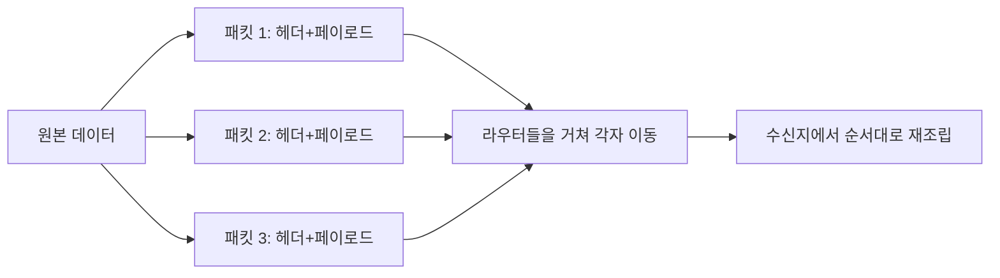
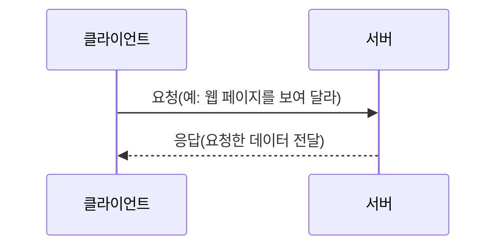

<Callout type="info">
  **이번 문서의 목표:** 패킷이 무엇인지, IP 주소가 어떻게 기기를 구분하는지, 통신망이 규모에 따라 어떻게 나뉘는지를 설명할 수 있게 된다.
</Callout>

## 왜 지금 이 용어부터 정리해야 하는가

본론에서는 IP 네트워크 설계, 라우팅, VLAN(가상 근거리통신망), 무선통신망 같은 실무 지식이 이어서 쏟아집니다. 이 지식들은 전부 세 가지 최소 전제 위에 세워져 있습니다. **데이터가 어떤 형태로 쪼개져 옮겨지는가**(패킷), **그 데이터가 어느 기기로 가야 하는지 어떻게 적히는가**(IP 주소), **그 기기들이 모인 통신망은 규모에 따라 어떻게 구분되는가**(LAN·WAN)입니다. 03편에서 신호·데이터·잡음이라는 통신 전체의 용어 지도를 그렸다면, 이번 편은 그중에서도 **데이터가 여러 기기 사이를 오가는 상황**만 떼어내 지도를 한 겹 더 그리는 작업입니다.

이 편에서는 각 계층의 상세한 동작 방식(OSI 7계층, 라우팅 프로토콜의 종류 등)까지는 다루지 않습니다. 그 내용은 15편(네트워크 설계 기초와 참조모델)부터 19편까지 본론에서 깊게 다룹니다. 지금은 그 본론을 읽을 때 걸리지 않을 최소한의 어휘만 확보합니다.

## 패킷이란 무엇인가

### 왜 필요한가

전화 통화를 생각해 봅시다. 통화가 연결되면 나와 상대방 사이에는 통화가 끝날 때까지 **회선 하나가 통째로 예약**됩니다. 중간에 아무도 말을 하지 않고 침묵이 흘러도 그 회선은 다른 사람이 쓸 수 없습니다. 이런 연결 방식을 **회선교환**(circuit switching)이라 합니다.

그런데 컴퓨터 사이의 데이터 통신은 사정이 다릅니다. 웹 페이지를 열거나 메시지를 보내는 작업은 짧은 순간 데이터를 왕창 보내고, 그다음에는 한참 쉬는 패턴을 반복합니다. 이런 트래픽(traffic, 통신량)에 회선 전체를 통째로 예약해 두면 대부분의 시간 동안 회선이 놀게 됩니다. 그래서 등장한 방식이 **패킷교환**(packet switching)입니다.

### 쉽게 말하면

> **쉽게 말하면:** 편지 한 통 분량의 큰 문서를 그대로 보내지 않고, 여러 개의 작은 봉투에 나눠 담아 각 봉투마다 받는 사람 주소와 몇 번째 봉투인지를 적어 보내는 방식입니다.

### 정의

**패킷**(packet)은 전송할 데이터를 일정한 크기로 잘라, 그 앞에 **헤더**(header)라는 꼬리표를 붙인 전송 단위입니다. 헤더 안에는 송신지 주소, 수신지 주소, 이 패킷이 전체 데이터 중 몇 번째 조각인지 나타내는 순서 번호 등이 담깁니다. 실제로 전송할 내용물은 **페이로드**(payload)라 부릅니다. 페이로드는 화물칸, 헤더는 화물칸에 붙은 배송 라벨이라고 생각하면 됩니다.

### 작은 예시와 계산

4메가바이트(MB) 크기의 파일을 1킬로바이트(KB) 크기의 패킷으로 잘라 보낸다고 합시다. 1메가바이트는 1024킬로바이트이므로 전체 크기는 다음과 같습니다.

$$
4\text{MB} = 4 \times 1024\text{KB} = 4096\text{KB}
$$

패킷 하나의 크기가 1KB이므로 필요한 패킷의 개수는 다음과 같습니다.

$$
\text{패킷 개수} = \frac{4096\text{KB}}{1\text{KB}} = 4096\text{개}
$$

**해석:** 원래는 하나였던 파일이 4096개의 독립된 조각으로 나뉘어, 각 조각이 서로 다른 경로로 목적지까지 이동할 수도 있습니다. 이렇게 여러 경로를 나눠 쓸 수 있다는 점이 패킷교환이 회선 자원을 효율적으로 쓰는 핵심 이유입니다.

### 회선교환과 패킷교환 비교

| 구분 | 회선교환 | 패킷교환 |
|------|----------|----------|
| 연결 방식 | 통화 시작 시 전용 경로 확보 | 매 패킷마다 경로가 달라질 수 있음 |
| 회선 이용 효율 | 낮음(침묵 구간도 회선 점유) | 높음(쉬는 시간에 다른 트래픽이 회선 사용) |
| 전송 지연 | 일정함(경로가 고정) | 패킷마다 지연이 달라질 수 있음(지연 변이) |
| 대표 사례 | 전통적인 전화망(PSTN) | 인터넷, 데이터 네트워크 전반 |

### 자주 틀리는 점

패킷교환이 무조건 더 좋은 방식이라고 단정하면 안 됩니다. 회선교환은 경로가 고정되어 있어 **지연이 일정**하다는 장점이 있고, 패킷교환은 경로마다 혼잡도가 달라 패킷별로 도착 순서가 뒤바뀌거나 지연 시간이 들쭉날쭉해지는 **지연 변이**(jitter)가 발생할 수 있습니다. 그래서 수신지에서는 헤더의 순서 번호를 보고 원래 순서대로 다시 조립하는 과정이 반드시 필요합니다.

## IP 주소와 클라이언트-서버 구조

### 왜 필요한가

패킷의 헤더 안에는 "이 패킷을 어디로 보내야 하는가"라는 수신지 주소가 반드시 적혀야 합니다. 우편물에 받는 사람의 주소가 없으면 배달이 불가능한 것과 같은 이치입니다. 이 주소 역할을 하는 것이 **IP 주소**(Internet Protocol address, 인터넷 프로토콜 주소)입니다.

### 쉽게 말하면

> **쉽게 말하면:** IP 주소는 인터넷이라는 거대한 우편망 위에서 각 기기에 부여된 우편번호이자 집 주소입니다.

### 정의

가장 널리 쓰이는 **IPv4**(Internet Protocol version 4) 주소는 32비트 길이의 숫자입니다. 사람이 32자리 2진수를 그대로 읽기는 어려우므로, 8비트씩 4묶음(이 묶음을 **옥텟**, octet이라 부릅니다)으로 나누고 각 묶음을 10진수로 바꿔 마침표로 구분해 표기합니다. `192.168.0.1` 같은 표기가 바로 이것입니다.

**작은 예시로 확인해 봅시다.** `192.168.0.1`의 첫 번째 옥텟인 192를 2진수로 바꿔 보겠습니다. 2진수 각 자리는 128, 64, 32, 16, 8, 4, 2, 1의 값을 가집니다.

$$
192 = 128 + 64
$$

128의 자리와 64의 자리에 1을 놓고 나머지 여섯 자리는 0을 놓으면 2진수 `11000000`이 됩니다. 이렇게 옥텟 하나하나를 8자리 2진수로 바꾸면 `192.168.0.1`은 `11000000.10101000.00000000.00000001`이라는 32비트 숫자가 됩니다.

### IP 주소의 클래스

IPv4 주소는 앞쪽 비트의 패턴에 따라 몇 가지 클래스(class, 등급)로 나뉘고, 클래스마다 **네트워크를 식별하는 비트**(network bits)와 **그 네트워크 안의 기기를 식별하는 비트**(host bits)의 개수가 다릅니다.

| 클래스 | 첫 옥텟 범위 | 네트워크 비트 | 호스트 비트 | 주 용도 |
|--------|--------------|---------------|-------------|---------|
| A | 1–126 | 8 | 24 | 아주 큰 규모의 네트워크 |
| B | 128–191 | 16 | 16 | 중간 규모의 네트워크 |
| C | 192–223 | 24 | 8 | 작은 규모의 네트워크(가정·소규모 사무실) |
| D | 224–239 | 사용하지 않음 | 사용하지 않음 | 멀티캐스트(하나가 여러 곳에 동시 전송) 전용 |
| E | 240–255 | 사용하지 않음 | 사용하지 않음 | 실험·연구용으로 예약 |

### 계산 — 클래스 C에서 연결 가능한 기기 수

클래스 C는 호스트 비트가 8개입니다. 8비트로 표현할 수 있는 경우의 수는 다음과 같습니다.

$$
2^{8} = 256
$$

이 256가지 조합 중에서 **호스트 비트가 모두 0인 값**은 그 네트워크 자체를 가리키는 네트워크 주소로 예약되고, **호스트 비트가 모두 1인 값**은 그 네트워크 안의 모든 기기에게 동시에 보내는 브로드캐스트(broadcast, 전체 방송) 주소로 예약됩니다. 실제로 개별 기기에 나눠 줄 수 있는 주소는 이 둘을 뺀 값입니다.

$$
256 - 2 = 254\text{개}
$$

- $2^{8}$: 호스트 비트 8개로 만들 수 있는 전체 조합 수
- $-2$: 네트워크 주소 1개와 브로드캐스트 주소 1개를 제외하는 부분

**해석:** 클래스 C 네트워크 하나에는 최대 254대의 기기를 연결할 수 있습니다. 가정용 공유기가 기본으로 만드는 네트워크 대역이 대체로 클래스 C 크기인 이유가 여기 있습니다. 더 세밀하게 네트워크를 쪼개거나 합치는 서브네팅(subnetting) 계산은 본론 16편(인터넷 주소체계와 프로토콜 실무)에서 자세히 다룹니다.

### 클라이언트-서버 구조

IP 주소로 기기를 특정할 수 있게 되면, 그 기기들 사이에서 **누가 요청하고 누가 응답하는가**라는 역할 구분이 생깁니다. **클라이언트**(client)는 서비스를 요청하는 쪽, **서버**(server)는 그 요청을 받아 처리하고 결과를 돌려주는 쪽입니다. 웹 브라우저로 어떤 사이트에 접속하면, 내 컴퓨터가 클라이언트가 되어 "이 페이지를 보여 달라"고 요청하고, 그 사이트를 운영하는 컴퓨터가 서버가 되어 페이지 데이터를 응답으로 돌려줍니다.

한 기기 안에는 여러 프로그램이 동시에 통신할 수 있으므로, IP 주소만으로는 "그 기기의 어떤 프로그램인가"까지는 구분하지 못합니다. 이때 함께 쓰이는 것이 **포트**(port) 번호입니다. IP 주소가 아파트 동·호수라면, 포트 번호는 그 집 안에서 우편물을 받는 사람 개개인이라고 생각하면 됩니다. 포트를 사용하는 전달계층 프로토콜(TCP·UDP)의 세부 동작은 16편에서 다룹니다.

### 자주 틀리는 점

클래스 A·B·C의 순서를 "네트워크 비트가 늘어나는 순서"로 헷갈리는 경우가 많습니다. **클래스 A는 네트워크 비트가 가장 적고 호스트 비트가 가장 많아 하나의 네트워크에 아주 많은 기기를 담을 수 있습니다.** 반대로 클래스 C는 네트워크 비트가 많아 네트워크 자체는 잘게 쪼갤 수 있지만, 각 네트워크에 담을 수 있는 기기 수는 적습니다. "A는 큰 그릇 몇 개, C는 작은 그릇 여러 개"로 기억하면 헷갈리지 않습니다.

## LAN과 WAN 구분

### 왜 필요한가

기기 몇 대가 모인 네트워크와, 전국 혹은 전 세계에 걸친 네트워크는 설계 방식이나 쓰이는 장비가 전혀 다릅니다. 이 규모 차이를 부르는 이름을 먼저 알아야 이후 본론에서 "이 기술은 어느 규모의 네트워크에 쓰이는가"라는 설명을 바로 이해할 수 있습니다.

### 쉽게 말하면

> **쉽게 말하면:** LAN은 한 건물이나 한 사무실 안의 통신망, WAN은 도시와 도시, 나라와 나라를 잇는 통신망입니다.

### 정의와 비교

**근거리통신망**(LAN, Local Area Network)은 사무실 하나, 건물 하나, 캠퍼스 하나처럼 비교적 좁은 지역 안의 기기들을 연결한 통신망입니다. 회사나 개인이 직접 소유하고 관리하는 경우가 많습니다.

**광역통신망**(WAN, Wide Area Network)은 도시와 도시, 국가와 국가처럼 넓은 지역에 흩어진 여러 LAN을 서로 연결한 통신망입니다. 통신사업자의 회선을 빌려 쓰는 경우가 대부분입니다. **인터넷**은 전 세계의 수많은 WAN과 LAN이 서로 연결되어 만들어진, 가장 거대한 네트워크의 집합체라고 이해하면 됩니다.

두 용어 사이에는 **도시통신망**(MAN, Metropolitan Area Network)이라는 중간 규모의 개념도 있습니다. MAN은 하나의 도시 정도 범위를 다루는 통신망으로, LAN보다는 넓고 WAN보다는 좁습니다.

| 구분 | LAN | MAN | WAN |
|------|-----|-----|-----|
| 범위 | 건물·사무실 하나 | 도시 하나 | 국가·대륙 |
| 소유·관리 | 대개 자체 소유 | 통신사업자 또는 지자체 | 대개 통신사업자 회선 임대 |
| 전송 속도 경향 | 상대적으로 빠름 | 중간 | LAN보다 느린 경우가 많음(거리가 멀어 신호 감쇠·지연 증가) |
| 대표 예시 | 사무실 내부 이더넷망 | 도시 단위 초고속 백본망 | 인터넷, 전국 통신사 회선망 |

### 자주 틀리는 점

MAN을 LAN의 일종으로 착각하는 경우가 흔합니다. MAN은 이름 그대로 "도시"(metropolitan) 단위이므로 LAN보다는 훨씬 넓은 범위이며, 오히려 WAN에 더 가까운 성격을 가진 별도의 분류입니다. 또한 "인터넷은 WAN이다"라는 문장도 정확히는 "인터넷은 전 세계의 WAN들이 모여 이룬 네트워크"라고 이해하는 편이 맞습니다.

## 핵심 정리

- **패킷**은 데이터를 잘라 헤더(주소·순서 정보)와 페이로드(실제 내용)로 구성한 전송 단위이며, 회선을 예약하는 회선교환과 달리 회선을 여러 통신이 나눠 쓰는 패킷교환 방식에서 사용된다.
- **IPv4 주소**는 32비트를 8비트씩 4개 옥텟으로 나눠 점으로 구분한 10진수로 표기하며, 클래스 A·B·C는 네트워크 비트와 호스트 비트의 배분이 다르다.
- 클래스 C의 사용 가능 호스트 수는 $2^{8}-2=254$개이며, 뺀 2는 네트워크 주소와 브로드캐스트 주소다.
- **클라이언트-서버 구조**에서 클라이언트는 요청하는 쪽, 서버는 응답하는 쪽이며, 한 기기 안 여러 프로그램은 포트 번호로 구분한다.
- **LAN**은 좁은 지역, **WAN**은 넓은 지역의 통신망이며, 그 사이에 도시 단위의 **MAN**이 있다.

## 마무리 복습

<Quiz
  questionNumber={1}
  question="회선교환과 패킷교환에 대한 설명으로 가장 적절한 것은?"
  options={['회선교환은 통신 내내 전용 경로를 점유해 회선 이용 효율이 낮다', '패킷교환은 통화가 끝날 때까지 하나의 고정된 경로만 사용한다', '회선교환은 인터넷 데이터 통신에서 가장 널리 쓰이는 방식이다', '패킷교환은 지연이 항상 일정하게 유지된다']}
  correctAnswer={1}
  explanation="회선교환은 통신이 지속되는 동안 회선을 통째로 예약하므로 침묵 구간에도 회선이 다른 통신에 쓰이지 못해 이용 효율이 낮다. 패킷교환은 패킷마다 경로가 달라질 수 있고 그만큼 지연도 달라질 수 있다."
  optionExplanations={['정확한 설명이다. 전용 경로 점유가 회선교환의 특징이자 한계다.', '경로가 고정되는 것은 패킷교환이 아니라 회선교환의 특징이다.', '인터넷 데이터 통신은 패킷교환을 기본으로 한다.', '패킷교환은 경로 혼잡에 따라 지연이 들쭉날쭉해질 수 있다.']}
/>

<Quiz
  questionNumber={2}
  question="패킷의 헤더에 담기는 정보로 가장 거리가 먼 것은?"
  options={['송신지 주소', '수신지 주소', '전체 데이터 중 몇 번째 조각인지 나타내는 순서 번호', '실제로 전달할 내용물 그 자체']}
  correctAnswer={4}
  explanation="실제 전달할 내용물은 페이로드에 담기며, 헤더에는 송신지·수신지 주소와 순서 번호 같은 배송 정보가 담긴다."
  optionExplanations={['헤더에 담기는 대표적인 정보다.', '헤더에 담기는 대표적인 정보다.', '재조립을 위해 헤더에 반드시 필요한 정보다.', '내용물 자체는 페이로드의 역할이지 헤더의 역할이 아니다.']}
/>

<Quiz
  questionNumber={3}
  question="IPv4 주소 192.168.0.1에서 첫 번째 옥텟 192를 2진수로 바르게 변환한 것은?"
  options={['10101000', '11000000', '11100000', '10000001']}
  correctAnswer={2}
  explanation="192는 128과 64의 합이므로 128자리와 64자리에 1을 놓고 나머지 여섯 자리는 0을 놓으면 11000000이 된다."
  optionExplanations={['이 값은 168을 변환한 결과다.', '128+64=192이므로 정확한 변환이다.', '이 값은 128+64+32=224에 해당한다.', '이 값은 128+1=129에 해당한다.']}
/>

<Quiz
  questionNumber={4}
  question="클래스 C 네트워크 하나에서 실제로 기기에 할당할 수 있는 최대 호스트 수는?"
  options={['256개', '255개', '254개', '128개']}
  correctAnswer={3}
  explanation="호스트 비트가 8개이므로 전체 조합은 2의 8제곱인 256가지이며, 이 중 네트워크 주소 1개와 브로드캐스트 주소 1개를 제외한 254개가 실제로 기기에 할당 가능한 주소다."
  optionExplanations={['네트워크 주소와 브로드캐스트 주소를 제외하지 않은 값이다.', '하나만 제외하고 계산한 값으로, 둘 다 빼야 한다.', '256에서 예약된 두 주소를 뺀 정확한 값이다.', '호스트 비트 개수를 절반으로 잘못 계산한 값이다.']}
/>

<Quiz
  questionNumber={5}
  question="클라이언트-서버 구조에 대한 설명으로 옳은 것은?"
  options={['서버가 서비스를 요청하고 클라이언트가 응답한다', '한 기기 안 여러 프로그램을 구분할 때 포트 번호를 함께 사용한다', 'IP 주소만 있으면 같은 기기 안의 어떤 프로그램인지까지 항상 구분된다', '클라이언트와 서버는 반드시 서로 다른 물리적 위치에 있어야 한다']}
  correctAnswer={2}
  explanation="IP 주소는 기기까지만 식별하므로, 한 기기 안의 여러 프로그램을 구분하려면 포트 번호가 함께 필요하다."
  optionExplanations={['요청하는 쪽은 클라이언트, 응답하는 쪽은 서버로 역할이 반대다.', '포트 번호가 프로그램 단위 구분을 담당하므로 정확한 설명이다.', 'IP 주소만으로는 프로그램 단위까지 구분할 수 없다.', '물리적 위치와 클라이언트·서버 구분은 무관하다.']}
/>

<Quiz
  questionNumber={6}
  question="LAN, MAN, WAN의 범위 구분으로 가장 적절한 것은?"
  options={['LAN이 WAN보다 넓은 범위를 다룬다', 'MAN은 LAN의 하위 개념으로 LAN보다 좁은 범위다', 'WAN은 국가·대륙 단위의 넓은 범위를, LAN은 건물·사무실 단위의 좁은 범위를 다룬다', '인터넷은 하나의 단일 LAN으로 분류된다']}
  correctAnswer={3}
  explanation="LAN은 건물이나 사무실처럼 좁은 지역, WAN은 국가나 대륙처럼 넓은 지역을 다루며, MAN은 그 사이인 도시 단위의 범위를 다룬다."
  optionExplanations={['범위 크기가 반대로 서술되었다.', 'MAN은 LAN보다 넓은 도시 단위 범위이므로 하위 개념이 아니다.', '각 통신망의 범위를 정확히 서술했다.', '인터넷은 전 세계의 여러 WAN과 LAN이 모여 이룬 네트워크 집합체다.']}
/>

## 참고 자료

- [한국방송통신전파진흥원(KCA) - 출제기준 자료실](https://www.cq.or.kr/qh_cusgm10_001.do)
- [Q-Net(한국산업인력공단) - 국가자격 종목별 상세정보(정보통신기사)](https://www.q-net.or.kr/crf005.do?id=crf00503&jmCd=1192)
