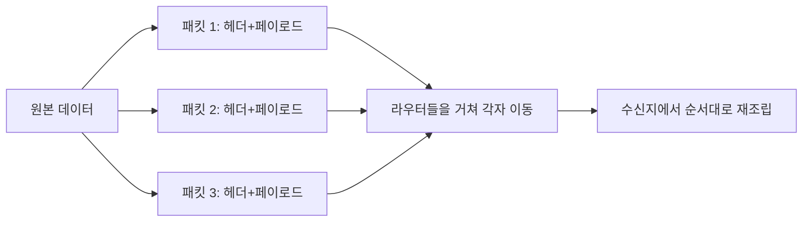
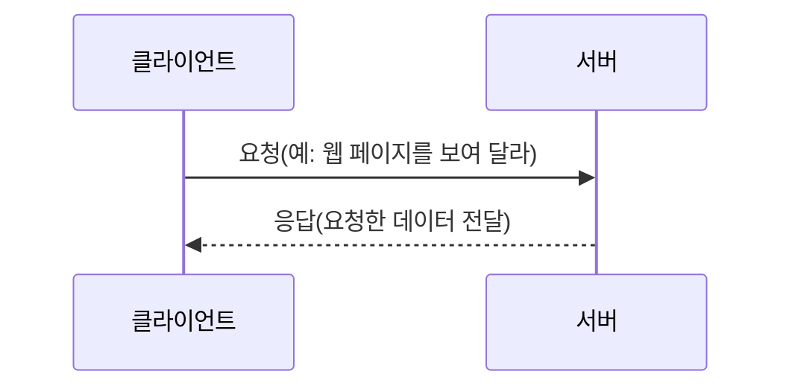

## 왜 지금 이 용어부터 정리해야 하는가

본론에서는 IP 네트워크 설계, 라우팅, VLAN(가상 근거리통신망), 무선통신망 같은 실무 지식이 이어서 쏟아집니다. **데이터가 어떤 형태로 쪼개져 옮겨지는가**(패킷), **그 데이터가 어느 기기로 가야 하는지 어떻게 적히는가**(IP 주소), **그 기기들이 모인 통신망은 규모에 따라 어떻게 구분되는가**(LAN·WAN)입니다.

이 편에서는 각 계층의 상세한 동작 방식(OSI 7계층, 라우팅 프로토콜의 종류 등)까지는 다루지 않습니다. 그 내용은 15편(네트워크 설계 기초와 참조모델)부터 19편까지 본론에서 깊게 다룹니다. 지금은 그 본론을 읽을 때 걸리지 않을 최소한의 어휘만 확보합니다.

## 패킷이란 무엇인가

### 쉽게 말하면

### 정의

**패킷**(packet)은 전송할 데이터를 일정한 크기로 잘라, 그 앞에 **헤더**(header)라는 꼬리표를 붙인 전송 단위입니다. 실제로 전송할 내용물은 **페이로드**(payload)라 부릅니다.

```mermaid
graph LR
  A[원본 데이터] --> B[패킷 1: 헤더+페이로드]
  A --> C[패킷 2: 헤더+페이로드]
  A --> D[패킷 3: 헤더+페이로드]
  B --> E[라우터들을 거쳐 각자 이동]
  C --> E
  D --> E
  E --> F[수신지에서 순서대로 재조립]
```

### 작은 예시와 계산

4메가바이트(MB) 크기의 파일을 1킬로바이트(KB) 크기의 패킷으로 잘라 보낸다고 합시다. 1메가바이트는 1024킬로바이트이므로 전체 크기는 다음과 같습니다.

$$
4\text{MB} = 4 \times 1024\text{KB} = 4096\text{KB}
$$

패킷 하나의 크기가 1KB이므로 필요한 패킷의 개수는 다음과 같습니다.

$$
\text{패킷 개수} = \frac{4096\text{KB}}{1\text{KB}} = 4096\text{개}
$$

**해석:** 원래는 하나였던 파일이 4096개의 독립된 조각으로 나뉘어, 각 조각이 서로 다른 경로로 목적지까지 이동할 수도 있습니다. 이렇게 여러 경로를 나눠 쓸 수 있다는 점이 패킷교환이 회선 자원을 효율적으로 쓰는 핵심 이유입니다.

### 회선교환과 패킷교환 비교

| 구분 | 회선교환 | 패킷교환 |
|------|----------|----------|
| 연결 방식 | 통화 시작 시 전용 경로 확보 | 매 패킷마다 경로가 달라질 수 있음 |
| 회선 이용 효율 | 낮음(침묵 구간도 회선 점유) | 높음(쉬는 시간에 다른 트래픽이 회선 사용) |
| 전송 지연 | 일정함(경로가 고정) | 패킷마다 지연이 달라질 수 있음(지연 변이) |
| 대표 사례 | 전통적인 전화망(PSTN) | 인터넷, 데이터 네트워크 전반 |

### 자주 틀리는 점

패킷교환이 무조건 더 좋은 방식이라고 단정하면 안 됩니다. 회선교환은 경로가 고정되어 있어 **지연이 일정**하다는 장점이 있고, 패킷교환은 경로마다 혼잡도가 달라 패킷별로 도착 순서가 뒤바뀌거나 지연 시간이 들쭉날쭉해지는 **지연 변이**(jitter)가 발생할 수 있습니다.

## IP 주소와 클라이언트-서버 구조

### 쉽게 말하면

### 정의

가장 널리 쓰이는 **IPv4**(Internet Protocol version 4) 주소는 32비트 길이의 숫자입니다. 사람이 32자리 2진수를 그대로 읽기는 어려우므로, 8비트씩 4묶음(이 묶음을 **옥텟**, octet이라 부릅니다)으로 나누고 각 묶음을 10진수로 바꿔 마침표로 구분해 표기합니다.

**작은 예시로 확인해 봅시다.** `192.168.0.1`의 첫 번째 옥텟인 192를 2진수로 바꿔 보겠습니다. 2진수 각 자리는 128, 64, 32, 16, 8, 4, 2, 1의 값을 가집니다.

$$
192 = 128 + 64
$$

128의 자리와 64의 자리에 1을 놓고 나머지 여섯 자리는 0을 놓으면 2진수 `11000000`이 됩니다. 이렇게 옥텟 하나하나를 8자리 2진수로 바꾸면 `192.168.0.1`은 `11000000.10101000.00000000.00000001`이라는 32비트 숫자가 됩니다.

### IP 주소의 클래스

IPv4 주소는 앞쪽 비트의 패턴에 따라 몇 가지 클래스(class, 등급)로 나뉘고, 클래스마다 **네트워크를 식별하는 비트**(network bits)와 **그 네트워크 안의 기기를 식별하는 비트**(host bits)의 개수가 다릅니다.

| 클래스 | 첫 옥텟 범위 | 네트워크 비트 | 호스트 비트 | 주 용도 |
|--------|--------------|---------------|-------------|---------|
| A | 1–126 | 8 | 24 | 아주 큰 규모의 네트워크 |
| B | 128–191 | 16 | 16 | 중간 규모의 네트워크 |
| C | 192–223 | 24 | 8 | 작은 규모의 네트워크(가정·소규모 사무실) |
| D | 224–239 | 사용하지 않음 | 사용하지 않음 | 멀티캐스트(하나가 여러 곳에 동시 전송) 전용 |
| E | 240–255 | 사용하지 않음 | 사용하지 않음 | 실험·연구용으로 예약 |

### 계산 — 클래스 C에서 연결 가능한 기기 수

클래스 C는 호스트 비트가 8개입니다. 8비트로 표현할 수 있는 경우의 수는 다음과 같습니다.

$$
2^{8} = 256
$$

이 256가지 조합 중에서 **호스트 비트가 모두 0인 값**은 그 네트워크 자체를 가리키는 네트워크 주소로 예약되고, **호스트 비트가 모두 1인 값**은 그 네트워크 안의 모든 기기에게 동시에 보내는 브로드캐스트(broadcast, 전체 방송) 주소로 예약됩니다. 실제로 개별 기기에 나눠 줄 수 있는 주소는 이 둘을 뺀 값입니다.

$$
256 - 2 = 254\text{개}
$$

- $2^{8}$: 호스트 비트 8개로 만들 수 있는 전체 조합 수
- $-2$: 네트워크 주소 1개와 브로드캐스트 주소 1개를 제외하는 부분

**해석:** 클래스 C 네트워크 하나에는 최대 254대의 기기를 연결할 수 있습니다. 더 세밀하게 네트워크를 쪼개거나 합치는 서브네팅(subnetting) 계산은 본론 16편(인터넷 주소체계와 프로토콜 실무)에서 자세히 다룹니다.

### 클라이언트-서버 구조

IP 주소로 기기를 특정할 수 있게 되면, 그 기기들 사이에서 **누가 요청하고 누가 응답하는가**라는 역할 구분이 생깁니다. **클라이언트**(client)는 서비스를 요청하는 쪽, **서버**(server)는 그 요청을 받아 처리하고 결과를 돌려주는 쪽입니다.

```mermaid
sequenceDiagram
  participant 클라이언트
  participant 서버
  클라이언트->>서버: 요청(예: 웹 페이지를 보여 달라)
  서버-->>클라이언트: 응답(요청한 데이터 전달)
```

한 기기 안에는 여러 프로그램이 동시에 통신할 수 있으므로, IP 주소만으로는 "그 기기의 어떤 프로그램인가"까지는 구분하지 못합니다. 이때 함께 쓰이는 것이 **포트**(port) 번호입니다.

### 자주 틀리는 점

클래스 A·B·C의 순서를 "네트워크 비트가 늘어나는 순서"로 헷갈리는 경우가 많습니다. **클래스 A는 네트워크 비트가 가장 적고 호스트 비트가 가장 많아 하나의 네트워크에 아주 많은 기기를 담을 수 있습니다.** 반대로 클래스 C는 네트워크 비트가 많아 네트워크 자체는 잘게 쪼갤 수 있지만, 각 네트워크에 담을 수 있는 기기 수는 적습니다.

## LAN과 WAN 구분

### 쉽게 말하면

### 정의와 비교

**근거리통신망**(LAN, Local Area Network)은 사무실 하나, 건물 하나, 캠퍼스 하나처럼 비교적 좁은 지역 안의 기기들을 연결한 통신망입니다. 회사나 개인이 직접 소유하고 관리하는 경우가 많습니다.

**광역통신망**(WAN, Wide Area Network)은 도시와 도시, 국가와 국가처럼 넓은 지역에 흩어진 여러 LAN을 서로 연결한 통신망입니다. **인터넷**은 전 세계의 수많은 WAN과 LAN이 서로 연결되어 만들어진, 가장 거대한 네트워크의 집합체라고 이해하면 됩니다.

두 용어 사이에는 **도시통신망**(MAN, Metropolitan Area Network)이라는 중간 규모의 개념도 있습니다. MAN은 하나의 도시 정도 범위를 다루는 통신망으로, LAN보다는 넓고 WAN보다는 좁습니다.

| 구분 | LAN | MAN | WAN |
|------|-----|-----|-----|
| 범위 | 건물·사무실 하나 | 도시 하나 | 국가·대륙 |
| 소유·관리 | 대개 자체 소유 | 통신사업자 또는 지자체 | 대개 통신사업자 회선 임대 |
| 전송 속도 경향 | 상대적으로 빠름 | 중간 | LAN보다 느린 경우가 많음(거리가 멀어 신호 감쇠·지연 증가) |
| 대표 예시 | 사무실 내부 이더넷망 | 도시 단위 초고속 백본망 | 인터넷, 전국 통신사 회선망 |

### 자주 틀리는 점

MAN을 LAN의 일종으로 착각하는 경우가 흔합니다. MAN은 이름 그대로 "도시"(metropolitan) 단위이므로 LAN보다는 훨씬 넓은 범위이며, 오히려 WAN에 더 가까운 성격을 가진 별도의 분류입니다.

## 핵심 정리

- **패킷**은 데이터를 잘라 헤더(주소·순서 정보)와 페이로드(실제 내용)로 구성한 전송 단위이며, 회선을 예약하는 회선교환과 달리 회선을 여러 통신이 나눠 쓰는 패킷교환 방식에서 사용된다.
- **IPv4 주소**는 32비트를 8비트씩 4개 옥텟으로 나눠 점으로 구분한 10진수로 표기하며, 클래스 A·B·C는 네트워크 비트와 호스트 비트의 배분이 다르다.
- 클래스 C의 사용 가능 호스트 수는 $2^{8}-2=254$개이며, 뺀 2는 네트워크 주소와 브로드캐스트 주소다.
- **클라이언트-서버 구조**에서 클라이언트는 요청하는 쪽, 서버는 응답하는 쪽이며, 한 기기 안 여러 프로그램은 포트 번호로 구분한다.
- **LAN**은 좁은 지역, **WAN**은 넓은 지역의 통신망이며, 그 사이에 도시 단위의 **MAN**이 있다.

## 마무리 복습

<Quiz
  questionNumber={1}
  question={"회선교환과 패킷교환에 대한 설명으로 가장 적절한 것은?"}
  options={["회선교환은 통신 내내 전용 경로를 점유해 회선 이용 효율이 낮다","패킷교환은 통화가 끝날 때까지 하나의 고정된 경로만 사용한다","회선교환은 인터넷 데이터 통신에서 가장 널리 쓰이는 방식이다","패킷교환은 지연이 항상 일정하게 유지된다"]}
  correctAnswer={1}
  explanation={"회선교환은 통신이 지속되는 동안 회선을 통째로 예약하므로 침묵 구간에도 회선이 다른 통신에 쓰이지 못해 이용 효율이 낮다. 패킷교환은 패킷마다 경로가 달라질 수 있고 그만큼 지연도 달라질 수 있다."}
/>

<Quiz
  questionNumber={2}
  question={"패킷의 헤더에 담기는 정보로 가장 거리가 먼 것은?"}
  options={["송신지 주소","수신지 주소","전체 데이터 중 몇 번째 조각인지 나타내는 순서 번호","실제로 전달할 내용물 그 자체"]}
  correctAnswer={4}
  explanation={"실제 전달할 내용물은 페이로드에 담기며, 헤더에는 송신지·수신지 주소와 순서 번호 같은 배송 정보가 담긴다."}
/>

<Quiz
  questionNumber={3}
  question={"IPv4 주소 192.168.0.1에서 첫 번째 옥텟 192를 2진수로 바르게 변환한 것은?"}
  options={["10101000","11000000","11100000","10000001"]}
  correctAnswer={2}
  explanation={"192는 128과 64의 합이므로 128자리와 64자리에 1을 놓고 나머지 여섯 자리는 0을 놓으면 11000000이 된다."}
/>

## 참고 자료

- [한국방송통신전파진흥원(KCA) - 출제기준 자료실](https://www.cq.or.kr/qh_cusgm10_001.do)
- [Q-Net(한국산업인력공단) - 국가자격 종목별 상세정보(정보통신기사)](https://www.q-net.or.kr/crf005.do?id=crf00503&jmCd=1192)
