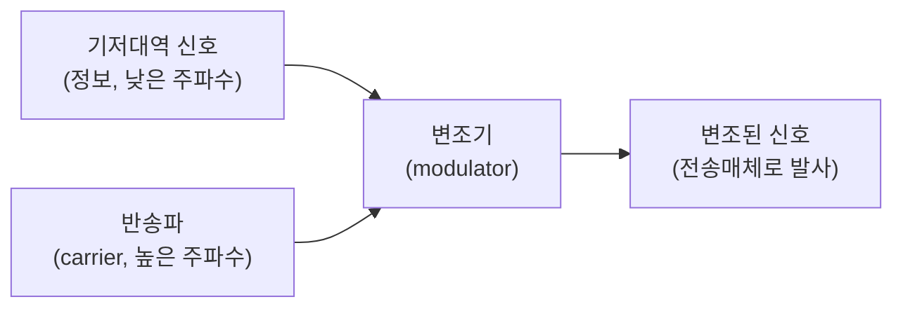

<Callout type="info">
  **이번 문서의 목표:** 이 문서를 다 읽으면 왜 반송파가 필요한지 설명하고, AM·FM의 변조지수와 대역폭을 손으로 계산하며, ASK·FSK·PSK·QAM의 차이와 비트율·심볼율(보율) 계산까지 할 수 있다.
</Callout>

## 왜 변조가 필요한가

06편에서는 아날로그 신호를 표본화·양자화·부호화해 디지털 신호로 바꾸는 원천부호화를 다뤘습니다. 그런데 이렇게 만들어진 디지털 신호(또는 애초의 아날로그 신호)는 낮은 주파수 성분(**기저대역**, baseband)만 가지고 있어, 그 자체로는 먼 거리까지 무선으로 보내기 어렵습니다. 01편에서 배운 $\lambda = c/f$ 관계를 떠올려 보면, 주파수가 낮을수록 파장이 길어지고, 파장이 길어질수록 그 파를 효율적으로 보내는 안테나도 함께 길어져야 합니다. 수백 미터짜리 안테나를 세울 수는 없으므로, 정보를 훨씬 높은 주파수의 신호에 실어 보내야 합니다.

이때 실어 보내는 그릇 역할을 하는 높은 주파수의 신호를 **반송파**(carrier)라 하고, 반송파의 진폭·주파수·위상 중 하나를 원래 정보(변조 신호, message signal)에 맞춰 바꾸는 과정을 **변조**(modulation)라 합니다.

> **쉽게 말하면:** 변조는 낮은 목소리(기저대역 신호)를 멀리까지 보내기 위해 고음의 확성기 소리(반송파)에 실어 보내는 것과 같습니다. 목소리 크기가 커지면 확성기 소리의 진폭이 커지도록(AM), 혹은 목소리 높낮이가 확성기 소리의 음정을 바꾸도록(FM) 반송파의 어떤 특성을 조절하느냐가 변조 방식을 가릅니다.

반송파의 진폭·주파수·위상 중 무엇을 바꾸느냐에 따라 아날로그 변조는 AM·FM·PM 세 가지로, 디지털 변조는 ASK·FSK·PSK·QAM 네 가지로 나뉩니다.

## 1. 아날로그 변조: AM(진폭변조)

### 왜 필요한가

가장 먼저 떠올릴 수 있는 방법은 "정보 신호의 크기에 맞춰 반송파의 세기(진폭)를 키우거나 줄이는" 방식입니다. 이것이 라디오 방송의 AM 대역에도 쓰이는 가장 오래된 변조 방식입니다.

> **쉽게 말하면:** 목소리가 커지면 확성기 소리도 커지고, 목소리가 작아지면 확성기 소리도 작아지도록 반송파의 진폭만 실시간으로 조절하는 방식입니다.

### 정의

**진폭변조**(AM, Amplitude Modulation)는 정보 신호(변조 신호)의 크기에 비례해 반송파의 **진폭**(amplitude, 파형의 최대 높이)을 변화시키는 변조 방식입니다. 변조가 얼마나 깊게 걸렸는지를 나타내는 값이 **변조지수**(modulation index, $m$)입니다.

$$
m = \frac{V_{max} - V_{min}}{V_{max} + V_{min}}
$$

- $m$: 변조지수(변조의 깊이를 나타내는 비율, 단위 없음, 보통 0과 1 사이)
- $V_{max}$: 변조된 파형에서 진폭이 가장 큰 지점(포락선의 최댓값)의 전압
- $V_{min}$: 변조된 파형에서 진폭이 가장 작은 지점(포락선의 최솟값)의 전압

### 변조지수 계산 — 손으로 끝까지

어떤 AM 신호의 포락선(envelope, 파형의 겉모습 곡선)을 오실로스코프로 관측했더니 최댓값이 10V, 최솟값이 2V였습니다.

**1단계 — 값 정리**

$$
V_{max} = 10\ \text{V}, \quad V_{min} = 2\ \text{V}
$$

**2단계 — 변조지수 공식 대입**

$$
m = \frac{10 - 2}{10 + 2} = \frac{8}{12}
$$

**3단계 — 값 계산**

$$
m = 0.667 = 66.7\%
$$

**해석:** 변조지수가 1(100%)에 가까워질수록 반송파의 진폭 변화 폭이 커져 정보를 더 뚜렷하게 실을 수 있습니다. **자주 틀리는 점:** 변조지수가 1을 넘어서는 **과변조**(overmodulation)가 걸리면 포락선의 최솟값이 0보다 작아지는 지점(위상 반전)이 생겨 수신 측에서 신호를 원래 형태로 복원하지 못하고 심하게 일그러뜨립니다. 변조지수는 항상 1 이하로 유지해야 합니다.

### AM 신호의 대역폭

AM 신호는 반송파를 중심으로 정보 신호의 가장 높은 주파수 성분($f_m$)만큼 양옆으로 대칭인 대역을 차지합니다.

$$
BW_{AM} = 2f_m
$$

- $BW_{AM}$: AM 신호가 차지하는 대역폭(단위 Hz)
- $f_m$: 정보 신호(변조 신호)에 포함된 가장 높은 주파수 성분

**계산 예시.** 최대 5kHz까지의 음성 신호로 AM 변조를 했다면 필요한 대역폭은?

$$
BW_{AM} = 2 \times 5\text{kHz} = 10\text{kHz}
$$

**해석:** AM 라디오 방송 채널 하나의 대역폭이 대략 이 정도 범위로 정해지는 이유가 여기 있습니다. 03편에서 익힌 "대역폭 = 가장 높은 주파수 - 가장 낮은 주파수" 계산이, 반송파를 중심으로 양쪽에 정보 신호가 나란히 자리 잡는 AM 신호의 구조에도 그대로 적용됩니다.

## 2. 아날로그 변조: FM(주파수변조)

### 왜 필요한가

AM은 구조가 간단하지만, 전송 도중 섞이는 잡음(noise)이 대부분 진폭을 흔드는 형태로 끼어들기 때문에 AM 신호는 잡음에 취약합니다. 반송파의 **주파수**를 바꾸는 방식을 쓰면, 수신 측에서는 진폭의 흔들림(잡음)은 무시하고 주파수 변화만 읽어내면 되므로 잡음에 훨씬 강해집니다.

> **쉽게 말하면:** 목소리가 커지면 확성기 소리의 음높이(주파수)가 올라가고, 목소리가 작아지면 음높이가 낮아지도록 조절하는 방식입니다.

### 정의

**주파수변조**(FM, Frequency Modulation)는 정보 신호의 크기에 비례해 반송파의 **순간 주파수**를 변화시키는 변조 방식입니다. 반송파 주파수가 원래 값에서 최대로 벗어나는 폭을 **주파수 편이**(frequency deviation, $\Delta f$)라 하고, FM의 변조지수는 이 편이를 정보 신호의 최고 주파수로 나눈 값입니다.

$$
\beta = \frac{\Delta f}{f_m}
$$

- $\beta$: FM 변조지수(베타, 단위 없음)
- $\Delta f$: 주파수 편이(반송파 주파수가 원래 값에서 최대로 벗어나는 폭, 단위 Hz)
- $f_m$: 정보 신호에 포함된 가장 높은 주파수 성분

### FM 대역폭 — 카슨의 법칙

FM은 AM과 달리 반송파 좌우로 무한히 넓은 대역에 이론상 신호 성분이 퍼지지만, 실용적으로는 신호 에너지의 대부분이 담기는 범위를 **카슨의 법칙**(Carson's rule)으로 근사합니다.

$$
BW_{FM} = 2(\Delta f + f_m)
$$

- $BW_{FM}$: FM 신호가 실질적으로 차지하는 대역폭(단위 Hz)
- $\Delta f$: 주파수 편이
- $f_m$: 정보 신호의 최고 주파수

**계산 예시 — 표준 FM 방송.** 국내 FM 라디오 방송은 주파수 편이 $\Delta f = 75\text{kHz}$, 정보 신호(음성·음악)의 최고 주파수 $f_m = 15\text{kHz}$를 기준으로 설계됩니다.

**1단계 — 변조지수 계산**

$$
\beta = \frac{75}{15} = 5
$$

**2단계 — 카슨의 법칙으로 대역폭 계산**

$$
BW_{FM} = 2 \times (75 + 15) = 2 \times 90 = 180\text{kHz}
$$

**해석:** FM 방송 한 채널은 약 180kHz의 대역폭을 차지합니다. 앞서 계산한 AM 채널(10kHz)과 비교하면 훨씬 넓은 대역폭을 쓰는 대신, 잡음에 훨씬 강한 음질을 얻는 **대역폭과 잡음 강도를 맞바꾼** 결과입니다. **자주 틀리는 점:** 변조지수 $\beta$(FM, 편이/주파수의 비율)와 AM의 변조지수 $m$(진폭의 비율)은 이름은 같은 "변조지수"지만 계산식과 단위 성격이 전혀 다릅니다. 둘을 같은 공식으로 계산하는 실수를 하지 않아야 합니다.

## 3. 아날로그 변조: PM(위상변조)

### 정의

**위상변조**(PM, Phase Modulation)는 정보 신호의 크기에 비례해 반송파의 **위상**(01편에서 다룬 $\phi$, 사인파가 기준 시점에서 밀린 정도)을 변화시키는 변조 방식입니다.

> **쉽게 말하면:** 목소리 크기에 맞춰 확성기 소리의 박자를 살짝 당기거나 늦추는 방식입니다.

FM과 PM은 서로 밀접한 관계에 있습니다. 위상을 시간에 대해 변화시키면 그 변화율이 곧 주파수의 변화로 나타나기 때문에, PM 변조기에 정보 신호를 적분한 뒤 넣으면 FM 신호와 같은 결과를 얻을 수 있습니다. 이런 이유로 PM은 흔히 "FM의 사촌"으로 불리며, 실제 회로에서는 PM 변조기를 이용해 FM 신호를 만드는 방식(간접 FM)이 널리 쓰입니다.

### 아날로그 변조 세 방식 비교

| 구분 | AM | FM | PM |
|------|----|----|----|
| 바꾸는 성질 | 진폭 | 주파수 | 위상 |
| 잡음에 대한 강도 | 약함(잡음이 진폭에 그대로 섞임) | 강함(진폭 잡음을 무시하고 주파수만 읽음) | 강함(FM과 유사) |
| 필요한 대역폭 | 상대적으로 좁음($2f_m$) | 상대적으로 넓음(카슨의 법칙) | FM과 비슷한 수준 |
| 회로 복잡도 | 상대적으로 단순 | 상대적으로 복잡 | FM과 유사하거나 다소 단순 |

### 자주 틀리는 점

"FM이 항상 AM보다 좋은 방식이다"라고 단정하면 안 됩니다. FM·PM은 잡음에 강한 대신 훨씬 넓은 대역폭을 요구하므로, 대역폭이 제한적인 환경(예: 좁은 채널 간격이 필요한 통신)에서는 여전히 AM 계열이나 그 개선판(SSB 등)이 쓰입니다. AM·FM·PM 중 무엇이 우월한가가 아니라, **대역폭과 잡음 강도 사이의 절충**이라는 관점으로 접근해야 합니다.

## 4. 디지털 변조: ASK·FSK·PSK·QAM

### 왜 필요한가

지금까지의 AM·FM·PM은 정보 신호 자체가 연속적으로 변하는 아날로그 신호일 때의 변조입니다. 그런데 06편에서 만든 신호는 0과 1로만 이루어진 디지털 신호입니다. 반송파의 성질을 연속적으로 바꾸는 대신, **0과 1이라는 두 상태(또는 여러 상태)에 맞춰 반송파의 특정 값을 스위치처럼 전환**하는 변조가 필요합니다. 이런 방식을 통칭해 **키잉**(keying)이라 부릅니다.

> **쉽게 말하면:** 아날로그 변조가 손잡이를 부드럽게 돌리는 방식이라면, 디지털 변조는 스위치를 켜고 끄듯 정해진 값들 사이를 딱딱 전환하는 방식입니다.

### 네 가지 방식

| 방식 | 정식 명칭 | 바꾸는 반송파 성질 |
|------|-----------|----------------------|
| ASK | 진폭편이변조(Amplitude Shift Keying) | 진폭(예: 1이면 반송파를 켜고, 0이면 끔) |
| FSK | 주파수편이변조(Frequency Shift Keying) | 주파수(예: 1이면 높은 주파수, 0이면 낮은 주파수) |
| PSK | 위상편이변조(Phase Shift Keying) | 위상(예: 1이면 위상 0도, 0이면 위상 180도) |
| QAM | 직교진폭변조(Quadrature Amplitude Modulation) | 진폭과 위상을 동시에(두 축을 함께 사용) |

**ASK의 한계:** ASK는 회로가 가장 단순하지만, 진폭을 기준으로 0과 1을 구분하므로 잡음이 진폭에 섞이면 오판하기 쉬워 잡음에 약합니다.

**FSK의 특징:** 진폭이 아니라 주파수로 구분하므로 ASK보다 잡음에 강하지만, 두 주파수를 오가는 만큼 ASK보다 넓은 대역폭이 필요합니다.

**PSK의 특징:** 위상 차이로 0과 1을 구분합니다. 01편에서 다룬 복소수의 극형식($A\angle\theta$)을 떠올리면, PSK는 반송파를 크기(진폭)는 고정한 채 각도(위상)만 몇 가지 정해진 값 사이에서 전환하는 방식이라고 이해할 수 있습니다.

**QAM의 특징:** 진폭과 위상을 동시에 바꾸므로, 한 번의 신호 전환(심볼)에 더 많은 비트를 실을 수 있습니다. 01편의 복소평면 위에서 각 조합(진폭·위상 쌍)이 하나의 점으로 표시되며, 이렇게 신호점들을 좌표평면에 찍어 놓은 그림을 **성상도**(constellation diagram)라 부릅니다. 신호점의 개수가 많을수록(예: 16-QAM, 64-QAM) 한 번에 더 많은 정보를 보낼 수 있지만, 점들 사이의 간격이 좁아져 잡음에 더 취약해집니다.

### 비트율과 심볼율(보율) — 손으로 끝까지

**왜 필요한가:** 디지털 변조에서는 반송파의 상태 하나(예: 특정 진폭·위상 조합)를 **심볼**(symbol)이라 부르고, 1초에 몇 번 심볼이 바뀌는지를 **심볼율**(symbol rate) 또는 **보율**(baud rate, 단위 baud)이라 합니다. 한 심볼이 몇 개의 상태 중 하나를 표현할 수 있는지에 따라, 심볼 하나에 실리는 비트 수가 달라집니다.

$$
R_b = R_s \times \log_{2}M
$$

- $R_b$: 비트율(bit rate, 초당 전송되는 비트 수, 단위 bps)
- $R_s$: 심볼율(보율, 초당 전송되는 심볼의 개수, 단위 baud)
- $M$: 한 심볼이 표현할 수 있는 서로 다른 상태(신호점)의 개수
- $\log_{2}M$: 상태 하나를 구분하는 데 필요한 비트 수(심볼당 비트 수)

**계산 예시 — 16-QAM.** 성상도에 16개의 서로 다른 신호점을 가진 16-QAM 방식으로, 심볼율이 2400baud인 회선의 비트율을 구해 보겠습니다.

**1단계 — 심볼당 비트 수 계산**

$$
\log_{2}16 = 4
$$

**2단계 — 비트율 공식 대입**

$$
R_b = 2400 \times 4 = 9600\text{bps}
$$

**해석:** 심볼율은 2400baud로 그대로인데, 한 심볼에 4비트(16가지 상태)를 실었기 때문에 실제 전송되는 비트율은 그 4배인 9600bps가 됩니다. **자주 틀리는 점:** 심볼율(baud)과 비트율(bps)을 같은 값으로 혼동하는 경우가 매우 흔합니다. 두 값이 같아지는 경우는 $M=2$(한 심볼이 딱 2가지 상태만 가지는 경우, 예: 2진 ASK·FSK·PSK)일 때뿐이며, QAM처럼 한 심볼에 여러 비트를 싣는 방식에서는 비트율이 심볼율보다 항상 큽니다. 이는 03편에서 짚은 "대역폭은 신호가 차지하는 주파수 폭, 전송속도는 초당 비트 수로 서로 다른 값"이라는 구분과도 이어집니다 — 회선이 감당할 수 있는 대역폭은 대체로 심볼율에 비례하므로, 같은 대역폭에서 $M$을 키워 심볼당 비트 수를 늘리는 것이 QAM 계열이 고속 전송에 쓰이는 이유입니다.

## 핵심 정리

- **변조**는 낮은 주파수의 기저대역 신호를 먼 거리까지 보내기 위해 반송파의 진폭·주파수·위상 중 하나에 정보를 싣는 과정이다.
- **AM**은 변조지수 $m=(V_{max}-V_{min})/(V_{max}+V_{min})$로 깊이를 재며 대역폭은 $2f_m$이다. $m>1$이면 과변조가 걸려 신호가 일그러진다.
- **FM**은 변조지수 $\beta=\Delta f/f_m$을 쓰며, 대역폭은 카슨의 법칙 $BW=2(\Delta f+f_m)$으로 구한다. FM 방송 표준값(75kHz, 15kHz)의 대역폭은 180kHz다.
- **PM**은 위상을 바꾸는 변조로 FM과 적분·미분 관계에 있으며, AM·FM·PM은 잡음 강도와 대역폭을 맞바꾸는 관계다.
- 디지털 변조 **ASK·FSK·PSK·QAM**은 각각 진폭·주파수·위상·진폭과 위상 동시 사용으로 0과 1(또는 여러 상태)을 구분한다.
- 비트율은 $R_b=R_s\times\log_{2}M$이며, 심볼율(baud)과 비트율(bps)은 $M=2$일 때만 같은 값이 되고 QAM처럼 $M$이 커지면 비트율이 심볼율보다 커진다.

## 마무리 복습

<Quiz
  questionNumber={1}
  question="변조가 필요한 이유로 가장 적절한 것은?"
  options={['잡음을 완전히 제거하기 위해서다', '낮은 주파수의 기저대역 신호를 효율적인 안테나 크기로 먼 거리까지 보내기 위해서다', '데이터를 압축해 저장 공간을 줄이기 위해서다', '아날로그 신호를 완전히 없애기 위해서다']}
  correctAnswer={2}
  explanation="주파수가 낮으면 파장이 길어져 필요한 안테나 크기도 커지므로, 정보를 높은 주파수의 반송파에 실어 실용적인 크기의 안테나로 먼 거리까지 보내기 위해 변조가 필요하다."
  optionExplanations={['변조 자체로 잡음을 완전히 제거할 수는 없다.', '반송파를 이용해 효율적으로 전송하기 위한 목적을 정확히 설명했다.', '데이터 압축은 변조가 아니라 부호화·압축 기술의 역할이다.', '변조는 아날로그 신호를 없애는 것이 아니라 실어 보내는 방법이다.']}
/>

<Quiz
  questionNumber={2}
  question="어떤 AM 신호의 포락선 최댓값이 12V, 최솟값이 4V일 때 변조지수는?"
  options={['0.25', '0.33', '0.5', '0.8']}
  correctAnswer={3}
  explanation="변조지수는 (Vmax-Vmin)/(Vmax+Vmin)이므로 (12-4)/(12+4)=8/16=0.5다."
  optionExplanations={['분모나 분자 계산을 잘못했을 때 나오는 값이다.', '계산 과정에서 자릿값을 잘못 적용한 값이다.', '8/16=0.5로 정확히 계산된 값이다.', '뺄셈과 덧셈을 반대로 적용했을 때 나오는 값에 가깝다.']}
/>

<Quiz
  questionNumber={3}
  question="최대 주파수 성분이 4kHz인 음성 신호로 AM 변조를 했을 때 필요한 대역폭은?"
  options={['2kHz', '4kHz', '8kHz', '16kHz']}
  correctAnswer={3}
  explanation="AM 신호의 대역폭은 2fm이므로 2x4kHz=8kHz다."
  optionExplanations={['fm의 절반으로 잘못 계산한 값이다.', 'fm 값 그대로를 대역폭으로 착각한 값이다.', '2x4kHz=8kHz로 정확히 계산된 값이다.', '2배가 아니라 4배로 잘못 계산한 값이다.']}
/>

<Quiz
  questionNumber={4}
  question="주파수 편이 60kHz, 정보 신호 최고 주파수 15kHz인 FM 신호의 카슨의 법칙 대역폭은?"
  options={['75kHz', '120kHz', '150kHz', '30kHz']}
  correctAnswer={3}
  explanation="카슨의 법칙은 BW=2(델타f+fm)이므로 2x(60+15)=2x75=150kHz다."
  optionExplanations={['델타f와 fm을 더하기만 하고 2를 곱하지 않은 값이다.', '델타f만 2배로 계산하고 fm을 더하지 않은 값이다.', '2x(60+15)=150으로 정확히 계산된 값이다.', '델타f와 fm을 더하지 않고 차이만 2배로 계산한 값이다.']}
/>

<Quiz
  questionNumber={5}
  question="AM과 FM을 비교한 설명으로 가장 적절한 것은?"
  options={['AM은 FM보다 항상 더 넓은 대역폭을 필요로 한다', 'FM은 진폭에 실리는 잡음의 영향을 상대적으로 적게 받아 AM보다 잡음에 강하다', 'AM과 FM은 필요한 대역폭이 항상 동일하다', 'FM은 반송파의 진폭을 변화시켜 정보를 전달한다']}
  correctAnswer={2}
  explanation="FM은 주파수 변화로 정보를 전달하므로 진폭에 실리는 잡음을 상대적으로 무시할 수 있어 AM보다 잡음에 강하다."
  optionExplanations={['일반적으로 FM이 AM보다 더 넓은 대역폭을 필요로 한다.', 'FM이 잡음에 강한 이유를 정확히 설명했다.', 'FM은 카슨의 법칙에 따라 AM보다 넓은 대역폭이 필요한 경우가 많다.', '반송파 진폭을 바꾸는 것은 FM이 아니라 AM의 특징이다.']}
/>

<Quiz
  questionNumber={6}
  question="ASK, FSK, PSK가 각각 바꾸는 반송파의 성질을 옳게 나열한 것은?"
  options={['위상, 주파수, 진폭', '진폭, 주파수, 위상', '주파수, 진폭, 위상', '진폭, 위상, 주파수']}
  correctAnswer={2}
  explanation="ASK는 진폭, FSK는 주파수, PSK는 위상을 변화시켜 0과 1을 구분하는 디지털 변조 방식이다."
  optionExplanations={['ASK가 바꾸는 성질이 진폭이 아니라 위상으로 잘못 나열되었다.', 'ASK-진폭, FSK-주파수, PSK-위상 순서가 정확하다.', 'ASK가 바꾸는 성질이 주파수로 잘못 나열되었다.', 'FSK와 PSK가 바꾸는 성질이 서로 바뀌어 나열되었다.']}
/>

<Quiz
  questionNumber={7}
  question="16-QAM 방식으로 심볼율이 3000baud인 회선의 비트율은?"
  options={['3000bps', '6000bps', '9000bps', '12000bps']}
  correctAnswer={4}
  explanation="16-QAM은 log2(16)=4비트를 심볼 하나에 실으므로 비트율은 3000x4=12000bps다."
  optionExplanations={['심볼당 비트 수를 곱하지 않은 값이다.', 'log2(16)을 2로 잘못 계산했을 때 나오는 값이다.', 'log2(16)을 3으로 잘못 계산했을 때 나오는 값이다.', '3000x4=12000으로 정확히 계산된 값이다.']}
/>

<Quiz
  questionNumber={8}
  question="심볼율(baud rate)과 비트율(bit rate)의 관계에 대한 설명으로 옳은 것은?"
  options={['두 값은 변조 방식과 관계없이 항상 같다', '심볼 하나가 2가지 상태만 표현할 때(M=2)는 두 값이 같아진다', '비트율은 항상 심볼율보다 작다', 'QAM처럼 M이 커지면 비트율은 심볼율보다 작아진다']}
  correctAnswer={2}
  explanation="비트율은 심볼율에 log2(M)을 곱한 값이므로, M=2일 때만 log2(2)=1이 되어 두 값이 같아진다."
  optionExplanations={['M이 2보다 큰 경우 두 값은 달라진다.', 'M=2일 때 log2(2)=1이 되어 두 값이 일치한다는 설명이 정확하다.', 'M이 2보다 크면 비트율이 심볼율보다 커진다.', 'M이 커질수록 비트율은 심볼율보다 커진다.']}
/>

## 참고 자료

- [계명대학교 게시판 - 정보통신기사 출제기준(필기·실기) PDF (2026.1.1.~2028.12.31. 적용)](https://cms.kmu.ac.kr/bbs/computer/763/172569/download.do)
- [가천대학교 게시판 - 정보통신기사 출제기준(필기·실기) PDF (2025.1.1.~2025.12.31. 적용, 구버전)](https://www.gachon.ac.kr/bbs/kwcivil/981/118904/download.do)
