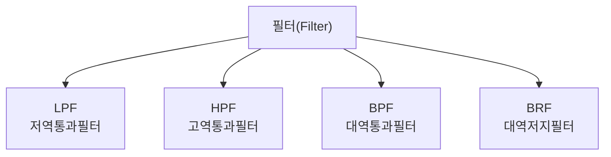

<Callout type="info">
  **이번 문서의 목표:** 이 문서를 다 읽으면 발진회로가 성립하는 조건과 발진 주파수를 계산하고, LPF·BPF·HPF·BRF를 구분하며, 가산기·인코더·디코더·멀티플렉서 같은 조합논리회로와 플립플롭·계수회로 같은 순차논리회로의 동작을 설명할 수 있다.
</Callout>

## 왜 이 세 가지 회로를 함께 보는가

07편에서는 반송파(carrier)에 정보를 싣는 변조 원리를 다뤘습니다. 그런데 그 반송파 자체는 어디서 만들어질까요? 바로 **발진회로**(oscillator)입니다. 또한 변조된 신호에서 원하는 주파수 대역만 골라내거나 불필요한 대역을 제거하려면 **필터**(filter)가 필요합니다. 마지막으로, 통신장비 내부에서 데이터를 처리·교환하는 디지털 회로는 02편에서 익힌 논리게이트를 조합해 만든 **논리회로**(logic circuit)로 구현됩니다. 이 세 가지는 각각 "신호를 만들고", "신호를 걸러내고", "데이터를 처리하는" 통신 회로의 기본 부품입니다.

> **쉽게 말하면:** 발진회로는 반주를 연주하는 악기, 필터는 원하는 음만 골라 듣는 이퀄라이저, 논리회로는 그 소리 신호를 숫자로 계산하는 계산기에 비유할 수 있습니다.

## 1. 발진회로(Oscillator)

### 왜 필요한가

증폭기(amplifier)는 입력 신호가 있어야 그 신호를 키워 출력하는 장치입니다. 그런데 통신 시스템에는 애초에 입력 신호 없이도 스스로 일정한 주파수의 신호를 계속 만들어 내는 회로가 필요합니다. 07편의 반송파, 그리고 뒤에서 배울 각종 클록(clock) 신호가 모두 이렇게 만들어집니다.

> **쉽게 말하면:** 발진회로는 누가 노래를 불러 주지 않아도 스스로 같은 박자를 계속 두드리는 메트로놈입니다.

### 정의와 발진 조건

**발진회로**(oscillator)는 외부 입력 신호 없이 스스로 일정한 주기의 신호를 만들어 내는 회로입니다. 증폭기의 출력 일부를 다시 입력으로 되돌리는 **양성 되먹임**(positive feedback, 정궤환)을 이용해 만듭니다. 이 되먹임이 발진으로 이어지려면 다음의 **바크하우젠 조건**(Barkhausen criterion)을 만족해야 합니다.

$$
|A\beta| = 1, \quad \angle(A\beta) = 0^{\circ}\ (\text{또는}\ 360^{\circ}\text{의 배수})
$$

- $A$: 증폭기의 이득(gain, 신호를 몇 배로 키우는지)
- $\beta$: 되먹임 회로가 출력을 입력으로 되돌리는 비율(궤환율, 베타)
- $|A\beta|$: 한 바퀴(증폭 → 되먹임 → 다시 증폭)를 돌았을 때 신호 크기의 배율. 이 값이 정확히 1이어야 신호가 커지지도 작아지지도 않고 일정하게 유지된다
- $\angle(A\beta)$: 한 바퀴를 돌았을 때 생기는 위상 변화. 이 값이 0도(또는 360도의 배수)여야 되돌아온 신호가 원래 신호와 같은 위상으로 더해져 서로 강화된다

**왜 이 조건이 필요한가:** 일반적인 증폭기에 걸리는 되먹임은 출력을 반대 위상으로 되돌리는 **부성 되먹임**(negative feedback, 부궤환)으로, 이는 신호를 안정시키는 역할만 하고 발진을 일으키지 않습니다. 발진이 일어나려면 반대로 되돌아온 신호가 원래 신호와 **같은 위상**으로 합쳐져 서로를 계속 강화해야 하고, 그 강화되는 배율이 정확히 1로 유지되어야 커지지도 사그라들지도 않는 일정한 진동이 유지됩니다. **자주 틀리는 점:** $|A\beta|>1$이면 신호가 계속 커지다가 결국 회로의 한계로 찌그러지고, $|A\beta|<1$이면 진동이 점점 잦아들어 발진이 멈춥니다. 발진의 핵심은 "무한히 커지는 것"이 아니라 "정확히 1을 유지하는 것"입니다.

### 발진회로의 종류

| 종류 | 주파수를 정하는 소자 | 특징 |
|------|----------------------|------|
| LC 발진기(하틀리·콜피츠 등) | 코일(L)과 콘덴서(C) | 비교적 높은 주파수(무선주파수 대역)에 적합, 회로가 간단 |
| RC 발진기(빈 브리지·위상천이 등) | 저항(R)과 콘덴서(C) | 비교적 낮은 주파수(가청주파수 대역)에 적합 |
| 수정 발진기(crystal oscillator) | 수정(크리스털) 진동자 | 온도·시간에 따른 주파수 변화(안정도)가 매우 우수해 정밀한 기준 신호(클록)에 사용 |

### LC 발진기의 발진 주파수 계산 — 손으로 끝까지

**왜 필요한가:** LC 발진기는 코일과 콘덴서가 에너지를 주고받으며 진동하는 성질을 이용합니다. 이 진동의 주파수는 다음 공식으로 구합니다.

$$
f = \frac{1}{2\pi\sqrt{LC}}
$$

- $f$: 발진 주파수(단위 Hz)
- $L$: 코일의 인덕턴스(inductance, 단위 헨리, H)
- $C$: 콘덴서의 커패시턴스(capacitance, 단위 패럿, F)

**계산 예시.** 인덕턴스 $L=1\text{mH}$, 커패시턴스 $C=1\text{nF}$인 LC 발진회로의 발진 주파수를 구해 보겠습니다.

**1단계 — 단위 정리**

$$
L = 1\text{mH} = 1 \times 10^{-3}\text{H}, \quad C = 1\text{nF} = 1 \times 10^{-9}\text{F}
$$

**2단계 — LC 곱 계산**

$$
LC = (1 \times 10^{-3}) \times (1 \times 10^{-9}) = 1 \times 10^{-12}
$$

**3단계 — 제곱근 계산**

$$
\sqrt{LC} = \sqrt{1 \times 10^{-12}} = 1 \times 10^{-6}
$$

**4단계 — 발진 주파수 계산**

$$
f = \frac{1}{2\pi \times (1 \times 10^{-6})} \approx \frac{1}{6.283 \times 10^{-6}} \approx 159{,}155\text{Hz} \approx 159.2\text{kHz}
$$

**해석:** 인덕턴스나 커패시턴스 값이 작을수록 발진 주파수는 높아집니다($f$가 $\sqrt{LC}$에 반비례하므로). 01편에서 익힌 "분모가 작아지면 전체 값은 커진다"는 반비례 감각이 여기서도 그대로 쓰입니다.

## 2. 필터(Filter): LPF·BPF·HPF·BRF

### 왜 필요한가

발진회로로 반송파를 만들고 변조까지 마쳐도, 실제 전송매체 위에는 원하는 신호 외에 다른 주파수의 잡음이나 다른 채널의 신호가 함께 섞여 있을 수 있습니다. 원하는 주파수 대역만 통과시키고 나머지는 걸러내는 회로가 **필터**입니다.

> **쉽게 말하면:** 필터는 여러 음이 뒤섞인 소리에서 원하는 음역대만 남기고 나머지는 줄여주는 오디오 이퀄라이저와 같습니다.

### 네 가지 필터의 구분

| 필터 | 정식 명칭 | 통과시키는 대역 |
|------|-----------|------------------|
| LPF | 저역통과필터(Low Pass Filter) | 차단주파수보다 낮은 주파수만 통과 |
| HPF | 고역통과필터(High Pass Filter) | 차단주파수보다 높은 주파수만 통과 |
| BPF | 대역통과필터(Band Pass Filter) | 두 차단주파수 사이의 좁은 대역만 통과 |
| BRF | 대역저지필터(Band Reject Filter, 노치 필터) | 특정 좁은 대역만 막고 나머지는 모두 통과 |

**차단주파수**(cutoff frequency, $f_c$)는 필터가 신호를 통과시키는 대역과 막는 대역을 가르는 경계 주파수입니다. 가장 간단한 RC 저역통과필터의 차단주파수는 다음과 같이 구합니다.

$$
f_c = \frac{1}{2\pi RC}
$$

- $f_c$: 차단주파수(단위 Hz)
- $R$: 저항값(단위 옴, $\Omega$)
- $C$: 콘덴서의 커패시턴스(단위 패럿, F)

**계산 예시.** 저항 $R=1\text{k}\Omega$, 콘덴서 $C=1\mu\text{F}$인 RC 저역통과필터의 차단주파수를 구해 보겠습니다.

**1단계 — 단위 정리**

$$
R = 1{,}000\ \Omega, \quad C = 1 \times 10^{-6}\text{F}
$$

**2단계 — RC 곱 계산**

$$
RC = 1{,}000 \times (1 \times 10^{-6}) = 1 \times 10^{-3}
$$

**3단계 — 차단주파수 계산**

$$
f_c = \frac{1}{2\pi \times (1 \times 10^{-3})} \approx \frac{1}{6.283 \times 10^{-3}} \approx 159.2\text{Hz}
$$

**해석:** 이 필터는 약 159.2Hz보다 낮은 주파수 성분은 그대로 통과시키고, 그보다 높은 주파수 성분은 점점 더 크게 약화시킵니다. 06편에서 언급한 "표본화 전에 신호의 최대 주파수를 제한하는 저역통과필터(에일리어싱 방지용)"가 바로 이런 회로입니다.

### 필터의 쓰임새

- **LPF**: 표본화 직전 신호의 최고 주파수를 제한해 에일리어싱을 막는 용도(06편 참고), 변조된 신호에서 반송파 성분을 제거하고 원래 신호만 복원하는 복조 회로에도 사용됩니다.
- **BPF**: 여러 채널이 섞인 대역에서 원하는 채널 하나만 골라내는 튜너(수신기의 채널 선택) 회로에 사용됩니다.
- **BRF(노치 필터)**: 특정 간섭 주파수(예: 상용 전원의 60Hz 험 잡음) 하나만 콕 집어 제거할 때 사용됩니다.

### 자주 틀리는 점

BPF와 BRF를 반대로 기억하는 경우가 많습니다. **BPF는 정해진 좁은 대역만 "통과"시키고 그 밖의 모든 주파수는 막는** 반면, **BRF는 정해진 좁은 대역만 "저지"하고 그 밖의 모든 주파수는 통과시켜** 정확히 반대로 동작합니다. "밴드 안쪽만 살리느냐, 밴드 안쪽만 죽이느냐"로 구분하면 헷갈리지 않습니다.

## 3. 조합논리회로(Combinational Logic Circuit)

### 왜 필요한가

02편에서 익힌 AND·OR·NOT 같은 개별 게이트는 그 자체로는 아주 단순한 연산 하나만 수행합니다. 실제 통신장비(교환기, 라우터 내부 회로 등)는 이 게이트 여러 개를 조합해 덧셈, 신호 선택, 부호 변환 같은 더 복잡한 기능을 수행하는 회로 블록으로 구성됩니다. 이렇게 **현재 입력값에만** 따라 출력이 정해지는(과거의 기억이 필요 없는) 회로를 조합논리회로라 합니다.

> **쉽게 말하면:** 조합논리회로는 지금 넣은 재료만 보고 바로 결과를 내놓는 자판기와 같습니다. 방금 전에 무엇을 넣었는지는 기억하지 않습니다.

### 가산기(Adder)

**반가산기**(half adder)는 두 개의 1비트 입력을 더해 합(Sum)과 자리올림(Carry)을 출력하는 회로입니다.

<table>
<thead><tr><th>A</th><th>B</th><th>Sum(합)</th><th>Carry(자리올림)</th></tr></thead>
<tbody>
<tr><td>0</td><td>0</td><td>0</td><td>0</td></tr>
<tr><td>0</td><td>1</td><td>1</td><td>0</td></tr>
<tr><td>1</td><td>0</td><td>1</td><td>0</td></tr>
<tr><td>1</td><td>1</td><td>0</td><td>1</td></tr>
</tbody>
</table>

이 진리표를 02편의 연산자로 표현하면 `Sum`은 `A XOR B`, `Carry`는 `A AND B`와 정확히 일치합니다. **전가산기**(full adder)는 여기에 아래 자리에서 올라온 자리올림 입력까지 함께 받아 세 개의 1비트를 더할 수 있도록 반가산기를 확장한 회로입니다. 여러 자리의 전가산기를 사슬처럼 연결하면 여러 자리 2진수 덧셈을 수행하는 회로가 만들어집니다.

### 인코더와 디코더

**인코더**(encoder, 부호기)는 여러 개의 입력선 중 하나가 활성화되면 그 위치를 나타내는 더 적은 수의 2진 부호로 압축해 출력하는 회로입니다. **디코더**(decoder, 복호기)는 인코더와 정반대로, 몇 개의 2진 부호 입력을 받아 그에 해당하는 하나의 출력선만 활성화하는 회로입니다.

$$
2^{n} \leftrightarrow n
$$

- $2^{n}$: 인코더의 입력선 개수(또는 디코더의 출력선 개수)
- $n$: 인코더의 출력 부호 비트 수(또는 디코더의 입력 부호 비트 수)

**계산 예시.** 8개의 입력선 중 하나가 눌렸는지를 나타내는 인코더가 필요하다면, 출력 부호는 몇 비트가 필요한가.

$$
8 = 2^{3} \implies n = 3\text{비트}
$$

**해석:** 입력선 8개 중 어느 것이 활성화되었는지는 3비트(000~111)만으로 모두 구분할 수 있습니다. 자릿수(입력 개수)가 두 배로 늘어날 때마다 필요한 부호 비트는 1비트씩만 늘어난다는 점에서, 02편에서 배운 2진수의 효율성이 여기서도 드러납니다.

### 멀티플렉서(MUX)와 디멀티플렉서(DEMUX)

**멀티플렉서**(MUX, Multiplexer)는 여러 입력선 중 **선택선**(select line)이 지정하는 단 하나의 입력만 골라 출력으로 내보내는 회로입니다. **디멀티플렉서**(DEMUX)는 정반대로, 하나의 입력을 선택선이 지정하는 여러 출력선 중 하나로 보내는 회로입니다.

$$
\text{입력 개수} = 2^{n}
$$

- $\text{입력 개수}$: 멀티플렉서가 고를 수 있는 전체 입력선의 개수
- $n$: 선택선의 개수

**계산 예시.** 선택선이 3개인 멀티플렉서는 몇 개의 입력 중 하나를 고를 수 있는가.

$$
2^{3} = 8\text{개}
$$

**해석:** 선택선 3개로 표현할 수 있는 조합이 8가지이므로, 이 멀티플렉서는 8개의 입력 중 하나를 골라 출력할 수 있습니다. 이 멀티플렉서 구조는 11편의 시분할다중화(TDM)에서 여러 회선의 신호를 순서대로 골라 하나의 회선에 실어 보내는 원리와 그대로 이어집니다.

### 자주 틀리는 점

인코더와 디코더의 입출력 방향을 반대로 기억하는 경우가 흔합니다. **인코더는 "여러 개를 압축해 적게"**(많은 입력선 → 적은 출력 비트), **디코더는 "적은 것을 풀어 여러 개로"**(적은 입력 비트 → 많은 출력선) 만든다는 방향으로 구분하면 헷갈리지 않습니다.

## 4. 순차논리회로(Sequential Logic Circuit): 플립플롭·계수회로

### 왜 필요한가

조합논리회로는 현재 입력만으로 출력이 정해져 "기억"이라는 개념이 없습니다. 그런데 실제 통신장비는 이전에 무슨 일이 있었는지(예: 지금까지 몇 비트를 셌는지, 이전 상태가 0이었는지 1이었는지)를 저장해 두어야 하는 경우가 많습니다. 이렇게 **과거의 상태(기억)와 현재 입력을 함께** 반영해 출력을 정하는 회로가 순차논리회로입니다.

> **쉽게 말하면:** 순차논리회로는 지금까지 누른 버튼의 횟수를 기억하고 있다가, 그 기억과 지금 누른 버튼을 함께 고려해 다음 숫자를 보여주는 계수기와 같습니다.

### 플립플롭(Flip-Flop)

**플립플롭**(flip-flop, FF)은 1비트를 저장할 수 있는 가장 기본적인 기억 소자로, 클록(clock) 신호에 맞춰 저장된 값을 갱신합니다.

| 종류 | 특징 |
|------|------|
| SR 플립플롭 | Set(S) 입력으로 1을, Reset(R) 입력으로 0을 저장. S와 R이 동시에 1이 되는 조합은 사용 금지(출력이 정의되지 않음) |
| D 플립플롭 | 입력(D)값을 클록 신호가 들어오는 순간 그대로 저장. 구조가 단순해 가장 널리 쓰임 |
| JK 플립플롭 | SR의 금지 조합 문제를 해결한 방식으로, J와 K가 동시에 1이면 이전 값을 반전(toggle)시킴 |
| T 플립플롭 | 입력이 1일 때마다 이전 값을 반전시키는 방식으로, 계수회로에 주로 사용 |

### 계수회로(Counter)

**왜 필요한가:** 플립플롭 하나는 1비트(0 또는 1)만 기억합니다. 여러 개의 플립플롭을 사슬처럼 연결해 클록 신호가 들어올 때마다 저장된 값을 정해진 규칙(주로 2진수 증가)에 따라 갱신하면, 클록이 들어온 횟수를 세는 회로를 만들 수 있습니다. 이것이 **계수회로**(counter)입니다.

$$
N = 2^{n}
$$

- $N$: 계수회로가 표현할 수 있는 전체 상태(계수할 수 있는 값)의 개수
- $n$: 계수회로를 구성하는 플립플롭의 개수

**계산 예시.** 플립플롭 4개로 만든 2진 계수회로는 0부터 몇까지 셀 수 있는가.

**1단계 — 전체 상태 개수 계산**

$$
N = 2^{4} = 16\text{가지}
$$

**2단계 — 셀 수 있는 범위**

$$
0, 1, 2, \ldots, 15
$$

**해석:** 4비트 계수회로는 0000부터 1111까지, 즉 10진수로 0부터 15까지 총 16가지 값을 표현하며 클록이 들어올 때마다 1씩 증가시켜 셉니다. 16번째 클록이 들어오면 다시 0000으로 돌아가 순환합니다. **자주 틀리는 점:** "플립플롭 $n$개는 $n$까지 셀 수 있다"고 착각하기 쉽지만, 정확히는 $2^{n}$가지 상태(0부터 $2^{n}-1$까지)를 셀 수 있습니다. 02편에서 익힌 $2^{n}$ 계산 감각이 여기서도 그대로 적용됩니다.

### 조합논리회로와 순차논리회로의 구분

| 구분 | 조합논리회로 | 순차논리회로 |
|------|--------------|--------------|
| 출력을 결정하는 요소 | 현재 입력값만 | 현재 입력값 + 이전 상태(기억) |
| 기억 소자(플립플롭) 필요 여부 | 불필요 | 필요 |
| 클록 신호 필요 여부 | 대체로 불필요 | 필요(상태 갱신 시점을 맞추기 위해) |
| 대표 예시 | 가산기, 인코더, 디코더, 멀티플렉서 | 플립플롭, 계수회로, 레지스터 |

### 자주 틀리는 점

가산기나 멀티플렉서 같은 조합논리회로도 통신장비 안에서 "여러 클록에 걸쳐 계속 동작"하는 것처럼 보이기 때문에 순차논리회로로 착각하기 쉽습니다. 구분 기준은 **회로 안에 값을 저장하는 기억 소자(플립플롭)가 있는가**입니다. 기억 소자가 없어 같은 입력에는 언제나 같은 출력이 나오면 조합논리회로, 기억 소자가 있어 같은 입력이라도 이전 상태에 따라 출력이 달라질 수 있으면 순차논리회로입니다.

## 핵심 정리

- **발진회로**는 바크하우젠 조건($|A\beta|=1$, 위상차 0도)을 만족하는 양성 되먹임으로 스스로 신호를 만들며, LC 발진기의 주파수는 $f=1/(2\pi\sqrt{LC})$로 계산한다.
- **필터**는 LPF(저역통과)·HPF(고역통과)·BPF(대역통과)·BRF(대역저지)로 나뉘며, RC 저역통과필터의 차단주파수는 $f_c=1/(2\pi RC)$로 계산한다. BPF와 BRF는 통과·저지 대상이 정반대다.
- **조합논리회로**는 현재 입력만으로 출력이 정해지며, 가산기(반가산기의 Sum=XOR, Carry=AND)·인코더·디코더·멀티플렉서가 대표적이다.
- **순차논리회로**는 플립플롭 같은 기억 소자를 이용해 과거 상태까지 반영하며, 플립플롭 $n$개로 만든 계수회로는 $2^{n}$가지 상태를 셀 수 있다.
- 조합논리회로와 순차논리회로를 가르는 결정적 기준은 회로 안에 기억 소자(플립플롭)가 있는지 여부다.

## 마무리 복습

<Quiz
  questionNumber={1}
  question="발진회로가 성립하기 위한 바크하우젠 조건으로 옳은 것은?"
  options={['|A베타|가 1보다 항상 커야 한다', '|A베타|는 1이고 위상차는 0도(또는 360도의 배수)여야 한다', '되먹임은 반드시 부성 되먹임이어야 한다', '증폭기의 이득은 항상 0이어야 한다']}
  correctAnswer={2}
  explanation="발진이 유지되려면 한 바퀴를 돌았을 때 신호 크기 배율(|A베타|)이 정확히 1이고, 위상차가 0도(또는 360도의 배수)여서 되돌아온 신호가 원래 신호를 강화해야 한다."
  optionExplanations={['1보다 크면 신호가 계속 커지다 찌그러져 일정한 발진을 유지할 수 없다.', '바크하우젠 조건을 정확히 서술했다.', '발진에는 부성이 아니라 양성 되먹임이 필요하다.', '이득이 0이면 신호가 전혀 커지지 않아 발진이 불가능하다.']}
/>

<Quiz
  questionNumber={2}
  question="인덕턴스 4mH, 커패시턴스 1nF인 LC 발진회로에서 LC의 곱(LC)으로 옳은 것은?"
  options={['4x10의-9제곱', '4x10의-10제곱', '4x10의-11제곱', '4x10의-12제곱']}
  correctAnswer={4}
  explanation="L=4x10의-3제곱H, C=1x10의-9제곱F이므로 LC=4x10의-3제곱x1x10의-9제곱=4x10의-12제곱이다."
  optionExplanations={['지수 계산에서 자릿수를 잘못 더한 값이다.', '지수 계산에서 자릿수를 잘못 더한 값이다.', '지수 계산에서 자릿수를 잘못 더한 값이다.', '4x10의-3제곱과 1x10의-9제곱을 곱한 정확한 결과다.']}
/>

<Quiz
  questionNumber={3}
  question="저항 2kOhm, 커패시턴스 1uF인 RC 저역통과필터의 차단주파수에 가장 가까운 값은?"
  options={['약 8Hz', '약 80Hz', '약 800Hz', '약 8000Hz']}
  correctAnswer={2}
  explanation="RC=2000x(1x10의-6제곱)=2x10의-3제곱이고, fc=1/(2 x pi x 2x10의-3제곱)=약79.6Hz로 약80Hz에 가깝다."
  optionExplanations={['자릿수를 한 단계 축소해 계산한 값이다.', '1/(2 x pi x RC) 계산 결과에 가장 가까운 값이다.', '자릿수를 한 단계 확대해 계산한 값이다.', '자릿수를 두 단계 확대해 계산한 값이다.']}
/>

<Quiz
  questionNumber={4}
  question="BPF(대역통과필터)와 BRF(대역저지필터)의 차이를 옳게 설명한 것은?"
  options={['BPF는 특정 대역만 저지하고 BRF는 특정 대역만 통과시킨다', 'BPF는 특정 대역만 통과시키고 BRF는 특정 대역만 저지한다', 'BPF와 BRF는 항상 동일하게 동작한다', 'BPF는 모든 주파수를 저지하는 필터다']}
  correctAnswer={2}
  explanation="BPF는 정해진 좁은 대역만 통과시키고 그 밖은 막으며, BRF는 정해진 좁은 대역만 저지하고 그 밖은 통과시켜 서로 정반대로 동작한다."
  optionExplanations={['BPF와 BRF의 동작이 서로 바뀌어 서술되었다.', 'BPF와 BRF의 차이를 정확히 설명했다.', '두 필터는 통과·저지 대상이 정반대인 서로 다른 필터다.', 'BPF는 특정 대역을 통과시키는 필터이지 모든 주파수를 막는 필터가 아니다.']}
/>

<Quiz
  questionNumber={5}
  question="반가산기(half adder)에서 A=1, B=1일 때 Sum과 Carry의 값을 순서대로 옳게 나열한 것은?"
  options={['0, 0', '0, 1', '1, 0', '1, 1']}
  correctAnswer={2}
  explanation="Sum은 A XOR B이므로 1과 1이 같아 0이 되고, Carry는 A AND B이므로 둘 다 1이라 1이 된다. 따라서 0, 1이 정답이다."
  optionExplanations={['Carry 값이 0으로 잘못 계산되었다.', 'Sum=0, Carry=1로 정확히 계산된 값이다.', 'Sum과 Carry 값이 서로 바뀌었다.', 'Sum 값이 1로 잘못 계산되었다.']}
/>

<Quiz
  questionNumber={6}
  question="인코더(encoder)와 디코더(decoder)의 차이를 옳게 설명한 것은?"
  options={['인코더는 적은 입력을 여러 출력선으로 풀어내고 디코더는 여러 입력을 압축한다', '인코더는 여러 입력선을 적은 수의 부호로 압축하고 디코더는 적은 부호를 여러 출력선으로 풀어낸다', '인코더와 디코더는 완전히 동일한 기능을 한다', '인코더와 디코더 모두 기억 소자가 반드시 필요하다']}
  correctAnswer={2}
  explanation="인코더는 여러 입력선 중 활성화된 하나의 위치를 적은 수의 2진 부호로 압축하고, 디코더는 그 반대로 적은 부호 입력을 받아 해당하는 하나의 출력선을 활성화한다."
  optionExplanations={['인코더와 디코더의 기능이 서로 바뀌어 서술되었다.', '인코더와 디코더의 방향을 정확히 설명했다.', '두 회로는 입출력 방향이 정반대인 서로 다른 회로다.', '인코더와 디코더는 조합논리회로로 별도의 기억 소자가 필요하지 않다.']}
/>

<Quiz
  questionNumber={7}
  question="플립플롭 5개로 만든 2진 계수회로가 표현할 수 있는 전체 상태의 개수는?"
  options={['5개', '10개', '25개', '32개']}
  correctAnswer={4}
  explanation="플립플롭 n개로 만든 계수회로는 2의n제곱가지 상태를 표현하므로 2의5제곱=32개다."
  optionExplanations={['플립플롭 개수를 그대로 답으로 삼은 오류다.', '플립플롭 개수를 2배로 계산한 값이다.', '플립플롭 개수의 제곱으로 잘못 계산한 값이다.', '2의5제곱=32로 정확히 계산된 값이다.']}
/>

<Quiz
  questionNumber={8}
  question="조합논리회로와 순차논리회로를 구분하는 가장 결정적인 기준은?"
  options={['회로에 사용된 게이트의 개수', '회로 안에 값을 저장하는 기억 소자(플립플롭)가 있는지 여부', '회로가 사용하는 전압의 크기', '회로가 통신장비 안에 있는지 여부']}
  correctAnswer={2}
  explanation="조합논리회로는 현재 입력만으로 출력이 정해져 기억 소자가 필요 없고, 순차논리회로는 과거 상태를 저장하는 플립플롭 같은 기억 소자가 반드시 필요하다."
  optionExplanations={['게이트 개수는 구분 기준이 아니라 회로 복잡도의 문제다.', '기억 소자의 유무가 두 회로를 가르는 정확한 기준이다.', '전압 크기는 두 회로를 구분하는 기준이 아니다.', '통신장비 안에 있는지 여부는 논리회로 종류와 무관하다.']}
/>

## 참고 자료

- [계명대학교 게시판 - 정보통신기사 출제기준(필기·실기) PDF (2026.1.1.~2028.12.31. 적용)](https://cms.kmu.ac.kr/bbs/computer/763/172569/download.do)
