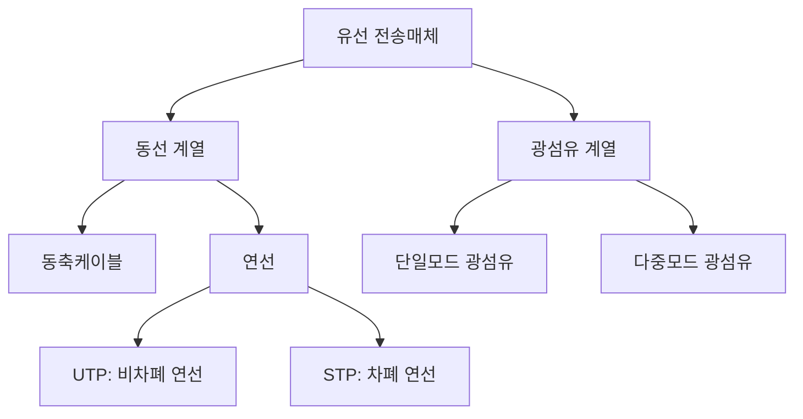

<Callout type="info">
  **이번 문서의 목표:** 통신선로를 저항·인덕턴스·컨덕턴스·커패시턴스로 이루어진 회로로 보고 특성임피던스와 반사계수를 직접 계산하며, 동선·광케이블의 구조적 차이와 전자기파의 반사·회절·굴절 현상을 구분하고, 광케이블 구간의 총손실과 수신 광출력을 손으로 계산할 수 있게 된다.
</Callout>

## 왜 전선을 그냥 전선으로 보면 안 되는가

03편에서 전송매체를 "신호가 지나가는 통로"라고 단순하게 소개했습니다. 그런데 실무와 시험에서는 그 통로를 훨씬 정밀하게 다룹니다. 이유는 간단합니다. **선로가 길어지고 신호 주파수가 높아질수록, 전선은 단순한 도선이 아니라 저항과 인덕턴스와 커패시턴스가 선로 전체에 골고루 퍼져 있는 회로처럼 행동**하기 때문입니다.

일반적인 회로 이론(01편에서 다루지 않은 전기회로 기초)에서는 저항이나 커패시터가 회로도의 한 점에 뭉쳐 있다고 가정합니다. 이것을 **집중정수**(lumped parameter) 모델이라 부릅니다. 그런데 통신선로처럼 길이가 신호의 파장에 비해 무시할 수 없을 만큼 길어지면, 저항·인덕턴스·컨덕턴스·커패시턴스가 선로의 매 지점마다 조금씩 존재한다고 봐야 정확합니다. 이것이 **분포정수**(distributed parameter) 회로입니다.

> **쉽게 말하면:** 짧은 전선은 "그냥 전선"이지만, 긴 통신선로는 "저항과 코일과 축전기가 1미터마다 조금씩 박혀 있는 기다란 회로"입니다.

## 1. 선로전송 이론 — 분포정수와 특성임피던스

### 선로의 네 가지 정수

분포정수 회로에서는 선로 1미터(또는 1킬로미터)당 다음 네 가지 값을 정의합니다.

| 기호 | 이름 | 의미 | 단위 |
|------|------|------|------|
| $R$ | 저항 | 도체 자체의 전기 저항 (직렬 성분) | Ω/m |
| $L$ | 인덕턴스 | 전류가 흐를 때 주변에 생기는 자기장이 저장하는 에너지 (직렬 성분) | H/m |
| $G$ | 컨덕턴스 | 두 도체 사이 절연체를 통해 새는 누설전류 (병렬 성분) | S/m |
| $C$ | 커패시턴스 | 두 도체 사이에 전하가 쌓이는 능력 (병렬 성분) | F/m |

**왜 직렬과 병렬로 나누는가:** 신호는 도체를 따라 앞으로 나아가면서 저항 $R$과 인덕턴스 $L$의 방해를 받고(직렬), 동시에 두 도체 사이의 절연체를 통해 컨덕턴스 $G$와 커패시턴스 $C$로 조금씩 새어 나갑니다(병렬). 이 네 정수가 선로의 모든 전기적 성질을 결정합니다.

### 특성임피던스

**특성임피던스**(characteristic impedance, $Z_0$)는 무한히 긴 선로, 또는 반사가 전혀 없도록 끝을 정확히 맞춘 선로에서 전압과 전류의 비율입니다.

$$
Z_0 = \sqrt{\frac{R + j\omega L}{G + j\omega C}}
$$

- $R, L, G, C$: 위 표의 선로 정수 (단위 길이당 값)
- $\omega$ (오메가): 각주파수, $\omega = 2\pi f$ ($f$는 신호의 주파수)
- $j$: 허수 단위 (교류 회로에서 위상 차이를 표현하는 기호)

**손실이 거의 없는 고주파 선로에서는 근사가 가능합니다.** 통신 케이블처럼 신호 주파수가 충분히 높으면 $\omega L$이 $R$보다, $\omega C$가 $G$보다 훨씬 커집니다. 그러면 $R$과 $G$를 무시할 수 있고 식이 단순해집니다.

$$
Z_0 \approx \sqrt{\frac{L}{C}}
$$

**왜 이 근사가 시험에서 중요한가:** 필기시험의 계산 문제는 대부분 이 무손실선(lossless line) 근사식을 씁니다. $R$과 $G$를 무시해도 되는 이유(고주파에서 $\omega L \gg R$, $\omega C \gg G$)까지 함께 알아 두면 응용 문제에서도 흔들리지 않습니다.

### 손계산 — 특성임피던스 구하기

동축케이블의 단위 길이당 인덕턴스가 $L = 250\ \text{nH/m}$, 단위 길이당 커패시턴스가 $C = 100\ \text{pF/m}$라고 합시다.

**1단계 — 단위를 맞춥니다.**

$$
L = 250 \times 10^{-9}\ \text{H/m}
$$

$$
C = 100 \times 10^{-12}\ \text{F/m}
$$

**2단계 — 비율을 계산합니다.**

$$
\frac{L}{C} = \frac{250 \times 10^{-9}}{100 \times 10^{-12}} = 2500
$$

**3단계 — 제곱근을 취합니다.**

$$
Z_0 = \sqrt{2500} = 50\ \Omega
$$

**해석:** 이 케이블의 특성임피던스는 50Ω입니다. 실제로 통신·RF 장비에서 가장 널리 쓰이는 동축케이블의 표준값이 정확히 이 50Ω이고, 방송용 케이블은 75Ω을 씁니다. 특성임피던스는 케이블의 길이와 무관합니다 — 1미터든 1킬로미터든 단위 길이당 $L$과 $C$의 비율만 같으면 $Z_0$는 동일합니다. 이 점이 자주 틀리는 포인트입니다.

### 반사계수와 정재파비

선로 끝에 연결된 부하(예: 안테나, 수신기)의 임피던스를 $Z_L$이라 합시다. $Z_L$이 선로의 특성임피던스 $Z_0$와 정확히 같으면(**정합**, matching) 신호는 반사 없이 전부 부하로 전달됩니다. 값이 다르면 신호 일부가 되돌아옵니다. 이 되돌아오는 비율이 **반사계수**(reflection coefficient, $\Gamma$, 감마)입니다.

$$
\Gamma = \frac{Z_L - Z_0}{Z_L + Z_0}
$$

- $Z_L$: 부하 임피던스
- $Z_0$: 선로의 특성임피던스
- $\Gamma$: 반사계수 (–1과 1 사이의 값, 부하가 개방이면 1, 단락이면 –1)

반사가 일어나면 선로 위에는 입사파와 반사파가 겹쳐 정재파(standing wave)가 생깁니다. 이 정재파의 최대 전압과 최소 전압의 비를 **정재파비**(VSWR, Voltage Standing Wave Ratio)라 하며, 반사계수의 절댓값으로부터 구합니다.

$$
VSWR = \frac{1 + |\Gamma|}{1 - |\Gamma|}
$$

**손계산.** 특성임피던스 $Z_0 = 50\ \Omega$인 선로에 $Z_L = 75\ \Omega$인 부하를 연결했다고 합시다.

**1단계 — 반사계수**

$$
\Gamma = \frac{75 - 50}{75 + 50} = \frac{25}{125} = 0.2
$$

**2단계 — 정재파비**

$$
VSWR = \frac{1 + 0.2}{1 - 0.2} = \frac{1.2}{0.8} = 1.5
$$

**해석:** 반사계수 0.2는 입사 전압의 20퍼센트가 되돌아온다는 뜻입니다. 정재파비 1.5는 "1(완전 정합)에 가까울수록 좋다"는 기준으로 볼 때 비교적 양호한 수준입니다. VSWR이 1이면 반사가 전혀 없는 완전 정합, 값이 커질수록 반사가 심해 전력 손실과 신호 왜곡이 커집니다.

**자주 틀리는 점:** $Z_L$과 $Z_0$의 순서를 바꿔 계산해도 절댓값은 같지만, 부호는 반대가 됩니다. 개방(open, $Z_L = \infty$)이면 $\Gamma = 1$, 단락(short, $Z_L = 0$)이면 $\Gamma = -1$이라는 극단값을 함께 외워 두면 검산이 쉽습니다.

## 2. 유선 전송매체의 종류

### 동축케이블과 연선

**동축케이블**(coaxial cable)은 중심 도체 하나를 원통형 외부 도체가 감싸고, 그 사이를 절연체로 채운 구조입니다. 외부 도체가 전자기 잡음을 막아 주는 차폐 역할을 하므로 잡음에 강하고 넓은 대역폭을 지원합니다. 케이블TV 인입선이 대표적입니다.

**연선**(twisted pair, 꼬임선)은 두 가닥의 구리선을 서로 꼬아 만듭니다. 꼬는 이유는 명확합니다 — 두 선이 나란히 있으면 외부 잡음이 두 선에 다르게 유도되어 신호를 왜곡시키지만(누화, crosstalk), 꼬아 놓으면 두 선이 거의 같은 잡음을 받아서 수신 쪽에서 그 차이만 빼내는 방식으로 잡음을 상쇄할 수 있습니다.

| 종류 | 구조 | 특징 |
|------|------|------|
| UTP (Unshielded Twisted Pair) | 차폐 없이 단순히 꼬기만 함 | 저렴하고 설치가 쉬움, LAN 배선(Cat.5e·Cat.6 등)의 표준 |
| STP (Shielded Twisted Pair) | 각 페어 또는 전체를 금속박·편조망으로 감쌈 | 외부 전자기 간섭에 강함, 산업 현장·전자파 잡음이 심한 환경에 사용 |

### 광섬유 케이블

**광섬유**(optical fiber)는 빛을 이용해 신호를 보냅니다. 중심의 **코어**(core, 굴절률이 높은 유리)를 굴절률이 더 낮은 **클래딩**(cladding)이 감싸, 빛이 코어와 클래딩의 경계에서 전반사를 반복하며 앞으로 나아가게 만든 구조입니다.

| 종류 | 코어 지름 | 특징 | 주 용도 |
|------|-----------|------|---------|
| 단일모드(SMF, Single-Mode Fiber) | 매우 가늚(약 9마이크로미터) | 빛이 한 경로로만 진행해 신호 퍼짐(모드 분산)이 거의 없음, 장거리·고속에 유리 | 장거리 간선망, 해저케이블 |
| 다중모드(MMF, Multi-Mode Fiber) | 상대적으로 굵음(50–62.5마이크로미터) | 빛이 여러 경로로 진행해 도착 시각이 조금씩 달라지는 모드 분산이 생김, 단일모드보다 저렴 | 구내·근거리 배선 |

**왜 광케이블이 동선보다 유리한가:** 전자기 간섭을 받지 않고(빛이라서 전기 잡음에 무관), 감쇠가 훨씬 작아 장거리 전송에 유리하며, 대역폭이 압도적으로 넓습니다. 단점은 접속·시공이 까다롭고 구부림에 약하다는 점입니다.

## 3. 전자기파의 특성 — 반사·회절·굴절

전파(radio wave)도 빛과 같은 전자기파이므로 매질을 만나면 세 가지 대표적인 현상이 나타납니다.

| 현상 | 정의 | 비유 |
|------|------|------|
| 반사(reflection) | 파가 다른 매질의 경계면에서 튕겨 되돌아오는 현상 | 벽에 부딪혀 튕기는 공 |
| 굴절(refraction) | 파가 다른 매질로 들어가며 속도 차이로 진행 방향이 꺾이는 현상 | 물속의 빨대가 꺾여 보이는 현상 |
| 회절(diffraction) | 파가 장애물의 모서리나 좁은 틈을 만나 그 뒤쪽으로 돌아 들어가는 현상 | 벽 너머 소리가 돌아서 들리는 현상 |

**왜 이 세 현상이 통신에서 중요한가:** 실제 전파 환경에는 건물·산·대기층 같은 장애물이 가득합니다. 송신 안테나가 보이지 않는 곳에서도 신호가 도달하는 이유는 회절과 반사 덕분입니다. 반대로 이 현상들이 여러 경로로 도착한 신호를 서로 간섭시켜 품질을 떨어뜨리기도 합니다(다중경로 페이딩은 11편에서 다룹니다).

### 주파수 스펙트럼과 전파 방식

전파는 주파수 대역에 따라 이름이 다르고, 대기 중에서 퍼지는 방식(전파 방식)도 다릅니다.

| 대역 | 주파수 범위 | 이름 | 대표 전파 방식 |
|------|-------------|------|----------------|
| VLF | 3–30kHz | 초장파 | 지표파(ground wave) — 지표면을 따라 진행 |
| LF | 30–300kHz | 장파 | 지표파 |
| MF | 300kHz–3MHz | 중파 | 지표파, 야간에는 전리층 반사파도 사용(AM 라디오) |
| HF | 3–30MHz | 단파 | 전리층 반사파(sky wave) — 전리층에 반사되어 원거리 도달 |
| VHF | 30–300MHz | 초단파 | 가시선 전파(line of sight) — 직진 |
| UHF | 300MHz–3GHz | 극초단파 | 가시선 전파, 이동통신·와이파이 주 대역 |
| SHF | 3–30GHz | 마이크로파 | 가시선 전파, 위성·중계망 |

- $\text{지표파}$: 지표면과 대기 경계를 따라 휘어져 나가는 전파. 주파수가 낮을수록 감쇠가 적어 멀리 갑니다
- $\text{전리층 반사파}$: 지상 약 60–400킬로미터에 있는 전리층(태양 자외선으로 대기가 이온화된 층)에 부딪혀 반사되어 지구 반대편까지도 도달할 수 있는 전파. 단파 방송이 야간에 더 잘 잡히는 이유입니다
- $\text{가시선 전파}$: 빛처럼 직진하는 전파로, 송신 안테나와 수신 안테나가 서로 보여야(장애물이 없어야) 도달합니다. 주파수가 높을수록 이 성질이 강해집니다

**자주 틀리는 점:** "주파수가 높을수록 멀리 간다"는 서술은 틀렸습니다. 오히려 주파수가 높을수록 직진성이 강해지고 회절이 약해져 장애물에 막히기 쉬우며, 자유공간에서의 감쇠도 커집니다. 저주파일수록 회절이 잘 되어 장애물을 돌아가고 지표를 따라 멀리 퍼집니다.

## 4. 구내·지중·가공 선로시설

케이블을 실제로 설치하는 방식에는 크게 세 가지가 있습니다.

| 시설 방식 | 설명 | 장점 | 단점 |
|-----------|------|------|------|
| 구내(옥내) 배선 | 건물 내부의 배관·트레이를 통한 배선 | 외부 환경(날씨·차량)의 영향이 없음 | 건물 구조 변경 시 재시공 필요 |
| 지중 시설 | 땅을 파서 관로나 맨홀에 케이블을 매설 | 외부 손상(태풍·낙뢰·차량 충돌)에 강하고 도시 미관이 깔끔함 | 공사비가 비싸고 장애 발생 시 보수가 어려움 |
| 가공 시설 | 전신주 등 지지물을 세워 케이블을 공중에 설치 | 공사비가 저렴하고 보수·증설이 쉬움 | 태풍·낙뢰·수목 접촉 등 외부 요인에 취약 |

**선택 기준:** 도심 밀집지역이나 신도시는 미관과 안전을 위해 지중화를 원칙으로 하고, 농어촌이나 임시 구간은 비용 효율이 높은 가공 시설을 쓰는 경우가 많습니다. 이 선택 기준(경제성·안전성·확장성)은 15편의 네트워크 설계 기준과 같은 맥락입니다.

## 5. 광케이블 측정 — 감쇠·접속손실·총손실·광출력

### 감쇠를 dB로 표현하는 이유

01편에서 데시벨(dB)이 두 전력(또는 전압)의 비율을 로그로 표현한 상대적 단위임을 배웠습니다. 선로의 **감쇠**(attenuation)도 "입력 전력 대비 출력 전력이 얼마나 줄었는가"를 나타내므로 dB로 표현합니다.

$$
A_{dB} = 10 \log_{10}\left(\frac{P_{in}}{P_{out}}\right)
$$

- $A_{dB}$: 감쇠량 (단위: dB, 항상 양수로 표현하는 손실량)
- $P_{in}$: 선로에 들어간 전력
- $P_{out}$: 선로를 통과해 나온 전력

**손계산.** 입력 전력이 100mW, 출력 전력이 1mW라면

$$
A_{dB} = 10 \log_{10}\left(\frac{100}{1}\right) = 10 \times \log_{10}100 = 10 \times 2 = 20\ \text{dB}
$$

**해석:** 전력이 100분의 1로 줄었다는 것은 감쇠가 20dB라는 뜻입니다. dB는 로그 단위라서 전력이 10배 줄 때마다 10dB씩 정확히 더해집니다. 이 규칙(10배 = 10dB, 100배 = 20dB, 1000배 = 30dB)을 외워 두면 로그 계산기 없이도 암산이 가능합니다.

### 광케이블 구간의 총손실 계산

실제 광케이블 구간의 **총손실**(total loss)은 세 가지가 더해집니다.

$$
L_{total} = \alpha \times d + n_s \times L_s + n_c \times L_c
$$

- $L_{total}$: 총손실 (dB)
- $\alpha$ (알파): 광섬유 자체의 단위 길이당 감쇠계수 (dB/km)
- $d$: 구간 거리 (km)
- $n_s$: 접속점(splice, 광섬유를 녹여 잇는 지점) 개수
- $L_s$: 접속점 1개당 손실 (dB, 접속손실)
- $n_c$: 커넥터(connector, 장비와 연결하는 착탈식 접속) 개수
- $L_c$: 커넥터 1개당 손실 (dB)

**손계산.** 15킬로미터 구간에 1310nm 파장의 단일모드 광섬유(감쇠계수 0.35dB/km)를 깔고, 중간에 접속점(splice) 3개소(개당 0.1dB), 양 끝에 커넥터 2개(개당 0.5dB)를 연결했다고 합시다.

**1단계 — 광섬유 자체의 감쇠**

$$
\alpha \times d = 0.35 \times 15 = 5.25\ \text{dB}
$$

**2단계 — 접속점 손실 합**

$$
n_s \times L_s = 3 \times 0.1 = 0.3\ \text{dB}
$$

**3단계 — 커넥터 손실 합**

$$
n_c \times L_c = 2 \times 0.5 = 1.0\ \text{dB}
$$

**4단계 — 총손실**

$$
L_{total} = 5.25 + 0.3 + 1.0 = 6.55\ \text{dB}
$$

### 수신 광출력 계산

광출력(optical power)은 절대적인 전력 값을 dBm(1밀리와트를 기준점 0dBm으로 삼는 단위)으로 표현합니다. 송신 광출력에서 총손실을 빼면 수신 광출력을 구할 수 있습니다.

$$
P_{out(dBm)} = P_{in(dBm)} - L_{total}
$$

- $P_{in(dBm)}$: 송신 광출력 (dBm)
- $L_{total}$: 위에서 구한 총손실 (dB)
- $P_{out(dBm)}$: 수신 광출력 (dBm)

**손계산.** 송신 광출력이 0dBm(=1mW)이라면

$$
P_{out(dBm)} = 0 - 6.55 = -6.55\ \text{dBm}
$$

**해석:** 수신단에는 약 –6.55dBm의 빛이 도달합니다. 이 값을 다시 밀리와트로 환산하면 $10^{-6.55/10} \approx 0.221\ \text{mW}$로, 처음 보낸 1밀리와트의 약 22퍼센트만 남은 것입니다. 실제 현장에서는 이렇게 계산한 예상 수신 광출력과, 광파워미터(optical power meter)로 실측한 값을 비교해 구간에 이상(단선·과도한 굽힘·불량 접속)이 없는지 점검합니다.

**자주 틀리는 점:** 총손실을 구할 때 접속점과 커넥터의 개수를 실제 구간 그림과 다르게 세는 실수가 많습니다. 문제에 주어진 구성도(양 끝 커넥터 2개, 중간 접속점은 구간 수에서 1을 뺀 값 등)를 정확히 세는 것이 계산의 절반입니다.

## 핵심 정리

- 통신선로는 $R, L, G, C$가 선로 전체에 분포된 **분포정수 회로**이며, 특성임피던스는 $Z_0 = \sqrt{L/C}$(무손실 근사)로 구하고 **길이와 무관**하다.
- 반사계수 $\Gamma = (Z_L - Z_0)/(Z_L + Z_0)$이며, 정재파비 $VSWR = (1+|\Gamma|)/(1-|\Gamma|)$은 1에 가까울수록 정합이 좋다.
- 동축케이블은 차폐 구조로 잡음에 강하고, 연선은 꼬임으로 누화를 줄이며 UTP·STP로 나뉘고, 광섬유는 단일모드(장거리)와 다중모드(근거리)로 나뉜다.
- 전자기파는 매질 경계에서 **반사·굴절·회절**을 겪으며, 주파수가 낮을수록 회절·지표파 전파에 유리하고 높을수록 가시선 전파의 직진성이 강해진다.
- 선로시설은 구내·지중(안전, 고비용)·가공(저비용, 취약) 세 방식이 있다.
- 감쇠는 $A_{dB} = 10\log_{10}(P_{in}/P_{out})$로 구하며, 광케이블 총손실은 섬유 자체 감쇠와 접속손실·커넥터손실을 모두 더해 계산한다.

## 마무리 복습

<Quiz
  questionNumber={1}
  question="단위 길이당 인덕턴스가 250nH/m, 커패시턴스가 100pF/m인 무손실 전송선의 특성임피던스는?"
  options={['25옴', '50옴', '75옴', '100옴']}
  correctAnswer={2}
  explanation="무손실선 근사식 Z0=제곱근(L/C)에 대입하면 250x10^-9를 100x10^-12로 나눈 값이 2500이고, 그 제곱근이 50옴이다."
  optionExplanations={['비율 계산 과정에서 자릿수를 잘못 옮긴 값이다.', 'L/C=2500의 제곱근을 정확히 구한 값이다.', '실제 계산값보다 큰 값으로 제곱근 계산이 틀렸다.', 'L과 C의 비율을 다시 제곱한 것과 같은 오류다.']}
/>

<Quiz
  questionNumber={2}
  question="특성임피던스가 50옴인 선로에 75옴 부하를 연결했을 때 반사계수와 정재파비로 옳은 것은?"
  options={['반사계수 0.5, 정재파비 3', '반사계수 0.2, 정재파비 1.5', '반사계수 0.2, 정재파비 1.2', '반사계수 1.5, 정재파비 0.2']}
  correctAnswer={2}
  explanation="반사계수는 (75-50)을 (75+50)으로 나눈 0.2이고, 정재파비는 (1+0.2)를 (1-0.2)로 나눈 1.5다."
  optionExplanations={['분자와 분모를 잘못 더하거나 뺀 값이다.', '반사계수 0.2와 정재파비 1.5 모두 계산 순서를 정확히 따른 결과다.', '정재파비 계산에서 분모를 잘못 적용한 값이다.', '반사계수와 정재파비의 값을 서로 뒤바꾼 서술이다.']}
/>

<Quiz
  questionNumber={3}
  question="특성임피던스에 대한 설명으로 가장 적절한 것은?"
  options={['선로의 길이가 길어질수록 특성임피던스도 커진다', '단위 길이당 인덕턴스와 커패시턴스의 비율로 결정되며 길이와 무관하다', '부하 임피던스와 항상 같은 값을 가진다', '직류 신호에서만 정의되는 값이다']}
  correctAnswer={2}
  explanation="무손실선 근사에서 특성임피던스는 L/C의 제곱근으로 결정되는 선로 고유의 값이며 선로 길이가 늘어나도 변하지 않는다."
  optionExplanations={['특성임피던스는 단위 길이당 정수의 비율로 정해지므로 길이와 무관하다.', 'L과 C의 비율로 결정되는 선로 고유값이라는 설명이 정확하다.', '부하 임피던스가 특성임피던스와 다르면 반사가 발생하므로 항상 같지 않다.', '교류 및 고주파 신호를 다루는 전송선로 이론에서 정의되는 값이다.']}
/>

<Quiz
  questionNumber={4}
  question="UTP와 STP 케이블의 차이에 대한 설명으로 가장 적절한 것은?"
  options={['UTP는 광섬유 계열이고 STP는 동선 계열이다', 'STP는 차폐재로 외부 전자기 간섭을 줄이지만 UTP보다 비싸고 시공이 까다롭다', 'UTP는 두 선을 꼬지 않아 누화가 발생하지 않는다', 'STP는 반드시 단일모드 방식으로 신호를 전달한다']}
  correctAnswer={2}
  explanation="STP는 페어 또는 전체를 금속 차폐재로 감싸 전자기 간섭에 강하지만 그만큼 재료비와 시공 난이도가 높아지고, UTP는 차폐 없이 꼬임만으로 누화를 줄이는 저렴한 방식이다."
  optionExplanations={['둘 다 구리선을 꼬아 만드는 동선 계열 매체다.', '차폐 구조로 간섭에 강한 대신 비용과 시공 난이도가 올라간다는 설명이 정확하다.', 'UTP도 꼬임을 통해 누화를 줄이는 방식이며 꼬지 않는 것은 아니다.', '단일모드는 광섬유 용어로 동선 케이블과는 관련이 없다.']}
/>

<Quiz
  questionNumber={5}
  question="전자기파의 반사·굴절·회절에 대한 설명으로 옳지 않은 것은?"
  options={['반사는 파가 매질 경계면에서 튕겨 되돌아오는 현상이다', '굴절은 매질이 달라지며 속도 차이로 진행 방향이 꺾이는 현상이다', '회절은 장애물 뒤쪽으로 파가 돌아 들어가는 현상이다', '주파수가 높을수록 회절이 강해져 장애물을 잘 돌아간다']}
  correctAnswer={4}
  explanation="주파수가 높을수록 파장이 짧아져 직진성이 강해지고 회절은 오히려 약해진다. 회절이 잘 되는 것은 주파수가 낮을 때다."
  optionExplanations={['반사에 대한 정확한 정의다.', '굴절에 대한 정확한 정의다.', '회절에 대한 정확한 정의다.', '주파수가 높을수록 직진성이 강해져 회절이 약해지므로 옳지 않은 설명이다.']}
/>

<Quiz
  questionNumber={6}
  question="HF(단파) 대역의 대표적인 전파 방식으로 가장 적절한 것은?"
  options={['지표파를 이용해 지표면을 따라 전파된다', '전리층에 반사되는 전리층 반사파를 이용해 원거리까지 도달한다', '가시선 전파만 가능해 송수신 안테나가 서로 보여야 한다', '전파되지 않고 유선 매체를 통해서만 전송된다']}
  correctAnswer={2}
  explanation="HF 대역은 전리층에 반사되는 전리층 반사파(sky wave)를 주로 이용해 지구 반대편까지도 도달할 수 있다."
  optionExplanations={['지표파는 주로 LF·MF 대역에서 활용되는 방식이다.', '전리층 반사파로 원거리 통신이 가능하다는 설명이 HF의 특징과 일치한다.', '가시선 전파는 VHF 이상의 높은 주파수 대역에서 두드러지는 방식이다.', 'HF는 대표적인 무선 전파 대역이며 유선 매체와는 무관하다.']}
/>

<Quiz
  questionNumber={7}
  question="입력 전력이 100밀리와트, 출력 전력이 1밀리와트인 구간의 감쇠량은?"
  options={['2dB', '10dB', '20dB', '100dB']}
  correctAnswer={3}
  explanation="감쇠량은 10log10(입력전력/출력전력)이며 100/1=100이므로 10log10(100)=10x2=20dB이다."
  optionExplanations={['로그값 자체를 감쇠량으로 착각한 결과다.', '전력비 10배에 해당하는 감쇠량이며 이 문제의 100배와는 다르다.', '전력비 100배는 로그값 2에 10을 곱한 20dB가 정확하다.', '전력비를 dB 단위로 그대로 옮긴 잘못된 값이다.']}
/>

<Quiz
  questionNumber={8}
  question="15킬로미터 광케이블 구간(감쇠계수 0.35dB/km), 접속점 3개소(개당 0.1dB), 커넥터 2개(개당 0.5dB)의 총손실은?"
  options={['5.25dB', '5.55dB', '6.55dB', '7.25dB']}
  correctAnswer={3}
  explanation="섬유 자체 감쇠 0.35x15=5.25dB, 접속손실 3x0.1=0.3dB, 커넥터손실 2x0.5=1.0dB를 모두 더하면 6.55dB다."
  optionExplanations={['섬유 자체 감쇠만 계산하고 접속손실·커넥터손실을 빠뜨린 값이다.', '커넥터손실을 빠뜨리고 섬유 감쇠와 접속손실만 더한 값이다.', '세 가지 손실을 모두 더한 정확한 총손실이다.', '커넥터 손실을 실제보다 크게 계산한 값이다.']}
/>

## 참고 자료

- [계명대학교 게시판 - 정보통신기사 출제기준(필기·실기) PDF](https://cms.kmu.ac.kr/bbs/computer/763/172569/download.do)
- [한국방송통신전파진흥원(KCA) - 출제기준 자료실](https://www.cq.or.kr/qh_cusgm10_001.do)
