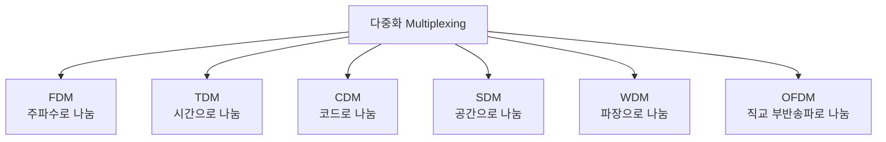

<Callout type="info">
  **이번 문서의 목표:** 다중화와 다중접속의 차이를 구분하고, TDM 프레임의 비트율과 FDM 채널 수를 공식의 중간 단계까지 손으로 계산하며, PDH/SDH 전송프레임의 배수 관계, 대역확산·다중경로·페이딩·MIMO의 개념을 설명할 수 있게 된다.
</Callout>

## 왜 하나의 회선에 여러 신호를 실어야 하는가

09편에서 다룬 동선·광케이블 한 가닥을 새로 깔거나 07편에서 다룬 하나의 주파수 대역을 새로 확보하는 일은 큰 비용이 듭니다. 그런데 실제로는 수백, 수천 명의 통화나 데이터가 동시에 오가야 합니다. 매번 사람 수만큼 회선을 새로 깔 수는 없으니, **하나의 물리적 매체(또는 하나의 주파수 대역)를 여러 신호가 나눠 쓰게 만드는 기술**이 필요합니다. 이것이 이 편의 핵심 주제인 다중화(multiplexing)와 다중접속(multiple access)입니다.

> **쉽게 말하면:** 왕복 1차선 도로(회선 하나)로 수백 대의 차(신호)를 보내야 한다면, 차선을 그리거나(주파수로 나누기), 신호등으로 순서를 정하거나(시간으로 나누기), 각 차에 고유한 암호를 줘서 뒤섞여도 알아볼 수 있게(코드로 나누기) 하는 것과 같습니다.

## 1. 다중화(Multiplexing) — 한 사업자 안에서 신호를 합치는 기술

**다중화**는 통신 사업자나 교환국처럼 **한곳에 모인 여러 신호**를 하나의 전송매체에 실어 보내는 기술입니다. 06편에서 만든 PCM 신호(전화 한 회선당 64kbps)를 떠올려 보면, 실제 국사 간 간선망에는 이런 회선이 수천 개가 지나가야 하므로 다중화가 필수입니다.

### FDM — 주파수분할다중화

**FDM**(Frequency Division Multiplexing, 주파수분할다중화)은 전체 대역폭을 여러 개의 좁은 주파수 대역으로 쪼개, 각 신호를 07편에서 배운 변조 방식으로 서로 다른 반송파 주파수에 실어 보내는 방식입니다. 인접한 대역끼리 서로 침범하지 않도록 각 채널 사이에 비워 두는 완충 주파수 대역을 **보호대역**(guard band)이라 합니다.

### 다중화 채널 수 계산

**손계산.** 전체 사용 가능한 대역폭이 108kHz이고, 신호 하나당 필요한 대역폭이 4kHz, 채널 사이에 보호대역으로 각 4kHz씩 남겨야 한다고 합시다. 이때 몇 개의 채널을 다중화할 수 있는지 구해 봅니다.

**1단계 — 채널 하나가 실제로 차지하는 폭**

채널 신호 대역폭에 보호대역 하나를 더해, 채널 하나가 실질적으로 차지하는 폭을 구합니다.

$$
B_{channel} = 4\text{kHz} + 4\text{kHz} = 8\text{kHz}
$$

**2단계 — 전체 대역폭을 채널당 폭으로 나눔**

$$
N = \frac{B_{total}}{B_{channel}} = \frac{108\text{kHz}}{8\text{kHz}} = 13.5
$$

- $N$: 다중화할 수 있는 채널 수
- $B_{total}$: 전체 사용 가능한 대역폭
- $B_{channel}$: 채널 하나(신호 대역폭+보호대역)가 차지하는 폭

**3단계 — 정수로 정리**

채널은 온전한 개수로만 존재할 수 있으므로 소수점 이하는 버립니다.

$$
N = \lfloor 13.5 \rfloor = 13\text{개}
$$

**해석:** 108kHz 대역에 4kHz 신호와 4kHz 보호대역을 조합하면 최대 13개 채널을 다중화할 수 있습니다. **자주 틀리는 점:** 보호대역을 계산에서 빠뜨리고 단순히 $108 \div 4 = 27$개로 답하는 실수가 매우 흔합니다. 문제에 보호대역이 주어지면 반드시 채널당 실제 점유 폭에 더해서 나눠야 합니다.

### TDM — 시분할다중화와 프레임 비트율 계산

**왜 필요한가:** FDM이 주파수라는 공간을 쪼갠다면, **TDM**(Time Division Multiplexing, 시분할다중화)은 **시간**을 잘게 쪼개 각 채널에 짧은 시간 조각(타임슬롯, time slot)을 순서대로 할당합니다. 여러 채널의 표본을 아주 짧은 시간 동안 번갈아 실어 보내면, 수신 측은 같은 순서로 받은 표본을 다시 원래 채널별로 분류해 복원합니다.

> **쉽게 말하면:** 한 사람씩 순서대로 짧게 통화하고 바로 다음 사람에게 마이크를 넘기는 것을 초당 수천 번 반복하면, 여러 사람이 동시에 통화하는 것처럼 보이는 것과 같습니다.

**손계산 — T1 프레임의 비트율.** 06편에서 배운 PCM 표준(8kHz 표본화, 8비트 양자화)으로 만든 음성 채널 24개를 TDM으로 묶는 대표적인 방식이 북미식 **T1** 프레임입니다.

**1단계 — 표본 24개의 비트 수**

한 프레임에는 24개 채널 각각의 8비트 표본이 순서대로 하나씩 담깁니다.

$$
24\text{채널} \times 8\text{bit} = 192\text{bit}
$$

**2단계 — 프레임 동기용 비트 추가**

24개의 표본을 모아 놓은 것이 어디서 시작하고 끝나는지 수신 측이 구분할 수 있도록, 프레임마다 동기용 비트(framing bit) 1비트를 덧붙입니다.

$$
192\text{bit} + 1\text{bit} = 193\text{bit}
$$

**3단계 — 프레임 반복 속도**

PCM 표준의 표본화 주파수가 8kHz이므로, 24개 채널 모두가 표본 하나씩을 다 채워 넣은 프레임 하나가 초당 8000번 반복됩니다.

$$
f_{frame} = 8000\ \text{프레임/초}
$$

**4단계 — 전체 비트율**

$$
R_b = 193\text{bit} \times 8000\ \text{프레임/초} = 1{,}544{,}000\text{bps}
$$

- $R_b$: TDM 전체 프레임의 비트율
- 193비트: 프레임 하나에 담긴 총 비트 수(음성 채널 24개분 표본 + 동기용 비트 1개)
- 8000: 초당 반복되는 프레임 수(PCM 표본화 주파수와 동일)

**해석:** 계산된 1,544,000bps, 즉 1.544Mbps는 실제로 북미·한국의 디지털 전송 표준 중 하나인 **T1 회선의 표준 속도**와 정확히 일치합니다. 음성 채널 하나가 64kbps(06편)인데, 이 값에 24를 곱하면 1,536,000bps로 T1 속도보다 살짝 작습니다. 그 차이(8,000bps)가 바로 동기용 비트 1개가 초당 8000번 반복되며 만든 오버헤드입니다. **자주 틀리는 점:** 동기용 비트를 빠뜨리고 $64\text{kbps} \times 24 = 1.536\text{Mbps}$까지만 계산하고 멈추는 실수가 흔합니다. 실제 회선 표준 속도를 물으면 동기용 비트까지 포함한 값을 답해야 합니다.

### CDM·SDM·WDM

- **CDM**(Code Division Multiplexing, 코드분할다중화): 신호마다 서로 직교(orthogonal, 수학적으로 겹치지 않는 성질)하는 고유한 코드를 곱해 전송합니다. 여러 신호가 같은 시간, 같은 주파수 대역에 동시에 실려도, 수신 측이 같은 코드를 다시 곱하면 원하는 신호만 골라낼 수 있습니다.
- **SDM**(Space Division Multiplexing, 공간분할다중화): 서로 다른 물리적 공간(별도의 광섬유 코어, 별도의 안테나)을 이용해 신호를 나눕니다. 뒤에서 다룰 MIMO(다중입출력)가 SDM을 무선 환경에서 구현한 대표 사례입니다.
- **WDM**(Wavelength Division Multiplexing, 파장분할다중화): 광섬유 한 가닥 안에서 서로 다른 파장(색)의 빛을 동시에 실어 보내는 방식으로, 사실상 빛의 세계에서 이루어지는 FDM이라 볼 수 있습니다. 파장 간격이 촘촘한 **DWDM**(Dense WDM)과 상대적으로 성긴 **CWDM**(Coarse WDM)으로 나뉘며, 18편의 전송망 기술(SDH·MPLS와 함께 쓰이는 광전송)에서 다시 다룹니다.

### OFDM — 직교주파수분할다중화

**OFDM**(Orthogonal Frequency Division Multiplexing, 직교주파수분할다중화)은 FDM처럼 여러 개의 좁은 주파수(부반송파, subcarrier)로 나누되, 각 부반송파가 서로 **직교**하도록 정밀하게 배치해 전통적인 FDM의 보호대역 없이도 부반송파끼리 겹쳐도 간섭 없이 분리해 낼 수 있게 만든 방식입니다. 좁은 부반송파 하나하나는 느린 속도로 데이터를 나르지만, 이런 부반송파를 수백~수천 개 동시에 사용해 전체적으로는 매우 높은 전송 속도를 냅니다. 이동통신(4G LTE, 5G)과 와이파이(Wi-Fi)의 핵심 전송 기술이 바로 OFDM입니다.

**자주 틀리는 점:** OFDM을 "FDM의 한 종류"라고만 알고 넘어가면 핵심을 놓칩니다. 시험에서 중요한 차이는 **직교성 덕분에 보호대역 없이도 부반송파 간격을 촘촘히 배치해 주파수 효율을 크게 높인다**는 점입니다.

## 2. 다중접속(Multiple Access) — 여러 사용자가 공유 매체에 직접 접속하는 기술

**왜 다중화와 구분하는가:** 다중화가 "교환국 한곳에 모인 신호들을 합치는" 관점이라면, **다중접속**은 이동통신 기지국처럼 **여러 사용자 단말이 하나의 공유된 무선 채널에 각자 직접 접속**하는 상황을 다룹니다. 원리(주파수로 나누기, 시간으로 나누기, 코드로 나누기)는 다중화와 사실상 같지만, "누가 신호를 합치는 주체인가"라는 관점이 다릅니다.

> **쉽게 말하면:** 다중화가 방송국에서 여러 프로그램을 하나의 케이블에 실어 보내는 것이라면, 다중접속은 여러 사람이 각자의 휴대폰으로 같은 기지국에 동시에 접속하는 상황입니다.

| 방식 | 정식 명칭 | 나누는 기준 | 대응하는 다중화 |
|------|-----------|--------------|-----------------|
| FDMA | Frequency Division Multiple Access | 사용자마다 다른 주파수 대역 | FDM |
| TDMA | Time Division Multiple Access | 사용자마다 다른 시간 슬롯 | TDM |
| CDMA | Code Division Multiple Access | 사용자마다 다른 직교 코드 | CDM |
| OFDMA | Orthogonal Frequency Division Multiple Access | OFDM의 부반송파 묶음을 사용자별로 배분 | OFDM |
| SC-FDMA | Single Carrier FDMA | OFDMA와 비슷하나 신호를 보내기 전에 미리 한 번 더 변환을 거쳐 순간 전력 변동을 줄임 | OFDM 계열 |
| NOMA | Non-Orthogonal Multiple Access | 직교성을 포기하는 대신 전력 차이로 여러 사용자 신호를 겹쳐 보내고, 수신 측에서 전력 차를 이용해 분리 | (직교 다중접속이 아닌 새로운 방식) |

**SC-FDMA가 따로 있는 이유:** OFDMA는 여러 부반송파를 동시에 쓰다 보니 순간적으로 신호 전력이 크게 튀는 구간(피크)이 생기기 쉬운데, 이는 배터리로 동작하는 단말기(휴대폰)의 송신 전력 효율을 떨어뜨립니다. SC-FDMA는 이 피크를 줄여 배터리 소모를 아끼도록 설계되어, LTE에서 기지국이 하향(downlink)에는 OFDMA를, 단말이 상향(uplink)에는 SC-FDMA를 쓰는 비대칭 구조를 채택했습니다.

**NOMA가 새로운 이유:** FDMA·TDMA·CDMA·OFDMA는 모두 "겹치지 않게(직교하게) 나눈다"는 공통 원리를 씁니다. 반대로 NOMA는 **일부러 같은 시간·주파수·코드 자원에 여러 사용자의 신호를 전력만 다르게 겹쳐서** 보낸 뒤, 수신 측이 전력 차이를 이용해 신호를 순차적으로 분리해 냅니다(연속 간섭 제거, SIC). 제한된 주파수 자원으로 더 많은 사용자를 동시에 수용할 수 있어 5G 이후 세대의 후보 기술로 연구됩니다.

## 3. PDH/SDH 전송프레임 — 다중화 계위

### PDH — 준동기식 디지털 계위

**PDH**(Plesiochronous Digital Hierarchy, 준동기식 디지털 계위)는 앞서 계산한 T1(1.544Mbps, 24채널) 같은 기본 신호를 여러 개 묶어 점점 더 큰 용량의 신호로 다중화하는 체계입니다. "준동기"(plesiochronous, 그리스어로 "거의 동시")라는 이름은 각 신호를 만드는 장비의 클록이 완전히 하나로 통일되어 있지 않고, 아주 미세한 오차 범위 안에서만 맞춰져 있다는 뜻입니다. 이 체계는 미국·일본 계열(T1 기반)과 유럽 계열(E1 기반, 2.048Mbps·32채널)이 서로 다른 배수 구조를 가집니다.

| 계위 | 유럽계(E 계열) | 북미계(T 계열) |
|------|----------------|-----------------|
| 1차군 | E1 = 2.048Mbps(32채널) | T1 = 1.544Mbps(24채널) |
| 2차군 | E2 = 8.448Mbps(E1 4개 다중화) | T2 = 6.312Mbps(T1 4개 다중화) |
| 3차군 | E3 = 34.368Mbps | T3 = 44.736Mbps |

**자주 틀리는 점:** 상위 계위가 하위 계위의 정확히 4배가 아닌 이유는, 각 회선의 클록이 완전히 똑같지 않은 데서 오는 미세한 시간 차이를 보정하기 위한 여분 비트(justification bit, 정치비트)가 추가로 들어가기 때문입니다. 이 여분 비트 때문에 E2가 E1의 정확히 4배(8.192Mbps)가 아니라 8.448Mbps가 되는 것입니다.

### SDH/SONET — 동기식 디지털 계위

**SDH**(Synchronous Digital Hierarchy, 동기식 디지털 계위, 북미에서는 SONET이라 부름)는 PDH의 "완전히 통일되지 않은 클록" 문제를 해결하기 위해, 전체 네트워크가 하나의 정밀한 기준 클록에 완전히 동기화되도록 설계된 체계입니다. 기본 전송 단위를 **STM-1**(Synchronous Transport Module level 1, 155.52Mbps)이라 하고, 이를 4배씩 묶어 STM-4(622.08Mbps), STM-16(2488.32Mbps)처럼 규칙적인 배수로 확장합니다. 18편의 전송망 기술(SDH/SONET·MPLS·WDM)에서 이 체계가 실제 간선망에 어떻게 쓰이는지 이어서 다룹니다.

## 4. 대역확산 — DS와 FH

**왜 필요한가:** 일반적인 통신은 정보를 담기에 필요한 최소한의 좁은 대역폭만 사용합니다. 그런데 군사·보안 목적이나 잡음·재밍(jamming, 의도적 방해전파)이 심한 환경에서는, 오히려 필요한 대역보다 **훨씬 넓은 대역에 신호 에너지를 얇게 퍼뜨려** 특정 좁은 대역을 방해받아도 전체 정보에는 큰 영향이 없도록 만드는 기법을 씁니다. 이를 **대역확산**(spread spectrum)이라 합니다.

- **DS**(Direct Sequence, 직접시퀀스): 원래 신호에 아주 빠른 속도로 변하는 코드(칩 시퀀스, chip sequence)를 곱해 신호를 넓은 대역에 퍼뜨립니다. CDMA 이동통신의 기본 원리이기도 합니다.
- **FH**(Frequency Hopping, 주파수도약): 반송파 주파수 자체를 미리 정해진 규칙에 따라 아주 짧은 시간 간격으로 계속 바꿔가며 전송합니다. 특정 주파수에 방해전파가 있어도 다음 순간에는 다른 주파수로 옮겨가 있어 피해가 제한적입니다.

**처리이득(processing gain) 계산.** 대역확산의 효과는 원래 신호 대역폭 대비 확산된 대역폭의 비율로 나타냅니다.

$$
PG_{dB} = 10\log_{10}\left(\frac{B_{ss}}{B_{info}}\right)
$$

- $PG_{dB}$: 처리이득(데시벨)
- $B_{ss}$: 대역확산 후 실제로 퍼진 대역폭
- $B_{info}$: 원래 정보 신호가 필요로 하는 대역폭

**손계산.** 원래 정보 신호의 대역폭이 10kHz인데, 대역확산으로 1MHz(1,000kHz)까지 퍼뜨렸다고 합시다.

**1단계 — 배수 계산**

$$
\frac{B_{ss}}{B_{info}} = \frac{1000\text{kHz}}{10\text{kHz}} = 100
$$

**2단계 — dB 환산**

$$
PG_{dB} = 10\log_{10}(100) = 10 \times 2 = 20\text{dB}
$$

**해석:** 처리이득 20dB는 대역확산 덕분에 잡음·재밍 대비 신호를 20dB만큼 더 잘 구분해 낼 수 있다는 뜻으로, 10편에서 배운 SNR을 실질적으로 20dB만큼 개선한 것과 같은 효과를 냅니다.

## 5. 다중경로채널과 페이딩

**다중경로**(multipath)는 송신된 전파가 09편에서 다룬 반사·굴절·회절을 거치며 건물·지형에 부딪혀 여러 개의 서로 다른 경로로 갈라진 뒤, 각기 다른 시간에 수신 안테나에 도착하는 현상입니다. 이렇게 도착한 여러 경로의 신호가 서로 보강·상쇄 간섭을 일으키며 수신 신호의 세기가 시간에 따라 요동치는 현상을 **페이딩**(fading)이라 합니다.

| 구분 기준 | 종류 | 특징 |
|-----------|------|------|
| 변동 속도 | 빠른 페이딩(fast fading) | 단말의 이동이나 주변 반사체 변화로 신호 세기가 짧은 시간 안에 크게 변동 |
| 변동 속도 | 느린 페이딩(slow fading) | 거리에 따른 평균적인 전력 감소처럼 비교적 천천히 변동(그림자 효과, shadowing 포함) |
| 주파수 영향 범위 | 평탄 페이딩(flat fading) | 신호 대역 전체가 거의 동일하게 영향을 받음 |
| 주파수 영향 범위 | 주파수 선택적 페이딩(frequency-selective fading) | 대역 안에서 주파수별로 영향의 정도가 달라, 결과적으로 09편의 지연왜곡·10편의 ISI를 악화시킴 |

**자주 틀리는 점:** 페이딩은 잡음(noise)이 아니라, 여러 경로로 온 같은 신호끼리 만드는 **간섭 현상**입니다. 잡음은 외부에서 섞여 드는 무작위 신호지만, 페이딩은 송신된 신호 자기 자신의 복사본들이 서로 겹치며 만드는 현상이라는 점이 다릅니다.

## 6. 다중입출력(MIMO)

**MIMO**(Multiple-Input Multiple-Output, 다중입출력)는 송신 측과 수신 측 모두 안테나를 여러 개 사용해, SDM(공간분할다중화)을 무선 채널에 구현한 기술입니다. 안테나를 여러 개 쓰면 크게 두 가지 이득을 얻을 수 있습니다.

- **다이버시티 이득**(diversity gain): 같은 정보를 여러 안테나 경로로 중복해서 보내, 한 경로가 페이딩으로 나빠져도 다른 경로가 이를 보완해 전체적인 수신 안정성을 높입니다.
- **공간다중화 이득**(spatial multiplexing gain): 서로 다른 정보를 여러 안테나로 동시에 보내, 마치 별도의 채널을 여러 개 얻은 것처럼 전송 속도 자체를 끌어올립니다.

10편에서 배운 섀넌 채널용량 공식 $C=B\log_2(1+S/N)$에 송신·수신 안테나 개수 중 작은 쪽의 개수만큼 채널이 여러 겹으로 겹쳐진다고 근사하면, MIMO를 적용한 채널용량은 대략 다음과 같이 늘어난다고 이해할 수 있습니다.

$$
C_{MIMO} \approx \min(N_t, N_r) \times B\log_2\left(1+\frac{S}{N}\right)
$$

- $N_t$: 송신 안테나 개수
- $N_r$: 수신 안테나 개수
- $\min(N_t, N_r)$: 송신·수신 안테나 개수 중 더 작은 값(공간적으로 동시에 만들 수 있는 독립 경로의 최대 개수)

**해석:** 안테나를 2개씩(2x2 MIMO) 쓰면 이론상 최대 2배, 4개씩(4x4 MIMO) 쓰면 이론상 최대 4배까지 채널용량을 늘릴 수 있습니다. 실제로는 안테나 사이의 간섭과 채널 환경 때문에 이 이론값에 못 미치지만, 4G·5G·와이파이가 속도를 끌어올리는 핵심 수단이 바로 MIMO입니다. 19편에서 이동통신망의 세대별 구조를 다룰 때 이 MIMO가 실제로 어떻게 쓰이는지 이어집니다.

## 핵심 정리

- **다중화**(FDM·TDM·CDM·SDM·WDM·OFDM)는 한곳에 모인 여러 신호를 합치는 기술이고, **다중접속**(FDMA·TDMA·CDMA·OFDMA·SC-FDMA·NOMA)은 여러 사용자가 공유 채널에 직접 접속하는 기술이다.
- FDM 채널 수는 전체 대역폭을 보호대역 포함 채널당 폭으로 나눠 구하고, TDM 프레임 비트율은 (채널 수x채널당 비트수+동기비트)에 프레임 반복 속도를 곱해 구한다(T1: 193bit x 8000=1.544Mbps).
- OFDM은 부반송파의 직교성 덕분에 보호대역 없이도 촘촘히 배치할 수 있고, NOMA는 직교성을 포기하는 대신 전력 차로 신호를 겹쳐 더 많은 사용자를 수용한다.
- PDH는 준동기식(E1·T1 기반, 정치비트로 클록 오차 보정), SDH/SONET은 완전 동기식(STM-1 기준 4배수 확장)이다.
- 대역확산(DS·FH)은 처리이득 $PG_{dB}=10\log_{10}(B_{ss}/B_{info})$만큼 잡음·재밍에 강해지고, 다중경로·페이딩은 신호 자신의 반사 경로끼리 만드는 간섭 현상이다.
- MIMO는 다이버시티 이득과 공간다중화 이득을 통해 채널용량을 안테나 개수(min(Nt,Nr))배까지 이론상 늘릴 수 있다.

## 마무리 복습

<Quiz
  questionNumber={1}
  question="다중화(Multiplexing)와 다중접속(Multiple Access)의 차이를 가장 정확히 설명한 것은?"
  options={['다중화는 무선에서만, 다중접속은 유선에서만 쓰인다', '다중화는 한곳에 모인 신호를 합치는 관점이고, 다중접속은 여러 사용자가 공유 채널에 직접 접속하는 관점이다', '다중화는 코드로만, 다중접속은 주파수로만 신호를 나눈다', '두 용어는 완전히 같은 뜻으로 아무 차이가 없다']}
  correctAnswer={2}
  explanation="다중화는 교환국처럼 한곳에 모인 여러 신호를 합치는 기술이고, 다중접속은 여러 사용자 단말이 공유된 채널에 각자 직접 접속하는 상황을 다루는 기술이다."
  optionExplanations={['두 기술 모두 유선·무선 환경 모두에 적용될 수 있다.', '주체(신호를 합치는 쪽 vs 접속하는 쪽)의 차이를 정확히 설명했다.', '두 기술 모두 주파수·시간·코드 등 다양한 기준으로 나눌 수 있다.', '원리는 비슷하지만 관점이 다른 별개의 개념이다.']}
/>

<Quiz
  questionNumber={2}
  question="전체 대역폭이 84kHz, 신호 대역폭이 4kHz, 채널당 보호대역이 4kHz일 때 FDM으로 다중화할 수 있는 최대 채널 수는?"
  options={['9개', '10개', '11개', '21개']}
  correctAnswer={2}
  explanation="채널 하나가 차지하는 폭은 신호대역폭 4kHz에 보호대역 4kHz를 더한 8kHz이며, 84를 8로 나누면 10.5이므로 소수점을 버려 10개다."
  optionExplanations={['84를 8로 나눈 값보다 작게 계산한 값이다.', '84/8=10.5에서 소수점을 버린 정확한 값이다.', '보호대역을 절반만 반영해 더 크게 계산한 값이다.', '보호대역을 아예 반영하지 않고 84/4로 계산한 값이다.']}
/>

<Quiz
  questionNumber={3}
  question="24개의 64kbps 음성채널을 TDM으로 묶고 프레임마다 동기비트 1비트를 추가해 초당 8000프레임을 반복하는 T1 방식의 전체 비트율은?"
  options={['1.536Mbps', '1.544Mbps', '1.552Mbps', '2.048Mbps']}
  correctAnswer={2}
  explanation="프레임 하나는 24x8=192비트에 동기비트 1비트를 더한 193비트이며, 이를 초당 8000번 반복하면 193x8000=1,544,000bps다."
  optionExplanations={['동기비트를 빠뜨리고 192x8000만 계산한 값이다.', '193x8000의 정확한 계산 결과다.', '동기비트를 2비트로 잘못 계산했을 때 나오는 값이다.', 'E1 방식(2.048Mbps)의 값과 혼동한 오답이다.']}
/>

<Quiz
  questionNumber={4}
  question="OFDM에 대한 설명으로 가장 적절한 것은?"
  options={['부반송파 사이에 넓은 보호대역이 반드시 필요하다', '부반송파들이 서로 직교하도록 배치해 보호대역 없이도 촘촘히 배치할 수 있다', 'CDM과 동일한 원리로 코드로 신호를 구분한다', '유선 전송에서는 전혀 사용되지 않는 방식이다']}
  correctAnswer={2}
  explanation="OFDM은 부반송파 간 직교성을 이용해 전통적인 FDM처럼 넓은 보호대역을 두지 않고도 부반송파를 촘촘히 배치할 수 있는 것이 핵심 특징이다."
  optionExplanations={['직교성 덕분에 넓은 보호대역이 필요하지 않다는 점이 OFDM의 핵심이다.', '직교성을 이용한 촘촘한 배치라는 설명이 정확하다.', 'OFDM은 주파수(부반송파)를 기준으로 나누는 방식으로 코드 기반 방식과는 다르다.', '유무선을 포함해 다양한 환경에서 활용될 수 있는 방식이다.']}
/>

<Quiz
  questionNumber={5}
  question="PDH와 SDH의 차이에 대한 설명으로 옳은 것은?"
  options={['PDH는 완전 동기식이고 SDH는 준동기식이다', 'PDH는 클록이 완전히 통일되지 않아 정치비트로 오차를 보정하고, SDH는 하나의 정밀한 기준 클록에 완전히 동기화된다', 'PDH의 기본 단위는 STM-1이고 SDH의 기본 단위는 E1이다', '두 체계는 완전히 동일한 배수 구조를 가진다']}
  correctAnswer={2}
  explanation="PDH는 준동기식으로 각 신호의 클록이 미세하게 달라 정치비트로 보정하며, SDH는 전체 네트워크가 하나의 정밀한 클록에 완전히 동기화된 체계다."
  optionExplanations={['PDH와 SDH의 동기 방식 설명이 서로 뒤바뀌었다.', 'PDH와 SDH 각각의 동기 방식과 보정 방법을 정확히 설명했다.', 'STM-1은 SDH의 기본 단위이고 E1은 PDH 계열의 기본 단위다.', 'PDH는 정치비트로 인한 불규칙한 배수, SDH는 규칙적인 4배수 구조로 서로 다르다.']}
/>

<Quiz
  questionNumber={6}
  question="원래 정보 신호의 대역폭이 20kHz이고 대역확산 후 대역폭이 2000kHz일 때 처리이득(dB)은?"
  options={['10dB', '20dB', '30dB', '40dB']}
  correctAnswer={2}
  explanation="배수는 2000을 20으로 나눈 100이고, 10log10(100)=10x2=20dB다."
  optionExplanations={['배수 100의 절반 수준으로 계산한 값이다.', '10log10(100)=20의 정확한 계산 결과다.', '배수를 1000으로 잘못 계산했을 때 나오는 값이다.', '자릿수를 한 단계 더 높여 잘못 계산한 값이다.']}
/>

<Quiz
  questionNumber={7}
  question="페이딩(fading)에 대한 설명으로 가장 적절한 것은?"
  options={['외부 전자기 장치에서 섞여 드는 무작위 잡음이다', '송신 신호가 여러 경로로 갈라져 도착한 뒤 서로 간섭하며 수신 세기가 요동치는 현상이다', '증폭기가 비선형 구간에서 동작해 발생하는 왜곡이다', '두 개의 다른 통신 시스템이 같은 주파수를 동시에 사용하는 현상이다']}
  correctAnswer={2}
  explanation="페이딩은 다중경로로 도착한 신호 자신의 복사본들이 서로 보강·상쇄 간섭을 일으켜 수신 신호 세기가 시간에 따라 변동하는 현상이다."
  optionExplanations={['이는 잡음에 대한 설명이며 페이딩과는 발생 원인이 다르다.', '다중경로로 인한 자기 간섭이라는 페이딩의 정의를 정확히 설명했다.', '이는 비선형왜곡에 대한 설명이다.', '이는 동일채널간섭에 대한 설명이다.']}
/>

<Quiz
  questionNumber={8}
  question="2x2 MIMO(송신 안테나 2개, 수신 안테나 2개)를 사용할 때 이론적으로 기대할 수 있는 채널용량의 변화로 가장 적절한 것은?"
  options={['안테나를 늘려도 채널용량은 변하지 않는다', '단일 안테나 대비 이론상 최대 약 2배까지 채널용량이 늘어날 수 있다', '안테나 개수와 무관하게 항상 4배로 고정된다', '오히려 채널용량이 절반으로 줄어든다']}
  correctAnswer={2}
  explanation="MIMO의 채널용량은 대략 min(Nt,Nr)배로 늘어난다고 근사하므로, 송수신 안테나가 각각 2개인 2x2 MIMO에서는 이론상 최대 약 2배까지 늘어날 수 있다."
  optionExplanations={['안테나 개수는 공간다중화 이득을 통해 채널용량에 직접 영향을 준다.', 'min(2,2)=2배라는 근사 결과와 일치하는 정확한 설명이다.', '4배가 되려면 최소 4x4 이상의 안테나 구성이 필요하다.', 'MIMO는 채널용량을 늘리기 위한 기술이지 줄이기 위한 기술이 아니다.']}
/>

## 참고 자료

- [계명대학교 게시판 - 정보통신기사 출제기준(필기·실기) PDF (2026.1.1.~2028.12.31. 적용)](https://cms.kmu.ac.kr/bbs/computer/763/172569/download.do)
- [한국방송통신전파진흥원(KCA) - 출제기준 자료실](https://www.cq.or.kr/qh_cusgm10_001.do)
