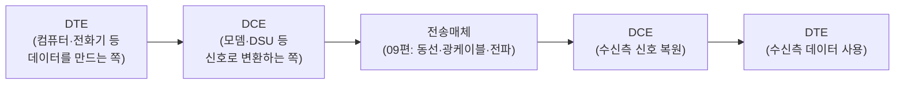
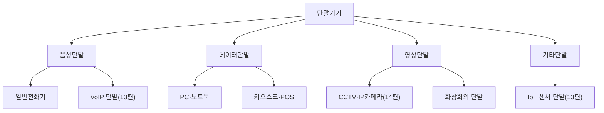

<Callout type="info">
  **이번 문서의 목표:** 단말기기를 DTE·DCE 구조로 이해해 종류별로 구분하고, 모뎀·DSU·CSU·광통신 종단장치의 역할과 속도 계산을 손으로 할 수 있으며, 베이스밴드·브로드밴드 전송과 광전송설비의 차이를 설명할 수 있게 된다.
</Callout>

## 왜 이 편부터 "정보통신기기" 과목이 시작되는가

06~11편의 "정보전송일반"이 신호를 어떻게 부호화·변조·다중화해 전송매체 위로 실어 보내는지를 다뤘다면, 이제부터 다루는 "정보통신기기" 과목은 그 신호를 **실제로 만들고 받는 물리적인 장치**에 초점을 맞춥니다. 03편에서 통신 시스템을 "송신기 → 전송매체 → 수신기"라는 큰 그림으로 소개했는데, 이 편은 그 그림의 양 끝단, 즉 사람(또는 기기)이 실제로 손으로 만지는 **단말기기**(terminal equipment)와, 그 단말과 회선 사이를 이어 주는 **통신장비**(communication equipment)를 자세히 들여다봅니다.

> **쉽게 말하면:** 지금까지는 "우편물이 어떻게 포장되고 압축되어 트럭에 실리는가"를 배웠다면, 이 편은 "그 우편물을 부치고 받는 우체국 창구와 집배원 장비"를 다루는 셈입니다.

## 1. 단말기기의 기능과 구조 — DTE와 DCE

### 왜 이렇게 나누는가

정보통신 시스템에서 데이터를 만들어 내거나 최종적으로 사용하는 장치와, 그 데이터를 실제 회선에 실을 수 있는 신호로 바꿔 주는 장치는 역할이 다릅니다. 이 둘을 구분하는 표준 용어가 있습니다.

- **DTE**(Data Terminal Equipment, 데이터단말장치): 사람이 직접 다루며 데이터를 생성·처리·표시하는 장치입니다. 컴퓨터, 프린터, 팩스, 전화기 등이 해당합니다.
- **DCE**(Data Communication Equipment, 데이터회선종단장치): DTE가 만든 데이터를 실제 전송매체(09편)에 맞는 신호로 바꿔 주고받는 장치입니다. 모뎀, DSU, CSU 등이 해당하며, 뒤에서 하나씩 다룹니다.

> **쉽게 말하면:** DTE가 "말하고 듣는 사람"이라면, DCE는 그 사람의 말을 전화선이 알아듣는 전기 신호로 바꿔 주는 "통역사"입니다.

### 단말기기의 기능적 구조

단말기기는 역할에 따라 내부가 몇 개의 기능 블록으로 나뉩니다.

| 기능부 | 역할 |
|--------|------|
| 입력부 | 사람 또는 센서로부터 데이터를 받아들임(키보드, 마이크, 카메라 센서 등) |
| 처리부 | 입력된 데이터를 가공·저장·연산함(04편의 중앙처리장치·기억장치가 여기 해당) |
| 출력부 | 처리 결과를 사람이 인식할 수 있는 형태로 내보냄(화면, 스피커, 프린터 등) |
| 통신 인터페이스부 | DCE와 연결되어 데이터를 회선에 맞는 형식으로 주고받는 접속 규격을 담당 |

**자주 틀리는 점:** "단말기기 = DTE"라고 단순히 외우면 안 됩니다. 넓은 의미의 단말기기에는 DTE뿐 아니라 통신 인터페이스부를 통해 DCE와 맞물려 동작하는 전체 장치를 포괄하지만, 시험에서 "DTE"라는 용어가 명시되면 데이터를 생성·소비하는 쪽만을 가리킨다는 점을 구분해야 합니다.

## 2. 단말기기의 종류

단말기기는 다루는 정보의 형태에 따라 크게 네 가지로 나눌 수 있습니다.

| 구분 | 정의 | 대표 예시 | 자세히 다루는 편 |
|------|------|-----------|-------------------|
| 음성단말 | 사람의 음성을 주고받는 데 특화된 단말 | 일반전화기, VoIP 단말 | 13편(회선개통과 이동통신·인입선 단말) |
| 데이터단말 | 문자·숫자 등 정형 데이터를 입출력하는 단말 | PC, 프린터, 키오스크, POS | 13편(사업자용 단말·디지털 정보기기) |
| 영상단말 | 정지·동영상 정보를 촬영·표시·처리하는 단말 | CCTV, IP카메라, 화상회의 단말 | 14편(영상정보처리·홈네트워크 설비) |
| 기타단말 | 위 세 범주로 분류하기 어려운 특수 목적 단말 | IoT 센서, 스마트홈 기기, 웨어러블 | 13편·19편(홈네트워크 서비스) |

**왜 이렇게 나누는 것이 중요한가:** 단말의 종류에 따라 요구되는 회선의 성격(음성단말은 지연에 민감, 영상단말은 대역폭에 민감, IoT 단말은 저전력·저속에 특화)이 크게 달라지기 때문입니다. 이 차이는 15편 이후 네트워크 설계에서 트래픽 특성을 분석할 때 다시 등장합니다.

## 3. 통신장비 — DCE의 실제 모습

### 모뎀 — 변복조기

**모뎀**(modem)이라는 이름 자체가 **변조기**(MOdulator)와 **복조기**(DEModulator)를 합친 말입니다. 07편에서 배운 변조(디지털 데이터를 아날로그 반송파에 실음)와 복조(반대로 반송파에서 디지털 데이터를 뽑아냄)를 실제로 수행하는 장치입니다. 예를 들어 컴퓨터가 만든 0과 1의 디지털 신호는, 전화선처럼 원래 음성(아날로그)을 위해 설계된 회선에 그대로 실을 수 없으므로, 모뎀이 이를 QAM 등의 방식으로 변조해 실어 보내고, 반대쪽 모뎀이 이를 다시 복조해 디지털 데이터로 되돌립니다.

**계산·적용 — 모뎀 속도 계산.** 10편에서 배운 $R_b = R_s \times \log_2 M$을 모뎀에 그대로 적용해 봅니다. 어떤 모뎀이 16-QAM(07편에서 다룬 진폭과 위상을 함께 바꾸는 변조 방식, 한 심볼이 16가지 상태 중 하나를 표현) 방식으로 초당 2400개의 심볼(신호율 2400보오)을 전송한다고 합시다.

**1단계 — 심볼 하나가 표현하는 비트 수**

16가지 상태를 표현하려면 몇 비트가 필요한지 구합니다.

$$
\log_2 16 = 4
$$

**2단계 — 비트율 계산**

$$
R_b = 2400 \times 4 = 9600\text{bps}
$$

**해석:** 신호율(보오율)은 2400으로 고정되어 있어도, 한 심볼에 몇 비트를 실을 수 있는 변조 방식(레벨 수 $M$)을 쓰느냐에 따라 실제 비트율이 크게 달라집니다. 초기 저속 모뎀들이 "2400보오 모뎀"에서 변조 방식만 바꿔가며 4800bps, 9600bps, 14400bps로 속도를 끌어올렸던 역사가 바로 이 원리에 기반합니다. **자주 틀리는 점:** "모뎀 속도(bps)"와 "회선의 신호율(보오)"을 같은 값으로 혼동하면 안 됩니다. 같은 신호율이라도 변조 레벨 수가 다르면 비트율이 달라집니다.

### DSU와 CSU — 디지털 회선 종단장치

모뎀이 디지털 신호를 아날로그로 바꾸는 장치라면, 애초에 회선 자체가 디지털인 경우(예: 11편의 T1 회선)에는 아날로그 변환이 필요 없는 대신 다른 역할을 하는 장치가 필요합니다.

- **DSU**(Digital Service Unit, 디지털회선종단장치): DTE가 보낸 디지털 데이터의 신호 형식을 디지털 전송로에 맞는 라인코드(06편의 RZ·NRZ 등)로 바꾸고, 신호를 원래 모양으로 재생·정형(reshape)하는 역할을 합니다.
- **CSU**(Channel Service Unit, 채널서비스장치): 디지털 회선과 직접 연결되어 신호의 재생·정형뿐 아니라, 회선의 타이밍(클록)을 통신사업자 쪽과 정확히 맞추고, 회선 상태를 원격에서 진단·시험할 수 있는 기능(회선 루프백 등)까지 담당합니다.

**둘의 관계:** 실무에서는 DSU와 CSU가 하나의 장치(DSU/CSU 통합형)로 함께 제공되는 경우가 많습니다. 개념적으로는 DSU가 "신호 변환과 정형"에, CSU가 "회선 인터페이스·타이밍·진단"에 조금 더 무게가 실린다고 구분하면 됩니다. **자주 틀리는 점:** 모뎀은 아날로그 회선용, DSU/CSU는 디지털 회선용이라는 점이 가장 자주 헷갈리는 구분입니다. "변조·복조가 필요한가(아날로그 회선) 아닌가(디지털 회선)"로 구분하면 명확해집니다.

### 광통신 종단장치 — OLT, ONU, ONT

09편에서 광섬유의 물리적 구조를, 11편에서 WDM 다중화를 배웠습니다. 이제 그 광케이블의 양 끝에 실제로 설치되는 장비를 봅니다.

- **OLT**(Optical Line Terminal, 광가입자망 종단장치): 통신사업자의 국사(중앙국) 쪽에 설치되어, 여러 가입자에게 나눠 보낼 신호를 하나의 광케이블에 실어 내보내고, 가입자로부터 올라오는 신호를 받아들이는 장비입니다.
- **ONU**(Optical Network Unit, 광네트워크유닛): OLT와 가입자 댁내(또는 건물) 사이의 중간 지점에 설치되어 광신호를 전기 신호로 변환해 주는 장비입니다.
- **ONT**(Optical Network Terminal, 광네트워크종단장치): 가입자의 댁내에 직접 설치되는 최종 종단 장비로, ONU의 기능을 가입자 댁내까지 끌어온 형태로 볼 수 있습니다.

**왜 이름이 셋이나 되는가:** OLT가 국사에서 뻗어 나온 광케이블을 가입자 근처까지 끌고 온 뒤, 그 지점에서 각 가입자 댁내까지는 다시 나눠져야 합니다. 이 나눠지는 지점(또는 그보다 가입자에 더 가까운 지점)에 설치되는 장비를 ONU라 하고, 광케이블이 가입자 댁내까지 완전히 들어가는 방식(FTTH, Fiber To The Home)에서 그 종착점에 놓이는 장비를 특별히 ONT라 구분해 부릅니다. 이 광가입자망 구조(FTTx)는 18편의 인터넷 통신망(xDSL·FTTx·PON·HFC)에서 더 자세히 다룹니다.

## 4. 전송설비 — 베이스밴드와 브로드밴드

### 베이스밴드 전송

**베이스밴드**(baseband) 전송은 디지털 신호를 별도의 변조 없이, 06편에서 배운 라인코드(RZ·NRZ 등) 형태 그대로 전송매체에 실어 보내는 방식입니다. 신호가 원래 가지고 있는 주파수 대역(기저대역)을 그대로 쓰기 때문에 붙은 이름입니다.

> **쉽게 말하면:** 베이스밴드는 "번역 없이 원래 말 그대로 전달하는 것"과 같습니다.

**특징:** 전체 대역폭을 하나의 채널이 통째로 사용하므로 한 순간에는 하나의 신호만 실을 수 있습니다(양방향 통신은 시간을 나눠 번갈아 사용하거나, 09편의 연선을 여러 쌍 사용해 구현). 오늘날 사무실·가정에서 흔히 쓰는 유선 이더넷(Ethernet) LAN이 대표적인 베이스밴드 전송 방식입니다.

### 브로드밴드 전송

**브로드밴드**(broadband) 전송은 디지털 또는 아날로그 신호를 07편에서 배운 변조 방식으로 반송파에 실은 뒤, 11편의 FDM(주파수분할다중화) 방식으로 하나의 전송매체 안에 **여러 개의 채널을 동시에** 실어 보내는 방식입니다.

> **쉽게 말하면:** 브로드밴드는 하나의 도로에 여러 개의 차선을 그어, 서로 다른 방송·데이터가 동시에 지나갈 수 있게 만든 것과 같습니다.

**특징:** 하나의 매체 안에서 여러 채널이 동시에 독립적으로 오갈 수 있어 대역폭 활용도가 높습니다. 대표적인 예가 케이블TV(CATV) 망으로, 하나의 동축케이블 안에 수백 개의 방송 채널과 인터넷 데이터 채널이 주파수별로 나뉘어 동시에 흐릅니다.

### 베이스밴드와 브로드밴드의 비교

| 구분 | 베이스밴드 | 브로드밴드 |
|------|-----------|-----------|
| 변조 여부 | 변조 없이 원신호 그대로 전송 | 반송파에 변조해 전송 |
| 채널 수 | 한 매체에 채널 1개(시간을 나눠 양방향 구현) | 한 매체에 FDM으로 여러 채널 동시 전송 |
| 대표 사례 | 유선 LAN(이더넷) | 케이블TV(CATV) 망 |
| 대역폭 활용 | 상대적으로 단순 | 상대적으로 복잡하지만 활용도가 높음 |

**자주 틀리는 점:** "브로드밴드"라는 단어를 일상에서는 흔히 "빠른 인터넷"이라는 뜻으로 씁니다. 하지만 시험에서 묻는 브로드밴드 전송은 속도의 문제가 아니라, **FDM으로 하나의 매체에 여러 채널을 동시에 실어 보내는 전송 방식 자체**를 가리키는 기술 용어라는 점을 구분해야 합니다.

### 광전송설비

09편에서 배운 광케이블 자체의 물리적 특성과, 앞서 이 편에서 배운 OLT·ONU·ONT를 하나로 묶으면 실제 **광전송설비**(optical transmission facility)의 기본 구성이 완성됩니다.

광전송설비는 전기 신호를 빛으로 바꾸는 광송신부(레이저 다이오드 또는 발광다이오드 사용), 09편에서 다룬 광케이블 구간, 그리고 빛을 다시 전기 신호로 바꾸는 광수신부(포토다이오드 사용)로 구성됩니다. 여기에 11편의 WDM을 적용하면 한 가닥의 광케이블로 여러 파장(채널)을 동시에 실어 보내는 대용량 간선망을 구성할 수 있으며, 이 확장된 구조는 18편의 전송망 기술에서 이어서 다룹니다.

## 핵심 정리

- 단말기기는 **DTE**(데이터를 만들고 쓰는 쪽)와 **DCE**(그 데이터를 회선 신호로 바꾸는 쪽)로 나뉘며, 단말은 음성·데이터·영상·기타 네 종류로 분류된다.
- **모뎀**은 변조·복조로 아날로그 회선에 디지털 데이터를 싣고, 비트율은 $R_b=R_s\times\log_2 M$로 신호율과 변조 레벨 수에 따라 달라진다.
- **DSU**는 디지털 신호의 재생·정형, **CSU**는 회선 타이밍·진단까지 담당하며, 둘 다 디지털 회선용이라는 점에서 아날로그 회선용 모뎀과 구분된다.
- 광가입자망은 국사의 **OLT**, 중간의 **ONU**, 가입자 댁내의 **ONT**로 이어지는 구조를 가진다.
- **베이스밴드**는 변조 없이 원신호 그대로 하나의 채널만 쓰고, **브로드밴드**는 변조와 FDM으로 여러 채널을 동시에 싣는 방식이다.
- 광전송설비는 광송신부-광케이블-광수신부로 구성되며 WDM을 더하면 대용량 간선망이 된다.

## 마무리 복습

<Quiz
  questionNumber={1}
  question="DTE와 DCE에 대한 설명으로 가장 적절한 것은?"
  options={['DTE는 신호를 변조·복조하는 장치이고 DCE는 데이터를 생성하는 장치다', 'DTE는 데이터를 생성·처리·표시하는 장치이고 DCE는 그 데이터를 회선 신호로 변환하는 장치다', 'DTE와 DCE는 항상 같은 하나의 장치를 가리키는 용어다', 'DTE는 광케이블 전용 장치이고 DCE는 동선 전용 장치다']}
  correctAnswer={2}
  explanation="DTE는 컴퓨터·전화기처럼 데이터를 생성·처리·표시하는 장치이고, DCE는 모뎀처럼 그 데이터를 회선에 맞는 신호로 변환하는 장치다."
  optionExplanations={['변조·복조는 DCE의 역할이며 DTE의 역할이 아니다.', 'DTE와 DCE의 역할 구분을 정확히 설명했다.', '두 용어는 역할이 다른 별개의 장치를 가리킨다.', '매체 종류가 아니라 역할에 따른 구분이다.']}
/>

<Quiz
  questionNumber={2}
  question="단말기기의 종류 중 CCTV·IP카메라가 속하는 분류로 가장 적절한 것은?"
  options={['음성단말', '데이터단말', '영상단말', '기타단말']}
  correctAnswer={3}
  explanation="CCTV와 IP카메라는 정지·동영상 정보를 촬영·처리하는 영상단말에 해당한다."
  optionExplanations={['음성단말은 전화기처럼 음성 정보를 다루는 단말이다.', '데이터단말은 PC나 키오스크처럼 정형 데이터를 다루는 단말이다.', '영상 정보를 다루는 단말이라는 분류가 정확하다.', '기타단말은 세 범주로 분류하기 어려운 특수 목적 단말을 가리킨다.']}
/>

<Quiz
  questionNumber={3}
  question="어떤 모뎀이 8-PSK(한 심볼이 8가지 상태 중 하나) 방식으로 초당 3000개의 심볼을 전송할 때 비트율은?"
  options={['3000bps', '6000bps', '9000bps', '24000bps']}
  correctAnswer={3}
  explanation="8가지 상태를 표현하려면 log2(8)=3비트가 필요하므로 비트율은 신호율 3000에 3을 곱한 9000bps다."
  optionExplanations={['신호율만 그대로 답으로 쓴 값이다.', 'log2(8)을 2로 잘못 계산했을 때 나오는 값이다.', '3000x3=9000의 정확한 계산 결과다.', 'log2(8)을 8로 잘못 대입해 지나치게 커진 값이다.']}
/>

<Quiz
  questionNumber={4}
  question="모뎀과 DSU/CSU를 구분하는 가장 핵심적인 기준은?"
  options={['설치 장소가 국사인지 가입자 댁내인지', '연결되는 회선이 아날로그인지 디지털인지', '사용하는 케이블이 동선인지 광섬유인지', '데이터단말인지 영상단말인지']}
  correctAnswer={2}
  explanation="모뎀은 변조·복조를 통해 아날로그 회선에 디지털 데이터를 싣는 장치이고, DSU/CSU는 이미 디지털인 회선의 신호 재생·정형과 타이밍·진단을 담당하는 장치로 구분된다."
  optionExplanations={['설치 장소는 두 장치를 구분하는 기준이 아니다.', '아날로그 회선용(모뎀)과 디지털 회선용(DSU/CSU)이라는 구분이 정확하다.', '케이블 종류가 아니라 회선의 신호 형태(아날로그·디지털)가 기준이다.', '단말 종류는 이 두 장치를 구분하는 기준과 무관하다.']}
/>

<Quiz
  questionNumber={5}
  question="광가입자망에서 국사에 설치되어 여러 가입자에게 보낼 신호를 광케이블에 실어 보내는 장비는?"
  options={['ONT', 'ONU', 'OLT', 'CSU']}
  correctAnswer={3}
  explanation="OLT(광가입자망 종단장치)는 국사에 설치되어 여러 가입자로 나갈 신호를 하나의 광케이블에 실어 내보내는 역할을 한다."
  optionExplanations={['ONT는 가입자 댁내에 설치되는 최종 종단 장비다.', 'ONU는 OLT와 가입자 사이의 중간 지점에 설치되는 장비다.', '국사에 설치되어 신호를 광케이블에 실어 보내는 장비라는 설명이 OLT와 일치한다.', 'CSU는 디지털 회선의 타이밍·진단을 담당하는 장비로 광가입자망 구조와는 다른 장비다.']}
/>

<Quiz
  questionNumber={6}
  question="베이스밴드 전송과 브로드밴드 전송에 대한 설명으로 옳은 것은?"
  options={['베이스밴드는 변조를 거쳐 여러 채널을 동시에 전송한다', '브로드밴드는 변조 없이 원신호를 그대로 하나의 채널로 전송한다', '베이스밴드는 변조 없이 원신호 그대로, 브로드밴드는 변조와 FDM으로 여러 채널을 동시에 전송한다', '두 방식은 사용하는 케이블의 재질로만 구분된다']}
  correctAnswer={3}
  explanation="베이스밴드는 라인코드 형태의 원신호를 변조 없이 그대로 전송하고, 브로드밴드는 변조와 주파수분할다중화(FDM)로 여러 채널을 동시에 전송한다."
  optionExplanations={['변조를 거쳐 여러 채널을 동시에 전송하는 것은 브로드밴드의 특징이다.', '변조 없이 원신호를 전송하는 것은 베이스밴드의 특징이다.', '두 방식의 핵심 차이를 정확히 설명했다.', '두 방식은 케이블 재질이 아니라 변조 여부와 채널 구성 방식으로 구분된다.']}
/>

<Quiz
  questionNumber={7}
  question="광전송설비의 구성 순서로 옳은 것은?"
  options={['광수신부 → 광케이블 → 광송신부', '광송신부 → 광케이블 → 광수신부', '광케이블 → 광송신부 → 광수신부', '광송신부 → 광수신부 → 광케이블']}
  correctAnswer={2}
  explanation="광전송설비는 전기 신호를 빛으로 바꾸는 광송신부에서 시작해 광케이블 구간을 지나 빛을 다시 전기 신호로 바꾸는 광수신부로 이어지는 순서로 구성된다."
  optionExplanations={['광수신부가 먼저 오는 순서는 신호 흐름과 맞지 않는다.', '광송신부-광케이블-광수신부라는 신호 흐름 순서가 정확하다.', '광케이블이 가장 먼저 오는 순서는 신호 변환 흐름과 맞지 않는다.', '광수신부와 광케이블의 순서가 뒤바뀌었다.']}
/>

## 참고 자료

- [계명대학교 게시판 - 정보통신기사 출제기준(필기·실기) PDF (2026.1.1.~2028.12.31. 적용)](https://cms.kmu.ac.kr/bbs/computer/763/172569/download.do)
- [한국방송통신전파진흥원(KCA) - 출제기준 자료실](https://www.cq.or.kr/qh_cusgm10_001.do)
