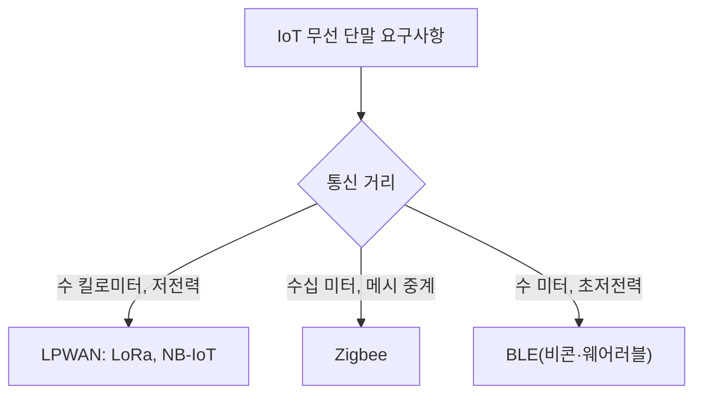

<Callout type="info">
  **이번 문서의 목표:** 회선개통 시 확인하는 전화기·VoIP 단말의 기능과 품질 지표를 계산하고, 이동통신 1세대부터 5세대까지의 핵심 차이와 재난안전통신망의 존재 이유를 설명하며, Wi-Fi·IoT 무선 단말과 CATV·IPTV 같은 사업자용 디지털 정보기기의 특징을 구분할 수 있게 된다.
</Callout>

## 이 편이 다루는 범위

**회선개통**(circuit provisioning)이란 통신사업자가 가입자에게 실제로 통신 서비스를 쓸 수 있도록 인입선(引入線, 국선이 건물 안으로 들어오는 마지막 구간의 배선)을 연결하고 단말을 개통해 주는 절차입니다. 이 편은 그 인입선 맨 끝에 물리는 단말기기, 즉 사람 손에 잡히거나 눈에 보이는 장치들에 초점을 맞춥니다. 09~11편에서 다룬 전송매체·신호 품질·다중화 기술이 "선로 위에서 무슨 일이 일어나는가"였다면, 이 편은 "그 선로의 양쪽 끝에 무엇이 꽂혀 있는가"를 다룹니다.

> **쉽게 말하면:** 09~11편이 도로(선로)와 교통 신호(변복조·다중화) 이야기였다면, 이 편은 그 도로 끝에 서 있는 자동차(단말)와 정류장(교환·개통 서비스) 이야기입니다.

## 1. 회선개통 서비스 — 전화기 기능과 VoIP 품질 측정

### 전화기의 기본 기능

전통적인 아날로그 전화기는 다음 세 가지 기능 블록으로 구성됩니다.

| 기능 블록 | 역할 |
|---|---|
| 송화기(mouthpiece, 마이크로폰) | 음성(음파, 공기의 압력 변화)을 전기 신호(전류의 세기 변화)로 바꾼다 |
| 수화기(receiver, 스피커) | 전기 신호를 다시 음파로 바꿔 사람 귀에 들려준다 |
| 다이얼링 회로 | 상대방 번호를 교환기에 알리는 신호를 만든다 |

다이얼링 방식은 두 가지로 나뉩니다. **펄스 다이얼링**(pulse dialing)은 숫자만큼 회선을 끊었다 이었다 하는 방식으로, 옛날 다이얼식 전화기가 썼던 방식입니다. **DTMF**(Dual Tone Multi Frequency, 이중톤 다중주파수) 방식은 버튼 하나마다 서로 다른 두 개의 주파수를 동시에 내보내 숫자를 표현합니다. 예를 들어 숫자 5를 누르면 770Hz와 1336Hz라는 두 주파수가 동시에 섞여 나가는데, 교환기는 이 두 주파수의 조합만 보고 어떤 버튼이 눌렸는지 정확히 구분합니다.

> **쉽게 말하면:** 펄스 방식은 "끊었다 이었다"를 숫자만큼 반복하는 모스부호식이고, DTMF는 버튼마다 정해진 화음(두 음이 겹친 소리) 하나를 보내는 방식입니다.

**자주 틀리는 점:** DTMF가 "하나의 주파수"만 쓴다고 착각하기 쉽습니다. 반드시 **저주파수 그룹**(697~941Hz)과 **고주파수 그룹**(1209~1633Hz)에서 각각 하나씩, 총 두 개의 주파수를 조합해야 하나의 숫자·기호를 표현합니다. 이 두 그룹 구조 덕분에 사람 목소리(음성 대역 300~3400Hz 안에 존재)와 섞여도 오작동할 확률이 낮아집니다.

### VoIP 단말과 품질 측정

**VoIP**(Voice over Internet Protocol, 인터넷 프로토콜 기반 음성 전달)는 아날로그 음성을 디지털로 부호화(06편에서 다룬 PCM 등)한 뒤, 회선교환망이 아니라 IP 패킷망을 통해 전달하는 방식입니다. 회선교환(sircuit switching)은 통화 내내 고정된 대역폭을 독점하지만, VoIP는 다른 데이터 트래픽과 같은 회선을 나눠 쓰는 패킷교환 방식이므로 통신사 입장에서 회선을 훨씬 효율적으로 쓸 수 있습니다. 다만 그 대가로 **품질이 흔들릴 위험**이 생기고, 이를 정량적으로 관리하는 지표가 시험에 자주 나옵니다.

| 품질 지표 | 의미 | 문제가 생기면 |
|---|---|---|
| 지연(latency) | 발신자가 말한 소리가 수신자에게 도착하기까지 걸리는 시간 | 150밀리초를 넘으면 대화가 어색하게 겹치기 시작함 |
| 지터(jitter) | 패킷들이 도착하는 시간 간격의 불규칙한 편차 | 음성이 끊기거나 로봇 음성처럼 들림 |
| 패킷손실률(packet loss) | 전체 패킷 중 도착하지 못한 패킷의 비율 | 음절이 통째로 사라져 들림 |
| 에코(echo) | 자신이 말한 소리가 지연되어 되돌아와 들리는 현상 | 발신자가 자기 목소리를 다시 들음 |
| MOS(Mean Opinion Score, 평균 의견 점수) | 1점(매우 나쁨)–5점(매우 좋음)으로 사람이 직접 평가한 통화 품질 점수 | 4.0 미만이면 통화 품질 불만이 급증 |

**MOS는 왜 주관식 점수인데 시험에 나오는가:** MOS는 원래 실제 사람들에게 통화를 들려주고 점수를 매기게 하는 청취 실험 지표였습니다. 하지만 매번 사람을 동원할 수 없으므로, 지연·지터·패킷손실 같은 객관적 수치를 입력하면 예상 MOS 점수를 계산해 주는 **R-factor**(전송등급인자) 같은 알고리즘 모델이 개발되었고, 실무에서는 이 계산값을 "추정 MOS"로 씁니다. 시험에서는 "MOS 점수가 높다는 것은 무엇을 의미하는가", "지연·지터·손실이 늘어나면 MOS는 어떻게 변하는가"(정답: MOS는 낮아진다)라는 관계를 묻는 형태로 나옵니다.

> **쉽게 말하면:** MOS는 통화 품질에 매기는 성적표(5점 만점)이고, 지연·지터·손실은 그 성적이 나쁜 이유를 설명하는 감점 사유들입니다.

**VoIP 단말의 종류:** IP 전화기(하드폰, 이더넷 케이블을 직접 꽂는 전용 단말), 소프트폰(softphone, PC나 스마트폰에 설치하는 프로그램), 그리고 기존 아날로그 전화기를 IP망에 연결해 주는 **ATA**(Analog Telephone Adapter, 아날로그 전화 어댑터)가 있습니다. ATA는 아날로그 신호와 VoIP 패킷 사이를 변환해 주므로, 낡은 전화기를 바꾸지 않고도 인터넷 전화로 전환할 수 있게 해 줍니다.

## 2. 이동통신 단말 — 세대별 특징과 재난안전통신

### 이동통신 세대(generation)별 핵심 차이

이동통신은 흔히 1G부터 5G까지 세대로 구분합니다. 각 세대의 차이는 "무엇이 더 빨라졌는가"가 아니라 **"아날로그에서 디지털로", "회선교환에서 패킷교환으로", "음성 중심에서 데이터 중심으로**"라는 근본적인 전환점을 기준으로 나뉩니다.

| 세대 | 대표 방식 | 핵심 전환점 | 주요 용도 |
<tr><td>1세대</td></tr>
| 1G | AMPS(아날로그) | 아날로그 변조(FM) 기반 음성 통화 | 음성 통화만 가능 |
| 2G | GSM, CDMA(IS-95) | 디지털 변조(11편에서 다룬 TDMA·CDMA 방식)로 전환, 문자메시지(SMS) 등장 | 음성 + 문자 |
| 3G | WCDMA, CDMA2000 | 패킷 데이터 상시 접속(항상 켜진 인터넷) 시작 | 음성 + 저속 데이터(영상통화 시도) |
| 4G | LTE(Long Term Evolution) | 음성까지 완전히 IP 패킷으로 통합(VoLTE), OFDMA 기반 광대역 | 고속 데이터 중심, 실시간 스트리밍 |
| 5G | 5G NR(New Radio) | 초고속·초저지연·초연결이라는 세 가지 요구사항을 하나의 망에서 동시에 지원 | 대용량 데이터·자율주행·IoT 대규모 연결 |

표에 실수로 들어간 빈 행 표기는 무시하고, 핵심은 세대가 올라갈수록 다음 세 가지 축이 함께 개선된다는 점입니다.

- **전송속도**: 세대마다 이론상 최고 속도가 자릿수 단위로 커집니다.
- **지연시간**: 4G의 지연은 수십 밀리초 수준이었지만, 5G는 이를 1밀리초 수준까지 낮추는 것을 목표로 설계되었습니다.
- **접속 밀도**: 5G는 1제곱킬로미터 안에 수십만 개의 IoT 기기가 동시에 붙어도 감당할 수 있도록 설계되었습니다.

> **쉽게 말하면:** 세대가 오를수록 "더 굵은 파이프(속도)", "더 짧은 배달 시간(지연)", "더 많은 손님을 동시에 받을 수 있는 매장(접속 밀도)"이 함께 좋아집니다.

**5G의 세 가지 시나리오**는 국제전기통신연합(ITU)이 정의한 표준 용어로 시험에 그대로 나옵니다.

- **eMBB**(enhanced Mobile Broadband, 향상된 모바일 광대역): 초고속 데이터 전송, 초고화질 영상 스트리밍
- **URLLC**(Ultra-Reliable and Low Latency Communications, 초신뢰·저지연 통신): 자율주행차, 원격수술처럼 지연이 곧 사고로 이어지는 응용
- **mMTC**(massive Machine Type Communications, 대규모 사물통신): 스마트미터·센서처럼 좁은 지역에 수많은 기기가 저전력으로 동시 접속

**자주 틀리는 점:** 5G가 "무조건 4G보다 지연이 낮다"고만 외우면, "5G에서도 eMBB 시나리오는 URLLC만큼 지연이 낮지 않을 수 있다"는 실제 설계 사실을 놓칩니다. 5G는 하나의 물리망 위에서 **네트워크 슬라이싱**(network slicing, 하나의 물리 인프라를 여러 개의 가상 논리망으로 나눠 서비스별로 다른 품질을 보장하는 기술)을 이용해 시나리오별로 요구 성능을 다르게 배분합니다.

### 재난안전통신망

**재난안전통신망**(PS-LTE, Public Safety LTE)은 소방·경찰·해양경찰 등 재난 대응 기관이 평상시 상용망과 분리된 전용망으로 통신하기 위해 구축한 통신망입니다. 일반 상용 이동통신망은 재난 상황(지진, 대형 화재)이 발생하면 일반 시민의 통화·데이터 사용량이 폭증해 **망 자체가 마비**될 수 있습니다. 이때 재난 현장의 소방관과 경찰이 상용망에 의존하면 정작 필요한 순간에 통신이 끊길 위험이 큽니다.

> **쉽게 말하면:** 재난안전통신망은 화재가 나서 모두가 동시에 119에 신고 전화를 걸어 회선이 꽉 찬 상황에서도, 소방관들끼리는 별도의 전용 도로로 막힘없이 연락할 수 있게 만든 전용 회선입니다.

우리나라의 재난안전통신망은 LTE 기술 기반으로 구축되었으며(그래서 PS-LTE), 여러 기관이 하나의 통합망을 공동 사용해 재난 현장에서 기관 간 실시간 정보 공유가 가능하다는 점이 핵심 설계 목표입니다. **자주 틀리는 점:** 재난안전통신망을 "재난 문자를 보내는 망"으로 오해하는 경우가 있는데, 재난 문자(긴급재난문자, CBS)는 상용 이동통신망을 통해 일반 시민에게 방송하듯 뿌리는 별개의 서비스이고, 재난안전통신망은 재난 대응 기관 사이의 전용 통신 인프라입니다.

## 3. 무선통신 단말 — Wi-Fi와 IoT

### Wi-Fi 표준의 세대

**Wi-Fi**는 IEEE 802.11 표준 계열을 따르는 근거리 무선랜 기술입니다. 표준이 개정될 때마다 접미사 알파벳이 붙는데, 최근에는 이해하기 쉬운 세대 번호도 함께 씁니다.

| 표준 | 세대 이름 | 주요 주파수 대역 | 특징 |
|---|---|---|---|
| 802.11b/g | Wi-Fi 1/3 | 2.4GHz | 초기 표준, 벽을 잘 통과하지만 속도가 느림 |
| 802.11n | Wi-Fi 4 | 2.4/5GHz | MIMO(11편에서 다룬 다중입출력) 도입 |
| 802.11ac | Wi-Fi 5 | 5GHz | 더 넓은 채널 대역폭, 다중 사용자 MIMO |
| 802.11ax | Wi-Fi 6/6E | 2.4/5GHz(6E는 6GHz 추가) | OFDMA(11편에서 다룬 다중접속 기술)로 여러 기기 동시 처리 효율 향상 |

**2.4GHz와 5GHz의 트레이드오프**는 시험에 자주 나오는 대비 개념입니다. 2.4GHz는 파장이 길어 벽·장애물을 잘 돌아가지만(회절이 잘 됨) 전자레인지·블루투스 등과 대역이 겹쳐 간섭이 잦고, 5GHz는 대역폭이 넓어 속도는 빠르지만 파장이 짧아 장애물에 쉽게 막히고 도달 거리가 짧습니다.

### IoT 무선 단말 — 저전력 광역 통신망(LPWAN)

**IoT**(Internet of Things, 사물인터넷) 단말은 센서·계량기처럼 배터리로 몇 년씩 동작해야 하는 경우가 많아, Wi-Fi처럼 전력 소모가 큰 방식을 쓰기 어렵습니다. 이런 요구에 맞춰 등장한 것이 **LPWAN**(Low Power Wide Area Network, 저전력 광역 통신망) 계열 기술입니다.

| 기술 | 특징 | 적합한 용도 |
|---|---|---|
| LoRa | 비면허 대역 사용, 자체 사설망 구축 가능 | 농업 센서, 주차 관제 |
| NB-IoT(Narrowband IoT) | 이동통신사의 면허 대역을 활용, 통신 품질이 안정적 | 스마트미터, 원격 검침 |
| Zigbee | 근거리, 메시(mesh) 네트워크로 기기끼리 서로 중계 | 스마트홈 조명·센서 |
| 블루투스 저전력(BLE, Bluetooth Low Energy) | 초근거리, 매우 낮은 전력 소모 | 웨어러블 기기, 비콘 |

**판별 요령:** 문제에 "배터리로 10년간 동작", "수 킬로미터 밖에서도 통신"이라는 단서가 있으면 LoRa·NB-IoT 같은 LPWAN이 정답이고, "집 안 여러 방의 스마트 조명이 서로 신호를 중계"라는 단서가 있으면 메시 네트워크 구조를 쓰는 Zigbee가 정답입니다.

## 4. 사업자용 단말·디지털 정보기기

### CATV·IPTV와 셋톱박스

**CATV**(Community Antenna Television, 유선방송)는 동축케이블(09편에서 다룬 유선 전송매체)로 방송 신호를 각 가정에 분배하는 방식이고, **IPTV**(Internet Protocol Television)는 방송 콘텐츠를 IP 패킷으로 인터넷망을 통해 전달하는 방식입니다. 둘 다 가정에는 **STB**(Set-Top Box, 셋톱박스)라는 단말이 놓이는데, STB의 역할은 들어온 신호(CATV의 RF 신호 또는 IPTV의 IP 패킷)를 TV가 표시할 수 있는 영상 신호로 복호화(디코딩)하는 것입니다.

**CATV와 IPTV의 결정적 차이:** CATV는 방송사업자가 정해 놓은 채널을 순서대로 흘려보내는 방송형(broadcast) 전달이라, 시청자가 어느 순간에 채널에 접속해도 그 시점의 화면부터 봅니다. IPTV는 시청자의 요청에 따라 개별적으로 데이터를 전달하는 양방향 통신이 가능해, 다시보기·주문형 비디오(VOD, Video On Demand)처럼 시청자가 원하는 시점부터 재생하는 서비스를 제공할 수 있습니다.

### PC·프린터·복합기·키오스크

사업자가 현장에 배치하는 디지털 정보기기도 정보통신기사의 출제 범위입니다.

| 기기 | 통신 관점의 핵심 |
|---|---|
| PC(개인용 컴퓨터) | 유·무선 랜 인터페이스를 통해 서버·인터넷에 접속하는 범용 단말(04편에서 다룬 컴퓨터 구조 참고) |
| 프린터 | 네트워크 프린터는 IP 주소를 할당받아 여러 PC가 공유하는 네트워크 단말로 동작 |
| 복합기(MFP, Multi-Function Printer) | 프린터·스캐너·팩스·복사 기능을 하나로 통합, 네트워크로 스캔 문서를 이메일·폴더에 바로 전송 |
| 키오스크(kiosk) | 터치스크린과 결제 모듈을 갖춘 무인 정보 단말, 대개 전용회선이나 이동통신 모듈로 중앙 서버와 통신 |

**자주 틀리는 점:** 키오스크나 복합기를 "독립적으로 동작하는 기기"로만 생각하기 쉽지만, 실제 시험에서는 이런 기기들이 **네트워크에 연결된 통신 단말**이라는 관점, 즉 IP 주소를 할당받고 서버와 데이터를 주고받는다는 점을 묻습니다.

## 핵심 정리

- 전화기는 송화기·수화기·다이얼링 회로로 구성되며, DTMF는 저주파·고주파 그룹에서 각각 하나씩, 총 두 주파수의 조합으로 숫자를 표현한다.
- VoIP 품질은 지연·지터·패킷손실률로 결정되며, 이 수치들이 나빠질수록 사람이 느끼는 체감 품질 점수인 MOS는 낮아진다.
- 이동통신은 1G(아날로그 음성)에서 5G(eMBB·URLLC·mMTC)까지 속도·지연·접속 밀도가 함께 개선되어 왔고, 재난안전통신망(PS-LTE)은 상용망과 분리된 재난 대응 기관 전용망이다.
- Wi-Fi는 2.4GHz(도달거리 우수, 간섭 잦음)와 5GHz(속도 우수, 도달거리 짧음)의 트레이드오프를 가지며, IoT 단말은 배터리 수명과 통신 거리 요구에 따라 LPWAN·Zigbee·BLE 중에서 골라 쓴다.
- CATV는 방송형 전달, IPTV는 양방향 패킷 전달이라 다시보기·VOD 같은 서비스가 가능하며, 셋톱박스는 두 경우 모두 신호를 복호화하는 단말이다.

## 마무리 복습

<Quiz
  questionNumber={1}
  question="DTMF(이중톤 다중주파수) 방식의 다이얼링에 대한 설명으로 가장 적절한 것은?"
  options={['숫자 하나마다 단일 주파수 하나만 사용한다', '저주파 그룹과 고주파 그룹에서 각각 하나씩, 총 두 개의 주파수를 조합해 숫자를 표현한다', '회선을 끊었다 이었다 하는 방식으로 숫자를 표현한다', '음성 대역과 겹치지 않도록 초음파 대역만 사용한다']}
  correctAnswer={2}
  explanation="DTMF는 저주파 그룹과 고주파 그룹에서 각각 하나씩 선택한 두 개의 주파수를 동시에 내보내 하나의 숫자·기호를 표현하는 방식이다."
  optionExplanations={['단일 주파수만 쓰면 두 그룹의 조합 구조라는 DTMF의 핵심 특징을 놓친 설명이다.', '두 주파수 그룹에서 하나씩 조합한다는 DTMF의 정의와 정확히 일치한다.', '회선을 끊었다 이었다 하는 방식은 펄스 다이얼링에 대한 설명이다.', 'DTMF의 주파수는 사람 음성 대역인 300에서 3400헤르츠 범위 안에 있다.']}
/>

<Quiz
  questionNumber={2}
  question="VoIP 통화 중 지연·지터·패킷손실률이 모두 증가했다. 이때 MOS(평균 의견 점수)의 변화로 옳은 것은?"
  options={['MOS는 높아진다', 'MOS는 낮아진다', 'MOS는 변하지 않는다', 'MOS는 지연에만 영향을 받고 지터·손실과는 무관하다']}
  correctAnswer={2}
  explanation="지연, 지터, 패킷손실률은 모두 통화 품질을 저하시키는 요인이므로 이 값들이 증가하면 사람이 체감하는 통화 품질 점수인 MOS는 낮아진다."
  optionExplanations={['품질 저하 요인이 늘었는데 점수가 높아진다는 것은 정의와 반대된다.', '품질 저하 요인 세 가지가 모두 증가하면 체감 품질 점수는 낮아지는 것이 정확한 관계다.', 'MOS는 이런 지표들의 영향을 직접 받아 변화하는 값이다.', '지터와 패킷손실도 MOS에 영향을 주는 요인으로 함께 고려된다.']}
/>

<Quiz
  questionNumber={3}
  question="이동통신 세대 중 음성 통화까지 IP 패킷으로 완전히 통합해 처리하는 VoLTE가 도입된 세대는?"
  options={['2G', '3G', '4G', '5G만 해당']}
  correctAnswer={3}
  explanation="4G LTE에서 음성 통화까지 IP 패킷으로 완전히 통합하는 VoLTE 방식이 도입되었으며, 이는 3G까지 남아 있던 회선교환 방식 음성 통화와 구분되는 핵심 전환점이다."
  optionExplanations={['2G는 디지털 음성·문자 단계로 IP 패킷 통합과는 관련이 없다.', '3G는 패킷 데이터 상시접속이 시작된 단계이며 음성은 여전히 회선교환에 의존했다.', '4G에서 음성까지 IP화하는 VoLTE가 도입되었다는 설명이 정확하다.', '5G는 4G에서 이미 확립된 전 IP화를 이어받아 발전시킨 단계다.']}
/>

<Quiz
  questionNumber={4}
  question="5G의 세 가지 서비스 시나리오 중, 자율주행차나 원격수술처럼 지연이 곧 사고로 이어지는 응용에 해당하는 것은?"
  options={['eMBB', 'URLLC', 'mMTC', 'PS-LTE']}
  correctAnswer={2}
  explanation="URLLC(초신뢰·저지연 통신)는 지연이 사고로 직결되는 자율주행차, 원격수술 같은 응용을 위해 초저지연과 초신뢰성을 동시에 요구하는 5G의 서비스 시나리오다."
  optionExplanations={['eMBB는 초고속 데이터 전송에 초점을 맞춘 시나리오다.', '초신뢰·저지연이 요구되는 응용에 정확히 대응하는 시나리오다.', 'mMTC는 대규모 사물통신을 위한 시나리오로 개별 지연보다 대량 접속에 초점이 있다.', 'PS-LTE는 5G의 서비스 시나리오가 아니라 재난안전통신망 자체의 이름이다.']}
/>

<Quiz
  questionNumber={5}
  question="재난안전통신망(PS-LTE)에 대한 설명으로 가장 적절한 것은?"
  options={['일반 시민에게 긴급재난문자를 발송하는 상용 이동통신망의 기능이다', '재난 대응 기관이 상용망과 분리된 전용망으로 통신하기 위해 구축한 통신망이다', '5G NR 표준을 기반으로 구축되어 4G LTE와는 호환되지 않는다', '평상시에는 사용하지 않고 재난 발생 시에만 신규로 구축한다']}
  correctAnswer={2}
  explanation="재난안전통신망은 재난 상황에서 상용망이 폭주로 마비되어도 소방·경찰 등 재난 대응 기관끼리 안정적으로 통신할 수 있도록 상용망과 분리해 구축한 전용망이다."
  optionExplanations={['긴급재난문자는 상용 이동통신망을 통한 별개의 방송형 서비스이지 재난안전통신망 자체가 아니다.', '상용망 폭주와 무관하게 재난 대응 기관끼리 통신할 수 있게 분리 구축했다는 설명이 정확하다.', '재난안전통신망은 LTE 기술 기반(PS-LTE)으로 구축된 망이다.', '재난안전통신망은 평상시부터 구축되어 상시 운용되는 전용 인프라다.']}
/>

<Quiz
  questionNumber={6}
  question="Wi-Fi에서 2.4GHz 대역과 5GHz 대역을 비교한 설명으로 옳지 않은 것은?"
  options={['2.4GHz는 파장이 길어 장애물을 잘 회절해 도달 거리가 상대적으로 길다', '5GHz는 대역폭이 넓어 전송 속도 면에서 유리하다', '2.4GHz는 전자레인지 등과 대역이 겹쳐 간섭이 잦은 편이다', '5GHz는 2.4GHz보다 장애물을 더 잘 통과해 도달 거리가 더 길다']}
  correctAnswer={4}
  explanation="5GHz는 파장이 짧아 장애물에 쉽게 막히고 도달 거리가 2.4GHz보다 짧다. 대신 넓은 대역폭 덕분에 속도는 더 빠르다."
  optionExplanations={['2.4GHz가 회절이 잘 되어 도달 거리가 길다는 설명은 옳다.', '5GHz가 속도 면에서 유리하다는 설명은 옳다.', '2.4GHz가 다른 기기와 간섭이 잦다는 설명은 옳다.', '5GHz는 오히려 장애물에 약하고 도달 거리가 짧으므로 이 설명이 옳지 않은 진술이다.']}
/>

<Quiz
  questionNumber={7}
  question="배터리로 10년 가까이 동작해야 하고 수 킬로미터 밖의 원격 검침 서버와 통신해야 하는 스마트미터에 가장 적합한 무선 기술은?"
  options={['802.11ax(Wi-Fi 6)', 'NB-IoT', 'Zigbee', 'BLE(Bluetooth Low Energy)']}
  correctAnswer={2}
  explanation="NB-IoT는 이동통신사의 면허 대역을 활용해 넓은 지역을 저전력으로 커버하는 LPWAN 기술로, 배터리 수명이 길고 원거리 통신이 필요한 원격 검침에 적합하다."
  optionExplanations={['Wi-Fi 6는 고속 데이터를 위한 규격으로 전력 소모가 커 장기간 배터리 동작에는 부적합하다.', '넓은 지역을 저전력으로 커버하는 LPWAN 요구사항에 정확히 부합한다.', 'Zigbee는 근거리 메시 네트워크에 적합하며 수 킬로미터 원거리 통신에는 한계가 있다.', 'BLE는 초근거리 저전력 통신에 특화되어 있어 수 킬로미터 밖 통신에는 적합하지 않다.']}
/>

<Quiz
  questionNumber={8}
  question="CATV와 IPTV를 비교한 설명으로 가장 적절한 것은?"
  options={['CATV는 IP 패킷으로 전달되고 IPTV는 동축케이블로 전달된다', 'IPTV는 양방향 통신이 가능해 시청자가 원하는 시점부터 재생하는 VOD 서비스를 제공할 수 있다', 'CATV와 IPTV 모두 셋톱박스 없이 TV에 직접 신호를 표시한다', 'CATV는 시청자의 요청에 따라 개별적으로 데이터를 전달하는 방식이다']}
  correctAnswer={2}
  explanation="IPTV는 IP 패킷 기반의 양방향 통신이 가능해 시청자의 요청에 맞춰 콘텐츠를 개별 전달할 수 있으므로 VOD 같은 주문형 서비스를 제공할 수 있다."
  optionExplanations={['전달 방식이 서로 반대로 설명되어 있다. CATV가 동축케이블, IPTV가 IP 패킷을 사용한다.', 'IPTV의 양방향성과 VOD 제공 가능성을 정확히 설명하고 있다.', '두 경우 모두 신호를 복호화하는 셋톱박스가 필요하다.', '개별 요청에 따른 전달은 IPTV의 특징이며 CATV는 정해진 채널을 순서대로 흘려보내는 방송형 전달이다.']}
/>

## 참고 자료

- [계명대학교 게시판 - 정보통신기사 출제기준(필기·실기) PDF (2026.1.1.~2028.12.31. 적용)](https://cms.kmu.ac.kr/bbs/computer/763/172569/download.do)
- [한국방송통신전파진흥원(KCA) - 출제기준 자료실](https://www.cq.or.kr/qh_cusgm10_001.do)
