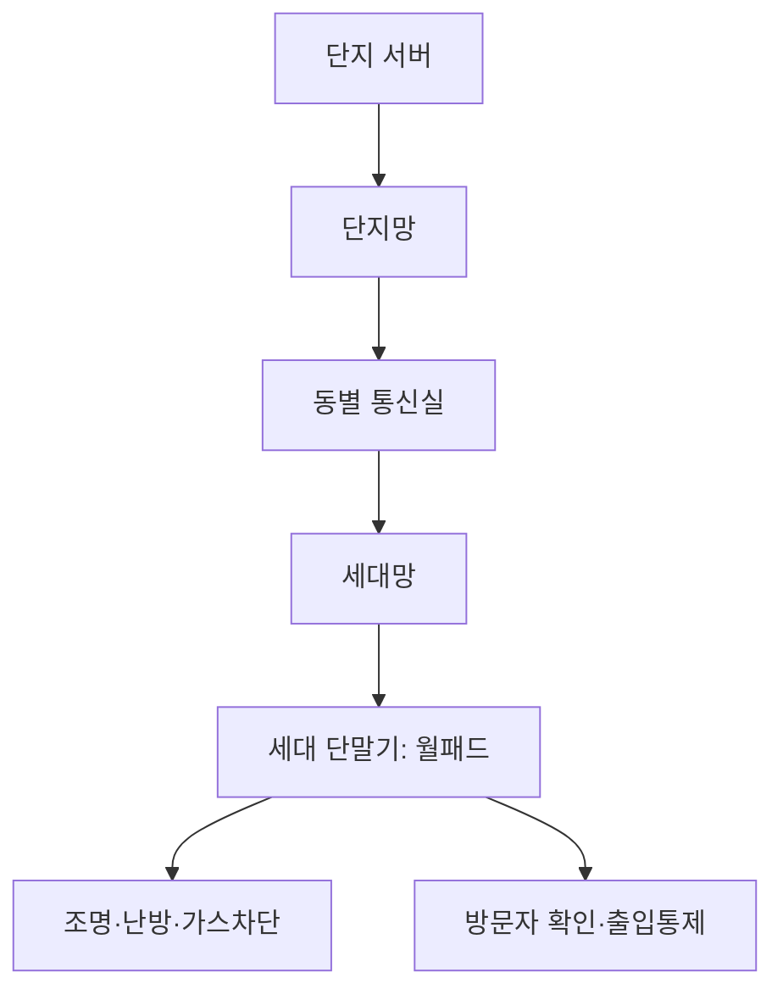

<Callout type="info">
  **이번 문서의 목표:** CCTV·IP카메라 시스템의 구성요소와 PoE(이더넷 전원공급) 전력 예산을 직접 계산하고, 영상회의 시스템에 필요한 대역폭을 산정하며, VR·AR·MR을 통신 요구사항 기준으로 구분하고, 홈네트워크의 보안요소와 교환기기의 신호방식·교환방식을 설명할 수 있게 된다.
</Callout>

## 이 편이 다루는 범위

12·13편에서 인입선 끝에 물리는 단말기기와 통신장비를 살펴봤다면, 이 편은 그중에서도 **영상**을 다루는 설비(CCTV·영상회의·방송 단말), 눈앞 현실에 정보를 겹쳐 보여주는 **융복합 단말**(VR·AR·MR), 집 안 전체를 하나의 통신망으로 묶는 **홈네트워크 설비**, 그리고 통화·데이터가 오갈 경로를 실제로 연결해 주는 **교환기기**까지 네 가지 설비군을 다룹니다.

> **쉽게 말하면:** 13편이 인입선 끝의 전화기·이동통신 단말 이야기였다면, 이 편은 그 옆에 나란히 설치되는 카메라·홈네트워크 기기·교환기 이야기입니다.

## 1. 영상정보처리기기 — CCTV·IP카메라·PoE

### 왜 필요한가

건물이나 거리에 설치된 감시 카메라는 예전에는 아날로그 신호를 동축케이블로 전송해 녹화기에 저장하는 방식이 전부였습니다. 그런데 이 방식은 화질이 낮고, 카메라 한 대마다 전용 영상선과 별도의 전원선을 각각 끌어야 해 배선 비용이 큽니다. 네트워크 기술이 발전하면서 이 문제를 해결한 것이 **IP카메라**(Internet Protocol camera)와 **PoE**(Power over Ethernet, 이더넷 전원공급) 기술입니다.

> **쉽게 말하면:** 예전 CCTV는 카메라마다 영상선과 전원선을 따로 끌어야 하는 두 가닥짜리 배선이었다면, IP카메라와 PoE를 함께 쓰면 랜케이블 한 가닥으로 영상 데이터와 전기까지 동시에 보낼 수 있습니다.

### 정의 — CCTV 시스템의 구성요소

**CCTV**(Closed-Circuit TeleVision, 폐쇄회로텔레비전)는 특정 장소를 촬영해 지정된 모니터·저장장치로만 영상을 전달하는 감시 시스템입니다. 일반 방송(broadcast)이 불특정 다수에게 신호를 뿌리는 것과 달리, "닫힌 회로"라는 이름처럼 정해진 수신처에만 영상이 전달된다는 뜻입니다. 시스템은 크게 카메라, 저장장치, 모니터, 그리고 이들을 잇는 네트워크로 구성됩니다.

카메라는 신호 방식에 따라 두 갈래로 나뉩니다.

| 구분 | 아날로그 카메라 | IP카메라 |
|---|---|---|
| 신호 형태 | 아날로그 영상 신호 | 디지털 신호(네트워크 패킷) |
| 전송 매체 | 동축케이블 | 랜케이블(이더넷) |
| 전원 공급 | 별도의 전원선 필요 | PoE로 데이터선과 통합 가능 |
| 저장장치 | DVR(Digital Video Recorder, 디지털 영상 녹화기) | NVR(Network Video Recorder, 네트워크 영상 녹화기) |
| 화질·확장성 | 상대적으로 낮음, 배선 늘리기 번거로움 | 고화질 지원, 네트워크만 있으면 카메라 추가 용이 |

**DVR**은 아날로그 카메라가 보낸 영상 신호를 받아 디지털로 변환한 뒤 저장하는 장치이고, **NVR**은 IP카메라가 이미 디지털로 압축해 보낸 영상 데이터를 네트워크를 통해 받아 그대로 저장하는 장치입니다. NVR은 영상을 다시 디지털로 변환하는 과정이 없어 DVR보다 구조가 단순하고, 카메라 위치에 구애받지 않고 네트워크가 닿는 곳이면 어디든 설치할 수 있다는 장점이 있습니다.

### PoE — 랜케이블 하나로 데이터와 전력을 함께

**PoE**(Power over Ethernet)는 이더넷 랜케이블 안의 사용하지 않는 도선(또는 데이터를 실어 나르는 도선 자체)에 직류 전력을 함께 실어, 별도의 전원선 없이 IP카메라 같은 장치에 전력을 공급하는 기술입니다. IEEE(전기전자기술자협회)가 표준화했으며, 표준이 개정될 때마다 공급 가능한 전력량이 늘었습니다.

| 표준 | 별칭 | 스위치가 보내는 최대 전력 | 케이블 손실을 뺀 기기 수신 전력 |
|---|---|---|---|
| IEEE 802.3af | PoE | 15.4W | 12.95W |
| IEEE 802.3at | PoE+ | 30W | 25.5W |
| IEEE 802.3bt Type 3 | PoE++ | 60W | 51W |
| IEEE 802.3bt Type 4 | PoE++ | 100W | 71.3W |

**자주 틀리는 점:** 스위치가 "보내는" 전력과 기기가 실제로 "받는" 전력을 같은 숫자로 착각하는 경우가 많습니다. 랜케이블 자체의 저항 때문에 전력 일부가 열로 손실되므로, 표에서 보듯 802.3at 기준으로 스위치는 30W를 밀어내지만 카메라가 실제로 쓸 수 있는 전력은 25.5W로 줄어듭니다. 전력 예산을 계산할 때는 반드시 **기기 수신 전력** 기준으로 따져야 합니다.

### 계산 — PoE 스위치 하나로 몇 대의 카메라를 감당할 수 있는가

정격 전력 예산(전체 포트에 나눠 줄 수 있는 전력의 총합)이 **400W**인 PoE 스위치가 있고, 여기에 802.3at(PoE+) 표준으로 대당 **25W**를 소비하는 IP카메라를 연결한다고 합시다.

$$
\text{동시 가동 가능 대수} = \frac{400\text{W}}{25\text{W}} = 16\text{대}
$$

- $400\text{W}$: 스위치 전체가 여러 포트에 나눠 줄 수 있는 전력의 총합(전력 예산)
- $25\text{W}$: IP카메라 한 대가 실제로 소비하는 전력

**해석:** 이 스위치는 이론상 최대 16대의 카메라를 동시에 가동할 수 있습니다. 만약 스위치의 물리적인 포트 수가 24개라면, 16대까지는 정상 가동되지만 17번째 카메라를 연결하는 순간 전력 예산을 초과해 일부 카메라가 켜지지 않거나 스위치가 저전력 모드로 그 포트를 차단할 수 있습니다.

**자주 틀리는 점:** 포트 수만 보고 "포트가 24개니까 카메라도 24대까지 연결된다"고 판단하면 안 됩니다. 포트 수는 물리적으로 꽂을 수 있는 케이블 개수일 뿐이고, 실제 동시 가동 가능 대수는 **전력 예산 ÷ 기기당 소비전력**으로 별도로 계산해야 합니다.

### 영상 저장·인식 방식

저장 방식은 항상 촬영하는 상시녹화와, 움직임이 감지될 때만 저장 공간을 아끼는 이벤트 녹화(모션 감지, motion detection)로 나뉩니다. 영상인식 방식으로는 사람 얼굴을 구별하는 얼굴인식, 자동차 번호판 문자를 읽어내는 번호판 인식(ANPR, Automatic Number Plate Recognition) 등이 있으며, 이런 인식 기능은 카메라 자체(엣지 디바이스)에서 처리하기도 하고 서버로 영상을 보내 처리하기도 합니다.

## 2. 영상회의 시스템과 방송 단말

### 영상회의 시스템의 구성요소

영상회의(video conferencing) 시스템은 카메라·마이크로 사람의 음성과 영상을 잡아 압축한 뒤 상대방에게 전달하고, 반대로 받은 데이터를 다시 화면·스피커로 재생하는 양방향 실시간 통신 시스템입니다. 핵심 구성요소는 다음과 같습니다.

- **코덱**(codec, coder-decoder): 영상·음성을 압축(인코딩)하고 상대편에서 다시 복원(디코딩)하는 장치·소프트웨어. 대표 영상 압축 표준은 **H.264**와 그 후속인 **H.265**(HEVC, High Efficiency Video Coding)로, H.265는 같은 화질을 H.264 대비 절반 정도의 데이터양으로 표현할 수 있습니다.
- **MCU**(Multipoint Control Unit, 다자간 제어장치): 세 명 이상이 참여하는 화상회의에서 여러 참가자의 영상·음성을 모아 합성해 각자에게 나눠 보내는 중계 장비.
- 신호 규격: **H.323**(초기 영상회의 국제표준, 여러 프로토콜을 묶은 패키지 형태)과 **SIP**(Session Initiation Protocol, 세션 개시 프로토콜, 오늘날 인터넷 전화·화상회의에서 더 널리 쓰이는 가벼운 표준)가 있습니다.

> **쉽게 말하면:** MCU는 여러 사람이 동시에 말하는 회의실에서, 각 사람의 목소리를 모아 다시 모두에게 들려주는 사회자 역할을 하는 장비입니다.

### 계산 — 참가자 수에 따른 필요 대역폭 산정

화질별로 실무에서 흔히 쓰이는 참고 비트레이트(bitrate, 초당 전송해야 하는 데이터양)는 대략 다음과 같습니다.

| 화질 | 참고 비트레이트 |
|---|---|
| 480p(SD급) | 약 0.5Mbps |
| 720p(HD급) | 약 1.5Mbps |
| 1080p(풀HD급) | 약 3Mbps |

4명이 참여하는 화상회의에서 각자 1080p 화질로 영상을 송출한다고 하면, 전체 대역폭 요구량은 다음과 같습니다.

$$
\text{필요 대역폭} = 4\text{명} \times 3\text{Mbps} = 12\text{Mbps}
$$

**해석:** 이 값은 각 참가자가 자신의 영상을 내보내는 데 필요한 업로드 대역폭의 합입니다. 실제로는 MCU가 다른 참가자들의 영상까지 받아서 봐야 하므로 다운로드 대역폭도 별도로 확보해야 하고, 여기에 오디오·제어 신호까지 더해지므로 실무에서는 계산값에 여유율(대개 20~30퍼센트)을 더해 회선을 설계합니다.

### 방송 단말

방송 단말은 TV·라디오처럼 오래된 매체부터 **DMB**(Digital Multimedia Broadcasting, 디지털 멀티미디어 방송)처럼 이동 중에도 방송을 수신하도록 설계된 매체까지 포함합니다. DMB는 지상의 송신탑을 이용하는 지상파 DMB와, 위성을 이용하는 위성 DMB로 나뉘며, 둘 다 좁은 대역에 여러 채널을 압축해 전송하는 디지털 압축 기술을 기반으로 합니다.

## 3. 융복합 단말기기 — VR·AR·MR

### 왜 필요한가

카메라와 화면이 단순히 영상을 "보여주는" 역할을 넘어, 사용자의 시야 전체를 대체하거나 현실 위에 새로운 정보를 겹쳐 보여주는 기기들이 등장했습니다. 이런 실감형 단말기기는 화면이 조금만 늦게 반응해도 사용자가 어지러움(멀미)을 느끼기 때문에, 일반 영상 스트리밍보다 훨씬 엄격한 지연 요구사항을 가집니다.

### 정의와 비교

| 구분 | 정의 | 특징 |
|---|---|---|
| VR(Virtual Reality, 가상현실) | 현실을 완전히 차단하고 컴퓨터가 만든 가상 공간만 보여줌 | 몰입도가 가장 높지만 주변 현실을 볼 수 없음 |
| AR(Augmented Reality, 증강현실) | 현실 화면 위에 가상의 정보(글자·그래픽)를 겹쳐 보여줌 | 현실을 유지한 채 부가 정보만 추가, 스마트폰 카메라 앱 등에서 흔히 사용 |
| MR(Mixed Reality, 혼합현실) | 현실과 가상 객체가 서로 위치·움직임을 인식하며 상호작용함 | 가상 객체가 실제 책상 위에 놓인 것처럼 동작하는 등 AR보다 더 깊은 상호작용 |

> **쉽게 말하면:** VR은 눈을 완전히 다른 세상으로 가리는 안대이고, AR은 투명한 유리에 정보를 띄우는 것이고, MR은 그 정보가 실제 방의 가구를 알아보고 피해 다니는 수준까지 발전한 것입니다.

### 통신 요구사항 — 모션-투-포톤 지연

VR·AR·MR 기기는 사용자가 고개를 돌리는 움직임을 센서가 감지한 뒤, 그에 맞는 새 화면을 계산해 렌즈에 표시하기까지 걸리는 시간인 **모션-투-포톤 지연**(motion-to-photon latency)이 특히 중요합니다. 이 지연이 크면 사람의 눈과 균형 감각이 서로 다른 정보를 받아들여 멀미를 느끼게 됩니다. 업계에서는 대체로 **20밀리초 이내**를 편안하게 사용할 수 있는 권장 기준으로 제시합니다. 13편에서 다룬 5G의 **URLLC**(초신뢰·저지연 통신) 시나리오가 이런 실감형 콘텐츠의 무선 스트리밍을 지원하는 배경이 여기에 있습니다.

**자주 틀리는 점:** VR·AR·MR을 "화질이 높을수록 좋은 기기"로만 이해하면 안 됩니다. 실제 사용자 경험을 좌우하는 것은 화질보다 **지연시간**인 경우가 많으며, 이 때문에 실감형 단말은 대역폭뿐 아니라 저지연 네트워크 환경을 함께 요구합니다.

## 4. 홈네트워크 설비 — 단말·보안요소·스마트 미디어기기

### 홈네트워크 단말과 망 구조

아파트 같은 공동주택의 홈네트워크는 크게 두 단계의 망으로 나뉩니다. **단지망**(complex network)은 단지 전체(여러 동)를 하나로 묶는 상위 네트워크이고, **세대망**(home network)은 각 가정 내부의 기기들을 연결하는 하위 네트워크입니다. 이 두 망을 잇는 지점에 **세대 단말기**(주로 월패드, wall pad)가 놓여, 조명·난방·가스 차단·방문자 확인 같은 기능을 통합해서 제어합니다.

### 홈네트워크 보안요소

홈네트워크는 개인의 생활 정보(누가 언제 문을 열었는지, 실내 온도 설정 등)를 다루므로, 다음과 같은 보안요소를 갖춰야 합니다.

| 보안요소 | 의미 |
|---|---|
| 데이터 기밀성(confidentiality) | 허가받지 않은 사람이 데이터 내용을 알아볼 수 없게 함(암호화) |
| 데이터 무결성(integrity) | 전송 중 데이터가 중간에 몰래 바뀌지 않았음을 보장 |
| 인증(authentication) | 접속한 기기·사용자가 실제로 정당한 대상인지 확인 |
| 접근통제(access control) | 인증된 사용자라도 허용된 범위의 기능·정보에만 접근하도록 제한 |
| 전송데이터 보안 | 세대망과 단지망을 오가는 데이터 자체를 보호하는 종합적인 조치 |

**자주 틀리는 점:** 기밀성과 무결성을 같은 개념으로 혼동하는 경우가 흔합니다. 기밀성은 "내용을 못 보게" 막는 것이고, 무결성은 "내용이 바뀌지 않았음"을 보장하는 것입니다. 예를 들어 누군가 데이터를 훔쳐보지는 못해도 중간에 값을 조작할 수 있다면 기밀성은 지켜졌지만 무결성은 깨진 상태입니다.

### 스마트 미디어기기

홈네트워크 구축공사에는 웨어러블 스마트기기(스마트워치 등), 가정용 스마트기기(스마트 스피커·스마트 조명), 산업용 스마트기기, 그리고 주차관제·빌딩안내 같은 공용 설비까지 포함됩니다. 이들 기기는 대부분 앞서 13편에서 다룬 IoT 무선 통신 기술(Zigbee, BLE, Wi-Fi 등)로 세대망 또는 단지망에 연결됩니다.

## 5. 교환기기 — 신호방식과 교환방식

### 신호방식 — CAS와 CCS

전화망에서 "누가 누구에게 전화를 걸었는가", "통화를 끊었는가" 같은 제어 정보를 주고받는 방식을 **신호방식**(signaling)이라 합니다. 신호방식은 이 제어 정보를 실제 통화 채널과 함께 보내는지, 따로 보내는지에 따라 두 가지로 나뉩니다.

| 구분 | CAS(채널연관신호방식) | CCS(공통선신호방식) |
|---|---|---|
| 영문 | Channel Associated Signaling | Common Channel Signaling |
| 신호 전달 방식 | 각 통화 채널 자체에 신호 정보를 함께 실어 보냄 | 여러 통화 채널의 신호 정보를 하나의 전용 채널로 모아 전송 |
| 대표 사례 | 초기 디지털 전화망의 타임슬롯 내 신호 비트 | SS7(Signaling System No.7, 7번 신호방식) |
| 특징 | 채널 수만큼 신호 처리도 개별적으로 필요 | 신호 채널이 분리되어 전송 속도가 빠르고 발신자표시 등 부가서비스 구현이 유연함 |

> **쉽게 말하면:** CAS는 편지 봉투 안에 주소와 편지 내용을 함께 넣어 보내는 방식이고, CCS는 모든 편지의 주소 정보만 따로 모아 전용 택배로 먼저 보내고, 편지 내용물은 각자의 봉투로 뒤따라 보내는 방식입니다.

**자주 틀리는 점:** CCS를 "신호를 아예 안 보내는 방식"으로 오해하면 안 됩니다. CCS도 신호 정보를 반드시 전송하지만, **통화 채널과 물리적으로 분리된 전용 채널 하나로 모아서** 전송한다는 점이 CAS와의 차이입니다.

### 교환방식 — 회선교환·패킷교환과 교환기 내부 동작

05편에서 다룬 회선교환(circuit switching)과 패킷교환(packet switching)의 구분은 교환기에도 그대로 적용됩니다. 회선교환 방식의 전화 교환기는 통화가 연결되는 동안 두 사람 사이에 전용 경로를 계속 유지하고, 패킷교환 방식의 교환장비(라우터 등)는 패킷 단위로 경로를 그때그때 정합니다.

교환기 내부에서 실제로 입력과 출력을 연결하는 동작 방식도 두 갈래로 나뉩니다.

- **공간분할교환**(space division switching): 입력 회선과 출력 회선을 물리적인 스위치 행렬(크로스바 구조)로 직접 연결하는 방식. 옛 아날로그 전화 교환기가 주로 이 방식을 썼습니다.
- **시분할교환**(time division switching): 디지털 신호를 아주 짧은 시간 단위(타임슬롯)로 쪼갠 뒤, 이 타임슬롯들의 순서를 바꿔치기해 원하는 출력 채널로 연결하는 방식. 오늘날의 디지털 교환기(TDM 교환기)가 이 방식을 씁니다.

> **쉽게 말하면:** 공간분할교환은 여러 개의 물리적인 전선을 직접 이어 붙이는 것이고, 시분할교환은 하나의 굵은 전선을 시간 단위로 쪼개 쓰면서 그 조각들의 순서를 바꿔 원하는 곳으로 배달하는 것입니다.

## 핵심 정리

- IP카메라·NVR 조합은 아날로그 카메라·DVR 조합보다 배선이 단순하고 확장이 쉬우며, PoE는 랜케이블 하나로 데이터와 전력을 함께 전달한다. 동시 가동 대수는 전력 예산 ÷ 기기당 소비전력으로 계산한다.
- 영상회의 시스템은 코덱(H.264·H.265)으로 영상을 압축하고 MCU로 다자간 신호를 중계하며, 필요 대역폭은 참가자 수 × 화질별 비트레이트로 어림 계산한다.
- VR(완전 가상)·AR(현실 위 정보 오버레이)·MR(현실과 가상의 상호작용)은 화질보다 모션-투-포톤 지연(권장 20밀리초 이내)이 사용자 경험을 좌우한다.
- 홈네트워크는 단지망과 세대망으로 구성되며, 기밀성·무결성·인증·접근통제 등 보안요소를 갖춰야 한다.
- 교환기기는 신호 정보를 통화 채널과 함께 보내는 CAS와 별도 채널로 모아 보내는 CCS(대표 SS7)로 신호방식을 구분하고, 내부적으로는 공간분할교환과 시분할교환 방식으로 채널을 연결한다.

## 마무리 복습

<Quiz
  questionNumber={1}
  question="PoE(Power over Ethernet) 스위치의 전력 예산이 400W이고 IP카메라 한 대가 25W를 소비할 때, 이론상 동시 가동 가능한 최대 카메라 대수는?"
  options={['10대', '14대', '16대', '20대']}
  correctAnswer={3}
  explanation="동시 가동 가능 대수는 전력 예산을 기기당 소비전력으로 나눈 값이다. 400W를 25W로 나누면 16대가 된다."
  optionExplanations={['400을 25가 아닌 40으로 나눈 값에 가까운 계산 착오다.', '802.3af 표준의 수신 전력 근처 값을 잘못 대입한 계산이다.', '400W를 25W로 정확히 나눈 값이다.', '400을 25가 아닌 20으로 나눈 값에 해당한다.']}
/>

<Quiz
  questionNumber={2}
  question="DVR과 NVR을 비교한 설명으로 가장 적절한 것은?"
  options={['DVR은 IP카메라의 디지털 신호를 네트워크로 직접 받아 저장한다', 'NVR은 아날로그 카메라의 신호를 받아 디지털로 변환한 뒤 저장한다', 'DVR은 아날로그 카메라의 영상 신호를 받아 디지털로 변환해 저장하는 장치다', 'DVR과 NVR은 저장 방식에 차이가 없어 서로 완전히 같은 장치다']}
  correctAnswer={3}
  explanation="DVR은 아날로그 카메라가 보낸 영상 신호를 받아 디지털로 변환한 뒤 저장하는 장치이며, NVR은 IP카메라가 이미 디지털로 압축해 보낸 데이터를 네트워크로 그대로 받아 저장하는 장치다."
  optionExplanations={['이 설명은 NVR에 해당하는 내용이다.', '이 설명은 DVR에 해당하는 내용으로 주어와 서술이 뒤바뀌었다.', 'DVR의 정의와 정확히 일치하는 설명이다.', '두 장치는 입력 신호 형태와 처리 과정이 서로 다르다.']}
/>

<Quiz
  questionNumber={3}
  question="4명이 참여하는 화상회의에서 각자 1080p(약 3Mbps) 화질로 영상을 송출할 때, 참가자 전체의 업로드 대역폭 요구량 합은?"
  options={['3Mbps', '6Mbps', '9Mbps', '12Mbps']}
  correctAnswer={4}
  explanation="참가자 수와 화질별 비트레이트를 곱해 계산한다. 4명 곱하기 3Mbps는 12Mbps다."
  optionExplanations={['참가자 한 명분의 비트레이트만 계산한 값이다.', '참가자를 2명으로 잘못 계산한 값이다.', '참가자를 3명으로 잘못 계산한 값이다.', '4명 곱하기 3Mbps를 정확히 계산한 값이다.']}
/>

<Quiz
  questionNumber={4}
  question="VR·AR·MR에 대한 설명으로 옳지 않은 것은?"
  options={['VR은 현실을 완전히 차단하고 가상 공간만 보여준다', 'AR은 현실 화면 위에 가상의 정보를 겹쳐 보여준다', 'MR은 가상 객체가 현실의 위치·움직임을 인식하며 상호작용한다', 'VR·AR·MR 모두 화질만 높으면 지연시간과 무관하게 편안한 사용 경험을 제공한다']}
  correctAnswer={4}
  explanation="VR·AR·MR 기기는 모션-투-포톤 지연이 크면 사용자가 멀미를 느끼므로, 화질보다 저지연이 편안한 사용 경험에 더 중요한 요소다."
  optionExplanations={['VR의 정의와 정확히 일치하는 설명이다.', 'AR의 정의와 정확히 일치하는 설명이다.', 'MR의 정의와 정확히 일치하는 설명이다.', '지연시간이 크면 화질과 무관하게 멀미가 발생할 수 있으므로 이 설명이 옳지 않다.']}
/>

<Quiz
  questionNumber={5}
  question="홈네트워크 보안요소 중 전송 중인 데이터가 중간에 몰래 바뀌지 않았음을 보장하는 요소는?"
  options={['데이터 기밀성', '데이터 무결성', '인증', '접근통제']}
  correctAnswer={2}
  explanation="데이터가 전송 중에 변조되지 않았음을 보장하는 요소는 무결성이며, 기밀성은 내용을 남이 볼 수 없게 막는 요소로 서로 구분된다."
  optionExplanations={['기밀성은 내용을 볼 수 없게 막는 요소이지 변조 여부를 보장하는 요소가 아니다.', '전송 중 데이터가 바뀌지 않았음을 보장한다는 정의와 정확히 일치한다.', '인증은 접속 주체가 정당한지 확인하는 요소다.', '접근통제는 허용된 범위의 기능에만 접근하도록 제한하는 요소다.']}
/>

<Quiz
  questionNumber={6}
  question="신호방식 중 CCS(공통선신호방식)에 대한 설명으로 가장 적절한 것은?"
  options={['각 통화 채널 자체에 신호 정보를 함께 실어 보낸다', '여러 통화 채널의 신호 정보를 하나의 전용 채널로 모아 전송하며 대표적으로 SS7이 있다', '신호 정보 자체를 아예 전송하지 않는 방식이다', '채널 수만큼 신호 처리를 개별적으로 수행해야 한다']}
  correctAnswer={2}
  explanation="CCS는 여러 통화 채널의 신호 정보를 통화 채널과 분리된 전용 채널 하나로 모아 전송하는 방식이며, 대표적인 표준이 SS7(7번 신호방식)이다."
  optionExplanations={['이 설명은 CAS(채널연관신호방식)에 해당한다.', 'CCS의 정의와 대표 사례를 정확히 설명하고 있다.', 'CCS도 신호 정보를 반드시 전송하며, 다만 통화 채널과 분리된 전용 채널로 모아 보낼 뿐이다.', '채널마다 개별적으로 신호를 처리하는 방식은 CAS의 특징이다.']}
/>

## 참고 자료

- [계명대학교 게시판 - 정보통신기사 출제기준(필기·실기) PDF (2026.1.1.~2028.12.31. 적용)](https://cms.kmu.ac.kr/bbs/computer/763/172569/download.do)
- [한국방송통신전파진흥원(KCA) - 출제기준 자료실](https://www.cq.or.kr/qh_cusgm10_001.do)
