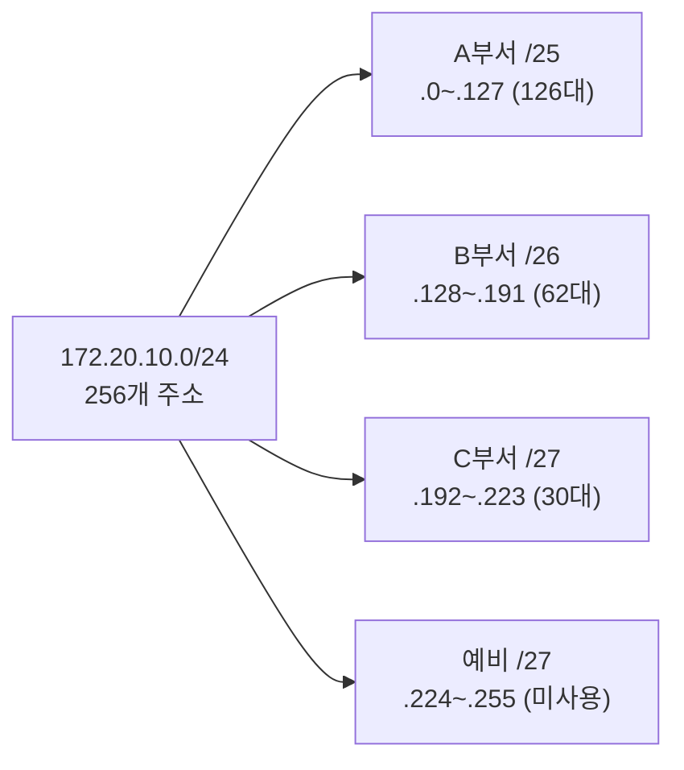
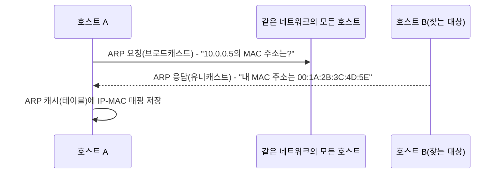
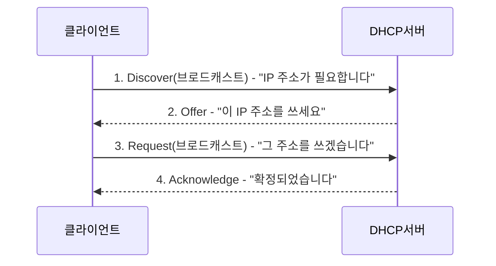

<Callout type="info">
  **이번 문서의 목표:** CIDR 표기와 서브넷마스크·호스트 수·네트워크 주소·브로드캐스트 주소를 비트 단위로 직접 계산하고, IPv6 주소를 축약·복원하며, ARP·ICMP·IGMP·DHCP가 각각 어떤 문제를 해결하는지, TCP·UDP와 포트 번호가 어떻게 쓰이는지, FTP·HTTP·SNMP 같은 응용계층 프로토콜이 무엇을 하는지 설명할 수 있게 된다.
</Callout>

## 이 편이 다루는 범위

05편에서 IP 주소가 32비트 숫자이고 클래스 A·B·C로 나뉜다는 것을, 15편에서 OSI 참조모델과 네트워크 설계 기준을 확인했습니다. 이 편은 그 지식을 실무 계산으로 확장합니다. 클래스 단위로만 주소를 나누면 낭비가 심하다는 문제를 해결하는 **서브네팅**부터, 주소가 부족해 128비트로 늘어난 **IPv6**, 그리고 IP 계층 위아래에서 실제로 기기들이 대화를 주고받는 데 쓰는 **프로토콜**들까지 한 편에서 다룹니다. 계산 문제는 중간 단계를 생략하지 않고 비트 하나하나까지 직접 풀어봅니다.

## 1. 인터넷(IP) 주소체계와 서브네팅

### 왜 클래스 단위로는 부족한가

05편에서 확인했듯 클래스 C 네트워크 하나는 호스트 254개까지만 수용합니다. 그런데 직원이 300명인 회사가 있다면 클래스 C 하나로는 부족해 클래스 B(호스트 65,534개 수용)를 받아야 하는데, 이러면 필요한 300개를 빼고 남는 65,000개가 넘는 주소가 통째로 낭비됩니다. 이 문제를 해결하기 위해 등장한 것이 **CIDR**(Classless Inter-Domain Routing, 클래스 없는 도메인 간 라우팅)입니다. CIDR은 클래스라는 고정된 경계에 얽매이지 않고, `/24`, `/20`, `/19`처럼 네트워크 부분의 비트 수를 **원하는 만큼 자유롭게** 정할 수 있게 해줍니다.

> **쉽게 말하면:** 클래스 방식이 옷을 스몰(S)·미디엄(M)·라지(L) 세 종류로만 파는 것이라면, CIDR은 치수를 1센티미터 단위로 정확히 맞춰 주는 맞춤 제작입니다.

### 계산 1 — CIDR 표기에서 서브넷마스크와 호스트 수 구하기

`10.20.0.0/20`이 주어졌을 때 서브넷마스크와 사용 가능한 호스트 수를 구해보겠습니다.

**1단계 — 접두사 20비트가 어느 옥텟까지 걸치는지 확인한다.** 첫째 옥텟(8비트) + 둘째 옥텟(8비트) = 16비트이고, 20 − 16 = 4비트가 셋째 옥텟에서 추가로 네트워크 부분에 쓰입니다.

**2단계 — 셋째 옥텟의 마스크를 비트로 만든다.** 앞 4비트를 `1`로, 나머지 4비트를 `0`으로 놓습니다.

```
셋째 옥텟 마스크: 11110000
```

이를 10진수로 바꾸면 128 + 64 + 32 + 16 = 240입니다. 따라서 전체 서브넷마스크는 `255.255.240.0`입니다.

**3단계 — 호스트 비트 수로 사용 가능한 호스트 수를 계산한다.** 전체 32비트에서 네트워크 부분 20비트를 뺀 12비트가 호스트 부분입니다.

$$
2^{12} - 2 = 4096 - 2 = 4094\text{개}
$$

- $2^{12}$: 호스트 비트 12개로 표현 가능한 전체 주소 개수
- $-2$: 네트워크 주소(호스트 전부 `0`)와 브로드캐스트 주소(호스트 전부 `1`)를 제외

**4단계 — 네트워크 주소와 브로드캐스트 주소를 확인한다.** 셋째 옥텟에서 네트워크 부분(앞 4비트)은 그대로 두고 호스트 부분(뒤 4비트)만 0 또는 1로 채웁니다.

```
네트워크 주소 셋째 옥텟: 0000 0000 = 0   → 네트워크 주소 10.20.0.0
브로드캐스트 셋째 옥텟:   0000 1111 = 15  → 브로드캐스트 주소 10.20.15.255
```

| 항목 | 값 |
|---|---|
| CIDR 표기 | 10.20.0.0/20 |
| 서브넷마스크 | 255.255.240.0 |
| 네트워크 주소 | 10.20.0.0 |
| 브로드캐스트 주소 | 10.20.15.255 |
| 사용 가능 호스트 수 | 4094개 |

### 계산 2 — VLSM으로 부서별 서브넷 나누기

`172.20.10.0/24` 네트워크 하나를 A부서(90대), B부서(40대), C부서(20대)에 필요한 만큼만 나눠주는 **VLSM**(Variable Length Subnet Mask, 가변 길이 서브넷 마스크)을 적용해보겠습니다. VLSM은 반드시 **요구량이 큰 부서부터** 순서대로 배정해야 남는 공간을 낭비 없이 씁니다.

**1단계 — 각 요구량에 맞는 최소 접두사를 찾는다.** 공식 $2^n - 2 \geq \text{요구 호스트 수}$를 만족하는 가장 작은 $n$을 구합니다.

| 부서 | 요구 호스트 수 | 만족하는 n | 실제 호스트 수 | 접두사 |
|---|---|---|---|---|
| A | 90 | $2^7-2=126$ (n=7) | 126 | /25 |
| B | 40 | $2^6-2=62$ (n=6) | 62 | /26 |
| C | 20 | $2^5-2=30$ (n=5) | 30 | /27 |

**2단계 — 큰 서브넷부터 순서대로 주소를 배정한다.**

```
전체:  172.20.10.0/24  (256개 주소)

A(/25, 128개 블록): 172.20.10.0   ~ 172.20.10.127
                    네트워크 .0, 브로드캐스트 .127, 호스트 .1~.126 (126개)

B(/26, 64개 블록):  172.20.10.128 ~ 172.20.10.191
                    네트워크 .128, 브로드캐스트 .191, 호스트 .129~.190 (62개)

C(/27, 32개 블록):  172.20.10.192 ~ 172.20.10.223
                    네트워크 .192, 브로드캐스트 .223, 호스트 .193~.222 (30개)

남는 공간(32개): 172.20.10.224 ~ 172.20.10.255  (향후 확장용 예비)
```

각 부서의 시작 주소는 바로 앞 부서의 브로드캐스트 주소 다음이며, 블록 크기(128, 64, 32)만큼씩 건너뛰며 이어 붙인 것입니다.



**자주 틀리는 점:** 요구량이 작은 부서부터 배정하면, 중간에 남은 공간의 크기가 다음 큰 부서가 필요로 하는 연속 블록과 맞지 않아 주소가 낭비되거나 재배치가 필요해집니다. 반드시 **큰 요구량부터** 순서대로 배정해야 합니다.

### 계산 3 — 옥텟 경계를 넘는 주소의 네트워크·브로드캐스트 구하기

`10.10.130.77/19`가 주어졌을 때 이 호스트가 속한 서브넷의 네트워크 주소와 브로드캐스트 주소를 구해보겠습니다.

**1단계 — 접두사가 걸치는 옥텟을 확인한다.** 첫째·둘째 옥텟(16비트) + 셋째 옥텟에서 3비트(16+3=19)가 네트워크 부분입니다. 즉 셋째 옥텟의 앞 3비트만 네트워크, 나머지 5비트와 넷째 옥텟 전체(5+8=13비트)가 호스트 부분입니다.

**2단계 — 셋째 옥텟 130을 이진수로 바꾼다.**

```
130 = 128 + 2 = 10000010
```

**3단계 — `/19` 마스크의 셋째 옥텟과 AND 연산한다.** 앞 3비트가 `1`인 마스크는 `11100000`(10진수 224)입니다.

```
130의 이진수:      10000010
셋째 옥텟 마스크:   11100000
AND 연산 결과:      10000000  = 128
```

네트워크 부분(앞 3비트 `100`)은 그대로 남고, 호스트 부분(뒤 5비트 `00010`)은 마스크의 `0`과 만나 전부 `0`으로 지워집니다. 넷째 옥텟도 호스트 부분이므로 전부 `0`이 되어, **네트워크 주소는 10.10.128.0**입니다.

**4단계 — 호스트 부분을 전부 `1`로 바꿔 브로드캐스트 주소를 구한다.**

```
네트워크 주소 셋째 옥텟:  10000000  (= 128)
호스트 비트를 1로:        10011111  (= 128+16+8+4+2+1 = 159)
```

넷째 옥텟은 `11111111` = 255이므로, **브로드캐스트 주소는 10.10.159.255**입니다.

**5단계 — 호스트 수와 소속 확인.** 호스트 부분 비트 수는 $32-19=13$비트이므로 호스트 수는 다음과 같습니다.

$$
2^{13} - 2 = 8192 - 2 = 8190\text{개}
$$

원래 주어진 130은 128–159 구간 안에 들어가므로, `10.10.130.77`이 이 서브넷(10.10.128.0–10.10.159.255)에 속한다는 것도 확인됩니다.

**자주 틀리는 점:** `/19`처럼 8의 배수가 아닌 접두사에서, 옥텟 하나를 통째로 기준으로 계산하지 않고 8비트 단위로만 어림잡아 네트워크 주소를 `10.10.0.0`이나 `10.10.130.0`처럼 잘못 구하는 실수가 흔합니다. 반드시 접두사가 걸치는 옥텟 안에서 정확히 몇 비트가 네트워크 부분인지 확인하고, 그 옥텟만 AND 연산해야 합니다. (VLSM과 옥텟 경계 계산을 더 연습하려면 독학사 컴퓨터네트워크 13편의 추가 예제도 참고할 수 있습니다.)

### IPv6 주소 축약 — 손으로 직접 줄여보기

주소 공간이 부족한 IPv4의 한계를 근본적으로 해결한 것이 128비트 길이의 **IPv6**(Internet Protocol version 6)입니다. 16비트씩 8묶음을 16진수로 표기하며, 두 가지 규칙으로 축약합니다. **규칙 1**은 각 묶음의 앞자리 `0`을 생략하는 것이고, **규칙 2**는 연속된 `0`으로만 이루어진 묶음들을 `::`(더블 콜론) 하나로 압축하되 **주소 하나에 단 한 번만** 쓰는 것입니다. 이때 압축 가능한 구간이 여러 곳에 흩어져 있다면, 그중 **연속된 길이가 가장 긴 구간**만 압축 대상으로 고릅니다.

**예제 — 다음 주소를 축약해보겠습니다.**

```
2001:0db8:0000:0042:0000:0000:0000:8a2e
```

**1단계 — 각 묶음의 앞자리 0을 생략한다.**

```
2001:db8:0:42:0:0:0:8a2e
```

**2단계 — 연속된 0 묶음 중 가장 긴 구간만 압축한다.** 이 주소에는 0으로만 된 묶음이 두 군데 있습니다. 넷째 자리 뒤(다섯째 자리) 하나는 단독으로 떨어져 있고, 그 뒤로 다섯째·여섯째·일곱째 세 묶음이 연속으로 이어져 있습니다.

```
2001 : db8 : 0 : 42 : [0 : 0 : 0] : 8a2e
                ^독립     ^^^^^^^^^연속 3개(가장 긴 구간)
```

연속 3개짜리 구간만 `::`로 압축하고, 독립된 `0`(넷째 다음 자리)은 그대로 남깁니다.

```
최종 축약: 2001:db8:0:42::8a2e
```

**자주 틀리는 점:** 이 예제에서 독립된 `0` 하나까지 `::`에 욕심내어 함께 묶어버리면 `2001:db8::42::8a2e`처럼 `::`가 두 번 나오는 잘못된 표기가 됩니다. `::`는 한 주소에 **정확히 한 번만** 쓸 수 있으므로, 여러 구간 중 **가장 긴 연속 구간 하나만** 골라 압축하고 나머지 `0`은 그대로 적어야 합니다.

**반대 방향 — 축약된 주소를 원래 형태로 복원하기.** `2001:db8::1:0:0:1`이 주어졌다면, `::` 앞뒤에 적힌 묶음 수를 셉니다. 앞쪽에 `2001`, `db8` 2개, 뒤쪽에 `1`, `0`, `0`, `1` 4개, 합쳐서 6개가 명시되어 있습니다. 전체는 8묶음이어야 하므로 8 − 6 = 2개의 `0` 묶음이 `::` 자리에 숨어 있었던 것입니다.

```
복원: 2001:db8:0000:0000:1:0:0:1
```

## 2. ARP·ICMP·IGMP와 IP 주소 자원관리(DHCP)

### ARP — IP 주소를 MAC 주소로 바꾸는 통역사

15편에서 확인했듯 IP 주소는 네트워크 계층의 논리 주소이고 MAC 주소는 데이터링크 계층의 물리 주소입니다. 그런데 실제로 프레임을 같은 네트워크 안에서 전달하려면 결국 **MAC 주소**가 필요합니다. 이때 "이 IP 주소를 가진 장치의 MAC 주소가 무엇인가"를 알아내는 프로토콜이 **ARP**(Address Resolution Protocol, 주소 결정 프로토콜)입니다.



ARP 요청은 네트워크 안의 모든 장치에게 뿌리는 **브로드캐스트**로 보내지만, 응답은 요청한 장치에게만 돌아가는 **유니캐스트**입니다. 한 번 알아낸 IP-MAC 대응 관계는 **ARP 캐시**(ARP cache, ARP 테이블)에 잠시 저장해두고 재사용하므로, 같은 상대와 반복 통신할 때마다 매번 ARP 요청을 새로 보내지는 않습니다.

**자주 틀리는 점:** ARP를 "IP 주소를 새로 만들어주는 프로토콜"로 착각하는 경우가 있습니다. ARP는 주소를 새로 발급하는 것이 아니라, 이미 정해진 IP 주소에 대응하는 MAC 주소를 **찾아주는(결정하는)** 역할만 합니다.

### ICMP — 오류를 알리고 상태를 확인하는 메시지

**ICMP**(Internet Control Message Protocol, 인터넷 제어 메시지 프로토콜)는 IP 통신 중 발생한 오류나 상태를 알리기 위한 메시지를 전달하는 프로토콜입니다. 대표적인 메시지 종류는 다음과 같습니다.

| 메시지 종류 | 의미 |
|---|---|
| Echo Request/Reply | 상대가 살아있는지 확인(우리가 흔히 쓰는 ping 명령의 동작 원리) |
| Destination Unreachable | 목적지에 도달할 수 없음을 알림 |
| Time Exceeded | 패킷의 TTL(Time To Live, 생존 시간)이 0이 되어 중간에 폐기되었음을 알림 |

**Time Exceeded 메시지의 활용 — traceroute 원리:** IP 패킷에는 TTL이라는 숫자가 들어 있어, 라우터를 하나 거칠 때마다 1씩 줄어들다가 0이 되면 그 패킷은 폐기되고 폐기한 라우터가 발신자에게 ICMP Time Exceeded 메시지를 보냅니다. `traceroute`(경로 추적) 명령은 이 원리를 역이용해, 처음에는 TTL을 1로 설정한 패킷을 보내 **첫 번째** 라우터의 응답을 받고, 다음에는 TTL을 2로 보내 **두 번째** 라우터의 응답을 받는 식으로 TTL을 하나씩 늘려가며 목적지까지의 경로를 한 홉(hop, 경유 구간)씩 알아냅니다.

> **쉽게 말하면:** TTL은 "이 편지가 몇 번 우체국을 거칠 수 있는지"를 적은 숫자이고, traceroute는 이 숫자를 1, 2, 3으로 하나씩 늘려가며 "몇 번째 우체국에서 편지가 멈췄는지"를 순서대로 물어 전체 경로를 알아내는 방법입니다.

### IGMP — 멀티캐스트 그룹 관리

**IGMP**(Internet Group Management Protocol, 인터넷 그룹 관리 프로토콜)는 05편에서 언급한 멀티캐스트(하나의 송신자가 특정 그룹에 속한 여러 수신자에게 동시에 전송하는 방식) 주소를 쓰는 호스트가, 자신이 속한 라우터에게 "나는 이 멀티캐스트 그룹에 가입하고 싶다" 또는 "이 그룹에서 탈퇴하겠다"를 알리는 데 쓰입니다. 라우터는 IGMP로 파악한 가입 정보를 바탕으로, 그 멀티캐스트 그룹에 속한 호스트가 있는 방향으로만 데이터를 전달해 불필요한 트래픽을 줄입니다.

### DHCP — IP 주소를 자동으로 나눠주는 서비스

**DHCP**(Dynamic Host Configuration Protocol, 동적 호스트 구성 프로토콜)는 새로 네트워크에 연결된 기기에게 IP 주소·서브넷마스크·기본 게이트웨이 주소 등을 자동으로 나눠주는 프로토콜입니다. IP 주소를 관리자가 일일이 손으로 입력하는 **정적 할당**(static allocation)과 달리, DHCP를 쓰는 **동적 할당**(dynamic allocation)은 기기가 네트워크에 연결되기만 하면 필요한 설정값을 자동으로 받습니다.

DHCP는 다음 네 단계, 흔히 **DORA**(Discover-Offer-Request-Acknowledge)라 부르는 과정을 거칩니다.



DHCP 서버가 나눠준 IP 주소는 영구히 그 기기의 것이 아니라 **임대**(lease)된 것으로, 정해진 **임대 시간**(lease time)이 지나면 갱신하거나 반납해야 합니다. 노트북을 켤 때마다 다른 IP 주소를 받을 수 있는 이유가 바로 이 임대 방식 때문입니다.

**자주 틀리는 점:** DORA의 순서를 헷갈리는 경우가 많습니다. 클라이언트가 먼저 "필요하다"고 알리는 것이 Discover, 서버가 "이걸 쓰라"고 제안하는 것이 Offer, 클라이언트가 그 제안을 "받아들이겠다"고 확인 요청하는 것이 Request, 서버가 최종적으로 "확정한다"고 알리는 것이 Acknowledge입니다. Discover와 Request 둘 다 브로드캐스트로 나간다는 점도 함께 기억해 둘 필요가 있습니다(네트워크에 DHCP 서버가 여러 대 있을 수 있어, 클라이언트는 누구의 제안을 받아들였는지를 모두에게 알려야 하기 때문입니다).

## 3. 전달계층 프로토콜(TCP·UDP)과 포트 주소

### TCP와 UDP — 신뢰성과 속도의 트레이드오프

전송 계층(15편 OSI 요약 참고)에서 대표적으로 쓰이는 두 프로토콜은 성격이 정반대입니다.

| 구분 | TCP(Transmission Control Protocol) | UDP(User Datagram Protocol) |
|---|---|---|
| 연결 방식 | 연결지향형(연결을 먼저 맺은 뒤 통신) | 비연결형(연결 절차 없이 바로 전송) |
| 신뢰성 | 순서제어·재전송·흐름제어·혼잡제어로 데이터 도착을 보장 | 보장하지 않음(가는 대로 보내고 끝) |
| 속도·오버헤드 | 신뢰성 확보 절차 때문에 상대적으로 느림 | 확인 절차가 없어 빠름 |
| 대표 활용 | 웹(HTTP), 파일 전송(FTP), 이메일(SMTP) | DNS 질의, 실시간 스트리밍, VoIP(13편) |

TCP는 통신을 시작하기 전에 **3-way handshake**(3방향 연결 설정)라는 절차로 먼저 연결을 맺습니다. 발신자가 연결을 요청하는 SYN(synchronize)을 보내면, 수신자는 요청을 받아들인다는 뜻과 자신도 연결을 요청한다는 뜻을 합친 SYN-ACK로 응답하고, 발신자가 마지막으로 확인 응답 ACK(acknowledge)를 보내면 연결이 완성됩니다. 이 절차와 이후의 순서제어·재전송·흐름제어·혼잡제어 같은 세부 동작은 독학사 컴퓨터네트워크 17~19편에서 이미 깊게 다뤘으므로, 이 편에서는 "TCP는 신뢰성을 보장하는 대신 느리고, UDP는 신뢰성을 포기하는 대신 빠르다"는 트레이드오프만 명확히 기억해두면 충분합니다.

**자주 틀리는 점:** UDP를 "아무 짝에도 쓸모없는 부실한 프로토콜"로 오해하는 경우가 있습니다. 실시간 음성·영상 통화에서는 지연된 패킷 하나를 재전송받느라 기다리는 것보다, 손실은 감수하더라도 계속 새 데이터를 받는 편이 체감 품질이 낫습니다. 이런 상황에서는 UDP의 빠른 속도가 TCP의 신뢰성보다 더 중요한 가치가 됩니다.

### 포트 번호 — 같은 IP 안에서 프로그램을 구분하는 번호

05편에서 확인했듯 IP 주소는 기기까지만 식별하고, 그 기기 안의 어떤 프로그램인지는 **포트**(port) 번호가 구분합니다. 포트 번호는 0부터 65535까지이며, 용도에 따라 세 구간으로 나뉩니다.

| 구간 | 범위 | 용도 |
|---|---|---|
| 잘 알려진 포트(well-known port) | 0–1023 | 표준화된 대표 서비스가 고정으로 사용 |
| 등록된 포트(registered port) | 1024–49151 | 특정 응용프로그램이 등록해 사용 |
| 동적·사설 포트(dynamic/private port) | 49152–65535 | 클라이언트가 통신할 때 임시로 사용 |

| 포트 번호 | 프로토콜 |
|---|---|
| 20, 21 | FTP(데이터, 제어) |
| 25 | SMTP |
| 53 | DNS |
| 67, 68 | DHCP |
| 80 | HTTP |
| 110 | POP3 |
| 161, 162 | SNMP(질의, 트랩) |
| 443 | HTTPS |

**IP 주소와 포트 번호를 합친 것**을 **소켓**(socket)이라 부르며, 통신은 결국 "발신지 소켓 ↔ 수신지 소켓" 한 쌍으로 이루어집니다.

## 4. 응용계층 프로토콜 — FTP·HTTP·POP3·SMTP·SNMP·TMS·CMS

### FTP — 파일을 주고받는 프로토콜

**FTP**(File Transfer Protocol, 파일 전송 프로토콜)는 파일을 올리고 내려받기 위한 프로토콜로, 특이하게 **두 개의 연결**을 씁니다. 하나는 "이 파일을 받고 싶다" 같은 명령을 주고받는 **제어 연결**(포트 21)이고, 다른 하나는 실제 파일 데이터가 오가는 **데이터 연결**입니다.

- **능동 모드**(active mode): 서버가 클라이언트 쪽으로 포트 20번을 이용해 데이터 연결을 직접 시작
- **수동 모드**(passive mode): 서버가 임의의 포트를 알려주면 클라이언트가 그 포트로 데이터 연결을 시작(방화벽 뒤의 클라이언트 환경에서 흔히 사용)

### HTTP — 웹의 언어

**HTTP**(HyperText Transfer Protocol, 하이퍼텍스트 전송 프로토콜)는 웹 브라우저(클라이언트)가 웹 서버에게 페이지를 요청하고 응답받는 데 쓰는 프로토콜입니다. GET(조회 요청), POST(데이터 제출) 같은 메서드로 요청 종류를 구분하며, 기본적으로 **상태를 기억하지 않는**(stateless) 방식이라 매 요청이 서로 독립적으로 처리됩니다. 여기에 암호화(TLS)를 더한 것이 **HTTPS**입니다.

### 메일 프로토콜 — SMTP와 POP3

메일을 **보낼 때**와 **받을 때** 쓰는 프로토콜이 다릅니다. **SMTP**(Simple Mail Transfer Protocol, 간이 메일 전송 프로토콜)는 메일을 발송할 때 쓰이고, **POP3**(Post Office Protocol version 3, 우체국 프로토콜 3판)는 사용자가 자신의 메일함에서 메일을 받아올 때 쓰입니다. POP3는 기본적으로 메일을 받아온 뒤 서버에서 그 메일을 **삭제**하는 방식이라, 여러 기기에서 같은 메일함을 확인하면 나중에 접속한 기기에서는 이미 받아간 메일이 보이지 않을 수 있습니다. (여러 기기에서 서버의 메일 상태를 동기화하며 보는 IMAP이라는 대안도 실무에서 널리 쓰입니다.)

### SNMP — 네트워크 장비를 원격으로 관리하는 프로토콜

**SNMP**(Simple Network Management Protocol, 간이 망 관리 프로토콜)는 스위치·라우터 같은 네트워크 장비의 상태를 원격에서 조회하고 설정하는 프로토콜입니다. 구조는 관리하는 쪽인 **매니저**(manager)와 관리당하는 장비에 설치된 **에이전트**(agent), 그리고 그 장비가 어떤 정보를 제공하는지 정의해둔 **MIB**(Management Information Base, 관리 정보 베이스)로 이루어집니다.

- 매니저가 에이전트에게 상태를 물어보는 요청은 주로 **161번 포트**를 사용합니다.
- 에이전트가 장애·이상 상황을 매니저에게 먼저 알리는 **트랩**(trap) 메시지는 **162번 포트**를 사용합니다.

> **쉽게 말하면:** 매니저가 "지금 몇 도예요" 하고 물어보면 에이전트가 161번 포트로 답하고, 에이전트가 갑자기 "불이야" 하고 먼저 소리치는 것이 162번 포트로 가는 트랩입니다.

### TMS·CMS — 망관리 시스템을 이루는 기능 조각

**TMS**(Traffic Management System, 트래픽관리시스템)와 **CMS**(Configuration Management System, 형상관리시스템)는 SNMP 같은 프로토콜로 수집한 정보를 바탕으로 실제 네트워크를 관리하는 소프트웨어 시스템을 가리키는 이름입니다. 이 둘은 국제 표준(ITU-T M.3400)이 정의한 망관리의 다섯 가지 기능 분류, 흔히 **FCAPS**(Fault·Configuration·Accounting·Performance·Security Management)라는 틀로 이해하면 정리가 쉽습니다.

| FCAPS 분류 | 의미 | 관련 시스템 |
|---|---|---|
| 장애관리(Fault) | 장애를 감지하고 원인 위치를 찾음 | - |
| 구성관리(Configuration) | 장비의 설정 정보를 등록·변경·추적함 | CMS(형상관리시스템) |
| 계정관리(Accounting) | 사용량 정보를 수집해 과금 등에 활용 | - |
| 성능관리(Performance) | 트래픽량·품질을 감시하고 통계를 관리 | TMS(트래픽관리시스템) |
| 보안관리(Security) | 접근 통제 등 보안 정책을 관리 | - |

즉 **CMS**는 "이 장비에 어떤 설정이 들어 있는가"를 관리하는 구성관리 기능을, **TMS**는 "지금 이 회선에 트래픽이 얼마나 몰리는가"를 감시하는 성능관리 기능을 대표하는 시스템이며, 둘 다 SNMP 같은 망 관리 프로토콜을 통해 실제 장비로부터 정보를 얻어옵니다.

**자주 틀리는 점:** TMS·CMS를 SNMP와 서로 경쟁하는 별개의 프로토콜로 오해하기 쉽습니다. SNMP는 정보를 주고받는 **통신 규약**(프로토콜)이고, TMS·CMS는 그 정보를 모아 사람이 보기 좋게 관리하는 **응용 시스템**(소프트웨어)이라는 점에서 계층이 다릅니다.

## 핵심 정리

- CIDR은 클래스 구분 없이 `/n` 표기로 네트워크 비트 수를 자유롭게 정하며, 서브넷마스크·호스트 수·네트워크·브로드캐스트 주소는 모두 비트 단위 계산으로 구한다.
- VLSM은 요구 호스트 수가 큰 서브넷부터 순서대로 배정해야 주소 낭비를 막을 수 있다.
- IPv6 주소는 앞자리 0 생략과 가장 긴 연속 0 묶음의 `::` 압축(한 번만) 두 규칙으로 축약하며, `::` 앞뒤에 적힌 묶음 수를 세면 원래 주소로 복원할 수 있다.
- ARP는 IP 주소를 MAC 주소로, ICMP는 오류·상태 알림(ping·traceroute), IGMP는 멀티캐스트 그룹 관리, DHCP는 DORA 절차로 IP 주소를 자동 임대한다.
- TCP는 연결지향·신뢰성 보장, UDP는 비연결·고속 전송이며, 포트 번호(0–65535)는 잘 알려진·등록된·동적 구간으로 나뉜다.
- FTP(제어 21/데이터 20)·HTTP(웹)·SMTP(발송)·POP3(수신 후 삭제)·SNMP(161 질의/162 트랩)는 각기 다른 응용 서비스를 담당하며, TMS(트래픽관리)·CMS(형상관리)는 FCAPS 틀에서 SNMP가 수집한 정보를 활용하는 망관리 시스템이다.

## 마무리 복습

<Quiz
  questionNumber={1}
  question="10.20.0.0/20 네트워크의 서브넷마스크와 사용 가능한 호스트 수로 옳은 것은?"
  options={['255.255.255.0, 254개', '255.255.240.0, 4094개', '255.255.224.0, 8190개', '255.255.192.0, 16382개']}
  correctAnswer={2}
  explanation="/20은 셋째 옥텟에서 4비트를 추가로 사용해 마스크가 255.255.240.0이 되며, 호스트 비트가 12개이므로 2의 12제곱에서 2를 뺀 4094개가 사용 가능하다."
  optionExplanations={['이는 /24 네트워크에 해당하는 마스크와 호스트 수다.', '/20의 마스크와 호스트 수 계산이 정확히 일치한다.', '이는 /19 네트워크에 해당하는 마스크와 호스트 수다.', '이는 /18 네트워크에 해당하는 마스크와 호스트 수다.']}
/>

<Quiz
  questionNumber={2}
  question="10.10.130.77/19 주소가 속한 서브넷의 네트워크 주소로 옳은 것은?"
  options={['10.10.0.0', '10.10.96.0', '10.10.128.0', '10.10.130.0']}
  correctAnswer={3}
  explanation="/19는 셋째 옥텟의 앞 3비트가 네트워크 부분이며, 130(10000010)을 마스크 224(11100000)와 AND 연산하면 128(10000000)이 되어 네트워크 주소는 10.10.128.0이다."
  optionExplanations={['옥텟 단위로만 어림잡아 셋째 옥텟 전체를 0으로 계산한 값이다.', '이는 130이 아니라 96~127 구간에 대한 계산 결과다.', '130을 224 마스크와 AND 연산한 정확한 결과다.', '셋째 옥텟을 AND 연산 없이 그대로 사용한 값으로, 서브넷 경계를 반영하지 않았다.']}
/>

<Quiz
  questionNumber={3}
  question="IPv6 주소 2001:0db8:0000:0042:0000:0000:0000:8a2e를 규칙에 맞게 축약한 것은?"
  options={['2001:db8::42::8a2e', '2001:db8:0:42::8a2e', '2001:db8::42:0:0:0:8a2e', '2001:db8:0:42:0:0:0:8a2e']}
  correctAnswer={2}
  explanation="독립된 0 묶음 하나는 그대로 남기고, 연속된 3개의 0 묶음만 더블 콜론으로 압축해야 하므로 2001:db8:0:42::8a2e가 올바른 축약 표기다."
  optionExplanations={['더블 콜론을 두 번 사용해 몇 개의 0 묶음이 생략되었는지 알 수 없는 잘못된 표기다.', '독립된 0은 그대로 두고 연속된 3개 묶음만 압축한 정확한 표기다.', '앞자리 0 생략 규칙을 적용하지 않아 42 뒤에 불필요한 0들이 남아 있다.', '연속된 0 묶음을 더블 콜론으로 압축하는 두 번째 규칙을 적용하지 않은 상태다.']}
/>

<Quiz
  questionNumber={4}
  question="ARP(Address Resolution Protocol)에 대한 설명으로 가장 적절한 것은?"
  options={['새로운 IP 주소를 발급해주는 프로토콜이다', 'IP 주소에 대응하는 MAC 주소를 찾아주는 프로토콜이며, 요청은 브로드캐스트로 응답은 유니캐스트로 전달된다', '멀티캐스트 그룹 가입과 탈퇴를 관리하는 프로토콜이다', 'TTL이 0이 되어 패킷이 폐기되었음을 알리는 프로토콜이다']}
  correctAnswer={2}
  explanation="ARP는 이미 알고 있는 IP 주소에 대응하는 MAC 주소를 알아내는 프로토콜로, 요청은 네트워크 전체에 브로드캐스트로, 응답은 요청한 호스트에게만 유니캐스트로 전달된다."
  optionExplanations={['IP 주소를 새로 발급하는 것은 DHCP의 역할이다.', 'ARP의 동작 방식과 정확히 일치하는 설명이다.', '멀티캐스트 그룹 관리는 IGMP의 역할이다.', 'TTL 만료 알림은 ICMP의 Time Exceeded 메시지에 해당한다.']}
/>

<Quiz
  questionNumber={5}
  question="DHCP의 IP 주소 할당 과정인 DORA의 올바른 순서는?"
  options={['Offer → Discover → Acknowledge → Request', 'Discover → Offer → Request → Acknowledge', 'Request → Discover → Offer → Acknowledge', 'Discover → Acknowledge → Offer → Request']}
  correctAnswer={2}
  explanation="클라이언트가 필요성을 알리는 Discover, 서버가 제안하는 Offer, 클라이언트가 수락을 요청하는 Request, 서버가 확정하는 Acknowledge 순서로 진행된다."
  optionExplanations={['Discover가 가장 먼저 이루어져야 하므로 순서가 맞지 않는다.', 'DORA의 정의와 정확히 일치하는 순서다.', 'Discover 없이 Request가 먼저 올 수 없으므로 순서가 맞지 않는다.', 'Offer는 서버가 제안하는 단계로 Request보다 뒤에 와야 하므로 순서가 맞지 않는다.']}
/>

<Quiz
  questionNumber={6}
  question="TCP와 UDP를 비교한 설명으로 옳지 않은 것은?"
  options={['TCP는 연결지향형이며 순서제어와 재전송으로 신뢰성을 보장한다', 'UDP는 비연결형이며 확인 절차가 없어 상대적으로 빠르다', 'DNS 질의나 실시간 스트리밍처럼 속도가 중요한 경우 UDP가 흔히 쓰인다', 'UDP는 TCP보다 신뢰성이 높아 모든 응용 서비스에 TCP 대신 사용하는 것이 항상 유리하다']}
  correctAnswer={4}
  explanation="UDP는 신뢰성을 보장하지 않는 대신 속도가 빠른 프로토콜이며, 신뢰성이 TCP보다 높다는 설명 자체가 틀렸고 모든 상황에서 유리하다는 설명도 옳지 않다."
  optionExplanations={['TCP의 신뢰성 보장 방식에 대한 정확한 설명이다.', 'UDP의 특징에 대한 정확한 설명이다.', 'UDP가 적합한 대표적인 활용 사례에 대한 정확한 설명이다.', 'UDP는 신뢰성을 포기한 대신 속도를 얻은 프로토콜이므로 이 설명이 옳지 않은 진술이다.']}
/>

<Quiz
  questionNumber={7}
  question="포트 번호에 대한 설명으로 가장 적절한 것은?"
  options={['0부터 1023번은 등록된 포트(registered port) 구간이다', '49152부터 65535번은 잘 알려진 포트(well-known port) 구간이다', 'SNMP는 161번 포트로 질의를 받고 162번 포트로 트랩을 보낸다', 'IP 주소와 포트 번호를 합친 것은 서브넷마스크라고 부른다']}
  correctAnswer={3}
  explanation="SNMP는 매니저의 질의를 161번 포트로 받고, 에이전트가 이상 상황을 먼저 알리는 트랩 메시지는 162번 포트를 사용한다."
  optionExplanations={['0부터 1023번은 잘 알려진 포트 구간이다.', '49152부터 65535번은 동적·사설 포트 구간이다.', 'SNMP의 질의 포트와 트랩 포트를 정확히 설명하고 있다.', 'IP 주소와 포트 번호를 합친 것은 소켓이라 부르며, 서브넷마스크와는 다른 개념이다.']}
/>

<Quiz
  questionNumber={8}
  question="FCAPS 망관리 프레임워크에서 TMS(트래픽관리시스템)와 CMS(형상관리시스템)가 속하는 기능 분류를 순서대로 짝지은 것은?"
  options={['TMS는 장애관리, CMS는 보안관리', 'TMS는 성능관리, CMS는 구성관리', 'TMS는 계정관리, CMS는 장애관리', 'TMS와 CMS 모두 보안관리에 속한다']}
  correctAnswer={2}
  explanation="TMS는 트래픽량과 품질을 감시하는 성능관리(Performance Management) 기능을, CMS는 장비의 설정 정보를 관리하는 구성관리(Configuration Management) 기능을 대표하는 시스템이다."
  optionExplanations={['TMS와 CMS가 속한 분류가 실제와 다르게 짝지어졌다.', 'FCAPS 분류에서 TMS와 CMS가 속하는 기능을 정확히 짝지었다.', 'TMS와 CMS가 속한 분류가 실제와 다르게 짝지어졌다.', 'TMS와 CMS는 서로 다른 기능 분류에 속하며 둘 다 보안관리는 아니다.']}
/>

## 참고 자료

- [계명대학교 게시판 - 정보통신기사 출제기준(필기·실기) PDF (2026.1.1.~2028.12.31. 적용)](https://cms.kmu.ac.kr/bbs/computer/763/172569/download.do)
- [IETF RFC 826 - An Ethernet Address Resolution Protocol](https://www.rfc-editor.org/rfc/rfc826)
- [IETF RFC 2131 - Dynamic Host Configuration Protocol](https://www.rfc-editor.org/rfc/rfc2131)
