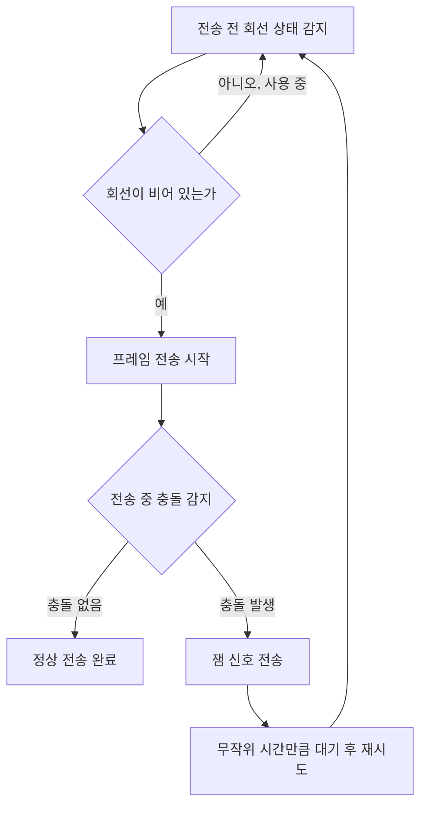
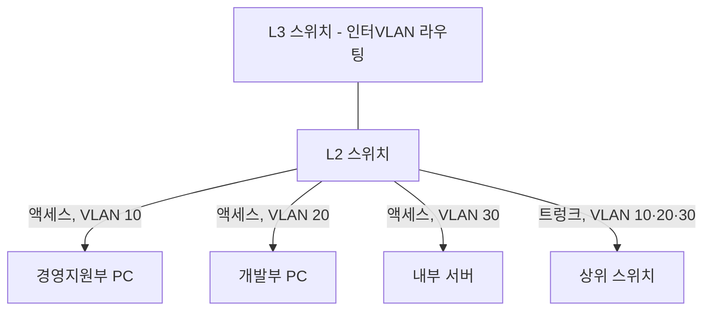

<Callout type="info">
  **이번 문서의 목표:** LAN을 설계할 때 확인해야 할 요구사항과 이더넷 물리계층 규격을 구분하고, CSMA/CD·CSMA/CA의 동작 차이와 L2·L3 스위치의 역할을 설명하며, 장비의 신뢰성 지표(MTBF·MTTR·MTTF)로 가용성을 계산하고, VLAN을 STP·RSTP·VTP와 함께 구성할 수 있게 된다.
</Callout>

## 이 편이 다루는 범위

15편에서는 네트워크를 설계할 때의 큰 원칙(경제성·가용성·안전성·기술표준)과 OSI 참조모델의 계층 구조를 요약했고, 16편에서는 그 위에서 움직이는 IP 주소체계와 서브네팅, 전달계층·응용계층 프로토콜을 다뤘습니다. 이 편은 그 두 편을 실제 사무실·건물 안의 물리적인 LAN(Local Area Network, 근거리통신망)으로 구현하는 방법을 다룹니다. 케이블은 무엇을 쓰고, 여러 기기가 동시에 통신을 시도할 때 충돌을 어떻게 피하며, 어떤 장비를 고르고, 부서별로 트래픽을 어떻게 논리적으로 나누는지가 핵심입니다.

> **쉽게 말하면:** 15·16편이 "어떤 규칙으로 통신할 것인가"였다면, 이 편은 "그 규칙이 돌아갈 사무실 배선과 스위치를 실제로 어떻게 깔 것인가"입니다.

## 1. LAN 설계 요구사항 분석과 이더넷·물리계층 전송매체

### LAN을 설계하기 전에 확인할 것들

**LAN 설계**는 무작정 케이블을 깔고 장비를 사는 일이 아닙니다. 15편에서 다룬 설계 기준(경제성·가용성·안전성·기술표준)을 물리적인 숫자로 바꾸는 작업입니다. 실무에서는 다음 항목을 먼저 분석합니다.

- **사용자 수와 트래픽량**: 몇 명이, 어떤 업무(문서 작업인지 영상 편집인지)로 네트워크를 쓰는지에 따라 필요한 대역폭이 달라집니다.
- **물리적 배치**: 사무실 면적, 층수, 배선함(단자함)의 위치에 따라 케이블 길이 제한이 걸립니다.
- **확장성**: 인원이 늘어날 때 포트를 추가하거나 백본 속도를 올릴 여유가 있는지.
- **가용성 목표**: 장애가 나도 되는 시간(RTO, Recovery Time Objective)에 따라 이중화 수준이 달라집니다(RTO는 20편에서 백업·복구와 함께 다시 다룹니다).

> **쉽게 말하면:** LAN 설계는 "지금 몇 명이 얼마나 빠른 인터넷을 쓸지"와 "나중에 사람이 늘어나도 버틸지"를 미리 계산해 두는 일입니다.

### 이더넷 물리계층 규격

**이더넷**(Ethernet)은 LAN에서 가장 널리 쓰이는 유선 표준으로, IEEE 802.3 표준 계열에 속합니다. 표준 이름은 "전송속도 + 신호방식 + 매체"의 규칙으로 붙습니다.

| 표준 | 전송속도 | 매체 | 최대 세그먼트 거리 |
|---|---|---|---|
| 10BASE-T | 10Mbps | UTP(9편에서 다룬 비차폐 연선) Cat.3 이상 | 100m |
| 100BASE-TX | 100Mbps | UTP Cat.5 이상 | 100m |
| 1000BASE-T | 1Gbps | UTP Cat.5e 이상 | 100m |
| 10GBASE-T | 10Gbps | UTP Cat.6a 이상 | 100m |
| 1000BASE-SX/LX | 1Gbps | 광섬유(9편 참고) | 550m(다중모드)–10km(단일모드) |

표 이름의 "BASE"는 기저대역(baseband) 전송, 즉 신호를 변조 없이 원래 주파수 대역 그대로 실어 보낸다는 뜻이고, "T"는 twisted pair(연선), "X"·"SX"·"LX"는 신호 부호화 방식이나 광 파장 특성을 나타내는 접미사입니다.

**자주 틀리는 점:** UTP 케이블의 최대 거리는 전송속도와 무관하게 대부분 100미터로 고정되어 있다는 점을 놓치기 쉽습니다. 속도가 10배씩 뛰어도 거리 제한이 그대로인 이유는, 속도가 빨라질수록 케이블 규격(카테고리)을 더 엄격하게 요구해 감쇠와 누화(9편에서 다룬 crosstalk)를 억제하기 때문입니다.

### 전이중·반이중과 케이블 카테고리

**전이중**(full duplex)은 송신과 수신을 동시에 할 수 있는 방식이고, **반이중**(half duplex)은 한 번에 한 방향으로만 통신할 수 있는 방식입니다. 현대 스위치 기반 LAN은 대부분 전이중으로 동작해 충돌 자체가 발생하지 않지만, 오래된 허브(hub) 기반 공유 매체 환경에서는 반이중이 기본이었고, 이 차이가 다음 절의 CSMA/CD와 직결됩니다.

케이블 카테고리(Cat.)는 숫자가 클수록 더 높은 주파수까지 규격을 보증합니다.

| 카테고리 | 지원 대역폭 | 대표 용도 |
|---|---|---|
| Cat.5e | 100MHz | 1000BASE-T(1Gbps) |
| Cat.6 | 250MHz | 1000BASE-T, 짧은 구간의 10GBASE-T |
| Cat.6a | 500MHz | 10GBASE-T(100m 전 구간) |
| Cat.7 | 600MHz | 10GBASE-T 이상, 강화된 차폐 |

## 2. 매체 접근 제어 — CSMA/CD와 CSMA/CA, L2·L3 스위치

### 왜 접근 제어 규칙이 필요한가

여러 기기가 같은 전송매체(옛 허브 기반 이더넷의 동축케이블이나 무선랜의 공기)를 공유하면, 두 기기가 동시에 신호를 내보내는 순간 신호가 서로 겹쳐 깨지는 **충돌**(collision)이 일어납니다. 이를 막거나 감지하기 위한 규칙이 **매체접근제어**(MAC, Media Access Control)입니다.

> **쉽게 말하면:** 여러 사람이 한 회의 전화선을 같이 쓸 때, "말하기 전에 누가 말하고 있는지 듣고(감지), 동시에 말했으면 서로 알아채고 다시 시도"하는 규칙입니다.

### CSMA/CD — 유선 이더넷의 충돌 감지

**CSMA/CD**(Carrier Sense Multiple Access with Collision Detection, 반송파 감지 다중접속/충돌검출)는 다음 순서로 동작합니다.

- **반송파 감지**(Carrier Sense): 전송 전 회선이 비어 있는지 듣는다.
- **다중접속**(Multiple Access): 모든 기기가 같은 매체를 공유한다.
- **충돌검출**(Collision Detection): 전송 중에도 계속 신호를 감시해 충돌을 감지하면 즉시 전송을 멈춘다.

**충돌 도메인과 최소 프레임 크기의 관계(계산):** 10Mbps 이더넷의 최소 프레임 크기는 64바이트(512비트)로 정해져 있습니다. 이 값이 왜 필요한지 계산해 보겠습니다.

**1단계 — 64바이트 프레임의 전송 시간을 구합니다.**

$$
t = \frac{64 \times 8\ \text{bit}}{10 \times 10^6\ \text{bit/s}} = \frac{512}{10{,}000{,}000} = 51.2\ \mu s
$$

- $t$: 프레임 하나를 다 내보내는 데 걸리는 시간
- $64 \times 8$: 64바이트를 비트로 환산(1바이트 = 8비트)
- $10 \times 10^6$: 10Mbps의 초당 비트 수

**해석:** 송신 기기가 프레임을 다 내보내는 데 51.2마이크로초가 걸립니다. 이더넷 표준은 "송신 기기가 프레임 전송을 마치기 전에, 그 신호가 네트워크 반대쪽 끝까지 갔다가 충돌 신호가 되돌아오는 왕복 시간 안에 충돌을 반드시 감지할 수 있어야 한다"는 조건을 만족하도록 최소 프레임 크기를 설계했습니다. 만약 프레임이 이보다 짧으면, 송신을 끝내고 난 뒤에야 충돌 사실을 알게 되는 경우가 생겨 충돌 감지 자체가 무의미해집니다.

**자주 틀리는 점:** 스위치 기반 전이중 LAN에서는 애초에 매체를 독점 연결(포트별로 케이블 1개)하므로 충돌이 원천적으로 생기지 않아 CSMA/CD가 동작하지 않습니다. "요즘 스위치 LAN도 CSMA/CD로 충돌을 감지한다"는 서술은 틀린 설명입니다.

### CSMA/CA — 무선랜의 충돌 회피

무선매체는 유선처럼 전송 중 충돌을 직접 감지하기 어렵습니다(자신이 보내는 강한 신호에 묻혀 약한 충돌 신호를 구별하기 힘들기 때문). 그래서 무선랜(13편에서 다룬 Wi-Fi)은 아예 충돌을 사전에 피하는 **CSMA/CA**(Carrier Sense Multiple Access with Collision Avoidance, 반송파 감지 다중접속/충돌회피)를 씁니다.

- **IFS**(InterFrame Space, 프레임 간 간격): 전송 전에 일정 시간 회선이 비어 있는지 추가로 대기한다.
- **랜덤 백오프**(random backoff): 대기 시간이 끝나도 곧바로 보내지 않고, 무작위 시간을 더 기다려 여러 기기가 동시에 뛰쳐나가는 상황을 줄인다.
- **RTS/CTS**(Request To Send/Clear To Send): 실제 데이터를 보내기 전에 "보내도 될까요(RTS)"–"보내세요(CTS)"라는 짧은 예약 신호를 주고받아, 숨은 단말(hidden node, 서로의 신호는 못 듣지만 같은 AP를 공유하는 두 기기) 문제를 줄인다.

> **쉽게 말하면:** CSMA/CD는 "말하다가 부딪히면 사과하고 다시 말하기"이고, CSMA/CA는 "말하기 전에 미리 손들고 허락받기"입니다.

### L2 스위치와 L3 스위치

**L2 스위치**(Layer 2 Switch, 2계층 스위치)는 이더넷 프레임의 MAC 주소를 보고 포트를 선택해 전달하는 장비입니다. 처음 보는 MAC 주소는 **MAC 주소 테이블**에 학습해 두었다가, 다음부터는 해당 포트로만 정확히 보내고(포워딩), 목적지를 모르면 들어온 포트를 뺀 모든 포트로 뿌립니다(플러딩, flooding).

**L3 스위치**(Layer 3 Switch, 3계층 스위치)는 L2 스위치의 빠른 하드웨어 기반 스위칭 기능에 라우팅 기능(16편에서 다룬 IP 주소 기반 경로 선택)을 얹은 장비로, VLAN 사이(inter-VLAN routing)를 소프트웨어 라우터보다 훨씬 빠르게 연결할 수 있습니다.

| 구분 | 참조 계층 | 판단 기준 | 대표 기능 |
|---|---|---|---|
| L2 스위치 | 데이터링크 계층 | MAC 주소 | VLAN 스위칭, 같은 VLAN 안 통신 |
| L3 스위치 | 네트워크 계층 | IP 주소 | VLAN 간 라우팅, 정적/동적 라우팅 |

**충돌 도메인과 브로드캐스트 도메인:** 스위치의 각 포트는 별도의 충돌 도메인(collision domain, 충돌이 발생할 수 있는 범위)이 되어 충돌 위험을 포트 단위로 줄입니다. 반면 **브로드캐스트 도메인**(broadcast domain, 브로드캐스트 프레임이 도달하는 범위)은 스위치를 아무리 늘려도 하나로 유지되며, 오직 VLAN 분리나 라우터(L3 장비)를 거쳐야만 나뉩니다. 이 차이가 다음 절 VLAN의 존재 이유입니다.

## 3. 장비 선정 기준 — 인증제도와 신뢰성 척도

### 왜 인증과 신뢰성 수치를 따지는가

LAN 장비는 한 번 설치하면 몇 년씩 운용하므로, 구매 전에 "이 장비가 국내 기준에 맞고, 얼마나 안 고장 나며, 고장 나도 얼마나 빨리 고치는지"를 검증합니다.

### 시험인증 제도 — KC·TTA·GS

| 인증 | 발급 기관 | 의미 |
|---|---|---|
| KC(Korea Certification) | 국가기술표준원 등 | 전기·전자파 안전 등 국내 법정 강제 인증, 없으면 국내 유통 자체가 불가 |
| TTA(정보통신기술협회) 인증 | 한국정보통신기술협회 | 통신 프로토콜 표준 적합성·상호운용성 검증 |
| GS(Good Software) 인증 | 한국정보통신기술협회 | 소프트웨어(장비 관리 소프트웨어 등)의 품질·성능 검증 |

**자주 틀리는 점:** KC 인증을 "품질이 좋다는 인증"으로 착각하는 경우가 많은데, KC는 안전·전자파 적합성에 대한 **법정 강제 인증**이고, TTA·GS는 품질·상호운용성을 확인하는 **임의 인증**이라는 성격 차이를 구분해야 합니다.

### 신뢰성 척도 — MTBF·MTTR·MTTF

| 지표 | 이름 | 의미 |
|---|---|---|
| MTBF(Mean Time Between Failures) | 평균 고장 간격 | 수리 가능한 장비가 고장 나서 수리된 뒤, 다음 고장까지 걸리는 평균 시간 |
| MTTR(Mean Time To Repair) | 평균 수리 시간 | 고장이 발생한 뒤 수리를 완료하기까지 걸리는 평균 시간 |
| MTTF(Mean Time To Failure) | 평균 고장 시간 | 수리 불가능한 부품(전구·디스크 일부 등)이 사용 시작부터 완전히 못 쓰게 될 때까지 걸리는 평균 시간 |

> **쉽게 말하면:** MTBF는 "고쳐가며 계속 쓰는 장비가 다시 고장 나기까지 걸리는 평균 간격"이고, MTTF는 "고칠 수 없는 부품이 수명을 다하기까지 걸리는 평균 시간"입니다.

**가용성(Availability) 계산:** 신뢰성 지표는 결국 "이 장비가 전체 운용 시간 중 얼마나 많은 시간을 정상 작동하는가"라는 가용성으로 이어집니다.

$$
A = \frac{MTBF}{MTBF + MTTR}
$$

- $A$: 가용성(0과 1 사이의 비율, 백분율로도 표시)
- $MTBF$: 평균 고장 간격
- $MTTR$: 평균 수리 시간

**손계산.** 스위치 한 대의 MTBF가 9,990시간, MTTR이 10시간이라고 합시다.

**1단계 — 분모를 구합니다.**

$$
MTBF + MTTR = 9990 + 10 = 10000\ \text{시간}
$$

**2단계 — 가용성을 구합니다.**

$$
A = \frac{9990}{10000} = 0.999
$$

**3단계 — 연간 예상 다운타임을 구합니다.** 1년은 $365 \times 24 = 8760$시간이며 분으로는 $8760 \times 60 = 525{,}600$분입니다.

$$
\text{다운타임} = (1 - 0.999) \times 525{,}600 = 0.001 \times 525{,}600 = 525.6\ \text{분}
$$

**해석:** 가용성 99.9퍼센트(흔히 "쓰리나인"이라 부름)는 1년에 약 525.6분(약 8.76시간)까지 장애가 나도 되는 수준입니다. 이 자릿수(나인의 개수)가 하나 늘 때마다 허용 다운타임은 대략 10분의 1로 줄어듭니다 — 99.99퍼센트("포나인")는 연간 약 52.6분, 99.999퍼센트("파이브나인")는 연간 약 5.26분까지만 허용됩니다.

**자주 틀리는 점:** 가용성 공식의 분모에 MTTR을 빼먹고 $A = MTBF / MTBF$처럼 계산해 100퍼센트라고 답하는 실수가 잦습니다. 반드시 MTBF와 MTTR을 더한 값을 분모로 써야 하며, MTTR이 0에 가까울수록(고장 나도 즉시 고칠수록) 가용성이 1에 가까워진다는 관계로 검산할 수 있습니다.

## 4. VLAN 개념과 구성 — STP·RSTP·VTP

### VLAN이 필요한 이유

앞서 브로드캐스트 도메인은 스위치를 아무리 늘려도 하나로 유지된다고 했습니다. 회사 전체가 하나의 브로드캐스트 도메인이면, 한 부서에서 브로드캐스트 트래픽(예: ARP 요청)이 폭증할 때 전 부서의 성능이 함께 떨어지고, 부서 간 보안 분리도 되지 않습니다.

**VLAN**(Virtual LAN, 가상 근거리통신망)은 물리적인 배선을 바꾸지 않고도, 스위치 안에서 포트를 논리적인 그룹으로 나눠 브로드캐스트 도메인 자체를 여러 개로 쪼개는 기술입니다.

> **쉽게 말하면:** 한 건물(스위치)을 물리적으로 나누는 공사 없이, 층별 출입카드(VLAN 태그)만으로 "이 층 사람들끼리만 방송이 들리게" 나누는 방법입니다.

### VLAN의 종류와 태깅

| VLAN 구분 방식 | 설명 |
|---|---|
| 포트 기반 VLAN | 스위치의 물리적 포트 번호를 기준으로 VLAN을 지정, 가장 널리 쓰임 |
| MAC 주소 기반 VLAN | 단말의 MAC 주소를 기준으로 VLAN을 지정, 단말을 옮겨도 VLAN이 따라감 |
| 프로토콜 기반 VLAN | 사용하는 프로토콜(IP·IPX 등) 종류로 VLAN을 구분 |

VLAN 사이를 구분하는 표시는 이더넷 프레임에 4바이트짜리 태그를 끼워 넣는 **IEEE 802.1Q** 표준을 씁니다. 이 태그 안의 VLAN ID 필드는 12비트라서 $2^{12} = 4096$가지 값을 표현할 수 있는데, 0번과 4095번은 예약되어 있어 실제로 쓸 수 있는 VLAN은 1번부터 4094번까지 총 4094개입니다.

VLAN 태그가 붙은 프레임을 여러 개 동시에 실어 나르는 스위치 간 링크를 **트렁크**(trunk)라 하고, 하나의 VLAN만 흐르는 일반 포트를 **액세스**(access) 포트라 합니다.

**설정 예시 — 부서별 VLAN 배정.** 신규 사무실을 다음과 같이 나눈다고 합시다.

| 포트 구분 | VLAN ID | 모드 | 연결 대상 |
|---|---|---|---|
| 포트 1–10 | VLAN 10(경영지원부) | 액세스 | 경영지원부 PC |
| 포트 11–20 | VLAN 20(개발부) | 액세스 | 개발부 PC |
| 포트 21–22 | VLAN 30(서버팜) | 액세스 | 내부 서버 |
| 포트 23–24 | 전체 VLAN(10·20·30) | 트렁크 | 상위 계층 스위치·L3 스위치 |

L2 스위치만으로는 VLAN 10과 VLAN 20의 PC가 서로 통신할 수 없습니다(브로드캐스트 도메인이 분리되었기 때문). 서로 다른 VLAN끼리 통신하려면 앞서 다룬 **L3 스위치**나 라우터를 거쳐야 하며, 이를 **인터VLAN 라우팅**(Inter-VLAN Routing)이라 합니다.

### STP — 루프를 막는 신장트리 프로토콜

스위치를 이중화(가용성을 높이려고 두 대 이상을 서로 연결)하면, 물리적으로 고리(loop) 형태의 경로가 생길 수 있습니다. 스위치는 라우터와 달리 프레임의 생존 시간(TTL) 개념이 없어서, 고리가 있으면 브로드캐스트 프레임이 무한히 돌며 네트워크 전체를 마비시키는 **브로드캐스트 스톰**(broadcast storm)이 발생합니다.

**STP**(Spanning Tree Protocol, 신장트리 프로토콜)는 여러 경로 중 하나만 남기고 나머지를 논리적으로 차단(blocking)해, 결과적으로 고리가 없는 나무(tree) 구조를 만듭니다.

**동작 순서:**

1. **루트 브리지(root bridge) 선출**: 모든 스위치가 자신의 **브리지 ID**(우선순위 2바이트 + MAC 주소 6바이트)를 서로 알리고, 가장 작은 값을 가진 스위치가 루트 브리지가 된다.
2. **루트 포트(root port) 결정**: 루트 브리지가 아닌 스위치들은, 루트 브리지까지 가는 여러 경로 중 **경로비용**(path cost)의 합이 가장 작은 포트를 루트 포트로 정한다.
3. **지정 포트(designated port) 결정**과 나머지 차단: 각 세그먼트(링크)마다 대표로 통신할 포트 하나만 지정 포트로 남기고, 나머지는 블로킹(blocking) 상태로 만든다.

경로비용은 링크 속도가 빠를수록 작은 값을 씁니다.

| 링크 속도 | IEEE 802.1D 경로비용 |
|---|---|
| 10Mbps | 100 |
| 100Mbps | 19 |
| 1Gbps | 4 |
| 10Gbps | 2 |

**손계산 — 루트 포트 결정.** 스위치 B가 루트 브리지인 스위치 A까지 가는 경로가 두 가지 있다고 합시다. 경로 1은 A–B 직결 1Gbps 링크, 경로 2는 A–C(100Mbps)–B(100Mbps)를 거치는 경로입니다.

**1단계 — 경로 1의 비용**

$$
\text{경로 1 비용} = 4
$$

**2단계 — 경로 2의 비용(구간별 합산)**

$$
\text{경로 2 비용} = 19 + 19 = 38
$$

**3단계 — 비교**

$$
4 < 38
$$

**해석:** 스위치 B는 비용이 더 작은 경로 1(직결 1Gbps 링크)의 포트를 루트 포트로 선택합니다. 경로 2 쪽 포트는 블로킹 상태가 되어 평소에는 데이터를 나르지 않다가, 경로 1이 끊어지면 그때 다시 계산해 활성화됩니다.

**자주 틀리는 점:** 브리지 ID를 비교할 때 우선순위 값이 같으면 MAC 주소를 비교하는데, 이때도 "숫자가 작을수록" 우선한다는 규칙은 동일합니다. 우선순위가 낮은 스위치가 루트 브리지가 된다는 방향(작을수록 우선)을 반대로 외우는 실수가 잦습니다.

### RSTP와 VTP

**RSTP**(Rapid Spanning Tree Protocol, 802.1w)는 기존 STP의 가장 큰 약점이었던 느린 전환 시간(링크 장애 후 새 경로가 살아나기까지 최대 50초 가까이 걸림)을 개선해, 몇 초 이내로 빠르게 새 토폴로지를 반영하도록 만든 후속 표준입니다. 동작 원리(루트 브리지·경로비용 비교)는 STP와 같고, 포트 상태 전환 절차만 단순화·고속화했습니다.

**VTP**(VLAN Trunking Protocol, VLAN 트렁킹 프로토콜)는 여러 스위치에 흩어진 VLAN 정보(VLAN 이름·ID 목록)를 하나의 서버 스위치에서 관리하고, 트렁크 링크를 통해 나머지 스위치(클라이언트)에 자동으로 동기화하는 프로토콜입니다. VTP 도메인(같은 관리 범위로 묶인 스위치 그룹) 안에서 리비전 번호(revision number, 설정이 바뀔 때마다 올라가는 일련번호)가 더 높은 쪽의 VLAN 정보가 전체에 전파됩니다.

**자주 틀리는 점:** VTP는 STP처럼 루프를 막는 프로토콜이 아니라, VLAN 목록을 동기화하는 관리용 프로토콜입니다. 두 프로토콜의 목적(루프 방지 vs VLAN 정보 배포)을 혼동하지 않아야 합니다.

## 핵심 정리

- 이더넷 물리계층 규격(10BASE-T~10GBASE-T)은 속도가 올라가도 UTP 최대 거리는 대개 100미터로 유지되며, 대신 케이블 카테고리 요구가 높아진다.
- CSMA/CD(유선, 충돌 감지 후 재전송)와 CSMA/CA(무선, 충돌을 사전에 회피)는 서로 다른 매체접근제어 방식이며, 스위치 기반 전이중 LAN에서는 CSMA/CD가 동작하지 않는다.
- L2 스위치는 MAC 주소로, L3 스위치는 IP 주소까지 보고 전달하며, 포트마다 충돌 도메인은 나뉘어도 브로드캐스트 도메인은 VLAN이나 라우팅 없이는 하나로 유지된다.
- 가용성 $A = MTBF/(MTBF+MTTR)$이며, 나인의 개수가 하나 늘 때마다 허용 연간 다운타임은 약 10분의 1씩 줄어든다.
- VLAN은 802.1Q 태그(12비트, 최대 4094개 사용 가능)로 브로드캐스트 도메인을 논리적으로 분리하며, STP는 브리지 ID와 경로비용을 비교해 루프를 차단하고, RSTP는 전환 속도를, VTP는 VLAN 정보 동기화를 담당한다.

## 마무리 복습

<Quiz
  questionNumber={1}
  question="1000BASE-T 이더넷 표준에 대한 설명으로 가장 적절한 것은?"
  options={['전송속도는 1Gbps이며 UTP Cat.5e 이상 케이블에서 최대 100미터까지 지원한다', '전송속도는 100Mbps이며 광섬유 케이블만 사용할 수 있다', '전송속도가 높을수록 UTP의 최대 거리도 함께 늘어난다', 'BASE라는 이름은 광대역 변조 전송을 의미한다']}
  correctAnswer={1}
  explanation="1000BASE-T는 1Gbps 속도를 Cat.5e 이상의 UTP 케이블로 최대 100미터까지 지원하는 표준이다."
  optionExplanations={['속도와 케이블 규격, 거리 제한이 모두 정확하게 짝지어진 설명이다.', '1000BASE-T는 1Gbps 속도이며 UTP로도 지원되는 표준이다.', 'UTP 최대 거리는 속도가 올라가도 대개 100미터로 유지되고 대신 케이블 규격이 높아진다.', 'BASE는 기저대역 전송을 의미하며 광대역 변조와는 반대되는 개념이다.']}
/>

<Quiz
  questionNumber={2}
  question="CSMA/CD와 CSMA/CA의 차이에 대한 설명으로 가장 적절한 것은?"
  options={['CSMA/CD는 무선랜에서, CSMA/CA는 유선 이더넷에서 사용한다', 'CSMA/CD는 전송 중 충돌을 감지하고, CSMA/CA는 RTS/CTS 등으로 충돌을 사전에 회피한다', '두 방식 모두 충돌이 전혀 발생하지 않는 전이중 전용 방식이다', 'CSMA/CA는 충돌을 감지하면 잼 신호를 보내 즉시 전송을 중단시킨다']}
  correctAnswer={2}
  explanation="CSMA/CD는 유선에서 전송 중 충돌을 실시간으로 감지해 대응하고, CSMA/CA는 무선에서 IFS·랜덤 백오프·RTS/CTS로 충돌 자체를 사전에 피하려는 방식이다."
  optionExplanations={['적용 매체가 반대로 설명되어 있다. CSMA/CD가 유선, CSMA/CA가 무선이다.', '충돌 감지와 충돌 회피라는 두 방식의 핵심 차이를 정확히 짚었다.', '두 방식 모두 반이중·공유 매체 환경에서 충돌 가능성을 전제로 설계된 방식이다.', '잼 신호와 충돌 감지 후 재전송은 CSMA/CD의 동작이다.']}
/>

<Quiz
  questionNumber={3}
  question="10Mbps 이더넷에서 최소 프레임 크기를 64바이트로 정한 이유로 가장 적절한 것은?"
  options={['64바이트가 가장 압축 효율이 좋은 크기이기 때문이다', '송신이 끝나기 전에 충돌 신호가 왕복해 돌아올 수 있도록 최소 전송 시간을 보장하기 위해서다', '수신 장비의 버퍼 크기 제한 때문이다', 'IP 헤더의 최소 크기와 정확히 일치시키기 위해서다']}
  correctAnswer={2}
  explanation="최소 프레임 크기는 송신 기기가 프레임을 다 보내기 전에 네트워크 반대쪽에서 온 충돌 신호를 반드시 감지할 수 있도록, 최소 전송 시간을 왕복 전파 지연보다 길게 보장하기 위한 값이다."
  optionExplanations={['압축 효율과는 관련이 없는 충돌 감지 목적의 설계 값이다.', '왕복 전파 지연 안에 충돌을 감지할 수 있어야 한다는 CSMA/CD의 요구사항을 정확히 설명한다.', '버퍼 크기가 아니라 충돌 감지 시간을 보장하기 위한 것이다.', 'IP 헤더 크기와는 직접적인 관련이 없다.']}
/>

<Quiz
  questionNumber={4}
  question="L2 스위치와 L3 스위치를 비교한 설명으로 옳지 않은 것은?"
  options={['L2 스위치는 MAC 주소를 기준으로 프레임을 전달한다', 'L3 스위치는 서로 다른 VLAN 사이의 통신(인터VLAN 라우팅)을 처리할 수 있다', 'L2 스위치만으로도 서로 다른 VLAN에 속한 PC끼리 통신할 수 있다', 'L3 스위치는 IP 주소를 참조해 경로를 선택하는 기능을 포함한다']}
  correctAnswer={3}
  explanation="VLAN이 다르면 브로드캐스트 도메인 자체가 분리되므로, L2 스위치만으로는 서로 다른 VLAN 사이의 통신이 불가능하고 L3 스위치나 라우터를 거쳐야 한다."
  optionExplanations={['L2 스위치는 데이터링크 계층의 MAC 주소를 기준으로 동작한다.', 'L3 스위치의 인터VLAN 라우팅 기능에 대한 정확한 설명이다.', '서로 다른 VLAN은 브로드캐스트 도메인이 분리되어 L2 스위치만으로는 통신할 수 없으므로 이 설명이 옳지 않다.', 'L3 스위치는 IP 주소 기반 라우팅 기능을 포함한다는 설명이 정확하다.']}
/>

<Quiz
  questionNumber={5}
  question="어떤 스위치의 MTBF가 9990시간, MTTR이 10시간일 때 가용성은?"
  options={['90퍼센트', '99퍼센트', '99.9퍼센트', '99.99퍼센트']}
  correctAnswer={3}
  explanation="가용성은 MTBF를 MTBF와 MTTR의 합으로 나눈 값이며, 9990을 10000으로 나누면 0.999, 즉 99.9퍼센트다."
  optionExplanations={['MTTR을 지나치게 크게 반영한 값으로 실제 계산 결과와 다르다.', '계산 결과인 99.9퍼센트와 자릿수가 다르다.', '9990을 10000으로 나눈 정확한 계산 결과다.', '실제 계산값보다 한 자릿수 더 높은 가용성이다.']}
/>

<Quiz
  questionNumber={6}
  question="IEEE 802.1Q VLAN 태그의 VLAN ID 필드에 대한 설명으로 가장 적절한 것은?"
  options={['8비트이며 최대 256개의 VLAN을 표현한다', '12비트이며 0번과 4095번을 제외한 최대 4094개의 VLAN을 사용할 수 있다', '16비트이며 65536개의 VLAN을 모두 사용할 수 있다', 'VLAN ID는 스위치마다 자유롭게 비트 수를 정할 수 있다']}
  correctAnswer={2}
  explanation="VLAN ID 필드는 12비트로 2의 12제곱인 4096가지 값을 표현할 수 있으며, 0번과 4095번은 예약되어 실제로는 4094개의 VLAN을 쓸 수 있다."
  optionExplanations={['VLAN ID는 8비트가 아니라 12비트 필드다.', '12비트 필드 크기와 예약값을 제외한 사용 가능 개수를 정확히 설명한다.', '16비트가 아니라 12비트이며 예약값도 존재한다.', 'IEEE 802.1Q 표준으로 비트 수가 고정되어 있다.']}
/>

<Quiz
  questionNumber={7}
  question="STP(신장트리 프로토콜)에서 루트 브리지를 선출하는 기준으로 가장 적절한 것은?"
  options={['가장 많은 포트를 가진 스위치가 루트 브리지가 된다', '브리지 ID(우선순위와 MAC 주소로 구성)가 가장 작은 스위치가 루트 브리지가 된다', '가장 최근에 설치된 스위치가 루트 브리지가 된다', '경로비용이 가장 큰 스위치가 루트 브리지가 된다']}
  correctAnswer={2}
  explanation="STP는 각 스위치의 브리지 ID(우선순위 2바이트와 MAC 주소 6바이트로 구성)를 비교해 가장 작은 값을 가진 스위치를 루트 브리지로 선출한다."
  optionExplanations={['포트 개수는 루트 브리지 선출 기준이 아니다.', '브리지 ID 값이 가장 작은 스위치가 루트 브리지가 된다는 설명이 정확하다.', '설치 시기는 STP의 선출 기준과 무관하다.', '경로비용은 루트 브리지가 정해진 뒤 루트 포트를 정할 때 쓰는 기준이다.']}
/>

<Quiz
  questionNumber={8}
  question="스위치 B가 루트 브리지까지 가는 경로가 직결 1Gbps 링크(경로비용 4)와 100Mbps 2구간 경로(구간당 경로비용 19)로 두 가지일 때, 루트 포트가 되는 경로와 그 근거로 옳은 것은?"
  options={['직결 1Gbps 경로, 총비용 4로 100Mbps 2구간 합계 38보다 작기 때문', '100Mbps 2구간 경로, 구간 수가 많아 안정적이기 때문', '두 경로 모두 동시에 루트 포트로 활성화된다', '직결 1Gbps 경로, 물리적 링크 수가 더 적기 때문']}
  correctAnswer={1}
  explanation="직결 1Gbps 경로의 경로비용은 4이고, 100Mbps 2구간을 거치는 경로는 19를 두 번 더한 38이므로, 더 작은 비용인 4를 가진 직결 경로가 루트 포트가 된다."
  optionExplanations={['경로비용 4와 38을 정확히 비교해 더 작은 값의 경로를 선택한 설명이다.', 'STP는 구간 수의 안정성이 아니라 경로비용의 합으로 판단한다.', 'STP는 루프 방지를 위해 세그먼트마다 하나의 경로만 활성화하고 나머지는 블로킹한다.', '링크 수가 아니라 경로비용의 합으로 비교해야 한다.']}
/>

## 참고 자료

- [계명대학교 게시판 - 정보통신기사 출제기준(필기·실기) PDF (2026.1.1.~2028.12.31. 적용)](https://cms.kmu.ac.kr/bbs/computer/763/172569/download.do)
- [한국방송통신전파진흥원(KCA) - 출제기준 자료실](https://www.cq.or.kr/qh_cusgm10_001.do)
