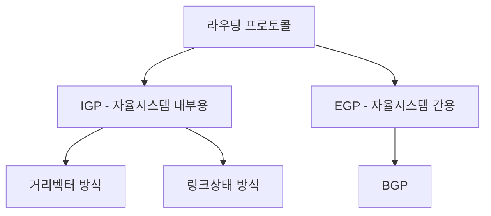
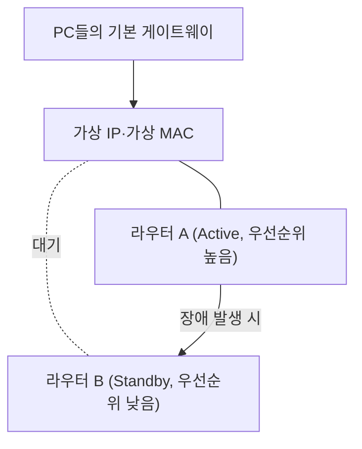
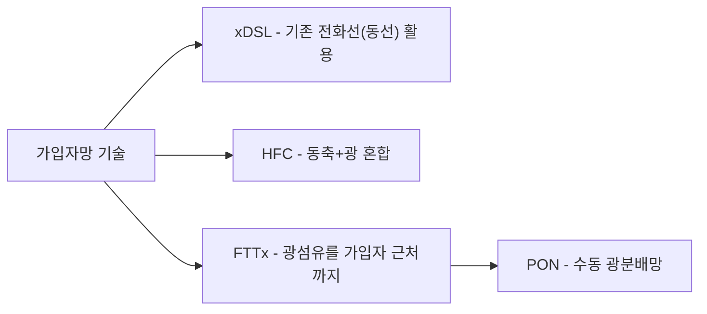
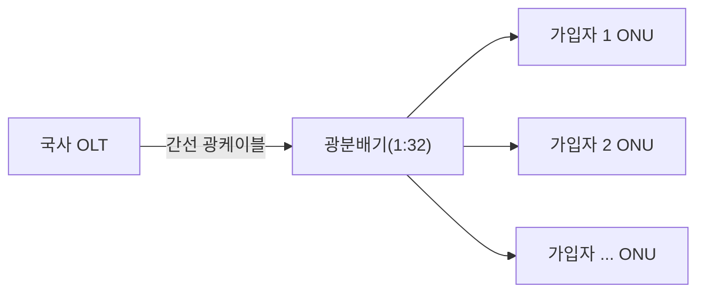

<Callout type="info">
  **이번 문서의 목표:** 정적·동적 라우팅과 IGP·BGP를 구분하고, HSRP·VRRP·GLBP 이중화 프로토콜의 동작을 우선순위 계산으로 설명하며, 구내교환설비와 xDSL·FTTx·PON 가입자망, SDH·MPLS·WDM 전송망 기술의 차이와 광손실 예산 계산을 할 수 있게 된다.
</Callout>

## 이 편이 다루는 범위

17편에서 하나의 LAN을 스위치와 VLAN으로 설계하는 방법을 다뤘다면, 이 편은 그 LAN들을 서로 연결하는 **네트워크 계층 이상의 기술**을 다룹니다. 여러 LAN 사이의 최적 경로를 찾는 라우팅, 핵심 장비 하나가 죽어도 서비스가 끊기지 않게 하는 이중화, 건물 안의 전화 교환 설비, 그리고 통신사가 가입자 집까지, 또 국가 간선망 사이를 잇는 전송망 기술까지가 범위입니다.

> **쉽게 말하면:** 17편이 "한 사무실 안의 배선"이었다면, 이 편은 "사무실과 사무실을, 그리고 도시와 도시를 잇는 고속도로 설계"입니다.

## 1. 라우팅 개념과 프로토콜 종류

### 정적 라우팅과 동적 라우팅

**라우팅**(routing)은 IP 패킷(16편에서 다룬 IP 주소체계)을 목적지까지 보내기 위해 다음 홉(hop, 다음으로 거쳐 갈 장비)을 결정하는 과정입니다. 라우터는 이 결정을 **라우팅 테이블**(routing table, 목적지 네트워크와 다음 홉의 대응표)을 보고 내립니다.

- **정적 라우팅**(static routing): 관리자가 경로를 직접 입력한다. 소규모·경로가 거의 바뀌지 않는 네트워크에 적합하며, 라우터 자원 소모가 적고 예측 가능하지만, 경로 변경 시 수작업이 필요하고 회선 장애에 자동으로 대응하지 못한다.
- **동적 라우팅**(dynamic routing): 라우터들이 서로 경로 정보를 주고받아 자동으로 최적 경로를 계산·갱신한다. 회선 장애가 나면 자동으로 우회 경로를 찾지만, 라우터의 CPU·메모리 자원을 더 쓰고 설계가 복잡하다.

> **쉽게 말하면:** 정적 라우팅은 내비게이션 없이 미리 외운 길로만 가는 것이고, 동적 라우팅은 실시간 교통정보를 반영해 스스로 경로를 바꾸는 내비게이션입니다.

### IGP와 EGP, 그리고 BGP

동적 라우팅 프로토콜은 어디까지를 관리 범위로 삼는지에 따라 나뉩니다. **자율시스템**(AS, Autonomous System)은 하나의 조직(통신사·대기업 등)이 일관된 라우팅 정책으로 관리하는 네트워크 집합을 뜻합니다.

| 구분 | 이름 | 범위 | 대표 방식 |
|---|---|---|---|
| IGP(Interior Gateway Protocol) | 내부 게이트웨이 프로토콜 | 하나의 자율시스템 내부 | 거리벡터·링크상태 |
| EGP(Exterior Gateway Protocol) | 외부 게이트웨이 프로토콜 | 서로 다른 자율시스템 사이 | BGP |

IGP는 다시 경로를 계산하는 방식에 따라 나뉩니다. **거리벡터**(distance vector) 방식은 이웃 라우터에게 "내가 아는 목적지까지의 거리(대개 홉 수)"만 전달해 점차 전체 경로를 알아가는 방식이고, **링크상태**(link state) 방식은 각 라우터가 전체 네트워크의 연결 상태(링크 지도)를 모두 파악한 뒤 최단 경로를 스스로 계산하는 방식입니다. 링크상태 방식은 수렴(convergence, 장애 후 새 경로가 안정되는 것) 속도가 빠르지만 계산량과 메모리 사용이 더 큽니다.

**BGP**(Border Gateway Protocol, 경계경로 프로토콜)는 인터넷을 이루는 수많은 자율시스템(각 통신사·대형 기업망) 사이에서 경로 정보를 교환하는 사실상 유일한 EGP입니다. 홉 수 같은 단순 거리 대신, 거쳐야 하는 자율시스템의 목록(AS 경로)과 정책(어느 통신사와 우선 거래하는지 등)을 함께 고려해 경로를 선택합니다.

**자주 틀리는 점:** BGP를 "속도가 가장 빠른 경로를 계산하는 프로토콜"로 오해하기 쉽지만, BGP는 속도 최적화보다 **자율시스템 간의 정책과 경로 안정성**을 우선하는 프로토콜이라는 점이 핵심입니다.

## 2. 이중화 구성 — HSRP·VRRP·GLBP

### 왜 게이트웨이를 이중화하는가

각 PC는 보통 자신이 속한 네트워크를 벗어날 때 거치는 **기본 게이트웨이**(default gateway, 대개 라우터나 L3 스위치의 IP 주소) 하나만 등록해 둡니다. 그 라우터 한 대가 고장 나면, 그 IP를 기본 게이트웨이로 쓰는 모든 PC가 외부와 통신이 끊깁니다. 이 단일 장애점(SPOF, Single Point of Failure)을 없애는 기술이 **1차 홉 이중화 프로토콜**(FHRP, First Hop Redundancy Protocol)입니다.

> **쉽게 말하면:** 여러 라우터가 하나의 "대표 가상 주소"를 함께 지키고 있다가, 대표가 쓰러지면 다음 서열이 그 자리를 즉시 이어받는 구조입니다.

### HSRP·VRRP·GLBP 비교

| 프로토콜 | 표준 여부 | 동작 방식 | 특징 |
|---|---|---|---|
| HSRP(Hot Standby Router Protocol) | 특정 제조사 표준 | Active 1대가 전담, Standby는 대기만 | 우선순위(priority) 기본값 100, 높은 쪽이 Active |
| VRRP(Virtual Router Redundancy Protocol) | 국제표준(IETF) | HSRP와 유사하게 Master 1대가 전담 | 여러 제조사 장비를 섞어도 호환 가능 |
| GLBP(Gateway Load Balancing Protocol) | 특정 제조사 표준 | 여러 라우터가 동시에 트래픽을 분산 처리(로드밸런싱) | 평소에도 여러 대가 함께 일해 자원 낭비가 적음 |

**HSRP·VRRP의 공통 원리:** 여러 라우터가 하나의 **가상 IP 주소**와 **가상 MAC 주소**를 공유하도록 그룹을 구성합니다. PC들은 이 가상 주소만 기본 게이트웨이로 알고 있으면 되고, 실제로 어느 물리 라우터가 응답하는지는 신경 쓰지 않습니다. 그룹 안에서 **우선순위**(priority) 값이 가장 높은 라우터가 Active(HSRP) 또는 Master(VRRP) 역할을 맡아 실제 트래픽을 처리하고, 나머지는 Standby(대기) 상태로 살아있는지만 주기적으로 확인합니다.

**설정 예시 — HSRP 그룹 구성.** 두 대의 L3 스위치가 하나의 HSRP 그룹을 구성한다고 합시다.

| 장비 | 가상 IP | 실제 IP | 우선순위 | 역할 |
|---|---|---|---|---|
| 스위치 A | 192.168.10.1(가상) | 192.168.10.2 | 150 | Active |
| 스위치 B | 192.168.10.1(가상) | 192.168.10.3 | 100(기본값) | Standby |

우선순위가 더 높은 스위치 A(150)가 평소 Active 역할을 맡아 가상 IP 192.168.10.1로 오는 트래픽을 처리합니다. 스위치 A에 장애가 생기면, 남은 스위치 B가 자신이 유일하게 살아있는 라우터임을 감지하고 즉시 Active로 전환해 같은 가상 IP·가상 MAC으로 응답을 이어받습니다. PC 입장에서는 게이트웨이 IP가 전혀 바뀌지 않으므로 설정 변경 없이 통신이 이어집니다.

**GLBP의 차이점:** HSRP·VRRP는 Active(또는 Master) 한 대만 실제로 일하고 나머지는 놀고 있어 장비 자원이 낭비된다는 한계가 있습니다. **GLBP**(Gateway Load Balancing Protocol)는 그룹 안의 모든 라우터가 각기 다른 가상 MAC 주소를 나눠 갖고, PC들의 ARP 요청(16편에서 다룬 주소 해석 프로토콜)에 응답할 때마다 순서대로 다른 가상 MAC을 알려줘, 평소에도 여러 라우터가 트래픽을 나눠 처리(로드밸런싱)하게 만듭니다.

**자주 틀리는 점:** "이중화 프로토콜은 장애가 났을 때만 의미가 있다"고 생각하기 쉽지만, GLBP는 장애가 없는 평상시에도 자원을 고르게 쓰는 것이 목적이라는 점에서 HSRP·VRRP와 근본적으로 다릅니다.

## 3. 구내교환설비와 인터넷 통신망

### 구내교환설비 — 교환망 종류와 TDM·IP-PBX

**구내교환설비**(PBX, Private Branch Exchange, 구내 사설 교환기)는 회사·건물 내부의 내선 전화들을 서로 연결하고, 외부 국선(통신사 회선)과도 연결해 주는 장비입니다.

| 방식 | 이름 | 특징 |
|---|---|---|
| TDM 방식 | TDM-PBX(Time Division Multiplexing PBX) | 11편에서 다룬 시분할다중화로 각 통화에 고정 타임슬롯을 할당하는 전통적 회선교환 방식 |
| IP 방식 | IP-PBX | 통화를 VoIP(13편에서 다룬 인터넷 프로토콜 기반 음성 전달) 패킷으로 처리, 기존 전화망뿐 아니라 데이터망 인프라를 그대로 활용 가능 |

**자주 틀리는 점:** IP-PBX가 "인터넷이 있어야만 통화가 가능한 장비"라고 오해하기 쉽지만, 실제로는 사내 LAN(이더넷) 안에서 IP 패킷으로 내선 통화를 처리하고, 외부 통화만 별도의 게이트웨이를 통해 통신사 망(공중전화망 또는 인터넷 회선)으로 나가는 구조입니다.

### 인터넷 통신망 — xDSL·FTTx·PON·HFC

가정·사무실까지 인터넷을 연결하는 **가입자망**(access network) 기술은 크게 네 갈래로 발전해 왔습니다.

| 기술 | 매체 | 특징 |
|---|---|---|
| xDSL(x Digital Subscriber Line) | 기존 전화선(연선) | 이미 깔린 전화선을 재활용해 고속 데이터를 실어 보냄, 거리가 멀수록 속도가 급격히 떨어짐 |
| HFC(Hybrid Fiber Coax) | 광섬유(간선) + 동축케이블(가입자 구간) | 케이블TV망을 데이터 전송에 함께 활용, CATV(13편 참고)와 인터넷을 동시 제공 |
| FTTx(Fiber To The x) | 광섬유 | 광케이블을 가입자에 얼마나 가깝게 끌어오느냐에 따라 FTTH(가정까지)·FTTB(건물까지)·FTTC(길가 캐비닛까지)로 세분 |
| PON(Passive Optical Network) | 광섬유 | FTTx를 구현하는 대표 방식, 능동 전원 장비 없이 광분배기(splitter)만으로 여러 가입자에게 신호를 나눠줌 |

**PON의 구조와 광손실 예산 계산:** PON은 통신사 국사(central office)의 **OLT**(Optical Line Terminal, 광회선종단장치)에서 나온 신호를 **광분배기**(splitter)로 여러 갈래로 나눠, 가입자 댁내의 **ONU/ONT**(Optical Network Unit/Terminal, 광가입자망종단장치)로 전달합니다. 09편에서 다룬 광케이블 손실 계산과 같은 원리로, 분배기를 거칠 때도 손실(분배손실)이 생깁니다.

1:32 분배기(신호를 32갈래로 균등하게 나누는 광분배기)는 이론적으로 전력을 32분의 1로 줄이므로, 이를 dB로 환산하면 다음과 같습니다.

**1단계 — 전력비를 구합니다.**

$$
\frac{P_{in}}{P_{out}} = 32
$$

**2단계 — dB로 환산합니다.**

$$
L_{split} = 10 \log_{10}(32) \approx 10 \times 1.505 = 15.05\ \text{dB}
$$

**3단계 — 간선 구간 손실(10킬로미터, 감쇠계수 0.35dB/km)을 더합니다.**

$$
L_{total} = (0.35 \times 10) + 15.05 = 3.5 + 15.05 = 18.55\ \text{dB}
$$

**해석:** 국사에서 가입자까지 총 광손실은 약 18.55dB입니다. 09편에서 배운 방식대로 송신 광출력에서 이 값을 빼면 가입자 ONU에 도달하는 수신 광출력을 구할 수 있고, 이 값이 ONU 수신 규격(대개 –28dBm 안팎) 이상인지 확인하는 것이 PON 설계의 핵심입니다.

**자주 틀리는 점:** 분배기의 분배 손실을 "32개로 나눴으니 32dB"처럼 배수를 그대로 dB 값으로 착각하는 실수가 흔합니다. 반드시 로그를 취해야 하며, 32배 전력비는 약 15dB이지 32dB가 아닙니다.

## 4. 전송망 기술 — SDH/SONET·MPLS·WDM·OTN

### SDH/SONET

**SDH**(Synchronous Digital Hierarchy, 동기식 디지털 계위, 유럽·국제표준)와 **SONET**(Synchronous Optical NETwork, 북미표준)은 여러 저속 신호(11편에서 다룬 PDH 프레임 등)를 표준화된 고속 프레임 구조로 다중화해 장거리 광전송망에 싣는 기술입니다. "동기식"이라는 이름처럼 모든 장비가 정밀한 클럭에 맞춰 동작해, 신호를 분리·삽입(add/drop)할 때 저속 신호 전체를 다시 조립할 필요 없이 필요한 부분만 빠르게 뽑아 쓸 수 있다는 것이 핵심 장점입니다.

### MPLS

**MPLS**(Multi-Protocol Label Switching, 다중프로토콜 레이블 스위칭)는 패킷마다 매번 목적지 IP 주소로 라우팅 테이블을 뒤지는 대신, 패킷 앞에 짧은 **레이블**(label)을 붙여 레이블 값만으로 미리 정해둔 경로(LSP, Label Switched Path)를 따라 빠르게 전달하는 기술입니다. 통신사 백본망에서 여러 고객사의 트래픽을 논리적으로 분리하면서도 빠르게 전달하는 데 널리 쓰입니다.

> **쉽게 말하면:** MPLS는 매번 지도를 보고 길을 찾는 대신, 소포에 "3번 창구로"라는 짧은 꼬리표를 붙여 미리 정해둔 컨베이어 벨트를 타고 바로 가게 하는 방식입니다.

### CWDM/DWDM

09편의 광케이블은 빛의 파장 하나만 쓴다고 가정했지만, **파장분할다중화**(WDM, Wavelength Division Multiplexing, 11편에서 이름만 소개)는 서로 다른 색(파장)의 빛 여러 개를 한 가닥의 광섬유에 동시에 실어 보내는 기술입니다.

| 구분 | CWDM(Coarse WDM) | DWDM(Dense WDM) |
|---|---|---|
| 파장 간격 | 넓음(약 20nm) | 매우 좁음(약 0.4–0.8nm) |
| 채널 수 | 적음(대개 18채널 이하) | 매우 많음(수십–수백 채널) |
| 장비 비용 | 저렴 | 고가(정밀한 파장 제어 필요) |
| 주 용도 | 근거리·구내 백본 | 장거리 국가 간선망, 해저케이블 |

**계산 감각:** 10Gbps 신호를 실어 나르는 파장 하나를 DWDM으로 80채널까지 늘리면, 광섬유 한 가닥의 총 전송 용량은 $10\text{Gbps} \times 80 = 800\text{Gbps}$까지 늘어납니다. 광섬유를 추가로 매설하지 않고도 기존 한 가닥의 용량을 수십~수백 배로 늘릴 수 있다는 것이 WDM의 경제적 가치입니다.

### OTN

**OTN**(Optical Transport Network, 광전달망)은 SDH/SONET의 강점(신호 삽입·분리, 성능 감시, 보호절체)과 WDM의 강점(대용량 다파장 전송)을 하나로 통합한 차세대 전송망 표준입니다. 다양한 신호(이더넷·SDH·기타 고객 신호)를 표준화된 봉투(래핑, wrapping)에 담아 하나의 광전송망에서 함께 감시·전달할 수 있게 해 줍니다.

**자주 틀리는 점:** SDH·MPLS·WDM·OTN을 서로 경쟁 관계로 오해하기 쉽지만, 실제로는 계층이 다른 기술입니다. WDM/OTN은 물리적으로 빛을 나눠 나르는 하부 계층이고, SDH나 MPLS는 그 위에서 논리적인 프레임·경로를 관리하는 상위 계층으로, 실무에서는 여러 기술이 함께 조합되어 하나의 전송망을 이룹니다.

## 핵심 정리

- 라우팅은 정적(수작업)과 동적(자동 갱신)으로 나뉘고, 동적 라우팅은 자율시스템 내부의 IGP(거리벡터·링크상태)와 자율시스템 간의 EGP(BGP)로 구분된다.
- HSRP·VRRP는 가상 IP·가상 MAC을 공유해 우선순위가 높은 한 대만 일하는 방식이고, GLBP는 여러 라우터가 동시에 트래픽을 나눠 처리하는 로드밸런싱 방식이다.
- 구내교환설비는 TDM-PBX(전통적 회선교환)와 IP-PBX(VoIP 기반)로 나뉘며, 가입자망은 xDSL(기존 전화선)·HFC(동축+광)·FTTx/PON(광섬유)으로 발전해 왔다.
- PON의 광분배기 손실은 배수를 그대로 dB로 쓰지 않고 $10\log_{10}(\text{분배수})$로 계산해야 하며, 간선 구간 손실과 더해 총 광손실을 구한다.
- SDH/SONET은 동기식 다중화, MPLS는 레이블 기반 고속 전달, WDM(CWDM·DWDM)은 다파장 대용량 전송, OTN은 이 강점들을 통합한 차세대 전송망 표준이다.

## 마무리 복습

<Quiz
  questionNumber={1}
  question="정적 라우팅과 동적 라우팅을 비교한 설명으로 가장 적절한 것은?"
  options={['정적 라우팅은 회선 장애 시 자동으로 우회 경로를 찾는다', '동적 라우팅은 라우터 자원을 거의 소모하지 않아 대규모 망에 항상 유리하다', '정적 라우팅은 관리자가 경로를 직접 입력하며 소규모·안정적인 망에 적합하다', '동적 라우팅은 라우터끼리 경로 정보를 주고받지 않는다']}
  correctAnswer={3}
  explanation="정적 라우팅은 관리자가 경로를 직접 입력하는 방식으로 자원 소모가 적고 예측 가능해 소규모나 경로 변경이 드문 망에 적합하다."
  optionExplanations={['자동 우회는 동적 라우팅의 특징이다.', '동적 라우팅은 오히려 계산과 갱신에 라우터 자원을 더 사용한다.', '관리자가 직접 입력하고 소규모 망에 적합하다는 정적 라우팅의 정의와 정확히 일치한다.', '동적 라우팅은 라우터끼리 경로 정보를 교환하는 것이 핵심 특징이다.']}
/>

<Quiz
  questionNumber={2}
  question="BGP(경계경로 프로토콜)에 대한 설명으로 가장 적절한 것은?"
  options={['자율시스템 내부에서만 쓰이는 IGP의 일종이다', '서로 다른 자율시스템 사이에서 경로 정보를 교환하며 정책과 경로 안정성을 우선한다', '홉 수가 가장 적은 경로만을 기준으로 최적 경로를 선택한다', '링크상태 방식으로 전체 네트워크 지도를 계산하는 IGP이다']}
  correctAnswer={2}
  explanation="BGP는 서로 다른 자율시스템 사이에서 쓰이는 대표적인 EGP로, 단순 거리보다 AS 경로와 정책을 우선해 경로를 선택한다."
  optionExplanations={['BGP는 IGP가 아니라 자율시스템 간에 쓰이는 EGP다.', '자율시스템 간 경로 교환과 정책 우선이라는 BGP의 핵심 특징을 정확히 설명한다.', '홉 수 최소화는 거리벡터 IGP의 특징에 가깝고 BGP는 정책을 함께 고려한다.', 'BGP는 IGP가 아니라 EGP로 분류된다.']}
/>

<Quiz
  questionNumber={3}
  question="HSRP 그룹에서 스위치 A의 우선순위가 150, 스위치 B의 우선순위가 100(기본값)일 때 평소 Active 역할을 맡는 장비는?"
  options={['우선순위가 낮은 스위치 B가 Active가 된다', '우선순위가 높은 스위치 A가 Active가 된다', '두 스위치가 동시에 Active로 동작한다', '우선순위와 무관하게 먼저 부팅된 장비가 Active가 된다']}
  correctAnswer={2}
  explanation="HSRP는 그룹 안에서 우선순위가 가장 높은 라우터가 Active 역할을 맡으며, 이 예시에서는 우선순위 150인 스위치 A가 Active가 된다."
  optionExplanations={['우선순위가 낮은 장비가 아니라 높은 장비가 Active를 맡는다.', '우선순위 150이 100보다 높으므로 스위치 A가 Active가 된다는 설명이 정확하다.', 'HSRP는 하나의 Active만 실제 트래픽을 처리하고 나머지는 Standby로 대기한다.', '부팅 순서가 아니라 우선순위 값으로 Active를 결정한다.']}
/>

<Quiz
  questionNumber={4}
  question="GLBP가 HSRP·VRRP와 구별되는 가장 핵심적인 차이는?"
  options={['GLBP는 가상 IP를 사용하지 않는다', 'GLBP는 그룹 내 여러 라우터가 평소에도 트래픽을 나눠 처리하는 로드밸런싱을 지원한다', 'GLBP는 국제표준이 아니라서 실제로 사용할 수 없다', 'GLBP는 장애가 발생해도 게이트웨이를 전환하지 않는다']}
  correctAnswer={2}
  explanation="GLBP는 그룹 내 여러 라우터가 각기 다른 가상 MAC으로 응답해 평소에도 트래픽을 분산 처리하는 로드밸런싱을 지원한다는 점에서 한 대만 일하는 HSRP·VRRP와 다르다."
  optionExplanations={['GLBP도 가상 IP 개념을 사용하는 FHRP 계열 프로토콜이다.', '평상시 로드밸런싱을 지원한다는 것이 GLBP의 핵심 차별점이다.', '표준 여부와 무관하게 실제로 사용되는 프로토콜이다.', 'GLBP도 장애 발생 시 남은 라우터로 게이트웨이 역할을 이어받는다.']}
/>

<Quiz
  questionNumber={5}
  question="IP-PBX에 대한 설명으로 가장 적절한 것은?"
  options={['타임슬롯을 고정 할당하는 전통적 회선교환 방식만 사용한다', '통화를 VoIP 패킷으로 처리하며 반드시 인터넷 연결이 있어야만 사내 내선 통화가 가능하다', '통화를 VoIP 패킷으로 처리해 사내 LAN 인프라를 내선 통화에 활용할 수 있다', 'TDM-PBX보다 항상 통화 품질이 낮아 대기업에서는 쓰이지 않는다']}
  correctAnswer={3}
  explanation="IP-PBX는 내선 통화를 VoIP 패킷으로 처리해 이미 구축된 사내 LAN 인프라를 그대로 활용할 수 있는 방식이다."
  optionExplanations={['타임슬롯 고정 할당은 TDM-PBX의 방식이다.', '외부 통화는 게이트웨이를 통하지만 사내 내선 통화 자체는 인터넷 연결 없이도 LAN 안에서 가능하다.', '사내 LAN을 활용해 VoIP 패킷으로 내선 통화를 처리한다는 설명이 정확하다.', '통화 품질은 네트워크 설계에 따라 달라지며 일률적으로 낮다고 단정할 수 없다.']}
/>

<Quiz
  questionNumber={6}
  question="1:32 광분배기를 거칠 때 발생하는 분배 손실을 데시벨로 올바르게 계산한 것은?"
  options={['32dB', '약 15.05dB', '3.2dB', '1.5dB']}
  correctAnswer={2}
  explanation="분배 손실은 전력비 32를 그대로 dB로 쓰는 것이 아니라 10log10(32)로 계산해야 하며, 이는 약 15.05dB다."
  optionExplanations={['분배 개수를 그대로 dB 값으로 착각한 계산이다.', '10log10(32)를 정확히 계산한 값이다.', '로그를 취하지 않고 소수점만 옮긴 값으로 실제 계산과 다르다.', '자릿수를 잘못 계산한 값이다.']}
/>

<Quiz
  questionNumber={7}
  question="MPLS(다중프로토콜 레이블 스위칭)의 동작 방식으로 가장 적절한 것은?"
  options={['패킷마다 매번 전체 라우팅 테이블을 조회해 목적지를 찾는다', '패킷에 짧은 레이블을 붙여 미리 정해둔 경로를 따라 빠르게 전달한다', '광신호의 파장을 여러 개로 나눠 동시에 전송하는 기술이다', '전화 교환기에서 타임슬롯을 할당하는 회선교환 기술이다']}
  correctAnswer={2}
  explanation="MPLS는 패킷 앞에 짧은 레이블을 붙여, 매번 라우팅 테이블을 조회하지 않고 미리 정해둔 레이블 스위치 경로를 따라 빠르게 전달하는 기술이다."
  optionExplanations={['매번 라우팅 테이블을 조회하는 방식과 달리 레이블 기반으로 빠르게 전달하는 것이 MPLS의 핵심이다.', '레이블을 이용한 고속 경로 전달이라는 MPLS의 정의와 정확히 일치한다.', '파장을 나눠 전송하는 것은 WDM에 대한 설명이다.', '타임슬롯 할당은 TDM 방식에 대한 설명이다.']}
/>

<Quiz
  questionNumber={8}
  question="CWDM과 DWDM을 비교한 설명으로 옳지 않은 것은?"
  options={['DWDM은 파장 간격이 매우 좁아 CWDM보다 훨씬 많은 채널을 수용할 수 있다', 'CWDM은 장비 비용이 저렴해 근거리·구내 백본에 주로 쓰인다', 'DWDM은 정밀한 파장 제어가 필요해 장비 비용이 상대적으로 높다', 'CWDM은 채널 수가 많아 장거리 해저케이블의 주력 기술로 쓰인다']}
  correctAnswer={4}
  explanation="채널 수가 많고 장거리 해저케이블 등에 주로 쓰이는 것은 DWDM이며, CWDM은 채널 수가 적고 주로 근거리·구내 백본에 쓰인다."
  optionExplanations={['DWDM의 좁은 파장 간격과 많은 채널 수에 대한 정확한 설명이다.', 'CWDM의 저렴한 비용과 근거리 용도에 대한 정확한 설명이다.', 'DWDM의 정밀한 파장 제어와 높은 비용에 대한 정확한 설명이다.', '채널 수가 많고 장거리에 쓰이는 것은 CWDM이 아니라 DWDM이므로 이 설명이 옳지 않다.']}
/>

## 참고 자료

- [계명대학교 게시판 - 정보통신기사 출제기준(필기·실기) PDF (2026.1.1.~2028.12.31. 적용)](https://cms.kmu.ac.kr/bbs/computer/763/172569/download.do)
- [한국방송통신전파진흥원(KCA) - 출제기준 자료실](https://www.cq.or.kr/qh_cusgm10_001.do)
