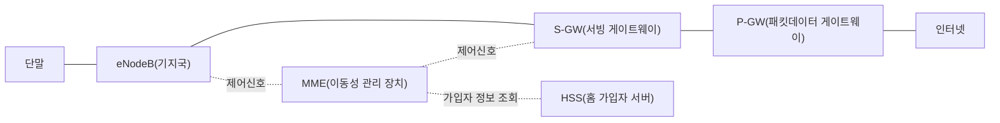
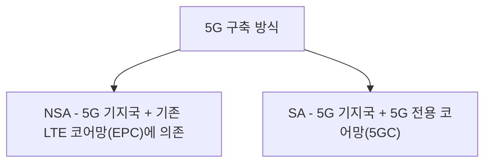
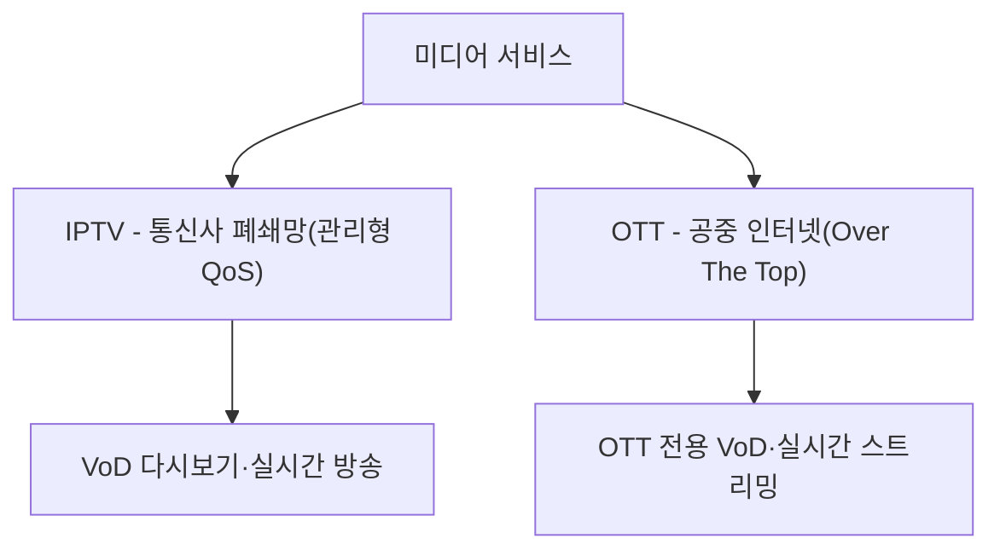
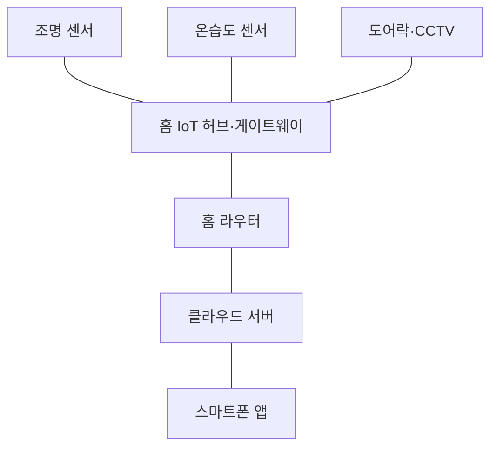

<Callout type="info">
  **이번 문서의 목표:** 3G·LTE·5G 코어망을 구성하는 장비의 역할을 구분하고, 정지궤도 위성의 왕복 전파지연을 광속으로 직접 계산하며, IPTV·OTT·VoD 서비스의 네트워크 구조 차이와 IoT 기반 스마트홈의 동작 구조를 설명할 수 있게 된다.
</Callout>

## 이 편이 다루는 범위

18편에서 라우팅과 이중화, 통신사 전송망 기술(SDH·MPLS·WDM)을 다뤘다면, 이 편은 그 전송망 위에서 실제로 서비스가 돌아가는 세 가지 큰 축, 즉 **이동통신망의 코어(핵심) 구조**, **위성통신망**, **가정으로 들어오는 미디어·IoT 서비스**를 다룹니다. 13편에서는 이동통신 "단말"(휴대폰 자체)의 세대별 특징을 다뤘지만, 이 편은 그 단말이 실제로 연결되는 **네트워크 뒤편의 구조**에 초점을 맞춥니다.

> **쉽게 말하면:** 13편이 "내 손에 든 스마트폰이 무엇을 할 수 있는가"였다면, 이 편은 "그 스마트폰의 신호가 어느 장비들을 거쳐 인터넷까지 도달하는가"입니다.

## 1. 이동통신망 개요 — 3G·LTE·5G 네트워크 구조

### 3G — 회선교환과 패킷교환이 공존하는 과도기

3G(WCDMA·CDMA2000, 13편 참고)의 코어망은 음성 통화를 위한 **회선교환 영역**(CS Domain, Circuit Switched Domain)과 데이터를 위한 **패킷교환 영역**(PS Domain, Packet Switched Domain)이 함께 존재하는 구조였습니다. 기지국(Node B)이 받은 신호는 **RNC**(Radio Network Controller, 무선망 제어기)로 모여, 음성이면 회선교환 코어로, 데이터면 패킷교환 코어로 나뉘어 처리되었습니다.

> **쉽게 말하면:** 3G는 "전화 전용 통로"와 "인터넷 전용 통로"가 코어망 안에서 아직 따로 나 있던 과도기 구조입니다.

### LTE(4G) — 전 구간 IP화(EPS)

**LTE**(Long Term Evolution)는 13편에서 다룬 것처럼 음성까지 IP 패킷으로 완전히 통합했습니다. 이를 가능하게 한 네트워크 구조가 **EPS**(Evolved Packet System, 진화된 패킷 시스템)입니다.

| 장비 | 이름 | 역할 |
|---|---|---|
| eNodeB(evolved Node B) | 기지국 | 단말과 무선 구간을 직접 연결, 3G의 Node B와 RNC 기능을 합친 역할 |
| MME(Mobility Management Entity) | 이동성 관리 장치 | 단말의 위치 추적, 인증, 세션(통신 연결) 설정을 담당하는 제어 전용 장비(사용자 데이터는 직접 지나가지 않음) |
| S-GW(Serving Gateway) | 서빙 게이트웨이 | 단말이 기지국을 옮겨 다녀도(핸드오버) 데이터 흐름이 끊기지 않게 중계 |
| P-GW(PDN Gateway) | 패킷데이터 게이트웨이 | 이동통신망과 외부 인터넷 사이의 출입구, 단말에 IP 주소를 할당 |
| HSS(Home Subscriber Server) | 홈 가입자 서버 | 가입자 정보(요금제·인증키 등)를 저장하는 중앙 데이터베이스 |

**왜 제어와 데이터를 분리하는가:** MME는 "누가, 어디에 있는지"를 관리하는 제어신호(control plane)만 처리하고, 실제 사용자 데이터(user plane)는 eNodeB–S-GW–P-GW 경로로만 흐릅니다. 이렇게 분리하면 제어 기능을 손보거나 이중화할 때 실제 데이터 전송 경로에 영향을 주지 않아, 망을 더 유연하고 안정적으로 운용할 수 있습니다.

### 5G — NSA와 SA

5G는 두 가지 구축 방식이 있습니다.

- **NSA**(Non-Standalone, 비단독 구조): 5G 기지국(gNB)이 새로 세워지지만, 제어신호 처리는 여전히 기존 LTE 코어망(EPC)에 의존하는 과도기 구조. 초기 5G 상용화 국가 대부분이 이 방식으로 시작했습니다.
- **SA**(Standalone, 단독 구조): 코어망까지 5G 전용(**5GC**, 5G Core)으로 새로 구축해, LTE에 의존하지 않고 5G 혼자서 완결된 구조.

5GC의 핵심 장비는 LTE의 MME·S-GW·P-GW 역할을 훨씬 잘게 나누고 이름도 바꿨습니다.

| 5GC 장비 | LTE의 대응 개념 | 역할 |
|---|---|---|
| AMF(Access and Mobility Management Function) | MME와 유사 | 단말의 접속·이동성 관리(제어 전용) |
| SMF(Session Management Function) | MME 일부 기능 분리 | 세션(통신 연결) 생성·관리 |
| UPF(User Plane Function) | S-GW+P-GW와 유사 | 실제 사용자 데이터를 전달하는 경로 |
| UDM(Unified Data Management) | HSS와 유사 | 가입자 정보 통합 관리 |

**자주 틀리는 점:** "5G 기지국만 세우면 곧바로 5G SA다"라고 오해하기 쉽지만, 무선 구간(RAN)에 5G 기지국(gNB)이 있어도 코어망이 여전히 LTE의 EPC라면 그것은 NSA입니다. 5G와 LTE를 가르는 핵심은 기지국의 종류가 아니라 **코어망이 5G 전용인지 여부**입니다. 5GC의 핵심 설계 철학은 각 기능(AMF·SMF·UPF 등)을 잘게 쪼갠 **네트워크 기능 가상화**(NFV) 구조로 만들어, 13편에서 다룬 네트워크 슬라이싱(서비스별로 가상망을 나누는 기술)을 더 유연하게 구현할 수 있게 한 것입니다.

## 2. 위성통신망 개요

### 궤도에 따른 위성의 분류

위성통신망은 위성이 도는 고도(지구 표면으로부터의 높이)에 따라 크게 세 가지로 나뉩니다.

| 궤도 | 이름 | 고도 | 특징 |
|---|---|---|---|
| GEO(Geostationary Earth Orbit) | 정지궤도 | 약 35,786km | 지구 자전과 같은 주기로 돌아 지상에서 보면 항상 같은 위치에 멈춰 있는 것처럼 보임, 위성 3대로 거의 전 지구를 커버 가능하지만 전파지연이 큼 |
| MEO(Medium Earth Orbit) | 중궤도 | 약 2,000–35,786km 사이 | GPS 등 위성항법시스템에 주로 사용, GEO보다 지연이 짧고 저궤도보다 커버리지가 넓음 |
| LEO(Low Earth Orbit) | 저궤도 | 약 500–2,000km | 지연이 매우 짧지만 지구를 빠르게 돌아 한 위성이 한 지역을 커버하는 시간이 짧음(수십–수백 개의 위성군, 컨스텔레이션 필요) |

> **쉽게 말하면:** GEO는 하늘에 못박힌 듯 고정된 대신 멀어서 신호가 늦게 오가고, LEO는 가까워서 빠르지만 계속 움직이므로 여러 대가 릴레이하듯 돌아가며 커버해야 합니다.

### 정지궤도 위성의 전파지연 계산

GEO 위성은 고도가 매우 높아, 신호가 빛의 속도로 이동해도 지연이 눈에 띄게 느껴집니다. 실제로 얼마나 걸리는지 계산해 보겠습니다. 빛(전파)의 속도는 $c = 3 \times 10^8\ \text{m/s}$로 둡니다.

**1단계 — 고도를 미터 단위로 바꿉니다.**

$$
d = 35{,}786\ \text{km} = 35{,}786{,}000\ \text{m}
$$

**2단계 — 편도(지상국 → 위성, 또는 위성 → 지상국) 전파시간을 구합니다.**

$$
t_{one} = \frac{d}{c} = \frac{35{,}786{,}000}{3 \times 10^8} \approx 0.1193\ \text{s} = 119.3\ \text{ms}
$$

**3단계 — 한 번의 "홉"(지상국 A → 위성 → 지상국 B)에 걸리는 시간을 구합니다.**

$$
t_{hop} = 2 \times t_{one} = 2 \times 119.3 \approx 238.6\ \text{ms}
$$

**4단계 — 통화처럼 응답까지 왕복하는 데 걸리는 시간을 구합니다.** A가 말한 신호가 위성을 거쳐 B에게 가고(한 홉), B의 반응이 다시 위성을 거쳐 A에게 돌아오는(또 한 홉) 상황을 가정합니다.

$$
t_{round} = 2 \times t_{hop} \approx 2 \times 238.6 \approx 477.2\ \text{ms}
$$

**해석:** 정지궤도 위성 통신은 한 번 신호가 오가는 데만 약 239밀리초, 대화하듯 응답이 왕복하는 데는 약 0.48초 가까이 걸립니다. 이 정도의 지연은 일반 유선전화(수 밀리초 수준)와 비교하면 사람이 체감할 수 있는 수준이라, 위성전화 통화 시 상대방과 말이 살짝 겹치는 듯한 어색함을 느끼는 이유가 바로 이 물리적인 거리 때문입니다. 같은 이유로 GEO 위성은 온라인 게임처럼 초저지연이 필요한 서비스에는 부적합하고, 방송 중계·기상 관측처럼 왕복 응답이 급하지 않은 서비스에 적합합니다.

**자주 틀리는 점:** 이 계산은 위성이 정확히 지상국 머리 위에 있다고 가정한 최소값입니다. 실제로는 지상국에서 위성을 비스듬히 올려다보는 경우가 많아 실제 거리(사선 거리)가 고도보다 더 길어지고, 실측 지연은 이 계산값보다 조금 더 큽니다. 시험에서는 이 최소 지연 개념(고도 약 3만 6천 킬로미터, 왕복 약 0.5초 안팎)을 이해하고 있는지를 묻습니다.

### 위성통신의 주파수 대역과 다중접속

위성통신도 09~11편에서 다룬 전자기파 스펙트럼과 다중접속 기술을 그대로 활용합니다.

| 대역 | 주파수 범위 | 특징 |
|---|---|---|
| C 대역 | 4–8GHz | 강우 감쇠가 적어 안정적이지만 지상 마이크로파와 간섭 가능성 |
| Ku 대역 | 12–18GHz | 가정용 위성방송 수신 안테나 크기를 작게 만들 수 있음 |
| Ka 대역 | 26–40GHz | 매우 넓은 대역폭으로 대용량 전송 가능하지만 비·눈에 의한 감쇠(우적감쇠)에 취약 |

다중접속 방식은 11편에서 다룬 FDMA·TDMA·CDMA가 위성통신에도 그대로 적용되어, 하나의 위성 중계기를 여러 지상국이 주파수·시간·코드로 나눠 씁니다.

## 3. 홈네트워크 미디어 서비스 — IPTV·VoIP·VoD·OTT

13편에서 CATV·IPTV의 전달 방식 차이와 셋톱박스의 역할을 다뤘습니다. 이 절에서는 그 위에서 제공되는 **서비스 형태**의 차이에 집중합니다.

### 폐쇄망 서비스와 공중 인터넷 서비스

| 서비스 | 전달망 | 품질 보장 | 대표 예시 |
|---|---|---|---|
| IPTV | 통신사가 직접 관리하는 폐쇄형 IP망 | 통신사가 대역폭·우선순위(QoS)를 보장 | 통신사 제공 셋톱박스 서비스 |
| OTT(Over The Top) | 공중 인터넷(가입자가 이미 쓰는 일반 인터넷 회선) | 통신사가 품질을 보장하지 않음, 서비스 자체의 적응형 스트리밍 기술로 대응 | 인터넷 동영상 스트리밍 서비스 |

**OTT라는 이름의 유래:** "Over The Top"은 셋톱박스(Top, 그 위에 얹힌 장치라는 뜻에서 유래) 같은 통신사의 폐쇄적 전용 장비·망을 거치지 않고, 그 위(공중 인터넷)를 통해 직접 서비스를 제공한다는 의미에서 붙은 이름입니다.

> **쉽게 말하면:** IPTV는 통신사가 전용 도로(폐쇄망)를 깔아 주고 그 위로만 다니는 방송버스이고, OTT는 이미 있는 일반 도로(공중 인터넷)를 그냥 이용해 달리는 자율 배송 트럭입니다.

**VoD**(Video On Demand, 주문형 비디오)는 IPTV·OTT 모두에서 제공하는 서비스 형태로, 정해진 편성표 없이 시청자가 원하는 시점에 원하는 콘텐츠를 요청해 재생하는 방식입니다. **자주 틀리는 점:** VoD를 특정 회사의 서비스 이름으로 착각하는 경우가 있는데, VoD는 IPTV·OTT를 가리지 않고 쓰이는 **서비스 방식의 이름**입니다.

**적응형 스트리밍(adaptive streaming):** OTT는 품질을 통신사가 보장해 주지 않으므로, 재생 중에도 사용자의 실시간 대역폭을 계속 측정해 화질(비트레이트)을 자동으로 올리거나 낮추는 기술을 씁니다. 이 기술 덕분에 일반 인터넷망만으로도 끊김을 최소화하며 서비스를 유지할 수 있습니다.

## 4. IoT 기반 스마트홈

### 스마트홈의 기본 구조

**스마트홈**(smart home)은 조명·냉난방·보안 센서 등 집 안의 기기들을 네트워크로 연결해 원격·자동으로 제어하는 시스템입니다. 13편에서 다룬 Zigbee·BLE 같은 IoT 무선 기술이 이 구조의 "말단 연결" 역할을 합니다.

- **센서·액추에이터**(actuator, 실제로 움직이거나 켜고 끄는 장치): 조명·온습도계·도어락 등 각 기기 자체.
- **홈 IoT 허브(게이트웨이)**: Zigbee·BLE 같은 저전력 근거리 프로토콜로 여러 센서를 모으고, 이를 표준 IP 프로토콜로 변환해 홈 라우터로 전달하는 중계 장치. 서로 다른 제조사·프로토콜의 기기를 하나의 시스템으로 묶는 역할을 합니다.
- **클라우드 서버**: 사용자의 설정·자동화 규칙(예: "오후 6시가 되면 조명을 켠다")을 저장하고, 외부에서도 스마트폰 앱으로 집 안 기기를 제어할 수 있게 중계합니다.

**왜 허브가 필요한가:** 조명 하나하나가 직접 인터넷에 연결되면 각 기기에 IP 주소 관리·보안 패치 부담이 커지고 배터리 소모도 빠릅니다. 허브가 저전력 프로토콜을 대신 처리하고 인터넷 연결은 허브 하나만 책임지면, 개별 센서는 훨씬 단순하고 저렴하며 오래가는 배터리로 동작할 수 있습니다.

> **쉽게 말하면:** 스마트홈 허브는 여러 나라 말(Zigbee·BLE·Wi-Fi)을 쓰는 기기들 사이에서 통역해 주는 관리인입니다.

**자주 틀리는 점:** 모든 스마트 기기가 각자 Wi-Fi로 직접 인터넷에 붙는다고 생각하기 쉽지만, 배터리로 동작하는 저전력 센서(도어 센서, 온습도계 등)는 대개 Zigbee·BLE 같은 저전력 프로토콜로 허브에만 연결되고, 허브만 Wi-Fi나 이더넷으로 인터넷에 연결되는 계층적 구조가 일반적입니다.

## 핵심 정리

- 3G는 회선교환·패킷교환 영역이 공존했고, LTE는 EPS(eNodeB+MME+S-GW+P-GW+HSS)로 전 구간을 IP화했으며, 5G는 NSA(LTE 코어 의존)와 SA(5G 전용 코어 5GC) 두 방식으로 구축된다.
- 정지궤도(GEO) 위성은 고도 약 35,786킬로미터로 편도 지연 약 119밀리초, 왕복 약 0.48초에 이르며, 이 값은 $d/c$ 계산으로 직접 구할 수 있다.
- IPTV는 통신사가 관리하는 폐쇄망에서 품질을 보장받고, OTT는 공중 인터넷 위에서 적응형 스트리밍으로 대응하며, VoD는 두 서비스 모두에서 쓰이는 주문형 재생 방식의 이름이다.
- 스마트홈은 저전력 센서가 허브(게이트웨이)에 Zigbee·BLE로 모이고, 허브만 인터넷에 연결되는 계층적 구조로 배터리 수명과 관리 부담을 줄인다.

## 마무리 복습

<Quiz
  questionNumber={1}
  question="LTE(4G)의 EPS 구조에서 MME(이동성 관리 장치)에 대한 설명으로 가장 적절한 것은?"
  options={['사용자 데이터가 직접 지나가는 경로를 담당한다', '단말의 위치 추적·인증·세션 설정 등 제어신호만 처리한다', '외부 인터넷과의 출입구 역할을 하며 IP 주소를 할당한다', '가입자의 요금제·인증키를 저장하는 데이터베이스다']}
  correctAnswer={2}
  explanation="MME는 사용자 데이터가 아니라 단말의 위치 추적, 인증, 세션 설정 같은 제어신호만 전담하는 장비다."
  optionExplanations={['사용자 데이터 경로는 eNodeB-S-GW-P-GW로 흐르며 MME는 관여하지 않는다.', '제어신호만 전담한다는 MME의 역할을 정확히 설명한다.', '외부 인터넷 출입구 역할은 P-GW의 기능이다.', '가입자 정보 데이터베이스는 HSS의 역할이다.']}
/>

<Quiz
  questionNumber={2}
  question="5G의 NSA(Non-Standalone)와 SA(Standalone) 구조를 구분하는 핵심 기준은?"
  options={['기지국이 5G 기지국(gNB)인지 여부', '코어망이 5G 전용(5GC)인지, 기존 LTE 코어망(EPC)에 의존하는지 여부', '단말이 5G 스마트폰인지 여부', '주파수 대역이 Sub-6GHz인지 밀리미터파인지 여부']}
  correctAnswer={2}
  explanation="NSA와 SA를 가르는 핵심은 무선 기지국의 종류가 아니라 코어망이 5G 전용(5GC)인지, 여전히 LTE의 EPC에 의존하는지 여부다."
  optionExplanations={['NSA도 5G 기지국(gNB)을 사용하므로 기지국 종류만으로는 구분되지 않는다.', '코어망이 5G 전용인지 여부가 NSA와 SA를 가르는 정확한 기준이다.', '단말의 종류는 NSA·SA 구분 기준이 아니다.', '주파수 대역은 NSA·SA 구분과 직접 관련이 없다.']}
/>

<Quiz
  questionNumber={3}
  question="고도 약 35,786킬로미터인 정지궤도(GEO) 위성과의 편도 전파지연을 광속 3x10의 8제곱 미터매초로 계산한 값에 가장 가까운 것은?"
  options={['약 1.2밀리초', '약 11.9밀리초', '약 119.3밀리초', '약 1193밀리초']}
  correctAnswer={3}
  explanation="35,786,000미터를 3x10의 8제곱 미터매초로 나누면 약 0.1193초, 즉 약 119.3밀리초가 된다."
  optionExplanations={['자릿수가 실제 계산값보다 100배 작다.', '자릿수가 실제 계산값보다 10배 작다.', '거리를 광속으로 나눈 값과 정확히 일치한다.', '자릿수가 실제 계산값보다 10배 크다.']}
/>

<Quiz
  questionNumber={4}
  question="GEO·MEO·LEO 위성 궤도를 비교한 설명으로 옳지 않은 것은?"
  options={['GEO는 지구 자전 주기와 같아 지상에서 항상 같은 위치에 있는 것처럼 보인다', 'LEO는 고도가 낮아 전파지연이 짧지만 한 위성의 커버 시간이 짧아 다수의 위성이 필요하다', 'MEO는 GPS 같은 위성항법시스템에 주로 사용된다', 'GEO는 고도가 낮아 왕복 전파지연이 LEO보다 훨씬 짧다']}
  correctAnswer={4}
  explanation="GEO는 오히려 고도가 가장 높아(약 35,786km) 왕복 전파지연이 LEO보다 훨씬 길다."
  optionExplanations={['GEO의 정지궤도 특성에 대한 정확한 설명이다.', 'LEO의 짧은 지연과 다수 위성 필요성에 대한 정확한 설명이다.', 'MEO가 GPS 등 위성항법에 쓰인다는 설명은 정확하다.', 'GEO는 고도가 가장 높아 지연이 가장 길므로 이 설명이 옳지 않다.']}
/>

<Quiz
  questionNumber={5}
  question="IPTV와 OTT를 비교한 설명으로 가장 적절한 것은?"
  options={['IPTV는 공중 인터넷을 사용하고 OTT는 통신사 폐쇄망을 사용한다', 'IPTV는 통신사가 대역폭과 품질을 관리하는 폐쇄망을 쓰고, OTT는 공중 인터넷 위에서 적응형 스트리밍으로 대응한다', 'VoD는 IPTV에서만 제공되고 OTT에서는 제공되지 않는다', 'OTT는 반드시 셋톱박스를 통해서만 시청할 수 있다']}
  correctAnswer={2}
  explanation="IPTV는 통신사가 관리하는 폐쇄망에서 품질을 보장받고, OTT는 통신사가 품질을 보장하지 않는 공중 인터넷 위에서 적응형 스트리밍 기술로 대응한다."
  optionExplanations={['전달망이 반대로 설명되어 있다. IPTV가 폐쇄망, OTT가 공중 인터넷이다.', 'IPTV와 OTT의 전달망과 품질 보장 방식 차이를 정확히 설명한다.', 'VoD는 IPTV·OTT 모두에서 제공되는 서비스 방식이다.', 'OTT는 셋톱박스뿐 아니라 스마트폰·PC 등 다양한 기기에서 시청할 수 있다.']}
/>

<Quiz
  questionNumber={6}
  question="스마트홈에서 홈 IoT 허브(게이트웨이)의 역할로 가장 적절한 것은?"
  options={['모든 센서가 각자 직접 인터넷에 연결되도록 IP 주소를 나눠준다', 'Zigbee·BLE 같은 저전력 프로토콜을 표준 IP 프로토콜로 변환해 여러 기기를 중계한다', '위성통신을 통해 스마트홈 기기를 원격 제어한다', '오직 CCTV 영상만 저장하는 전용 저장장치다']}
  correctAnswer={2}
  explanation="홈 IoT 허브는 Zigbee·BLE 같은 저전력 근거리 프로토콜로 모인 센서 신호를 표준 IP 프로토콜로 변환해 홈 라우터로 중계하는 역할을 한다."
  optionExplanations={['개별 센서가 직접 인터넷에 연결되는 것이 아니라 허브를 거쳐 연결되는 구조가 일반적이다.', '저전력 프로토콜과 IP 프로토콜 사이의 중계라는 허브의 핵심 역할을 정확히 설명한다.', '스마트홈 제어는 위성통신이 아니라 일반적으로 홈 라우터와 인터넷을 통해 이루어진다.', '허브는 CCTV뿐 아니라 조명·온습도 등 다양한 센서를 함께 관리한다.']}
/>

<Quiz
  questionNumber={7}
  question="위성통신에서 사용하는 주파수 대역에 대한 설명으로 가장 적절한 것은?"
  options={['C 대역은 우적감쇠에 가장 취약해 거의 사용하지 않는다', 'Ku 대역은 가정용 위성방송 수신 안테나를 작게 만들 수 있게 해준다', 'Ka 대역은 대역폭이 좁아 대용량 전송에 부적합하다', '위성통신에는 다중접속 기술이 적용되지 않는다']}
  correctAnswer={2}
  explanation="Ku 대역은 C 대역보다 높은 주파수를 사용해 가정용 위성방송 수신 안테나의 크기를 작게 만들 수 있다는 특징이 있다."
  optionExplanations={['우적감쇠에 취약한 것은 오히려 더 높은 주파수인 Ka 대역이다.', 'Ku 대역이 소형 안테나 사용을 가능하게 한다는 설명이 정확하다.', 'Ka 대역은 오히려 매우 넓은 대역폭으로 대용량 전송이 가능하다.', '위성통신도 FDMA·TDMA·CDMA 같은 다중접속 기술을 그대로 활용한다.']}
/>

## 참고 자료

- [계명대학교 게시판 - 정보통신기사 출제기준(필기·실기) PDF (2026.1.1.~2028.12.31. 적용)](https://cms.kmu.ac.kr/bbs/computer/763/172569/download.do)
- [가천대학교 게시판 - 정보통신기사 출제기준(필기·실기) PDF (2025.1.1.~2025.12.31. 적용, 구버전)](https://www.gachon.ac.kr/bbs/kwcivil/981/118904/download.do)
- [한국방송통신전파진흥원(KCA) - 출제기준 자료실](https://www.cq.or.kr/qh_cusgm10_001.do)
