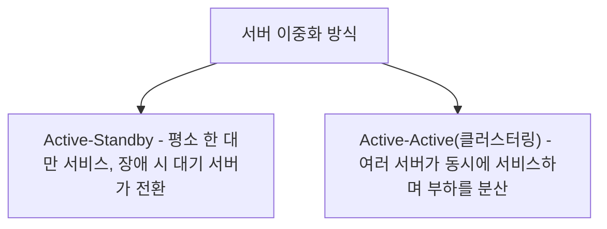
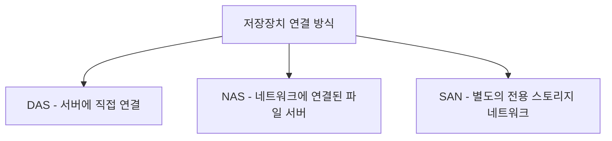
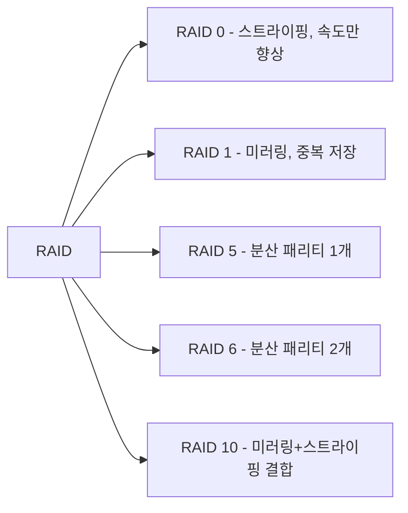

<Callout type="info">
  **이번 문서의 목표:** 서버 이중화 구성과 백업 방식(풀·증분·차등)의 용량 차이를 계산하고, RTO·RPO로 장애복구 목표를 세우며, DBMS의 개념과 종류를 구분하고, DAS·NAS·SAN의 차이와 RAID 레벨별 사용 가능 용량을 손으로 계산할 수 있게 된다.
</Callout>

## 이 편이 다루는 범위

04편에서 CPU·기억장치·운영체제(OS)의 기본 개념을, 05편에서 IP·클라이언트-서버 구조의 최소 어휘를 다뤘습니다. 이 편은 그 위에서 실제로 서비스를 돌리는 **서버**를 어떻게 구축하고, 장애에 대비해 이중화·백업하며, 데이터를 어디에 저장하는지를 다룹니다. 실무·시험 모두에서 "서버가 죽으면 어떻게 되는가"와 "데이터가 사라지면 얼마나 되돌릴 수 있는가"라는 질문에 숫자로 답할 수 있어야 합니다.

> **쉽게 말하면:** 04·05편이 컴퓨터와 네트워크의 최소 단어장이었다면, 이 편은 "그 컴퓨터를 실제로 서비스가 안 끊기게, 데이터도 안 잃어버리게 운영하는 방법"입니다.

## 1. 리눅스·윈도 서버 구축과 보안 설정

### 서버 운영체제 선택과 서비스 구조

서버용 운영체제는 크게 **리눅스**(Linux, 오픈소스 기반)와 **윈도 서버**(Windows Server)로 나뉩니다. 04편에서 다룬 것처럼 운영체제는 프로세스·기억장치·파일시스템을 관리하는 소프트웨어인데, 서버용 OS는 여기에 더해 여러 사용자·프로세스가 동시에 안정적으로 오래(때로는 몇 년씩 재부팅 없이) 돌아가야 한다는 요구사항이 추가됩니다.

| 구분 | 리눅스 | 윈도 서버 |
|---|---|---|
| 라이선스 | 대부분 무료(오픈소스) | 유료 라이선스 |
| 관리 방식 | 명령줄(CLI) 중심, 스크립트 자동화에 유리 | 그래픽 인터페이스(GUI) 중심, 초보자 접근이 쉬움 |
| 대표 활용 | 웹서버·DB서버·컨테이너 호스트(21편 참고) | 사내 업무용 서버(파일·인쇄·인증 서버) |

서버에서 실제로 서비스를 제공하는 프로그램을 리눅스에서는 **데몬**(daemon, 백그라운드에서 조용히 대기하며 요청이 오면 처리하는 프로세스), 윈도에서는 **서비스**(service)라 부릅니다. 둘 다 04편에서 다룬 "프로세스" 개념의 특수한 형태로, 사용자가 로그인하지 않아도 시스템이 켜져 있는 동안 계속 대기합니다.

### 서버 보안 설정의 기본 원칙

- **최소 권한 원칙**(least privilege): 계정마다 업무에 꼭 필요한 권한만 부여한다. 관리자(root, Administrator) 계정은 평상시 업무에 쓰지 않고 별도 계정을 쓴다.
- **패치 관리**: 운영체제·서비스 소프트웨어의 보안 취약점 패치를 정기적으로 적용한다.
- **불필요한 서비스 제거**: 쓰지 않는 데몬·서비스는 꺼서 공격 대상 자체(공격 표면, attack surface)를 줄인다.
- **접근 통제**: 방화벽으로 필요한 포트(16편에서 다룬 전달계층 포트 주소)만 열어 둔다. 세부적인 침입탐지·차단 장비(IDS·IPS)는 23편에서 다룹니다.

> **쉽게 말하면:** 서버 보안의 기본은 "문을 다 열어두고 위험한 것만 막는" 것이 아니라 "꼭 필요한 문만 열어두고 나머지는 아예 잠가 두는" 것입니다.

## 2. 이중화·백업·장애복구

### 서버 이중화 구성

17·18편에서 스위치·라우터의 이중화(STP, HSRP 등)를 다뤘다면, 서버도 같은 원리로 이중화합니다.

- **Active-Standby**: 평소에는 Active 서버 한 대만 실제 서비스를 제공하고, Standby 서버는 데이터를 실시간으로 복제받으며 대기하다가 Active에 장애가 나면 그 역할을 이어받습니다. 18편의 HSRP Active/Standby 구조와 같은 발상입니다.
- **Active-Active(클러스터링, clustering)**: 여러 서버가 동시에 요청을 나눠 처리합니다. 한 대가 죽어도 나머지가 계속 서비스하고, 평소에도 자원을 고르게 씁니다(18편의 GLBP와 같은 발상).

### 백업 유형과 용량 계산

**백업**(backup)은 데이터를 별도의 저장 공간에 복제해 두어, 원본이 손상되어도 복구할 수 있게 하는 절차입니다. 세 가지 방식이 있습니다.

| 방식 | 저장 내용 | 백업 속도 | 복구 속도 |
|---|---|---|---|
| 풀백업(full backup) | 전체 데이터 전부 | 느림(매번 전부 복사) | 빠름(파일 하나만 복원) |
| 증분백업(incremental backup) | 직전 백업(풀 또는 증분) 이후 바뀐 데이터만 | 빠름 | 느림(풀백업 + 여러 증분백업을 순서대로 모두 적용) |
| 차등백업(differential backup) | 마지막 풀백업 이후 바뀐 데이터 전부(누적) | 증분보다 느리지만 풀보다 빠름 | 증분보다 빠름(풀백업 + 최신 차등백업 1개만 적용) |

> **쉽게 말하면:** 증분백업은 "어제 이후로 바뀐 것만" 매번 저장하고, 차등백업은 "지난주 일요일 이후로 바뀐 것 전부"를 매번 다시 저장합니다.

**손계산 — 일주일간 백업 용량 비교.** 일요일에 500GB 전체를 풀백업하고, 매일 데이터의 5퍼센트(25GB)씩 새로 바뀐다고 가정합니다(요일마다 서로 다른 데이터가 바뀐다고 단순화).

**1단계 — 하루 변경량을 구합니다.**

$$
500\text{GB} \times 0.05 = 25\text{GB}
$$

**2단계 — 증분백업 용량(매일 그날 바뀐 양만)을 구합니다.**

| 요일 | 증분백업 용량 |
|---|---|
| 월 | 25GB |
| 화 | 25GB |
| 수 | 25GB |

증분백업은 매번 직전 백업 이후의 변경분만 저장하므로 매일 25GB로 일정합니다.

**3단계 — 차등백업 용량(일요일 풀백업 이후 누적)을 구합니다.**

| 요일 | 차등백업 용량(누적) |
|---|---|
| 월 | $25\text{GB}$ |
| 화 | $25 + 25 = 50\text{GB}$ |
| 수 | $50 + 25 = 75\text{GB}$ |

**해석:** 증분백업은 매일 저장 용량이 일정해 백업 자체는 가장 효율적이지만, 수요일에 장애가 나서 복구하려면 일요일 풀백업 + 월요일 증분 + 화요일 증분 + 수요일 증분까지 네 개의 백업본을 순서대로 모두 복원해야 합니다. 반대로 차등백업은 매일 용량이 계속 불어나지만, 복구할 때는 일요일 풀백업 + 수요일 차등백업(75GB, 누적본이므로 그날치 하나만) 두 개만 있으면 됩니다.

**자주 틀리는 점:** "증분백업이 무조건 더 좋다"고 단정하기 쉽지만, 백업 용량·속도와 복구 절차의 단순함은 서로 맞바꾸는 관계(트레이드오프)입니다. 백업이 잦고 복구를 자주 연습하지 않는 환경이라면, 절차가 단순한 차등백업이나 풀백업이 오히려 안전한 선택이 될 수 있습니다.

### 장애복구 목표 — RTO와 RPO

| 지표 | 이름 | 의미 |
|---|---|---|
| RTO(Recovery Time Objective) | 목표 복구 시간 | 장애 발생 후 서비스를 다시 정상화하기까지 허용하는 최대 시간 |
| RPO(Recovery Point Objective) | 목표 복구 시점 | 장애 발생 시 되돌릴 수 있는(즉, 잃어버려도 되는) 데이터의 최대 시간 범위 |

**적용 예시.** 매일 새벽 2시에 풀백업을 하는 서버에서 오전 9시에 장애가 발생했다고 합시다. 이 경우 새벽 2시 이후 오전 9시까지 쌓인 7시간치 데이터는 최신 백업본에 없으므로 복구 시 사라질 수 있습니다. 이 손실 가능 범위(7시간)가 바로 RPO에 해당합니다. 만약 조직이 정한 목표 RPO가 "최대 4시간"이라면, 하루 한 번의 백업 주기로는 목표를 만족할 수 없으므로 백업 주기를 6시간 또는 4시간 단위로 더 짧게 조정해야 합니다.

> **쉽게 말하면:** RTO는 "얼마나 빨리 복구해야 하는가"(시간의 문제)이고, RPO는 "얼마나 최근 데이터까지 살릴 수 있어야 하는가"(백업 주기의 문제)입니다.

## 3. DBMS의 개념과 종류

**DBMS**(DataBase Management System, 데이터베이스 관리 시스템)는 데이터를 체계적으로 저장·조회·수정·삭제할 수 있게 관리하는 소프트웨어입니다. 파일을 직접 다루는 대신 DBMS를 쓰는 이유는, 여러 사용자가 동시에 접근해도 데이터가 꼬이지 않게(동시성 제어) 하고, 정전 같은 장애 중에도 데이터 일관성을 지키기 위해서입니다.

### RDBMS와 NoSQL

| 구분 | RDBMS(관계형 DBMS) | NoSQL(비관계형 DBMS) |
|---|---|---|
| 데이터 구조 | 행과 열로 이루어진 표(테이블) | 문서·키-값·그래프 등 다양한 구조 |
| 스키마 | 미리 정해진 구조(스키마)를 지켜야 함 | 스키마가 유연하거나 없음 |
| 강점 | 트랜잭션의 정확성(ACID)이 중요한 업무(금융·회원정보) | 대용량·비정형 데이터의 빠른 저장·조회(로그·소셜미디어 데이터) |

**ACID**는 트랜잭션(transaction, 데이터베이스에서 "하나의 작업 단위로 묶인" 여러 연산)이 안전하게 처리되기 위해 지켜야 할 네 가지 성질의 앞 글자입니다.

- **원자성**(Atomicity): 트랜잭션 안의 연산은 전부 성공하거나 전부 실패한다(중간에 일부만 반영되지 않는다).
- **일관성**(Consistency): 트랜잭션 전후로 데이터베이스는 정해진 규칙(제약조건)을 항상 만족한다.
- **고립성**(Isolation): 동시에 실행되는 여러 트랜잭션이 서로의 중간 결과에 영향을 주지 않는다.
- **지속성**(Durability): 트랜잭션이 성공적으로 끝나면, 그 결과는 정전 등 장애가 나도 사라지지 않는다.

**자주 틀리는 점:** "NoSQL은 관계형보다 무조건 더 나은 최신 기술"이라는 오해가 흔한데, NoSQL은 ACID의 일부를 완화하는 대신 대규모 분산 환경에서의 확장성과 유연성을 얻은 것이지, 모든 상황에서 RDBMS를 대체하는 상위호환이 아닙니다. 계좌 이체처럼 정확성이 절대적으로 중요한 업무는 여전히 RDBMS가 표준입니다.

## 4. 저장장치 — DAS·NAS·SAN과 RAID

### DAS·NAS·SAN 비교

| 구분 | 이름 | 연결 방식 | 특징 |
|---|---|---|---|
| DAS(Direct Attached Storage) | 직접연결저장장치 | 서버에 케이블로 직접 연결 | 구성이 간단하고 속도가 빠르지만, 그 서버만 사용 가능(공유 어려움) |
| NAS(Network Attached Storage) | 네트워크연결저장장치 | 일반 이더넷 네트워크에 연결된 전용 파일 서버 | 여러 사용자·서버가 파일 단위로 쉽게 공유, 설치가 간편 |
| SAN(Storage Area Network) | 스토리지 전용 네트워크 | 별도의 고속 전용 네트워크(주로 광채널)로 스토리지만 연결 | 블록 단위로 접근해 DB 서버 등 고성능이 필요한 환경에 적합, 구축 비용이 높음 |

**자주 틀리는 점:** NAS와 SAN을 "둘 다 네트워크로 연결하니 같다"고 뭉뚱그리기 쉬운데, NAS는 파일 단위(파일 이름으로 읽고 쓰기)로 접근하고 SAN은 블록 단위(하드디스크의 물리적 저장 단위)로 접근한다는 근본적인 차이가 있습니다. 그래서 SAN은 서버 입장에서 마치 자신에게 직접 연결된 디스크(DAS)처럼 보입니다.

### RAID 개념과 레벨

**RAID**(Redundant Array of Independent Disks, 독립적인 디스크의 중복 배열)는 여러 개의 물리적 디스크를 묶어 하나의 논리적인 저장 장치처럼 쓰면서, 속도를 높이거나 디스크 한두 개가 고장 나도 데이터를 지킬 수 있게 하는 기술입니다.

| RAID 레벨 | 원리 | 최소 디스크 수 | 사용 가능 용량(N=디스크 수, S=디스크 1개 용량) | 내결함성 |
|---|---|---|---|---|
| RAID 0 | 스트라이핑(데이터를 여러 디스크에 쪼개 동시에 읽고 씀) | 2 | $N \times S$ | 없음(디스크 1개만 고장 나도 전체 데이터 손실) |
| RAID 1 | 미러링(같은 데이터를 다른 디스크에 그대로 복제) | 2 | $S$(디스크 수와 무관, 항상 1개 분량) | 디스크 1개 고장까지 허용 |
| RAID 5 | 데이터 + 패리티(오류 검출·복구용 계산값) 1개 분량을 여러 디스크에 분산 저장 | 3 | $(N-1) \times S$ | 디스크 1개 고장까지 허용 |
| RAID 6 | RAID 5에 패리티를 하나 더 추가 | 4 | $(N-2) \times S$ | 디스크 2개 동시 고장까지 허용 |
| RAID 10(1+0) | 먼저 미러링한 쌍을 다시 스트라이핑 | 4 | $(N/2) \times S$ | 각 미러 쌍에서 1개씩 고장까지 허용 |

**손계산 1 — RAID 5.** 4TB짜리 디스크 5개로 RAID 5를 구성합니다.

**1단계 — 전체 원본 용량을 구합니다.**

$$
N \times S = 5 \times 4\text{TB} = 20\text{TB}
$$

**2단계 — 패리티로 쓰이는 용량(디스크 1개 분량)을 뺍니다.**

$$
(N - 1) \times S = (5 - 1) \times 4\text{TB} = 16\text{TB}
$$

**해석:** 원본 디스크 20테라바이트 중 4테라바이트(디스크 1개 분량)는 패리티(오류 복구용 계산값) 저장에 쓰이고, 실제 사용 가능한 용량은 16테라바이트입니다. 패리티는 특정 디스크 하나에 몰아서 저장되는 것이 아니라 5개 디스크에 고르게 분산되어, 디스크 아무거나 1개가 고장 나도 나머지 4개의 데이터와 패리티 값을 조합해 원래 데이터를 복구할 수 있습니다.

**손계산 2 — RAID 6.** 2TB짜리 디스크 6개로 RAID 6을 구성합니다.

**1단계 — 전체 원본 용량**

$$
N \times S = 6 \times 2\text{TB} = 12\text{TB}
$$

**2단계 — 패리티 용량(디스크 2개 분량)을 뺍니다.**

$$
(N - 2) \times S = (6 - 2) \times 2\text{TB} = 8\text{TB}
$$

**해석:** RAID 6은 패리티를 2개 분량 저장하므로 RAID 5보다 사용 가능 용량은 줄지만(12TB 중 8TB, 즉 원본의 약 66.7퍼센트), 디스크 2개가 동시에 고장 나도 데이터를 지킬 수 있습니다.

**손계산 3 — RAID 10.** 1TB짜리 디스크 8개로 RAID 10을 구성합니다.

**1단계 — 미러 쌍의 개수를 구합니다.**

$$
\frac{N}{2} = \frac{8}{2} = 4\text{쌍}
$$

**2단계 — 사용 가능 용량을 구합니다.**

$$
\frac{N}{2} \times S = 4 \times 1\text{TB} = 4\text{TB}
$$

**해석:** 8개의 1테라바이트 디스크를 RAID 10으로 묶으면, 절반인 4테라바이트만 실제로 쓸 수 있습니다. RAID 5·6보다 사용 가능 비율(용량 효율)은 낮지만, 미러링 기반이라 데이터를 읽고 쓸 때 패리티를 계산할 필요가 없어 속도가 빠르고, 각 미러 쌍에서 최대 1개씩(운이 나쁘지만 않으면 동시에 여러 개도) 디스크 고장을 허용합니다.

**자주 틀리는 점:** RAID 0을 "안전한 저장 방식"으로 오해하는 경우가 있는데, RAID 0은 **중복 저장이 전혀 없는** 속도 전용 구성입니다. 디스크 여러 개에 데이터를 쪼개 나눠 담기(스트라이핑) 때문에 디스크 하나만 고장 나도 전체 데이터를 잃습니다. "RAID(중복 배열)"라는 이름이 붙어 있지만 RAID 0 자체에는 중복이 없다는 점이 시험에서 자주 나오는 함정입니다.

## 핵심 정리

- 서버는 이중화를 Active-Standby(평소 한 대만 동작) 또는 Active-Active(여러 대가 동시에 부하 분산)로 구성한다.
- 증분백업은 매일 용량이 일정하지만 복구 시 여러 백업본을 순서대로 적용해야 하고, 차등백업은 용량이 누적되지만 복구는 풀백업과 최신 차등본 하나만 있으면 된다.
- RTO는 복구까지 걸려도 되는 시간, RPO는 잃어버려도 되는 데이터의 시간 범위이며, RPO 목표를 맞추려면 백업 주기를 그에 맞게 조정해야 한다.
- DBMS는 RDBMS(스키마 고정, ACID 트랜잭션)와 NoSQL(유연한 구조, 대규모 확장)로 나뉘며, 상황에 따라 선택이 달라진다.
- DAS는 직접 연결, NAS는 파일 단위 네트워크 공유, SAN은 블록 단위 전용 네트워크이며, RAID는 레벨에 따라 사용 가능 용량이 $N \times S$(RAID 0), $S$(RAID 1), $(N-1) \times S$(RAID 5), $(N-2) \times S$(RAID 6), $(N/2) \times S$(RAID 10)로 각각 계산된다.

## 마무리 복습

<Quiz
  questionNumber={1}
  question="리눅스의 데몬(daemon)과 윈도의 서비스(service)에 대한 설명으로 가장 적절한 것은?"
  options={['사용자가 로그인해야만 동작하는 화면 프로그램이다', '백그라운드에서 대기하며 요청이 오면 처리하는 프로세스로, 사용자 로그인 여부와 무관하게 동작한다', '서버 하드웨어 자체를 가리키는 용어다', '서버 이중화를 담당하는 전용 하드웨어 장치다']}
  correctAnswer={2}
  explanation="데몬과 서비스는 백그라운드에서 대기하다가 요청이 오면 처리하는 프로세스로, 사용자가 로그인하지 않아도 시스템이 켜져 있으면 계속 동작한다."
  optionExplanations={['로그인 여부와 무관하게 백그라운드에서 계속 동작하는 것이 데몬·서비스의 핵심 특징이다.', '사용자 로그인과 무관하게 동작하는 프로세스라는 설명이 정확하다.', '하드웨어가 아니라 소프트웨어 프로세스를 가리키는 용어다.', '이중화 전용 하드웨어가 아니라 일반적인 백그라운드 프로세스를 가리킨다.']}
/>

<Quiz
  questionNumber={2}
  question="풀백업 500GB를 일요일에 수행하고 매일 25GB씩 서로 다른 데이터가 바뀔 때, 수요일의 차등백업 용량으로 옳은 것은?"
  options={['25GB', '50GB', '75GB', '500GB']}
  correctAnswer={3}
  explanation="차등백업은 마지막 풀백업 이후 바뀐 데이터를 누적 저장하므로, 월(25)+화(25)+수(25)를 모두 더한 75GB가 수요일의 차등백업 용량이다."
  optionExplanations={['하루치 변경량만 반영한 값으로 증분백업의 용량에 해당한다.', '월요일과 화요일 변경분만 더한 값으로 수요일 변경분이 빠졌다.', '월·화·수 사흘간의 누적 변경량을 정확히 더한 값이다.', '전체 원본 용량을 그대로 쓴 값으로 차등백업의 정의와 다르다.']}
/>

<Quiz
  questionNumber={3}
  question="RTO(목표 복구 시간)와 RPO(목표 복구 시점)를 비교한 설명으로 가장 적절한 것은?"
  options={['RTO는 잃어버려도 되는 데이터의 시간 범위이고, RPO는 복구까지 걸려도 되는 시간이다', 'RTO는 복구까지 걸려도 되는 시간이고, RPO는 잃어버려도 되는 데이터의 시간 범위다', '둘 다 백업 용량을 의미하는 동일한 지표다', 'RPO를 짧게 하려면 백업 주기를 오히려 늘려야 한다']}
  correctAnswer={2}
  explanation="RTO는 장애 후 서비스를 정상화하기까지 허용되는 시간이고, RPO는 장애 시 잃어버려도 되는 데이터의 최대 시간 범위다."
  optionExplanations={['RTO와 RPO의 정의가 서로 뒤바뀐 설명이다.', 'RTO는 복구 시간, RPO는 손실 허용 데이터 범위라는 정의가 정확하다.', 'RTO·RPO는 용량이 아니라 시간 개념의 목표 지표다.', 'RPO를 짧게 하려면 백업 주기를 오히려 더 짧게 줄여야 한다.']}
/>

<Quiz
  questionNumber={4}
  question="ACID 중 트랜잭션 안의 연산이 전부 성공하거나 전부 실패해야 한다는 성질에 해당하는 것은?"
  options={['원자성(Atomicity)', '일관성(Consistency)', '고립성(Isolation)', '지속성(Durability)']}
  correctAnswer={1}
  explanation="원자성은 트랜잭션 안의 여러 연산이 중간 상태 없이 전부 성공하거나 전부 실패해야 한다는 성질이다."
  optionExplanations={['전부 성공 또는 전부 실패라는 정의와 정확히 일치하는 성질이다.', '일관성은 트랜잭션 전후로 제약조건을 만족해야 한다는 성질이다.', '고립성은 동시 실행 트랜잭션끼리 서로 영향을 주지 않아야 한다는 성질이다.', '지속성은 성공한 트랜잭션의 결과가 장애 후에도 사라지지 않아야 한다는 성질이다.']}
/>

<Quiz
  questionNumber={5}
  question="DAS·NAS·SAN을 비교한 설명으로 옳지 않은 것은?"
  options={['DAS는 서버에 직접 연결되어 다른 서버와 공유하기 어렵다', 'NAS는 파일 단위로 접근하는 네트워크 연결 저장장치다', 'SAN은 블록 단위로 접근하며 별도의 전용 네트워크로 구성된다', 'NAS와 SAN은 모두 블록 단위로 접근하므로 차이가 없다']}
  correctAnswer={4}
  explanation="NAS는 파일 단위로, SAN은 블록 단위로 접근한다는 근본적인 차이가 있으므로 둘이 같다는 설명은 옳지 않다."
  optionExplanations={['DAS는 서버에 직접 연결되어 다른 서버와의 공유가 어렵다는 설명이 정확하다.', 'NAS가 파일 단위로 접근한다는 설명은 정확하다.', 'SAN이 블록 단위 전용 네트워크라는 설명은 정확하다.', 'NAS는 파일 단위, SAN은 블록 단위로 접근 방식이 서로 다르므로 이 설명이 옳지 않다.']}
/>

<Quiz
  questionNumber={6}
  question="4TB 디스크 5개로 RAID 5를 구성했을 때 사용 가능한 용량은?"
  options={['4TB', '12TB', '16TB', '20TB']}
  correctAnswer={3}
  explanation="RAID 5의 사용 가능 용량은 (N-1)xS이며, (5-1)x4TB=16TB다."
  optionExplanations={['디스크 1개 분량만 남긴 값으로 계산이 틀렸다.', '패리티를 지나치게 많이 뺀 값이다.', '(5-1)x4TB를 정확히 계산한 값이다.', '패리티를 전혀 빼지 않은 전체 원본 용량이다.']}
/>

<Quiz
  questionNumber={7}
  question="2TB 디스크 6개로 RAID 6을 구성했을 때 사용 가능한 용량과 허용 가능한 동시 디스크 고장 개수로 옳은 것은?"
  options={['8TB, 디스크 1개 고장까지 허용', '8TB, 디스크 2개 고장까지 허용', '10TB, 디스크 1개 고장까지 허용', '12TB, 디스크 고장을 전혀 허용하지 않음']}
  correctAnswer={2}
  explanation="RAID 6의 사용 가능 용량은 (N-2)xS=(6-2)x2TB=8TB이며, 패리티 2개 분량 덕분에 디스크 2개가 동시에 고장 나도 데이터를 지킬 수 있다."
  optionExplanations={['용량은 맞지만 RAID 6은 디스크 2개까지 동시 고장을 허용한다.', '용량 8TB와 디스크 2개 동시 고장 허용이 모두 정확한 설명이다.', '용량 계산이 틀렸으며 허용 고장 개수도 실제와 다르다.', '패리티를 전혀 반영하지 않은 전체 원본 용량이며 RAID 6은 고장을 허용한다.']}
/>

<Quiz
  questionNumber={8}
  question="RAID 0에 대한 설명으로 가장 적절한 것은?"
  options={['패리티를 이용해 디스크 1개 고장까지 허용한다', '데이터를 여러 디스크에 쪼개 저장(스트라이핑)해 속도는 빠르지만 중복 저장이 없어 디스크 1개만 고장 나도 전체 데이터를 잃는다', '미러링으로 데이터를 완전히 복제해 가장 안전한 RAID 레벨이다', 'RAID라는 이름 그대로 모든 RAID 레벨 중 내결함성이 가장 높다']}
  correctAnswer={2}
  explanation="RAID 0은 스트라이핑으로 속도만 높이는 구성으로 중복 저장이 전혀 없어, 디스크 하나만 고장 나도 전체 데이터가 손실된다."
  optionExplanations={['RAID 0은 패리티를 사용하지 않으며 내결함성이 없다.', '스트라이핑의 속도 이점과 중복 저장이 없다는 위험성을 정확히 설명한다.', '미러링은 RAID 1에 대한 설명이며 RAID 0과는 다르다.', 'RAID 0은 오히려 내결함성이 전혀 없는 레벨이다.']}
/>

## 참고 자료

- [계명대학교 게시판 - 정보통신기사 출제기준(필기·실기) PDF (2026.1.1.~2028.12.31. 적용)](https://cms.kmu.ac.kr/bbs/computer/763/172569/download.do)
- [가천대학교 게시판 - 정보통신기사 출제기준(필기·실기) PDF (2025.1.1.~2025.12.31. 적용, 구버전)](https://www.gachon.ac.kr/bbs/kwcivil/981/118904/download.do)
- [한국방송통신전파진흥원(KCA) - 출제기준 자료실](https://www.cq.or.kr/qh_cusgm10_001.do)
