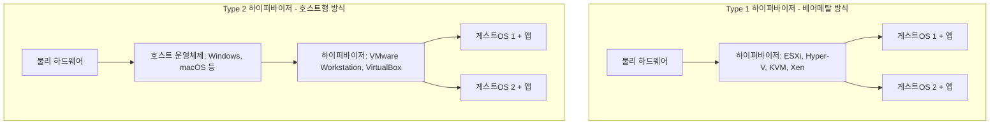
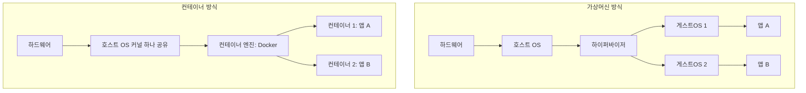
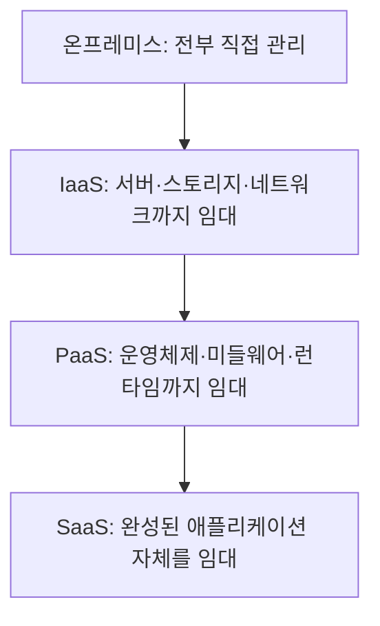
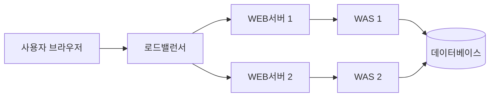

<Callout type="info">
  **이번 문서의 목표:** 하이퍼바이저 방식과 컨테이너 방식의 구조적 차이를 설명하고, 클라우드 컴퓨팅의 서비스 모델(IaaS·PaaS·SaaS)별로 누가 무엇을 관리하는지 구분하며, 가용성·백업·부하분산 수치를 직접 계산할 수 있게 된다.
</Callout>

## 물리서버 한 대로는 왜 부족한가

20편에서 리눅스·윈도 서버를 직접 구축하고 DAS(Direct Attached Storage, 직접연결저장장치)·NAS(Network Attached Storage, 네트워크연결저장장치)·SAN(Storage Area Network, 저장영역네트워크) 같은 저장장치와 RAID(Redundant Array of Independent Disks, 다중 디스크를 하나처럼 묶어 속도나 안전성을 높이는 방식)까지 다뤘습니다. 그런데 애플리케이션 하나를 위해 물리서버 한 대를 통째로 쓰면 CPU(중앙처리장치)와 메모리(memory) 사용률이 대개 10~20퍼센트 수준에 머물고 나머지는 그냥 놀립니다. 서버를 더 산다고 문제가 풀리지도 않습니다 — 서버가 늘수록 전력비·공간·냉각비·관리 인력이 함께 늘어나기 때문입니다.

> **쉽게 말하면:** 가상화는 컴퓨터 한 대를 여러 대인 것처럼 쪼개 쓰는 기술이고, 클라우드는 그렇게 쪼갠 컴퓨터 자원을 인터넷 너머에서 빌려 쓰는 서비스입니다.

## 1. 가상화의 종류와 하이퍼바이저

### 정의

**가상화**(virtualization)는 물리적인 컴퓨터 자원(CPU·메모리·저장장치·네트워크)을 논리적으로 나눠, 실제로는 한 대인 하드웨어를 여러 대의 독립된 가상 자원처럼 보이게 만드는 기술입니다. 가상화는 대상에 따라 몇 가지로 나뉩니다.

| 종류 | 가상화 대상 | 대표 예시 |
|------|-------------|-----------|
| 서버 가상화 | 물리서버 한 대를 여러 개의 가상머신(VM, Virtual Machine)으로 분할 | VMware ESXi, KVM |
| 스토리지 가상화 | 여러 저장장치를 하나의 논리적 저장 공간으로 통합 | SAN 스토리지 풀 |
| 네트워크 가상화 | 물리 네트워크 장비를 논리적으로 분할해 여러 가상 네트워크를 구성 | VLAN(가상근거리통신망), SDN(Software Defined Network, 소프트웨어정의네트워크) |
| 데스크톱 가상화 | 사용자 PC 환경을 서버에서 실행하고 화면만 단말로 전송 | VDI(Virtual Desktop Infrastructure, 가상 데스크톱 인프라) |

### 하이퍼바이저의 두 가지 유형

서버 가상화를 실제로 수행하는 소프트웨어를 **하이퍼바이저**(hypervisor) 또는 **VMM**(Virtual Machine Monitor, 가상머신 관리자)이라 부릅니다. 하이퍼바이저는 물리 하드웨어의 CPU·메모리를 여러 가상머신에 나눠 배분하고, 가상머신끼리 서로 침범하지 못하도록 격리합니다.

| 구분 | Type 1(베어메탈, bare-metal) | Type 2(호스트형, hosted) |
|------|------------------------------|---------------------------|
| 설치 위치 | 하드웨어 위에 직접 설치 | 호스트 OS 위에 애플리케이션처럼 설치 |
| 성능 | 중간 계층이 없어 오버헤드가 작고 성능이 높음 | 호스트 OS를 거치므로 오버헤드가 큼 |
| 주 용도 | 서버실·데이터센터의 운영 환경 | 개발자의 테스트 환경, 개인 PC의 실습용 |
| 대표 제품 | VMware ESXi, Microsoft Hyper-V, KVM(Kernel-based Virtual Machine), Xen | VMware Workstation, Oracle VirtualBox |

**자주 틀리는 점:** Type 1이 무조건 "더 어려운 방식", Type 2가 "더 쉬운 방식"이라고 단순화하면 안 됩니다. 구분 기준은 난이도가 아니라 **호스트 운영체제를 거치는가**입니다. Type 1은 하이퍼바이저 자체가 최소한의 커널 기능을 갖춘 전용 소프트웨어로 하드웨어를 직접 제어하고, Type 2는 이미 떠 있는 일반 운영체제 위에서 하나의 프로그램으로 동작합니다.

## 2. 컨테이너와 도커

### 왜 필요한가

가상머신은 게스트 운영체제 전체(커널·시스템 파일 전부)를 복제해 띄우므로 부팅에 수십 초에서 수 분이 걸리고, 이미지 용량도 수 기가바이트에 달합니다. 애플리케이션 하나를 배포하는 데 매번 운영체제 전체를 짊어지고 다니는 셈입니다. 이 무거움을 덜어내려는 방식이 **컨테이너**(container)입니다.

> **쉽게 말하면:** 가상머신은 집을 통째로 새로 짓는 것이고, 컨테이너는 이미 있는 건물(운영체제 커널) 안에 칸막이만 쳐서 방을 나누는 것입니다.

### 정의와 도커

**컨테이너**는 운영체제의 커널(kernel, 하드웨어와 직접 통신하며 자원 배분을 담당하는 핵심 부분)을 여러 프로세스가 공유하면서, 각 프로세스를 파일시스템·네트워크·프로세스 목록 관점에서 서로 격리한 실행 환경입니다. 게스트 운영체제 전체를 복제하지 않으므로 부팅이 초 단위로 빠르고 이미지 용량도 훨씬 작습니다.

**도커**(Docker)는 이 컨테이너 기술을 실무에서 쓰기 쉽게 만든 대표적인 플랫폼입니다. 핵심 개념은 세 가지입니다.

- **이미지**(image): 애플리케이션 실행에 필요한 파일·라이브러리·설정을 하나로 묶은 읽기 전용 템플릿
- **컨테이너**(container): 이미지를 실제로 실행한 상태(이미지가 붕어빵 틀이라면 컨테이너는 구워낸 붕어빵)
- **레지스트리**(registry): 이미지를 저장하고 내려받는 저장소(예: Docker Hub)

| 구분 | 가상머신(VM) | 컨테이너 |
|------|-------------|----------|
| 게스트 운영체제 | 각자 완전한 OS를 포함 | 없음(호스트 커널 공유) |
| 부팅 속도 | 수십 초–수 분 | 1초 안팎 |
| 이미지 용량 | 수 기가바이트(GB) 단위 | 수십–수백 메가바이트(MB) 단위 |
| 격리 수준 | 커널까지 완전히 분리(강한 격리) | 프로세스 단위 격리(VM보다 약함) |
| 이식성 | 하이퍼바이저 종류에 따라 제약 | 동일 커널 계열이면 어디서든 실행 가능 |

**자주 틀리는 점:** 컨테이너를 "가벼운 가상머신"이라고만 이해하면 반은 맞고 반은 틀립니다. 컨테이너는 하드웨어를 가상화하는 것이 아니라 **운영체제 커널을 공유하면서 프로세스를 격리**하는 방식이라, 엄밀히는 가상화(virtualization)가 아니라 운영체제 수준의 격리(OS-level isolation) 기술로 분류합니다. 이 차이 때문에 윈도 컨테이너는 리눅스 커널 위에서 그대로 실행될 수 없습니다.

## 3. 클라우드 컴퓨팅의 특성과 서비스·배포 모델

### 왜 필요한가

가상화로 서버 한 대를 여러 대처럼 쪼갤 수 있게 되었다면, 그다음 질문은 "이 쪼갠 자원을 누구 컴퓨터에 두고, 누가 관리할 것인가"입니다. 회사가 서버실을 직접 짓지 않고, 이미 서버실을 갖춘 사업자에게서 필요한 만큼만 빌려 쓰는 방식이 **클라우드 컴퓨팅**(cloud computing)입니다.

### 정의 — NIST의 5가지 특성

미국 표준기관인 **NIST**(National Institute of Standards and Technology, 미국 국립표준기술연구소)는 SP(Special Publication) 800-145 문서에서 클라우드 컴퓨팅을 다음 5가지 특성을 갖춘 서비스로 정의합니다.

| 특성 | 의미 |
|------|------|
| 주문형 셀프서비스(on-demand self-service) | 사람이 직접 통화하지 않아도 필요한 만큼 즉시 자원을 신청·해제 |
| 광범위한 네트워크 접근(broad network access) | PC·스마트폰 등 다양한 단말에서 표준 방식(웹브라우저 등)으로 접근 |
| 자원 풀링(resource pooling) | 여러 이용자가 물리 자원을 공유하며 필요에 따라 동적으로 재배분 |
| 신속한 탄력성(rapid elasticity) | 트래픽이 몰리면 자원을 빠르게 늘리고 줄어들면 다시 반납 |
| 측정 가능한 서비스(measured service) | 사용한 만큼 자동으로 계량되어 종량제 과금이 가능 |

### 서비스 모델과 책임 범위

클라우드는 "어디까지를 서비스로 제공받는가"에 따라 세 가지로 나뉩니다. 아래로 갈수록 이용자가 직접 관리할 범위가 줄어듭니다.

| 계층 | 온프레미스(직접 구축) | IaaS(Infrastructure as a Service, 서비스형 인프라) | PaaS(Platform as a Service, 서비스형 플랫폼) | SaaS(Software as a Service, 서비스형 소프트웨어) |
|------|------------------------|------------------------------------------------------|-------------------------------------------------|----------------------------------------------------|
| 애플리케이션 | 이용자 관리 | 이용자 관리 | 이용자 관리 | 제공자 관리 |
| 런타임·미들웨어 | 이용자 관리 | 이용자 관리 | 제공자 관리 | 제공자 관리 |
| 운영체제 | 이용자 관리 | 이용자 관리 | 제공자 관리 | 제공자 관리 |
| 가상화·서버·스토리지·네트워크 | 이용자 관리 | 제공자 관리 | 제공자 관리 | 제공자 관리 |
| 대표 예시 | 자체 서버실 | 가상서버 임대 서비스 | 애플리케이션 실행 플랫폼 서비스 | 웹메일·그룹웨어 등 완성 서비스 |

**해석:** 표를 위에서 아래로 읽으면 "제공자 관리" 칸이 점점 늘어납니다. IaaS는 하드웨어만 빌려주고 운영체제 설치·보안 패치는 이용자 몫이며, SaaS는 이용자가 로그인해서 바로 쓰기만 하면 됩니다. 즉 편의성이 커질수록 이용자가 세부적으로 커스터마이즈할 수 있는 자유도는 줄어드는 관계입니다.

### 배포 모델

클라우드는 누구와 자원을 공유하느냐에 따라서도 나뉩니다.

| 배포 모델 | 설명 |
|-----------|------|
| 퍼블릭 클라우드(public cloud) | 불특정 다수가 같은 물리 자원을 공유, 초기 비용이 낮고 확장이 쉬움 |
| 프라이빗 클라우드(private cloud) | 한 조직이 자원을 독점, 보안·통제력이 높지만 구축 비용이 큼 |
| 하이브리드 클라우드(hybrid cloud) | 퍼블릭과 프라이빗을 함께 사용하며 필요에 따라 자원을 오가게 연동 |
| 커뮤니티 클라우드(community cloud) | 유사한 목적을 가진 여러 조직(예: 같은 업종 기관들)이 함께 자원을 공유 |

## 4. 이중화·백업·보안

### 가용성과 나인즈(nines) 표기

클라우드 서비스는 "얼마나 끊기지 않고 돌아가는가"를 **가용성**(availability)으로 표시하며, 흔히 9가 몇 개 이어지는지로 부릅니다.

| 가용성 | 별칭 | 연간 허용 다운타임(대략) |
|--------|------|---------------------------|
| 99% | 투 나인즈 | 약 3.65일 |
| 99.9% | 쓰리 나인즈 | 약 8시간 46분 |
| 99.99% | 포 나인즈 | 약 52분 |
| 99.999% | 파이브 나인즈 | 약 5분 |

**계산 감각:** 1년은 약 525,600분입니다. 가용성 99.9퍼센트는 다운타임 허용 비율이 0.1퍼센트(0.001)이므로

$$
525600 \times 0.001 = 525.6\ \text{분} \approx 8\text{시간}\ 46\text{분}
$$

- $525600$: 1년(365일)을 분으로 환산한 값
- $0.001$: 가용성 99.9퍼센트에서 허용되는 다운타임 비율

**해석:** 소수점 뒤에 9가 하나 늘 때마다 허용 다운타임이 약 10분의 1로 줄어듭니다. "파이브 나인즈"라 불리는 99.999퍼센트는 데이터센터·금융권 핵심 시스템에서 목표로 삼는 매우 높은 수준의 가용성입니다.

### DR(재해복구)의 두 가지 기준값

**DR**(Disaster Recovery, 재해복구)은 화재·정전·자연재해 등으로 서비스가 중단되었을 때 얼마나 빨리, 얼마나 최근 상태로 복구할지를 미리 정해 두는 체계입니다. 여기서 자주 쓰이는 두 지표가 있습니다.

- **RPO**(Recovery Point Objective, 목표복구시점): 장애 직전 "어느 시점까지의 데이터"를 복구할 것인가. RPO가 1시간이면 최대 1시간 분량의 데이터 유실은 감수한다는 뜻입니다.
- **RTO**(Recovery Time Objective, 목표복구시간): 장애 발생 후 "얼마 만에" 서비스를 다시 정상화할 것인가.

> **쉽게 말하면:** RPO는 "얼마나 과거로 되돌아가도 괜찮은가", RTO는 "얼마나 빨리 다시 켜야 하는가"입니다.

### 백업 방식 비교

| 방식 | 설명 | 장점 | 단점 |
|------|------|------|------|
| 전체 백업(full backup) | 매번 전체 데이터를 통째로 복사 | 복구가 가장 단순하고 빠름 | 백업 시간·저장 공간이 가장 많이 듦 |
| 증분 백업(incremental backup) | 직전 백업 이후 변경분만 복사 | 백업 시간·용량이 가장 적음 | 복구 시 전체 백업부터 모든 증분을 순서대로 적용해야 함 |
| 차등 백업(differential backup) | 마지막 전체 백업 이후 변경된 모든 것을 매번 복사 | 복구 시 전체 백업 1개 + 최신 차등 백업 1개만 있으면 됨 | 시간이 지날수록 차등 백업 용량이 점점 커짐 |

### 클라우드 보안 — 공동책임모델

클라우드는 보안도 이용자와 제공자가 나눠 맡는다는 원칙을 명시적으로 둡니다. 이를 **공동책임모델**(shared responsibility model)이라 합니다. 일반적으로 제공자는 물리 시설·하드웨어·가상화 계층의 보안을 책임지고, 이용자는 자신이 올린 애플리케이션·데이터·계정 관리(비밀번호, 접근 권한)의 보안을 책임집니다. 국내에서는 공공·민간 클라우드 서비스가 보안 요건을 충족했는지 정부가 심사하는 **CSAP**(Cloud Security Assurance Program, 클라우드보안인증제도) 같은 제도도 함께 운영됩니다.

## 5. WEB·WAS 서비스망 구성과 부하분산

### WEB서버와 WAS의 역할 차이

인터넷 서비스를 이루는 서버는 역할에 따라 다시 나뉩니다.

- **WEB서버**(웹서버): HTML·이미지·CSS 같은 **정적**(static, 요청할 때마다 내용이 바뀌지 않는) 콘텐츠를 그대로 돌려주는 서버
- **WAS**(Web Application Server, 웹 애플리케이션 서버): 로그인 처리, 게시글 조회처럼 **동적**(dynamic, 요청마다 결과가 달라지는) 처리를 수행하고 필요하면 데이터베이스(DB)와 통신하는 서버

**해석:** 사용자 요청은 먼저 WEB서버가 받아 정적 콘텐츠는 즉시 응답하고, 동적 처리가 필요하면 WAS로 넘깁니다. WAS는 실제 로직을 처리하며 필요할 때만 DB에 접근합니다. 이렇게 역할을 나누면 정적 콘텐츠 요청이 많이 몰려도 WAS·DB까지 부하가 번지지 않아 전체 구조가 안정적입니다.

### 부하분산 — L4와 L7 스위치

**로드밸런서**(load balancer, 부하분산장치)는 여러 대의 서버로 요청을 고르게 나눠 주는 장비입니다. 어느 계층 정보를 기준으로 나누는지에 따라 둘로 나뉩니다.

| 구분 | L4 스위치 | L7 스위치 |
|------|-----------|-----------|
| 판단 기준 계층 | 전송계층(4계층) — IP 주소·포트 번호 | 응용계층(7계층) — URL·쿠키·HTTP 헤더 내용 |
| 처리 속도 | 상대적으로 빠름(내용을 열어보지 않음) | 상대적으로 느림(내용을 분석해야 함) |
| 세밀한 분산 | 불가능(단순히 포트·IP 기준) | 가능(예: 이미지 요청은 A서버, 결제 요청은 B서버로) |

### 부하분산 알고리즘

| 알고리즘 | 방식 | 특징 |
|----------|------|------|
| 라운드로빈(round robin) | 순서대로 돌아가며 1대씩 배정 | 서버 성능이 비슷할 때 적합 |
| 최소연결(least connection) | 현재 연결 수가 가장 적은 서버에 배정 | 요청 처리 시간 편차가 클 때 적합 |
| 가중치 라운드로빈(weighted round robin) | 서버 성능에 따라 배정 비율을 다르게 설정 | 서버 성능이 서로 다를 때 적합 |
| IP 해시(IP hash) | 클라이언트 IP를 계산해 항상 같은 서버로 배정 | 세션 유지가 필요한 서비스에 적합 |

**손계산 — 라운드로빈 분배.** 서버가 A, B, C 3대이고 요청이 순서대로 7개 들어온다고 합시다. 라운드로빈은 순번을 서버 수(3)로 나눈 나머지로 배정됩니다.

$$
\text{배정 서버 순번} = (\text{요청 번호} - 1) \bmod 3
$$

- $\bmod$: 나머지를 구하는 연산(모듈로)
- 나머지가 0이면 A, 1이면 B, 2이면 C에 배정한다고 정하면

1번(나머지 0)→A, 2번(나머지 1)→B, 3번(나머지 2)→C, 4번(나머지 0)→A, 5번(나머지 1)→B, 6번(나머지 2)→C, 7번(나머지 0)→A가 됩니다.

**해석:** 7개의 요청이 A에 3개, B에 2개, C에 2개로 고르게 나뉩니다. 서버 성능이 똑같다면 이 방식만으로 충분하지만, 한 서버가 유독 느리다면 가중치 라운드로빈처럼 배정 비율 자체를 다르게 주는 알고리즘이 더 유리합니다.

## 핵심 정리

- **하이퍼바이저**는 Type 1(베어메탈, 하드웨어에 직접 설치, 고성능)과 Type 2(호스트형, 일반 OS 위에 설치)로 나뉜다.
- **컨테이너**는 커널을 공유하며 프로세스 단위로 격리하는 방식으로, 가상머신보다 가볍고 빠르지만 격리 수준은 상대적으로 약하다.
- 클라우드는 NIST가 정의한 5가지 특성(주문형 셀프서비스·광범위한 네트워크 접근·자원 풀링·신속한 탄력성·측정 가능한 서비스)을 가지며, **IaaS·PaaS·SaaS** 서비스 모델은 아래로 갈수록 이용자가 관리할 범위가 줄어든다.
- 가용성은 9의 개수(나인즈)로 표현하며, 99.999퍼센트(파이브 나인즈)는 연간 다운타임이 약 5분에 불과한 매우 높은 수준이다. **RPO**는 데이터 유실 허용 범위, **RTO**는 복구까지 걸리는 시간의 목표치다.
- 백업은 전체·증분·차등 방식이 있으며, WEB서버는 정적 콘텐츠, WAS는 동적 처리를 담당하고, 로드밸런서는 L4(IP·포트 기준)와 L7(콘텐츠 기준)로 나뉜다.

## 마무리 복습

<Quiz
  questionNumber={1}
  question="Type 1 하이퍼바이저와 Type 2 하이퍼바이저의 차이로 가장 적절한 것은?"
  options={['Type 1은 호스트 운영체제 위에 설치되고 Type 2는 하드웨어에 직접 설치된다', 'Type 1은 하드웨어에 직접 설치되어 오버헤드가 작고, Type 2는 호스트 운영체제 위에서 동작한다', 'Type 1과 Type 2는 성능 차이가 전혀 없다', 'Type 2는 서버실 운영 환경에서만 사용된다']}
  correctAnswer={2}
  explanation="Type 1(베어메탈)은 하드웨어 위에 직접 설치되어 중간 계층이 없어 성능이 높고, Type 2(호스트형)는 호스트 운영체제 위에 애플리케이션처럼 설치되어 오버헤드가 크다."
  optionExplanations={['설명이 반대로 되어 있다.', 'Type 1과 Type 2의 구조 차이를 정확히 설명했다.', '호스트 OS를 거치는지 여부에 따라 성능 차이가 발생한다.', '서버실 운영 환경에는 대개 Type 1이 쓰인다.']}
/>

<Quiz
  questionNumber={2}
  question="가상머신과 컨테이너를 비교한 설명으로 옳지 않은 것은?"
  options={['가상머신은 각자 완전한 게스트 운영체제를 포함한다', '컨테이너는 호스트 운영체제의 커널을 공유한다', '컨테이너는 가상머신보다 부팅 속도가 느리고 이미지 용량이 크다', '컨테이너의 격리 수준은 가상머신보다 상대적으로 약하다']}
  correctAnswer={3}
  explanation="컨테이너는 커널을 공유하고 게스트 OS 전체를 복제하지 않으므로 가상머신보다 부팅이 빠르고 이미지 용량도 작다."
  optionExplanations={['가상머신의 정확한 특징이다.', '컨테이너의 정확한 특징이다.', '컨테이너가 오히려 부팅이 빠르고 이미지 용량이 작으므로 옳지 않은 설명이다.', '커널까지 완전히 분리되는 가상머신보다 컨테이너의 격리 수준이 약한 것이 맞다.']}
/>

<Quiz
  questionNumber={3}
  question="클라우드 서비스 모델 중 이용자가 운영체제와 미들웨어까지는 직접 관리하지 않지만 애플리케이션은 직접 관리하는 모델은?"
  options={['온프레미스', 'IaaS', 'PaaS', 'SaaS']}
  correctAnswer={3}
  explanation="PaaS는 운영체제·런타임·미들웨어까지 제공자가 관리하고, 이용자는 그 위에 올릴 애플리케이션만 직접 관리하는 모델이다."
  optionExplanations={['온프레미스는 모든 계층을 이용자가 직접 관리한다.', 'IaaS는 운영체제까지 이용자가 직접 관리해야 한다.', '운영체제·미들웨어는 제공자가, 애플리케이션은 이용자가 관리하는 정확한 설명이다.', 'SaaS는 애플리케이션 자체도 제공자가 관리한다.']}
/>

<Quiz
  questionNumber={4}
  question="가용성 99.99퍼센트(포 나인즈)에 가장 가까운 연간 허용 다운타임은?"
  options={['약 3.65일', '약 8시간 46분', '약 52분', '약 5분']}
  correctAnswer={3}
  explanation="가용성 99.99퍼센트는 1년 525600분의 0.0001을 곱한 값인 약 52.56분으로, 포 나인즈에 해당하는 다운타임이다."
  optionExplanations={['이 값은 가용성 99퍼센트(투 나인즈)에 해당한다.', '이 값은 가용성 99.9퍼센트(쓰리 나인즈)에 해당한다.', '99.99퍼센트에 해당하는 정확한 다운타임이다.', '이 값은 가용성 99.999퍼센트(파이브 나인즈)에 해당한다.']}
/>

<Quiz
  questionNumber={5}
  question="RPO와 RTO에 대한 설명으로 가장 적절한 것은?"
  options={['RPO는 복구까지 걸리는 시간, RTO는 데이터 유실 허용 범위를 의미한다', 'RPO는 데이터 유실 허용 범위, RTO는 복구까지 걸리는 시간의 목표치를 의미한다', 'RPO와 RTO는 완전히 같은 개념을 다른 이름으로 부른 것이다', 'RPO와 RTO는 백업 방식의 종류를 가리키는 용어다']}
  correctAnswer={2}
  explanation="RPO(목표복구시점)는 어느 시점까지의 데이터 손실을 감수할지, RTO(목표복구시간)는 장애 후 얼마 만에 복구할지를 나타내는 서로 다른 지표다."
  optionExplanations={['RPO와 RTO의 의미가 반대로 서술되었다.', 'RPO는 데이터 유실 범위, RTO는 복구 시간이라는 설명이 정확하다.', '두 지표는 서로 다른 기준(데이터 시점 대 소요 시간)을 다룬다.', '전체·증분·차등이 백업 방식의 종류이며 RPO·RTO는 복구 목표 지표다.']}
/>

<Quiz
  questionNumber={6}
  question="WEB서버와 WAS(Web Application Server)의 역할 구분으로 옳은 것은?"
  options={['WEB서버는 동적 처리와 데이터베이스 연동을 담당하고 WAS는 정적 콘텐츠만 응답한다', 'WEB서버는 정적 콘텐츠를 응답하고 WAS는 동적 처리와 필요시 데이터베이스 연동을 담당한다', 'WEB서버와 WAS는 항상 같은 프로그램을 가리키는 동의어다', 'WAS는 로드밸런서의 다른 이름이다']}
  correctAnswer={2}
  explanation="WEB서버는 HTML 등 정적 콘텐츠를 그대로 응답하고, WAS는 로그인 처리 같은 동적 로직을 수행하며 필요하면 데이터베이스와 통신한다."
  optionExplanations={['WEB서버와 WAS의 역할이 반대로 서술되었다.', 'WEB서버와 WAS의 역할 구분을 정확히 설명했다.', '둘은 처리하는 콘텐츠 성격이 다른 별개의 서버 역할이다.', '로드밸런서는 요청을 여러 서버에 분산하는 별도의 장비다.']}
/>

<Quiz
  questionNumber={7}
  question="L4 스위치와 L7 스위치의 차이에 대한 설명으로 가장 적절한 것은?"
  options={['L4 스위치는 URL이나 쿠키 내용을 분석해 분산하고 L7 스위치는 IP와 포트만 본다', 'L4 스위치는 전송계층의 IP·포트를 기준으로, L7 스위치는 응용계층의 URL·쿠키 등 콘텐츠를 기준으로 분산한다', 'L4와 L7 스위치는 처리 속도가 완전히 동일하다', 'L7 스위치는 세밀한 분산이 불가능하다']}
  correctAnswer={2}
  explanation="L4 스위치는 IP 주소·포트 번호 같은 전송계층 정보만으로 빠르게 분산하고, L7 스위치는 응용계층 콘텐츠까지 분석해 더 세밀하게 분산할 수 있는 대신 속도가 더 느리다."
  optionExplanations={['L4와 L7의 판단 기준이 반대로 서술되었다.', 'L4와 L7의 판단 기준 차이를 정확히 설명했다.', 'L7이 내용을 분석하는 만큼 상대적으로 처리 속도가 느리다.', 'L7 스위치는 콘텐츠 기준으로 오히려 세밀한 분산이 가능하다.']}
/>

## 참고 자료

- [계명대학교 게시판 - 정보통신기사 출제기준(필기·실기) PDF](https://cms.kmu.ac.kr/bbs/computer/763/172569/download.do)
- [NIST Special Publication 800-145 - The NIST Definition of Cloud Computing](https://nvlpubs.nist.gov/nistpubs/legacy/sp/nistspecialpublication800-145.pdf)
- [Better Stack - Availability Table (90%-99.999% Uptime)](https://betterstack.com/community/guides/incident-management/availability-table/)
